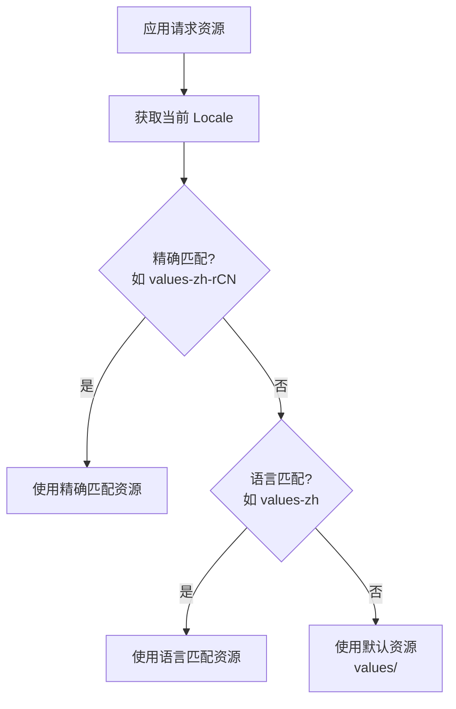
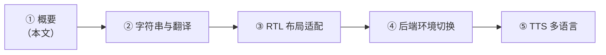

# 国际化概要

## 核心原理

### 资源限定符机制

Android 国际化的基石是 **资源限定符（Resource Qualifiers）** 机制。系统根据设备当前的 `Locale` 自动选择最匹配的资源目录：

```
res/
├── values/              # 默认（通常为英文）
│   └── strings.xml
├── values-zh-rCN/       # 简体中文
│   └── strings.xml
├── values-ar/           # 阿拉伯语
│   └── strings.xml
├── drawable/            # 默认图片资源
│   └── logo.png
├── drawable-ldrtl/      # RTL 布局专用图片
│   └── arrow.png
└── drawable-zh-rCN/     # 中文专用图片
    └── banner.png
```

### Locale 解析流程



### Configuration 与 Context 语言切换

Android 的语言信息存储在 `Configuration` 对象中，通过 `Context` 传递给各组件。切换语言的本质是：**更新 Configuration 中的 Locale，并用新 Configuration 创建新的 Context**。

- **Application 级别**：影响全局，需在 `attachBaseContext` 中拦截
- **Activity 级别**：仅影响当前 Activity，需配合 `recreate()` 刷新 UI

## 国际化的完整范畴

国际化（i18n）远不止文本翻译，完整范畴包括：

| 维度 | 说明 | 示例 |
|------|------|------|
| **文本翻译** | 界面字符串多语言 | strings.xml 资源文件 |
| **RTL 布局** | 从右向左书写语言的 UI 适配 | 阿拉伯语、希伯来语 |
| **日期格式** | 不同地区日期表示方式 | 2026/04/06 vs 06.04.2026 |
| **数字格式** | 千位分隔符、小数点符号 | 1,000.00 vs 1.000,00 |
| **货币格式** | 货币符号与位置 | $100 vs 100€ |
| **时区处理** | 跨时区时间显示与转换 | UTC+8 vs UTC-5 |
| **文化差异** | 颜色含义、图标隐喻、内容合规 | 红色在不同文化中的含义 |

## 发展趋势

| 技术 | 说明 | 最低版本 |
|------|------|----------|
| **App Bundle 按语言分包** | 仅下载用户所需语言资源，减小安装包体积 | Android 5.0+ (Play Store) |
| **Per-app Language Preferences** | 系统级别的应用内语言设置，无需应用自行实现切换逻辑 | Android 13 (API 33) |
| **ICU4J** | Android 平台内置的 ICU 库，提供强大的国际化格式化能力 | Android 7.0 (API 24) |
| **Jetpack Compose 国际化** | Compose 中的资源访问方式（`stringResource()`） | Compose 1.0+ |

## 主流方案与工具对比

| 工具 | 特点 | 适合场景 | 价格 |
|------|------|----------|------|
| **手动管理** | 直接编辑 strings.xml | 语言少（≤3）、团队小 | 免费 |
| **Crowdin** | 社区翻译、GitHub 集成好 | 开源项目、中大型团队 | 免费/付费 |
| **Lokalise** | 开发者体验好、SDK 支持 OTA 更新 | 中大型商业项目 | 付费 |
| **Phrase** | 工作流完善、质量检查强 | 企业级多平台项目 | 付费 |
| **Transifex** | 历史悠久、API 丰富 | 大型开源/商业项目 | 免费/付费 |

**选型建议**：语言 ≤3 且变更少时手动管理即可；需要协作翻译或持续迭代时，优先考虑 Crowdin（性价比高）或 Lokalise（开发体验好）。

## 快速上手路径



1. **先读概要**（本文）：建立全局认知
2. **字符串与翻译**：掌握最基础也最高频的国际化需求
3. **RTL 布局适配**：如果产品涉及阿拉伯语等 RTL 语言，必读
4. **后端环境切换**：多区域部署时的后端地址管理策略
5. **TTS 多语言**：涉及语音播报功能时参考
