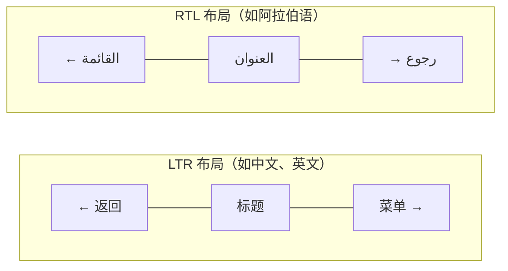

# RTL 布局适配

## RTL 基本概念

RTL（Right-to-Left）指从右向左书写的语言体系。在 Android 国际化中，如果产品需要支持以下语言，就必须进行 RTL 适配：

| 语言 | 代码 | 使用地区 |
|------|------|----------|
| 阿拉伯语 | `ar` | 中东、北非 |
| 希伯来语 | `he` / `iw` | 以色列 |
| 波斯语（法尔西语） | `fa` | 伊朗 |
| 乌尔都语 | `ur` | 巴基斯坦、印度 |
| 维吾尔语 | `ug` | 中国新疆 |

RTL 布局下，**整个 UI 会水平镜像翻转**：



## Android RTL 支持机制

### 启用 RTL 支持

在 `AndroidManifest.xml` 中声明：

```xml
<application
    android:supportsRtl="true"
    ... >
```

> **注意**：`targetSdkVersion >= 17`（Android 4.2）时该属性才生效。建议所有新项目默认开启。

### LayoutDirection

Android 通过 `View.LAYOUT_DIRECTION_LTR` 和 `View.LAYOUT_DIRECTION_RTL` 控制布局方向。系统会根据当前 Locale 自动设置，也支持手动指定：

```kotlin
// 获取当前布局方向
val isRtl = ViewCompat.getLayoutDirection(view) == ViewCompat.LAYOUT_DIRECTION_RTL

// 手动设置布局方向（通常不需要）
ViewCompat.setLayoutDirection(view, ViewCompat.LAYOUT_DIRECTION_RTL)
```

## 布局适配要点

### 1. 使用 start/end 替代 left/right

这是 RTL 适配最基础也最重要的一步。`start`/`end` 会随布局方向自动翻转：

```xml
<!-- ❌ 固定方向，RTL 下不会翻转 -->
<TextView
    android:layout_marginLeft="16dp"
    android:layout_marginRight="8dp"
    android:paddingLeft="12dp"
    android:paddingRight="12dp"
    android:gravity="left" />

<!-- ✅ 随布局方向自动适配 -->
<TextView
    android:layout_marginStart="16dp"
    android:layout_marginEnd="8dp"
    android:paddingStart="12dp"
    android:paddingEnd="12dp"
    android:gravity="start" />
```

**需要替换的属性清单**：

| 旧属性 | 新属性 |
|--------|--------|
| `layout_marginLeft` | `layout_marginStart` |
| `layout_marginRight` | `layout_marginEnd` |
| `paddingLeft` | `paddingStart` |
| `paddingRight` | `paddingEnd` |
| `layout_alignParentLeft` | `layout_alignParentStart` |
| `layout_alignParentRight` | `layout_alignParentEnd` |
| `layout_toLeftOf` | `layout_toStartOf` |
| `layout_toRightOf` | `layout_toEndOf` |
| `gravity="left"` | `gravity="start"` |
| `gravity="right"` | `gravity="end"` |

### 2. drawableStart / drawableEnd

图标位置同样需要适配：

```xml
<!-- ❌ 不会随 RTL 翻转 -->
<TextView
    android:drawableLeft="@drawable/ic_arrow"
    android:drawablePadding="8dp" />

<!-- ✅ 自动适配方向 -->
<TextView
    android:drawableStart="@drawable/ic_arrow"
    android:drawablePadding="8dp" />
```

### 3. ConstraintLayout 的 RTL 友好特性

ConstraintLayout 天然对 RTL 友好，其约束系统使用 `start`/`end` 语义：

```xml
<androidx.constraintlayout.widget.ConstraintLayout
    android:layout_width="match_parent"
    android:layout_height="wrap_content">

    <ImageView
        android:id="@+id/avatar"
        android:layout_width="48dp"
        android:layout_height="48dp"
        app:layout_constraintStart_toStartOf="parent"
        app:layout_constraintTop_toTopOf="parent"
        android:layout_marginStart="16dp" />

    <TextView
        android:id="@+id/name"
        android:layout_width="0dp"
        android:layout_height="wrap_content"
        app:layout_constraintStart_toEndOf="@id/avatar"
        app:layout_constraintEnd_toStartOf="@id/arrow"
        android:layout_marginStart="12dp"
        android:layout_marginEnd="12dp"
        android:textAlignment="viewStart" />

    <ImageView
        android:id="@+id/arrow"
        android:layout_width="24dp"
        android:layout_height="24dp"
        app:layout_constraintEnd_toEndOf="parent"
        app:layout_constraintTop_toTopOf="parent"
        android:layout_marginEnd="16dp"
        android:src="@drawable/ic_arrow_forward" />

</androidx.constraintlayout.widget.ConstraintLayout>
```

> **提示**：ConstraintLayout 中避免使用 `left`/`right` 约束，始终使用 `start`/`end`。

### 4. 自定义 View 的 RTL 适配

自定义绘制的 View 需要手动处理布局方向：

```kotlin
class CustomProgressBar @JvmOverloads constructor(
    context: Context,
    attrs: AttributeSet? = null,
    defStyleAttr: Int = 0
) : View(context, attrs, defStyleAttr) {

    private val paint = Paint(Paint.ANTI_ALIAS_FLAG)

    override fun onDraw(canvas: Canvas) {
        super.onDraw(canvas)
        val isRtl = layoutDirection == LAYOUT_DIRECTION_RTL

        if (isRtl) {
            // RTL 模式：进度条从右向左绘制
            val startX = width.toFloat()
            val endX = width * (1 - progress)
            canvas.drawRect(endX, 0f, startX, height.toFloat(), paint)
        } else {
            // LTR 模式：进度条从左向右绘制
            val endX = width * progress
            canvas.drawRect(0f, 0f, endX, height.toFloat(), paint)
        }
    }

    /**
     * Canvas 级别的镜像翻转（适用于复杂绘制）
     */
    private fun drawWithRtlSupport(canvas: Canvas, block: (Canvas) -> Unit) {
        val isRtl = layoutDirection == LAYOUT_DIRECTION_RTL
        if (isRtl) {
            canvas.save()
            canvas.scale(-1f, 1f, width / 2f, height / 2f)
            block(canvas)
            canvas.restore()
        } else {
            block(canvas)
        }
    }

    private var progress: Float = 0.5f
}
```

## 资源限定符

Android 提供 RTL 专用资源限定符 `ldrtl`（Layout Direction RTL）：

```
res/
├── values/
│   └── dimens.xml              # 默认尺寸
├── values-ldrtl/
│   └── dimens.xml              # RTL 专用尺寸（如不对称间距）
├── drawable/
│   └── ic_arrow.xml            # 默认方向图标
└── drawable-ldrtl/
    └── ic_arrow.xml            # RTL 翻转后的图标
```

> 对于有方向性的图标（箭头、进度条等），可以提供 `drawable-ldrtl/` 版本，或使用 `android:autoMirrored="true"` 自动镜像：

```xml
<!-- res/drawable/ic_arrow_forward.xml -->
<vector
    android:width="24dp"
    android:height="24dp"
    android:viewportWidth="24"
    android:viewportHeight="24"
    android:autoMirrored="true">
    <path
        android:fillColor="#000000"
        android:pathData="M12,4l-1.41,1.41L16.17,11H4v2h12.17l-5.58,5.59L12,20l8,-8z"/>
</vector>
```

## 运行时检测与处理 RTL

```kotlin
/**
 * RTL 布局工具类
 */
object RtlUtils {

    /**
     * 判断当前 Context 是否处于 RTL 模式
     */
    fun isRtl(context: Context): Boolean {
        return context.resources.configuration.layoutDirection == View.LAYOUT_DIRECTION_RTL
    }

    /**
     * 判断指定 Locale 是否为 RTL 语言
     */
    fun isRtlLocale(locale: Locale): Boolean {
        return TextUtilsCompat.getLayoutDirectionFromLocale(locale) == ViewCompat.LAYOUT_DIRECTION_RTL
    }

    /**
     * 根据布局方向返回对应的值
     * 例如：选择不同方向的动画、间距等
     */
    fun <T> resolveByDirection(context: Context, ltrValue: T, rtlValue: T): T {
        return if (isRtl(context)) rtlValue else ltrValue
    }

    /**
     * 动态设置 View 的水平翻转（用于不支持 autoMirrored 的场景）
     */
    fun mirrorViewIfRtl(view: View) {
        if (isRtl(view.context)) {
            view.scaleX = -1f
        }
    }
}
```

## 测试方法

### 1. 开发者选项强制 RTL

**设置 -> 开发者选项 -> 强制使用从右到左的布局方向**

这是最快速的测试方式，无需切换系统语言即可验证 RTL 布局效果。

### 2. 伪语言测试（Pseudolocales）

Android 提供两种伪语言帮助测试国际化：

| 伪语言 | 代码 | 用途 |
|--------|------|------|
| **Pseudo English (Accented)** | `en-XA` | 替换字符为带重音的变体，检测硬编码字符串 |
| **Pseudo English (Bidi)** | `ar-XB` | 模拟 RTL 布局，用 ASCII 字符显示 |

启用方式：

```groovy
// build.gradle
android {
    buildTypes {
        debug {
            pseudoLocalesEnabled = true
        }
    }
}
```

启用后可在系统语言设置中选择这两种伪语言。

### 3. 自动化检查

```kotlin
// 在 UI 测试中验证 RTL 布局
@Test
fun testRtlLayout() {
    // 强制 RTL 模式
    val config = Configuration().apply {
        setLayoutDirection(Locale("ar"))
    }
    val rtlContext = context.createConfigurationContext(config)

    // 验证 View 的布局方向
    val view = LayoutInflater.from(rtlContext)
        .inflate(R.layout.item_list, null)

    assertEquals(
        View.LAYOUT_DIRECTION_RTL,
        view.layoutDirection
    )
}
```

### 4. Lint 检查

Android Lint 提供 `RtlHardcoded` 检查，可检测使用 `left`/`right` 而非 `start`/`end` 的情况：

```bash
./gradlew lint
# 检查报告中搜索 "RtlHardcoded"
```

## 常见坑点

### 1. ViewPager / RecyclerView 滑动方向

`ViewPager2` 默认会随 RTL 翻转滑动方向，但 `ViewPager`（已废弃）不会。如果使用旧版 ViewPager，需要手动处理：

```kotlin
// ViewPager2 天然支持 RTL，无需额外处理
// 如果需要强制 LTR（如相册浏览），显式设置：
viewPager2.layoutDirection = View.LAYOUT_DIRECTION_LTR
```

### 2. 动画方向

平移动画、滑入动画等需要根据布局方向调整：

```kotlin
val slideIn = if (RtlUtils.isRtl(context)) {
    // RTL：从左侧滑入（视觉上的"右侧"）
    TranslateAnimation(-width.toFloat(), 0f, 0f, 0f)
} else {
    // LTR：从右侧滑入
    TranslateAnimation(width.toFloat(), 0f, 0f, 0f)
}
```

### 3. 不应翻转的元素

并非所有内容都要 RTL 翻转，以下场景应保持 LTR：

- **电话号码**：始终从左到右显示
- **时间戳**：12:30 不应变成 03:21
- **进度条**：某些场景下进度条方向不应改变
- **媒体播放控件**：播放/快进按钮顺序通常保持 LTR

```xml
<!-- 强制某个 View 保持 LTR -->
<TextView
    android:layoutDirection="ltr"
    android:textDirection="ltr"
    android:text="@string/phone_number" />
```

### 4. Drawable 箭头图标未翻转

使用 `android:autoMirrored="true"` 或提供 `drawable-ldrtl/` 版本。注意并非所有图标都需要翻转（如对勾 ✓、加号 + 不需要）。

## 踩坑记录

> 此区域供团队成员补充项目中遇到的真实案例。

| 日期 | 记录人 | 问题描述 | 解决方案 |
|------|--------|----------|----------|
| | | | |

## 参考资料

- [Android 官方文档：RTL 支持](https://developer.android.com/guide/topics/resources/bidirectional-text)
- [Material Design 双向性指南](https://m3.material.io/foundations/layout/understanding-layout/overview)
- [Android RTL 完全指南（Blog）](https://medium.com/google-developers/rtl-support-on-android-here-is-all-you-need-to-know-b592f8d0e0a2)
- [Android 开发者文档：伪语言](https://developer.android.com/guide/topics/resources/pseudolocales)
