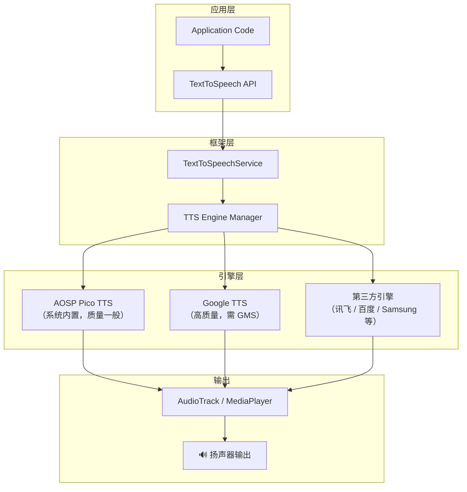
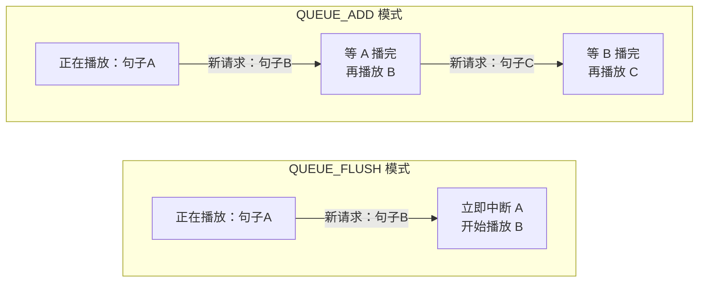

# TTS 多语言语音合成

## Android TTS 引擎架构



**关键点**：
- TTS 是一个 **服务端架构**，应用通过 `TextToSpeech` API 与系统 TTS 引擎通信
- 设备上可安装多个引擎，用户在系统设置中选择默认引擎
- 不同引擎支持的语言和音质差异巨大

## TextToSpeech API 核心用法

### 初始化与引擎选择

```kotlin
/**
 * TTS 管理器
 * 封装 TextToSpeech API，处理初始化、语言设置、朗读控制等
 */
class TtsManager(private val context: Context) {

    private var tts: TextToSpeech? = null
    private var isInitialized = false
    private var pendingText: String? = null
    private var pendingLocale: Locale? = null

    /**
     * 初始化状态监听器
     */
    var onInitListener: ((Boolean) -> Unit)? = null

    /**
     * 朗读进度监听器
     */
    var onProgressListener: ((String, Int, Int) -> Unit)? = null

    /**
     * 初始化 TTS 引擎
     * @param enginePackage 指定引擎包名，null 则使用系统默认引擎
     */
    fun initialize(enginePackage: String? = null) {
        val initListener = TextToSpeech.OnInitListener { status ->
            isInitialized = (status == TextToSpeech.SUCCESS)
            if (isInitialized) {
                setupUtteranceListener()
                // 处理初始化完成前积压的请求
                pendingLocale?.let { setLanguage(it) }
                pendingText?.let { speak(it) }
                pendingLocale = null
                pendingText = null
            }
            onInitListener?.invoke(isInitialized)
        }

        tts = if (enginePackage != null) {
            TextToSpeech(context, initListener, enginePackage)
        } else {
            TextToSpeech(context, initListener)
        }
    }

    /**
     * 设置朗读语言
     * @return 语言是否设置成功
     */
    fun setLanguage(locale: Locale): Boolean {
        val engine = tts ?: run {
            pendingLocale = locale
            return false
        }
        if (!isInitialized) {
            pendingLocale = locale
            return false
        }

        return when (engine.setLanguage(locale)) {
            TextToSpeech.LANG_AVAILABLE,
            TextToSpeech.LANG_COUNTRY_AVAILABLE,
            TextToSpeech.LANG_COUNTRY_VAR_AVAILABLE -> true
            TextToSpeech.LANG_MISSING_DATA -> {
                // 语言包未安装，引导用户下载
                promptInstallLanguageData()
                false
            }
            TextToSpeech.LANG_NOT_SUPPORTED -> {
                // 当前引擎不支持该语言
                false
            }
            else -> false
        }
    }

    /**
     * 设置语速
     * @param rate 语速倍率，1.0 为正常速度，范围建议 0.5 ~ 2.0
     */
    fun setSpeechRate(rate: Float) {
        tts?.setSpeechRate(rate.coerceIn(0.1f, 4.0f))
    }

    /**
     * 设置音调
     * @param pitch 音调，1.0 为正常音调，范围建议 0.5 ~ 2.0
     */
    fun setPitch(pitch: Float) {
        tts?.setPitch(pitch.coerceIn(0.1f, 4.0f))
    }

    /**
     * 朗读文本
     * @param text 要朗读的文本
     * @param queueMode QUEUE_FLUSH（清空队列立即播放）或 QUEUE_ADD（追加到队列）
     */
    fun speak(
        text: String,
        queueMode: Int = TextToSpeech.QUEUE_FLUSH
    ) {
        val engine = tts ?: run {
            pendingText = text
            return
        }
        if (!isInitialized) {
            pendingText = text
            return
        }

        val utteranceId = "tts_${System.currentTimeMillis()}"
        val params = Bundle().apply {
            putString(TextToSpeech.Engine.KEY_PARAM_UTTERANCE_ID, utteranceId)
        }

        engine.speak(text, queueMode, params, utteranceId)
    }

    /**
     * 停止朗读
     */
    fun stop() {
        tts?.stop()
    }

    /**
     * 释放资源（必须在不再使用时调用，避免内存泄漏）
     */
    fun shutdown() {
        tts?.stop()
        tts?.shutdown()
        tts = null
        isInitialized = false
    }

    /**
     * 设置朗读进度回调
     */
    private fun setupUtteranceListener() {
        tts?.setOnUtteranceProgressListener(object : UtteranceProgressListener() {
            override fun onStart(utteranceId: String) {
                // 开始朗读
            }

            override fun onDone(utteranceId: String) {
                // 朗读完成
            }

            @Deprecated("Deprecated in Java")
            override fun onError(utteranceId: String) {
                // 朗读出错
            }

            override fun onError(utteranceId: String, errorCode: Int) {
                // 朗读出错（带错误码）
            }

            override fun onRangeStart(utteranceId: String, frame: Int, start: Int, end: Int) {
                // 朗读进度（可用于高亮当前朗读位置）
                onProgressListener?.invoke(utteranceId, start, end)
            }
        })
    }

    /**
     * 引导用户下载 TTS 语言数据
     */
    private fun promptInstallLanguageData() {
        val intent = Intent(TextToSpeech.Engine.ACTION_INSTALL_TTS_DATA)
        intent.addFlags(Intent.FLAG_ACTIVITY_NEW_TASK)
        try {
            context.startActivity(intent)
        } catch (e: ActivityNotFoundException) {
            // 设备不支持 TTS 数据安装
        }
    }

    companion object {
        /** Google TTS 引擎包名 */
        const val ENGINE_GOOGLE = "com.google.android.tts"
        /** 三星 TTS 引擎包名 */
        const val ENGINE_SAMSUNG = "com.samsung.SMT"
    }
}
```

### 朗读队列管理



**使用场景**：
- `QUEUE_FLUSH`：用户点击新内容时，中断旧内容立即播放新内容
- `QUEUE_ADD`：连续朗读多段内容（如逐段朗读文章）

```kotlin
// 场景1：用户点击列表项，立即朗读该项内容
ttsManager.speak("这是第一条新闻的标题", TextToSpeech.QUEUE_FLUSH)

// 场景2：逐段朗读整篇文章
paragraphs.forEachIndexed { index, paragraph ->
    val mode = if (index == 0) TextToSpeech.QUEUE_FLUSH else TextToSpeech.QUEUE_ADD
    ttsManager.speak(paragraph, mode)
}
```

## 多语言语音包管理

### 检测已安装语言包

```kotlin
/**
 * 获取当前 TTS 引擎支持的所有语言
 */
fun getAvailableLanguages(tts: TextToSpeech): List<Locale> {
    return if (Build.VERSION.SDK_INT >= Build.VERSION_CODES.LOLLIPOP) {
        tts.availableLanguages?.toList() ?: emptyList()
    } else {
        // 手动检查常用语言列表
        listOf(
            Locale.CHINESE, Locale.ENGLISH, Locale.JAPANESE,
            Locale.KOREAN, Locale.FRENCH, Locale.GERMAN,
            Locale("ar"), Locale("es"), Locale("pt")
        ).filter { locale ->
            tts.isLanguageAvailable(locale) >= TextToSpeech.LANG_AVAILABLE
        }
    }
}

/**
 * 检查指定语言是否可用
 */
fun isLanguageSupported(tts: TextToSpeech, locale: Locale): Boolean {
    return tts.isLanguageAvailable(locale) >= TextToSpeech.LANG_AVAILABLE
}
```

### 引导用户下载语言包

```kotlin
/**
 * 打开 TTS 语言数据下载页面
 */
fun installTtsData(context: Context) {
    val intent = Intent(TextToSpeech.Engine.ACTION_INSTALL_TTS_DATA)
    try {
        context.startActivity(intent)
    } catch (e: ActivityNotFoundException) {
        // 引导用户到应用商店安装 TTS 引擎
        Toast.makeText(context, "请安装 Google TTS 引擎", Toast.LENGTH_LONG).show()
        openTtsEngineInStore(context)
    }
}

/**
 * 打开应用商店的 Google TTS 页面
 */
fun openTtsEngineInStore(context: Context) {
    try {
        val intent = Intent(Intent.ACTION_VIEW).apply {
            data = Uri.parse("market://details?id=com.google.android.tts")
        }
        context.startActivity(intent)
    } catch (e: ActivityNotFoundException) {
        val intent = Intent(Intent.ACTION_VIEW).apply {
            data = Uri.parse("https://play.google.com/store/apps/details?id=com.google.android.tts")
        }
        context.startActivity(intent)
    }
}
```

### 离线 TTS 方案

```kotlin
/**
 * 检查 TTS 引擎是否支持离线模式
 * 并预下载所需语言包
 */
class OfflineTtsHelper(private val context: Context) {

    /**
     * 需要离线支持的语言列表
     */
    private val requiredLanguages = listOf(
        Locale.SIMPLIFIED_CHINESE,
        Locale.US,
        Locale.JAPANESE
    )

    /**
     * 检查并下载缺失的语言包
     */
    fun ensureOfflineLanguages(tts: TextToSpeech) {
        val missingLanguages = requiredLanguages.filter { locale ->
            tts.isLanguageAvailable(locale) == TextToSpeech.LANG_MISSING_DATA
        }

        if (missingLanguages.isNotEmpty()) {
            // 触发语言数据下载
            val intent = Intent(TextToSpeech.Engine.ACTION_INSTALL_TTS_DATA)
            intent.addFlags(Intent.FLAG_ACTIVITY_NEW_TASK)
            context.startActivity(intent)
        }
    }

    /**
     * 获取所有语言的离线状态
     */
    fun getLanguageStatus(tts: TextToSpeech): Map<Locale, Boolean> {
        return requiredLanguages.associateWith { locale ->
            tts.isLanguageAvailable(locale) >= TextToSpeech.LANG_AVAILABLE
        }
    }
}
```

## 第三方 TTS 方案简介

| 方案 | 特点 | 适用场景 | 离线支持 |
|------|------|----------|----------|
| **科大讯飞** | 中文语音质量领先，支持多种音色和方言 | 国内项目、中文为主 | 部分支持 |
| **百度语音** | 中文质量好，SDK 集成简单 | 国内项目、快速集成 | 部分支持 |
| **Amazon Polly** | 多语言支持好，SSML 标记丰富 | 海外项目、AWS 生态 | 不支持（云端） |
| **Google Cloud TTS** | 语音质量最高（WaveNet），语言最全 | 对音质要求高的项目 | 不支持（云端） |
| **Android 系统 TTS** | 免费、无需额外 SDK、离线可用 | 基础朗读需求 | 支持 |

**选型建议**：
- 基础朗读需求：优先使用系统 TTS（零成本、离线可用）
- 中文高质量需求：科大讯飞或百度语音
- 多语言 + 高音质：Google Cloud TTS
- 已有 AWS 基础设施：Amazon Polly

## 常见坑点

### 1. 初始化异步问题

`TextToSpeech` 初始化是异步的，在 `OnInitListener` 回调前调用 `speak()` 会静默失败：

```kotlin
// ❌ 错误：初始化未完成就调用 speak
val tts = TextToSpeech(context) { status -> /* ... */ }
tts.speak("Hello", TextToSpeech.QUEUE_FLUSH, null, null) // 可能静默失败

// ✅ 正确：等初始化完成后再调用，或使用上面 TtsManager 的队列机制
ttsManager.initialize()
ttsManager.speak("Hello") // TtsManager 内部会处理初始化未完成的情况
```

### 2. 不同设备引擎差异

不同品牌设备预装的 TTS 引擎不同，能力差距很大：

| 设备 | 默认引擎 | 中文支持 | 音质 |
|------|----------|----------|------|
| Pixel | Google TTS | 好 | 高 |
| Samsung | Samsung TTS | 好 | 中高 |
| 小米/OPPO 等 | Pico TTS 或厂商定制 | 差异大 | 中低 |

**应对策略**：

```kotlin
/**
 * 获取推荐的 TTS 引擎
 * 优先选择 Google TTS，其次使用系统默认引擎
 */
fun getPreferredEngine(context: Context): String? {
    val tts = TextToSpeech(context, null)
    val engines = tts.engines

    // 优先 Google TTS
    val googleEngine = engines.find {
        it.name == "com.google.android.tts"
    }
    if (googleEngine != null) return googleEngine.name

    // 其次使用默认引擎
    return tts.defaultEngine
}
```

### 3. 语言不支持的 Fallback 策略

```kotlin
/**
 * 带 Fallback 的语言设置
 * 如果目标语言不可用，依次尝试同语族语言和英语
 */
fun setLanguageWithFallback(tts: TextToSpeech, targetLocale: Locale): Locale {
    // 尝试精确匹配
    if (tts.isLanguageAvailable(targetLocale) >= TextToSpeech.LANG_AVAILABLE) {
        tts.setLanguage(targetLocale)
        return targetLocale
    }

    // 尝试仅语言匹配（忽略地区）
    val langOnly = Locale(targetLocale.language)
    if (tts.isLanguageAvailable(langOnly) >= TextToSpeech.LANG_AVAILABLE) {
        tts.setLanguage(langOnly)
        return langOnly
    }

    // 最终回退到英语
    val fallback = Locale.US
    tts.setLanguage(fallback)
    return fallback
}
```

### 4. 内存泄漏

`TextToSpeech` 持有 `Context` 引用，如果在 Activity 中创建但未在 `onDestroy` 中释放，会导致内存泄漏：

```kotlin
class ReadAloudActivity : AppCompatActivity() {
    private lateinit var ttsManager: TtsManager

    override fun onCreate(savedInstanceState: Bundle?) {
        super.onCreate(savedInstanceState)
        ttsManager = TtsManager(applicationContext) // 使用 Application Context
        ttsManager.initialize()
    }

    override fun onDestroy() {
        super.onDestroy()
        ttsManager.shutdown() // 必须释放
    }
}
```

**推荐**：将 TTS 生命周期与 `ViewModel` 或 `LifecycleOwner` 绑定：

```kotlin
/**
 * 生命周期感知的 TTS 管理器
 */
class LifecycleAwareTtsManager(
    private val context: Context
) : DefaultLifecycleObserver {

    private val ttsManager = TtsManager(context.applicationContext)

    override fun onCreate(owner: LifecycleOwner) {
        ttsManager.initialize()
    }

    override fun onDestroy(owner: LifecycleOwner) {
        ttsManager.shutdown()
    }

    fun speak(text: String) = ttsManager.speak(text)
    fun stop() = ttsManager.stop()
    fun setLanguage(locale: Locale) = ttsManager.setLanguage(locale)
}

// 在 Activity 中使用
class ReadAloudActivity : AppCompatActivity() {
    private lateinit var tts: LifecycleAwareTtsManager

    override fun onCreate(savedInstanceState: Bundle?) {
        super.onCreate(savedInstanceState)
        tts = LifecycleAwareTtsManager(this)
        lifecycle.addObserver(tts)
    }
}
```

### 5. SSML 支持有限

Android 系统 TTS 对 SSML（语音合成标记语言）的支持因引擎而异。Google TTS 支持部分 SSML 标签，但 Pico 等引擎完全不支持：

```kotlin
// SSML 示例（仅部分引擎支持）
val ssml = """
    <speak>
        这是<emphasis level="strong">重要</emphasis>内容。
        <break time="500ms"/>
        请注意收听。
    </speak>
""".trimIndent()

// 安全做法：检测引擎是否支持，不支持则回退到纯文本
fun speakSafely(tts: TextToSpeech, ssml: String, plainText: String) {
    val result = tts.speak(ssml, TextToSpeech.QUEUE_FLUSH, null, "utterance_id")
    if (result == TextToSpeech.ERROR) {
        tts.speak(plainText, TextToSpeech.QUEUE_FLUSH, null, "utterance_id")
    }
}
```

## 踩坑记录

> 此区域供团队成员补充项目中遇到的真实案例。

| 日期 | 记录人 | 问题描述 | 解决方案 |
|------|--------|----------|----------|
| | | | |

## 参考资料

- [Android 官方文档：TextToSpeech](https://developer.android.com/reference/android/speech/tts/TextToSpeech)
- [Android 官方文档：TextToSpeechService](https://developer.android.com/reference/android/speech/tts/TextToSpeechService)
- [Google TTS on Play Store](https://play.google.com/store/apps/details?id=com.google.android.tts)
- [科大讯飞 Android TTS SDK](https://www.xfyun.cn/doc/tts/online_tts/Android-SDK.html)
- [Amazon Polly 开发者指南](https://docs.aws.amazon.com/polly/latest/dg/what-is.html)
- [Google Cloud Text-to-Speech](https://cloud.google.com/text-to-speech/docs)
- [W3C SSML 规范](https://www.w3.org/TR/speech-synthesis11/)
