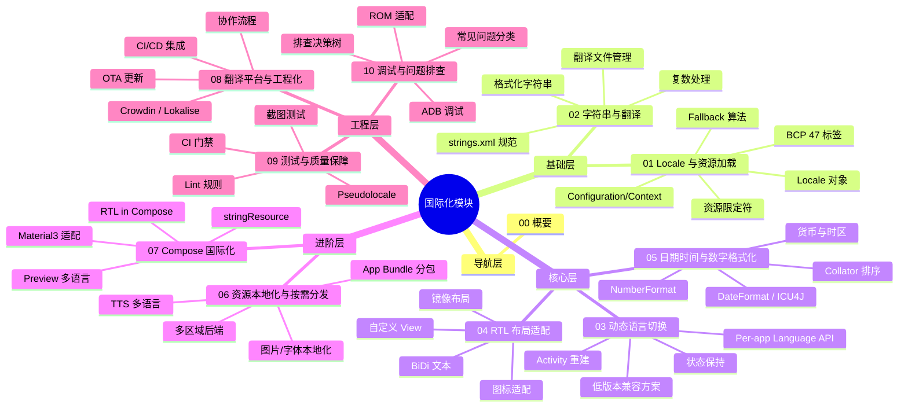
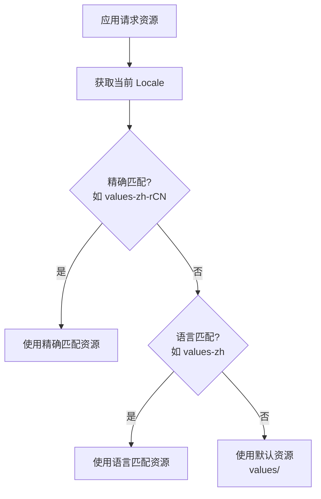
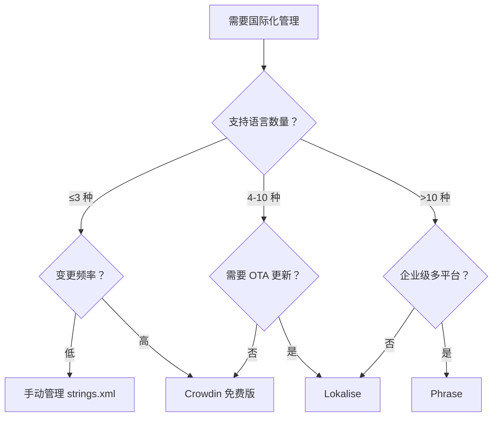
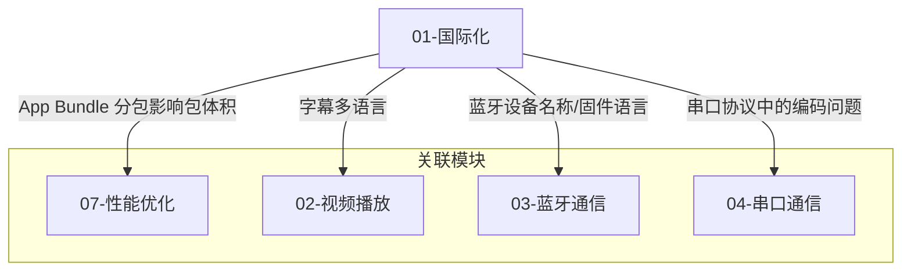

# 国际化 - 概要

## 模块定位

国际化（Internationalization，简称 i18n）是 Android 应用走向全球市场的基础能力。一个设计良好的国际化架构不仅能让应用无缝支持多种语言和地区，还能显著降低后续新增语言的边际成本。本模块系统性地覆盖从 Locale 机制、资源管理、动态切换，到 RTL 适配、格式化、工程化的完整知识链条，帮助团队建立"能适配、能切换、能测试、能持续交付"的国际化能力。

| 领域 | 说明 | 对应文件 |
|------|------|----------|
| Locale 与资源加载机制 | Locale 对象、BCP 47、资源限定符、Fallback 算法、Configuration/Context | `01-Locale与资源加载机制` |
| 字符串与翻译管理 | strings.xml 规范、复数处理、格式化字符串、翻译文件管理 | `02-字符串与翻译管理` |
| 动态语言切换 | Per-app Language API、低版本兼容、Activity 重建与状态保持 | `03-动态语言切换` |
| RTL 布局适配 | 从右到左布局、BiDi 文本、图标镜像、自定义 View 适配 | `04-RTL布局适配` |
| 日期时间与数字格式化 | ICU4J、日期/数字/货币格式、时区、排序 | `05-日期时间与数字格式化` |
| 资源本地化与按需分发 | 图片/字体/TTS 本地化、App Bundle 分包、多区域后端 | `06-资源本地化与按需分发` |
| Compose 国际化实践 | stringResource、RTL in Compose、Preview 多语言、Material3 | `07-Compose国际化实践` |
| 翻译平台与工程化集成 | Crowdin/Lokalise、CI/CD 集成、OTA 更新、协作流程 | `08-翻译平台与工程化集成` |
| 多语言测试与质量保障 | Pseudolocale、Lint 规则、截图测试、CI 门禁 | `09-多语言测试与质量保障` |
| 调试与常见问题排查 | ADB 调试、常见问题分类、设备/ROM 适配、排查决策树 | `10-调试与常见问题排查` |

## 知识全景图



## 核心原理

### 资源限定符机制

Android 国际化的基石是**资源限定符（Resource Qualifiers）** 机制。系统根据设备当前的 `Locale` 自动选择最匹配的资源目录：

```
res/
├── values/              # 默认（通常为英文）
│   └── strings.xml
├── values-zh-rCN/       # 简体中文
│   └── strings.xml
├── values-ar/           # 阿拉伯语
│   └── strings.xml
├── drawable/            # 默认图片资源
│   └── logo.png
├── drawable-ldrtl/      # RTL 布局专用图片
│   └── arrow.png
└── drawable-zh-rCN/     # 中文专用图片
    └── banner.png
```

### Locale 解析流程



### Configuration 与 Context 语言切换

Android 的语言信息存储在 `Configuration` 对象中，通过 `Context` 传递给各组件。切换语言的本质是：**更新 Configuration 中的 Locale，并用新 Configuration 创建新的 Context**。

- **Application 级别**：影响全局，需在 `attachBaseContext` 中拦截
- **Activity 级别**：仅影响当前 Activity，需配合 `recreate()` 刷新 UI
- **Android 13+**：系统原生支持 Per-app Language Preferences，无需手动管理

> 详细的 Locale 机制与源码分析参见 `01-Locale与资源加载机制`。

## 国际化的完整范畴

国际化（i18n）远不止文本翻译，完整范畴包括：

| 维度 | 说明 | 示例 | 详见 |
|------|------|------|------|
| **文本翻译** | 界面字符串多语言 | strings.xml 资源文件 | `02-字符串与翻译管理` |
| **RTL 布局** | 从右向左书写语言的 UI 适配 | 阿拉伯语、希伯来语 | `04-RTL布局适配` |
| **日期格式** | 不同地区日期表示方式 | 2026/04/06 vs 06.04.2026 | `05-日期时间与数字格式化` |
| **数字格式** | 千位分隔符、小数点符号 | 1,000.00 vs 1.000,00 | `05-日期时间与数字格式化` |
| **货币格式** | 货币符号与位置 | $100 vs 100€ | `05-日期时间与数字格式化` |
| **时区处理** | 跨时区时间显示与转换 | UTC+8 vs UTC-5 | `05-日期时间与数字格式化` |
| **资源本地化** | 图片、字体、音频的本地化 | 含文字的图片按语言替换 | `06-资源本地化与按需分发` |
| **文化差异** | 颜色含义、图标隐喻、内容合规 | 红色在不同文化中的含义 | `06-资源本地化与按需分发` |

## 发展趋势

| 技术 | 说明 | 最低版本 |
|------|------|----------|
| **Per-app Language Preferences** | 系统级别的应用内语言设置，无需应用自行实现切换逻辑 | Android 13 (API 33) |
| **App Bundle 按语言分包** | 仅下载用户所需语言资源，减小安装包体积 | Android 5.0+ (Play Store) |
| **ICU4J** | Android 平台内置的 ICU 库，提供强大的国际化格式化能力 | Android 7.0 (API 24) |
| **Jetpack Compose 国际化** | Compose 中的资源访问方式（`stringResource()`） | Compose 1.0+ |
| **Grammatical Inflection API** | 根据语法性别自动调整翻译措辞 | Android 14 (API 34) |
| **AppCompatDelegate 兼容** | Per-app Language 向下兼容到 API 24 | AppCompat 1.6+ |

## 主流方案与工具对比

| 工具 | 特点 | 适合场景 | 价格 |
|------|------|----------|------|
| **手动管理** | 直接编辑 strings.xml | 语言少（≤3）、团队小 | 免费 |
| **Crowdin** | 社区翻译、GitHub 集成好 | 开源项目、中大型团队 | 免费/付费 |
| **Lokalise** | 开发者体验好、SDK 支持 OTA 更新 | 中大型商业项目 | 付费 |
| **Phrase** | 工作流完善、质量检查强 | 企业级多平台项目 | 付费 |
| **Transifex** | 历史悠久、API 丰富 | 大型开源/商业项目 | 免费/付费 |

### 选型建议



**选型建议**：语言 ≤3 且变更少时手动管理即可；需要协作翻译或持续迭代时，优先考虑 Crowdin（性价比高）或 Lokalise（开发体验好）。

## 模块间关系



## 推荐阅读路径

### 新人入门路径

适合刚接触 Android 国际化的开发者，按顺序阅读：


1. **概要**（本文）— 建立国际化全局认知
2. **Locale 与资源加载机制** — 理解 Android i18n 的底层原理
3. **字符串与翻译管理** — 掌握最基础也最高频的国际化需求
4. **动态语言切换** — 实现应用内语言切换功能
5. **RTL 布局适配** — 如果产品涉及阿拉伯语等 RTL 语言，必读

### 按需深入路径

已有基础的开发者，根据当前任务选择对应文件：

| 你的任务 | 推荐阅读 |
|----------|----------|
| 理解 Android 资源加载原理 | `01-Locale与资源加载机制` |
| 规范 strings.xml 管理 | `02-字符串与翻译管理` |
| 实现应用内语言切换 | `03-动态语言切换` |
| 适配阿拉伯语等 RTL 语言 | `04-RTL布局适配` |
| 处理日期/数字/货币格式 | `05-日期时间与数字格式化` |
| 管理图片/字体/TTS 本地化 | `06-资源本地化与按需分发` |
| 在 Compose 中做国际化 | `07-Compose国际化实践` |
| 接入翻译平台或搭建 CI 流程 | `08-翻译平台与工程化集成` |
| 建立多语言测试体系 | `09-多语言测试与质量保障` |
| 排查国际化相关 Bug | `10-调试与常见问题排查` |

## 踩坑记录

> 此区域供团队成员补充项目中遇到的真实案例。

| 日期 | 记录人 | 问题描述 | 解决方案 |
|------|--------|----------|----------|
| | | | |

## 参考资料

- [Android 官方文档 - 支持不同语言和文化](https://developer.android.com/guide/topics/resources/localization)
- [Android 13 Per-app Language Preferences](https://developer.android.com/guide/topics/resources/app-languages)
- [ICU4J on Android](https://developer.android.com/guide/topics/resources/icu4j-framework)
- [AppCompatDelegate.setApplicationLocales()](https://developer.android.com/reference/androidx/appcompat/app/AppCompatDelegate#setApplicationLocales(androidx.core.os.LocaleListCompat))
- [Android App Bundle 文档](https://developer.android.com/guide/app-bundle)
- [Crowdin Android 集成指南](https://support.crowdin.com/android-sdk/)
- [Unicode CLDR - 通用语言环境数据仓库](https://cldr.unicode.org/)
