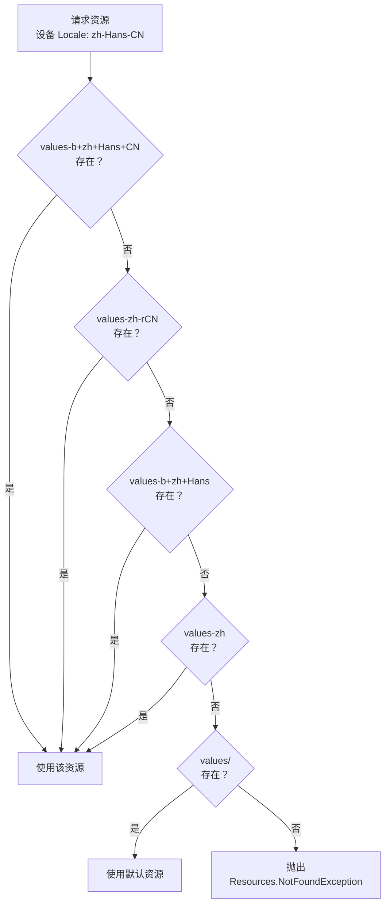
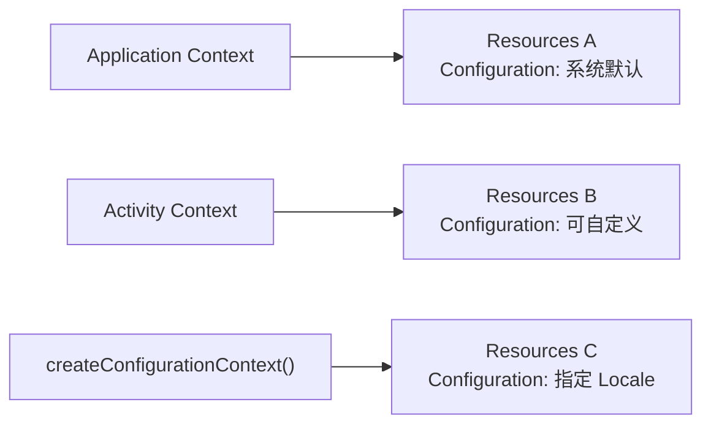
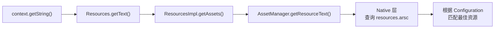

# Locale 与资源加载机制

## Locale 基础

### Locale 对象结构

`java.util.Locale` 是 Android 国际化的核心数据结构，由以下四个要素组成：

| 要素 | 说明 | 示例 |
|------|------|------|
| **language** | ISO 639 语言代码（2-3 位小写字母） | `zh`、`en`、`ar` |
| **script** | ISO 15924 书写系统（4 位，首字母大写） | `Hans`（简体）、`Hant`（繁体）、`Latn`（拉丁） |
| **country/region** | ISO 3166 国家/地区代码（2 位大写字母） | `CN`、`US`、`SA` |
| **variant** | 方言或变体标识（较少使用） | `POSIX`、`polyton` |

```kotlin
// 构造 Locale 的几种方式
val locale1 = Locale("zh", "CN")                    // language + country
val locale2 = Locale.forLanguageTag("zh-Hans-CN")    // BCP 47 标签（推荐）
val locale3 = Locale.SIMPLIFIED_CHINESE              // 预定义常量

// 获取各要素
locale2.language   // "zh"
locale2.script     // "Hans"
locale2.country    // "CN"
locale2.toLanguageTag() // "zh-Hans-CN"
```

### BCP 47 语言标签规范

BCP 47（IETF Best Current Practice 47）是国际通用的语言标签标准，Android 从 API 21 开始全面支持。

**标签格式**：`language[-script][-region][-variant]`

| 标签 | 含义 |
|------|------|
| `zh-Hans-CN` | 简体中文（中国大陆） |
| `zh-Hant-TW` | 繁体中文（台湾） |
| `en-US` | 英语（美国） |
| `ar-SA` | 阿拉伯语（沙特） |
| `sr-Latn` | 塞尔维亚语（拉丁字母） |
| `sr-Cyrl` | 塞尔维亚语（西里尔字母） |
| `pt-BR` | 葡萄牙语（巴西） |
| `pt-PT` | 葡萄牙语（葡萄牙） |

> **注意**：在 Android 资源目录中，BCP 47 标签使用 `b+` 前缀格式：`values-b+zh+Hans+CN`、`values-b+sr+Latn`。传统格式 `values-zh-rCN` 仍然支持但不支持 script 部分。

### Locale 与 LocaleList

Android 7.0（API 24）引入了 `LocaleList`，支持用户设置多语言偏好列表。系统按优先级从高到低依次尝试匹配资源。

```kotlin
// 获取用户的语言偏好列表
val localeList = if (Build.VERSION.SDK_INT >= Build.VERSION_CODES.N) {
    context.resources.configuration.locales  // LocaleList
} else {
    @Suppress("DEPRECATION")
    LocaleListCompat.create(context.resources.configuration.locale)
}

// 遍历偏好列表
for (i in 0 until localeList.size()) {
    val locale = localeList[i]
    Log.d("i18n", "Preference #$i: ${locale.toLanguageTag()}")
}
```

**多语言偏好的实际效果**：假设用户设置了 `[法语, 英语, 中文]`，而应用仅支持英语和中文，系统会自动跳过法语，选择英语资源。

## 资源限定符体系

### 限定符类型与优先级

Android 资源系统支持多种限定符，与国际化相关的主要有：

| 优先级 | 限定符 | 说明 | 目录示例 |
|:------:|--------|------|----------|
| 1 | MCC/MNC | 移动国家代码/移动网络代码 | `values-mcc460` |
| 2 | **语言和区域** | 语言 + 可选的脚本/区域 | `values-zh-rCN` |
| 3 | **布局方向** | LTR 或 RTL | `values-ldrtl` |
| 4 | 最小宽度 | 屏幕最小宽度 | `values-sw600dp` |
| 5 | 可用宽度/高度 | 屏幕可用尺寸 | `values-w720dp` |
| 6 | 屏幕尺寸 | small/normal/large/xlarge | `values-large` |
| 7 | 屏幕密度 | ldpi/mdpi/hdpi/xhdpi/xxhdpi | `drawable-xxhdpi` |
| 8 | 夜间模式 | 日间/夜间 | `values-night` |
| 9 | API 级别 | 最低 API 版本 | `values-v26` |

> 语言限定符在优先级中排名极高（仅次于 MCC/MNC），这意味着语言匹配会优先于屏幕密度、尺寸等限定符。

### 资源目录命名规范

| 格式 | 说明 | 示例 |
|------|------|------|
| `values-xx` | 仅语言 | `values-zh`、`values-ar` |
| `values-xx-rYY` | 语言 + 区域（传统格式） | `values-zh-rCN`、`values-pt-rBR` |
| `values-b+xx+Ssss` | 语言 + 脚本（BCP 47） | `values-b+zh+Hans`、`values-b+sr+Latn` |
| `values-b+xx+Ssss+YY` | 语言 + 脚本 + 区域 | `values-b+zh+Hans+CN` |

```
res/
├── values/                  # 默认资源（必须包含所有 key）
├── values-en/               # 英语（如果默认非英语）
├── values-zh-rCN/           # 简体中文
├── values-zh-rTW/           # 繁体中文（台湾）
├── values-zh-rHK/           # 繁体中文（香港）
├── values-ar/               # 阿拉伯语
├── values-ja/               # 日语
├── values-b+sr+Latn/        # 塞尔维亚语（拉丁字母）
└── values-b+sr+Cyrl/        # 塞尔维亚语（西里尔字母）
```

### 限定符组合规则

多个限定符可以叠加，用连字符分隔，但**必须按照 Android 官方规定的优先级顺序排列**：

```
values-zh-rCN-land-night     # ✅ 正确：语言 > 方向 > 夜间模式
values-night-zh-rCN-land     # ❌ 错误：顺序不对，不会被识别
```

## 资源匹配与 Fallback 算法

### 精确匹配 vs 最佳匹配

Android 的资源匹配采用**逐步淘汰算法**，而非简单的精确匹配。系统按限定符优先级逐一筛选，每一轮淘汰不匹配的候选目录，最终留下最佳匹配。

假设设备 Locale 为 `zh-Hans-CN`，系统按以下顺序尝试：

1. `values-b+zh+Hans+CN` — 精确匹配（language + script + region）
2. `values-zh-rCN` — 语言 + 区域匹配
3. `values-b+zh+Hans` — 语言 + 脚本匹配
4. `values-zh` — 仅语言匹配
5. `values` — 默认资源

### Fallback 链路



### 常见 Fallback 失败场景

**场景 1：默认资源缺失导致 Crash**

```xml
<!-- values-zh-rCN/strings.xml 有这个 key -->
<string name="feature_new_label">新功能</string>

<!-- values/strings.xml 没有这个 key -->
<!-- 当设备语言为英文时，找不到资源，应用崩溃 -->
```

**原则**：默认资源目录 `values/strings.xml` 必须包含所有 key，作为最终兜底。

**场景 2：语言 + 区域与仅语言的歧义**

当存在 `values-zh-rTW`（繁体中文台湾）但不存在 `values-zh-rCN`（简体中文大陆）时，大陆用户会 fallback 到 `values-zh`（如果存在）或 `values`（默认），而**不会** fallback 到 `values-zh-rTW`。

## Configuration 与 Context

### Configuration 对象中的语言信息

`Configuration` 是 Android 系统存储设备配置信息的容器，语言相关信息存储在其中：

```kotlin
// API 24+ 获取 LocaleList
val locales: LocaleList = context.resources.configuration.locales

// API 17-23 获取单个 Locale（已废弃但仍可用）
@Suppress("DEPRECATION")
val locale: Locale = context.resources.configuration.locale
```

| API | 属性 | 类型 | 说明 |
|-----|------|------|------|
| 1+ | `locale` | `Locale` | 已废弃，仅返回首选语言 |
| 17+ | `getLocales()` | `LocaleList` | 返回用户完整的语言偏好列表 |
| 17+ | `setLocale()` | - | 设置单个 Locale |
| 24+ | `setLocales()` | - | 设置完整的 LocaleList |

### Context 与资源加载的关系

Android 中每个 `Context` 都持有自己的 `Resources` 实例，而 `Resources` 又绑定了特定的 `Configuration`。这意味着不同 Context 可以加载不同语言的资源。



**关键区别**：

- **Application Context**：跟随系统语言，在低版本（< Android 13）中不会自动更新为应用内切换的语言
- **Activity Context**：通过 `attachBaseContext` 拦截可以注入自定义 Locale

### createConfigurationContext 原理

`createConfigurationContext()` 是实现语言切换的核心 API，它创建一个绑定了指定 Configuration 的新 Context：

```kotlin
fun createLocalizedContext(baseContext: Context, locale: Locale): Context {
    val config = Configuration(baseContext.resources.configuration)
    config.setLocale(locale)
    config.setLayoutDirection(locale)  // 同步设置布局方向（RTL/LTR）
    return baseContext.createConfigurationContext(config)
}

// 使用新 Context 获取资源
val localizedContext = createLocalizedContext(context, Locale("ar"))
val arabicString = localizedContext.getString(R.string.hello)
```

> `setLayoutDirection(locale)` 不可省略，否则 RTL 语言（如阿拉伯语）的布局方向不会正确切换。

## 源码走读

### AssetManager 资源加载链路

资源加载的核心链路如下：



1. **Resources** — 面向开发者的资源访问 API，持有 `ResourcesImpl` 引用
2. **ResourcesImpl** — 实际的资源实现层，持有 `AssetManager` 引用
3. **AssetManager** — 管理 APK 中的资源文件，在 Native 层执行资源表查询
4. **resources.arsc** — 编译后的资源表，包含所有资源的 ID、类型和值

### 资源表（resources.arsc）结构

`resources.arsc` 是 AAPT2 编译生成的二进制资源表，结构概要：

| 组成 | 说明 |
|------|------|
| **String Pool** | 所有字符串值的存储池，按语言分组 |
| **Package** | 包信息，包含资源类型和配置 |
| **Type Spec** | 资源类型规格（string、drawable 等） |
| **Type** | 特定配置下的资源条目（每个限定符组合一个 Type） |
| **Entry** | 具体的资源键值对（key = R.string.xxx, value = 字符串值） |

当应用请求 `R.string.hello` 时，AssetManager 在资源表中查找当前 Configuration 最匹配的 Type，然后从对应的 Entry 中取出值。

## 常见误区

### Locale.getDefault() vs Context 中的 Locale

```kotlin
// ❌ 常见错误：使用 Locale.getDefault()
val dateFormat = SimpleDateFormat("yyyy-MM-dd", Locale.getDefault())

// ✅ 正确做法：使用 Context 中的 Locale
val locale = context.resources.configuration.locales[0]
val dateFormat = SimpleDateFormat("yyyy-MM-dd", locale)
```

**区别**：
- `Locale.getDefault()` 返回的是 JVM 级别的默认 Locale，在应用内切换语言后可能不会更新（取决于实现方式）
- `context.resources.configuration.locales` 返回的是当前 Context 绑定的 Locale，始终与 UI 显示的语言一致

### Application Context 语言不生效

在低版本 Android（< 13）中，即使在 `Application.attachBaseContext` 中设置了 Locale，部分场景仍可能使用系统语言：

```kotlin
class MyApplication : Application() {
    override fun attachBaseContext(base: Context) {
        // 此处设置了中文
        super.attachBaseContext(LocaleHelper.wrap(base, Locale("zh", "CN")))
    }
}

// 但在某些地方直接使用 applicationContext 获取资源
// 可能因为 ResourcesManager 的缓存机制导致仍然返回系统语言的资源
val text = applicationContext.getString(R.string.hello) // 可能不是中文
```

**原因**：`ResourcesManager` 会缓存 Resources 实例。当 Configuration 的 key（包含 Locale）相同时，会复用缓存的 Resources。

**解决**：确保在获取资源时使用 Activity Context 而非 Application Context；或在 Android 13+ 使用系统 Per-app Language API。

### 资源缓存导致语言切换不刷新

```kotlin
// 语言切换后，已存在的 Resources 实例不会自动更新
// 需要通过 Activity.recreate() 重建，或手动创建新 Context

// ❌ 切换语言后直接获取资源，可能仍是旧语言
Locale.setDefault(newLocale)
val text = getString(R.string.hello)  // 旧语言

// ✅ 正确：通过新 Context 获取
val newContext = createLocalizedContext(this, newLocale)
val text = newContext.getString(R.string.hello)  // 新语言
```

## 踩坑记录

> 此区域供团队成员补充项目中遇到的真实案例。

| 日期 | 记录人 | 问题描述 | 解决方案 |
|------|--------|----------|----------|
| | | | |

## 参考资料

- [Android 官方文档 - 提供资源](https://developer.android.com/guide/topics/resources/providing-resources)
- [Android 官方文档 - Locale](https://developer.android.com/reference/java/util/Locale)
- [Android 官方文档 - Configuration](https://developer.android.com/reference/android/content/res/Configuration)
- [BCP 47 语言标签规范（RFC 5646）](https://www.rfc-editor.org/rfc/rfc5646)
- [Android 源码 - Resources.java](https://cs.android.com/android/platform/superproject/+/main:frameworks/base/core/java/android/content/res/Resources.java)
- [Android 源码 - AssetManager.java](https://cs.android.com/android/platform/superproject/+/main:frameworks/base/core/java/android/content/res/AssetManager.java)
