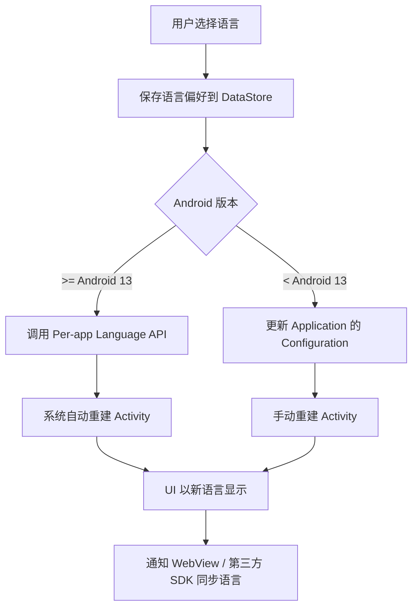
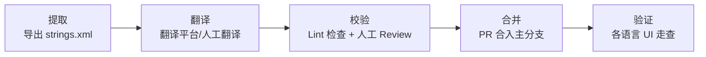

# 字符串与翻译机制

## strings.xml 资源管理最佳实践

### 命名规范

采用 **模块_组件_用途** 的分层命名方式，保持全局唯一且易于检索：

```xml
<!-- ✅ 推荐命名 -->
<string name="login_btn_submit">登录</string>
<string name="login_input_hint_username">请输入用户名</string>
<string name="settings_title">设置</string>
<string name="common_btn_cancel">取消</string>
<string name="common_btn_confirm">确认</string>

<!-- ❌ 不推荐命名 -->
<string name="text1">登录</string>
<string name="btn">取消</string>
<string name="title">设置</string>
```

### 分模块组织

对于大型项目，将字符串按功能模块拆分到不同文件：

```
res/values/
├── strings.xml              # 通用字符串
├── strings_login.xml        # 登录模块
├── strings_settings.xml     # 设置模块
└── strings_payment.xml      # 支付模块
```

### 避免硬编码

```kotlin
// ❌ 硬编码字符串
textView.text = "加载中..."

// ✅ 使用资源引用
textView.text = getString(R.string.common_loading)
```

**Lint 规则**：开启 `HardcodedText` 检查，CI 中强制不允许硬编码字符串。

## 复数处理（Plurals）

不同语言的复数规则差异巨大（英语 2 种、阿拉伯语 6 种、中文无复数变化），使用 `<plurals>` 而非手动拼接：

```xml
<!-- res/values/strings.xml -->
<plurals name="message_count">
    <item quantity="zero">没有消息</item>
    <item quantity="one">%d 条消息</item>
    <item quantity="other">%d 条消息</item>
</plurals>

<!-- res/values-en/strings.xml -->
<plurals name="message_count">
    <item quantity="zero">No messages</item>
    <item quantity="one">%d message</item>
    <item quantity="other">%d messages</item>
</plurals>
```

```kotlin
// 使用复数资源
val count = 5
val text = resources.getQuantityString(R.plurals.message_count, count, count)
```

### 格式化字符串

```xml
<!-- 位置参数，便于翻译时调整语序 -->
<string name="welcome_message">%1$s，欢迎回来！你有 %2$d 条未读消息。</string>
```

```kotlin
val message = getString(R.string.welcome_message, userName, unreadCount)
```

> **注意**：始终使用位置参数（`%1$s`、`%2$d`）而非简单的 `%s`、`%d`，因为不同语言的语序可能不同。

## 动态语言切换

### 整体流程



### 语言切换工具类

```kotlin
/**
 * 语言切换管理器
 * 支持 Android 13 Per-app Language API 和旧版本兼容方案
 */
object LocaleManager {

    private const val PREF_KEY_LANGUAGE = "app_language"

    /**
     * 支持的语言列表
     */
    enum class Language(val code: String, val displayName: String) {
        CHINESE_SIMPLIFIED("zh-CN", "简体中文"),
        CHINESE_TRADITIONAL("zh-TW", "繁體中文"),
        ENGLISH("en", "English"),
        JAPANESE("ja", "日本語"),
        ARABIC("ar", "العربية");

        companion object {
            fun fromCode(code: String): Language =
                entries.find { it.code == code } ?: ENGLISH
        }
    }

    /**
     * 切换应用语言
     * Android 13+ 使用系统 Per-app Language API，低版本使用兼容方案
     */
    fun switchLanguage(context: Context, language: Language) {
        if (Build.VERSION.SDK_INT >= Build.VERSION_CODES.TIRAMISU) {
            // Android 13+ 使用 Per-app Language Preferences
            val appLocale = LocaleList.forLanguageTags(language.code)
            context.getSystemService(LocaleManager::class.java)
                ?.applicationLocales = appLocale
        } else {
            // 旧版本兼容方案
            saveLanguagePreference(context, language.code)
            updateLocale(context, language.code)
        }
    }

    /**
     * 在 Application 或 Activity 的 attachBaseContext 中调用，
     * 用于旧版本的语言设置恢复
     */
    fun wrapContext(context: Context): Context {
        if (Build.VERSION.SDK_INT >= Build.VERSION_CODES.TIRAMISU) {
            return context // Android 13+ 由系统管理
        }
        val languageCode = getSavedLanguage(context) ?: return context
        return updateLocale(context, languageCode)
    }

    /**
     * 更新 Context 的 Locale 配置
     */
    private fun updateLocale(context: Context, languageCode: String): Context {
        val locale = Locale.forLanguageTag(languageCode)
        Locale.setDefault(locale)

        val config = Configuration(context.resources.configuration)
        config.setLocale(locale)
        config.setLayoutDirection(locale)

        return context.createConfigurationContext(config)
    }

    private fun saveLanguagePreference(context: Context, code: String) {
        context.getSharedPreferences("settings", Context.MODE_PRIVATE)
            .edit()
            .putString(PREF_KEY_LANGUAGE, code)
            .apply()
    }

    private fun getSavedLanguage(context: Context): String? {
        return context.getSharedPreferences("settings", Context.MODE_PRIVATE)
            .getString(PREF_KEY_LANGUAGE, null)
    }
}
```

### Application 中集成

```kotlin
class MyApplication : Application() {
    override fun attachBaseContext(base: Context) {
        // 在 Application 创建时应用保存的语言设置
        super.attachBaseContext(LocaleManager.wrapContext(base))
    }
}
```

### Activity 基类中集成

```kotlin
abstract class BaseActivity : AppCompatActivity() {
    override fun attachBaseContext(newBase: Context) {
        // 每个 Activity 创建时应用语言设置
        super.attachBaseContext(LocaleManager.wrapContext(newBase))
    }

    /**
     * 切换语言并重建 Activity
     */
    fun changeLanguage(language: LocaleManager.Language) {
        LocaleManager.switchLanguage(this, language)
        if (Build.VERSION.SDK_INT < Build.VERSION_CODES.TIRAMISU) {
            recreate()
        }
    }
}
```

## Android 13 Per-app Language Preferences

Android 13（API 33）引入了系统级的应用语言设置，用户可在系统设置中为每个应用单独选择语言。

### 配置步骤

1. 在 `res/xml/locales_config.xml` 中声明支持的语言：

```xml
<?xml version="1.0" encoding="utf-8"?>
<locale-config xmlns:android="http://schemas.android.com/apk/res/android">
    <locale android:name="zh-CN" />
    <locale android:name="zh-TW" />
    <locale android:name="en" />
    <locale android:name="ja" />
    <locale android:name="ar" />
</locale-config>
```

2. 在 `AndroidManifest.xml` 中引用：

```xml
<application
    android:localeConfig="@xml/locales_config"
    ... >
```

3. 使用 AndroidX AppCompat 1.6+ 获得向下兼容支持：

```kotlin
// 使用 AppCompatDelegate，兼容到 API 24
val appLocale = LocaleListCompat.forLanguageTags("zh-CN")
AppCompatDelegate.setApplicationLocales(appLocale)
```

## 翻译工作流设计



### 具体步骤

| 阶段 | 操作 | 工具/方式 |
|------|------|-----------|
| 提取 | 导出默认语言 strings.xml | Android Studio / 脚本 |
| 翻译 | 上传到翻译平台或交给翻译人员 | Crowdin / Lokalise / 人工 |
| 校验 | 检查缺失翻译、格式符匹配、长度 | `Lint`、`StringCheck` 自定义脚本 |
| 合并 | 翻译文件通过 PR 合入代码库 | Git + Code Review |
| 验证 | 切换各语言 UI 走查 | 模拟器 / 真机测试 |

## 常见坑点

### 1. WebView 语言不同步

WebView 使用系统 Locale 而非应用 Locale，切换应用语言后 WebView 内容可能仍显示旧语言：

```kotlin
/**
 * 同步 WebView 的语言设置
 * 需要在 WebView 加载前调用
 */
fun syncWebViewLocale(webView: WebView, languageCode: String) {
    if (Build.VERSION.SDK_INT >= Build.VERSION_CODES.N) {
        // 通过设置 Accept-Language 请求头引导服务端返回对应语言
        val headers = mapOf("Accept-Language" to languageCode)
        webView.loadUrl(webView.url ?: "", headers)
    }
}
```

### 2. 第三方 SDK 语言不跟随

部分第三方 SDK 在初始化时缓存了系统语言，后续应用内切换语言不生效。解决思路：

- 切换语言后重新初始化相关 SDK
- 若 SDK 提供语言设置 API，主动调用
- 联系 SDK 提供方确认多语言支持方案

### 3. strings.xml 缺少翻译的 Fallback 机制

Android 资源加载的 fallback 顺序：**精确匹配 -> 语言匹配 -> 默认资源**。如果默认资源（`values/strings.xml`）中也没有对应 key，应用会崩溃。

**最佳实践**：默认语言文件（通常是英文）必须包含所有 key，作为最终兜底。CI 中增加检查确保所有语言文件的 key 是默认文件的子集。

### 4. Activity 重建时状态丢失

语言切换触发 `recreate()` 时，未正确保存的状态会丢失。确保重要数据通过 `ViewModel`、`SavedStateHandle` 或 `onSaveInstanceState` 保存。

## 踩坑记录

> 此区域供团队成员补充项目中遇到的真实案例。

| 日期 | 记录人 | 问题描述 | 解决方案 |
|------|--------|----------|----------|
| | | | |

## 参考资料

- [Android 官方文档：支持不同语言和文化](https://developer.android.com/guide/topics/resources/localization)
- [Android 13 Per-app Language Preferences](https://developer.android.com/guide/topics/resources/app-languages)
- [AppCompatDelegate.setApplicationLocales() 文档](https://developer.android.com/reference/androidx/appcompat/app/AppCompatDelegate#setApplicationLocales(androidx.core.os.LocaleListCompat))
- [ICU4J on Android](https://developer.android.com/guide/topics/resources/icu4j-framework)
- [Crowdin Android 集成指南](https://support.crowdin.com/android-sdk/)
