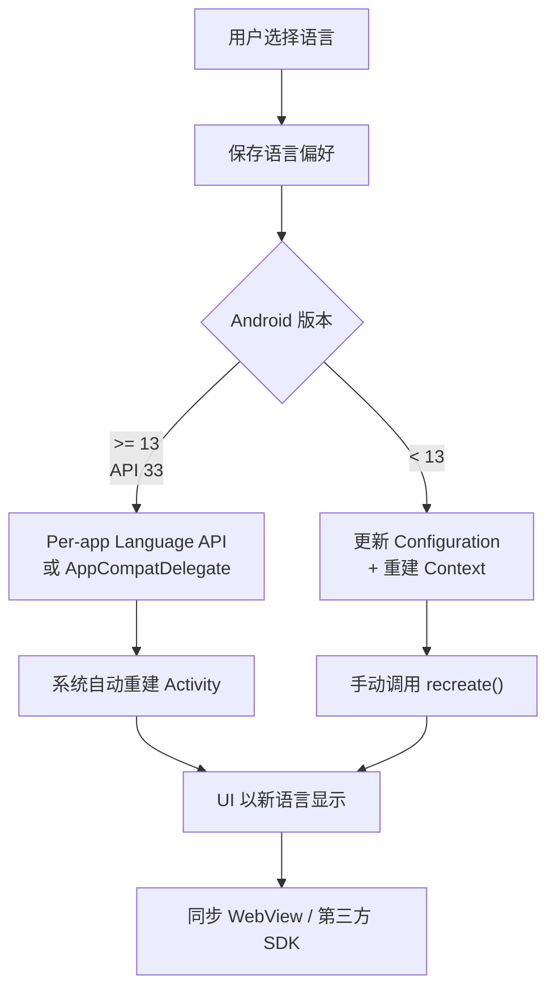
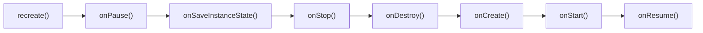

# 动态语言切换

## 整体方案概览



| 方案 | 适用版本 | 优势 | 劣势 |
|------|----------|------|------|
| **Per-app Language API** | Android 13+ | 系统原生支持，自动处理重建 | 仅 API 33+ |
| **AppCompatDelegate** | API 24+（AppCompat 1.6+） | 向下兼容 Per-app API | 需要 AppCompat 依赖 |
| **Configuration + Context 重建** | 所有版本 | 完全可控 | 需手动管理重建与状态 |

## Android 13+ Per-app Language Preferences

### locales_config.xml 配置

在 `res/xml/locales_config.xml` 中声明应用支持的语言列表：

```xml
<?xml version="1.0" encoding="utf-8"?>
<locale-config xmlns:android="http://schemas.android.com/apk/res/android">
    <locale android:name="zh-CN" />
    <locale android:name="zh-TW" />
    <locale android:name="en" />
    <locale android:name="ja" />
    <locale android:name="ar" />
    <locale android:name="ko" />
    <locale android:name="fr" />
</locale-config>
```

### AndroidManifest.xml 集成

```xml
<application
    android:localeConfig="@xml/locales_config"
    android:supportsRtl="true"
    ...>
```

### 系统设置中的语言选择

配置完成后，用户可通过 **系统设置 > 应用 > [你的应用] > 语言** 为应用单独选择语言，无需进入应用内部。此功能由系统 UI 原生提供，开发者无需编写额外界面。

### AppCompatDelegate 向下兼容

AndroidX AppCompat 1.6+ 提供了 Per-app Language 的向下兼容方案，可覆盖到 API 24：

```kotlin
// 切换语言（兼容到 API 24）
val appLocale = LocaleListCompat.forLanguageTags("zh-CN")
AppCompatDelegate.setApplicationLocales(appLocale)

// 获取当前应用语言
val currentLocales = AppCompatDelegate.getApplicationLocales()
if (!currentLocales.isEmpty) {
    val currentLang = currentLocales[0]?.toLanguageTag()
}
```

**依赖**：

```kotlin
// build.gradle.kts
dependencies {
    implementation("androidx.appcompat:appcompat:1.7.0")
}
```

> **注意**：AppCompatDelegate 方案在 API 24-32 上使用 `AppCompatDelegate` 内部存储语言偏好并自动重建 Activity；在 API 33+ 上会委托给系统 Per-app Language API。

## 低版本兼容方案

### Configuration + Context 重建

对于需要兼容 API < 24 或不使用 AppCompat 的场景，需手动管理 Configuration：

```kotlin
private fun updateLocale(context: Context, locale: Locale): Context {
    Locale.setDefault(locale)

    val config = Configuration(context.resources.configuration)
    config.setLocale(locale)
    config.setLayoutDirection(locale)

    return context.createConfigurationContext(config)
}
```

### Application attachBaseContext 拦截

在 Application 创建时恢复用户保存的语言设置：

```kotlin
class MyApplication : Application() {
    override fun attachBaseContext(base: Context) {
        val savedLocale = LocaleStore.getSavedLocale(base)
        val localizedContext = if (savedLocale != null) {
            updateLocale(base, savedLocale)
        } else {
            base
        }
        super.attachBaseContext(localizedContext)
    }
}
```

### Activity attachBaseContext 拦截

每个 Activity 创建时也需要应用语言设置，确保所有页面使用一致的语言：

```kotlin
abstract class BaseActivity : AppCompatActivity() {
    override fun attachBaseContext(newBase: Context) {
        val savedLocale = LocaleStore.getSavedLocale(newBase)
        val localizedContext = if (savedLocale != null) {
            updateLocale(newBase, savedLocale)
        } else {
            newBase
        }
        super.attachBaseContext(localizedContext)
    }
}
```

### BaseActivity 统一封装

将语言切换逻辑封装到基类中，所有 Activity 继承即可：

```kotlin
abstract class BaseActivity : AppCompatActivity() {

    override fun attachBaseContext(newBase: Context) {
        super.attachBaseContext(LocaleManager.wrapContext(newBase))
    }

    fun changeLanguage(language: LocaleManager.Language) {
        LocaleManager.switchLanguage(this, language)
        if (Build.VERSION.SDK_INT < Build.VERSION_CODES.TIRAMISU) {
            recreate()
        }
    }
}
```

## 语言切换工具类实现

### LocaleManager 完整实现

```kotlin
object LocaleManager {

    private const val PREF_KEY_LANGUAGE = "app_language"

    enum class Language(val code: String, val displayName: String) {
        FOLLOW_SYSTEM("", "跟随系统"),
        CHINESE_SIMPLIFIED("zh-CN", "简体中文"),
        CHINESE_TRADITIONAL("zh-TW", "繁體中文"),
        ENGLISH("en", "English"),
        JAPANESE("ja", "日本語"),
        ARABIC("ar", "العربية");

        companion object {
            fun fromCode(code: String): Language =
                entries.find { it.code == code } ?: FOLLOW_SYSTEM
        }
    }

    fun switchLanguage(context: Context, language: Language) {
        saveLanguagePreference(context, language.code)

        if (Build.VERSION.SDK_INT >= Build.VERSION_CODES.N) {
            val localeList = if (language == Language.FOLLOW_SYSTEM) {
                LocaleListCompat.getEmptyLocaleList()
            } else {
                LocaleListCompat.forLanguageTags(language.code)
            }
            AppCompatDelegate.setApplicationLocales(localeList)
        } else {
            if (language != Language.FOLLOW_SYSTEM) {
                val locale = Locale.forLanguageTag(language.code)
                updateLocale(context, locale)
            }
        }
    }

    fun wrapContext(context: Context): Context {
        if (Build.VERSION.SDK_INT >= Build.VERSION_CODES.TIRAMISU) {
            return context
        }
        val code = getSavedLanguage(context)
        if (code.isNullOrEmpty()) return context
        return updateLocale(context, Locale.forLanguageTag(code))
    }

    fun getCurrentLanguage(context: Context): Language {
        val code = getSavedLanguage(context) ?: return Language.FOLLOW_SYSTEM
        return Language.fromCode(code)
    }

    private fun updateLocale(context: Context, locale: Locale): Context {
        Locale.setDefault(locale)
        val config = Configuration(context.resources.configuration)
        config.setLocale(locale)
        config.setLayoutDirection(locale)
        return context.createConfigurationContext(config)
    }

    private fun saveLanguagePreference(context: Context, code: String) {
        context.getSharedPreferences("app_settings", Context.MODE_PRIVATE)
            .edit()
            .putString(PREF_KEY_LANGUAGE, code)
            .apply()
    }

    private fun getSavedLanguage(context: Context): String? {
        return context.getSharedPreferences("app_settings", Context.MODE_PRIVATE)
            .getString(PREF_KEY_LANGUAGE, null)
    }
}
```

### 语言偏好持久化

推荐使用 DataStore 替代 SharedPreferences 进行语言偏好存储：

```kotlin
private val Context.languageDataStore by preferencesDataStore(name = "language_prefs")
private val LANGUAGE_KEY = stringPreferencesKey("app_language")

suspend fun saveLanguage(context: Context, code: String) {
    context.languageDataStore.edit { prefs ->
        prefs[LANGUAGE_KEY] = code
    }
}

fun getLanguageFlow(context: Context): Flow<String?> {
    return context.languageDataStore.data.map { prefs ->
        prefs[LANGUAGE_KEY]
    }
}
```

> SharedPreferences 仍适用于 `attachBaseContext` 中的同步读取场景（DataStore 是异步的）。可以采用混合方案：DataStore 作为主存储，同时同步写入 SharedPreferences 供 `attachBaseContext` 读取。

## Activity 重建与状态保持

### recreate() 的影响范围

调用 `Activity.recreate()` 会触发完整的 **销毁 → 重建** 流程：



> **注意**：`recreate()` 只重建当前 Activity，返回栈中的其他 Activity 不会被重建，可能导致语言不一致。

### ViewModel 状态保持

`ViewModel` 在 `recreate()` 过程中**不会被销毁**，其持有的数据自动存活：

```kotlin
class SettingsViewModel : ViewModel() {
    val selectedItems = mutableListOf<Item>()  // recreate 后仍然保留
    val userInput = MutableLiveData<String>()   // recreate 后仍然保留
}
```

### SavedStateHandle 恢复

对于需要跨进程死亡恢复的数据，使用 `SavedStateHandle`：

```kotlin
class SettingsViewModel(
    private val savedStateHandle: SavedStateHandle
) : ViewModel() {
    var scrollPosition: Int
        get() = savedStateHandle["scroll_pos"] ?: 0
        set(value) { savedStateHandle["scroll_pos"] = value }
}
```

### Fragment 状态恢复

宿主 Activity `recreate()` 时，Fragment 也会经历完整的销毁-重建周期。确保 Fragment 中的关键数据通过 ViewModel 或 `onSaveInstanceState` 保存：

```kotlin
class MyFragment : Fragment() {
    override fun onSaveInstanceState(outState: Bundle) {
        super.onSaveInstanceState(outState)
        outState.putInt("tab_index", currentTabIndex)
    }

    override fun onViewCreated(view: View, savedInstanceState: Bundle?) {
        super.onViewCreated(view, savedInstanceState)
        currentTabIndex = savedInstanceState?.getInt("tab_index") ?: 0
    }
}
```

## 特殊场景同步

### WebView 语言同步

WebView 使用系统 Locale 而非应用内设置的 Locale，切换应用语言后 WebView 内容可能仍显示旧语言：

```kotlin
fun syncWebViewLocale(webView: WebView, languageCode: String) {
    // 方案 1：通过 Accept-Language 请求头引导服务端返回对应语言
    val headers = mapOf("Accept-Language" to languageCode)
    webView.loadUrl(webView.url ?: return, headers)

    // 方案 2：通过 URL 参数传递语言
    val url = "${baseUrl}?lang=$languageCode"
    webView.loadUrl(url)

    // 方案 3：通过 JavaScript Bridge 通知 Web 端
    webView.evaluateJavascript("setLanguage('$languageCode')", null)
}
```

### 第三方 SDK 语言同步

部分第三方 SDK 在初始化时缓存了系统语言，后续应用内切换语言不生效：

| SDK 类型 | 解决方案 |
|----------|----------|
| 提供语言设置 API 的 SDK | 切换语言后主动调用 SDK 的语言设置方法 |
| 不提供语言 API 的 SDK | 切换语言后重新初始化 SDK |
| 使用系统 Locale 的 SDK | 在切换语言前临时修改 `Locale.setDefault()` |

### Service / BroadcastReceiver 中的语言

Service 和 BroadcastReceiver 使用 Application Context，在低版本上可能不会自动跟随应用语言：

```kotlin
class MyService : Service() {
    override fun attachBaseContext(newBase: Context) {
        super.attachBaseContext(LocaleManager.wrapContext(newBase))
    }
}
```

### 系统语言变更广播监听

当用户在系统设置中更改设备语言时，应用需要同步更新：

```kotlin
class LocaleChangedReceiver : BroadcastReceiver() {
    override fun onReceive(context: Context, intent: Intent) {
        if (intent.action == Intent.ACTION_LOCALE_CHANGED) {
            val currentLanguage = LocaleManager.getCurrentLanguage(context)
            if (currentLanguage == LocaleManager.Language.FOLLOW_SYSTEM) {
                // 跟随系统语言的用户，无需额外处理
                // 系统会自动重建 Activity
            }
        }
    }
}
```

```xml
<receiver android:name=".LocaleChangedReceiver"
    android:exported="false">
    <intent-filter>
        <action android:name="android.intent.action.LOCALE_CHANGED" />
    </intent-filter>
</receiver>
```

## 踩坑记录

> 此区域供团队成员补充项目中遇到的真实案例。

| 日期 | 记录人 | 问题描述 | 解决方案 |
|------|--------|----------|----------|
| | | | |

## 参考资料

- [Android 官方文档 - Per-app Language Preferences](https://developer.android.com/guide/topics/resources/app-languages)
- [AndroidX AppCompat 1.6 Release Notes](https://developer.android.com/jetpack/androidx/releases/appcompat#1.6.0)
- [AppCompatDelegate.setApplicationLocales() API](https://developer.android.com/reference/androidx/appcompat/app/AppCompatDelegate#setApplicationLocales(androidx.core.os.LocaleListCompat))
- [Android 官方文档 - 配置变更处理](https://developer.android.com/guide/topics/resources/runtime-changes)
- [Android 官方 Codelab - Per-app Language](https://developer.android.com/codelabs/android-app-languages)
