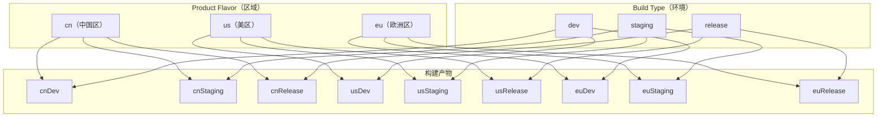
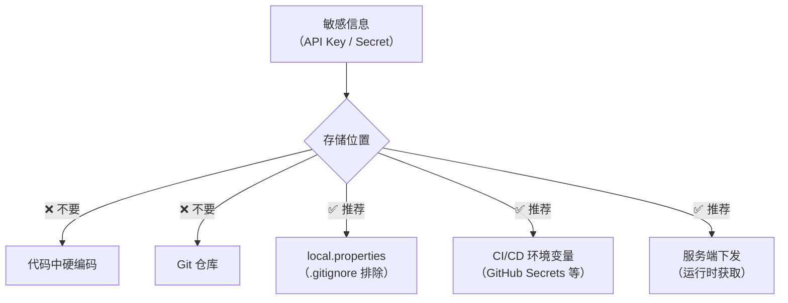

# 后端环境切换

## 需求背景

国际化产品通常面临以下场景，需要根据区域或环境切换不同的后端服务地址：

- **多区域部署**：中国区、美区、欧洲区使用不同的服务集群（数据合规、网络延迟）
- **多环境管理**：开发（dev）、测试（staging）、生产（production）环境隔离
- **灰度发布**：部分区域先行上线新版本后端接口
- **调试需求**：开发者需要在运行时切换到不同环境进行调试

## Build Variant 方案

### 架构概览



### Gradle 配置

```kotlin
// build.gradle.kts (Module)
android {
    // 定义 Flavor Dimension
    flavorDimensions += "region"

    productFlavors {
        create("cn") {
            dimension = "region"
            applicationIdSuffix = ".cn"
            // 中国区后端地址
            buildConfigField("String", "BASE_URL", "\"https://api.example.cn\"")
            buildConfigField("String", "CDN_URL", "\"https://cdn.example.cn\"")
        }
        create("us") {
            dimension = "region"
            applicationIdSuffix = ".us"
            // 美区后端地址
            buildConfigField("String", "BASE_URL", "\"https://api.example.com\"")
            buildConfigField("String", "CDN_URL", "\"https://cdn.example.com\"")
        }
        create("eu") {
            dimension = "region"
            applicationIdSuffix = ".eu"
            // 欧洲区后端地址
            buildConfigField("String", "BASE_URL", "\"https://api.example.eu\"")
            buildConfigField("String", "CDN_URL", "\"https://cdn.example.eu\"")
        }
    }

    buildTypes {
        getByName("debug") {
            // Debug 环境可覆盖为开发服务器
            // 各 Flavor 中的地址会被这里的同名字段覆盖（如需要）
        }
        create("staging") {
            initWith(getByName("debug"))
            // Staging 环境特有配置
            buildConfigField("String", "ENV_NAME", "\"staging\"")
        }
        getByName("release") {
            isMinifyEnabled = true
            buildConfigField("String", "ENV_NAME", "\"production\"")
        }
    }
}
```

### Flavor 专属资源与代码

每个 Flavor 可以有独立的源码目录和资源：

```
app/src/
├── main/              # 公共代码
├── cn/                # 中国区专属
│   ├── java/          # 中国区特有逻辑（如微信支付）
│   └── res/
│       └── values/
│           └── strings.xml   # 中国区特有字符串
├── us/                # 美区专属
│   ├── java/
│   └── res/
└── eu/                # 欧洲区专属
    ├── java/
    └── res/
```

### 使用 BuildConfig

```kotlin
// 在代码中访问构建时注入的配置
val baseUrl = BuildConfig.BASE_URL
val cdnUrl = BuildConfig.CDN_URL

// 配合 Retrofit 使用
val retrofit = Retrofit.Builder()
    .baseUrl(BuildConfig.BASE_URL)
    .addConverterFactory(GsonConverterFactory.create())
    .build()
```

## 运行时动态切换方案

Build Variant 方案在编译时确定后端地址，但某些场景需要 **运行时动态切换**（如开发调试、用户手动选择区域）。

### BaseURL 管理器

```kotlin
/**
 * 后端环境配置管理器
 * 支持运行时动态切换后端地址，并持久化用户选择
 */
class EnvConfigManager private constructor(private val context: Context) {

    /**
     * 环境定义
     */
    enum class Environment(
        val displayName: String,
        val baseUrl: String,
        val cdnUrl: String
    ) {
        DEV(
            displayName = "开发环境",
            baseUrl = "https://dev-api.example.com",
            cdnUrl = "https://dev-cdn.example.com"
        ),
        STAGING(
            displayName = "测试环境",
            baseUrl = "https://staging-api.example.com",
            cdnUrl = "https://staging-cdn.example.com"
        ),
        PRODUCTION_CN(
            displayName = "生产环境（中国区）",
            baseUrl = "https://api.example.cn",
            cdnUrl = "https://cdn.example.cn"
        ),
        PRODUCTION_US(
            displayName = "生产环境（美区）",
            baseUrl = "https://api.example.com",
            cdnUrl = "https://cdn.example.com"
        ),
        PRODUCTION_EU(
            displayName = "生产环境（欧洲区）",
            baseUrl = "https://api.example.eu",
            cdnUrl = "https://cdn.example.eu"
        );
    }

    private val prefs = context.getSharedPreferences("env_config", Context.MODE_PRIVATE)

    /**
     * 当前选中的环境
     */
    var currentEnv: Environment
        get() {
            val name = prefs.getString(KEY_ENV, defaultEnv.name) ?: defaultEnv.name
            return try {
                Environment.valueOf(name)
            } catch (e: IllegalArgumentException) {
                defaultEnv
            }
        }
        set(value) {
            prefs.edit().putString(KEY_ENV, value.name).apply()
            _envChangeListeners.forEach { it.onEnvChanged(value) }
        }

    val baseUrl: String get() = currentEnv.baseUrl
    val cdnUrl: String get() = currentEnv.cdnUrl

    /**
     * 环境变更监听器
     */
    fun interface OnEnvChangedListener {
        fun onEnvChanged(env: Environment)
    }

    private val _envChangeListeners = mutableListOf<OnEnvChangedListener>()

    fun addOnEnvChangedListener(listener: OnEnvChangedListener) {
        _envChangeListeners.add(listener)
    }

    fun removeOnEnvChangedListener(listener: OnEnvChangedListener) {
        _envChangeListeners.remove(listener)
    }

    companion object {
        private const val KEY_ENV = "selected_env"

        // Release 构建默认使用生产环境，Debug 构建默认使用开发环境
        private val defaultEnv: Environment
            get() = if (BuildConfig.DEBUG) Environment.DEV else Environment.PRODUCTION_CN

        @Volatile
        private var instance: EnvConfigManager? = null

        fun getInstance(context: Context): EnvConfigManager {
            return instance ?: synchronized(this) {
                instance ?: EnvConfigManager(context.applicationContext).also {
                    instance = it
                }
            }
        }
    }
}
```

### OkHttp Interceptor 实现动态 BaseURL

```kotlin
/**
 * 动态 BaseURL 拦截器
 * 在每次请求时读取最新的 BaseURL，实现运行时切换
 */
class DynamicBaseUrlInterceptor(
    private val envConfigManager: EnvConfigManager
) : Interceptor {

    override fun intercept(chain: Interceptor.Chain): Response {
        val originalRequest = chain.request()
        val originalUrl = originalRequest.url

        // 将原始请求的 host 替换为当前环境的 host
        val newBaseUrl = envConfigManager.baseUrl.toHttpUrl()

        val newUrl = originalUrl.newBuilder()
            .scheme(newBaseUrl.scheme)
            .host(newBaseUrl.host)
            .port(newBaseUrl.port)
            .build()

        val newRequest = originalRequest.newBuilder()
            .url(newUrl)
            .build()

        return chain.proceed(newRequest)
    }
}
```

### 网络层集成

```kotlin
/**
 * 网络模块配置（通常放在 DI 模块中）
 */
object NetworkModule {

    fun provideOkHttpClient(context: Context): OkHttpClient {
        val envManager = EnvConfigManager.getInstance(context)

        return OkHttpClient.Builder()
            .addInterceptor(DynamicBaseUrlInterceptor(envManager))
            .addInterceptor(HttpLoggingInterceptor().apply {
                level = if (BuildConfig.DEBUG) {
                    HttpLoggingInterceptor.Level.BODY
                } else {
                    HttpLoggingInterceptor.Level.NONE
                }
            })
            .connectTimeout(30, TimeUnit.SECONDS)
            .readTimeout(30, TimeUnit.SECONDS)
            .build()
    }

    fun provideRetrofit(okHttpClient: OkHttpClient): Retrofit {
        // 这里的 baseUrl 仅作占位，实际会被 Interceptor 替换
        return Retrofit.Builder()
            .baseUrl("https://placeholder.example.com/")
            .client(okHttpClient)
            .addConverterFactory(GsonConverterFactory.create())
            .build()
    }
}
```

### DataStore 持久化方案（推荐）

对于新项目，推荐使用 DataStore 替代 SharedPreferences：

```kotlin
/**
 * 使用 Preferences DataStore 存储环境配置
 */
private val Context.envDataStore by preferencesDataStore(name = "env_settings")

class EnvDataStoreManager(private val context: Context) {

    private val envKey = stringPreferencesKey("selected_env")

    /**
     * 以 Flow 形式观察当前环境变化
     */
    val currentEnvFlow: Flow<EnvConfigManager.Environment> = context.envDataStore.data
        .map { preferences ->
            val name = preferences[envKey] ?: EnvConfigManager.Environment.DEV.name
            try {
                EnvConfigManager.Environment.valueOf(name)
            } catch (e: IllegalArgumentException) {
                EnvConfigManager.Environment.DEV
            }
        }

    /**
     * 切换环境
     */
    suspend fun setEnvironment(env: EnvConfigManager.Environment) {
        context.envDataStore.edit { preferences ->
            preferences[envKey] = env.name
        }
    }
}
```

## 多环境配置管理最佳实践

### 配置文件分离

```
app/
├── config/
│   ├── env-dev.properties       # 开发环境配置
│   ├── env-staging.properties   # 测试环境配置
│   └── env-prod.properties      # 生产环境配置（不含敏感信息）
└── build.gradle.kts
```

```properties
# env-dev.properties
BASE_URL=https://dev-api.example.com
CDN_URL=https://dev-cdn.example.com
ENABLE_LOG=true
```

在 Gradle 中读取：

```kotlin
// build.gradle.kts
android {
    buildTypes {
        getByName("debug") {
            val props = Properties().apply {
                load(rootProject.file("app/config/env-dev.properties").inputStream())
            }
            props.forEach { key, value ->
                buildConfigField("String", key.toString(), "\"$value\"")
            }
        }
    }
}
```

### 敏感信息保护



```kotlin
// 从 local.properties 读取敏感配置（仅存在于开发者本地）
val localProps = Properties().apply {
    val file = rootProject.file("local.properties")
    if (file.exists()) load(file.inputStream())
}

android {
    defaultConfig {
        buildConfigField(
            "String",
            "API_KEY",
            "\"${localProps.getProperty("api.key", "")}\""
        )
    }
}
```

### CI/CD 集成

```yaml
# GitHub Actions 示例
name: Build Release
on:
  push:
    branches: [main]

jobs:
  build:
    runs-on: ubuntu-latest
    strategy:
      matrix:
        flavor: [cn, us, eu]
    steps:
      - uses: actions/checkout@v4
      - name: Build
        env:
          API_KEY: ${{ secrets.API_KEY }}
          SIGNING_KEY: ${{ secrets.SIGNING_KEY }}
        run: |
          ./gradlew assemble${{ matrix.flavor }}Release
```

## 常见坑点

### 1. Retrofit BaseURL 末尾斜杠

Retrofit 要求 `baseUrl` 必须以 `/` 结尾，否则会抛出异常。在动态切换 BaseURL 时容易遗漏：

```kotlin
// ❌ 会抛出 IllegalArgumentException
Retrofit.Builder().baseUrl("https://api.example.com")

// ✅ 正确写法
Retrofit.Builder().baseUrl("https://api.example.com/")
```

### 2. 环境切换后缓存未清理

切换后端环境后，如果未清理旧环境的网络缓存和登录态，可能导致请求错误或数据混乱：

```kotlin
fun onEnvChanged(newEnv: Environment) {
    // 清理网络缓存
    okHttpClient.cache?.evictAll()
    // 清除登录态
    tokenManager.clear()
    // 跳转到登录页
    navigateToLogin()
}
```

### 3. Release 包误连测试环境

通过编译隔离确保 Release 包不可能连接到非生产环境：

```kotlin
// 仅在 Debug 构建中允许环境切换 UI
if (BuildConfig.DEBUG) {
    showEnvSwitcher()
}
```

### 4. 多 Flavor 导致构建变体过多

Flavor Dimension 组合会产生笛卡尔积。3 个区域 × 3 个环境 = 9 个变体，增长很快。通过 `variantFilter` 过滤不需要的组合：

```kotlin
android {
    androidComponents {
        beforeVariants { variant ->
            // 排除不需要的组合，如欧洲区不需要 staging
            if (variant.flavorName == "eu" && variant.buildType == "staging") {
                variant.enable = false
            }
        }
    }
}
```

## 踩坑记录

> 此区域供团队成员补充项目中遇到的真实案例。

| 日期 | 记录人 | 问题描述 | 解决方案 |
|------|--------|----------|----------|
| | | | |

## 参考资料

- [Android 官方文档：配置构建变体](https://developer.android.com/build/build-variants)
- [Android 官方文档：Product Flavors](https://developer.android.com/build/build-variants#product-flavors)
- [OkHttp Interceptors 文档](https://square.github.io/okhttp/features/interceptors/)
- [Retrofit 官方文档](https://square.github.io/retrofit/)
- [Android DataStore 文档](https://developer.android.com/topic/libraries/architecture/datastore)
- [GitHub Actions for Android](https://docs.github.com/en/actions/automating-builds-and-tests/building-and-testing-java-with-gradle)
