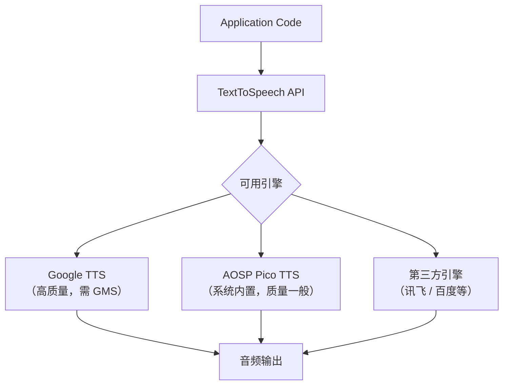
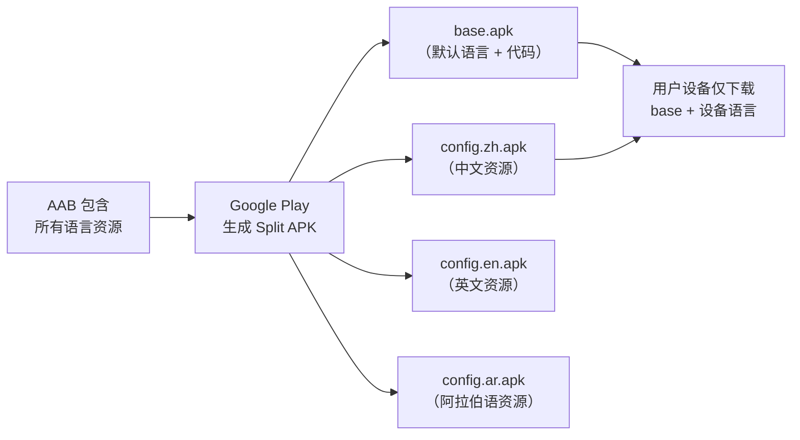
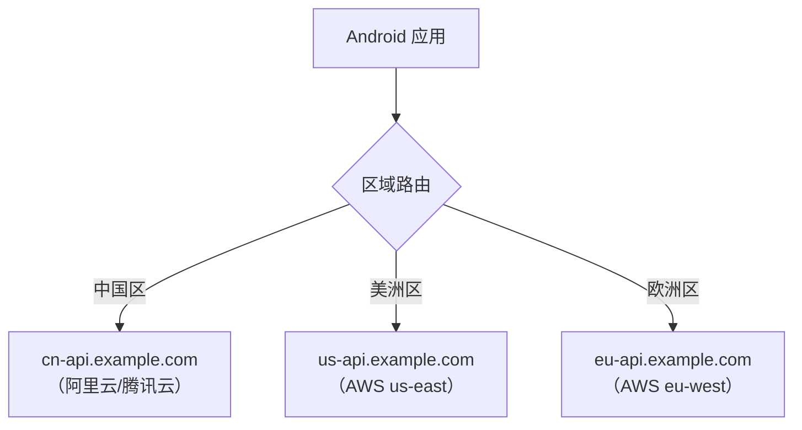

# 资源本地化与按需分发

## 图片与 Drawable 本地化

### drawable 资源限定符

与 strings.xml 类似，Drawable 资源也可以按语言/区域/布局方向提供不同版本：

```
res/
├── drawable/              # 默认图片
│   ├── banner.png
│   └── icon_arrow.xml
├── drawable-zh-rCN/       # 简体中文专用
│   └── banner.png
├── drawable-ar/           # 阿拉伯语专用
│   └── banner.png
├── drawable-ldrtl/        # RTL 布局专用
│   └── icon_arrow.xml
└── drawable-ja/           # 日语专用
    └── banner.png
```

### 需要本地化的图片类型

| 图片类型 | 需要本地化？ | 说明 |
|----------|:----------:|------|
| 含文字的图片（banner、引导图） | ✅ | 图中文字需要翻译 |
| 文化敏感图片（手势、人物） | ✅ | 不同文化对手势含义不同 |
| 方向相关图片（箭头、进度条） | ✅ | RTL 语言需要镜像 |
| 纯装饰图片（背景、纹理） | ❌ | 无文化差异 |
| 品牌 Logo | ❌ | 品牌标识应保持一致 |
| 通用图标（设置齿轮、搜索放大镜） | ❌ | 全球通用符号 |

> **最佳实践**：尽量避免在图片中嵌入文字，改用图片 + 文字叠加的方式，减少需要本地化的图片数量。

### 矢量图 vs 位图的本地化策略

| 类型 | 本地化方式 | 适用场景 |
|------|-----------|----------|
| VectorDrawable | `autoMirrored="true"` 自动镜像 | 箭头、方向图标 |
| VectorDrawable | `drawable-ldrtl/` 提供 RTL 版本 | 不对称图标、复杂 SVG |
| PNG/WebP 位图 | 按语言提供不同版本 | 含文字的 banner、引导图 |
| Lottie 动画 | 代码中根据方向翻转 | 方向相关动画 |

## 字体本地化

### 不同语言的字体需求

| 语言类别 | 字体需求 | 说明 |
|----------|----------|------|
| CJK（中日韩） | NotoSansCJK / 思源黑体 | 字符集巨大（数万字），字体文件可达 10MB+ |
| 阿拉伯文 | NotoSansArabic | 需要支持连字（ligature） |
| 泰文 | NotoSansThai | 声调标记需要正确渲染 |
| 缅甸文 | NotoSansMyanmar | 复杂的字形组合规则 |
| 拉丁文（西欧） | Roboto / 系统默认 | Android 默认支持良好 |

### Downloadable Fonts

按需下载字体可以显著减小 APK 体积：

```xml
<!-- res/font/noto_sans_arabic.xml -->
<?xml version="1.0" encoding="utf-8"?>
<font-family xmlns:app="http://schemas.android.com/apk/res-auto"
    app:fontProviderAuthority="com.google.android.gms.fonts"
    app:fontProviderPackage="com.google.android.gms"
    app:fontProviderQuery="Noto Sans Arabic"
    app:fontProviderCerts="@array/com_google_android_gms_fonts_certs">
</font-family>
```

```xml
<!-- 在布局中使用 -->
<TextView
    android:fontFamily="@font/noto_sans_arabic"
    android:text="مرحبا" />
```

### 字体 Fallback 链

Android 系统有内置的字体 Fallback 机制：当当前字体不支持某个字符时，系统会自动尝试 Fallback 字体：

```
请求渲染 "Hello 你好 مرحبا"
  ├── Roboto: 渲染 "Hello "
  ├── NotoSansCJK: 渲染 "你好 "
  └── NotoSansArabic: 渲染 "مرحبا"
```

系统的 Fallback 链定义在 `/system/etc/fonts.xml` 中，开发者一般无需干预。但如果使用自定义字体，需要手动处理多语言字符的渲染。

## 音视频与 TTS 多语言

### TTS 引擎与多语言支持



| 引擎 | 支持语言 | 质量 | 离线支持 | 适用场景 |
|------|:-------:|:----:|:-------:|----------|
| Google TTS | 60+ | 高 | 部分 | 有 GMS 的设备 |
| Samsung TTS | 30+ | 高 | 是 | Samsung 设备 |
| 讯飞 TTS | 中英为主 | 高 | 是 | 国内项目 |
| AOSP Pico | 6 | 低 | 是 | 兜底方案 |

### TTS 语言可用性检测

```kotlin
private lateinit var tts: TextToSpeech

fun initTts(context: Context) {
    tts = TextToSpeech(context) { status ->
        if (status == TextToSpeech.SUCCESS) {
            val locale = Locale("ar")
            when (tts.isLanguageAvailable(locale)) {
                TextToSpeech.LANG_AVAILABLE,
                TextToSpeech.LANG_COUNTRY_AVAILABLE -> {
                    tts.language = locale
                }
                TextToSpeech.LANG_MISSING_DATA -> {
                    // 引导用户下载语音数据包
                    val intent = Intent(TextToSpeech.Engine.ACTION_INSTALL_TTS_DATA)
                    context.startActivity(intent)
                }
                TextToSpeech.LANG_NOT_SUPPORTED -> {
                    // 该引擎不支持此语言，考虑切换引擎
                }
            }
        }
    }
}
```

### 音视频资源的多语言管理

| 资源类型 | 管理方式 | 说明 |
|----------|----------|------|
| 多语言配音 | 按语言分别存储音频文件 | `raw-zh/voice.mp3`, `raw-en/voice.mp3` |
| 字幕文件 | SRT/VTT 文件按语言命名 | `subtitle_zh.srt`, `subtitle_en.srt` |
| 引导视频 | 按语言存储或动态叠加字幕 | 避免嵌入语言文本的视频 |

## App Bundle 按语言分包

### Language Split 原理

Android App Bundle（AAB）支持按语言自动拆分，用户仅下载设备当前语言的资源：



### 配置 Language Split

```kotlin
// build.gradle.kts
android {
    bundle {
        language {
            enableSplit = true  // 默认为 true
        }
    }
}
```

> **注意**：启用 Language Split 后，通过 `adb install` 安装 APK 时只包含默认语言。使用 `bundletool` 测试：
> ```bash
> bundletool build-apks --bundle=app.aab --output=app.apks
> bundletool install-apks --apks=app.apks
> ```

### 额外语言安装

当用户在应用内切换到未下载的语言时，需要通过 `SplitInstallManager` 动态请求：

```kotlin
val splitInstallManager = SplitInstallManagerFactory.create(context)

fun downloadLanguage(languageTag: String) {
    val request = SplitInstallRequest.newBuilder()
        .addLanguage(Locale.forLanguageTag(languageTag))
        .build()

    splitInstallManager.startInstall(request)
        .addOnSuccessListener { sessionId ->
            // 下载开始，监听进度
        }
        .addOnFailureListener { exception ->
            // 下载失败处理
        }
}

// 监听下载状态
splitInstallManager.registerListener { state ->
    when (state.status()) {
        SplitInstallSessionStatus.INSTALLED -> {
            // 语言包安装完成，重建 Activity 使用新语言
        }
        SplitInstallSessionStatus.DOWNLOADING -> {
            val progress = state.bytesDownloaded() * 100 / state.totalBytesToDownload()
            // 更新下载进度 UI
        }
        SplitInstallSessionStatus.FAILED -> {
            // 处理失败
        }
    }
}
```

## Play Asset Delivery

### 按需分发大型本地化资源

对于大型本地化资源（如离线翻译模型、语音包），使用 Play Asset Delivery：

| 分发模式 | 说明 | 适用场景 |
|----------|------|----------|
| **install-time** | 应用安装时一起下载 | 核心语言资源 |
| **fast-follow** | 安装完成后立即开始下载 | 次要语言资源 |
| **on-demand** | 用户主动请求时下载 | 可选语言包、大型资源 |

### Asset Pack 的语言感知

```
asset-packs/
├── voice-zh/           # 中文语音包（on-demand）
│   └── src/main/assets/
│       └── zh/voice_data.bin
├── voice-en/           # 英文语音包（on-demand）
│   └── src/main/assets/
│       └── en/voice_data.bin
└── voice-ar/           # 阿拉伯语语音包（on-demand）
    └── src/main/assets/
        └── ar/voice_data.bin
```

## 多区域后端适配

### 多区域部署架构



### Build Variant 方案

通过 Product Flavor 按区域配置不同的 baseUrl：

```kotlin
// build.gradle.kts
android {
    flavorDimensions += "region"
    productFlavors {
        create("cn") {
            dimension = "region"
            buildConfigField("String", "BASE_URL", "\"https://cn-api.example.com\"")
            buildConfigField("String", "REGION", "\"CN\"")
        }
        create("global") {
            dimension = "region"
            buildConfigField("String", "BASE_URL", "\"https://api.example.com\"")
            buildConfigField("String", "REGION", "\"GLOBAL\"")
        }
    }
}
```

### 运行时动态切换

对于需要在运行时根据用户位置动态切换后端的场景：

```kotlin
object RegionManager {
    private val regionConfigs = mapOf(
        "CN" to RegionConfig(
            baseUrl = "https://cn-api.example.com",
            cdnUrl = "https://cn-cdn.example.com",
            wsUrl = "wss://cn-ws.example.com"
        ),
        "US" to RegionConfig(
            baseUrl = "https://us-api.example.com",
            cdnUrl = "https://us-cdn.example.com",
            wsUrl = "wss://us-ws.example.com"
        ),
        "EU" to RegionConfig(
            baseUrl = "https://eu-api.example.com",
            cdnUrl = "https://eu-cdn.example.com",
            wsUrl = "wss://eu-ws.example.com"
        )
    )

    fun getConfig(regionCode: String): RegionConfig {
        return regionConfigs[regionCode]
            ?: regionConfigs["US"]!!  // 默认美区
    }
}

data class RegionConfig(
    val baseUrl: String,
    val cdnUrl: String,
    val wsUrl: String
)
```

### 数据合规考量

| 法规 | 适用地区 | 核心要求 | 对架构的影响 |
|------|----------|----------|------------|
| **GDPR** | 欧盟/欧洲经济区 | 数据不出欧盟；用户有删除权 | 欧洲区独立部署，支持数据删除 |
| **网络安全法/个保法** | 中国 | 个人数据境内存储 | 中国区独立部署，数据不出境 |
| **CCPA** | 美国加州 | 消费者隐私权 | 提供数据访问和删除接口 |
| **PDPA** | 东南亚（泰、新、马） | 数据保护与同意 | 明确用户同意机制 |

## 安装包体积优化

### 语言资源的体积分析

| 资源类型 | 每语言增量 | 说明 |
|----------|:---------:|------|
| strings.xml | 10-50 KB | 文本量决定，通常较小 |
| 本地化图片 | 100 KB - 1 MB | 含文字的 banner 等 |
| CJK 字体 | 5-15 MB | 字符集庞大 |
| TTS 语音数据 | 20-100 MB | 离线语音模型 |

### 按需加载 vs 全量打包的权衡

| 策略 | 优势 | 劣势 | 适用场景 |
|------|------|------|----------|
| **全量打包** | 离线可用、切换即时 | 包体积大 | 支持语言少（≤5） |
| **App Bundle 分包** | 自动按需、无感知 | 依赖 Google Play | Play Store 分发 |
| **动态下载** | 包体积最小 | 首次使用需等待 | 大型资源（字体、语音） |

## 踩坑记录

> 此区域供团队成员补充项目中遇到的真实案例。

| 日期 | 记录人 | 问题描述 | 解决方案 |
|------|--------|----------|----------|
| | | | |

## 参考资料

- [Android 官方文档 - App Bundle](https://developer.android.com/guide/app-bundle)
- [Android 官方文档 - Play Asset Delivery](https://developer.android.com/guide/playcore/asset-delivery)
- [Android 官方文档 - Downloadable Fonts](https://developer.android.com/develop/ui/views/text-and-emoji/downloadable-fonts)
- [Android 官方文档 - TextToSpeech](https://developer.android.com/reference/android/speech/tts/TextToSpeech)
- [Google Play 按需分发](https://developer.android.com/guide/playcore/feature-delivery)
- [GDPR 官方网站](https://gdpr.eu/)
