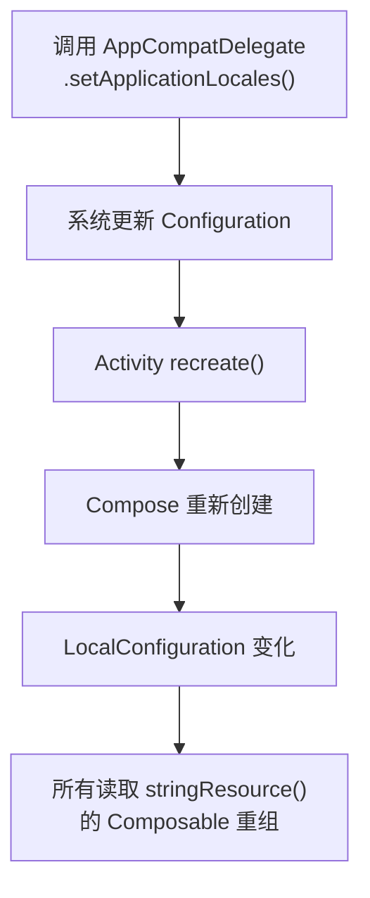

# Compose 国际化实践

## Compose 中的字符串资源

### stringResource()

Compose 中访问字符串资源的标准方式：

```kotlin
@Composable
fun Greeting() {
    // 基本用法
    Text(text = stringResource(R.string.hello))

    // 带参数的格式化
    Text(text = stringResource(R.string.welcome_message, userName, messageCount))
}
```

`stringResource()` 内部通过 `LocalContext.current` 获取 Context，再调用 `context.getString()`。当 Configuration 变化（如语言切换）时，Compose 会自动触发 Recomposition 刷新 UI。

### pluralStringResource()

处理复数字符串：

```kotlin
@Composable
fun ItemCount(count: Int) {
    Text(
        text = pluralStringResource(
            R.plurals.item_count,
            count,  // 选择复数形式
            count   // 格式化参数
        )
    )
}
```

### stringArrayResource()

获取字符串数组资源：

```kotlin
@Composable
fun WeekdayPicker() {
    val weekdays = stringArrayResource(R.array.weekdays)

    weekdays.forEachIndexed { index, day ->
        Text(text = day)
    }
}
```

### 自定义资源访问扩展

封装常用的资源访问工具函数，减少样板代码：

```kotlin
@Composable
fun annotatedStringResource(
    @StringRes id: Int,
    vararg formatArgs: Any
): AnnotatedString {
    val text = stringResource(id, *formatArgs)
    return buildAnnotatedString { append(text) }
}

// 获取 Drawable 资源并转为 Painter
@Composable
fun localizedPainter(@DrawableRes id: Int): Painter {
    return painterResource(id)
}
```

## CompositionLocal 与 Locale

### LocalConfiguration

读取当前 Configuration 中的 Locale 信息：

```kotlin
@Composable
fun CurrentLocaleInfo() {
    val configuration = LocalConfiguration.current
    val locales = ConfigurationCompat.getLocales(configuration)
    val primaryLocale = locales[0]

    Text("当前语言: ${primaryLocale?.displayLanguage}")
    Text("当前地区: ${primaryLocale?.displayCountry}")
    Text("布局方向: ${if (configuration.layoutDirection == Configuration.SCREENLAYOUT_LAYOUTDIR_RTL) "RTL" else "LTR"}")
}
```

### LocalContext

通过 Context 获取更底层的资源访问能力：

```kotlin
@Composable
fun CustomResourceAccess() {
    val context = LocalContext.current

    // 当 stringResource 不满足需求时，使用 Context
    val text = remember(context) {
        context.getString(R.string.complex_text)
    }

    // 获取 Locale-aware 的格式化
    val locale = context.resources.configuration.locales[0]
    val formattedDate = remember(locale) {
        DateFormat.getDateInstance(DateFormat.MEDIUM, locale).format(Date())
    }

    Text(formattedDate)
}
```

### 自定义 CompositionLocal 传递语言状态

在 Compose 树中传递自定义的语言状态，用于非标准的语言切换逻辑：

```kotlin
data class AppLanguage(
    val locale: Locale,
    val isRtl: Boolean = false
)

val LocalAppLanguage = staticCompositionLocalOf {
    AppLanguage(locale = Locale.getDefault())
}

@Composable
fun AppRoot(language: AppLanguage) {
    CompositionLocalProvider(LocalAppLanguage provides language) {
        // 子组件可以读取当前语言状态
        MainContent()
    }
}

@Composable
fun SomeScreen() {
    val appLanguage = LocalAppLanguage.current
    Text("Current: ${appLanguage.locale.displayLanguage}")
}
```

## Compose 中的 RTL 支持

### LayoutDirection

Compose 使用 `LayoutDirection` 枚举表示布局方向：

```kotlin
@Composable
fun DirectionAwareLayout() {
    val layoutDirection = LocalLayoutDirection.current

    when (layoutDirection) {
        LayoutDirection.Ltr -> { /* 从左到右 */ }
        LayoutDirection.Rtl -> { /* 从右到左 */ }
    }
}
```

### CompositionLocalLayoutDirection

读取和覆盖布局方向：

```kotlin
// 读取当前方向
@Composable
fun ReadDirection() {
    val direction = LocalLayoutDirection.current
    Text("Direction: $direction")
}

// 强制覆盖方向（如电话号码始终 LTR）
@Composable
fun PhoneNumberField(phone: String) {
    CompositionLocalProvider(LocalLayoutDirection provides LayoutDirection.Ltr) {
        TextField(
            value = phone,
            onValueChange = { /* ... */ },
            label = { Text(stringResource(R.string.phone_label)) }
        )
    }
}
```

### Row / Column 在 RTL 下的行为

Compose 的 `Row` 在 RTL 下自动反转子元素排列方向：

```kotlin
@Composable
fun MessageItem(name: String, message: String) {
    // LTR: [头像] [文本]    →
    // RTL:    ← [文本] [头像]
    Row(modifier = Modifier.fillMaxWidth()) {
        Avatar(name)
        Column(modifier = Modifier.weight(1f)) {
            Text(text = name, style = MaterialTheme.typography.titleMedium)
            Text(text = message, style = MaterialTheme.typography.bodyMedium)
        }
    }
}
```

### Modifier 的方向感知

Compose Modifier 中的 `start/end` 自动感知布局方向：

```kotlin
// ✅ 方向感知（推荐）
Modifier.padding(start = 16.dp, end = 8.dp)

// ❌ 方向固定（不推荐，除非明确需要）
Modifier.absolutePadding(left = 16.dp, right = 8.dp)
```

| Modifier 方法 | 行为 |
|---------------|------|
| `padding(start, end)` | 随布局方向翻转 |
| `absolutePadding(left, right)` | 始终固定 |
| `offset(x)` | 正值始终向右 |
| `absoluteOffset(x)` | 同上 |

## 动态语言切换与 Compose

### 触发 Recomposition

语言切换后，Compose UI 通过以下机制自动刷新：



### 与 Activity recreate 的配合

```kotlin
class MainActivity : ComponentActivity() {
    override fun onCreate(savedInstanceState: Bundle?) {
        super.onCreate(savedInstanceState)
        setContent {
            MyAppTheme {
                SettingsScreen(
                    onLanguageSelected = { language ->
                        val localeList = LocaleListCompat.forLanguageTags(language.code)
                        AppCompatDelegate.setApplicationLocales(localeList)
                        // Activity 自动 recreate，Compose 重新创建
                    }
                )
            }
        }
    }
}
```

### 纯 Compose 应用的语言切换方案

对于无传统 View 的全 Compose 应用，语言切换流程与传统 View 相同（因为仍然运行在 Activity 上）。但可以利用 Compose 的状态管理做更细粒度的控制：

```kotlin
@Composable
fun LanguageSettingsScreen(viewModel: SettingsViewModel = viewModel()) {
    val languages = listOf(
        LocaleManager.Language.FOLLOW_SYSTEM,
        LocaleManager.Language.CHINESE_SIMPLIFIED,
        LocaleManager.Language.ENGLISH,
        LocaleManager.Language.JAPANESE,
        LocaleManager.Language.ARABIC
    )

    val currentLanguage by viewModel.currentLanguage.collectAsState()

    LazyColumn {
        items(languages) { language ->
            LanguageItem(
                language = language,
                isSelected = language == currentLanguage,
                onClick = {
                    viewModel.switchLanguage(language)
                }
            )
        }
    }
}
```

## Compose Preview 多语言预览

### @Preview locale 参数

使用 `@Preview` 的 `locale` 参数预览不同语言效果：

```kotlin
@Preview(name = "English", locale = "en")
@Preview(name = "中文", locale = "zh")
@Preview(name = "العربية", locale = "ar")
@Composable
fun GreetingPreview() {
    MyAppTheme {
        Greeting()
    }
}
```

### 多语言 Preview 批量生成

使用自定义注解批量生成多语言预览：

```kotlin
@Preview(name = "English", locale = "en")
@Preview(name = "简体中文", locale = "zh")
@Preview(name = "日本語", locale = "ja")
@Preview(name = "العربية", locale = "ar")
annotation class MultiLocalePreview

// 使用自定义注解
@MultiLocalePreview
@Composable
fun LoginScreenPreview() {
    MyAppTheme {
        LoginScreen()
    }
}
```

### Preview 中的 RTL 验证

```kotlin
@Preview(name = "LTR", locale = "en")
@Preview(name = "RTL", locale = "ar")
@Composable
fun NavigationBarPreview() {
    MyAppTheme {
        BottomNavigationBar()
    }
}
```

> `locale = "ar"` 会自动将 Preview 的布局方向设为 RTL，无需额外配置。

## Compose + Material3 国际化

### Material3 组件的 i18n 支持

Material3 组件天然支持 RTL 和多语言：

```kotlin
@Composable
fun AppTopBar() {
    // TopAppBar 在 RTL 下自动镜像：
    // LTR: [←] Title [⋮]
    // RTL: [⋮] العنوان [→]
    TopAppBar(
        title = { Text(stringResource(R.string.app_title)) },
        navigationIcon = {
            IconButton(onClick = { /* back */ }) {
                Icon(Icons.AutoMirrored.Filled.ArrowBack, contentDescription = null)
            }
        },
        actions = {
            IconButton(onClick = { /* menu */ }) {
                Icon(Icons.Default.MoreVert, contentDescription = null)
            }
        }
    )
}
```

> `Icons.AutoMirrored` 系列图标会在 RTL 下自动镜像（如 `ArrowBack`、`ArrowForward`），而 `Icons.Default` 系列不会。

### 主题中的文字排版适配

```kotlin
@Composable
fun MyAppTheme(content: @Composable () -> Unit) {
    val locale = LocalConfiguration.current.locales[0]

    val typography = when {
        locale.language == "ar" -> Typography(
            bodyLarge = TextStyle(
                fontFamily = FontFamily(Font(R.font.noto_sans_arabic)),
                fontSize = 16.sp,
                lineHeight = 28.sp  // 阿拉伯文需要更大的行高
            )
        )
        locale.language in listOf("zh", "ja", "ko") -> Typography(
            bodyLarge = TextStyle(
                fontSize = 15.sp  // CJK 字符通常需要略小的字号以保持视觉平衡
            )
        )
        else -> Typography()  // 使用 Material3 默认
    }

    MaterialTheme(
        typography = typography,
        content = content
    )
}
```

## View 与 Compose 混用场景

### AndroidView 中的语言一致性

在 Compose 中嵌入传统 View 时，View 会自动继承 Compose 的 Context（包含 Locale 信息）：

```kotlin
@Composable
fun LegacyMapView() {
    AndroidView(
        factory = { context ->
            // context 已经携带了正确的 Locale 信息
            MapView(context).apply {
                // View 会使用与 Compose 一致的语言
            }
        }
    )
}
```

### ComposeView 中的语言一致性

在传统 View 中嵌入 Compose 时，确保宿主 Activity 的 Context 已正确设置 Locale：

```kotlin
class LegacyActivity : BaseActivity() {
    override fun onCreate(savedInstanceState: Bundle?) {
        super.onCreate(savedInstanceState)
        setContentView(R.layout.activity_legacy)

        val composeView = findViewById<ComposeView>(R.id.compose_container)
        composeView.setContent {
            // Compose 会自动使用 Activity Context 的 Locale
            // 前提是 BaseActivity.attachBaseContext 中已正确设置
            MyAppTheme {
                ComposeContent()
            }
        }
    }
}
```

> 混用场景下，关键是确保 Activity 的 `attachBaseContext` 中已正确注入了 Locale 配置（参见 `03-动态语言切换`），View 和 Compose 就会自动使用一致的语言。

## 踩坑记录

> 此区域供团队成员补充项目中遇到的真实案例。

| 日期 | 记录人 | 问题描述 | 解决方案 |
|------|--------|----------|----------|
| | | | |

## 参考资料

- [Jetpack Compose 官方文档 - Resources in Compose](https://developer.android.com/develop/ui/compose/resources)
- [Jetpack Compose 官方文档 - CompositionLocal](https://developer.android.com/develop/ui/compose/compositionlocal)
- [Material3 Compose 文档](https://developer.android.com/develop/ui/compose/designsystems/material3)
- [Compose Preview 文档](https://developer.android.com/develop/ui/compose/tooling/previews)
- [AutoMirrored Icons](https://developer.android.com/reference/kotlin/androidx/compose/material/icons/Icons.AutoMirrored)
