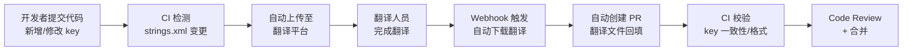
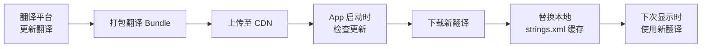
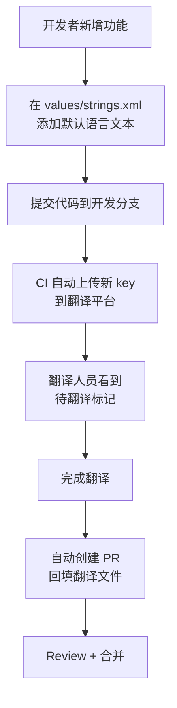
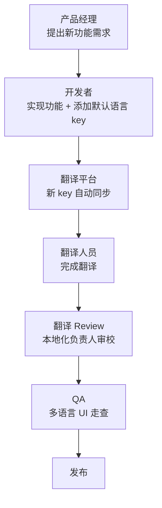

# 翻译平台与工程化集成

## 翻译平台对比

### Crowdin

- **定位**：面向开发者的本地化管理平台
- **核心优势**：GitHub/GitLab 集成优秀，支持社区翻译，有免费的开源项目计划
- **Android 支持**：原生支持 strings.xml，自动检测新增/删除的 key
- **协作**：翻译记忆（TM）、术语表、机器翻译预填充
- **CLI**：`crowdin-cli` 支持脚本化上传/下载

### Lokalise

- **定位**：强调开发者体验的商业本地化平台
- **核心优势**：内置 OTA SDK，支持不发版更新翻译；截图 OCR 自动关联 key
- **Android 支持**：原生支持 strings.xml，支持 plurals 和 string-array
- **协作**：审校工作流、翻译任务分配、质量评分
- **API**：RESTful API 丰富，便于 CI 集成

### Phrase

- **定位**：企业级多平台本地化解决方案
- **核心优势**：完善的审校工作流、风格指南检查、CAT（计算机辅助翻译）工具
- **Android 支持**：strings.xml、支持分支管理
- **协作**：角色权限精细控制、翻译版本历史

### Transifex

- **定位**：历史悠久的翻译管理平台
- **核心优势**：API 丰富、Webhook 支持好、大型开源社区翻译经验丰富
- **Android 支持**：strings.xml 原生支持
- **协作**：翻译记忆库共享、社区翻译

### 选型决策矩阵

| 维度 | Crowdin | Lokalise | Phrase | Transifex |
|------|:-------:|:--------:|:------:|:---------:|
| **免费方案** | ✅ 开源免费 | ❌ 仅试用 | ❌ 仅试用 | ✅ 开源免费 |
| **GitHub 集成** | ⭐⭐⭐ | ⭐⭐ | ⭐⭐ | ⭐⭐ |
| **OTA 更新** | ❌ | ✅ | ❌ | ❌ |
| **机器翻译** | ✅ | ✅ | ✅ | ✅ |
| **翻译记忆** | ✅ | ✅ | ✅ | ✅ |
| **审校工作流** | ⭐⭐ | ⭐⭐ | ⭐⭐⭐ | ⭐⭐ |
| **API 完整度** | ⭐⭐⭐ | ⭐⭐⭐ | ⭐⭐ | ⭐⭐⭐ |
| **适合团队** | 中小型 | 中大型 | 企业级 | 大型开源 |

## CI/CD 集成工作流

### 整体流程



### 自动提取与上传

以 Crowdin 为例，在 CI 中自动上传源文件：

```yaml
# .github/workflows/upload-translations.yml
name: Upload Source Strings
on:
  push:
    branches: [main]
    paths: ['app/src/main/res/values/strings*.xml']

jobs:
  upload:
    runs-on: ubuntu-latest
    steps:
      - uses: actions/checkout@v4
      - name: Upload source files
        uses: crowdin/github-action@v2
        with:
          upload_sources: true
          upload_translations: false
        env:
          CROWDIN_PROJECT_ID: ${{ secrets.CROWDIN_PROJECT_ID }}
          CROWDIN_PERSONAL_TOKEN: ${{ secrets.CROWDIN_TOKEN }}
```

### 翻译完成后自动回填

```yaml
# .github/workflows/download-translations.yml
name: Download Translations
on:
  schedule:
    - cron: '0 8 * * 1-5'  # 工作日每天早上 8 点
  workflow_dispatch:  # 支持手动触发

jobs:
  download:
    runs-on: ubuntu-latest
    steps:
      - uses: actions/checkout@v4
      - name: Download translations
        uses: crowdin/github-action@v2
        with:
          upload_sources: false
          download_translations: true
          create_pull_request: true
          pull_request_title: 'chore(i18n): update translations'
          pull_request_labels: 'i18n,automated'
        env:
          CROWDIN_PROJECT_ID: ${{ secrets.CROWDIN_PROJECT_ID }}
          CROWDIN_PERSONAL_TOKEN: ${{ secrets.CROWDIN_TOKEN }}
          GITHUB_TOKEN: ${{ secrets.GITHUB_TOKEN }}
```

### PR 自动创建与 Review

翻译回填的 PR 应该：
- 自动标记 `i18n` label
- 指定翻译负责人为 Reviewer
- CI 自动运行翻译校验（key 一致性、格式符匹配）
- 通过校验后可自动合并（或由负责人手动合并）

## Git 分支策略

### 翻译分支管理

| 策略 | 说明 | 适用场景 |
|------|------|----------|
| **集成到开发分支** | 翻译直接提交到 `develop` 分支 | 小团队、翻译量少 |
| **独立翻译分支** | 使用 `i18n/update-*` 分支，完成后合并 | 中大型团队 |
| **翻译平台管理** | 翻译文件完全由平台管理，通过 PR 回填 | 使用 Crowdin/Lokalise |

### 合并冲突处理

strings.xml 冲突是 i18n 项目中的高频问题。推荐策略：

```xml
<!-- 按 key 名称字母排序，减少冲突概率 -->
<resources>
    <string name="common_btn_cancel">取消</string>
    <string name="common_btn_confirm">确认</string>
    <!-- 新增 key 总是追加到对应模块的末尾 -->
    <string name="login_btn_submit">登录</string>
    <string name="login_error_invalid">密码错误</string>
</resources>
```

> **技巧**：可以配置 `.gitattributes` 使用自定义 merge driver 处理 XML 合并：
> ```
> *.xml merge=xmlmerge
> ```

### 翻译文件锁定机制

防止翻译文件在翻译过程中被开发者误修改：

1. **CODEOWNERS**：在 `.github/CODEOWNERS` 中指定翻译文件的负责人
   ```
   app/src/main/res/values-*/strings*.xml @i18n-team
   ```
2. **Branch Protection**：翻译 PR 需要 i18n 团队 approve
3. **Lint 检查**：开发者修改非默认语言的 strings.xml 时触发警告

## OTA 翻译更新

### OTA 方案概述

OTA（Over-The-Air）翻译更新允许在不发版的情况下修复翻译错误或添加新翻译：



### Lokalise OTA SDK

```kotlin
// build.gradle.kts
dependencies {
    implementation("com.lokalise.android:sdk:2.1.0")
}

// Application 中初始化
class MyApplication : Application() {
    override fun onCreate() {
        super.onCreate()
        Lokalise.init(this, "sdk_token", "project_id")
        Lokalise.updateTranslations()
    }
}
```

### 自建 OTA 方案

```kotlin
object TranslationOta {
    private const val TRANSLATION_URL = "https://cdn.example.com/translations"

    suspend fun checkAndUpdate(context: Context) {
        val currentVersion = getLocalVersion(context)
        val remoteVersion = fetchRemoteVersion()

        if (remoteVersion > currentVersion) {
            val translations = downloadTranslations(remoteVersion)
            saveToLocal(context, translations)
            updateLocalVersion(context, remoteVersion)
        }
    }

    fun getString(context: Context, key: String): String? {
        // 优先从 OTA 缓存获取
        return getOtaString(context, key)
    }
}
```

### OTA 的限制与风险

| 风险 | 说明 | 缓解方案 |
|------|------|----------|
| 缓存一致性 | 新旧翻译混合显示 | 原子更新，全量替换而非增量 |
| 版本兼容 | 新翻译引用了新版本才有的 key | 翻译 Bundle 与 App 版本绑定 |
| 回滚 | OTA 翻译有误需要回退 | 保留上一版本缓存，支持回滚 |
| 离线 | 无网络时无法获取更新 | 本地 strings.xml 作为兜底 |

## 翻译 Key 管理规范

### Key 命名规范

参考 `02-字符串与翻译管理` 中的命名规范，确保团队统一遵循 `模块_组件_用途` 格式。

### 新增 Key 流程



### 废弃 Key 清理

定期运行清理脚本，移除代码中不再引用的 key：

```bash
#!/bin/bash
# clean_unused_strings.sh

STRINGS_FILE="app/src/main/res/values/strings.xml"
SRC_DIRS="app/src/main"

# 提取所有 key
KEYS=$(grep -oP 'name="\K[^"]+' "$STRINGS_FILE")

for KEY in $KEYS; do
    # 检查代码中是否有引用
    REFS=$(grep -r "R.string.$KEY\|@string/$KEY" "$SRC_DIRS" --include="*.kt" --include="*.java" --include="*.xml" | grep -v "strings" | wc -l)
    if [ "$REFS" -eq 0 ]; then
        echo "⚠️ Unused key: $KEY"
    fi
done
```

### Key 变更通知

当开发者修改或删除已有 key 时，需要通知翻译团队：

- **修改 key 名称**：在 PR 描述中标注，翻译平台会自动检测为新 key
- **修改默认文本**：翻译平台会自动标记对应 key 为"需重新翻译"
- **删除 key**：在 PR 描述中说明原因，翻译平台会自动标记为废弃

## 自动化脚本工具集

### 缺失翻译检测

```bash
#!/bin/bash
# check_missing_translations.sh

DEFAULT="app/src/main/res/values/strings.xml"
DEFAULT_KEYS=$(grep -oP 'name="\K[^"]+' "$DEFAULT" | sort)
TOTAL=$(echo "$DEFAULT_KEYS" | wc -l)

echo "默认语言共 $TOTAL 个 key"
echo "================================"

for LANG_DIR in app/src/main/res/values-*/; do
    LANG_FILE="$LANG_DIR/strings.xml"
    [ -f "$LANG_FILE" ] || continue

    LANG_KEYS=$(grep -oP 'name="\K[^"]+' "$LANG_FILE" | sort)
    LANG_COUNT=$(echo "$LANG_KEYS" | wc -l)
    MISSING=$(comm -23 <(echo "$DEFAULT_KEYS") <(echo "$LANG_KEYS") | wc -l)
    PERCENT=$((LANG_COUNT * 100 / TOTAL))

    LANG=$(basename "$LANG_DIR")
    echo "$LANG: $LANG_COUNT/$TOTAL ($PERCENT%) - 缺少 $MISSING 个"
done
```

### 格式符匹配校验

检查各语言的格式符（`%1$s`, `%2$d` 等）是否与默认语言一致：

```python
#!/usr/bin/env python3
# check_format_specifiers.py

import re
import xml.etree.ElementTree as ET
from pathlib import Path

FORMAT_PATTERN = re.compile(r'%\d+\$[sdfc]|%[sdfc]')

def get_format_specs(text):
    return sorted(FORMAT_PATTERN.findall(text))

def check_file(default_strings, lang_file):
    tree = ET.parse(lang_file)
    errors = []
    for elem in tree.findall('.//string'):
        name = elem.get('name')
        if name in default_strings and elem.text:
            default_specs = get_format_specs(default_strings[name])
            lang_specs = get_format_specs(elem.text)
            if default_specs != lang_specs:
                errors.append(f"  {name}: expected {default_specs}, got {lang_specs}")
    return errors
```

### 未使用资源清理

```bash
# 使用 Android Lint 检测
./gradlew lintDebug -Dlint.check=UnusedResources

# 使用第三方工具 android-resource-remover
pip install android-resource-remover
android-resource-remover --xml app/build/reports/lint-results.xml
```

### 翻译长度警告

```python
#!/usr/bin/env python3
# check_translation_length.py

import xml.etree.ElementTree as ET
from pathlib import Path

MAX_RATIO = 2.0  # 翻译文本长度不超过默认文本的 2 倍

def check_length(default_file, lang_file):
    default_tree = ET.parse(default_file)
    lang_tree = ET.parse(lang_file)

    default_strings = {e.get('name'): e.text for e in default_tree.findall('.//string') if e.text}
    warnings = []

    for elem in lang_tree.findall('.//string'):
        name = elem.get('name')
        if name in default_strings and elem.text:
            ratio = len(elem.text) / max(len(default_strings[name]), 1)
            if ratio > MAX_RATIO:
                warnings.append(f"  {name}: {ratio:.1f}x longer (may cause UI overflow)")
    return warnings
```

## 与产品/翻译团队的协作

### 协作流程设计



### 翻译上下文提供

提高翻译质量的关键是给翻译人员足够的上下文：

| 上下文类型 | 说明 | 工具支持 |
|-----------|------|----------|
| **截图** | 字符串在 UI 中的实际位置 | Crowdin 截图标注、Lokalise OCR |
| **注释** | 在 strings.xml 中的 XML 注释 | `<!-- Max 20 chars, button text -->` |
| **描述** | 翻译平台中的 key 描述字段 | 各平台支持 |
| **字符限制** | 标注最大长度 | Lokalise 支持长度限制 |
| **术语表** | 统一翻译术语 | 各平台的 Glossary 功能 |

```xml
<!-- 在 strings.xml 中添加翻译注释 -->
<!-- Login button, max 10 characters -->
<string name="login_btn_submit">Log In</string>
<!-- Error message shown when password is incorrect -->
<string name="login_error_invalid_password">Incorrect password</string>
```

### 翻译质量反馈

建立双向反馈通道：

1. **开发/QA → 翻译**：在翻译平台中直接标记问题，@相关翻译人员
2. **翻译 → 开发**：翻译人员对有歧义的 key 在平台中提问
3. **定期同步**：每个版本发布前召开翻译质量回顾会议

## 踩坑记录

> 此区域供团队成员补充项目中遇到的真实案例。

| 日期 | 记录人 | 问题描述 | 解决方案 |
|------|--------|----------|----------|
| | | | |

## 参考资料

- [Crowdin 官方文档 - GitHub Integration](https://support.crowdin.com/github-integration/)
- [Crowdin CLI 文档](https://support.crowdin.com/cli-tool/)
- [Lokalise Android SDK](https://docs.lokalise.com/sdk/android)
- [Phrase Android 集成](https://support.phrase.com/hc/en-us/articles/5784607950236)
- [Transifex API 文档](https://developers.transifex.com/)
- [GitHub Actions - Crowdin](https://github.com/marketplace/actions/crowdin-action)
