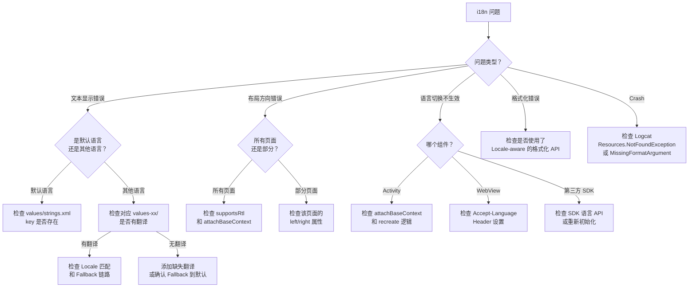

# 调试与常见问题排查

## 调试工具

### ADB 切换设备语言

通过 ADB 命令快速切换设备语言，避免手动进入设置：

```bash
# 查看当前语言设置
adb shell getprop persist.sys.locale

# 切换到阿拉伯语（沙特）
adb shell "setprop persist.sys.locale ar-SA; setprop ctl.restart zygote"

# 切换到简体中文
adb shell "setprop persist.sys.locale zh-CN; setprop ctl.restart zygote"

# 切换到日语
adb shell "setprop persist.sys.locale ja-JP; setprop ctl.restart zygote"

# 恢复英文
adb shell "setprop persist.sys.locale en-US; setprop ctl.restart zygote"
```

> **注意**：`ctl.restart zygote` 会重启所有应用进程，设备会短暂黑屏。在不重启的情况下可以使用 `am` 命令切换：
> ```bash
> # 不重启设备，仅更改设置（需要 root 或 adb root）
> adb shell settings put system system_locales "ar-SA"
> ```

### Layout Inspector 查看布局方向

使用 Android Studio Layout Inspector 检查 RTL 布局状态：

1. 运行应用并切换到 RTL 语言
2. **Tools > Layout Inspector** 打开检查器
3. 在属性面板中检查：
   - `layoutDirection`：`LAYOUT_DIRECTION_RTL` or `LAYOUT_DIRECTION_LTR`
   - `textDirection`：文本方向
   - `textAlignment`：文本对齐方式
   - `paddingStart` / `paddingEnd` 的实际值

### Android Studio Translations Editor

Android Studio 内置的翻译编辑器提供可视化管理界面：

**打开方式**：右键 `strings.xml` > **Open Translations Editor**

功能：
- 表格视图展示所有语言的翻译状态
- 红色高亮缺失翻译
- 支持直接编辑和添加翻译
- 排序和过滤 key

### Locale 信息查看

运行时获取和打印当前 Locale 信息，辅助定位问题：

```kotlin
object LocaleDebugHelper {
    fun logLocaleInfo(context: Context, tag: String = "i18n-debug") {
        val config = context.resources.configuration
        val locales = ConfigurationCompat.getLocales(config)

        Log.d(tag, "=== Locale Debug Info ===")
        Log.d(tag, "Locale.getDefault(): ${Locale.getDefault().toLanguageTag()}")
        Log.d(tag, "Config locales count: ${locales.size()}")
        for (i in 0 until locales.size()) {
            Log.d(tag, "  [$i] ${locales[i]?.toLanguageTag()}")
        }
        Log.d(tag, "Layout direction: ${
            if (config.layoutDirection == Configuration.SCREENLAYOUT_LAYOUTDIR_RTL) "RTL" else "LTR"
        }")
        Log.d(tag, "Context class: ${context.javaClass.simpleName}")
        Log.d(tag, "============================")
    }
}

// 在关键位置调用
class MyActivity : BaseActivity() {
    override fun onCreate(savedInstanceState: Bundle?) {
        super.onCreate(savedInstanceState)
        LocaleDebugHelper.logLocaleInfo(this)
    }
}
```

## 常见问题：语言切换

### WebView 语言不同步

**现象**：应用内切换到中文后，WebView 加载的 H5 页面仍然显示英文。

**原因**：WebView 使用独立的 Chromium 进程，读取系统 Locale 而非应用 Configuration 中的 Locale。

**解决方案**：

```kotlin
// 方案 1（推荐）：通过 HTTP Header 传递语言
fun loadWebPage(webView: WebView, url: String) {
    val locale = webView.context.resources.configuration.locales[0]
    val headers = mapOf(
        "Accept-Language" to locale.toLanguageTag()
    )
    webView.loadUrl(url, headers)
}

// 方案 2：通过 URL 参数传递
fun loadWebPage(webView: WebView, baseUrl: String) {
    val locale = webView.context.resources.configuration.locales[0]
    val url = "$baseUrl?lang=${locale.toLanguageTag()}"
    webView.loadUrl(url)
}

// 方案 3：通过 JavaScript Bridge 通知
fun syncLanguageToWeb(webView: WebView) {
    val locale = webView.context.resources.configuration.locales[0]
    webView.evaluateJavascript(
        "window.setAppLanguage && window.setAppLanguage('${locale.toLanguageTag()}')",
        null
    )
}
```

### 第三方 SDK 语言不跟随

**现象**：切换应用语言后，某些第三方 SDK 的 UI（如支付弹窗、分享面板）仍显示旧语言。

**原因**：SDK 在 `init()` 时缓存了 `Locale.getDefault()`，后续不会动态更新。

**解决方案**：

```kotlin
fun onLanguageChanged(context: Context, newLocale: Locale) {
    // 1. 更新全局默认 Locale
    Locale.setDefault(newLocale)

    // 2. 如果 SDK 提供语言设置 API
    ThirdPartySDK.setLanguage(newLocale.toLanguageTag())

    // 3. 如果 SDK 不提供 API，尝试重新初始化
    ThirdPartySDK.destroy()
    ThirdPartySDK.init(context)
}
```

### Activity recreate 状态丢失

**现象**：切换语言后，页面上填写的表单内容、滚动位置、Tab 选中状态丢失。

**原因**：`recreate()` 会销毁并重建 Activity，未保存的瞬态数据丢失。

**解决方案**：

```kotlin
// 1. ViewModel 保存核心数据（recreate 不会销毁 ViewModel）
class FormViewModel : ViewModel() {
    var formData = MutableStateFlow(FormData())
}

// 2. SavedStateHandle 保存需要跨进程恢复的数据
class FormViewModel(savedStateHandle: SavedStateHandle) : ViewModel() {
    var scrollPosition: Int by savedStateHandle.saveable { mutableIntStateOf(0) }
}

// 3. onSaveInstanceState 保存 UI 状态
override fun onSaveInstanceState(outState: Bundle) {
    super.onSaveInstanceState(outState)
    outState.putInt("selected_tab", tabLayout.selectedTabPosition)
}
```

### 切换语言后返回栈页面语言不一致

**现象**：在 C 页面切换语言后，C 页面显示新语言，但按返回键回到 B 页面仍显示旧语言。

**原因**：`recreate()` 只重建当前 Activity，返回栈中的其他 Activity 不受影响。

**解决方案**：

```kotlin
// 方案 1：重启整个 Task（简单粗暴但有效）
fun restartApp(context: Context) {
    val intent = context.packageManager.getLaunchIntentForPackage(context.packageName)
    intent?.addFlags(Intent.FLAG_ACTIVITY_CLEAR_TASK or Intent.FLAG_ACTIVITY_NEW_TASK)
    context.startActivity(intent)
    Runtime.getRuntime().exit(0)
}

// 方案 2：使用 AppCompatDelegate（会自动重建所有 Activity）
AppCompatDelegate.setApplicationLocales(LocaleListCompat.forLanguageTags("zh-CN"))

// 方案 3：在 BaseActivity.onResume 中检查语言是否变更
abstract class BaseActivity : AppCompatActivity() {
    private var currentLocale: Locale? = null

    override fun onResume() {
        super.onResume()
        val newLocale = resources.configuration.locales[0]
        if (currentLocale != null && currentLocale != newLocale) {
            recreate()
        }
        currentLocale = newLocale
    }
}
```

## 常见问题：资源加载

### strings.xml 缺失 key 导致 Crash

**现象**：`android.content.res.Resources$NotFoundException: String resource ID #0x...`

**原因**：代码中引用了 `R.string.xxx`，但某个语言的 strings.xml（或默认文件）中缺少此 key。

**排查步骤**：

1. 确认 `values/strings.xml`（默认）中包含该 key
2. 检查 CI 中是否启用了 `MissingTranslation` Lint 检查
3. 运行 `./gradlew lintDebug -Dlint.check=MissingTranslation`

**预防**：

```xml
<!-- lint.xml -->
<lint>
    <issue id="MissingTranslation" severity="error" />
</lint>
```

### 资源 Fallback 到非预期语言

**现象**：设备语言为葡萄牙语（巴西），但应用显示的是西班牙语而不是英语默认语言。

**原因**：Android 7.0+ 的资源匹配算法会根据语言相似度选择"最佳匹配"，葡萄牙语和西班牙语被认为比英语更相近。

**排查**：

```kotlin
// 打印资源匹配结果
val config = resources.configuration
Log.d("i18n", "Resolved locale: ${config.locales[0]}")
Log.d("i18n", "String value: ${getString(R.string.test_key)}")
```

**解决**：确保为所有目标语言提供翻译，或在 `values/strings.xml` 中使用英语作为默认语言（全球通用性最强）。

### App Bundle 语言包未下载

**现象**：用户在应用内切换到日语，但显示的是英文默认值。

**原因**：App Bundle 的 Language Split 导致用户设备上只下载了设备语言的资源包。应用内切换到非设备语言时，对应的资源不存在。

**解决方案**：

```kotlin
// 检查语言资源是否可用
fun isLanguageAvailable(context: Context, locale: Locale): Boolean {
    val config = Configuration(context.resources.configuration)
    config.setLocale(locale)
    val localizedContext = context.createConfigurationContext(config)
    return try {
        val defaultText = context.getString(R.string.test_key)
        val localizedText = localizedContext.getString(R.string.test_key)
        defaultText != localizedText  // 如果相同说明没有本地化资源
    } catch (e: Exception) {
        false
    }
}

// 如果不可用，使用 SplitInstallManager 下载
fun downloadLanguageIfNeeded(context: Context, locale: Locale) {
    if (!isLanguageAvailable(context, locale)) {
        val request = SplitInstallRequest.newBuilder()
            .addLanguage(locale)
            .build()
        SplitInstallManagerFactory.create(context).startInstall(request)
    }
}
```

### 资源缓存导致翻译不更新

**现象**：更新了 strings.xml 并重新安装应用，但某些地方仍显示旧翻译。

**原因**：`ResourcesManager` 缓存了 `Resources` 实例，重新安装时可能复用缓存。

**排查**：

```bash
# 彻底清除应用数据后重新安装
adb shell pm clear com.example.app
adb install -r app-debug.apk
```

## 常见问题：RTL 布局

### 部分页面未镜像

**现象**：大部分页面正确镜像，但个别页面的某些元素位置未翻转。

**排查清单**：

1. 检查是否仍使用 `left/right` 而非 `start/end`
2. 检查自定义 View 是否重写了 `onDraw` 但未处理 `layoutDirection`
3. 检查 ConstraintLayout 是否使用了 `Left/Right` 约束
4. 检查代码中是否有 `Gravity.LEFT/RIGHT`

```bash
# 批量搜索代码中的 left/right 使用
grep -rn "layout_marginLeft\|layout_marginRight\|paddingLeft\|paddingRight\|Gravity.LEFT\|Gravity.RIGHT" \
    app/src/main/res/layout/ app/src/main/java/
```

### 数字/标点在 RTL 文本中位置错乱

**现象**：阿拉伯语文本中的数字、括号、标点位置不正确。

**原因**：Unicode 双向算法（BiDi）对"弱方向"字符（数字、标点）的处理可能不符合预期。

**解决方案**：

```kotlin
// 使用 Unicode 方向标记
val LRM = "\u200E"  // Left-to-Right Mark
val RLM = "\u200F"  // Right-to-Left Mark

// 在数字前后添加方向标记
val phoneText = "${LRM}+86-138xxxx1234${LRM}"

// 使用 BidiFormatter（推荐）
val formatter = BidiFormatter.getInstance()
val wrappedPhone = formatter.unicodeWrap("+86-138xxxx1234", TextDirectionHeuristics.LTR)
```

### 动画方向未适配

**现象**：RTL 布局下，滑动动画（如页面转场）方向不正确。

**解决方案**：

```kotlin
// 资源方式：提供 RTL 专用动画
// res/anim/slide_in_start.xml
// res/anim-ldrtl/slide_in_start.xml（镜像版本）

// 代码方式：根据布局方向选择动画
val isRtl = resources.configuration.layoutDirection == Configuration.SCREENLAYOUT_LAYOUTDIR_RTL
val enterAnim = if (isRtl) R.anim.slide_in_left else R.anim.slide_in_right
val exitAnim = if (isRtl) R.anim.slide_out_right else R.anim.slide_out_left
```

## 常见问题：格式化

### 复数规则错误

**现象**：阿拉伯语中显示 "2 عناصر" 而不是 "عنصران"（阿拉伯语中 2 有专门的双数形式）。

**原因**：未在阿拉伯语 `<plurals>` 中提供 `quantity="two"` 选项。

**解决**：参照 [Unicode CLDR 复数规则](https://cldr.unicode.org/index/cldr-spec/plural-rules) 为每种语言提供完整的复数形式。

### 日期/货币格式不符合地区习惯

**现象**：德国用户看到日期格式 `04/06/2026`（美式格式），而非 `06.04.2026`（德国格式）。

**原因**：使用了 `SimpleDateFormat("MM/dd/yyyy")` 硬编码格式。

**解决**：

```kotlin
// ❌ 硬编码格式
SimpleDateFormat("MM/dd/yyyy").format(date)

// ✅ 使用 Locale-aware 的 DateFormat
DateFormat.getDateInstance(DateFormat.MEDIUM, locale).format(date)
```

### 排序结果不符合语言习惯

**现象**：中文列表按 Unicode 码点排序，结果杂乱无章。

**原因**：使用了 `String.compareTo()` 默认排序，不支持本地化排序规则。

**解决**：使用 `Collator`（参见 `05-日期时间与数字格式化`）。

## 特定设备/ROM 适配

### 小米 MIUI 的 Locale 行为

| 问题 | 说明 | 解决方案 |
|------|------|----------|
| `Locale.getDefault()` 返回 `zh` 而非 `zh-CN` | MIUI 部分版本省略了地区信息 | 检查 `language` 而非 `toLanguageTag()` |
| 应用内语言设置被系统覆盖 | MIUI 有自己的应用语言管理 | 适配 MIUI 的 Per-app Language 机制 |
| 系统重启后语言设置丢失 | SharedPreferences 写入时机问题 | 使用 `commit()` 而非 `apply()` |

### OPPO / vivo ColorOS / OriginOS

| 问题 | 说明 | 解决方案 |
|------|------|----------|
| `Configuration.locale` 返回值异常 | 部分 ROM 修改了 Configuration 的行为 | 始终使用 `configuration.locales[0]` |
| Per-app Language 不生效 | 厂商 ROM 可能覆盖了 AppCompat 行为 | 同时调用 `Locale.setDefault()` + `AppCompatDelegate` |

### 鸿蒙 HarmonyOS 兼容性

| 问题 | 说明 | 解决方案 |
|------|------|----------|
| `LocaleList` API 行为差异 | HarmonyOS 对 Android API 的兼容存在差异 | 添加 try-catch，fallback 到传统 API |
| `AppCompatDelegate` 不完全兼容 | 部分 AppCompat 功能在鸿蒙上行为不同 | 对鸿蒙设备使用 Configuration 方案 |

```kotlin
// 检测是否为鸿蒙系统
fun isHarmonyOS(): Boolean {
    return try {
        val clazz = Class.forName("com.huawei.system.BuildEx")
        val method = clazz.getMethod("getOsBrand")
        "harmony" == method.invoke(null)?.toString()?.lowercase()
    } catch (e: Exception) {
        false
    }
}
```

## 排查流程总结

### i18n 问题排查决策树



### 日志关键字速查

| 关键字 | 含义 | 常见原因 |
|--------|------|----------|
| `Resources$NotFoundException` | 资源未找到 | 默认 strings.xml 缺少 key |
| `MissingFormatArgumentException` | 格式化参数不匹配 | 翻译中格式符 (%1$s) 不一致 |
| `IllegalFormatConversionException` | 格式化类型错误 | 用 %d 格式化了字符串类型 |
| `FATAL EXCEPTION` + `inflate` | 布局加载失败 | RTL 属性使用错误 |
| `No TTS engine installed` | TTS 引擎不可用 | 设备缺少 TTS 引擎或语言包 |
| `SplitInstallException` | 语言包下载失败 | App Bundle 语言包安装错误 |

```bash
# 过滤 i18n 相关日志
adb logcat | grep -E "Resources\$NotFoundException|MissingFormat|IllegalFormat|locale|i18n"
```

## 踩坑记录

> 此区域供团队成员补充项目中遇到的真实案例。

| 日期 | 记录人 | 问题描述 | 解决方案 |
|------|--------|----------|----------|
| | | | |

## 参考资料

- [Android 官方文档 - 调试应用](https://developer.android.com/studio/debug)
- [Android 官方文档 - ADB 命令参考](https://developer.android.com/tools/adb)
- [Android 官方文档 - Layout Inspector](https://developer.android.com/studio/debug/layout-inspector)
- [Android 官方文档 - Translations Editor](https://developer.android.com/studio/write/translations-editor)
- [Stack Overflow - Android Localization FAQ](https://stackoverflow.com/questions/tagged/android+localization)
- [Unicode BiDi 算法](https://unicode.org/reports/tr9/)
