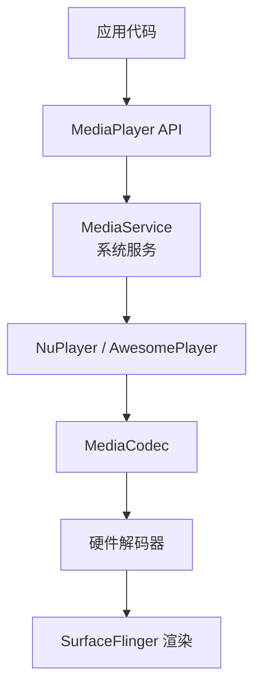
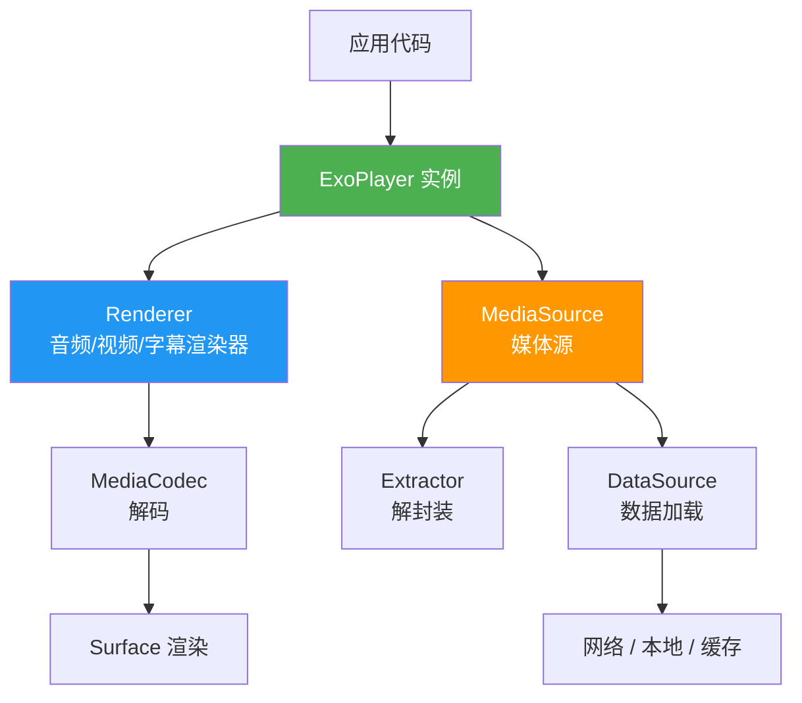
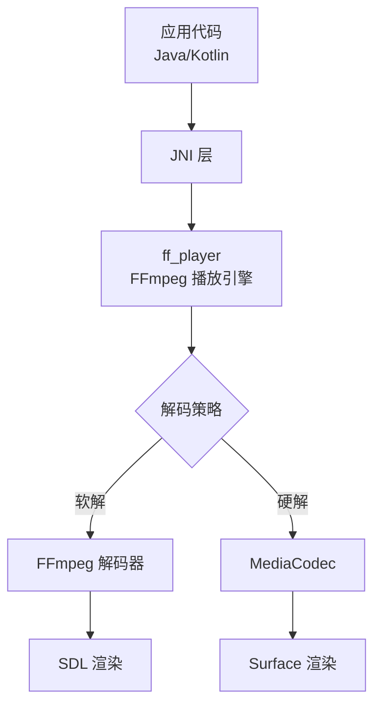
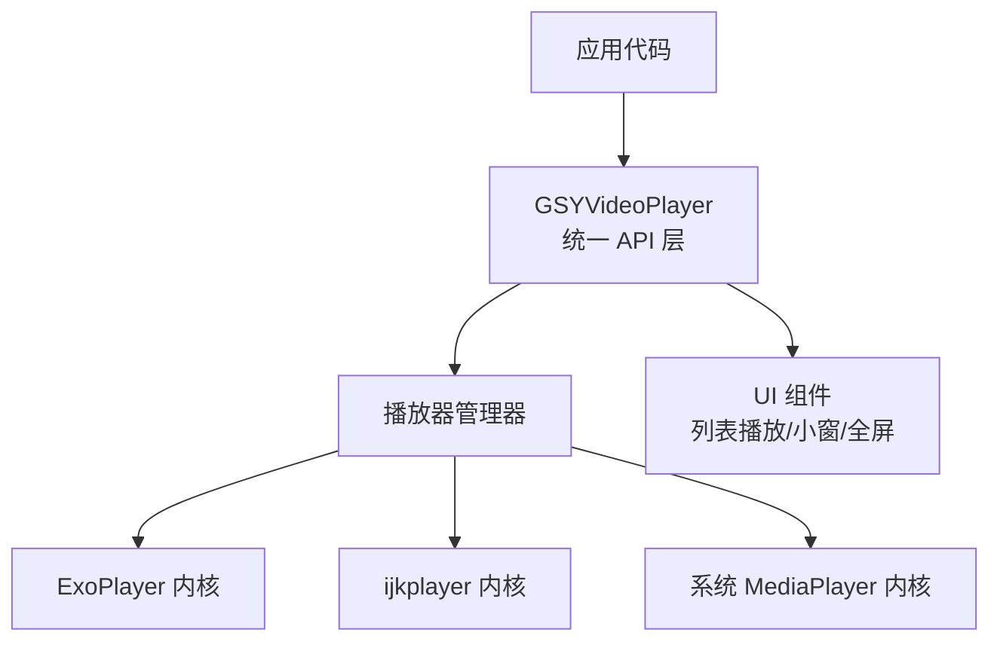
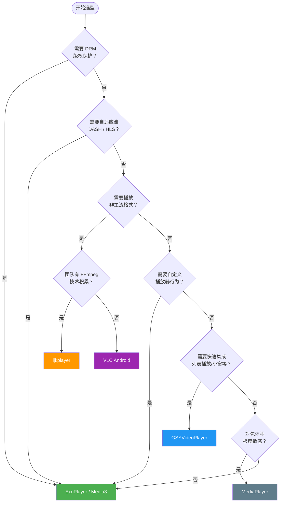

# 播放器方案对比详情

## 综合对比表

| 维度 | MediaPlayer | ExoPlayer / Media3 | ijkplayer | VLC Android | GSYVideoPlayer |
|------|-------------|---------------------|-----------|-------------|----------------|
| **类型** | 系统内置 | Google 官方开源 | Bilibili 开源 | VideoLAN 开源 | 个人开源 |
| **解码方式** | 硬解码 | 硬解码为主 | 硬解 + FFmpeg 软解 | 硬解 + 软解 | 依赖底层播放器内核 |
| **格式支持** | 有限（MP4/3GP/WebM） | 主流格式 + 自适应流 | 几乎全格式 | 全格式 | 取决于内核选择 |
| **DASH / HLS** | 不支持 | ✅ 原生支持 | 部分支持 | ✅ 支持 | 取决于内核 |
| **DRM** | 不支持 | ✅ Widevine / PlayReady | 不支持 | 不支持 | 取决于内核 |
| **自定义能力** | ⭐ 极低 | ⭐⭐⭐⭐⭐ 极高 | ⭐⭐⭐ 中等 | ⭐⭐ 较低 | ⭐⭐⭐⭐ 高（UI 层） |
| **社区活跃度** | Android 官方维护 | ⭐⭐⭐⭐⭐ 非常活跃 | ⭐⭐ 维护放缓 | ⭐⭐⭐ 活跃 | ⭐⭐⭐ 活跃 |
| **包体积增量** | 0（系统内置） | ~2 MB | ~10-30 MB（含 so 库） | ~15-30 MB | ~2 MB + 内核 |
| **学习成本** | ⭐ 低 | ⭐⭐⭐ 中等 | ⭐⭐⭐ 中等 | ⭐⭐ 较低 | ⭐⭐ 较低 |
| **适用场景** | 简单播放 | 商业项目首选 | 格式兼容性要求高 | 万能播放器 | 快速集成 |

## 各方案架构简述

### MediaPlayer 架构



MediaPlayer 是 Android 系统内置组件，通过 Binder 与底层 MediaService 通信。应用层无法干预内部解码和渲染流程。

### ExoPlayer / Media3 架构



ExoPlayer 采用高度模块化设计，每一层都可以替换和自定义。这是它成为主流选择的核心原因。

### ijkplayer 架构



ijkplayer 基于 FFmpeg 的 `ffplay`，通过 JNI 桥接到 Java 层，核心优势是 FFmpeg 的全格式软解码能力。

### GSYVideoPlayer 架构



GSYVideoPlayer 是一个**封装层**，本身不做解码，而是封装了多种播放器内核并提供统一的上层 API 和丰富的 UI 组件。

## MediaPlayer 适用场景与局限性

**适用场景**：
- 播放简单的提示音、背景音乐
- 播放本地 MP4 短视频且无特殊需求
- 对包体积极度敏感的轻量项目

**局限性**：
- 不支持自适应流（DASH / HLS 支持有限）
- 不支持 DRM
- 无法自定义数据加载、缓存策略
- 错误处理机制粗糙，`onError` 回调信息有限
- Seek 行为在不同设备上表现不一致
- 状态机复杂，调用顺序错误容易导致 `IllegalStateException`

## ExoPlayer / Media3 为什么成为主流选择

1. **模块化架构**：DataSource、Extractor、Renderer 均可独立替换，满足各种定制需求
2. **自适应流支持**：原生支持 DASH、HLS、SmoothStreaming
3. **DRM 支持**：内置 Widevine、PlayReady 支持，满足版权内容播放需求
4. **持续维护**：Google 官方维护，与 Android 系统同步演进
5. **丰富的扩展点**：缓存、加密视频、自定义 UI、字幕、多音轨等
6. **Media3 统一体系**：整合了 MediaSession、MediaController，覆盖播放器 + 媒体会话完整链路

```kotlin
// Media3 最简使用示例 — 仅需几行代码即可播放视频
val player = ExoPlayer.Builder(context).build()
playerView.player = player
player.setMediaItem(MediaItem.fromUri("https://example.com/video.mp4"))
player.prepare()
player.play()
```

## ijkplayer 适用场景

**核心优势**：基于 FFmpeg，具备强大的软解码能力，几乎支持所有音视频格式。

**典型场景**：
- 需要播放 RMVB、AVI、FLV、MKV 等老旧或非主流格式
- 对部分低端设备的硬解兼容性有担忧，需要可靠的软解回退
- 已有 FFmpeg 技术积累的团队

**注意事项**：
- Bilibili 官方维护力度已减弱，最近一次重大更新较久远
- 引入 FFmpeg so 库会显著增加包体积（10-30 MB）
- 软解码 CPU 占用高、耗电量大

## 选型决策流程



> **总结**：如果没有特殊约束，**Media3（ExoPlayer）** 是绝大多数 Android 项目的默认最优选择。

## 踩坑记录

> 此区域供团队成员补充项目中遇到的真实案例。

| 日期 | 记录人 | 问题描述 | 解决方案 |
|------|--------|----------|----------|
| | | | |

## 参考资料

- [ExoPlayer 官方文档](https://developer.android.com/guide/topics/media/exoplayer)
- [Media3 官方文档](https://developer.android.com/jetpack/androidx/releases/media3)
- [ijkplayer GitHub](https://github.com/bilibili/ijkplayer)
- [VLC Android](https://code.videolan.org/videolan/vlc-android)
- [GSYVideoPlayer GitHub](https://github.com/CarGuo/GSYVideoPlayer)
- [Android 支持的媒体格式](https://developer.android.com/guide/topics/media/media-formats)
