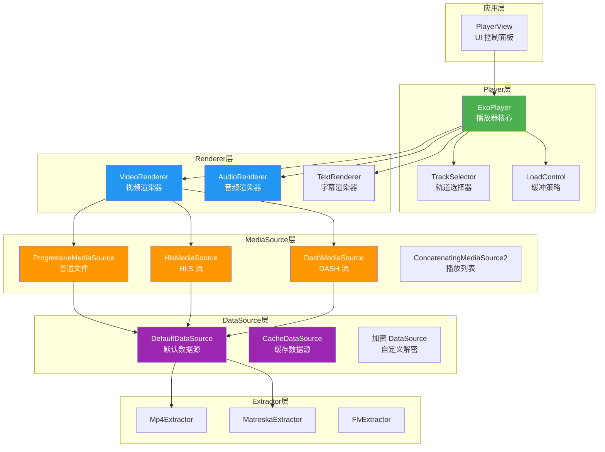
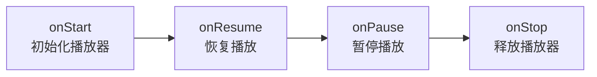

# ExoPlayer / Media3 详解

## 架构设计

ExoPlayer 采用分层模块化架构，每一层职责清晰且可独立替换：



**核心组件职责**：

| 组件 | 职责 |
|------|------|
| **ExoPlayer** | 播放器核心，协调各组件工作 |
| **Renderer** | 解码并渲染音频/视频/字幕轨道 |
| **TrackSelector** | 根据设备能力和用户偏好选择合适的轨道 |
| **MediaSource** | 定义媒体数据的来源和组织方式 |
| **DataSource** | 实际的数据加载（网络、本地、缓存） |
| **Extractor** | 从容器格式中提取音视频流（解封装） |
| **LoadControl** | 控制缓冲策略（缓冲多少数据才开始播放） |

## 从 ExoPlayer 到 Media3 的迁移

ExoPlayer 库已于 2023 年停止独立维护，功能全面迁移到 `androidx.media3`。

**关键变化**：

| ExoPlayer（旧） | Media3（新） |
|-----------------|-------------|
| `com.google.android.exoplayer2` | `androidx.media3.exoplayer` |
| `SimpleExoPlayer` | `ExoPlayer` |
| `StyledPlayerView` | `PlayerView` |
| `MediaSessionConnector` | `MediaSession`（内置支持） |

**迁移步骤**：

1. 替换依赖：`com.google.android.exoplayer:*` → `androidx.media3:*`
2. 修改 import：包名从 `com.google.android.exoplayer2` 改为 `androidx.media3`
3. 使用 [官方迁移脚本](https://developer.android.com/guide/topics/media/media3/getting-started/migration-guide) 批量替换

> 新项目直接使用 Media3，无需再引入独立的 ExoPlayer 库。

## 基础使用

### 添加依赖

```kotlin
// build.gradle.kts (Module)
dependencies {
    // Media3 ExoPlayer 核心
    implementation("androidx.media3:media3-exoplayer:1.3.1")
    // HLS 支持
    implementation("androidx.media3:media3-exoplayer-hls:1.3.1")
    // DASH 支持
    implementation("androidx.media3:media3-exoplayer-dash:1.3.1")
    // UI 组件
    implementation("androidx.media3:media3-ui:1.3.1")
    // MediaSession 支持（后台播放、通知栏控制）
    implementation("androidx.media3:media3-session:1.3.1")
}
```

### PlayerView 布局

```xml
<!-- res/layout/activity_player.xml -->
<androidx.media3.ui.PlayerView
    android:id="@+id/player_view"
    android:layout_width="match_parent"
    android:layout_height="wrap_content"
    app:show_buffering="when_playing"
    app:resize_mode="fit" />
```

### 初始化与播放

```kotlin
class VideoPlayerActivity : AppCompatActivity() {

    private var player: ExoPlayer? = null
    private lateinit var playerView: PlayerView

    override fun onCreate(savedInstanceState: Bundle?) {
        super.onCreate(savedInstanceState)
        setContentView(R.layout.activity_player)
        playerView = findViewById(R.id.player_view)
    }

    private fun initPlayer() {
        player = ExoPlayer.Builder(this)
            .setTrackSelector(DefaultTrackSelector(this).apply {
                // 限制视频分辨率，防止低端设备解码吃力
                setParameters(buildUponParameters().setMaxVideoSizeSd())
            })
            .build()
            .also { exoPlayer ->
                playerView.player = exoPlayer

                // 播放网络视频
                val mediaItem = MediaItem.fromUri(
                    "https://example.com/video.mp4"
                )
                exoPlayer.setMediaItem(mediaItem)
                exoPlayer.prepare()
                exoPlayer.playWhenReady = true
            }
    }

    // 播放本地视频
    private fun playLocalVideo() {
        val uri = Uri.fromFile(File("/sdcard/Movies/sample.mp4"))
        player?.setMediaItem(MediaItem.fromUri(uri))
        player?.prepare()
    }

    override fun onStart() {
        super.onStart()
        initPlayer()
    }

    override fun onStop() {
        super.onStop()
        releasePlayer()
    }

    private fun releasePlayer() {
        player?.let { exoPlayer ->
            exoPlayer.release()
        }
        player = null
    }
}
```

### 播放列表管理

```kotlin
// 构建播放列表
val playlist = listOf(
    MediaItem.fromUri("https://example.com/video1.mp4"),
    MediaItem.fromUri("https://example.com/video2.mp4"),
    MediaItem.Builder()
        .setUri("https://example.com/video3.mp4")
        .setMediaMetadata(
            MediaMetadata.Builder()
                .setTitle("第三个视频")
                .setArtist("作者")
                .build()
        )
        .build()
)

// 设置播放列表
player?.setMediaItems(playlist)
player?.prepare()

// 跳转到第 2 个视频
player?.seekTo(/* mediaItemIndex= */ 1, /* positionMs= */ 0)

// 设置播放列表循环模式
player?.repeatMode = Player.REPEAT_MODE_ALL  // 列表循环
```

## 进阶功能

### 自定义 DataSource（缓存）

```kotlin
// 创建缓存实例（通常在 Application 中初始化为单例）
val cacheDir = File(context.cacheDir, "video_cache")
val cache = SimpleCache(
    cacheDir,
    LeastRecentlyUsedCacheEvictor(200 * 1024 * 1024), // 200MB 上限
    StandaloneDatabaseProvider(context)
)

// 构建带缓存的 DataSource 工厂
val cacheDataSourceFactory = CacheDataSource.Factory()
    .setCache(cache)
    .setUpstreamDataSourceFactory(
        DefaultHttpDataSource.Factory()
            .setUserAgent("MyApp/1.0")
            .setConnectTimeoutMs(10_000)
            .setReadTimeoutMs(15_000)
    )
    .setFlags(CacheDataSource.FLAG_IGNORE_CACHE_ON_ERROR)

// 使用缓存数据源构建播放器
val player = ExoPlayer.Builder(context)
    .setMediaSourceFactory(
        DefaultMediaSourceFactory(context)
            .setDataSourceFactory(cacheDataSourceFactory)
    )
    .build()
```

### 自定义 DataSource（加密视频解密）

```kotlin
/**
 * 自定义 DataSource，在读取数据时做 AES 解密。
 * 适用于播放本地加密视频文件的场景。
 */
class DecryptingDataSource(
    private val upstream: DataSource,
    private val secretKey: SecretKey
) : DataSource {

    private var cipher: Cipher? = null

    override fun open(dataSpec: DataSpec): Long {
        val bytesRead = upstream.open(dataSpec)
        cipher = Cipher.getInstance("AES/CTR/NoPadding").apply {
            init(Cipher.DECRYPT_MODE, secretKey, IvParameterSpec(ByteArray(16)))
        }
        return bytesRead
    }

    override fun read(buffer: ByteArray, offset: Int, length: Int): Int {
        val bytesRead = upstream.read(buffer, offset, length)
        if (bytesRead == C.RESULT_END_OF_INPUT) return bytesRead
        // 就地解密
        val decrypted = cipher!!.update(buffer, offset, bytesRead)
        System.arraycopy(decrypted, 0, buffer, offset, decrypted.size)
        return bytesRead
    }

    override fun getUri(): Uri? = upstream.uri

    override fun close() {
        upstream.close()
        cipher = null
    }

    override fun addTransferListener(transferListener: TransferListener) {
        upstream.addTransferListener(transferListener)
    }
}
```

### 自适应流（HLS / DASH）

```kotlin
// HLS 播放
val hlsItem = MediaItem.Builder()
    .setUri("https://example.com/live/stream.m3u8")
    .setMimeType(MimeTypes.APPLICATION_M3U8)
    .build()
player?.setMediaItem(hlsItem)
player?.prepare()

// DASH 播放
val dashItem = MediaItem.Builder()
    .setUri("https://example.com/vod/manifest.mpd")
    .setMimeType(MimeTypes.APPLICATION_MPD)
    .build()
player?.setMediaItem(dashItem)
player?.prepare()

// 自定义轨道选择：限定最大视频码率，节省流量
val trackSelector = DefaultTrackSelector(context)
trackSelector.setParameters(
    trackSelector.buildUponParameters()
        .setMaxVideoBitrate(2_000_000) // 最大 2Mbps
        .setForceHighestSupportedBitrate(false)
)
```

### DRM 保护内容播放（Widevine）

```kotlin
val drmMediaItem = MediaItem.Builder()
    .setUri("https://example.com/protected/video.mpd")
    .setDrmConfiguration(
        MediaItem.DrmConfiguration.Builder(C.WIDEVINE_UUID)
            .setLicenseUri("https://license.example.com/widevine")
            .setLicenseRequestHeaders(
                mapOf("Authorization" to "Bearer <token>")
            )
            .setMultiSession(false)
            .build()
    )
    .build()

player?.setMediaItem(drmMediaItem)
player?.prepare()
```

### 字幕加载与切换

```kotlin
// 内嵌字幕 + 外挂字幕
val mediaItem = MediaItem.Builder()
    .setUri("https://example.com/video.mp4")
    .setSubtitleConfigurations(
        listOf(
            MediaItem.SubtitleConfiguration.Builder(
                Uri.parse("https://example.com/subs_cn.srt")
            )
                .setMimeType(MimeTypes.APPLICATION_SUBRIP)
                .setLanguage("zh")
                .setLabel("中文字幕")
                .setSelectionFlags(C.SELECTION_FLAG_DEFAULT) // 默认选中
                .build(),
            MediaItem.SubtitleConfiguration.Builder(
                Uri.parse("https://example.com/subs_en.vtt")
            )
                .setMimeType(MimeTypes.TEXT_VTT)
                .setLanguage("en")
                .setLabel("English")
                .build()
        )
    )
    .build()

// 运行时切换字幕轨道
val trackSelector = player?.trackSelector as? DefaultTrackSelector
trackSelector?.setParameters(
    trackSelector.buildUponParameters()
        .setPreferredTextLanguage("en") // 切换到英文字幕
)
```

### 后台播放 + 通知栏控制

```kotlin
/**
 * 媒体播放服务，支持后台播放和系统通知栏控制。
 * 基于 Media3 的 MediaSessionService 实现。
 */
class PlaybackService : MediaSessionService() {

    private var mediaSession: MediaSession? = null

    override fun onCreate() {
        super.onCreate()
        val player = ExoPlayer.Builder(this)
            .setAudioAttributes(
                AudioAttributes.Builder()
                    .setContentType(C.AUDIO_CONTENT_TYPE_MOVIE)
                    .setUsage(C.USAGE_MEDIA)
                    .build(),
                /* handleAudioFocus= */ true // 自动处理音频焦点
            )
            .setHandleAudioBecomingNoisy(true) // 拔出耳机自动暂停
            .build()

        mediaSession = MediaSession.Builder(this, player).build()
    }

    override fun onGetSession(controllerInfo: MediaSession.ControllerInfo): MediaSession? {
        return mediaSession
    }

    override fun onDestroy() {
        mediaSession?.run {
            player.release()
            release()
        }
        mediaSession = null
        super.onDestroy()
    }
}
```

```xml
<!-- AndroidManifest.xml 中注册服务 -->
<service
    android:name=".PlaybackService"
    android:foregroundServiceType="mediaPlayback"
    android:exported="true">
    <intent-filter>
        <action android:name="androidx.media3.session.MediaSessionService"/>
    </intent-filter>
</service>
```

```kotlin
// 在 Activity 中连接服务并控制播放
class PlayerActivity : AppCompatActivity() {

    private var controller: MediaController? = null

    override fun onStart() {
        super.onStart()
        val sessionToken = SessionToken(
            this,
            ComponentName(this, PlaybackService::class.java)
        )
        val future = MediaController.Builder(this, sessionToken).buildAsync()
        future.addListener({
            controller = future.get()
            // 将控制器绑定到 PlayerView
            playerView.player = controller
        }, MoreExecutors.directExecutor())
    }

    override fun onStop() {
        super.onStop()
        controller?.release()
        controller = null
    }
}
```

## 常见坑点

### 1. 播放器生命周期管理



**问题**：播放器未在正确的生命周期释放，导致内存泄漏或后台耗电。

**最佳实践**：
- API 24+：在 `onStart` / `onStop` 中初始化和释放（支持多窗口）
- API 24 以下：在 `onResume` / `onPause` 中处理
- 使用 `Lifecycle` 观察者自动管理：

```kotlin
class PlayerLifecycleObserver(
    private val playerView: PlayerView,
    private val buildPlayer: () -> ExoPlayer
) : DefaultLifecycleObserver {

    private var player: ExoPlayer? = null

    override fun onStart(owner: LifecycleOwner) {
        player = buildPlayer().also { playerView.player = it }
    }

    override fun onStop(owner: LifecycleOwner) {
        player?.release()
        player = null
        playerView.player = null
    }
}

// 在 Activity 中使用
lifecycle.addObserver(
    PlayerLifecycleObserver(playerView) {
        ExoPlayer.Builder(this).build()
    }
)
```

### 2. Surface 切换问题

**问题**：横竖屏切换或 PlayerView 重建时画面黑屏。

**解决方案**：确保 Activity 声明 `configChanges` 避免重建，或在 Surface 变化时正确处理：

```xml
<activity
    android:name=".VideoPlayerActivity"
    android:configChanges="orientation|screenSize|keyboardHidden" />
```

### 3. Seek 不精确

**问题**：`seekTo()` 后画面跳到关键帧而非指定位置。

**原因**：默认 seek 模式是 `SeekParameters.DEFAULT`（就近关键帧），非精确定位。

**解决方案**：

```kotlin
// 启用精确 seek（以解码时间为代价）
player?.setSeekParameters(SeekParameters.EXACT)
```

### 4. 内存泄漏排查

**常见原因**：
- 播放器实例被 Activity/Fragment 引用未释放
- `Player.Listener` 未移除
- `CacheDataSource` 的 `SimpleCache` 未正确关闭

```kotlin
// 释放时清理监听器
player?.removeListener(playerListener)
player?.release()

// Application 退出时关闭缓存
cache.release()
```

## 踩坑记录

> 此区域供团队成员补充项目中遇到的真实案例。

| 日期 | 记录人 | 问题描述 | 解决方案 |
|------|--------|----------|----------|
| | | | |

## 参考资料

- [Media3 官方文档](https://developer.android.com/jetpack/androidx/releases/media3)
- [Media3 迁移指南](https://developer.android.com/guide/topics/media/media3/getting-started/migration-guide)
- [ExoPlayer Codelab](https://developer.android.com/codelabs/exoplayer-intro)
- [Media3 GitHub 仓库](https://github.com/androidx/media)
- [ExoPlayer 架构分析（官方博客）](https://medium.com/google-exoplayer)
