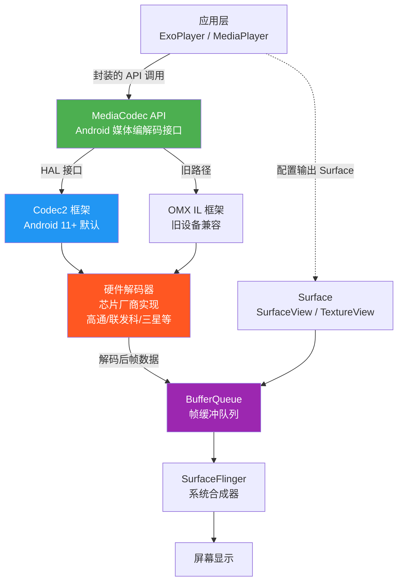
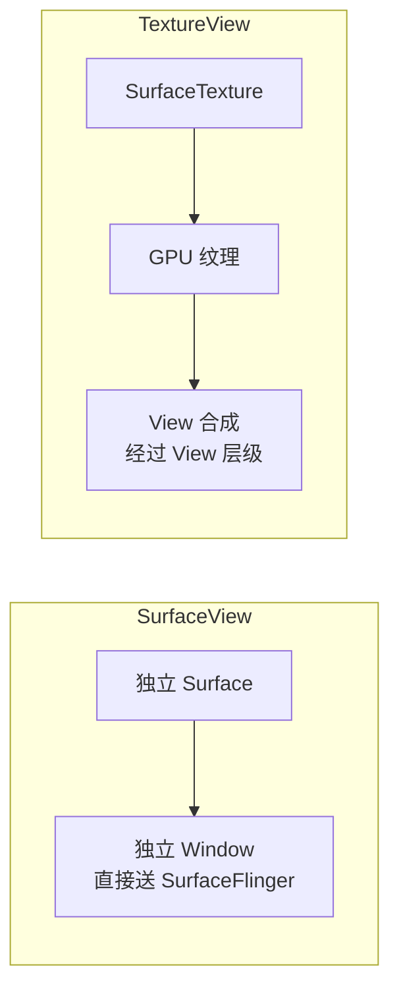
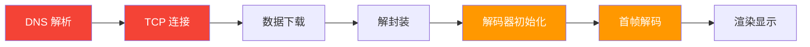

# 视频性能与硬解码详情

## 硬件解码原理

Android 视频硬件解码的完整链路：



**关键流程说明**：

1. **应用层**调用 `MediaCodec.configure()` 配置解码器，传入格式信息和输出 Surface
2. **MediaCodec** 通过 HAL 接口将工作委托给 **Codec2**（或旧设备上的 OMX）
3. **硬件解码器**（芯片厂商实现）完成实际解码，输出帧到 **BufferQueue**
4. **SurfaceFlinger** 从 BufferQueue 取帧进行合成，最终送显

```kotlin
// MediaCodec 硬解码基本流程示例
val format = MediaFormat.createVideoFormat("video/avc", width, height)
val codec = MediaCodec.createDecoderByType("video/avc")

// 配置解码器并关联输出 Surface
codec.configure(format, surface, null, 0)
codec.start()

// 解码循环
while (isDecoding) {
    // 送入待解码数据
    val inputIndex = codec.dequeueInputBuffer(10_000)
    if (inputIndex >= 0) {
        val inputBuffer = codec.getInputBuffer(inputIndex)!!
        val sampleSize = extractor.readSampleData(inputBuffer, 0)
        if (sampleSize >= 0) {
            codec.queueInputBuffer(
                inputIndex, 0, sampleSize,
                extractor.sampleTime, 0
            )
            extractor.advance()
        }
    }

    // 取出解码后的帧（releaseOutputBuffer 时自动渲染到 Surface）
    val outputIndex = codec.dequeueOutputBuffer(bufferInfo, 10_000)
    if (outputIndex >= 0) {
        codec.releaseOutputBuffer(outputIndex, /* render= */ true)
    }
}
```

## SurfaceView vs TextureView 对比

### 渲染机制差异



### 详细对比

| 维度 | SurfaceView | TextureView |
|------|-------------|-------------|
| **渲染方式** | 独立 Window，不经过 View 层级 | 作为普通 View，经过 GPU 纹理合成 |
| **性能** | ⭐⭐⭐⭐⭐ 最优，零额外 GPU 开销 | ⭐⭐⭐ 有额外 GPU 拷贝开销 |
| **功耗** | 更低 | 更高（额外 GPU 合成） |
| **动画/变换** | ❌ 不支持平移、缩放、旋转动画 | ✅ 完整支持 View 动画 |
| **透明度** | ❌ 不支持 alpha 混合 | ✅ 支持 |
| **层级** | 固定在 Window 最底层或最顶层 | 遵循 View 层级 |
| **截图** | ❌ `View.draw()` 无法截取 | ✅ 可正常截取 |
| **RecyclerView 列表** | 闪烁、黑块问题（创建/销毁时） | ✅ 流畅无闪烁 |
| **DRM** | ✅ 支持安全解码路径 | ⚠️ 部分 DRM 不支持 |
| **最低 API** | API 1 | API 14 |

### 选型建议

| 场景 | 推荐 | 理由 |
|------|------|------|
| 全屏视频播放 | **SurfaceView** | 性能最优，无需动画变换 |
| 列表中的视频项 | **TextureView** | 避免 SurfaceView 在列表中的闪烁问题 |
| 需要视频动画效果 | **TextureView** | 支持 View 变换 |
| DRM 保护内容 | **SurfaceView** | 安全解码路径要求 |
| 视频 + 弹幕叠加 | **SurfaceView** + 弹幕 View | SurfaceView 性能好，弹幕在上层 View |
| 画中画 (PIP) | **SurfaceView** | 系统 PIP 模式下性能更优 |

```kotlin
// ExoPlayer 切换渲染模式
val playerView = findViewById<PlayerView>(R.id.player_view)

// 使用 SurfaceView（默认，推荐全屏播放）
playerView.setUseController(true)
// PlayerView 默认使用 SurfaceView，无需额外设置

// 切换为 TextureView（列表场景）
// 在 XML 中设置：
// app:surface_type="texture_view"
// 或代码中：
// playerView = PlayerView(context).apply { ... }
```

## 视频性能优化策略

### 预加载与缓冲策略

```kotlin
// 自定义缓冲策略
val loadControl = DefaultLoadControl.Builder()
    .setBufferDurationsMs(
        /* minBufferMs= */ 15_000,        // 最小缓冲 15s
        /* maxBufferMs= */ 50_000,        // 最大缓冲 50s
        /* bufferForPlaybackMs= */ 2_500, // 缓冲 2.5s 后开始播放
        /* bufferForPlaybackAfterRebufferMs= */ 5_000 // 重新缓冲后需 5s 才恢复
    )
    .setTargetBufferBytes(C.LENGTH_UNSET) // 不限制缓冲大小（按时间控制）
    .setPrioritizeTimeOverSizeThresholds(true)
    .build()

val player = ExoPlayer.Builder(context)
    .setLoadControl(loadControl)
    .build()
```

### 首帧优化（减少黑屏时间）

首帧耗时 = 网络连接 + 数据下载 + 解封装 + 解码器初始化 + 首帧解码 + 渲染



**优化手段**：

```kotlin
// 1. 预连接：提前建立网络连接
val preloadMediaSource = DefaultMediaSourceFactory(context)
    .createMediaSource(MediaItem.fromUri(videoUrl))
// 提前创建 MediaSource 但不播放，让 DNS 和 TCP 提前完成

// 2. 减小 bufferForPlaybackMs：更快开始播放
val fastStartLoadControl = DefaultLoadControl.Builder()
    .setBufferDurationsMs(
        15_000, 50_000,
        /* bufferForPlaybackMs= */ 500,  // 只需 0.5s 缓冲即开始播放
        5_000
    )
    .build()

// 3. 播放前显示视频封面（首帧占位图）
playerView.setUseArtwork(true)
playerView.defaultArtwork = ContextCompat.getDrawable(context, R.drawable.video_cover)

// 4. 监听首帧渲染时间
player?.addListener(object : Player.Listener {
    private var prepareTimeMs = 0L

    override fun onPlaybackStateChanged(state: Int) {
        when (state) {
            Player.STATE_BUFFERING -> {
                prepareTimeMs = SystemClock.elapsedRealtime()
            }
            Player.STATE_READY -> {
                val firstFrameMs = SystemClock.elapsedRealtime() - prepareTimeMs
                Log.d("Performance", "首帧耗时: ${firstFrameMs}ms")
            }
        }
    }

    override fun onRenderedFirstFrame() {
        val firstFrameMs = SystemClock.elapsedRealtime() - prepareTimeMs
        Log.d("Performance", "实际首帧渲染: ${firstFrameMs}ms")
    }
})
```

### 多实例播放的资源管理

**问题**：多个播放器实例同时运行（如信息流列表），硬件解码器实例数有上限（通常 8-16 个）。

```kotlin
/**
 * 播放器实例池，管理多实例场景下的资源回收。
 * 通过 LRU 策略控制同时活跃的播放器数量。
 */
class PlayerPool(
    private val context: Context,
    private val maxInstances: Int = 3 // 同时活跃的最大播放器数
) {
    private val activePlayers = LinkedHashMap<String, ExoPlayer>(
        maxInstances, 0.75f, true // accessOrder = true，LRU 排序
    )

    fun getPlayer(key: String): ExoPlayer {
        activePlayers[key]?.let { return it }

        // 超过上限，释放最久未使用的播放器
        if (activePlayers.size >= maxInstances) {
            val eldest = activePlayers.entries.first()
            eldest.value.release()
            activePlayers.remove(eldest.key)
        }

        val player = ExoPlayer.Builder(context).build()
        activePlayers[key] = player
        return player
    }

    fun releaseAll() {
        activePlayers.values.forEach { it.release() }
        activePlayers.clear()
    }
}
```

### Bitmap / 纹理内存控制

```kotlin
// 监控视频解码的内存使用
fun logVideoMemoryUsage(player: ExoPlayer) {
    val format = player.videoFormat ?: return
    val width = format.width
    val height = format.height

    // 单帧内存估算（YUV420: 1.5 bytes/pixel，RGB: 4 bytes/pixel）
    val yuvFrameBytes = (width * height * 1.5).toLong()
    val rgbFrameBytes = (width * height * 4).toLong()

    // MediaCodec 通常持有 4-8 个输出缓冲帧
    val estimatedBufferMemory = yuvFrameBytes * 6

    Log.d("VideoMemory",
        "分辨率: ${width}x${height}, " +
        "单帧(YUV): ${yuvFrameBytes / 1024}KB, " +
        "预估缓冲占用: ${estimatedBufferMemory / 1024 / 1024}MB"
    )
}

// 降低解码分辨率以减少内存（低端设备策略）
val trackSelector = DefaultTrackSelector(context).apply {
    setParameters(
        buildUponParameters()
            .setMaxVideoSize(1280, 720) // 限制最大 720p
            .setExceedVideoConstraintsIfNecessary(false)
    )
}
```

### 帧率监控与丢帧分析

```kotlin
/**
 * 视频丢帧监控器。
 * 通过 Player.Listener 回调统计丢帧数量，
 * 用于评估播放流畅度。
 */
class FrameDropMonitor : Player.Listener {

    private var totalDropped = 0L
    private var totalRendered = 0L
    private var lastLogTimeMs = 0L

    override fun onVideoFrameProcessingOffset(
        totalProcessingOffsetUs: Long,
        frameCount: Int
    ) {
        // 平均每帧处理延迟
        val avgOffsetMs = totalProcessingOffsetUs / frameCount / 1000
        if (avgOffsetMs > 16) { // 超过一帧时间（60fps）
            Log.w("FrameDrop", "帧处理延迟过高: ${avgOffsetMs}ms/帧")
        }
    }

    override fun onDroppedVideoFrames(count: Int, elapsedMs: Long) {
        totalDropped += count
        val now = SystemClock.elapsedRealtime()
        if (now - lastLogTimeMs > 5_000) { // 每 5 秒输出一次统计
            Log.d("FrameDrop",
                "丢帧统计 - 总丢帧: $totalDropped, " +
                "本次: $count 帧 / ${elapsedMs}ms"
            )
            lastLogTimeMs = now
        }
    }
}

// 使用方式
player?.addAnalyticsListener(object : AnalyticsListener {
    override fun onDroppedVideoFrames(
        eventTime: AnalyticsListener.EventTime,
        droppedFrames: Int,
        elapsedMs: Long
    ) {
        Log.w("Analytics", "丢帧: $droppedFrames 帧, 耗时: ${elapsedMs}ms")
    }

    override fun onVideoDecoderInitialized(
        eventTime: AnalyticsListener.EventTime,
        decoderName: String,
        initializedTimestampMs: Long,
        initializationDurationMs: Long
    ) {
        Log.d("Analytics",
            "解码器: $decoderName, 初始化耗时: ${initializationDurationMs}ms")
    }
})
```

## 性能分析工具

### MediaCodec.getMetrics()

```kotlin
// 获取 MediaCodec 的性能指标（API 26+）
fun dumpCodecMetrics(codec: MediaCodec) {
    if (Build.VERSION.SDK_INT >= Build.VERSION_CODES.O) {
        val metrics = codec.metrics
        Log.d("CodecMetrics", buildString {
            appendLine("=== MediaCodec 性能指标 ===")
            appendLine("编解码器: ${metrics.getString(MediaCodec.MetricsConstants.CODEC)}")
            appendLine("MIME 类型: ${metrics.getString(MediaCodec.MetricsConstants.MIME_TYPE)}")
            appendLine("模式: ${metrics.getString(MediaCodec.MetricsConstants.MODE)}")
            appendLine("分辨率: ${metrics.getInt(MediaCodec.MetricsConstants.WIDTH)}" +
                       "x${metrics.getInt(MediaCodec.MetricsConstants.HEIGHT)}")
            appendLine("安全解码: ${metrics.getInt(MediaCodec.MetricsConstants.SECURE)}")
        })
    }
}
```

### Perfetto 视频解码 Trace

使用 Perfetto 分析视频解码性能的步骤：

1. **启动 Trace 录制**：

```bash
# 在设备上录制 10 秒 trace，包含视频解码相关事件
adb shell perfetto \
  -c - --txt \
  -o /data/misc/perfetto-traces/video_trace.perfetto-trace \
  <<EOF
buffers: {
    size_kb: 63488
}
data_sources: {
    config {
        name: "linux.ftrace"
        ftrace_config {
            ftrace_events: "sched/sched_switch"
            ftrace_events: "power/cpu_frequency"
            ftrace_events: "android_fs/android_fs_dataread_start"
        }
    }
}
data_sources: {
    config {
        name: "android.surfaceflinger.frametimeline"
    }
}
duration_ms: 10000
EOF
```

2. **导出并分析**：

```bash
adb pull /data/misc/perfetto-traces/video_trace.perfetto-trace .
# 在 https://ui.perfetto.dev 中打开分析
```

3. **关注指标**：
   - `MediaCodec` 相关切片：解码耗时
   - `SurfaceFlinger` 帧合成时间
   - CPU 调度：解码线程是否被频繁抢占
   - GPU 渲染：纹理上传耗时

### GPU 渲染分析

```kotlin
// 开启 GPU 渲染分析（调试阶段使用）
// 开发者选项 -> GPU 呈现模式分析 -> 在屏幕上显示为条形图

// 代码中监控 Choreographer 帧耗时
if (Build.VERSION.SDK_INT >= Build.VERSION_CODES.N) {
    val frameMetrics = Window.OnFrameMetricsAvailableListener { _, metrics, _ ->
        val totalDurationMs = metrics.getMetric(
            FrameMetrics.TOTAL_DURATION
        ) / 1_000_000.0 // 纳秒转毫秒

        if (totalDurationMs > 16.67) { // 超过 60fps 的单帧时间
            val layoutMs = metrics.getMetric(
                FrameMetrics.LAYOUT_MEASURE_DURATION
            ) / 1_000_000.0
            val drawMs = metrics.getMetric(
                FrameMetrics.DRAW_DURATION
            ) / 1_000_000.0
            val syncMs = metrics.getMetric(
                FrameMetrics.SYNC_DURATION
            ) / 1_000_000.0

            Log.w("FrameMetrics",
                "慢帧: total=${totalDurationMs}ms, " +
                "layout=${layoutMs}ms, draw=${drawMs}ms, sync=${syncMs}ms"
            )
        }
    }
    window.addOnFrameMetricsAvailableListener(
        frameMetrics, Handler(Looper.getMainLooper())
    )
}
```

## 常见坑点

### 1. 硬解码器实例数超限

**问题**：多实例播放时出现 `MediaCodec.CodecException`，解码器创建失败。

**原因**：大多数设备硬件解码器实例数有限（8-16 个），超限后新实例创建失败。

**解决方案**：
- 使用播放器实例池（见上方 `PlayerPool`）控制同时活跃数
- 不可见的播放器及时释放
- 降级策略：硬解创建失败时回退到软解

### 2. SurfaceView 在 RecyclerView 中黑屏闪烁

**问题**：SurfaceView 在列表滑动时出现黑块或闪烁。

**原因**：SurfaceView 使用独立 Window，创建和销毁时有可见的过渡。

**解决方案**：列表场景改用 TextureView，或使用 `SurfaceView.setZOrderOnTop(true)` + 透明背景缓解。

### 3. 后台切前台视频黑屏

**问题**：App 从后台切回前台后视频画面黑屏，但音频正常。

**原因**：Surface 被销毁后重建，但播放器未重新绑定新 Surface。

**解决方案**：

```kotlin
// 在 PlayerView 被重新 attach 时确保 Surface 绑定
playerView.onResume()

// 或手动监听 Surface 状态
playerView.videoSurfaceView?.let { surfaceView ->
    if (surfaceView is SurfaceView) {
        surfaceView.holder.addCallback(object : SurfaceHolder.Callback {
            override fun surfaceCreated(holder: SurfaceHolder) {
                player?.setVideoSurfaceHolder(holder)
            }
            override fun surfaceChanged(h: SurfaceHolder, f: Int, w: Int, ht: Int) {}
            override fun surfaceDestroyed(holder: SurfaceHolder) {
                player?.clearVideoSurface()
            }
        })
    }
}
```

### 4. 4K 视频播放卡顿

**排查思路**：
1. 确认设备是否支持 4K 硬解码：`MediaCodecList` 查询
2. 检查 Surface 类型：SurfaceView 比 TextureView 开销更低
3. 检查 CPU 是否过载：Perfetto 观察解码线程调度
4. 降级方案：限制分辨率到设备可承受范围

```kotlin
// 查询设备支持的最大解码分辨率
fun getMaxSupportedResolution(mimeType: String): Pair<Int, Int>? {
    val codecList = MediaCodecList(MediaCodecList.ALL_CODECS)
    return codecList.codecInfos
        .filter { !it.isEncoder }
        .flatMap { it.supportedTypes.toList().map { type -> it to type } }
        .filter { (_, type) -> type.equals(mimeType, ignoreCase = true) }
        .mapNotNull { (info, type) ->
            val caps = info.getCapabilitiesForType(type).videoCapabilities
            caps?.supportedWidths?.upper?.let { w ->
                caps.supportedHeights?.upper?.let { h -> w to h }
            }
        }
        .maxByOrNull { (w, h) -> w * h }
}

// 使用示例
val maxRes = getMaxSupportedResolution("video/hevc")
Log.d("DeviceCaps", "H.265 最大支持分辨率: ${maxRes?.first}x${maxRes?.second}")
```

## 踩坑记录

> 此区域供团队成员补充项目中遇到的真实案例。

| 日期 | 记录人 | 问题描述 | 解决方案 |
|------|--------|----------|----------|
| | | | |

## 参考资料

- [MediaCodec 官方文档](https://developer.android.com/reference/android/media/MediaCodec)
- [SurfaceView vs TextureView（Google 官方博客）](https://medium.com/google-developers/android-graphics-surfaceview-vs-textureview-4f6a3efcfb90)
- [Perfetto 使用指南](https://perfetto.dev/docs/)
- [Android 图形架构](https://source.android.com/docs/core/graphics)
- [ExoPlayer 性能调优](https://developer.android.com/guide/topics/media/exoplayer/performance)
- [Android 视频解码能力查询](https://developer.android.com/reference/android/media/MediaCodecList)
