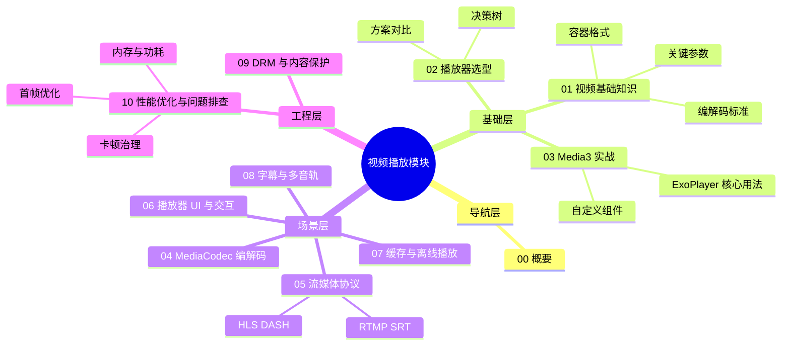
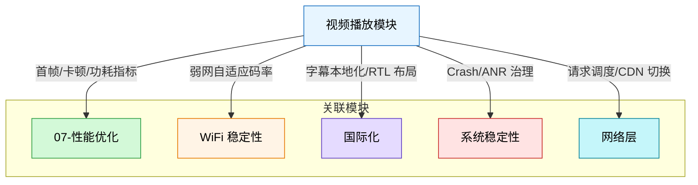

# 视频播放 - 概要

## 模块定位

视频播放是 Android 客户端中最核心的多媒体能力之一。无论是短视频信息流、长视频点播、直播、视频通话，还是广告投放，都离不开一套成熟的视频播放技术体系。

本模块覆盖以下核心领域：

| 领域 | 说明 | 对应文件 |
|------|------|----------|
| 视频基础知识 | 编解码标准、容器格式、关键参数 | `01-视频基础知识` |
| 播放器选型 | 主流方案对比与决策 | `02-播放器选型` |
| Media3 实战 | Google 官方推荐方案的落地实践 | `03-Media3实战` |
| MediaCodec 编解码 | 底层硬件编解码 API | `04-MediaCodec编解码` |
| 流媒体协议 | HLS / DASH / RTMP / SRT 等 | `05-流媒体协议` |
| 播放器 UI 与交互 | 控制栏、手势、画中画、全屏 | `06-播放器UI与交互` |
| 缓存与离线播放 | 预加载、边下边播、离线下载 | `07-缓存与离线播放` |
| 字幕与多音轨 | 字幕渲染、音轨切换 | `08-字幕与多音轨` |
| DRM 与内容保护 | Widevine、数字版权管理 | `09-DRM与内容保护` |
| 性能优化与问题排查 | 首帧、卡顿、内存、功耗 | `10-性能优化与问题排查` |

## 知识全景图

## 模块间关系

视频播放并非孤立模块，它与项目中的多个横向能力存在依赖或协作关系：

## 推荐阅读路径

### 新人入门路径

适合刚接触 Android 视频播放的开发者，按顺序阅读：

1. **概要**（本文）— 建立全局认知
2. **视频基础知识** — 理解编解码、容器、关键参数
3. **播放器选型** — 了解主流方案，做出技术选型
4. **Media3 实战** — 上手 Google 官方推荐方案

### 按需深入路径

已有基础的开发者，根据当前任务选择对应文件：

| 你的任务 | 推荐阅读 |
|----------|----------|
| 需要对接 HLS / DASH 流 | `05-流媒体协议` |
| 要做播放器 UI 或手势控制 | `06-播放器UI与交互` |
| 要实现边下边播 / 离线缓存 | `07-缓存与离线播放` |
| 要接入字幕或多音轨 | `08-字幕与多音轨` |
| 要集成 Widevine DRM | `09-DRM与内容保护` |
| 首帧慢、播放卡顿需要优化 | `10-性能优化与问题排查` |
| 需要直接操作 MediaCodec | `04-MediaCodec编解码` |

## 踩坑记录

> 此区域供团队成员补充项目中遇到的真实案例。

| 日期 | 记录人 | 问题描述 | 解决方案 |
|------|--------|----------|----------|
| | | | |

## 参考资料

- [Android Media 官方文档](https://developer.android.com/media)
- [Media3 Release Notes](https://developer.android.com/jetpack/androidx/releases/media3)
- [ExoPlayer GitHub](https://github.com/google/ExoPlayer)
- [Android Supported Media Formats](https://developer.android.com/guide/topics/media/media-formats)
