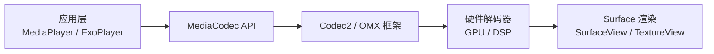
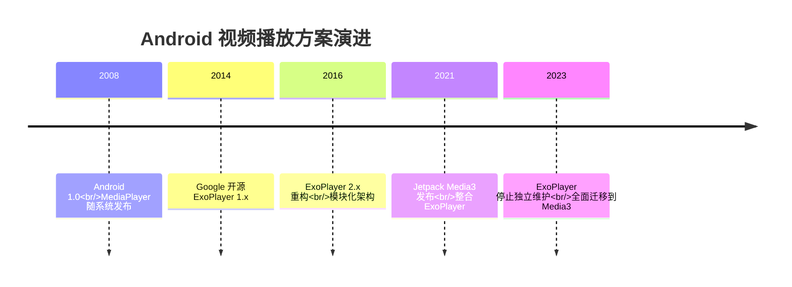

# 视频播放模块概要

## 核心原理

Android 媒体播放的核心链路：



**编解码基础**：

| 编码格式 | 标准组织 | 特点 | Android 支持情况 |
|----------|----------|------|-----------------|
| H.264 (AVC) | ITU-T / ISO | 兼容性最好，应用最广泛 | Android 3.0+ 硬解 |
| H.265 (HEVC) | ITU-T / ISO | 比 H.264 压缩率提升 ~50%，专利费用高 | Android 5.0+ 硬解 |
| VP9 | Google | 免版税，YouTube 主推 | Android 4.4+ 硬解 |
| AV1 | AOMedia | 新一代免版税标准，压缩效率最优 | Android 10+ 软解，部分芯片硬解 |

视频文件 = **容器格式**（MP4、MKV、FLV 等）+ **编码流**（视频编码 + 音频编码）。播放器负责 **解封装**（Extractor）→ **解码**（Decoder）→ **渲染**（Renderer）这三个核心步骤。

## 架构演进



| 阶段 | 方案 | 定位 |
|------|------|------|
| 系统原生 | **MediaPlayer** | Android SDK 内置，API 简单，扩展性差 |
| Google 开源 | **ExoPlayer** | 高度可定制的播放器框架，支持 DASH/HLS/DRM |
| Jetpack 整合 | **Media3** | ExoPlayer 的官方继任者，统一媒体 API 体系 |

## 硬解码 vs 软解码

| 维度 | 硬解码 | 软解码 |
|------|--------|--------|
| 实现方式 | 使用 GPU / 专用 DSP 芯片 | CPU 运行解码算法（如 FFmpeg） |
| 性能 | 高效，功耗低 | CPU 占用高，功耗大 |
| 兼容性 | 依赖芯片厂商，不同设备差异大 | 跨平台一致性好 |
| 格式支持 | 受硬件限制，格式有限 | 支持几乎所有格式 |
| 典型场景 | 主流格式常规播放 | 特殊格式、需要精确控制的场景 |

**选型建议**：优先硬解码（省电、高效），格式不支持或需要精确控制时回退软解码。

## 主流方案对比速览

| 方案 | 类型 | 核心优势 | 适用场景 |
|------|------|----------|----------|
| MediaPlayer | 系统内置 | 零依赖、API 简单 | 简单音视频播放 |
| ExoPlayer / Media3 | Google 官方 | 高度可定制、DASH/HLS/DRM | 大多数商业项目首选 |
| ijkplayer | 基于 FFmpeg | 软解能力强、格式兼容性好 | 需要广泛格式支持的场景 |
| VLC Android | 基于 libVLC | 全格式支持、跨平台 | 万能播放器需求 |
| GSYVideoPlayer | 封装层 | 开箱即用、多播放器内核可切换 | 快速开发、功能导向的项目 |

> 详细对比见 [01-播放器方案对比](01-播放器方案对比media-player-comparison.md)

## 适用场景与选型建议

- **简单音视频播放**（无特殊需求）→ MediaPlayer
- **商业项目主力播放器**（自适应流、DRM、自定义 UI）→ **Media3**（首选）
- **需要软解 / 特殊格式**（RMVB、FLV 等老旧格式）→ ijkplayer
- **全格式万能播放**（播放器类 App）→ VLC Android
- **快速集成、功能丰富**（列表播放、小窗、弹幕）→ GSYVideoPlayer

## 快速上手路径

```
推荐阅读顺序：
1. 本文（概要）        → 建立全局认知
2. 01-播放器方案对比    → 根据需求选型
3. 02-ExoPlayer 详解   → 掌握主流方案
4. 03-视频性能优化      → 性能调优与疑难排查
```
