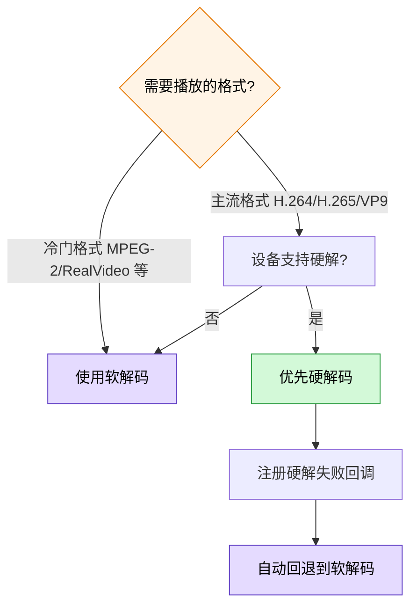
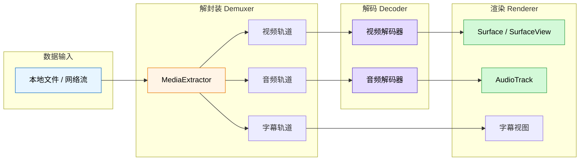
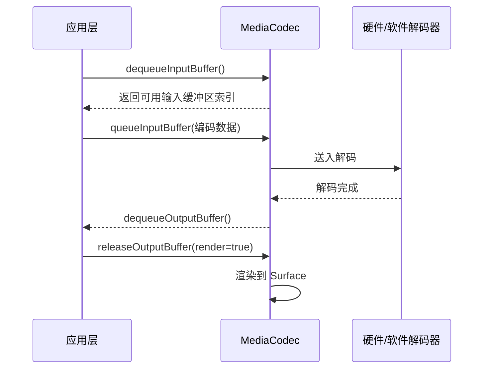

# 视频基础知识

## 视频编解码标准

编解码（Codec）决定了视频数据如何被压缩和解压。选择合适的编解码标准直接影响画质、文件大小、设备兼容性和功耗。

### H.264 / AVC

H.264（Advanced Video Coding）是目前覆盖面最广的视频编码标准，由 ITU-T 和 ISO/IEC 联合制定。

**核心特点：**
- 采用宏块（Macroblock）为基本编码单元，块大小最大 16x16
- 支持帧内预测（I 帧）、帧间预测（P/B 帧）、运动补偿、变换编码、熵编码
- 压缩效率在同时代标准中表现优异，画质与码率平衡好

**Android 支持情况：**
- Android 3.0+（API 11）开始全面支持硬件解码
- 所有 Android 设备均支持 H.264 Baseline / Main / High Profile
- 是 Android 平台兼容性最好的编解码标准

**典型应用场景：** 短视频、在线教育、视频通话、绝大多数在线点播平台

### H.265 / HEVC

H.265（High Efficiency Video Coding）是 H.264 的继任者，压缩效率提升约 50%。

**核心特点：**
- 编码单元升级为 CTU（Coding Tree Unit），块大小最大 64x64
- 更精细的预测模式（35 种帧内预测方向 vs H.264 的 9 种）
- 支持更高分辨率（4K/8K）和 HDR

**Android 支持情况：**
- Android 5.0+（API 21）支持硬解码
- 部分低端机型或旧芯片可能不支持，需运行时检测
- 编码端支持从 Android 7.0+（API 24）开始

**典型应用场景：** 4K 视频、HDR 内容、需要节省带宽的场景

```kotlin
// 运行时检测设备是否支持 H.265 硬解码
fun isHevcHardwareDecoderSupported(): Boolean {
    val codecList = MediaCodecList(MediaCodecList.ALL_CODECS)
    return codecList.codecInfos.any { codecInfo ->
        !codecInfo.isEncoder &&
        codecInfo.supportedTypes.any { it.equals("video/hevc", ignoreCase = true) } &&
        codecInfo.isHardwareAccelerated
    }
}
```

### VP9

VP9 是 Google 开发的开源免版税视频编解码标准。

**核心特点：**
- 压缩效率与 H.265 接近，无需支付专利授权费
- 超级块最大 64x64，支持多种分区模式
- 与 WebM 容器深度绑定，YouTube 主力编码格式

**Android 支持情况：**
- Android 4.4+（API 19）开始支持硬解码
- 大多数现代 SoC（骁龙 / 联发科 / 海思）均支持 VP9 硬解

**典型应用场景：** YouTube 播放、WebRTC 视频通话、Web 端视频

### AV1

AV1 是由 AOM（Alliance for Open Media）开发的下一代开源编解码标准。

**核心特点：**
- 压缩效率比 H.265 / VP9 再提升约 30%
- 完全免版税，Google / Apple / Netflix / Amazon 等共同推进
- 超级块最大 128x128，支持更多预测工具

**Android 支持情况：**
- Android 14+（API 34）加入软件 AV1 解码支持
- 硬件解码支持取决于 SoC：骁龙 8 Gen 1+、天玑 9000+、Tensor G2+ 等
- 仍处于逐步普及阶段，需做好回退策略

**典型应用场景：** 下一代视频平台、8K 视频、对带宽成本极度敏感的场景

### 编解码标准对比

| 维度 | H.264 / AVC | H.265 / HEVC | VP9 | AV1 |
|------|-------------|--------------|-----|-----|
| 发布时间 | 2003 | 2013 | 2013 | 2018 |
| 压缩效率（相对 H.264） | 基准 | 提升约 50% | 提升约 45% | 提升约 70% |
| 最大编码块 | 16x16 | 64x64 | 64x64 | 128x128 |
| 专利授权 | 需付费 | 需付费（费用更高） | 免费 | 免费 |
| Android 最低硬解版本 | API 11 | API 21 | API 19 | API 34（部分 SoC） |
| 设备兼容率 | 接近 100% | 约 85%+ | 约 80%+ | 约 30%（快速增长） |
| 编码复杂度 | 低 | 中 | 中 | 高 |
| HDR 支持 | 有限 | 完善 | 完善 | 完善 |
| 典型使用者 | 全平台通用 | Apple / 运营商 | YouTube / Google | Netflix / YouTube |

**选型建议：** 优先 H.264 保兼容性，有带宽压力用 H.265/VP9，面向未来可试点 AV1 但需做好回退。

## 容器格式

容器格式（Container Format）负责将编码后的视频流、音频流、字幕等多路数据封装到一个文件中。容器本身不决定画质，它定义的是"怎么打包"。

### MP4

**全称：** MPEG-4 Part 14

**特点：**
- 最通用的容器格式，几乎所有设备和平台都支持
- 基于 ISO Base Media File Format（ISOBMFF）
- 支持 H.264 / H.265 / AAC / AC-3 等主流编解码
- `moov` 原子（元数据）默认在文件末尾，流媒体播放时需移至头部（`faststart`）

**Android 支持：** 原生全版本支持

### MKV

**全称：** Matroska Video

**特点：**
- 开源容器格式，扩展性极强
- 支持几乎所有编解码标准，可容纳多音轨 / 多字幕
- 支持章节标记、附件、标签等丰富元数据
- 文件体积略大于 MP4

**Android 支持：** Android 4.0+ 通过 MediaExtractor 支持；ExoPlayer / Media3 支持良好

### FLV

**全称：** Flash Video

**特点：**
- 早期互联网视频的主流格式，与 RTMP 协议深度绑定
- 结构简单，头部小，适合流式传输
- 仅支持有限的编解码（H.264 + AAC 为主）
- 不支持 H.265（非标准扩展除外）

**Android 支持：** 原生不支持，需要 ExoPlayer 扩展或 ijkplayer

### TS

**全称：** MPEG Transport Stream

**特点：**
- 为流媒体传输而设计，每个 TS 包固定 188 字节
- 天然支持丢包容错，适合网络传输和广播
- HLS 协议的分片格式
- 同一内容 TS 文件大小略大于 MP4（包头开销）

**Android 支持：** 原生 MediaExtractor 支持有限；ExoPlayer / Media3 完整支持

### 容器格式对比与适用场景

| 维度 | MP4 | MKV | FLV | TS |
|------|-----|-----|-----|-----|
| 通用性 | 极高 | 高 | 低（已过时） | 中 |
| 流媒体友好 | 需 faststart | 一般 | 好 | 极好 |
| 多音轨/字幕 | 支持 | 非常好 | 不支持 | 支持 |
| 文件体积 | 小 | 中 | 小 | 中偏大 |
| Android 原生 | 全版本 | 4.0+ | 不支持 | 部分 |
| 主要应用 | 点播/下载 | 本地播放 | RTMP 直播 | HLS 分片 |

## 关键参数

### 分辨率

分辨率表示视频画面的像素尺寸，格式为`宽x高`。

| 名称 | 分辨率 | 像素总量 | 适用场景 |
|------|--------|----------|----------|
| SD（标清） | 640x360 | 23 万 | 弱网/省流模式 |
| HD（高清） | 1280x720 | 92 万 | 手机竖屏短视频 |
| FHD（全高清） | 1920x1080 | 207 万 | 手机横屏/平板 |
| 2K | 2560x1440 | 369 万 | 高端平板/电视 |
| 4K（UHD） | 3840x2160 | 829 万 | 大屏/投屏 |

**对播放的影响：** 分辨率越高，解码压力越大，内存和带宽消耗越高。Android 端需根据屏幕实际物理分辨率做自适应，避免解码 4K 视频在 720p 屏幕上播放造成的无谓开销。

### 帧率（FPS）

帧率即每秒显示的画面帧数（Frames Per Second）。

| 帧率 | 特点 | 适用场景 |
|------|------|----------|
| 24 fps | 电影标准帧率 | 影视内容 |
| 25 fps | PAL 制式标准 | 欧洲/中国广播 |
| 30 fps | 互联网视频主流 | 短视频、点播 |
| 60 fps | 高流畅度 | 游戏直播、体育赛事 |
| 120 fps | 超高帧率 | 高端设备慢动作回放 |

**对播放的影响：** 帧率翻倍意味着解码工作量翻倍。60fps 视频在低端机上容易出现掉帧。播放器应检测设备性能并在必要时降帧处理。

### 码率（Bitrate）

码率表示单位时间内的数据量，直接决定画质和文件大小。

| 模式 | 说明 |
|------|------|
| CBR（恒定码率） | 码率固定不变，简单但浪费带宽（静态场景）或画质不足（动态场景） |
| VBR（可变码率） | 根据画面复杂度动态调整，兼顾画质与体积，是主流选择 |
| ABR（平均码率） | 设定目标均值，允许波动，兼顾 CBR 可控性和 VBR 灵活性 |

**常见码率参考：**

| 分辨率 | 推荐码率范围 | 说明 |
|--------|-------------|------|
| 720p | 2-5 Mbps | 手机端主流 |
| 1080p | 4-8 Mbps | 高清点播 |
| 4K | 15-30 Mbps | 需高带宽保障 |

### GOP（关键帧间隔）

GOP（Group of Pictures）定义了两个 I 帧之间的帧数。


- **I 帧（关键帧）：** 完整编码帧，可独立解码，数据量最大
- **P 帧（预测帧）：** 参考前面的帧做预测，数据量中等
- **B 帧（双向预测帧）：** 参考前后帧，压缩率最高，数据量最小

| GOP 大小 | 优势 | 劣势 | 适用场景 |
|----------|------|------|----------|
| 小（1-2 秒） | Seek 响应快，容错好 | 文件大，压缩率低 | 直播、需要频繁 Seek |
| 大（5-10 秒） | 压缩率高，文件小 | Seek 慢，丢帧恢复慢 | 长视频点播 |

**实践建议：** 点播推荐 GOP = 2-4 秒；直播推荐 GOP = 1-2 秒；短视频推荐 GOP = 2 秒。

### 色彩空间与 HDR

**色彩空间** 定义了视频的颜色表示范围：

| 色彩空间 | 说明 | 应用 |
|----------|------|------|
| BT.601 | 标清色彩空间 | SD 视频 |
| BT.709 | 高清色彩空间，sRGB 的视频对应 | 绝大多数 HD/FHD 视频 |
| BT.2020 | 超高清广色域 | 4K HDR 视频 |

**HDR（高动态范围）** 使画面的亮暗细节更加丰富：

| HDR 标准 | 特点 | Android 支持 |
|----------|------|-------------|
| HDR10 | 静态元数据，开放标准 | Android 7.0+ |
| HDR10+ | 动态元数据，Samsung 主推 | Android 9.0+ |
| Dolby Vision | 动态元数据，双层编码 | 取决于设备授权 |
| HLG | 兼容 SDR 显示 | Android 7.0+ |

```kotlin
// 检测设备是否支持 HDR 播放
fun checkHdrSupport(display: Display): List<String> {
    val supported = mutableListOf<String>()
    val hdrCapabilities = display.hdrCapabilities

    hdrCapabilities?.supportedHdrTypes?.forEach { type ->
        when (type) {
            Display.HdrCapabilities.HDR_TYPE_HDR10 -> supported.add("HDR10")
            Display.HdrCapabilities.HDR_TYPE_HDR10_PLUS -> supported.add("HDR10+")
            Display.HdrCapabilities.HDR_TYPE_DOLBY_VISION -> supported.add("Dolby Vision")
            Display.HdrCapabilities.HDR_TYPE_HLG -> supported.add("HLG")
        }
    }
    return supported
}
```

## 硬解码 vs 软解码

### 硬解码原理与优势

硬解码利用设备 SoC 中的专用视频处理单元（VPU / DSP）进行解码，操作系统通过 `MediaCodec` API 调用硬件能力。

**优势：**
- 功耗极低，通常是软解的 1/5 ~ 1/10
- 解码速度快，轻松处理 4K 60fps
- 不占用 CPU 资源，主线程保持流畅

**劣势：**
- 格式支持取决于硬件芯片，不同设备差异大
- 部分机型的硬解实现存在 Bug（色彩异常、崩溃）
- 自定义处理能力有限

### 软解码原理与优势

软解码使用 CPU 通过软件算法（如 FFmpeg）执行解码运算。

**优势：**
- 格式支持极广，理论上可解码任何已知格式
- 行为一致性好，不受硬件差异影响
- 支持自定义后处理（滤镜、转码）

**劣势：**
- CPU 负载高，功耗大，发热严重
- 高分辨率场景下可能帧率不足
- 挤占应用其他线程的 CPU 资源

### 选型建议

| 维度 | 硬解码 | 软解码 |
|------|--------|--------|
| 功耗 | 极低 | 高 |
| 兼容性 | 受芯片限制 | 理论无限制 |
| 解码性能 | 4K 60fps 轻松 | 4K 吃力 |
| 一致性 | 设备间有差异 | 表现一致 |
| 格式覆盖 | 主流格式 | 全格式 |
| CPU 占用 | 几乎为零 | 高（单核或多核） |
| 自定义能力 | 弱 | 强 |



**实践原则：** 硬解优先 + 软解兜底。通过 `MediaCodecList` 在运行时检测硬解能力，不支持时自动回退。

```kotlin
// 硬解优先 + 软解兜底的选择逻辑
fun selectDecoder(mimeType: String): String? {
    val codecList = MediaCodecList(MediaCodecList.REGULAR_CODECS)

    // 优先查找硬件解码器
    val hardwareDecoder = codecList.codecInfos.firstOrNull { info ->
        !info.isEncoder &&
        info.supportedTypes.any { it.equals(mimeType, ignoreCase = true) } &&
        info.isHardwareAccelerated
    }
    if (hardwareDecoder != null) return hardwareDecoder.name

    // 回退到软件解码器
    val softwareDecoder = codecList.codecInfos.firstOrNull { info ->
        !info.isEncoder &&
        info.supportedTypes.any { it.equals(mimeType, ignoreCase = true) }
    }
    return softwareDecoder?.name
}
```

## 视频播放核心流程

视频从文件/网络到屏幕上呈现画面，需经过三个核心阶段：



### 解封装（Demuxer / Extractor）

解封装是将容器格式拆分为独立的音频流、视频流、字幕流的过程。

**Android 中的实现：**
- 原生：`MediaExtractor` — 支持 MP4、MKV、TS 等常见格式
- ExoPlayer / Media3：内置 `Extractor` 接口，支持更多格式并可扩展

```kotlin
// 使用 MediaExtractor 解封装
val extractor = MediaExtractor()
extractor.setDataSource(videoPath)

for (i in 0 until extractor.trackCount) {
    val format = extractor.getTrackFormat(i)
    val mime = format.getString(MediaFormat.KEY_MIME) ?: continue

    when {
        mime.startsWith("video/") -> {
            extractor.selectTrack(i)
            // 获取视频格式信息：分辨率、帧率、码率等
            val width = format.getInteger(MediaFormat.KEY_WIDTH)
            val height = format.getInteger(MediaFormat.KEY_HEIGHT)
        }
        mime.startsWith("audio/") -> {
            // 处理音频轨道
        }
    }
}
```

### 解码（Decoder）

解码器将压缩的编码数据还原为原始的 YUV 像素帧（视频）或 PCM 采样（音频）。

**Android 中的实现：**
- `MediaCodec` — Android 底层编解码 API，同时支持硬解和软解
- ExoPlayer / Media3 在 `MediaCodec` 之上封装了 `MediaCodecRenderer`，自动处理格式切换、错误恢复等

**解码器工作模式（输入/输出缓冲区交替）：**



### 渲染（Renderer）

渲染是将解码后的原始帧数据输出到屏幕或音频设备的最后一步。

**视频渲染：**
- `SurfaceView` — 独立窗口，性能好，适合全屏播放
- `TextureView` — 基于 View 体系，支持动画/透明，但性能略差
- `SurfaceView` 是 ExoPlayer / Media3 的默认推荐

**音频渲染：**
- `AudioTrack` — 底层 API，精确控制播放参数
- `AudioManager` — 系统音频焦点管理
- Media3 通过 `DefaultAudioSink` 统一封装

**音视频同步：**
播放器内部以音频时钟为基准（audio master clock），视频帧根据 PTS（Presentation Time Stamp）与音频时钟对齐。如果视频帧落后则加速/跳帧，领先则等待。

```kotlin
// 选择合适的视频渲染 Surface
// SurfaceView — 推荐用于大多数播放场景
val surfaceView = SurfaceView(context)
player.setVideoSurfaceView(surfaceView)

// TextureView — 需要做动画或圆角裁剪时使用
val textureView = TextureView(context)
player.setVideoTextureView(textureView)
```

## 踩坑记录

> 此区域供团队成员补充项目中遇到的真实案例。

| 日期 | 记录人 | 问题描述 | 解决方案 |
|------|--------|----------|----------|
| | | | |

## 参考资料

- [Android MediaCodec 官方文档](https://developer.android.com/reference/android/media/MediaCodec)
- [Android Supported Media Formats](https://developer.android.com/guide/topics/media/media-formats)
- [H.264 Wikipedia](https://en.wikipedia.org/wiki/Advanced_Video_Coding)
- [H.265 Wikipedia](https://en.wikipedia.org/wiki/High_Efficiency_Video_Coding)
- [AV1 Bitstream & Decoding Process Specification](https://aomediacodec.github.io/av1-spec/)
- [ExoPlayer Supported Formats](https://developer.android.com/media/media3/exoplayer/supported-formats)
- [视频编解码学习资源 - FFmpeg Wiki](https://trac.ffmpeg.org/wiki)
