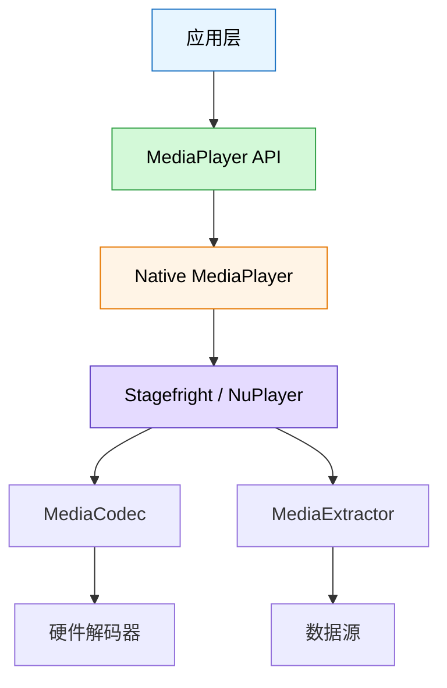
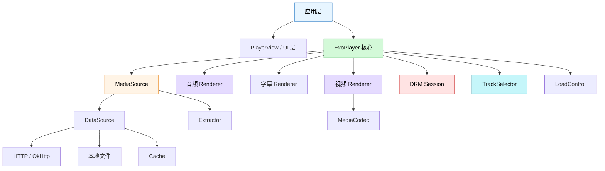
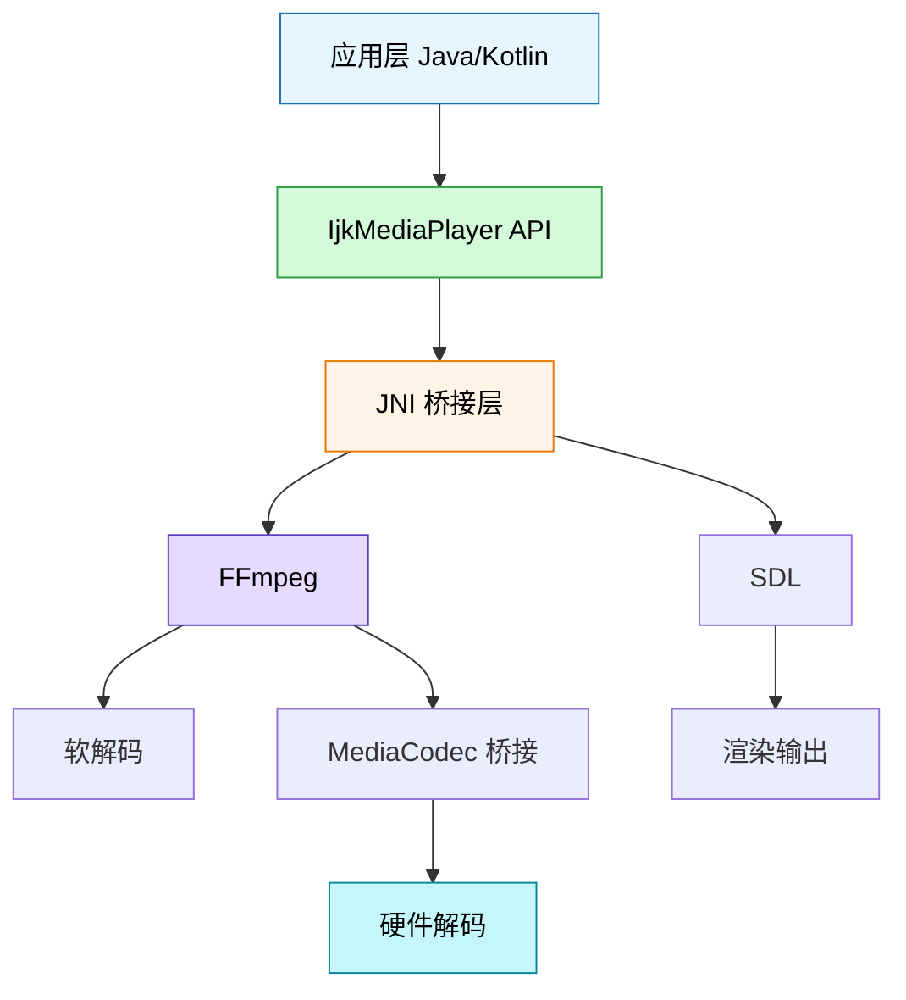
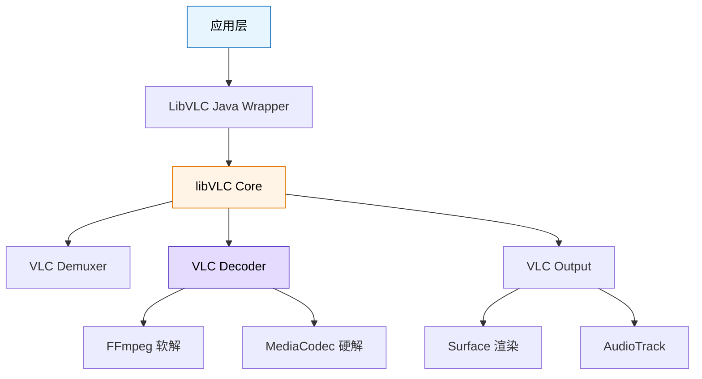
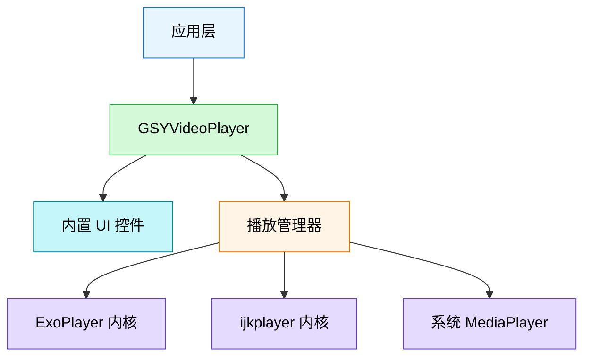
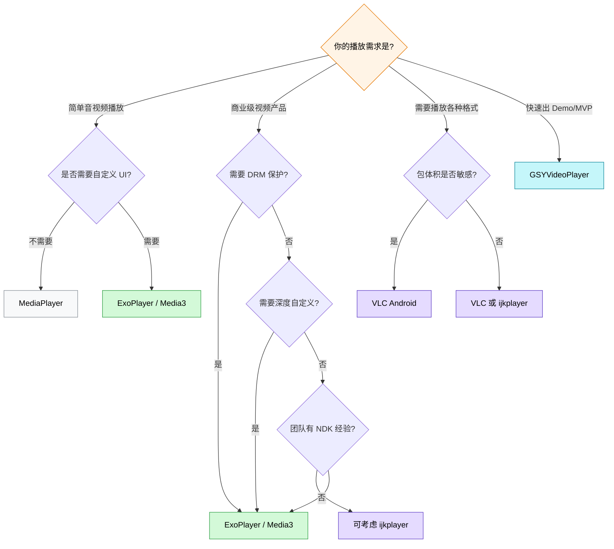

# 播放器选型

## 主流方案总览

| 方案 | 类型 | 核心优势 | 一句话定位 |
|------|------|----------|-----------|
| MediaPlayer | Android 原生 API | 零依赖、系统内置 | 最简单的系统级播放器 |
| ExoPlayer / Media3 | Google 官方开源 | 可扩展、持续维护、功能全面 | Android 商业项目首选播放器 |
| ijkplayer | B站开源（基于 FFmpeg） | 格式兼容广、软硬解切换 | 格式兼容性最强的国产方案 |
| VLC Android | VideoLAN 开源 | 全格式支持、跨平台 | 万能格式的跨平台播放器 |
| GSYVideoPlayer | 国内个人开源 | 快速集成、UI 开箱即用 | 快速搭建播放器 UI 的封装层 |

## 多维度对比

### 格式支持

| 方案 | H.264 | H.265 | VP9 | AV1 | FLV | MKV | RTMP | HLS | DASH |
|------|-------|-------|-----|-----|-----|-----|------|-----|------|
| MediaPlayer | 全支持 | 5.0+ | 4.4+ | 不支持 | 不支持 | 4.0+ | 不支持 | 支持 | 不支持 |
| ExoPlayer / Media3 | 全支持 | 全支持 | 全支持 | 14+ | 扩展支持 | 全支持 | 扩展支持 | 全支持 | 全支持 |
| ijkplayer | 全支持 | 全支持 | 全支持 | 需编译 | 全支持 | 全支持 | 全支持 | 全支持 | 需扩展 |
| VLC Android | 全支持 | 全支持 | 全支持 | 全支持 | 全支持 | 全支持 | 全支持 | 全支持 | 全支持 |
| GSYVideoPlayer | 取决于内核 | 取决于内核 | 取决于内核 | 取决于内核 | 取决于内核 | 取决于内核 | 取决于内核 | 取决于内核 | 取决于内核 |

> GSYVideoPlayer 是封装层，实际能力取决于底层内核选择（ExoPlayer / ijkplayer / 系统播放器）。

### DRM 能力

| 方案 | Widevine L1 | Widevine L3 | PlayReady | ClearKey |
|------|------------|-------------|-----------|---------|
| MediaPlayer | 支持 | 支持 | 部分设备 | 不支持 |
| ExoPlayer / Media3 | 全面支持 | 全面支持 | 部分设备 | 支持 |
| ijkplayer | 不支持 | 不支持 | 不支持 | 不支持 |
| VLC Android | 不支持 | 不支持 | 不支持 | 不支持 |
| GSYVideoPlayer | 取决于内核 | 取决于内核 | 不支持 | 取决于内核 |

**结论：** 如果项目有 DRM 需求（付费视频、版权保护），ExoPlayer / Media3 是唯一成熟选择。

### 自定义扩展性

| 方案 | 自定义 DataSource | 自定义 Renderer | 自定义 UI | 插件机制 |
|------|-------------------|----------------|-----------|----------|
| MediaPlayer | 不支持 | 不支持 | 需自建 | 无 |
| ExoPlayer / Media3 | 全面支持 | 全面支持 | 全面支持 | 组件化架构 |
| ijkplayer | 需改 Native | 需改 Native | 需自建 | 需重编译 |
| VLC Android | 有限 | 有限 | 有限 | 通过 libVLC |
| GSYVideoPlayer | 通过内核 | 通过内核 | 丰富预置 | 内核切换 |

ExoPlayer / Media3 采用高度组件化设计，几乎每个环节都可替换自定义实现。这是它在商业项目中被广泛采用的核心原因。

### 社区活跃度与维护状态

| 方案 | 维护方 | 更新频率 | GitHub Stars | 最新版本状态 |
|------|--------|----------|-------------|-------------|
| MediaPlayer | Google（系统） | 随 Android 版本 | N/A | 持续维护 |
| ExoPlayer / Media3 | Google 官方 | 约每月一次 | 21k+ | 活跃开发中 |
| ijkplayer | B站 | 已大幅放缓 | 32k+ | 基本停更 |
| VLC Android | VideoLAN | 每季度 | 12k+ | 持续维护 |
| GSYVideoPlayer | 个人开发者 | 不定期 | 19k+ | 维护中但节奏慢 |

> **风险提示：** ijkplayer 近年更新极少，已知问题修复缓慢，新功能不再添加。长期项目应谨慎选择。

### 包体积影响

| 方案 | 基础依赖大小 | 说明 |
|------|-------------|------|
| MediaPlayer | 0 KB（系统内置） | 无额外依赖 |
| ExoPlayer / Media3 | 约 1-3 MB | 按需引入模块，可裁剪 |
| ijkplayer | 约 10-20 MB | 包含 FFmpeg so 库，体积较大 |
| VLC Android | 约 15-25 MB | 包含 libVLC，体积最大 |
| GSYVideoPlayer | 约 2-20 MB | 取决于选择的内核 |

```kotlin
// Media3 按需引入，控制包体积
// build.gradle.kts
dependencies {
    // 核心（必须）
    implementation("androidx.media3:media3-exoplayer:1.5.1")

    // 按需添加
    implementation("androidx.media3:media3-exoplayer-hls:1.5.1")   // HLS 支持
    implementation("androidx.media3:media3-exoplayer-dash:1.5.1")  // DASH 支持
    implementation("androidx.media3:media3-ui:1.5.1")              // 播放器 UI
    implementation("androidx.media3:media3-datasource-okhttp:1.5.1") // OkHttp 数据源
}
```

### 学习成本

| 方案 | 学习曲线 | 文档质量 | 中文资料 | 上手难度 |
|------|----------|----------|----------|----------|
| MediaPlayer | 低 | 官方文档完善 | 丰富 | 简单 |
| ExoPlayer / Media3 | 中偏高 | 官方文档+Codelab | 较多 | 需理解组件化架构 |
| ijkplayer | 高 | 文档较少 | 中文为主 | 需 NDK 基础 |
| VLC Android | 中 | 文档一般 | 较少 | 需理解 libVLC |
| GSYVideoPlayer | 低 | README + Demo | 丰富 | 上手最快 |

## 各方案架构简述

### MediaPlayer



**优势：** 零依赖，API 简单，适合简单场景。

**劣势：** 黑盒设计，几乎无法自定义；格式支持有限；不同 Android 版本行为不一致；不支持 DASH，DRM 能力弱。

```kotlin
// MediaPlayer 最简用法
val mediaPlayer = MediaPlayer().apply {
    setDataSource(videoUrl)
    // 设置渲染目标
    setDisplay(surfaceHolder)
    // 异步准备，避免阻塞主线程
    setOnPreparedListener { mp -> mp.start() }
    setOnErrorListener { _, what, extra ->
        Log.e("Player", "播放错误: what=$what, extra=$extra")
        true
    }
    prepareAsync()
}
```

### ExoPlayer / Media3



**核心架构特点：**
- **组件化设计：** DataSource、Extractor、Renderer、TrackSelector、LoadControl 均可替换
- **MediaSource 抽象：** 统一了点播、HLS、DASH、SmoothStreaming 等不同协议
- **DRM 内置支持：** 与 Widevine 深度集成

**优势：** 功能全面、可扩展性极强、Google 官方持续维护、社区活跃。

**劣势：** 学习曲线较陡、部分冷门格式需自行扩展。

```kotlin
// Media3 ExoPlayer 标准初始化
val player = ExoPlayer.Builder(context)
    .setTrackSelector(
        DefaultTrackSelector(context).apply {
            // 限制最大视频分辨率以节省带宽
            setParameters(buildUponParameters().setMaxVideoSizeSd())
        }
    )
    .setLoadControl(
        DefaultLoadControl.Builder()
            .setBufferDurationsMs(
                /* minBufferMs= */ 15_000,
                /* maxBufferMs= */ 50_000,
                /* bufferForPlaybackMs= */ 2_500,
                /* bufferForPlaybackAfterRebufferMs= */ 5_000
            )
            .build()
    )
    .build()

// 设置播放内容
val mediaItem = MediaItem.fromUri(videoUrl)
player.setMediaItem(mediaItem)
player.prepare()
player.play()
```

### ijkplayer



**核心架构特点：**
- 基于 FFmpeg 的 `ff_play` 移植而来
- 通过 JNI 桥接 Native 层，Java 层提供兼容 MediaPlayer 的 API
- 支持编译时裁剪 FFmpeg 模块以控制体积

**优势：** 格式兼容性极强（FFmpeg 加持）、支持 RTMP/FLV 直播、国内社区资料丰富。

**劣势：** 已基本停更、包体积大（含 so 库）、无 DRM 支持、扩展需修改 C/C++ 代码。

### VLC Android



**优势：** 格式支持最全面（桌面级 VLC 能力）、跨平台、持续维护。

**劣势：** 包体积最大、Android 定制能力不如 ExoPlayer、UI 需自建、国内社区较小。

### GSYVideoPlayer



**核心特点：**
- 不是播放器引擎，而是播放器 **封装层**
- 可切换底层内核（ExoPlayer / ijkplayer / 系统播放器）
- 内置丰富的 UI 控件：列表播放、全屏、小窗、弹幕等

**优势：** 上手快、UI 开箱即用、支持多种常见播放场景。

**劣势：** 额外封装层带来性能开销和调试复杂度、深度自定义仍需理解底层内核、个人维护有持续性风险。

## 选型决策树



## 典型场景推荐

### 简单音视频播放

**场景描述：** 应用中仅有少量视频播放需求（如启动页视频、引导页动画），不需要复杂控制和自定义。

**推荐方案：** `MediaPlayer`

**理由：**
- 零依赖，不增加包体积
- API 简单，几行代码即可实现
- 系统内置，稳定性有保障

```kotlin
// 简单的启动页视频播放
class SplashActivity : Activity() {
    private lateinit var mediaPlayer: MediaPlayer

    override fun onCreate(savedInstanceState: Bundle?) {
        super.onCreate(savedInstanceState)
        setContentView(R.layout.activity_splash)

        val surfaceView = findViewById<SurfaceView>(R.id.surface_view)
        surfaceView.holder.addCallback(object : SurfaceHolder.Callback {
            override fun surfaceCreated(holder: SurfaceHolder) {
                mediaPlayer = MediaPlayer().apply {
                    setDataSource(assets.openFd("splash_video.mp4"))
                    setDisplay(holder)
                    isLooping = true
                    setOnPreparedListener { start() }
                    prepareAsync()
                }
            }

            override fun surfaceChanged(h: SurfaceHolder, f: Int, w: Int, he: Int) {}
            override fun surfaceDestroyed(holder: SurfaceHolder) {
                mediaPlayer.release()
            }
        })
    }
}
```

### 商业项目主力播放器

**场景描述：** 视频是产品核心功能，需要 HLS/DASH 支持、DRM 保护、自适应码率、自定义 UI、后台播放等。

**推荐方案：** `ExoPlayer / Media3`

**理由：**
- Google 官方维护，长期稳定性有保障
- 组件化架构，任何环节均可自定义
- DRM（Widevine）深度集成
- 丰富的官方文档和社区支持
- 与 Jetpack 生态无缝衔接（MediaSession、Compose UI）

```kotlin
// 商业项目播放器配置示例
val player = ExoPlayer.Builder(context)
    .setTrackSelector(DefaultTrackSelector(context).apply {
        setParameters(
            buildUponParameters()
                .setPreferredAudioLanguage("zh")     // 默认中文音轨
                .setPreferredTextLanguage("zh")      // 默认中文字幕
        )
    })
    .setMediaSourceFactory(
        DefaultMediaSourceFactory(context)
            .setDataSourceFactory(
                // 使用 OkHttp 作为网络层，复用连接池
                OkHttpDataSource.Factory(okHttpClient)
                    .setDefaultRequestProperties(authHeaders)
            )
    )
    .build()

// 播放 DRM 保护内容
val drmMediaItem = MediaItem.Builder()
    .setUri(contentUrl)
    .setDrmConfiguration(
        MediaItem.DrmConfiguration.Builder(C.WIDEVINE_UUID)
            .setLicenseUri(licenseServerUrl)
            .build()
    )
    .build()

player.setMediaItem(drmMediaItem)
player.prepare()
```

### 广泛格式兼容需求

**场景描述：** 需要播放用户上传的任意格式视频（RMVB、AVI、WMV 等老旧格式），或对接多种来源的视频流。

**推荐方案：** `VLC Android`（包体积不敏感时）或 `ijkplayer`（有 NDK 经验时）

**理由：**
- 基于 FFmpeg / libVLC 的全格式解码能力
- 软解兜底确保任何格式都能播放

**注意事项：**
- ijkplayer 已近停更，需评估长期维护风险
- VLC 包体积较大（15-25 MB），需考虑对安装包的影响
- 建议：如非必须，优先考虑 ExoPlayer + FFmpeg 扩展的组合方案

### 快速集成需求

**场景描述：** 快速搭建 Demo 或 MVP，需要开箱即用的播放器 UI（列表播放、全屏切换、手势控制等）。

**推荐方案：** `GSYVideoPlayer`

**理由：**
- 内置完整的播放器 UI，无需从零搭建
- 支持列表播放、无缝全屏、小窗等常见功能
- 底层可选择 ExoPlayer 或 ijkplayer 作为内核

```kotlin
// GSYVideoPlayer 快速集成
val videoPlayer = GSYVideoOptionBuilder()
    .setUrl(videoUrl)
    .setIsTouchWiget(true)             // 启用手势控制
    .setRotateViewAuto(false)          // 关闭自动旋转
    .setAutoFullWithSize(true)         // 根据视频比例自动全屏
    .setShowFullAnimation(true)        // 全屏切换动画
    .setNeedLockFull(true)             // 全屏锁定按钮
    .setCacheWithPlay(true)            // 边播边缓存
    .setVideoTitle("示例视频")
    .build(gsyVideoPlayer)

gsyVideoPlayer.startPlayLogic()
```

**迁移建议：** GSYVideoPlayer 适合 MVP 阶段，产品稳定后建议迁移到 ExoPlayer / Media3 以获得更好的自定义能力和长期维护保障。

## 踩坑记录

> 此区域供团队成员补充项目中遇到的真实案例。

| 日期 | 记录人 | 问题描述 | 解决方案 |
|------|--------|----------|----------|
| | | | |

## 参考资料

- [Media3 官方文档](https://developer.android.com/media/media3)
- [ExoPlayer GitHub](https://github.com/google/ExoPlayer)
- [ijkplayer GitHub](https://github.com/bilibili/ijkplayer)
- [VLC Android](https://code.videolan.org/videolan/vlc-android)
- [GSYVideoPlayer GitHub](https://github.com/CarGuo/GSYVideoPlayer)
- [Android MediaPlayer 官方文档](https://developer.android.com/reference/android/media/MediaPlayer)
- [Choosing a Media Player - Android Developers](https://developer.android.com/media/media3/exoplayer/hello-world)
