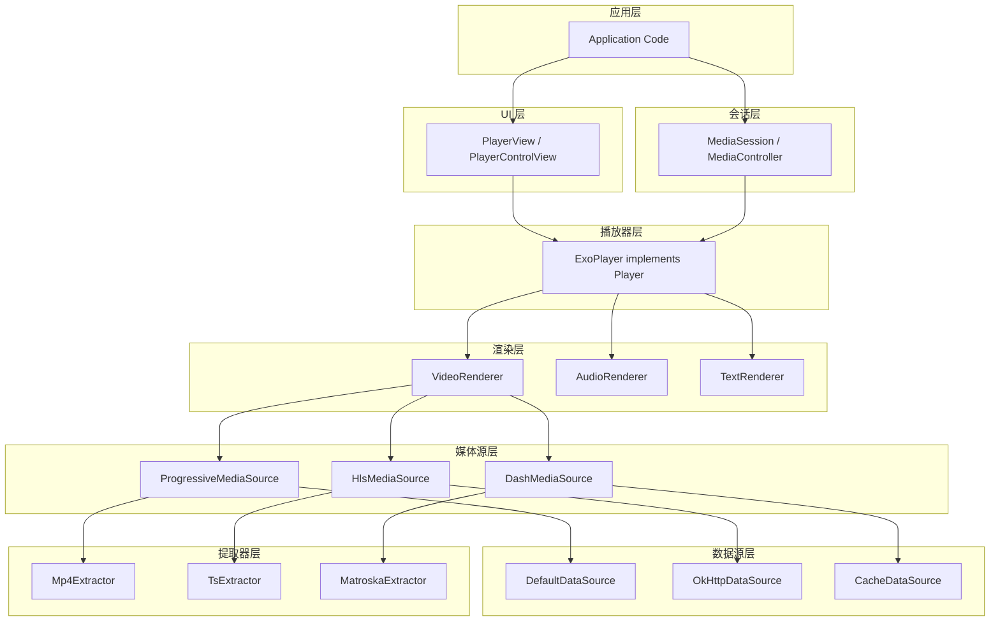
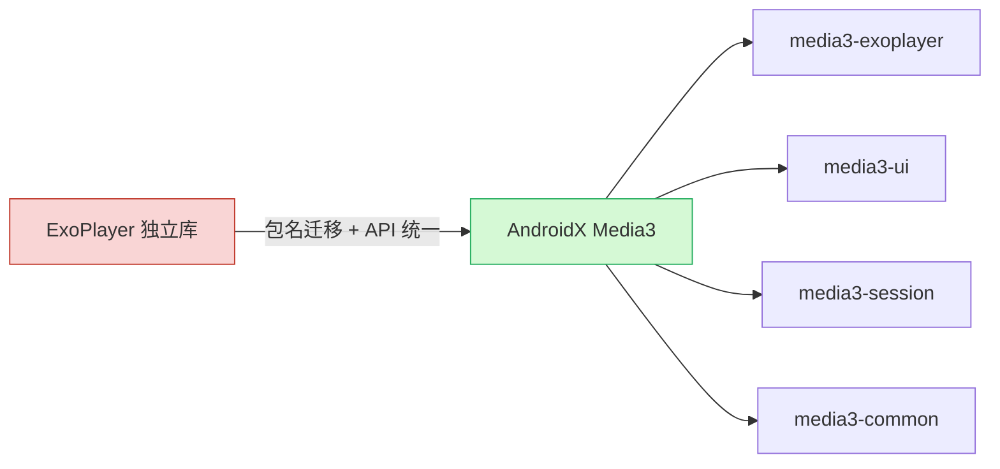
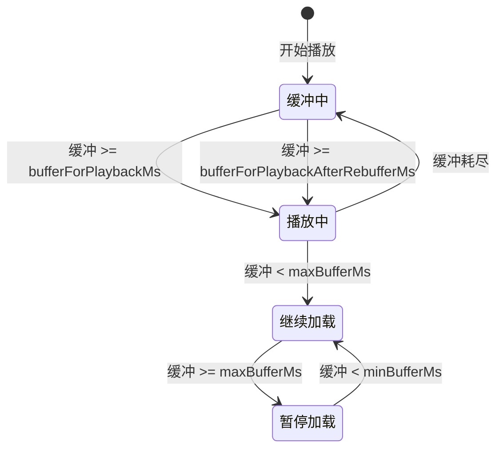
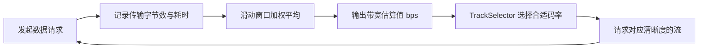
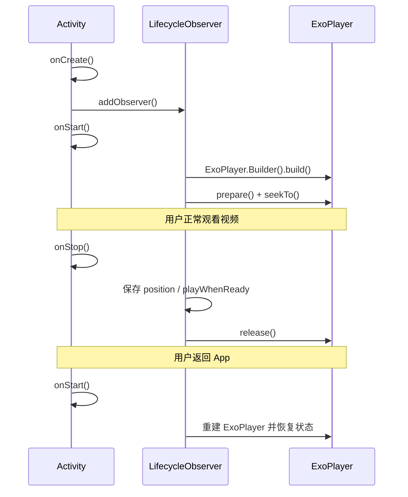

# Media3 实战

## 架构设计

### 分层模块化架构

Media3 采用高度模块化的分层架构，每一层各司其职、可独立替换。核心分层如下：



各层职责说明：

| 层级 | 核心组件 | 职责 |
|------|----------|------|
| **UI 层** | `PlayerView` | 提供视频渲染 Surface 和播控 UI |
| **会话层** | `MediaSession` | 对外暴露播放状态，接收外部控制指令 |
| **播放器层** | `ExoPlayer` | 协调解码、渲染、同步的核心引擎 |
| **渲染层** | `VideoRenderer` / `AudioRenderer` | 将解码后的数据送往 Surface 或 AudioTrack |
| **媒体源层** | `MediaSource` | 负责加载、解析特定协议的媒体流 |
| **数据源层** | `DataSource` | 负责从网络 / 本地 / 缓存读取原始字节 |
| **提取器层** | `Extractor` | 解封装容器格式，提取音视频轨道数据 |

### 从 ExoPlayer 到 Media3 的迁移

Media3 是 Google 将 ExoPlayer 纳入 AndroidX 后的产物。迁移的核心变化是**包名和 Maven 坐标**，API 设计保持了高度一致。



**迁移步骤概览：**

1. **使用官方迁移脚本**（推荐）：Google 提供了自动迁移脚本，可一键替换包名和依赖。
2. **手动迁移**：替换 Maven 坐标和 import 语句。
3. **验证编译**：确认所有 API 调用在新包名下正常工作。
4. **移除旧依赖**：清理 `com.google.android.exoplayer2` 相关依赖。

> **提示**：Media3 1.x 的 API 与 ExoPlayer 2.18+ 几乎完全对等，迁移成本很低。

### 包名与依赖对照

| 旧包名 (ExoPlayer) | 新包名 (Media3) | Maven 坐标 |
|---------------------|------------------|------------|
| `com.google.android.exoplayer2` | `androidx.media3.exoplayer` | `androidx.media3:media3-exoplayer` |
| `com.google.android.exoplayer2.ui` | `androidx.media3.ui` | `androidx.media3:media3-ui` |
| `com.google.android.exoplayer2.source.hls` | `androidx.media3.exoplayer.hls` | `androidx.media3:media3-exoplayer-hls` |
| `com.google.android.exoplayer2.source.dash` | `androidx.media3.exoplayer.dash` | `androidx.media3:media3-exoplayer-dash` |
| `com.google.android.exoplayer2.ext.okhttp` | `androidx.media3.datasource.okhttp` | `androidx.media3:media3-datasource-okhttp` |
| `com.google.android.exoplayer2.session` | `androidx.media3.session` | `androidx.media3:media3-session` |
| `com.google.android.exoplayer2.ext.mediasession` | `androidx.media3.session` | `androidx.media3:media3-session` |
| `com.google.android.exoplayer2.transformer` | `androidx.media3.transformer` | `androidx.media3:media3-transformer` |

---

## 基础使用

### 依赖配置

在模块级 `build.gradle.kts` 中添加依赖：

```kotlin
// build.gradle.kts (Module)
dependencies {
    // 核心播放器
    implementation("androidx.media3:media3-exoplayer:1.5.1")
    // 播放器 UI 组件
    implementation("androidx.media3:media3-ui:1.5.1")
    // HLS 协议支持（按需）
    implementation("androidx.media3:media3-exoplayer-hls:1.5.1")
    // DASH 协议支持（按需）
    implementation("androidx.media3:media3-exoplayer-dash:1.5.1")
    // MediaSession 支持（后台播放场景需要）
    implementation("androidx.media3:media3-session:1.5.1")
    // OkHttp 数据源（替代默认 HttpURLConnection）
    implementation("androidx.media3:media3-datasource-okhttp:1.5.1")
}
```

在项目级 `settings.gradle.kts` 中确保引入 Google Maven 仓库：

```kotlin
// settings.gradle.kts
dependencyResolutionManagement {
    repositories {
        google()
        mavenCentral()
    }
}
```

### Player 初始化

```kotlin
import androidx.media3.exoplayer.ExoPlayer
import androidx.media3.common.MediaItem
import androidx.media3.common.Player

class VideoPlayerActivity : AppCompatActivity() {

    private var player: ExoPlayer? = null

    private fun initializePlayer() {
        player = ExoPlayer.Builder(this)
            .build()
            .also { exoPlayer ->
                // 绑定到 PlayerView
                binding.playerView.player = exoPlayer

                // 构建媒体项
                val mediaItem = MediaItem.fromUri(
                    "https://example.com/sample.mp4"
                )
                exoPlayer.setMediaItem(mediaItem)

                // 准备并开始播放
                exoPlayer.prepare()
                exoPlayer.playWhenReady = true
            }
    }
}
```

### PlayerView 集成

在布局 XML 中添加 `PlayerView`：

```xml
<!-- res/layout/activity_video_player.xml -->
<androidx.media3.ui.PlayerView
    android:id="@+id/player_view"
    android:layout_width="match_parent"
    android:layout_height="wrap_content"
    app:show_buffering="when_playing"
    app:resize_mode="fit"
    app:use_controller="true"
    app:controller_layout_id="@layout/custom_player_controls" />
```

常用属性说明：

| 属性 | 说明 | 常用值 |
|------|------|--------|
| `show_buffering` | 缓冲 loading 显示时机 | `when_playing` / `always` / `never` |
| `resize_mode` | 视频缩放模式 | `fit` / `fill` / `zoom` / `fixed_width` / `fixed_height` |
| `use_controller` | 是否显示播控 UI | `true` / `false` |
| `surface_type` | 渲染 Surface 类型 | `surface_view` / `texture_view` / `none` |
| `keep_screen_on` | 播放时保持亮屏 | `true` / `false` |

> **`SurfaceView` vs `TextureView`**：`SurfaceView` 性能更好（独立窗口层），但不支持动画和变换；`TextureView` 支持动画但存在额外的 GPU 合成开销。**默认推荐 `SurfaceView`**。

### 播放本地视频

```kotlin
// 播放 assets 目录中的视频
val assetItem = MediaItem.fromUri("asset:///sample_video.mp4")

// 播放设备存储中的视频
val fileItem = MediaItem.fromUri(
    Uri.fromFile(File("/sdcard/Movies/demo.mp4"))
)

// 播放 raw 资源
val rawItem = MediaItem.fromUri(
    RawResourceDataSource.buildRawResourceUri(R.raw.intro_video)
)

player?.run {
    setMediaItem(assetItem)
    prepare()
    playWhenReady = true
}
```

### 播放网络视频

```kotlin
// 播放普通 MP4 网络视频
val mp4Item = MediaItem.fromUri(
    "https://cdn.example.com/video/sample.mp4"
)

// 播放 HLS 直播流（自动识别协议）
val hlsItem = MediaItem.fromUri(
    "https://live.example.com/stream/playlist.m3u8"
)

// 播放 DASH 流（自动识别协议）
val dashItem = MediaItem.fromUri(
    "https://vod.example.com/manifest.mpd"
)

// 显式指定 MIME 类型（当 URL 无法自动识别协议时）
val explicitHlsItem = MediaItem.Builder()
    .setUri("https://example.com/stream?token=abc")
    .setMimeType(MimeTypes.APPLICATION_M3U8)
    .build()

player?.run {
    setMediaItem(mp4Item)
    prepare()
    playWhenReady = true
}
```

---

## 播放列表管理

### MediaItem 构建

`MediaItem` 是 Media3 中描述媒体资源的核心数据类，支持多种构建方式：

```kotlin
// 方式 1：简单 URI
val simple = MediaItem.fromUri("https://example.com/video.mp4")

// 方式 2：Builder 模式（推荐，可设置更多元数据）
val rich = MediaItem.Builder()
    .setUri("https://example.com/video.mp4")
    .setMediaId("video_001")                        // 自定义 ID
    .setMediaMetadata(
        MediaMetadata.Builder()
            .setTitle("示例视频")
            .setArtist("演示团队")
            .setArtworkUri(Uri.parse("https://example.com/poster.jpg"))
            .build()
    )
    .setMimeType(MimeTypes.VIDEO_MP4)
    .build()

// 方式 3：带字幕
val withSubtitle = MediaItem.Builder()
    .setUri("https://example.com/video.mp4")
    .setSubtitleConfigurations(
        listOf(
            MediaItem.SubtitleConfiguration.Builder(
                Uri.parse("https://example.com/subs_cn.srt")
            )
                .setMimeType(MimeTypes.APPLICATION_SUBRIP)
                .setLanguage("zh")
                .setLabel("中文字幕")
                .build()
        )
    )
    .build()

// 方式 4：带 DRM 配置
val withDrm = MediaItem.Builder()
    .setUri("https://example.com/protected.mp4")
    .setDrmConfiguration(
        MediaItem.DrmConfiguration.Builder(C.WIDEVINE_UUID)
            .setLicenseUri("https://drm.example.com/license")
            .build()
    )
    .build()

// 方式 5：剪辑片段（ClippingConfiguration）
val clipped = MediaItem.Builder()
    .setUri("https://example.com/long_video.mp4")
    .setClippingConfiguration(
        MediaItem.ClippingConfiguration.Builder()
            .setStartPositionMs(10_000)   // 从第 10 秒开始
            .setEndPositionMs(60_000)     // 到第 60 秒结束
            .build()
    )
    .build()
```

### 列表操作（添加 / 移除 / 移动）

```kotlin
// 设置完整播放列表
val items = listOf(item1, item2, item3)
player.setMediaItems(items)

// 在列表末尾追加
player.addMediaItem(newItem)

// 在指定位置插入
player.addMediaItem(/* index = */ 1, insertedItem)

// 移除指定位置的项
player.removeMediaItem(/* index = */ 0)

// 移除一个范围
player.removeMediaItems(/* fromIndex = */ 1, /* toIndex = */ 3)

// 移动项的位置（从索引 2 移到索引 0）
player.moveMediaItem(/* currentIndex = */ 2, /* newIndex = */ 0)

// 清空列表
player.clearMediaItems()

// 跳转到列表中第 N 个视频
player.seekTo(/* mediaItemIndex = */ 2, /* positionMs = */ 0)

// 获取当前播放列表信息
val count = player.mediaItemCount
val currentIndex = player.currentMediaItemIndex
val currentItem = player.currentMediaItem
```

### 播放模式（顺序 / 循环 / 随机）

```kotlin
// 顺序播放（默认）：列表播完即停止
player.repeatMode = Player.REPEAT_MODE_OFF

// 单曲/单视频循环
player.repeatMode = Player.REPEAT_MODE_ONE

// 列表循环
player.repeatMode = Player.REPEAT_MODE_ALL

// 随机播放
player.shuffleModeEnabled = true

// 组合：随机 + 列表循环
player.shuffleModeEnabled = true
player.repeatMode = Player.REPEAT_MODE_ALL
```

播放模式对比：

| 模式 | `repeatMode` | `shuffleModeEnabled` | 行为 |
|------|-------------|---------------------|------|
| 顺序播放 | `REPEAT_MODE_OFF` | `false` | 按顺序播完停止 |
| 列表循环 | `REPEAT_MODE_ALL` | `false` | 按顺序循环播放 |
| 单曲循环 | `REPEAT_MODE_ONE` | `false` | 当前项反复播放 |
| 随机播放 | `REPEAT_MODE_ALL` | `true` | 随机顺序循环 |

---

## 缓冲与加载控制

### LoadControl 配置

`LoadControl` 控制播放器何时开始/停止缓冲，以及缓冲多少数据。Media3 提供了 `DefaultLoadControl` 作为默认实现：

```kotlin
import androidx.media3.exoplayer.DefaultLoadControl

val loadControl = DefaultLoadControl.Builder()
    // 缓冲区最小时长（低于此值时开始缓冲）
    .setBufferDurationsMs(
        /* minBufferMs = */ 15_000,          // 最小缓冲 15 秒
        /* maxBufferMs = */ 60_000,          // 最大缓冲 60 秒
        /* bufferForPlaybackMs = */ 2_500,   // 有 2.5 秒数据即可开始播放
        /* bufferForPlaybackAfterRebufferMs = */ 5_000  // 重新缓冲后需 5 秒数据才恢复
    )
    // 目标缓冲区大小（字节），0 表示不限制
    .setTargetBufferBytes(/* targetBufferBytes = */ DefaultLoadControl.DEFAULT_TARGET_BUFFER_BYTES)
    // 优先以时间维度还是大小维度控制缓冲
    .setPrioritizeTimeOverSizeThresholds(true)
    // 后退缓冲区（已播放数据保留时长）
    .setBackBuffer(
        /* backBufferDurationMs = */ 30_000, // 保留 30 秒已播放数据
        /* retainBackBufferFromKeyframe = */ true
    )
    .build()

val player = ExoPlayer.Builder(context)
    .setLoadControl(loadControl)
    .build()
```

### 缓冲策略调优

缓冲参数详解及推荐值：

| 参数 | 默认值 | 说明 | 调优建议 |
|------|--------|------|----------|
| `minBufferMs` | 50,000 ms | 缓冲区未满时持续加载的阈值 | 弱网环境可降至 15,000 |
| `maxBufferMs` | 50,000 ms | 缓冲区上限 | 长视频建议 60,000~120,000 |
| `bufferForPlaybackMs` | 2,500 ms | 首次播放所需最低缓冲 | 追求秒开可降至 1,000 |
| `bufferForPlaybackAfterRebufferMs` | 5,000 ms | 卡顿恢复所需最低缓冲 | 不宜低于 3,000 |
| `targetBufferBytes` | `C.LENGTH_UNSET` | 内存占用上限 | 低端设备建议设置为 20MB |
| `backBufferDurationMs` | 0 ms | 后退缓冲保留时长 | 需要回看的场景设为 30,000+ |



### 带宽预估机制

Media3 内置 `DefaultBandwidthMeter`，基于滑动窗口算法实时估算网络带宽，用于自适应码率选择（ABR）。

```kotlin
import androidx.media3.exoplayer.upstream.DefaultBandwidthMeter

val bandwidthMeter = DefaultBandwidthMeter.Builder(context)
    .setInitialBitrateEstimate(1_000_000L)  // 初始带宽估算 1Mbps
    .setResetOnNetworkTypeChange(true)       // 网络切换时重置估算
    .build()

val player = ExoPlayer.Builder(context)
    .setBandwidthMeter(bandwidthMeter)
    .build()

// 运行时查询当前带宽估算值
val estimatedBitrate = bandwidthMeter.bitrateEstimate  // 单位 bps
```

带宽预估工作原理：



> **自适应码率 (ABR) 联动**：`DefaultTrackSelector` 默认使用 `BandwidthMeter` 的估算值来决定播放 HLS/DASH 流时选择哪个码率档位。无需手动串联，开箱即用。

---

## 后台播放与 MediaSession

### 前台 Service 配置

后台播放需要一个前台 Service 来维持进程存活。Media3 提供了 `MediaSessionService` 简化实现。

首先在 `AndroidManifest.xml` 中声明：

```xml
<!-- AndroidManifest.xml -->
<uses-permission android:name="android.permission.FOREGROUND_SERVICE" />
<uses-permission android:name="android.permission.FOREGROUND_SERVICE_MEDIA_PLAYBACK" />
<!-- Android 13+ 通知权限 -->
<uses-permission android:name="android.permission.POST_NOTIFICATIONS" />

<application>
    <service
        android:name=".PlaybackService"
        android:foregroundServiceType="mediaPlayback"
        android:exported="true">
        <intent-filter>
            <action android:name="androidx.media3.session.MediaSessionService" />
        </intent-filter>
    </service>
</application>
```

### MediaSession 集成

```kotlin
import androidx.media3.common.MediaItem
import androidx.media3.exoplayer.ExoPlayer
import androidx.media3.session.MediaSession
import androidx.media3.session.MediaSessionService

class PlaybackService : MediaSessionService() {

    private var mediaSession: MediaSession? = null

    override fun onCreate() {
        super.onCreate()
        val player = ExoPlayer.Builder(this).build()

        mediaSession = MediaSession.Builder(this, player)
            .setCallback(MySessionCallback())
            .build()
    }

    override fun onGetSession(
        controllerInfo: MediaSession.ControllerInfo
    ): MediaSession? = mediaSession

    override fun onDestroy() {
        mediaSession?.run {
            player.release()
            release()
        }
        mediaSession = null
        super.onDestroy()
    }

    /**
     * 会话回调：控制外部 Controller 的访问权限和自定义命令
     */
    private inner class MySessionCallback : MediaSession.Callback {
        override fun onAddMediaItems(
            mediaSession: MediaSession,
            controller: MediaSession.ControllerInfo,
            mediaItems: List<MediaItem>
        ): ListenableFuture<List<MediaItem>> {
            // 将 Controller 传来的 MediaItem 转换为可播放的完整 MediaItem
            val resolvedItems = mediaItems.map { item ->
                item.buildUpon()
                    .setUri(item.requestMetadata.mediaUri ?: item.localConfiguration?.uri)
                    .build()
            }
            return Futures.immediateFuture(resolvedItems)
        }
    }
}
```

在 Activity 中连接 Service：

```kotlin
import androidx.media3.session.MediaController
import androidx.media3.session.SessionToken
import com.google.common.util.concurrent.MoreExecutors

class PlayerActivity : AppCompatActivity() {

    private var mediaController: MediaController? = null

    override fun onStart() {
        super.onStart()
        // 创建 SessionToken 指向 PlaybackService
        val sessionToken = SessionToken(
            this,
            ComponentName(this, PlaybackService::class.java)
        )
        // 异步获取 MediaController
        val controllerFuture = MediaController.Builder(this, sessionToken).buildAsync()
        controllerFuture.addListener(
            {
                mediaController = controllerFuture.get()
                // 将 Controller 绑定到 PlayerView
                binding.playerView.player = mediaController
            },
            MoreExecutors.directExecutor()
        )
    }

    override fun onStop() {
        mediaController?.release()
        mediaController = null
        super.onStop()
    }
}
```

### 通知栏控制

Media3 的 `MediaSessionService` 会**自动创建播放通知**，无需手动管理 `NotificationCompat`。默认行为包括：

- 显示媒体标题、艺术家、封面
- 提供播放/暂停、上一曲/下一曲按钮
- 与系统媒体控制中心联动（Android 11+）

如需自定义通知，可覆盖 `MediaNotification.Provider`：

```kotlin
import androidx.media3.session.MediaNotification
import androidx.media3.session.MediaStyleNotificationHelper

class PlaybackService : MediaSessionService() {

    override fun onCreate() {
        super.onCreate()
        // ... 初始化 player 和 mediaSession

        // 自定义通知（可选）
        setMediaNotificationProvider(
            DefaultMediaNotificationProvider.Builder(this)
                .setChannelName(R.string.notification_channel_name)
                .build()
        )
    }
}
```

### 音频焦点管理

Media3 的 `ExoPlayer` **默认自动处理音频焦点**，无需手动调用 `AudioManager`：

```kotlin
import androidx.media3.common.AudioAttributes
import androidx.media3.common.C

// 配置音频属性
val audioAttributes = AudioAttributes.Builder()
    .setUsage(C.USAGE_MEDIA)
    .setContentType(C.AUDIO_CONTENT_TYPE_MOVIE)
    .build()

val player = ExoPlayer.Builder(context)
    .setAudioAttributes(audioAttributes, /* handleAudioFocus = */ true)
    .build()
```

当 `handleAudioFocus = true` 时，ExoPlayer 会自动：

| 场景 | ExoPlayer 行为 |
|------|---------------|
| 来电 / 闹钟打断 | 自动暂停，结束后恢复播放 |
| 其他 App 播放音频 | 根据焦点类型暂停或降低音量（duck） |
| 蓝牙耳机断开 | 自动暂停（`BecomeNoisy` 事件） |
| 用户按下暂停 | 主动释放音频焦点 |
| 用户按下播放 | 自动请求音频焦点 |

---

## 生命周期管理

### Activity / Fragment 中的播放器管理

**推荐方案：使用 `DefaultLifecycleObserver` 自动管理播放器生命周期。**

```kotlin
import androidx.lifecycle.DefaultLifecycleObserver
import androidx.lifecycle.LifecycleOwner
import androidx.media3.exoplayer.ExoPlayer
import androidx.media3.common.Player

/**
 * 封装播放器的生命周期管理逻辑，
 * 作为 LifecycleObserver 自动响应 Activity/Fragment 生命周期。
 */
class PlayerLifecycleManager(
    private val context: Context,
    private val playerView: PlayerView
) : DefaultLifecycleObserver {

    private var player: ExoPlayer? = null
    private var playWhenReady = true
    private var currentItem = 0
    private var playbackPosition = 0L

    override fun onStart(owner: LifecycleOwner) {
        initializePlayer()
    }

    override fun onStop(owner: LifecycleOwner) {
        releasePlayer()
    }

    private fun initializePlayer() {
        player = ExoPlayer.Builder(context).build().also { exoPlayer ->
            playerView.player = exoPlayer
            // 恢复之前的播放状态
            exoPlayer.playWhenReady = playWhenReady
            exoPlayer.seekTo(currentItem, playbackPosition)
            exoPlayer.prepare()
        }
    }

    private fun releasePlayer() {
        player?.let { exoPlayer ->
            // 保存当前播放状态
            playbackPosition = exoPlayer.currentPosition
            currentItem = exoPlayer.currentMediaItemIndex
            playWhenReady = exoPlayer.playWhenReady
            exoPlayer.release()
        }
        player = null
    }
}

// 在 Activity 中使用
class VideoActivity : AppCompatActivity() {
    override fun onCreate(savedInstanceState: Bundle?) {
        super.onCreate(savedInstanceState)
        setContentView(R.layout.activity_video)

        val playerManager = PlayerLifecycleManager(
            context = this,
            playerView = findViewById(R.id.player_view)
        )
        // 注册后自动跟随 Activity 生命周期
        lifecycle.addObserver(playerManager)
    }
}
```

生命周期时序与播放器操作对应关系：



### 配置变更（旋转）处理

屏幕旋转时 Activity 默认会重建，导致播放器重新初始化。推荐的处理策略：

**策略一：在 Manifest 中声明 `configChanges`（推荐用于视频播放页）**

```xml
<activity
    android:name=".VideoActivity"
    android:configChanges="orientation|screenSize|keyboardHidden|screenLayout|smallestScreenSize" />
```

此方式下旋转不会重建 Activity，播放器无中断。

**策略二：使用 `ViewModel` 持有播放器（适合复杂场景）**

```kotlin
class PlayerViewModel(application: Application) : AndroidViewModel(application) {

    val player: ExoPlayer = ExoPlayer.Builder(application).build()

    override fun onCleared() {
        player.release()
        super.onCleared()
    }
}

class VideoActivity : AppCompatActivity() {
    private val viewModel: PlayerViewModel by viewModels()

    override fun onCreate(savedInstanceState: Bundle?) {
        super.onCreate(savedInstanceState)
        setContentView(R.layout.activity_video)
        // 旋转后 ViewModel 存活，播放器不中断
        findViewById<PlayerView>(R.id.player_view).player = viewModel.player
    }

    override fun onStop() {
        // 仅解绑 View，不释放播放器
        findViewById<PlayerView>(R.id.player_view).player = null
        super.onStop()
    }
}
```

> **注意**：策略二需小心 Context 泄漏——`ExoPlayer.Builder` 必须传入 `Application` Context 而非 Activity。

### 内存泄漏防范

**防范清单：**

| 序号 | 检查项 | 说明 |
|------|--------|------|
| 1 | `onStop` / `onDestroy` 中释放 Player | 未释放会导致解码器资源泄漏 |
| 2 | `PlayerView.player = null` | 及时解绑，避免 View 持有已释放的 Player |
| 3 | 使用 Application Context 创建 Player | 避免 Activity Context 被 Player 内部长期持有 |
| 4 | 移除 `Player.Listener` | 匿名 Listener 持有外部类引用，不移除会泄漏 |
| 5 | `MediaSession.release()` | 忘记释放会导致 Service 和 Player 泄漏 |
| 6 | `MediaController.release()` | 与 Service 的绑定连接也需及时释放 |
| 7 | 避免在 Listener 回调中直接引用 Activity | 使用 `WeakReference` 或确保在 `onStop` 时移除 |

```kotlin
// 常见泄漏示例 ❌
player.addListener(object : Player.Listener {
    override fun onPlaybackStateChanged(state: Int) {
        // 匿名内部类隐式持有 Activity 引用
        updateUi(state)
    }
})

// 正确做法 ✅：保存引用，在 onStop 中移除
private val playerListener = object : Player.Listener {
    override fun onPlaybackStateChanged(state: Int) {
        updateUi(state)
    }
}

override fun onStart(owner: LifecycleOwner) {
    player?.addListener(playerListener)
}

override fun onStop(owner: LifecycleOwner) {
    player?.removeListener(playerListener)
}
```

---

## 踩坑记录

> 此区域供团队成员补充项目中遇到的真实案例。

| 日期 | 记录人 | 问题描述 | 解决方案 |
|------|--------|----------|----------|
| | | | |

---

## 参考资料

- [Media3 官方文档](https://developer.android.com/media/media3)
- [Media3 GitHub 仓库](https://github.com/androidx/media)
- [ExoPlayer 到 Media3 迁移指南](https://developer.android.com/media/media3/exoplayer/migration-guide)
- [Media3 Session 指南](https://developer.android.com/media/media3/session)
- [Media3 Codelab](https://developer.android.com/codelabs/exoplayer-intro)
- [ExoPlayer 架构设计 Blog](https://medium.com/google-exoplayer)
