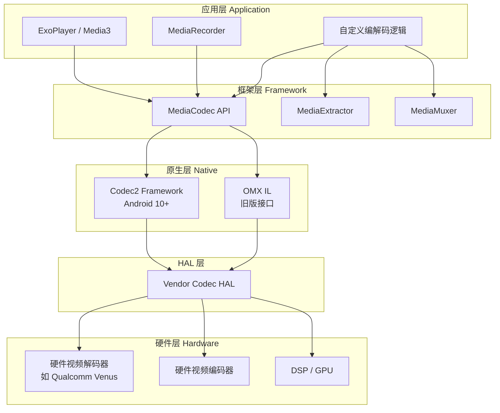
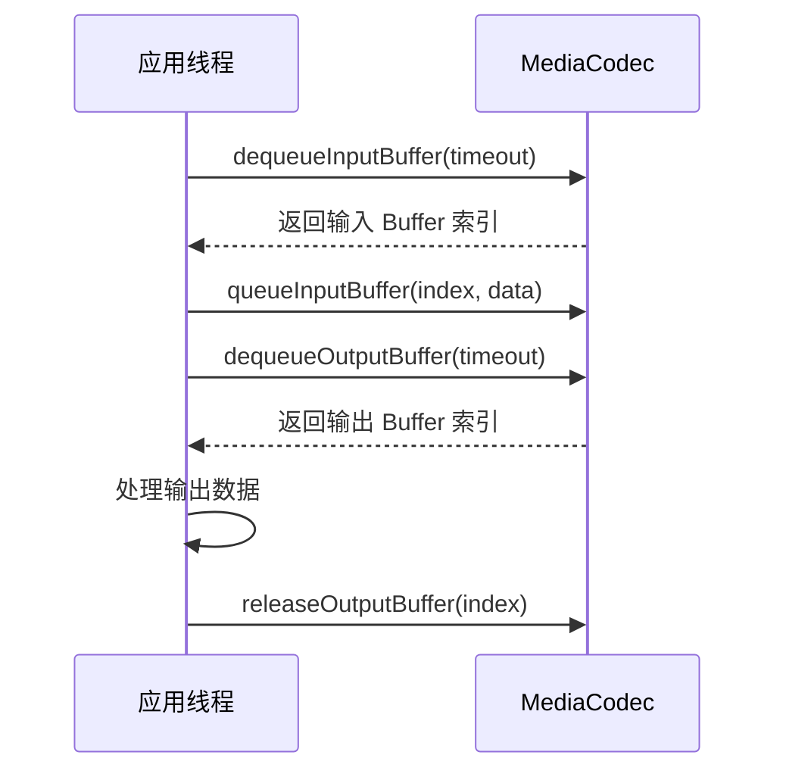
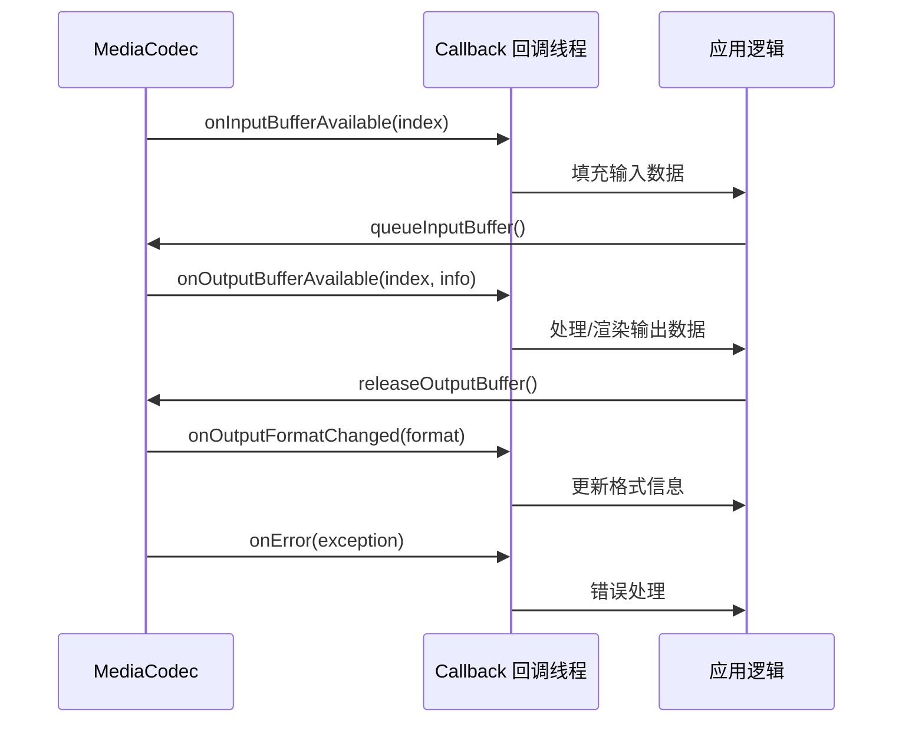
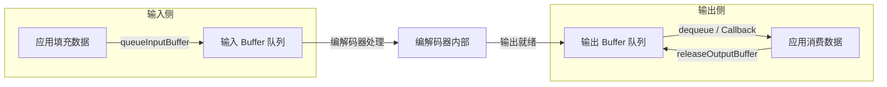
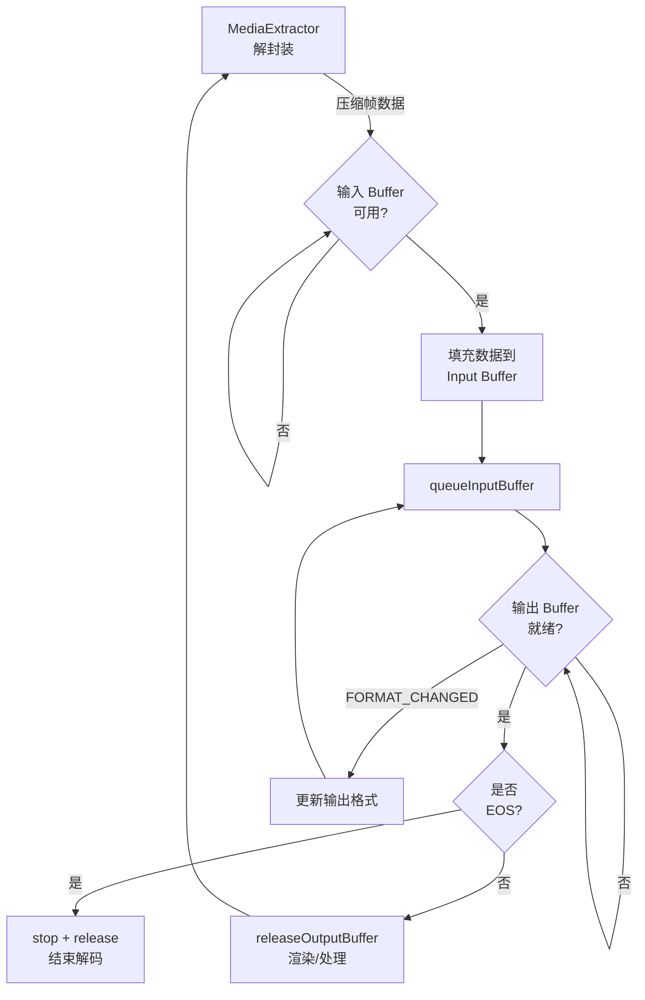
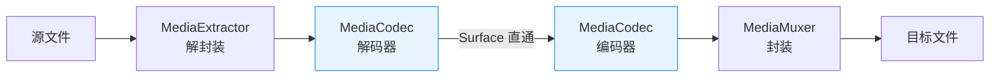
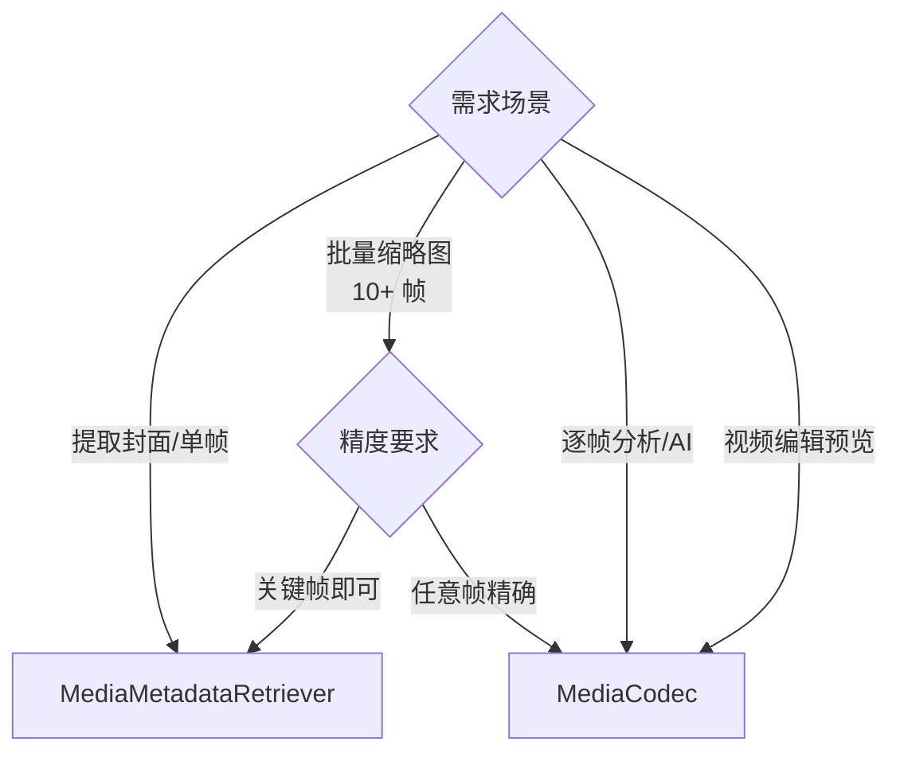

# MediaCodec 编解码

## MediaCodec 在 Android 媒体架构中的位置

MediaCodec 是 Android 提供的底层硬件加速编解码接口，位于应用层与硬件编解码器之间的关键桥梁位置：



各层说明：

| 层级 | 组件 | 作用 |
|------|------|------|
| **应用层** | ExoPlayer / MediaRecorder / 自定义代码 | 业务逻辑，调用 MediaCodec API |
| **框架层** | MediaCodec / MediaExtractor / MediaMuxer | Java/Kotlin API 层，管理编解码生命周期 |
| **原生层** | Codec2 / OMX IL | C++ 编解码框架，调度硬件 Codec 插件 |
| **HAL 层** | Vendor Codec HAL | 芯片厂商实现的硬件抽象接口 |
| **硬件层** | 专用编解码硬件 | 实际执行编解码运算的芯片模块 |

> **Codec2 vs OMX**：Android 10 起逐步用 Codec2 替代旧的 OMX IL 框架，Codec2 在 Buffer 管理和错误恢复方面有明显改进。应用层调用 MediaCodec API 无需关心底层使用的是 Codec2 还是 OMX。

---

## API 核心概念

MediaCodec 的核心工作模型是**输入/输出 Buffer 队列**。应用向输入队列送入原始数据（编码时为 raw YUV / Surface，解码时为压缩数据），编解码器处理后将结果放入输出队列。

### 同步模式

同步模式下，应用通过轮询方式查询可用 Buffer：



```kotlin
import android.media.MediaCodec
import android.media.MediaExtractor
import android.media.MediaFormat

/**
 * 同步模式解码示例（仅演示核心流程，生产环境推荐异步模式）
 */
fun decodeSynchronously(
    codec: MediaCodec,
    extractor: MediaExtractor,
    surface: Surface
) {
    val bufferInfo = MediaCodec.BufferInfo()
    var isEos = false

    while (true) {
        // 1. 获取可用的输入 Buffer
        if (!isEos) {
            val inputIndex = codec.dequeueInputBuffer(10_000L) // 超时 10ms
            if (inputIndex >= 0) {
                val inputBuffer = codec.getInputBuffer(inputIndex)!!
                val sampleSize = extractor.readSampleData(inputBuffer, 0)
                if (sampleSize < 0) {
                    // 发送 EOS 信号
                    codec.queueInputBuffer(
                        inputIndex, 0, 0, 0,
                        MediaCodec.BUFFER_FLAG_END_OF_STREAM
                    )
                    isEos = true
                } else {
                    codec.queueInputBuffer(
                        inputIndex, 0, sampleSize,
                        extractor.sampleTime, 0
                    )
                    extractor.advance()
                }
            }
        }

        // 2. 获取解码后的输出 Buffer
        val outputIndex = codec.dequeueOutputBuffer(bufferInfo, 10_000L)
        when {
            outputIndex >= 0 -> {
                // render = true 表示将帧渲染到 Surface
                codec.releaseOutputBuffer(outputIndex, /* render = */ true)
                if (bufferInfo.flags and MediaCodec.BUFFER_FLAG_END_OF_STREAM != 0) {
                    break // 解码完成
                }
            }
            outputIndex == MediaCodec.INFO_OUTPUT_FORMAT_CHANGED -> {
                val newFormat = codec.outputFormat
                // 处理格式变更（如分辨率改变）
            }
        }
    }
}
```

### 异步模式（推荐）

异步模式通过回调 (Callback) 接收 Buffer 就绪通知，避免轮询开销，是 **Android 5.0+ 的推荐方式**：



```kotlin
import android.media.MediaCodec
import android.media.MediaExtractor
import android.media.MediaFormat
import android.os.Handler
import android.os.HandlerThread

/**
 * 异步模式解码示例（推荐方式）
 */
fun decodeAsynchronously(
    extractor: MediaExtractor,
    format: MediaFormat,
    surface: Surface
) {
    val codec = MediaCodec.createDecoderByType(
        format.getString(MediaFormat.KEY_MIME)!!
    )

    // 在专用线程上处理回调
    val callbackThread = HandlerThread("CodecCallback").apply { start() }
    val handler = Handler(callbackThread.looper)

    codec.setCallback(object : MediaCodec.Callback() {

        override fun onInputBufferAvailable(codec: MediaCodec, index: Int) {
            val inputBuffer = codec.getInputBuffer(index) ?: return
            val sampleSize = extractor.readSampleData(inputBuffer, 0)
            if (sampleSize < 0) {
                codec.queueInputBuffer(
                    index, 0, 0, 0,
                    MediaCodec.BUFFER_FLAG_END_OF_STREAM
                )
            } else {
                codec.queueInputBuffer(
                    index, 0, sampleSize,
                    extractor.sampleTime, 0
                )
                extractor.advance()
            }
        }

        override fun onOutputBufferAvailable(
            codec: MediaCodec, index: Int, info: MediaCodec.BufferInfo
        ) {
            // 将解码帧渲染到 Surface
            codec.releaseOutputBuffer(index, /* render = */ true)
            if (info.flags and MediaCodec.BUFFER_FLAG_END_OF_STREAM != 0) {
                codec.stop()
                codec.release()
                callbackThread.quitSafely()
            }
        }

        override fun onOutputFormatChanged(
            codec: MediaCodec, format: MediaFormat
        ) {
            // 输出格式变化（如分辨率、色彩空间改变）
        }

        override fun onError(
            codec: MediaCodec, e: MediaCodec.CodecException
        ) {
            // 区分可恢复和不可恢复错误
            if (e.isRecoverable) {
                codec.stop()
                codec.configure(format, surface, null, 0)
                codec.start()
            } else if (e.isTransient) {
                // 瞬态错误，可重试
            } else {
                codec.release()
            }
        }
    }, handler)

    codec.configure(format, surface, null, 0)
    codec.start()
}
```

同步 vs 异步模式对比：

| 维度 | 同步模式 | 异步模式（推荐） |
|------|----------|-----------------|
| API 级别 | API 16+ | API 21+ |
| 编程模型 | 循环轮询 `dequeueBuffer` | 回调驱动 `Callback` |
| 线程模型 | 需自行管理循环线程 | 框架在回调线程通知 |
| 性能 | 存在轮询空转开销 | 事件驱动，CPU 利用率更高 |
| 代码复杂度 | 简单直观 | 稍复杂但更健壮 |
| 适用场景 | 简单工具/Demo | 生产环境 |

### Buffer 管理机制

MediaCodec 使用一组固定数量的输入和输出 Buffer，形成**生产者-消费者**模型：



关键 API 一览：

| API | 作用 | 注意事项 |
|-----|------|----------|
| `getInputBuffer(index)` | 获取输入 Buffer 引用 | 返回的 ByteBuffer 需在 `queueInputBuffer` 前填充 |
| `queueInputBuffer(...)` | 提交已填充的输入 Buffer | 提交后不可再访问该 Buffer |
| `getOutputBuffer(index)` | 获取输出 Buffer 引用 | 仅在非 Surface 输出时使用 |
| `releaseOutputBuffer(index, render)` | 释放输出 Buffer | `render=true` 将渲染到 Surface |
| `releaseOutputBuffer(index, timestamp)` | 带时间戳释放 | 用于精确控制渲染时机（API 21+） |

> **重要**：Buffer 的所有权在应用和 MediaCodec 之间严格交替。未及时释放输出 Buffer 会导致编解码器卡死。

### Surface 输入 / 输出模式

Surface 模式让编解码器直接在 GPU 内存中传递数据，避免 CPU 拷贝，是高性能场景的首选：

**Surface 输出（解码）**：将解码帧直接渲染到 `SurfaceView` 或 `TextureView` 关联的 Surface。

```kotlin
// Surface 输出：解码帧直接送到 Surface 渲染，零拷贝
val surface = surfaceView.holder.surface
codec.configure(format, surface, null, 0)
// releaseOutputBuffer(index, true) 即可渲染
```

**Surface 输入（编码）**：从 `Surface` 读取图像作为编码输入，适用于录屏和 Camera 录制。

```kotlin
// Surface 输入：从 InputSurface 直接读取帧数据
codec.configure(format, null, null, MediaCodec.CONFIGURE_FLAG_ENCODE)
val inputSurface: Surface = codec.createInputSurface()
codec.start()
// 将 inputSurface 交给 Camera / VirtualDisplay 等生产者
```

Surface 模式 vs ByteBuffer 模式：

| 维度 | Surface 模式 | ByteBuffer 模式 |
|------|-------------|-----------------|
| 数据传输 | GPU 内存直通，零拷贝 | CPU 内存拷贝 |
| 性能 | 高 | 低 |
| 数据可访问性 | 无法直接读取像素 | 可逐像素操作 |
| 适用场景 | 播放、录屏、Camera 录制 | 图像处理、水印叠加、帧分析 |

---

## 视频解码

### 配置与启动解码器

```kotlin
import android.media.MediaCodec
import android.media.MediaExtractor
import android.media.MediaFormat

/**
 * 配置并启动视频解码器的完整流程
 */
fun setupDecoder(videoPath: String, surface: Surface): Pair<MediaCodec, MediaExtractor> {
    // 1. 使用 MediaExtractor 解封装
    val extractor = MediaExtractor().apply {
        setDataSource(videoPath)
    }

    // 2. 查找视频轨道
    var videoTrackIndex = -1
    var videoFormat: MediaFormat? = null
    for (i in 0 until extractor.trackCount) {
        val format = extractor.getTrackFormat(i)
        val mime = format.getString(MediaFormat.KEY_MIME) ?: continue
        if (mime.startsWith("video/")) {
            videoTrackIndex = i
            videoFormat = format
            break
        }
    }
    requireNotNull(videoFormat) { "未找到视频轨道" }
    extractor.selectTrack(videoTrackIndex)

    // 3. 创建并配置解码器
    val mime = videoFormat.getString(MediaFormat.KEY_MIME)!!
    val codec = MediaCodec.createDecoderByType(mime)
    codec.configure(
        videoFormat,
        surface,     // 输出 Surface（null 则输出到 ByteBuffer）
        null,        // MediaCrypto（DRM 场景使用）
        0            // flags（解码为 0）
    )

    // 4. 启动解码器
    codec.start()

    return Pair(codec, extractor)
}
```

### 逐帧解码流程



### Surface 输出 vs ByteBuffer 输出

| 维度 | Surface 输出 | ByteBuffer 输出 |
|------|-------------|-----------------|
| **配置方式** | `configure(format, surface, null, 0)` | `configure(format, null, null, 0)` |
| **获取数据** | `releaseOutputBuffer(index, true)` 直接渲染 | `getOutputBuffer(index)` 读取 YUV 数据 |
| **性能** | 零拷贝，硬件直通 | 需 CPU 拷贝，较慢 |
| **数据格式** | 不可见（直接到 Surface） | YUV 420（具体取决于 `COLOR_FORMAT`） |
| **典型场景** | 视频播放、预览 | 帧分析、AI 推理、水印处理 |
| **是否支持 Shader** | 可配合 `SurfaceTexture` + OpenGL | 需手动上传到 GPU |

```kotlin
// ByteBuffer 输出模式：读取解码后的 YUV 数据
val outputIndex = codec.dequeueOutputBuffer(bufferInfo, 10_000)
if (outputIndex >= 0) {
    val outputBuffer = codec.getOutputBuffer(outputIndex)!!
    // 读取 YUV 数据用于自定义处理（如 AI 推理）
    val yuvData = ByteArray(bufferInfo.size)
    outputBuffer.get(yuvData)
    processYuvFrame(yuvData, width, height)
    codec.releaseOutputBuffer(outputIndex, /* render = */ false)
}
```

### 解码器实例数量限制与复用

Android 设备的硬件解码器资源有限，不同设备支持的并发实例数不同：

```kotlin
import android.media.MediaCodecList
import android.media.MediaCodecInfo

/**
 * 查询设备支持的解码器能力
 */
fun queryCodecCapabilities(mimeType: String) {
    val codecList = MediaCodecList(MediaCodecList.ALL_CODECS)
    codecList.codecInfos
        .filter { !it.isEncoder }
        .filter { mimeType in it.supportedTypes }
        .forEach { codecInfo ->
            val caps = codecInfo.getCapabilitiesForType(mimeType)
            val videoCapabilities = caps.videoCapabilities
            println(
                """
                解码器: ${codecInfo.name}
                是否硬解: ${!codecInfo.isSoftwareOnly}
                支持的最大分辨率: ${videoCapabilities.supportedWidths}x${videoCapabilities.supportedHeights}
                支持的最大实例数: ${caps.maxSupportedInstances}
                """.trimIndent()
            )
        }
}
```

实例管理最佳实践：

| 建议 | 说明 |
|------|------|
| 及时释放不用的实例 | `stop()` + `release()` 释放硬件资源 |
| 复用实例而非重建 | `stop()` → 重新 `configure()` → `start()` 比销毁重建更快 |
| 查询 `maxSupportedInstances` | 在多路解码（如画中画、多宫格）前先查询设备上限 |
| 做好降级策略 | 硬解实例不足时回退到软解（`c2.android.avc.decoder`） |
| 避免泄漏 | 异常路径也要确保 `release()` 被调用 |

> **常见限制**：大多数中端设备同时支持 2~4 个硬解码器实例。尝试超过上限时，`configure()` 或 `start()` 会抛出 `CodecException`。

---

## 视频编码

### 录屏场景（MediaProjection + MediaCodec）

```kotlin
import android.hardware.display.DisplayManager
import android.hardware.display.VirtualDisplay
import android.media.MediaCodec
import android.media.MediaCodecInfo
import android.media.MediaFormat
import android.media.MediaMuxer
import android.media.projection.MediaProjection

/**
 * 录屏编码核心实现
 */
class ScreenRecorder(
    private val projection: MediaProjection,
    private val width: Int,
    private val height: Int,
    private val dpi: Int,
    private val outputPath: String
) {
    private lateinit var codec: MediaCodec
    private lateinit var muxer: MediaMuxer
    private lateinit var virtualDisplay: VirtualDisplay
    private var trackIndex = -1
    private var isMuxerStarted = false

    fun start() {
        // 1. 配置编码器
        val format = MediaFormat.createVideoFormat(
            MediaFormat.MIMETYPE_VIDEO_AVC, width, height
        ).apply {
            setInteger(
                MediaFormat.KEY_COLOR_FORMAT,
                MediaCodecInfo.CodecCapabilities.COLOR_FormatSurface
            )
            setInteger(MediaFormat.KEY_BIT_RATE, 6_000_000)    // 6Mbps
            setInteger(MediaFormat.KEY_FRAME_RATE, 30)
            setInteger(MediaFormat.KEY_I_FRAME_INTERVAL, 2)     // 每 2 秒一个 I 帧
        }

        codec = MediaCodec.createEncoderByType(MediaFormat.MIMETYPE_VIDEO_AVC)
        codec.configure(format, null, null, MediaCodec.CONFIGURE_FLAG_ENCODE)

        // 2. 获取 Surface 输入并创建 VirtualDisplay
        val inputSurface = codec.createInputSurface()
        codec.start()

        muxer = MediaMuxer(outputPath, MediaMuxer.OutputFormat.MUXER_OUTPUT_MPEG_4)

        virtualDisplay = projection.createVirtualDisplay(
            "ScreenRecorder",
            width, height, dpi,
            DisplayManager.VIRTUAL_DISPLAY_FLAG_AUTO_MIRROR,
            inputSurface, null, null
        )

        // 3. 在后台线程轮询编码输出
        Thread { drainEncoder() }.start()
    }

    private fun drainEncoder() {
        val bufferInfo = MediaCodec.BufferInfo()
        while (true) {
            val outputIndex = codec.dequeueOutputBuffer(bufferInfo, 10_000)
            when {
                outputIndex >= 0 -> {
                    val encodedData = codec.getOutputBuffer(outputIndex) ?: continue
                    if (bufferInfo.flags and MediaCodec.BUFFER_FLAG_CODEC_CONFIG != 0) {
                        // 忽略 codec config 数据（SPS/PPS），Muxer 从 format 中获取
                        codec.releaseOutputBuffer(outputIndex, false)
                        continue
                    }
                    if (bufferInfo.size > 0 && isMuxerStarted) {
                        encodedData.position(bufferInfo.offset)
                        encodedData.limit(bufferInfo.offset + bufferInfo.size)
                        muxer.writeSampleData(trackIndex, encodedData, bufferInfo)
                    }
                    codec.releaseOutputBuffer(outputIndex, false)
                    if (bufferInfo.flags and MediaCodec.BUFFER_FLAG_END_OF_STREAM != 0) {
                        break
                    }
                }
                outputIndex == MediaCodec.INFO_OUTPUT_FORMAT_CHANGED -> {
                    trackIndex = muxer.addTrack(codec.outputFormat)
                    muxer.start()
                    isMuxerStarted = true
                }
            }
        }
    }

    fun stop() {
        virtualDisplay.release()
        codec.signalEndOfInputStream()
        // drainEncoder 检测到 EOS 后会退出循环
        codec.stop()
        codec.release()
        muxer.stop()
        muxer.release()
        projection.stop()
    }
}
```

### Camera 录制场景（CameraX / Camera2 + MediaCodec）

使用 CameraX 的 `VideoCapture` API 可以简化录制流程，但如果需要更精细控制（如自定义编码参数），可将 Camera2 与 MediaCodec 结合：

```kotlin
import android.hardware.camera2.CameraCaptureSession
import android.hardware.camera2.CameraDevice
import android.hardware.camera2.CaptureRequest
import android.media.MediaCodec
import android.media.MediaCodecInfo
import android.media.MediaFormat

/**
 * Camera2 + MediaCodec 录制核心逻辑（简化版）
 */
class CameraRecorder(
    private val cameraDevice: CameraDevice,
    private val width: Int,
    private val height: Int
) {
    private lateinit var encoder: MediaCodec
    private lateinit var muxer: MediaMuxer

    fun startRecording(outputPath: String) {
        // 1. 配置编码器
        val format = MediaFormat.createVideoFormat(
            MediaFormat.MIMETYPE_VIDEO_AVC, width, height
        ).apply {
            setInteger(
                MediaFormat.KEY_COLOR_FORMAT,
                MediaCodecInfo.CodecCapabilities.COLOR_FormatSurface
            )
            setInteger(MediaFormat.KEY_BIT_RATE, 8_000_000)
            setInteger(MediaFormat.KEY_FRAME_RATE, 30)
            setInteger(MediaFormat.KEY_I_FRAME_INTERVAL, 1)
            // 设置 High Profile 以获取更好的压缩效率
            setInteger(
                MediaFormat.KEY_PROFILE,
                MediaCodecInfo.CodecProfileLevel.AVCProfileHigh
            )
            setInteger(
                MediaFormat.KEY_LEVEL,
                MediaCodecInfo.CodecProfileLevel.AVCLevel41
            )
        }

        encoder = MediaCodec.createEncoderByType(MediaFormat.MIMETYPE_VIDEO_AVC)
        encoder.configure(format, null, null, MediaCodec.CONFIGURE_FLAG_ENCODE)
        val encoderSurface = encoder.createInputSurface()
        encoder.start()

        muxer = MediaMuxer(outputPath, MediaMuxer.OutputFormat.MUXER_OUTPUT_MPEG_4)

        // 2. 将编码器的 InputSurface 作为 Camera 输出目标
        val previewSurface = /* SurfaceView / TextureView 的 Surface */ encoderSurface
        val captureRequest = cameraDevice.createCaptureRequest(
            CameraDevice.TEMPLATE_RECORD
        ).apply {
            addTarget(encoderSurface)
            // addTarget(previewSurface)  // 同时预览
        }

        cameraDevice.createCaptureSession(
            listOf(encoderSurface),
            object : CameraCaptureSession.StateCallback() {
                override fun onConfigured(session: CameraCaptureSession) {
                    session.setRepeatingRequest(
                        captureRequest.build(), null, null
                    )
                }
                override fun onConfigureFailed(session: CameraCaptureSession) {
                    // 处理失败
                }
            },
            null
        )

        // 3. 在后台线程处理编码输出（同录屏示例的 drainEncoder）
    }
}
```

### 编码参数调优（码率 / 帧率 / I 帧间隔 / Profile / Level）

| 参数 | MediaFormat Key | 推荐值 | 说明 |
|------|----------------|--------|------|
| **码率 (Bitrate)** | `KEY_BIT_RATE` | 720p: 4~6 Mbps, 1080p: 8~12 Mbps | 越高画质越好，文件越大 |
| **码率控制模式** | `KEY_BITRATE_MODE` | `BITRATE_MODE_VBR` | VBR 压缩效率高，CBR 码率稳定 |
| **帧率 (FPS)** | `KEY_FRAME_RATE` | 30 fps | 录屏可用 24，高流畅场景用 60 |
| **I 帧间隔** | `KEY_I_FRAME_INTERVAL` | 1~2 秒 | 间隔越小，seek 越快，文件越大 |
| **Profile** | `KEY_PROFILE` | `AVCProfileHigh` | High Profile 压缩效率最佳 |
| **Level** | `KEY_LEVEL` | `AVCLevel41` | 决定最大分辨率和码率的组合上限 |
| **B 帧** | `KEY_MAX_B_FRAMES` | 0~2 | 设备支持有限，慎用 |
| **色彩格式** | `KEY_COLOR_FORMAT` | `COLOR_FormatSurface` | Surface 输入必须用此值 |

码率控制模式对比：

| 模式 | 常量 | 特点 | 适用场景 |
|------|------|------|----------|
| **CQ** | `BITRATE_MODE_CQ` | 恒定质量，码率波动大 | 离线转码 |
| **VBR** | `BITRATE_MODE_VBR` | 可变码率，复杂场景分配更多码率 | 通用录制 |
| **CBR** | `BITRATE_MODE_CBR` | 恒定码率，画质波动 | 直播推流 |

### MediaMuxer 封装输出文件

`MediaMuxer` 将编码后的数据封装为标准容器格式（MP4 / WebM）：

```kotlin
import android.media.MediaMuxer
import android.media.MediaFormat
import android.media.MediaCodec

/**
 * MediaMuxer 使用完整示例
 */
class MuxerHelper(outputPath: String) {

    private val muxer = MediaMuxer(
        outputPath,
        MediaMuxer.OutputFormat.MUXER_OUTPUT_MPEG_4
    )
    private var videoTrackIndex = -1
    private var audioTrackIndex = -1
    private var isStarted = false

    /** 添加视频轨道，返回轨道索引 */
    fun addVideoTrack(format: MediaFormat): Int {
        videoTrackIndex = muxer.addTrack(format)
        return videoTrackIndex
    }

    /** 添加音频轨道，返回轨道索引 */
    fun addAudioTrack(format: MediaFormat): Int {
        audioTrackIndex = muxer.addTrack(format)
        return audioTrackIndex
    }

    /** 所有轨道添加完毕后调用 */
    fun start() {
        muxer.start()
        isStarted = true
    }

    /** 写入编码数据 */
    fun writeSampleData(
        trackIndex: Int,
        buffer: java.nio.ByteBuffer,
        bufferInfo: MediaCodec.BufferInfo
    ) {
        if (!isStarted) return
        muxer.writeSampleData(trackIndex, buffer, bufferInfo)
    }

    /** 设置视频旋转角度（0 / 90 / 180 / 270） */
    fun setOrientationHint(degrees: Int) {
        muxer.setOrientationHint(degrees)
    }

    fun stop() {
        if (isStarted) {
            muxer.stop()
            muxer.release()
            isStarted = false
        }
    }
}
```

> **注意事项**：
> - `addTrack()` 必须在 `start()` 之前调用。
> - `writeSampleData()` 必须在 `start()` 之后、`stop()` 之前调用。
> - 音视频轨道的时间戳必须单调递增。
> - MediaMuxer 不支持 FLV / TS 格式输出，仅支持 MP4 和 WebM。

---

## 视频转码

### Media3 Transformer API

Media3 提供了高层级的 `Transformer` API，封装了 MediaCodec 的编解码和 MediaMuxer 的封装逻辑，极大简化转码实现：

```kotlin
import androidx.media3.transformer.Transformer
import androidx.media3.transformer.TransformationRequest
import androidx.media3.common.MediaItem
import androidx.media3.effect.ScaleAndRotateTransformation

/**
 * 使用 Transformer 进行视频转码
 */
fun transcodeVideo(
    context: Context,
    inputUri: Uri,
    outputPath: String
) {
    val transformer = Transformer.Builder(context)
        .setTransformationRequest(
            TransformationRequest.Builder()
                .setVideoMimeType(MimeTypes.VIDEO_H265)   // 转码为 H.265
                .setAudioMimeType(MimeTypes.AUDIO_AAC)
                .build()
        )
        .addListener(object : Transformer.Listener {
            override fun onCompleted(
                composition: Composition,
                exportResult: ExportResult
            ) {
                // 转码成功
                val durationMs = exportResult.durationMs
                val fileSizeBytes = exportResult.fileSizeBytes
            }

            override fun onError(
                composition: Composition,
                exportResult: ExportResult,
                exportException: ExportException
            ) {
                // 转码失败
                exportException.printStackTrace()
            }
        })
        .build()

    // 构建输入 MediaItem
    val mediaItem = MediaItem.fromUri(inputUri)

    // 开始转码
    transformer.start(mediaItem, outputPath)

    // 可通过 transformer.cancel() 取消
}
```

使用 `EditedMediaItem` 可以在转码时施加视频特效：

```kotlin
import androidx.media3.transformer.EditedMediaItem
import androidx.media3.transformer.Effects
import androidx.media3.effect.Presentation
import androidx.media3.effect.ScaleAndRotateTransformation

// 转码同时缩放到 720p 并旋转 90 度
val editedMediaItem = EditedMediaItem.Builder(MediaItem.fromUri(inputUri))
    .setEffects(
        Effects(
            /* audioProcessors = */ listOf(),
            /* videoEffects = */ listOf(
                Presentation.createForHeight(720),
                ScaleAndRotateTransformation.Builder()
                    .setRotationDegrees(90f)
                    .build()
            )
        )
    )
    .build()

transformer.start(editedMediaItem, outputPath)
```

### FFmpeg Android 方案

对于 Transformer 不支持的场景（如特殊编解码格式、复杂滤镜链），可引入 FFmpeg：

| 集成方式 | 说明 | 优缺点 |
|----------|------|--------|
| **FFmpegKit** | 封装好的 Android 库，支持完整 FFmpeg 命令行 | 易用，包体大（20~80MB） |
| **Mobile FFmpeg**（已归档） | 早期流行方案 | 已停止维护，不推荐新项目使用 |
| **自行编译 FFmpeg .so** | 使用 NDK 交叉编译 | 灵活可裁剪，但编译配置复杂 |

FFmpegKit 简单使用示例：

```kotlin
// build.gradle.kts
// implementation("com.arthenica:ffmpeg-kit-full:6.0-2")

import com.arthenica.ffmpegkit.FFmpegKit
import com.arthenica.ffmpegkit.ReturnCode

fun transcodeWithFFmpeg(inputPath: String, outputPath: String) {
    val command = "-i $inputPath -c:v libx264 -preset fast -crf 23 " +
        "-c:a aac -b:a 128k $outputPath"

    FFmpegKit.executeAsync(command) { session ->
        when {
            ReturnCode.isSuccess(session.returnCode) -> {
                // 转码成功
            }
            ReturnCode.isCancel(session.returnCode) -> {
                // 用户取消
            }
            else -> {
                // 转码失败
                val logs = session.allLogsAsString
            }
        }
    }
}
```

### 转码性能优化

| 优化手段 | 说明 | 效果 |
|----------|------|------|
| 优先使用硬件编解码 | MediaCodec 硬件编解码远快于软解 | 速度提升 3~10 倍 |
| Surface 模式传递帧 | 解码器输出直通编码器输入，避免 CPU 拷贝 | 降低 CPU 占用和延迟 |
| 合理选择目标码率 | 避免不必要的高码率 | 减少编码耗时和文件体积 |
| 使用 `Transformer` API | 内部已优化 Surface 直通管线 | 开发效率和运行性能兼顾 |
| 分段转码 + 合并 | 长视频拆分为多段并行处理 | 提升总体吞吐 |
| 避免不必要的重编码 | 仅修改容器或裁剪时，用 `mp4parser` 做无损操作 | 速度提升数十倍 |

转码管线数据流：



---

## 帧提取与缩略图生成

### MediaMetadataRetriever 方案

`MediaMetadataRetriever` 是 Android 提供的高层级 API，适合简单的帧提取和缩略图生成：

```kotlin
import android.media.MediaMetadataRetriever

/**
 * 使用 MediaMetadataRetriever 提取视频帧
 */
fun extractFrameWithRetriever(
    videoPath: String,
    timeUs: Long  // 目标时间点，微秒
): Bitmap? {
    val retriever = MediaMetadataRetriever()
    return try {
        retriever.setDataSource(videoPath)

        // 方式 1：提取指定时间点最近的关键帧
        val keyFrame = retriever.getFrameAtTime(
            timeUs,
            MediaMetadataRetriever.OPTION_CLOSEST_SYNC
        )

        // 方式 2：提取指定时间点最接近的帧（更精确，但更慢）
        val closestFrame = retriever.getFrameAtTime(
            timeUs,
            MediaMetadataRetriever.OPTION_CLOSEST
        )

        // 方式 3：提取指定尺寸的缩略图（API 27+）
        val scaledFrame = retriever.getScaledFrameAtTime(
            timeUs,
            MediaMetadataRetriever.OPTION_CLOSEST_SYNC,
            /* dstWidth = */ 320,
            /* dstHeight = */ 180
        )

        scaledFrame ?: closestFrame ?: keyFrame
    } finally {
        retriever.release()
    }
}

/**
 * 批量生成视频缩略图（如时间线预览图）
 */
fun generateThumbnails(
    videoPath: String,
    count: Int,
    thumbnailWidth: Int = 160,
    thumbnailHeight: Int = 90
): List<Bitmap> {
    val retriever = MediaMetadataRetriever()
    return try {
        retriever.setDataSource(videoPath)
        val durationUs = retriever
            .extractMetadata(MediaMetadataRetriever.METADATA_KEY_DURATION)!!
            .toLong() * 1000  // 转为微秒

        val interval = durationUs / count
        (0 until count).mapNotNull { i ->
            retriever.getScaledFrameAtTime(
                i * interval,
                MediaMetadataRetriever.OPTION_CLOSEST_SYNC,
                thumbnailWidth, thumbnailHeight
            )
        }
    } finally {
        retriever.release()
    }
}
```

### MediaCodec 逐帧解码方案

当需要高精度逐帧提取或大批量处理时，使用 MediaCodec 手动解码性能更优：

```kotlin
import android.graphics.Bitmap
import android.graphics.ImageFormat
import android.media.Image
import android.media.ImageReader
import android.media.MediaCodec
import android.media.MediaExtractor
import android.media.MediaFormat

/**
 * 使用 MediaCodec + ImageReader 实现高性能帧提取
 */
class FrameExtractor(private val videoPath: String) {

    fun extractFrames(
        targetTimesUs: List<Long>,
        outputWidth: Int,
        outputHeight: Int
    ): List<Bitmap> {
        val extractor = MediaExtractor()
        extractor.setDataSource(videoPath)

        // 查找视频轨道
        var trackIndex = -1
        var format: MediaFormat? = null
        for (i in 0 until extractor.trackCount) {
            val trackFormat = extractor.getTrackFormat(i)
            if (trackFormat.getString(MediaFormat.KEY_MIME)?.startsWith("video/") == true) {
                trackIndex = i
                format = trackFormat
                break
            }
        }
        requireNotNull(format)
        extractor.selectTrack(trackIndex)

        // 使用 ImageReader 作为输出 Surface
        val imageReader = ImageReader.newInstance(
            outputWidth, outputHeight, ImageFormat.YUV_420_888, 2
        )

        val codec = MediaCodec.createDecoderByType(
            format.getString(MediaFormat.KEY_MIME)!!
        )
        codec.configure(format, imageReader.surface, null, 0)
        codec.start()

        val results = mutableListOf<Bitmap>()
        val sortedTargets = targetTimesUs.sorted().toMutableList()
        val bufferInfo = MediaCodec.BufferInfo()
        var isEos = false

        while (sortedTargets.isNotEmpty()) {
            // 送入压缩数据
            if (!isEos) {
                val inputIndex = codec.dequeueInputBuffer(10_000)
                if (inputIndex >= 0) {
                    val inputBuffer = codec.getInputBuffer(inputIndex)!!
                    val sampleSize = extractor.readSampleData(inputBuffer, 0)
                    if (sampleSize < 0) {
                        codec.queueInputBuffer(
                            inputIndex, 0, 0, 0,
                            MediaCodec.BUFFER_FLAG_END_OF_STREAM
                        )
                        isEos = true
                    } else {
                        codec.queueInputBuffer(
                            inputIndex, 0, sampleSize,
                            extractor.sampleTime, 0
                        )
                        extractor.advance()
                    }
                }
            }

            // 读取解码帧
            val outputIndex = codec.dequeueOutputBuffer(bufferInfo, 10_000)
            if (outputIndex >= 0) {
                val presentationTimeUs = bufferInfo.presentationTimeUs
                // 检查是否为目标帧
                if (sortedTargets.isNotEmpty() &&
                    presentationTimeUs >= sortedTargets.first()
                ) {
                    codec.releaseOutputBuffer(outputIndex, true)
                    // 从 ImageReader 获取图像
                    val image: Image? = imageReader.acquireLatestImage()
                    image?.let {
                        results.add(imageToBitmap(it))
                        it.close()
                    }
                    sortedTargets.removeFirst()
                } else {
                    codec.releaseOutputBuffer(outputIndex, false)
                }

                if (bufferInfo.flags and MediaCodec.BUFFER_FLAG_END_OF_STREAM != 0) {
                    break
                }
            }
        }

        codec.stop()
        codec.release()
        imageReader.close()
        extractor.release()
        return results
    }

    private fun imageToBitmap(image: Image): Bitmap {
        // 将 YUV Image 转换为 Bitmap（简化实现）
        val width = image.width
        val height = image.height
        val bitmap = Bitmap.createBitmap(width, height, Bitmap.Config.ARGB_8888)
        // 实际项目中使用 RenderScript 或 libyuv 做 YUV->RGB 转换
        return bitmap
    }
}
```

### 性能与精度对比

| 维度 | MediaMetadataRetriever | MediaCodec 逐帧解码 |
|------|----------------------|---------------------|
| **API 复杂度** | 低（3~5 行代码） | 高（需管理 Buffer 和生命周期） |
| **帧精度** | 关键帧精确，非关键帧有偏差 | 可精确到任意帧 |
| **性能（单帧）** | 较慢（每次内部重新 seek + 解码） | 首帧慢，后续帧快 |
| **性能（批量）** | 差（每帧独立 seek） | 优（顺序解码可复用上下文） |
| **内存占用** | 低 | 中（需维护 Buffer 池和 ImageReader） |
| **线程安全** | 单线程使用 | 需自行管理线程同步 |
| **输出格式** | Bitmap（RGB） | YUV 原始数据 或 Surface |
| **适用场景** | 视频封面、单帧预览 | 时间线缩略图、视频编辑、AI 分析 |

选型建议：



---

## 踩坑记录

> 此区域供团队成员补充项目中遇到的真实案例。

| 日期 | 记录人 | 问题描述 | 解决方案 |
|------|--------|----------|----------|
| | | | |

---

## 参考资料

- [MediaCodec 官方文档](https://developer.android.com/reference/android/media/MediaCodec)
- [Media3 Transformer 文档](https://developer.android.com/media/media3/transformer)
- [MediaCodec 架构 - Codec2](https://source.android.com/docs/core/media/codec2)
- [Grafika - Google MediaCodec 示例项目](https://github.com/google/grafika)
- [BigFlake - MediaCodec 编码示例](http://bigflake.com/mediacodec/)
- [Android 视频编码最佳实践](https://developer.android.com/media/platform/supported-formats)
- [FFmpegKit 文档](https://github.com/arthenica/ffmpeg-kit)
