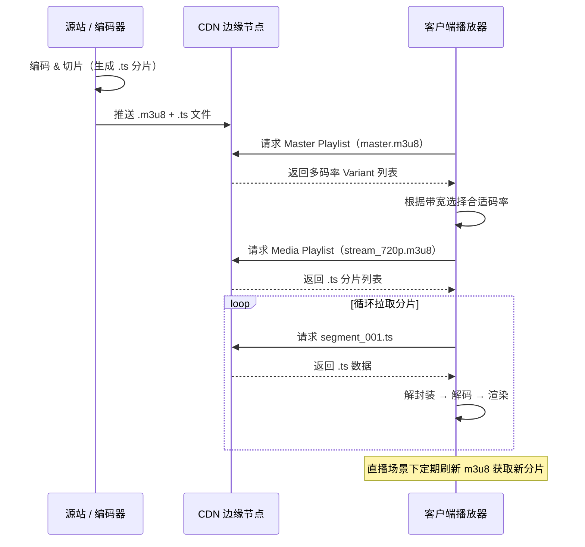
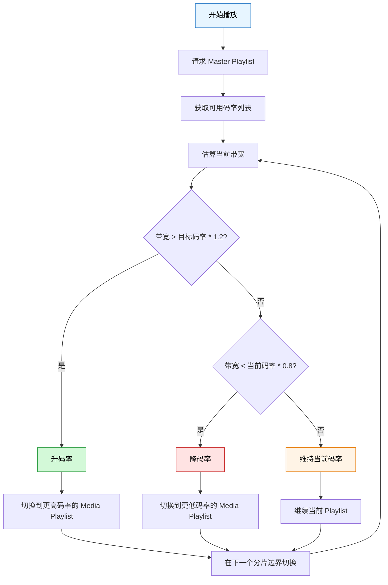
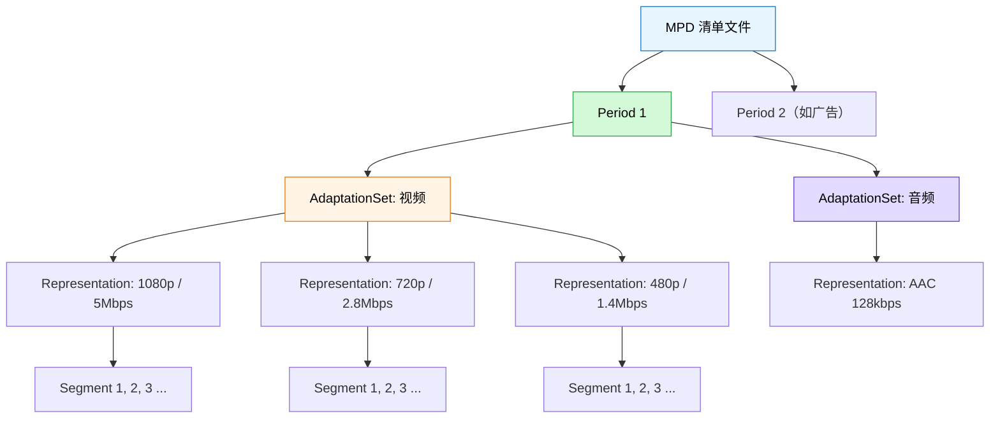
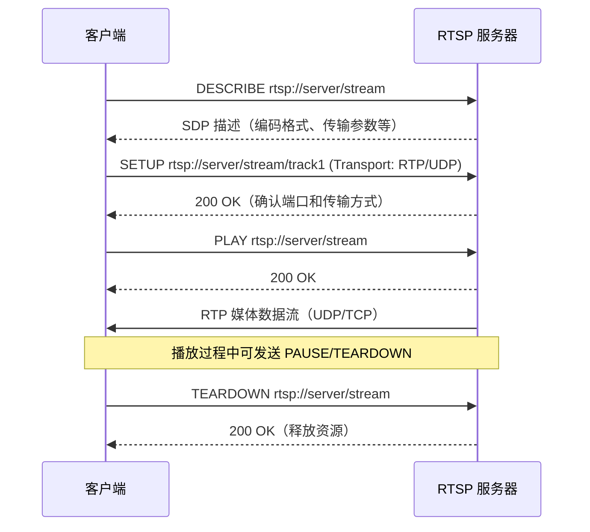
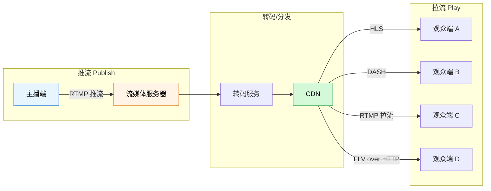
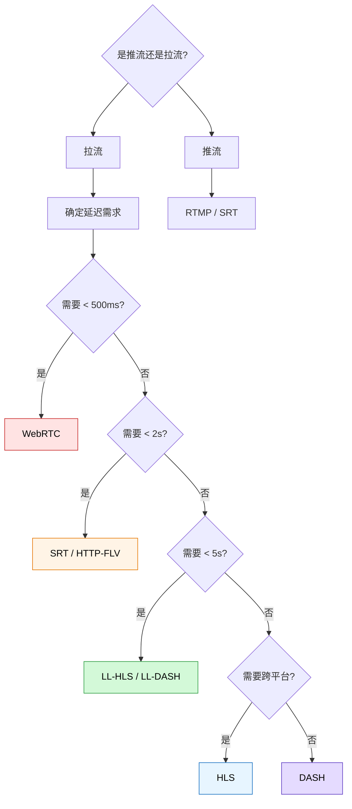
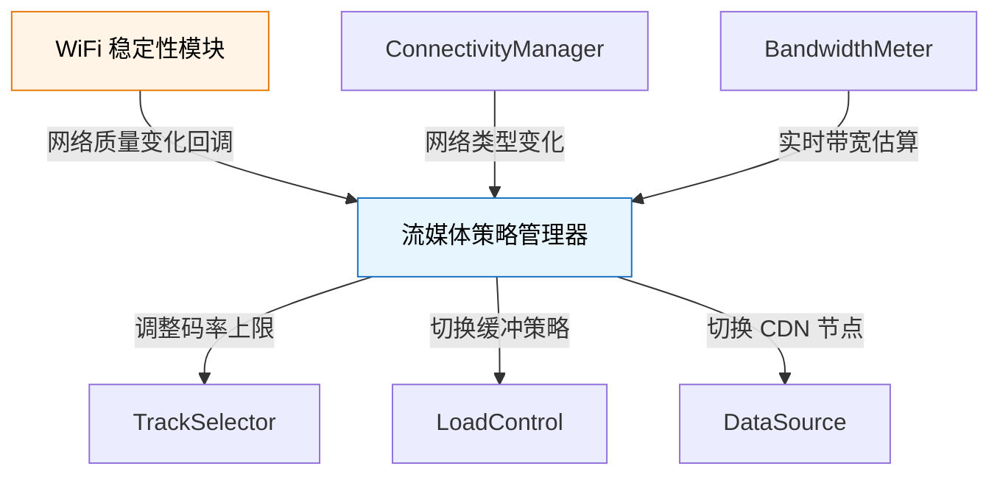

# 流媒体协议

## HLS（HTTP Live Streaming）

### 协议原理

HLS 是 Apple 提出的基于 HTTP 的自适应流媒体传输协议，目前已成为点播和直播领域最广泛使用的协议之一。其核心思想是将媒体文件切成若干小的 TS（Transport Stream）分片，通过 HTTP 分发，客户端按需请求并拼接播放。



**核心流程说明：**

1. **编码切片**：源站将原始视频编码为多种码率，并按固定时长（通常 2~10 秒）切成 `.ts` 分片。
2. **CDN 分发**：切好的 `.m3u8` 索引文件和 `.ts` 分片推送到 CDN 边缘节点。
3. **客户端拉取**：播放器先请求 Master Playlist 获取可用码率列表，再根据当前网络状况选择合适的 Media Playlist，逐片下载播放。
4. **直播刷新**：直播场景下 m3u8 是动态更新的，客户端需周期性重新请求以获取新增分片。

### m3u8 清单文件结构

**Master Playlist（多码率索引）：**

```
#EXTM3U
#EXT-X-VERSION:3

#EXT-X-STREAM-INF:BANDWIDTH=800000,RESOLUTION=640x360,CODECS="avc1.4d401e,mp4a.40.2"
stream_360p.m3u8

#EXT-X-STREAM-INF:BANDWIDTH=1400000,RESOLUTION=960x540,CODECS="avc1.4d401f,mp4a.40.2"
stream_540p.m3u8

#EXT-X-STREAM-INF:BANDWIDTH=2800000,RESOLUTION=1280x720,CODECS="avc1.4d401f,mp4a.40.2"
stream_720p.m3u8

#EXT-X-STREAM-INF:BANDWIDTH=5000000,RESOLUTION=1920x1080,CODECS="avc1.640028,mp4a.40.2"
stream_1080p.m3u8
```

**Media Playlist（具体分片列表）：**

```
#EXTM3U
#EXT-X-VERSION:3
#EXT-X-TARGETDURATION:6
#EXT-X-MEDIA-SEQUENCE:0

#EXTINF:6.006,
segment_000.ts
#EXTINF:6.006,
segment_001.ts
#EXTINF:6.006,
segment_002.ts
#EXTINF:4.838,
segment_003.ts

#EXT-X-ENDLIST
```

**关键标签说明：**

| 标签 | 说明 |
|------|------|
| `#EXT-X-VERSION` | HLS 协议版本号 |
| `#EXT-X-STREAM-INF` | 多码率变体声明，包含带宽、分辨率、编码器信息 |
| `#EXT-X-TARGETDURATION` | 最大分片时长（秒），客户端据此设置刷新间隔 |
| `#EXT-X-MEDIA-SEQUENCE` | 第一个分片的序列号，直播场景下会递增 |
| `#EXTINF` | 每个分片的实际时长 |
| `#EXT-X-ENDLIST` | 点播场景的结束标记；直播流不包含此标签 |
| `#EXT-X-KEY` | 加密信息，指定加密方式和密钥 URI |
| `#EXT-X-BYTERANGE` | fMP4 模式下指定字节范围 |

### 自适应码率切换机制

HLS 的自适应码率（ABR）是其核心优势之一。播放器根据实时网络状况在多个码率之间无缝切换。



**切换策略要点：**

- **切换时机**：只在分片边界切换，避免画面撕裂。
- **升码率保守、降码率激进**：网络好转时缓慢升级，网络恶化时快速降级，保证流畅性。
- **缓冲水位判断**：除了带宽估算，还需参考当前缓冲区数据量。缓冲充足时可以尝试升码率。
- **Media3 默认策略**：Media3 内置 `AdaptiveTrackSelection` 使用滑动窗口带宽估算，开发者也可自定义 `BandwidthMeter`。

### Media3 中的 HLS 支持

```kotlin
// 添加依赖: implementation("androidx.media3:media3-exoplayer-hls:1.x.x")

import androidx.media3.common.MediaItem
import androidx.media3.exoplayer.ExoPlayer
import androidx.media3.exoplayer.hls.HlsMediaSource
import androidx.media3.datasource.DefaultHttpDataSource

class HlsPlayerManager(private val context: Context) {

    private var player: ExoPlayer? = null

    fun initPlayer(playerView: PlayerView) {
        player = ExoPlayer.Builder(context)
            .build()
            .also { exoPlayer ->
                playerView.player = exoPlayer

                // 构建 HLS 数据源工厂
                val dataSourceFactory = DefaultHttpDataSource.Factory()
                    .setConnectTimeoutMs(8_000)
                    .setReadTimeoutMs(8_000)
                    .setAllowCrossProtocolRedirects(true)

                // 构建 HLS 媒体源
                val hlsMediaSource = HlsMediaSource.Factory(dataSourceFactory)
                    .setAllowChunklessPreparation(true) // 允许不下载分片即完成准备
                    .createMediaSource(
                        MediaItem.fromUri("https://example.com/live/master.m3u8")
                    )

                exoPlayer.setMediaSource(hlsMediaSource)
                exoPlayer.prepare()
                exoPlayer.playWhenReady = true
            }
    }

    fun release() {
        player?.release()
        player = null
    }
}
```

**自定义带宽估算与码率选择：**

```kotlin
import androidx.media3.exoplayer.upstream.DefaultBandwidthMeter
import androidx.media3.exoplayer.trackselection.DefaultTrackSelector

// 自定义带宽估算器
val bandwidthMeter = DefaultBandwidthMeter.Builder(context)
    .setInitialBitrateEstimate(1_000_000L) // 初始带宽估算 1Mbps
    .setSlidingWindowMaxWeight(2000) // 滑动窗口权重，越大越平滑
    .build()

// 自定义轨道选择器
val trackSelector = DefaultTrackSelector(context).apply {
    setParameters(
        buildUponParameters()
            .setMaxVideoSizeSd()                    // 限制最大分辨率为 SD
            .setForceHighestSupportedBitrate(false) // 不强制最高码率
            .setMaxVideoBitrate(2_000_000)          // 最大视频码率 2Mbps
    )
}

val player = ExoPlayer.Builder(context)
    .setBandwidthMeter(bandwidthMeter)
    .setTrackSelector(trackSelector)
    .build()
```

---

## DASH（Dynamic Adaptive Streaming over HTTP）

### 协议原理

DASH（Dynamic Adaptive Streaming over HTTP）是由 MPEG 组织制定的国际标准（ISO/IEC 23009-1），与 HLS 类似也是基于 HTTP 的自适应码率流媒体协议。其核心概念：

- **MPD（Media Presentation Description）**：XML 格式的清单文件，描述媒体的所有可用表示（Representation）。
- **Period**：时间段，一个 MPD 可包含多个 Period（用于广告插入等场景）。
- **AdaptationSet**：同一内容的不同表示集合（如视频的不同码率、音频的不同语言）。
- **Representation**：具体的编码版本（特定码率 + 分辨率）。
- **Segment**：实际的媒体数据分片。



### MPD 清单文件结构

```xml
<?xml version="1.0" encoding="UTF-8"?>
<MPD xmlns="urn:mpeg:dash:schema:mpd:2011"
     type="static"
     mediaPresentationDuration="PT0H3M30.0S"
     minBufferTime="PT2.0S"
     profiles="urn:mpeg:dash:profile:isoff-on-demand:2011">

  <Period duration="PT0H3M30.0S">

    <!-- 视频 AdaptationSet -->
    <AdaptationSet mimeType="video/mp4" codecs="avc1.640028" segmentAlignment="true">

      <Representation id="1" bandwidth="5000000" width="1920" height="1080">
        <BaseURL>video_1080p/</BaseURL>
        <SegmentList timescale="90000" duration="540000">
          <Initialization sourceURL="init.mp4"/>
          <SegmentURL media="seg_001.m4s"/>
          <SegmentURL media="seg_002.m4s"/>
          <SegmentURL media="seg_003.m4s"/>
        </SegmentList>
      </Representation>

      <Representation id="2" bandwidth="2800000" width="1280" height="720">
        <BaseURL>video_720p/</BaseURL>
        <SegmentList timescale="90000" duration="540000">
          <Initialization sourceURL="init.mp4"/>
          <SegmentURL media="seg_001.m4s"/>
          <SegmentURL media="seg_002.m4s"/>
          <SegmentURL media="seg_003.m4s"/>
        </SegmentList>
      </Representation>

    </AdaptationSet>

    <!-- 音频 AdaptationSet -->
    <AdaptationSet mimeType="audio/mp4" codecs="mp4a.40.2" lang="zh">
      <Representation id="3" bandwidth="128000">
        <BaseURL>audio/</BaseURL>
        <SegmentList timescale="44100" duration="264600">
          <Initialization sourceURL="init.mp4"/>
          <SegmentURL media="seg_001.m4s"/>
          <SegmentURL media="seg_002.m4s"/>
        </SegmentList>
      </Representation>
    </AdaptationSet>

  </Period>
</MPD>
```

### HLS vs DASH 对比与选型

| 对比维度 | HLS | DASH |
|----------|-----|------|
| 制定方 | Apple | MPEG（ISO 标准） |
| 清单格式 | m3u8（文本） | MPD（XML） |
| 分片格式 | .ts 或 fMP4（.m4s） | .m4s（fMP4） |
| iOS 原生支持 | ✅ 原生 | ❌ 需第三方 |
| Android 原生支持 | ✅ Media3 / ExoPlayer | ✅ Media3 / ExoPlayer |
| Web 浏览器 | Safari 原生，其他需 hls.js | 通过 MSE/EME 支持，dash.js |
| DRM 支持 | FairPlay / Widevine | Widevine / PlayReady / ClearKey |
| 编解码灵活性 | 受限于 Apple 生态 | 编解码无关，支持任意编码器 |
| 延迟 | 常规 10~30s，低延迟 HLS 约 2~5s | 常规 10~30s，低延迟 DASH 约 2~5s |
| 广告插入 | 简单（分片级别） | 灵活（Period 级别，支持动态广告） |
| 生态成熟度 | 非常成熟，CDN 支持最好 | 成熟，YouTube / Netflix 使用 |

**选型建议：**

- **纯 Android 项目**：两者均可，DASH 在 DRM 和广告插入上更灵活。
- **需要兼容 iOS**：优先 HLS，或同时提供两种格式。
- **点播 + DRM**：DASH + Widevine 是 Google 推荐方案。
- **直播场景**：HLS 的 CDN 生态更成熟，兼容性更好。

### Media3 中的 DASH 支持

```kotlin
// 添加依赖: implementation("androidx.media3:media3-exoplayer-dash:1.x.x")

import androidx.media3.common.MediaItem
import androidx.media3.exoplayer.ExoPlayer
import androidx.media3.exoplayer.dash.DashMediaSource
import androidx.media3.datasource.DefaultHttpDataSource

class DashPlayerManager(private val context: Context) {

    private var player: ExoPlayer? = null

    fun initPlayer(playerView: PlayerView) {
        val dataSourceFactory = DefaultHttpDataSource.Factory()

        // 构建 DASH 媒体源
        val dashMediaSource = DashMediaSource.Factory(dataSourceFactory)
            .createMediaSource(
                MediaItem.fromUri("https://example.com/video/manifest.mpd")
            )

        player = ExoPlayer.Builder(context)
            .build()
            .also { exoPlayer ->
                playerView.player = exoPlayer
                exoPlayer.setMediaSource(dashMediaSource)
                exoPlayer.prepare()
                exoPlayer.playWhenReady = true
            }
    }

    /**
     * 动态切换视频轨道（手动选择码率）
     */
    fun selectVideoTrack(trackIndex: Int) {
        val player = player ?: return
        val trackSelector = player.trackSelector as? DefaultTrackSelector ?: return

        // 获取当前可用的轨道组
        val mappedTrackInfo = trackSelector.currentMappedTrackInfo ?: return
        for (rendererIndex in 0 until mappedTrackInfo.rendererCount) {
            if (mappedTrackInfo.getRendererType(rendererIndex) == C.TRACK_TYPE_VIDEO) {
                val trackSelectionOverride = TrackSelectionOverride(
                    mappedTrackInfo.getTrackGroups(rendererIndex)[0],
                    listOf(trackIndex)
                )
                trackSelector.setParameters(
                    trackSelector.buildUponParameters()
                        .setOverrideForType(trackSelectionOverride)
                )
                break
            }
        }
    }

    fun release() {
        player?.release()
        player = null
    }
}
```

---

## RTSP（Real Time Streaming Protocol）

### 协议原理与适用场景

RTSP 是一种应用层控制协议，用于控制实时数据的传输，常与 RTP（Real-time Transport Protocol）配合使用。RTSP 本身不传输媒体数据，而是作为"遥控器"控制媒体流的播放。

**核心交互流程：**



**RTSP 关键方法：**

| 方法 | 说明 |
|------|------|
| `DESCRIBE` | 获取媒体资源的 SDP 描述 |
| `SETUP` | 建立传输通道，协商传输参数 |
| `PLAY` | 开始传输媒体数据 |
| `PAUSE` | 暂停传输 |
| `TEARDOWN` | 关闭会话，释放资源 |
| `OPTIONS` | 查询服务器支持的方法 |

**适用场景：**

- 监控摄像头实时预览（IP Camera / NVR）
- 视频会议
- 工业设备实时视频流
- 局域网内低延迟传输

### Android 端接入方案

| 方案 | 延迟 | 格式支持 | 维护状态 | 包大小 | 推荐场景 |
|------|------|----------|----------|--------|----------|
| **Media3 RTSP 模块** | 中等（~500ms） | H.264 / H.265 / AAC | 活跃维护 | 小（增量 ~200KB） | 标准 RTSP 流，首选方案 |
| **LibVLC** | 较低（~300ms） | 几乎所有格式 | 活跃维护 | 大（~15MB） | 复杂编码格式或需要兼容性 |
| **ijkplayer** | 较低（~300ms） | 主流格式 | 停止维护 | 中等（~5MB） | 历史项目维护 |
| **FFmpeg 自建** | 最低（~100ms） | 完全自定义 | 自行维护 | 可裁剪 | 极致延迟要求 |

**Media3 RTSP 接入代码：**

```kotlin
// 添加依赖: implementation("androidx.media3:media3-exoplayer-rtsp:1.x.x")

import androidx.media3.common.MediaItem
import androidx.media3.exoplayer.ExoPlayer
import androidx.media3.exoplayer.rtsp.RtspMediaSource

class RtspPlayerManager(private val context: Context) {

    private var player: ExoPlayer? = null

    fun initPlayer(playerView: PlayerView) {
        player = ExoPlayer.Builder(context)
            .build()
            .also { exoPlayer ->
                playerView.player = exoPlayer

                val rtspMediaSource = RtspMediaSource.Factory()
                    .setForceUseRtpTcp(true)          // 强制使用 TCP 传输，NAT 穿透更友好
                    .setTimeoutMs(8_000)               // 连接超时
                    .createMediaSource(
                        MediaItem.fromUri("rtsp://camera.example.com:554/live/stream1")
                    )

                exoPlayer.setMediaSource(rtspMediaSource)
                exoPlayer.prepare()
                exoPlayer.playWhenReady = true
            }
    }

    fun release() {
        player?.release()
        player = null
    }
}
```

### 延迟优化

RTSP 场景对延迟极其敏感，以下是关键优化手段：

| 优化项 | 方案 | 预期效果 |
|--------|------|----------|
| 传输协议 | 优先 TCP 避免丢包重传，局域网可用 UDP | 减少重传延迟 |
| 缓冲策略 | 最小化缓冲区，允许丢帧 | 延迟降至 200ms 内 |
| 解码模式 | 硬解码 + 低延迟配置 | 解码耗时降低 50% |
| 关键帧间隔 | 服务端 GOP 设为 1~2 秒 | 减少首帧等待 |
| 渲染 | 使用 SurfaceView 替代 TextureView | 减少一帧渲染延迟 |

```kotlin
// 低延迟 RTSP 播放器配置
val player = ExoPlayer.Builder(context)
    .setLoadControl(
        DefaultLoadControl.Builder()
            .setBufferDurationsMs(
                500,    // 最小缓冲 500ms
                1000,   // 最大缓冲 1s
                0,      // 起播缓冲 0（立即播放）
                500     // 重新缓冲 500ms
            )
            .build()
    )
    .build()
```

---

## RTMP（Real-Time Messaging Protocol）

### 协议原理与适用场景

RTMP 是 Adobe 开发的基于 TCP 的流媒体传输协议，最初用于 Flash 播放器。虽然 Flash 已淘汰，但 RTMP 在**推流端**仍然广泛使用，是主流直播推流协议。

**核心特点：**

- 基于 TCP 长连接，传输稳定
- 支持音视频和数据多路复用
- 默认端口 1935
- 延迟通常在 1~3 秒

**协议变种：**

| 变种 | 说明 |
|------|------|
| RTMP | 原始协议，TCP 端口 1935 |
| RTMPS | RTMP over TLS/SSL，加密传输 |
| RTMPE | 使用 Adobe 私有加密 |
| RTMPT | RTMP over HTTP，穿越防火墙 |

**适用场景：**

- 直播推流（OBS / 手机直播推流到服务器）
- 实时互动直播的推流端
- 与 CDN 平台对接的标准推流协议

### 推流 vs 拉流



| 对比项 | 推流（Publish） | 拉流（Play） |
|--------|----------------|--------------|
| 方向 | 客户端 → 服务器 | 服务器 → 客户端 |
| 协议选择 | RTMP / SRT / RTSP | HLS / DASH / FLV / RTMP |
| Android 实现 | 需推流 SDK（如 Larix / StreamPack） | Media3 / ExoPlayer / 系统播放器 |
| 延迟要求 | 越低越好（影响互动） | 取决于业务场景 |
| 典型码率 | 由主播端编码器决定 | 由服务端多码率转码决定 |

### 低延迟直播方案对比

| 方案 | 协议 | 典型延迟 | 兼容性 | 适用场景 |
|------|------|----------|--------|----------|
| **RTMP 拉流** | RTMP | 1~3s | 需要 Flash 或 SDK | 逐渐淘汰中 |
| **HTTP-FLV** | FLV over HTTP | 1~3s | 浏览器 + 移动端 | 国内直播主流 |
| **低延迟 HLS** | LL-HLS | 2~5s | iOS 原生 + Media3 | Apple 生态 |
| **低延迟 DASH** | LL-DASH | 2~5s | Media3 + dash.js | Google 推荐 |
| **SRT** | SRT | 0.5~1.5s | 需 SDK | 专业直播 / 远程制作 |
| **WebRTC** | WebRTC | <500ms | 浏览器原生 | 实时互动 / 连麦 |

---

## 协议选型决策

### 场景 - 协议映射表

| 业务场景 | 推荐协议 | 备选方案 | 说明 |
|----------|----------|----------|------|
| 长视频点播 | HLS / DASH | MP4 Progressive | CDN 友好，支持自适应码率 |
| 短视频信息流 | HLS / MP4 | DASH | 首帧速度优先 |
| 标准直播 | HLS / HTTP-FLV | RTMP 拉流 | 延迟 3~10s 可接受 |
| 低延迟直播 | LL-HLS / LL-DASH | SRT / HTTP-FLV | 延迟 2~5s |
| 实时互动（连麦） | WebRTC | SRT | 延迟 <500ms |
| 监控摄像头 | RTSP | RTMP | 局域网低延迟 |
| 直播推流端 | RTMP / SRT | RTSP | 推流标准协议 |

### 延迟要求与协议选择



### CDN 适配与防盗链

**CDN 协议支持情况：**

| CDN 厂商 | HLS | DASH | HTTP-FLV | RTMP | SRT |
|----------|-----|------|----------|------|-----|
| 阿里云 CDN | ✅ | ✅ | ✅ | ✅ | ✅ |
| 腾讯云 CDN | ✅ | ✅ | ✅ | ✅ | ✅ |
| AWS CloudFront | ✅ | ✅ | ❌ | ❌ | ❌ |
| Cloudflare Stream | ✅ | ✅ | ❌ | ✅ | ❌ |
| Akamai | ✅ | ✅ | ✅ | ✅ | ✅ |

**防盗链方案：**

```kotlin
/**
 * 生成带签名的流媒体 URL
 * 使用时间戳 + 密钥 + 路径的方式进行 URL 鉴权
 */
object StreamUrlSigner {

    fun signUrl(
        baseUrl: String,
        secretKey: String,
        expireSeconds: Long = 3600
    ): String {
        val expireTime = System.currentTimeMillis() / 1000 + expireSeconds
        val uri = Uri.parse(baseUrl)
        val path = uri.path ?: ""

        // 计算签名：MD5(secretKey + path + expireTime)
        val rawString = "$secretKey$path$expireTime"
        val sign = MessageDigest.getInstance("MD5")
            .digest(rawString.toByteArray())
            .joinToString("") { "%02x".format(it) }

        return uri.buildUpon()
            .appendQueryParameter("sign", sign)
            .appendQueryParameter("t", expireTime.toString(16)) // 16 进制时间戳
            .build()
            .toString()
    }
}
```

---

## 弱网环境下的流媒体策略

### 码率自适应降级

弱网环境下，码率自适应降级是保证播放流畅性的首要手段：

```kotlin
import androidx.media3.exoplayer.trackselection.DefaultTrackSelector

/**
 * 弱网场景下动态调整码率策略
 */
class AdaptiveBitrateManager(
    private val player: ExoPlayer,
    private val trackSelector: DefaultTrackSelector
) {
    enum class NetworkQuality { EXCELLENT, GOOD, MODERATE, POOR, VERY_POOR }

    /**
     * 根据网络质量调整最大码率
     */
    fun adjustForNetwork(quality: NetworkQuality) {
        val (maxBitrate, maxHeight) = when (quality) {
            NetworkQuality.EXCELLENT -> 5_000_000 to 1080
            NetworkQuality.GOOD      -> 2_800_000 to 720
            NetworkQuality.MODERATE   -> 1_400_000 to 540
            NetworkQuality.POOR       -> 800_000 to 360
            NetworkQuality.VERY_POOR  -> 400_000 to 240
        }

        trackSelector.setParameters(
            trackSelector.buildUponParameters()
                .setMaxVideoBitrate(maxBitrate)
                .setMaxVideoSize(Int.MAX_VALUE, maxHeight)
        )
    }
}
```

### 缓冲策略调优

```kotlin
import androidx.media3.exoplayer.DefaultLoadControl

/**
 * 根据网络环境配置不同的缓冲策略
 */
object BufferStrategyFactory {

    /** 正常网络缓冲策略 */
    fun normalBuffer(): DefaultLoadControl {
        return DefaultLoadControl.Builder()
            .setBufferDurationsMs(
                15_000,    // 最小缓冲 15s
                50_000,    // 最大缓冲 50s
                2_500,     // 起播缓冲 2.5s
                5_000      // rebuffer 后恢复缓冲 5s
            )
            .setTargetBufferBytes(DefaultLoadControl.DEFAULT_TARGET_BUFFER_BYTES)
            .setPrioritizeTimeOverSizeThresholds(true)
            .build()
    }

    /** 弱网络缓冲策略：增加缓冲以减少卡顿 */
    fun weakNetworkBuffer(): DefaultLoadControl {
        return DefaultLoadControl.Builder()
            .setBufferDurationsMs(
                30_000,    // 最小缓冲 30s（多缓冲应对网络波动）
                120_000,   // 最大缓冲 120s
                5_000,     // 起播缓冲 5s（牺牲首帧换稳定性）
                10_000     // rebuffer 后恢复缓冲 10s
            )
            .setPrioritizeTimeOverSizeThresholds(true)
            .build()
    }

    /** 低延迟直播缓冲策略 */
    fun lowLatencyBuffer(): DefaultLoadControl {
        return DefaultLoadControl.Builder()
            .setBufferDurationsMs(
                1_000,     // 最小缓冲 1s
                3_000,     // 最大缓冲 3s
                0,         // 起播缓冲 0（立即播放）
                500        // rebuffer 后仅恢复 500ms
            )
            .build()
    }
}
```

### 与 WiFi 稳定性模块联动

在实际项目中，流媒体策略应与网络状态监测模块协同工作：



```kotlin
/**
 * 流媒体策略管理器：整合网络状态感知和播放策略调整
 */
class StreamingStrategyManager(
    private val context: Context,
    private val player: ExoPlayer,
    private val trackSelector: DefaultTrackSelector
) {
    private val bitrateManager = AdaptiveBitrateManager(player, trackSelector)

    /**
     * 响应 WiFi 稳定性模块的回调
     * 在 WiFi 信号质量下降时主动降级
     */
    fun onWifiQualityChanged(rssi: Int, linkSpeed: Int) {
        val quality = when {
            rssi > -50 && linkSpeed > 100 -> AdaptiveBitrateManager.NetworkQuality.EXCELLENT
            rssi > -60 && linkSpeed > 50  -> AdaptiveBitrateManager.NetworkQuality.GOOD
            rssi > -70 && linkSpeed > 20  -> AdaptiveBitrateManager.NetworkQuality.MODERATE
            rssi > -80                    -> AdaptiveBitrateManager.NetworkQuality.POOR
            else                          -> AdaptiveBitrateManager.NetworkQuality.VERY_POOR
        }
        bitrateManager.adjustForNetwork(quality)
    }

    /**
     * 响应网络类型变化
     */
    fun onNetworkTypeChanged(isMobile: Boolean, isMetered: Boolean) {
        if (isMobile && isMetered) {
            // 移动网络下限制最大码率，节省流量
            trackSelector.setParameters(
                trackSelector.buildUponParameters()
                    .setMaxVideoBitrate(1_400_000) // 限制 1.4Mbps
                    .setMaxVideoSize(1280, 720)
            )
        }
    }
}
```

---

## 踩坑记录

> 此区域供团队成员补充项目中遇到的真实案例。

| 日期 | 记录人 | 问题描述 | 解决方案 |
|------|--------|----------|----------|
| | | | |

## 参考资料

- [HLS 规范 - RFC 8216](https://datatracker.ietf.org/doc/html/rfc8216)
- [DASH 规范 - ISO/IEC 23009-1](https://www.iso.org/standard/79329.html)
- [Media3 HLS 文档](https://developer.android.com/media/media3/exoplayer/hls)
- [Media3 DASH 文档](https://developer.android.com/media/media3/exoplayer/dash)
- [Media3 RTSP 文档](https://developer.android.com/media/media3/exoplayer/rtsp)
- [Apple Low-Latency HLS](https://developer.apple.com/documentation/http-live-streaming/enabling-low-latency-http-live-streaming)
- [SRT Alliance](https://www.srtalliance.org/)
- [WebRTC 官方文档](https://webrtc.org/)
- [ExoPlayer GitHub - 流媒体示例](https://github.com/androidx/media/tree/release/demos)
