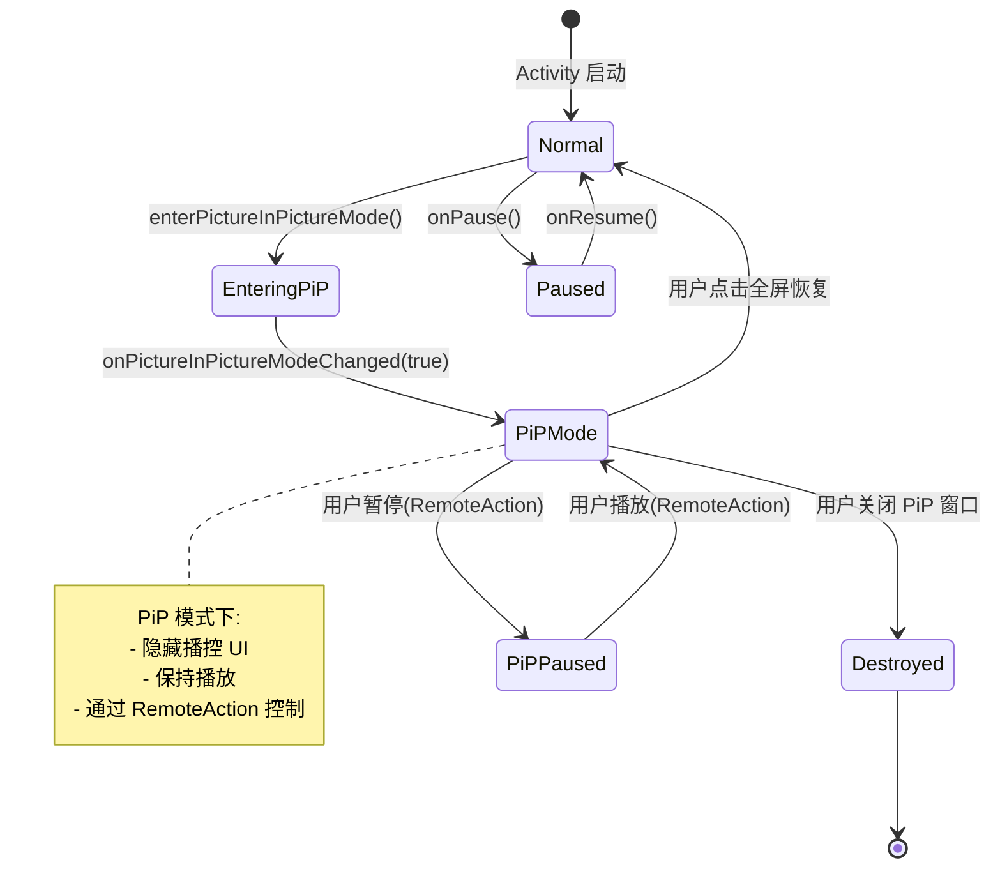
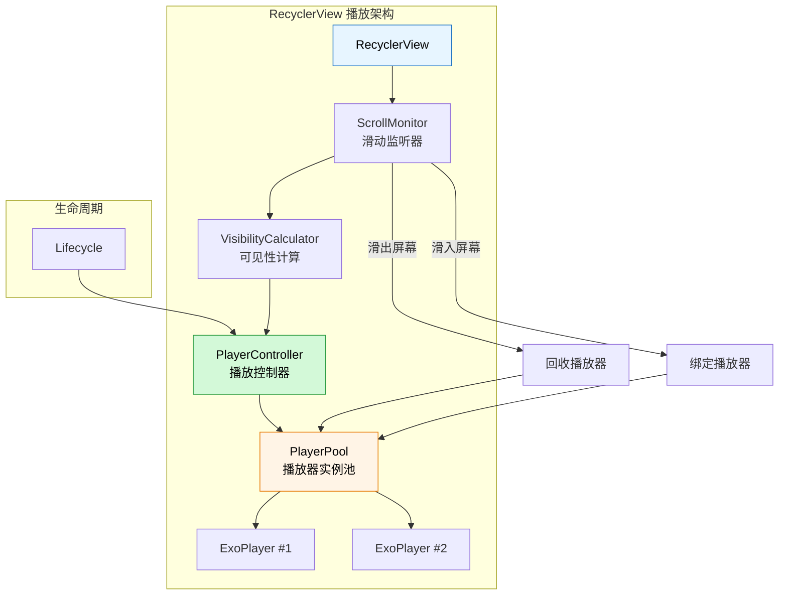

# 播放器 UI 与交互

## 自定义播控 UI

### 基于 Media3 PlayerView 的定制

Media3 提供的 `PlayerView` 是一个高度可配置的播放器视图组件，支持通过 XML 属性和代码两种方式进行定制。

**常用 XML 属性：**

| 属性 | 类型 | 说明 |
|------|------|------|
| `app:show_buffering` | `when_playing` / `always` / `never` | 缓冲指示器显示时机 |
| `app:use_controller` | `boolean` | 是否显示播控栏 |
| `app:controller_layout_id` | `reference` | 自定义播控布局资源 ID |
| `app:surface_type` | `surface_view` / `texture_view` / `none` | 渲染表面类型 |
| `app:resize_mode` | `fit` / `fill` / `zoom` / `fixed_width` / `fixed_height` | 视频缩放模式 |
| `app:show_shuffle_button` | `boolean` | 是否显示随机播放按钮 |
| `app:show_subtitle_button` | `boolean` | 是否显示字幕按钮 |
| `app:animation_enabled` | `boolean` | 播控栏显隐是否有动画 |
| `app:auto_show` | `boolean` | 播放状态变化时是否自动显示播控栏 |
| `app:hide_on_touch` | `boolean` | 触摸时是否隐藏播控栏 |
| `app:hide_during_ads` | `boolean` | 广告期间是否隐藏播控栏 |

**基础使用：**

```xml
<!-- layout/activity_player.xml -->
<androidx.media3.ui.PlayerView
    android:id="@+id/player_view"
    android:layout_width="match_parent"
    android:layout_height="match_parent"
    app:show_buffering="when_playing"
    app:use_controller="true"
    app:surface_type="surface_view"
    app:resize_mode="fit"
    app:controller_layout_id="@layout/custom_player_controls"
    app:auto_show="true"
    app:hide_on_touch="true" />
```

### 自定义 ControllerView 布局

通过 `controller_layout_id` 属性指定自定义布局文件，完全控制播控栏的外观。Media3 通过特定的 View ID 来识别和绑定控件。

```xml
<!-- layout/custom_player_controls.xml -->
<?xml version="1.0" encoding="UTF-8"?>
<FrameLayout xmlns:android="http://schemas.android.com/apk/res/android"
    android:layout_width="match_parent"
    android:layout_height="match_parent">

    <!-- 顶部栏：标题 + 设置 -->
    <LinearLayout
        android:layout_width="match_parent"
        android:layout_height="48dp"
        android:layout_gravity="top"
        android:background="#80000000"
        android:gravity="center_vertical"
        android:orientation="horizontal"
        android:paddingHorizontal="16dp">

        <ImageButton
            android:id="@+id/btn_back"
            android:layout_width="32dp"
            android:layout_height="32dp"
            android:background="?attr/selectableItemBackgroundBorderless"
            android:src="@drawable/ic_arrow_back" />

        <TextView
            android:id="@+id/tv_title"
            android:layout_width="0dp"
            android:layout_height="wrap_content"
            android:layout_weight="1"
            android:layout_marginStart="12dp"
            android:textColor="@android:color/white"
            android:textSize="16sp"
            android:ellipsize="end"
            android:maxLines="1" />

        <ImageButton
            android:id="@+id/btn_settings"
            android:layout_width="32dp"
            android:layout_height="32dp"
            android:background="?attr/selectableItemBackgroundBorderless"
            android:src="@drawable/ic_settings" />
    </LinearLayout>

    <!-- 中央播放/暂停按钮 -->
    <ImageButton
        android:id="@id/exo_play_pause"
        android:layout_width="64dp"
        android:layout_height="64dp"
        android:layout_gravity="center"
        android:background="@drawable/bg_circle_semi_transparent" />

    <!-- 底部控制栏 -->
    <LinearLayout
        android:layout_width="match_parent"
        android:layout_height="wrap_content"
        android:layout_gravity="bottom"
        android:background="#80000000"
        android:orientation="vertical"
        android:padding="8dp">

        <!-- 进度条 -->
        <androidx.media3.ui.DefaultTimeBar
            android:id="@id/exo_progress"
            android:layout_width="match_parent"
            android:layout_height="26dp"
            app:played_color="#FF4081"
            app:buffered_color="#80FF4081"
            app:unplayed_color="#33FFFFFF"
            app:scrubber_color="#FF4081"
            app:bar_height="3dp"
            app:touch_target_height="26dp" />

        <LinearLayout
            android:layout_width="match_parent"
            android:layout_height="40dp"
            android:gravity="center_vertical"
            android:orientation="horizontal">

            <!-- 当前时间 -->
            <TextView
                android:id="@id/exo_position"
                android:layout_width="wrap_content"
                android:layout_height="wrap_content"
                android:textColor="@android:color/white"
                android:textSize="12sp" />

            <TextView
                android:layout_width="wrap_content"
                android:layout_height="wrap_content"
                android:text=" / "
                android:textColor="#80FFFFFF"
                android:textSize="12sp" />

            <!-- 总时长 -->
            <TextView
                android:id="@id/exo_duration"
                android:layout_width="wrap_content"
                android:layout_height="wrap_content"
                android:textColor="@android:color/white"
                android:textSize="12sp" />

            <View
                android:layout_width="0dp"
                android:layout_height="0dp"
                android:layout_weight="1" />

            <!-- 倍速按钮 -->
            <TextView
                android:id="@+id/btn_speed"
                android:layout_width="wrap_content"
                android:layout_height="wrap_content"
                android:padding="8dp"
                android:text="1.0x"
                android:textColor="@android:color/white"
                android:textSize="13sp" />

            <!-- 全屏按钮 -->
            <ImageButton
                android:id="@+id/btn_fullscreen"
                android:layout_width="32dp"
                android:layout_height="32dp"
                android:background="?attr/selectableItemBackgroundBorderless"
                android:src="@drawable/ic_fullscreen" />
        </LinearLayout>
    </LinearLayout>
</FrameLayout>
```

**注意事项：**
- 使用 `@id/exo_play_pause`、`@id/exo_progress`、`@id/exo_position`、`@id/exo_duration` 等预定义 ID，Media3 会自动绑定到对应的 Player 状态。
- 自定义 ID（如 `@+id/btn_fullscreen`、`@+id/btn_speed`）则需要在代码中手动处理逻辑。

### 播控按钮状态管理

```kotlin
import androidx.media3.common.Player
import androidx.media3.ui.PlayerView

/**
 * 播控 UI 状态管理器
 * 负责同步 Player 状态到自定义 UI 控件
 */
class PlayerControlManager(
    private val playerView: PlayerView,
    private val player: ExoPlayer
) {
    private val speedOptions = floatArrayOf(0.5f, 0.75f, 1.0f, 1.25f, 1.5f, 2.0f)
    private var currentSpeedIndex = 2 // 默认 1.0x

    fun setup() {
        val btnSpeed = playerView.findViewById<TextView>(R.id.btn_speed)
        val btnFullscreen = playerView.findViewById<ImageButton>(R.id.btn_fullscreen)
        val tvTitle = playerView.findViewById<TextView>(R.id.tv_title)

        // 倍速切换
        btnSpeed?.setOnClickListener {
            currentSpeedIndex = (currentSpeedIndex + 1) % speedOptions.size
            val speed = speedOptions[currentSpeedIndex]
            player.setPlaybackSpeed(speed)
            btnSpeed.text = "${speed}x"
        }

        // 监听 Player 状态变化
        player.addListener(object : Player.Listener {
            override fun onPlaybackStateChanged(state: Int) {
                when (state) {
                    Player.STATE_BUFFERING -> showBuffering(true)
                    Player.STATE_READY -> showBuffering(false)
                    Player.STATE_ENDED -> onPlaybackEnded()
                    Player.STATE_IDLE -> { /* 空闲 */ }
                }
            }

            override fun onIsPlayingChanged(isPlaying: Boolean) {
                // 播控栏自动显隐：播放中 3s 后隐藏，暂停时常驻
                if (isPlaying) {
                    playerView.controllerShowTimeoutMs = 3000
                } else {
                    playerView.controllerShowTimeoutMs = 0 // 不自动隐藏
                    playerView.showController()
                }
            }

            override fun onMediaItemTransition(mediaItem: MediaItem?, reason: Int) {
                tvTitle?.text = mediaItem?.mediaMetadata?.title ?: ""
            }
        })
    }

    private fun showBuffering(show: Boolean) {
        // 根据业务需求展示/隐藏自定义加载动画
    }

    private fun onPlaybackEnded() {
        playerView.showController()
        // 可展示"重播"按钮或自动播放下一集
    }
}
```

### 进度条自定义（SeekBar / TimeBar）

Media3 的 `DefaultTimeBar` 支持高度定制，也可以完全自定义 `TimeBar` 实现。

```kotlin
import android.content.Context
import android.graphics.Canvas
import android.graphics.Paint
import android.graphics.RectF
import android.util.AttributeSet
import androidx.media3.ui.DefaultTimeBar

/**
 * 自定义进度条：支持圆角、章节标记等
 */
class CustomTimeBar @JvmOverloads constructor(
    context: Context,
    attrs: AttributeSet? = null,
    defStyleAttr: Int = 0
) : DefaultTimeBar(context, attrs, defStyleAttr) {

    private val chapterMarkers = mutableListOf<Long>() // 章节标记位置（毫秒）
    private val markerPaint = Paint(Paint.ANTI_ALIAS_FLAG).apply {
        color = 0xFFFFFFFF.toInt()
        strokeWidth = 2f.dpToPx(context)
    }

    /**
     * 设置章节标记点
     */
    fun setChapterMarkers(positions: List<Long>) {
        chapterMarkers.clear()
        chapterMarkers.addAll(positions)
        invalidate()
    }

    override fun onDraw(canvas: Canvas) {
        super.onDraw(canvas)
        // 在进度条上绘制章节标记
        if (chapterMarkers.isNotEmpty() && duration > 0) {
            chapterMarkers.forEach { position ->
                val ratio = position.toFloat() / duration.toFloat()
                val x = paddingLeft + ratio * (width - paddingLeft - paddingRight)
                canvas.drawCircle(x, height / 2f, 3f.dpToPx(context), markerPaint)
            }
        }
    }

    private fun Float.dpToPx(context: Context): Float =
        this * context.resources.displayMetrics.density
}
```

---

## 全屏与画中画

### 全屏切换实现方案

```kotlin
import android.content.pm.ActivityInfo
import android.view.View
import android.view.WindowInsetsController
import androidx.core.view.WindowCompat
import androidx.core.view.WindowInsetsCompat
import androidx.core.view.WindowInsetsControllerCompat

/**
 * 全屏管理器：负责全屏 / 退出全屏的切换
 */
class FullscreenManager(private val activity: Activity) {

    private var isFullscreen = false

    fun toggleFullscreen() {
        if (isFullscreen) exitFullscreen() else enterFullscreen()
    }

    fun enterFullscreen() {
        isFullscreen = true

        // 横屏
        activity.requestedOrientation = ActivityInfo.SCREEN_ORIENTATION_SENSOR_LANDSCAPE

        // 隐藏系统栏
        val windowInsetsController = WindowCompat.getInsetsController(
            activity.window, activity.window.decorView
        )
        windowInsetsController.apply {
            hide(WindowInsetsCompat.Type.systemBars())
            systemBarsBehavior =
                WindowInsetsControllerCompat.BEHAVIOR_SHOW_TRANSIENT_BARS_BY_SWIPE
        }

        // 播放器全屏布局
        updatePlayerLayout(isFullscreen = true)
    }

    fun exitFullscreen() {
        isFullscreen = false

        // 恢复竖屏
        activity.requestedOrientation = ActivityInfo.SCREEN_ORIENTATION_PORTRAIT

        // 显示系统栏
        val windowInsetsController = WindowCompat.getInsetsController(
            activity.window, activity.window.decorView
        )
        windowInsetsController.show(WindowInsetsCompat.Type.systemBars())

        // 恢复正常布局
        updatePlayerLayout(isFullscreen = false)
    }

    private fun updatePlayerLayout(isFullscreen: Boolean) {
        val playerView = activity.findViewById<PlayerView>(R.id.player_view)
        val params = playerView.layoutParams
        if (isFullscreen) {
            params.width = ViewGroup.LayoutParams.MATCH_PARENT
            params.height = ViewGroup.LayoutParams.MATCH_PARENT
        } else {
            params.width = ViewGroup.LayoutParams.MATCH_PARENT
            params.height = (240 * activity.resources.displayMetrics.density).toInt()
        }
        playerView.layoutParams = params
    }

    fun isFullscreen() = isFullscreen
}
```

### 横竖屏旋转处理

在 `AndroidManifest.xml` 中配置 Activity 以避免横竖屏切换导致 Activity 重建：

```xml
<activity
    android:name=".ui.PlayerActivity"
    android:configChanges="orientation|screenSize|screenLayout|smallestScreenSize|keyboard|keyboardHidden"
    android:supportsPictureInPicture="true"
    android:launchMode="singleTop" />
```

```kotlin
/**
 * 处理横竖屏旋转：支持传感器自动旋转 + 手动切换
 */
class OrientationManager(
    private val activity: Activity,
    private val fullscreenManager: FullscreenManager
) {
    private var orientationEventListener: OrientationEventListener? = null
    private var isUserLocked = false // 用户是否锁定了方向

    fun enable() {
        orientationEventListener = object : OrientationEventListener(activity) {
            override fun onOrientationChanged(orientation: Int) {
                if (isUserLocked) return
                when {
                    // 接近竖屏（0° 或 360°附近）
                    isPortrait(orientation) && fullscreenManager.isFullscreen() -> {
                        fullscreenManager.exitFullscreen()
                    }
                    // 接近横屏（90° 或 270° 附近）
                    isLandscape(orientation) && !fullscreenManager.isFullscreen() -> {
                        fullscreenManager.enterFullscreen()
                    }
                }
            }
        }.also { it.enable() }
    }

    fun disable() {
        orientationEventListener?.disable()
        orientationEventListener = null
    }

    fun lockCurrentOrientation() { isUserLocked = true }
    fun unlockOrientation() { isUserLocked = false }

    private fun isPortrait(orientation: Int): Boolean =
        orientation in 350..360 || orientation in 0..10 ||
        orientation in 170..190

    private fun isLandscape(orientation: Int): Boolean =
        orientation in 80..100 || orientation in 260..280
}
```

### 画中画（PiP）模式实现

**AndroidManifest 配置：**

```xml
<activity
    android:name=".ui.PlayerActivity"
    android:supportsPictureInPicture="true"
    android:configChanges="screenSize|smallestScreenSize|screenLayout|orientation"
    android:launchMode="singleTop" />
```

**PiP 实现代码：**

```kotlin
import android.app.PictureInPictureParams
import android.os.Build
import android.util.Rational
import androidx.annotation.RequiresApi

/**
 * 画中画管理器
 */
class PipManager(
    private val activity: Activity,
    private val player: ExoPlayer
) {
    @RequiresApi(Build.VERSION_CODES.O)
    fun enterPip() {
        val videoFormat = player.videoFormat
        val aspectRatio = if (videoFormat != null && videoFormat.width > 0) {
            Rational(videoFormat.width, videoFormat.height)
        } else {
            Rational(16, 9)
        }

        val params = PictureInPictureParams.Builder()
            .setAspectRatio(aspectRatio)
            .setAutoEnterEnabled(true)       // Android 12+ 支持自动进入 PiP
            .setSeamlessResizeEnabled(true)  // 无缝缩放
            .build()

        activity.enterPictureInPictureMode(params)
    }

    /**
     * Android 12+ 支持自动进入 PiP（用户按 Home 键时）
     */
    @RequiresApi(Build.VERSION_CODES.S)
    fun enableAutoEnterPip() {
        val params = PictureInPictureParams.Builder()
            .setAutoEnterEnabled(true)
            .setAspectRatio(Rational(16, 9))
            .build()
        activity.setPictureInPictureParams(params)
    }
}
```

### PiP 生命周期与状态回调



```kotlin
/**
 * 在 Activity 中处理 PiP 生命周期
 */
class PlayerActivity : AppCompatActivity() {

    private lateinit var pipManager: PipManager
    private var player: ExoPlayer? = null

    override fun onPictureInPictureModeChanged(
        isInPictureInPictureMode: Boolean,
        newConfig: Configuration
    ) {
        super.onPictureInPictureModeChanged(isInPictureInPictureMode, newConfig)

        val playerView = findViewById<PlayerView>(R.id.player_view)

        if (isInPictureInPictureMode) {
            // 进入 PiP：隐藏播控 UI，只保留视频画面
            playerView.useController = false
            hideNonEssentialViews()
        } else {
            // 退出 PiP：恢复播控 UI
            playerView.useController = true
            showNonEssentialViews()

            // 检查是否通过关闭 PiP 退出（此时 Activity 可能要 finish）
            if (lifecycle.currentState == Lifecycle.State.CREATED) {
                finish() // 用户点了 PiP 上的关闭按钮
            }
        }
    }

    /**
     * PiP 模式下 onPause 不应暂停播放
     */
    override fun onPause() {
        super.onPause()
        if (!isInPictureInPictureMode) {
            player?.pause()
        }
    }

    /**
     * 用户按 Home / 最近任务 时自动进入 PiP
     */
    override fun onUserLeaveHint() {
        super.onUserLeaveHint()
        if (player?.isPlaying == true && Build.VERSION.SDK_INT >= Build.VERSION_CODES.O) {
            pipManager.enterPip()
        }
    }

    private fun hideNonEssentialViews() { /* 隐藏标题栏等 */ }
    private fun showNonEssentialViews() { /* 恢复标题栏等 */ }
}
```

### 多窗口模式适配

```kotlin
/**
 * 多窗口模式下播放器的生命周期处理
 */
class MultiWindowPlayerActivity : AppCompatActivity() {

    private var player: ExoPlayer? = null

    override fun onStart() {
        super.onStart()
        // Android N+ 多窗口模式：onStart 时初始化播放器
        if (Build.VERSION.SDK_INT >= Build.VERSION_CODES.N) {
            initPlayer()
        }
    }

    override fun onResume() {
        super.onResume()
        // Android N 以下：onResume 时初始化
        if (Build.VERSION.SDK_INT < Build.VERSION_CODES.N || player == null) {
            initPlayer()
        }
    }

    override fun onPause() {
        super.onPause()
        // Android N 以下：onPause 时释放
        if (Build.VERSION.SDK_INT < Build.VERSION_CODES.N) {
            releasePlayer()
        }
    }

    override fun onStop() {
        super.onStop()
        // Android N+：onStop 时释放（多窗口模式下 onPause 不代表不可见）
        if (Build.VERSION.SDK_INT >= Build.VERSION_CODES.N) {
            releasePlayer()
        }
    }

    private fun initPlayer() { /* 初始化 ExoPlayer */ }
    private fun releasePlayer() { /* 释放 ExoPlayer */ }
}
```

---

## 手势控制

### 亮度调节手势

```kotlin
import android.provider.Settings
import android.view.MotionEvent
import android.view.WindowManager

/**
 * 亮度调节手势处理器
 * 在屏幕左半侧上下滑动调节亮度
 */
class BrightnessGestureHandler(private val activity: Activity) {

    private var startY = 0f
    private var startBrightness = 0f

    fun onTouchEvent(event: MotionEvent, viewHeight: Int): Boolean {
        when (event.action) {
            MotionEvent.ACTION_DOWN -> {
                startY = event.y
                startBrightness = getCurrentBrightness()
            }
            MotionEvent.ACTION_MOVE -> {
                val deltaY = startY - event.y
                val deltaPercent = deltaY / viewHeight
                val newBrightness = (startBrightness + deltaPercent).coerceIn(0.01f, 1.0f)
                setBrightness(newBrightness)
                return true
            }
        }
        return false
    }

    private fun getCurrentBrightness(): Float {
        val layoutParams = activity.window.attributes
        return if (layoutParams.screenBrightness < 0) {
            // 跟随系统亮度时读取系统设置
            Settings.System.getInt(
                activity.contentResolver,
                Settings.System.SCREEN_BRIGHTNESS, 128
            ) / 255f
        } else {
            layoutParams.screenBrightness
        }
    }

    private fun setBrightness(brightness: Float) {
        val layoutParams = activity.window.attributes
        layoutParams.screenBrightness = brightness
        activity.window.attributes = layoutParams
    }
}
```

### 音量调节手势

```kotlin
import android.media.AudioManager

/**
 * 音量调节手势处理器
 * 在屏幕右半侧上下滑动调节音量
 */
class VolumeGestureHandler(private val context: Context) {

    private val audioManager = context.getSystemService(Context.AUDIO_SERVICE) as AudioManager
    private var startY = 0f
    private var startVolume = 0

    private val maxVolume: Int
        get() = audioManager.getStreamMaxVolume(AudioManager.STREAM_MUSIC)

    fun onTouchEvent(event: MotionEvent, viewHeight: Int): Boolean {
        when (event.action) {
            MotionEvent.ACTION_DOWN -> {
                startY = event.y
                startVolume = audioManager.getStreamVolume(AudioManager.STREAM_MUSIC)
            }
            MotionEvent.ACTION_MOVE -> {
                val deltaY = startY - event.y
                val deltaVolume = (deltaY / viewHeight * maxVolume).toInt()
                val newVolume = (startVolume + deltaVolume).coerceIn(0, maxVolume)
                audioManager.setStreamVolume(
                    AudioManager.STREAM_MUSIC,
                    newVolume,
                    0 // 不显示系统音量 UI
                )
                return true
            }
        }
        return false
    }
}
```

### 快进快退手势（双击 / 滑动）

```kotlin
import android.view.GestureDetector
import android.view.MotionEvent

/**
 * 快进快退手势处理器
 * - 双击左侧：后退 10s
 * - 双击右侧：前进 10s
 * - 水平滑动：按比例快进/快退
 */
class SeekGestureHandler(
    private val context: Context,
    private val player: ExoPlayer,
    private val onSeekPreview: (deltaMs: Long) -> Unit // 用于实时预览 seek 位置
) {
    private val seekStepMs = 10_000L // 双击 seek 步长 10s
    private var horizontalStartX = 0f
    private var seekStartPosition = 0L

    val gestureDetector = GestureDetector(context, object : GestureDetector.SimpleOnGestureListener() {

        override fun onDoubleTap(e: MotionEvent): Boolean {
            val viewWidth = (e.source as? View)?.width ?: return false
            val seekDelta = if (e.x < viewWidth / 2) -seekStepMs else seekStepMs
            val newPosition = (player.currentPosition + seekDelta)
                .coerceIn(0, player.duration)
            player.seekTo(newPosition)
            return true
        }

        override fun onScroll(
            e1: MotionEvent?,
            e2: MotionEvent,
            distanceX: Float,
            distanceY: Float
        ): Boolean {
            // 水平滑动时处理 seek（需确保是水平方向为主的滑动）
            if (e1 == null) return false
            val deltaX = e2.x - e1.x
            if (Math.abs(deltaX) > Math.abs(e2.y - e1.y)) {
                val screenWidth = context.resources.displayMetrics.widthPixels
                val seekRatio = deltaX / screenWidth
                val seekDeltaMs = (seekRatio * player.duration * 0.5).toLong()
                onSeekPreview(seekDeltaMs)
                return true
            }
            return false
        }
    })

    fun onHorizontalSeekEnd() {
        // 用户抬手时执行最终 seek
    }
}
```

### 手势冲突处理（ViewPager / RecyclerView）

在 ViewPager2 或 RecyclerView 等滑动容器中使用手势控制时，需要处理方向冲突：

```kotlin
/**
 * 手势冲突协调器
 * 通过拦截策略区分垂直手势（亮度/音量）和水平手势（seek/ViewPager 翻页）
 */
class GestureConflictResolver(
    private val playerView: PlayerView
) {
    private val touchSlop = ViewConfiguration.get(playerView.context).scaledTouchSlop

    /**
     * 在 PlayerView 中处理事件拦截
     * 原则：确定滑动方向后再决定由谁消费
     */
    fun shouldInterceptTouch(event: MotionEvent, startX: Float, startY: Float): Boolean {
        val dx = Math.abs(event.x - startX)
        val dy = Math.abs(event.y - startY)

        if (dx < touchSlop && dy < touchSlop) return false

        return if (dy > dx) {
            // 垂直滑动 → 播放器消费（亮度/音量）
            playerView.parent?.requestDisallowInterceptTouchEvent(true)
            true
        } else {
            // 水平滑动 → 需区分：seek 还是 ViewPager 翻页
            if (isPlayerAreaTouch(event)) {
                // 在播放器区域内的水平滑动 → 播放器消费（seek）
                playerView.parent?.requestDisallowInterceptTouchEvent(true)
                true
            } else {
                // 否则交给父容器（ViewPager）
                false
            }
        }
    }

    private fun isPlayerAreaTouch(event: MotionEvent): Boolean {
        // 判断触摸点是否在视频画面区域内
        return true
    }
}

/**
 * ViewPager2 内嵌播放器时的方向锁定
 */
fun ViewPager2.setupWithPlayer(playerView: PlayerView) {
    // 垂直方向的 ViewPager2 中需要禁止播放器水平滑动冲突
    playerView.setOnTouchListener { _, event ->
        when (event.action) {
            MotionEvent.ACTION_DOWN -> {
                // 按下时暂时禁止 ViewPager 拦截
                this.isUserInputEnabled = false
            }
            MotionEvent.ACTION_UP, MotionEvent.ACTION_CANCEL -> {
                this.isUserInputEnabled = true
            }
        }
        false
    }
}
```

---

## 列表播放

### RecyclerView 中嵌入播放器

在信息流中嵌入视频播放器是常见场景，核心挑战是播放器实例管理和滑动性能。



### 滑动自动播放 / 暂停策略

```kotlin
import androidx.recyclerview.widget.LinearLayoutManager
import androidx.recyclerview.widget.RecyclerView

/**
 * 列表自动播放管理器
 * 策略：可见面积最大的视频项自动播放，滑出后暂停
 */
class ListAutoPlayManager(
    private val recyclerView: RecyclerView,
    private val playerPool: PlayerPool
) {
    private var currentPlayingPosition = RecyclerView.NO_POSITION
    private val visibilityThreshold = 0.6f // 可见面积超过 60% 才触发播放

    fun attach() {
        recyclerView.addOnScrollListener(scrollListener)
    }

    fun detach() {
        recyclerView.removeOnScrollListener(scrollListener)
        pauseCurrent()
    }

    private val scrollListener = object : RecyclerView.OnScrollListener() {
        override fun onScrollStateChanged(recyclerView: RecyclerView, newState: Int) {
            // 滑动停止后检查可见项
            if (newState == RecyclerView.SCROLL_STATE_IDLE) {
                findAndPlayMostVisibleItem()
            }
        }

        override fun onScrolled(recyclerView: RecyclerView, dx: Int, dy: Int) {
            // 滑动过程中检测当前播放项是否已经滑出
            if (currentPlayingPosition != RecyclerView.NO_POSITION) {
                val visibility = getItemVisibility(currentPlayingPosition)
                if (visibility < 0.3f) {
                    pauseCurrent()
                }
            }
        }
    }

    private fun findAndPlayMostVisibleItem() {
        val layoutManager = recyclerView.layoutManager as? LinearLayoutManager ?: return
        val firstVisible = layoutManager.findFirstVisibleItemPosition()
        val lastVisible = layoutManager.findLastVisibleItemPosition()

        var bestPosition = RecyclerView.NO_POSITION
        var bestVisibility = 0f

        for (position in firstVisible..lastVisible) {
            val holder = recyclerView.findViewHolderForAdapterPosition(position)
            if (holder is VideoViewHolder) {
                val visibility = getItemVisibility(position)
                if (visibility > bestVisibility && visibility >= visibilityThreshold) {
                    bestVisibility = visibility
                    bestPosition = position
                }
            }
        }

        if (bestPosition != currentPlayingPosition) {
            pauseCurrent()
            if (bestPosition != RecyclerView.NO_POSITION) {
                playAt(bestPosition)
            }
        }
    }

    private fun getItemVisibility(position: Int): Float {
        val view = recyclerView.layoutManager?.findViewByPosition(position) ?: return 0f
        val visibleRect = android.graphics.Rect()
        val isVisible = view.getLocalVisibleRect(visibleRect)
        if (!isVisible) return 0f
        return (visibleRect.height().toFloat() / view.height.toFloat())
    }

    private fun playAt(position: Int) {
        val holder = recyclerView.findViewHolderForAdapterPosition(position) as? VideoViewHolder
            ?: return
        currentPlayingPosition = position
        val player = playerPool.acquire()
        holder.bindPlayer(player)
        player.play()
    }

    private fun pauseCurrent() {
        if (currentPlayingPosition == RecyclerView.NO_POSITION) return
        val holder = recyclerView.findViewHolderForAdapterPosition(currentPlayingPosition)
                as? VideoViewHolder
        holder?.unbindPlayer()?.let { playerPool.release(it) }
        currentPlayingPosition = RecyclerView.NO_POSITION
    }
}
```

### 播放器实例复用与回收

```kotlin
/**
 * 播放器实例池
 * 维护少量 ExoPlayer 实例用于列表场景，避免频繁创建/销毁
 */
class PlayerPool(
    private val context: Context,
    private val poolSize: Int = 2
) {
    private val availablePlayers = ArrayDeque<ExoPlayer>()
    private val activePlayers = mutableSetOf<ExoPlayer>()

    init {
        repeat(poolSize) {
            availablePlayers.add(createPlayer())
        }
    }

    fun acquire(): ExoPlayer {
        val player = if (availablePlayers.isNotEmpty()) {
            availablePlayers.removeFirst()
        } else {
            createPlayer()
        }
        activePlayers.add(player)
        return player
    }

    fun release(player: ExoPlayer) {
        player.stop()
        player.clearMediaItems()
        activePlayers.remove(player)

        if (availablePlayers.size < poolSize) {
            availablePlayers.add(player)
        } else {
            player.release()
        }
    }

    fun releaseAll() {
        activePlayers.forEach { it.release() }
        activePlayers.clear()
        availablePlayers.forEach { it.release() }
        availablePlayers.clear()
    }

    private fun createPlayer(): ExoPlayer {
        return ExoPlayer.Builder(context)
            .setLoadControl(
                DefaultLoadControl.Builder()
                    .setBufferDurationsMs(5_000, 15_000, 1_000, 2_000)
                    .build()
            )
            .build()
    }
}
```

### 滑动流畅性优化

| 优化项 | 方案 | 效果 |
|--------|------|------|
| 播放器实例池 | 复用 2~3 个 ExoPlayer 实例 | 避免频繁创建/销毁 GC 开销 |
| 预加载首帧 | 提前 prepare 但不 play | 滑入时直接渲染，减少黑屏 |
| 使用 SurfaceView | 替代 TextureView | 减少 GPU 合成开销 |
| 缩略图占位 | 播放前展示视频封面 | 避免黑屏闪烁 |
| 延迟播放 | 滑动停止后 100ms 再播放 | 避免快速滑动时频繁切换 |
| 降低解码优先级 | 列表播放时降低分辨率 | 减少解码 CPU 占用 |

```kotlin
/**
 * 列表播放性能优化配置
 */
class ListPlayerOptimizer(private val trackSelector: DefaultTrackSelector) {

    /** 列表模式：限制分辨率以保证滑动流畅 */
    fun enterListMode() {
        trackSelector.setParameters(
            trackSelector.buildUponParameters()
                .setMaxVideoSize(720, 1280)
                .setMaxVideoBitrate(1_500_000)
        )
    }

    /** 全屏模式：恢复最佳画质 */
    fun enterFullscreenMode() {
        trackSelector.setParameters(
            trackSelector.buildUponParameters()
                .clearVideoSizeConstraints()
                .setMaxVideoBitrate(Int.MAX_VALUE)
        )
    }
}
```

---

## 水印与叠加层

### 静态水印叠加方案

最简单的方案是在 PlayerView 上方叠加 View：

```kotlin
/**
 * 静态水印：通过 FrameLayout 叠加 View 实现
 * 优点：实现简单，适合截图防盗等场景
 * 缺点：录屏时可能被去除，不影响视频源
 */
class StaticWatermarkView @JvmOverloads constructor(
    context: Context,
    attrs: AttributeSet? = null
) : View(context, attrs) {

    private val paint = Paint(Paint.ANTI_ALIAS_FLAG).apply {
        color = 0x33FFFFFF // 半透明白色
        textSize = 14f * resources.displayMetrics.density
        typeface = Typeface.DEFAULT_BOLD
    }

    var watermarkText: String = ""
        set(value) { field = value; invalidate() }

    override fun onDraw(canvas: Canvas) {
        super.onDraw(canvas)
        if (watermarkText.isEmpty()) return

        // 平铺水印
        canvas.save()
        canvas.rotate(-30f) // 倾斜 30°
        val textWidth = paint.measureText(watermarkText)
        val stepX = textWidth + 100f
        val stepY = 150f

        var y = -height.toFloat()
        while (y < height * 2) {
            var x = -width.toFloat()
            while (x < width * 2) {
                canvas.drawText(watermarkText, x, y, paint)
                x += stepX
            }
            y += stepY
        }
        canvas.restore()
    }
}
```

### 动态 Overlay 实现

```kotlin
import android.animation.ValueAnimator

/**
 * 动态 Overlay：支持跑马灯、浮动水印等动画效果
 */
class DynamicOverlayManager(private val overlayContainer: FrameLayout) {

    /**
     * 添加跑马灯水印
     */
    fun addMarqueeWatermark(text: String) {
        val textView = TextView(overlayContainer.context).apply {
            this.text = text
            textSize = 14f
            setTextColor(0x66FFFFFF)
            layoutParams = FrameLayout.LayoutParams(
                FrameLayout.LayoutParams.WRAP_CONTENT,
                FrameLayout.LayoutParams.WRAP_CONTENT
            ).apply {
                topMargin = (Math.random() * overlayContainer.height * 0.8).toInt()
            }
        }

        overlayContainer.addView(textView)

        // 从右向左滚动
        val screenWidth = overlayContainer.width.toFloat()
        val animator = ValueAnimator.ofFloat(screenWidth, -textView.paint.measureText(text))
        animator.duration = 8000L
        animator.addUpdateListener { textView.translationX = it.animatedValue as Float }
        animator.doOnEnd { overlayContainer.removeView(textView) }
        animator.start()
    }

    /**
     * 添加定时位置变化的水印（防录屏）
     */
    fun addAntiScreenRecordWatermark(userId: String) {
        val textView = TextView(overlayContainer.context).apply {
            text = userId
            textSize = 12f
            setTextColor(0x1AFFFFFF)
        }
        overlayContainer.addView(textView)

        // 每 5 秒随机变换位置
        val handler = android.os.Handler(android.os.Looper.getMainLooper())
        val runnable = object : Runnable {
            override fun run() {
                textView.translationX = (Math.random() * overlayContainer.width * 0.7).toFloat()
                textView.translationY = (Math.random() * overlayContainer.height * 0.7).toFloat()
                handler.postDelayed(this, 5000)
            }
        }
        handler.post(runnable)
    }
}
```

### OpenGL 渲染叠加层

| 方案 | 实现方式 | 优点 | 缺点 | 适用场景 |
|------|----------|------|------|----------|
| View 叠加 | FrameLayout 层级 | 实现简单 | 录屏可去除 | 简单防截图 |
| 动态 Overlay | View 动画 | 支持动画效果 | 性能一般，录屏可去除 | 跑马灯、浮动水印 |
| OpenGL 渲染 | GLSurfaceView / MediaCodec + GL | 水印烧入视频帧 | 实现复杂 | 版权保护（水印不可去除） |
| Media3 Effect | VideoFrameProcessor | 官方支持，链式处理 | Media3 1.1+ | 视频滤镜 + 水印 |

**Media3 Effect API 叠加水印（推荐）：**

```kotlin
import androidx.media3.effect.OverlayEffect
import androidx.media3.effect.TextOverlay
import androidx.media3.effect.OverlaySettings

/**
 * 使用 Media3 Effect API 实现水印（烧入视频帧）
 * 需要依赖: implementation("androidx.media3:media3-effect:1.x.x")
 */
fun createWatermarkEffect(): OverlayEffect {
    val textOverlay = TextOverlay.createStaticTextOverlay(
        SpannableString("© MyApp").apply {
            setSpan(
                ForegroundColorSpan(0x80FFFFFF.toInt()),
                0, length,
                Spanned.SPAN_EXCLUSIVE_EXCLUSIVE
            )
        },
        OverlaySettings.Builder()
            .setOverlayFrameAnchor(1f, -1f)    // 右下角
            .setBackgroundFrameAnchor(0.9f, -0.9f)
            .build()
    )

    return OverlayEffect(ImmutableList.of(textOverlay))
}

// 在 ExoPlayer 中使用
val player = ExoPlayer.Builder(context)
    .setVideoEffects(listOf(createWatermarkEffect()))
    .build()
```

---

## 踩坑记录

> 此区域供团队成员补充项目中遇到的真实案例。

| 日期 | 记录人 | 问题描述 | 解决方案 |
|------|--------|----------|----------|
| | | | |

## 参考资料

- [Media3 UI 文档](https://developer.android.com/media/media3/ui/playerview)
- [Media3 PlayerView 自定义](https://developer.android.com/media/media3/ui/customization)
- [Picture-in-Picture 官方指南](https://developer.android.com/develop/ui/views/picture-in-picture)
- [Multi-Window 支持](https://developer.android.com/guide/topics/large-screens/multi-window-support)
- [Media3 Effect API](https://developer.android.com/media/media3/exoplayer/effects)
- [ExoPlayer 列表播放示例](https://github.com/androidx/media/tree/release/demos)
- [Android Gesture 官方文档](https://developer.android.com/develop/ui/views/touch-and-input/gestures)
