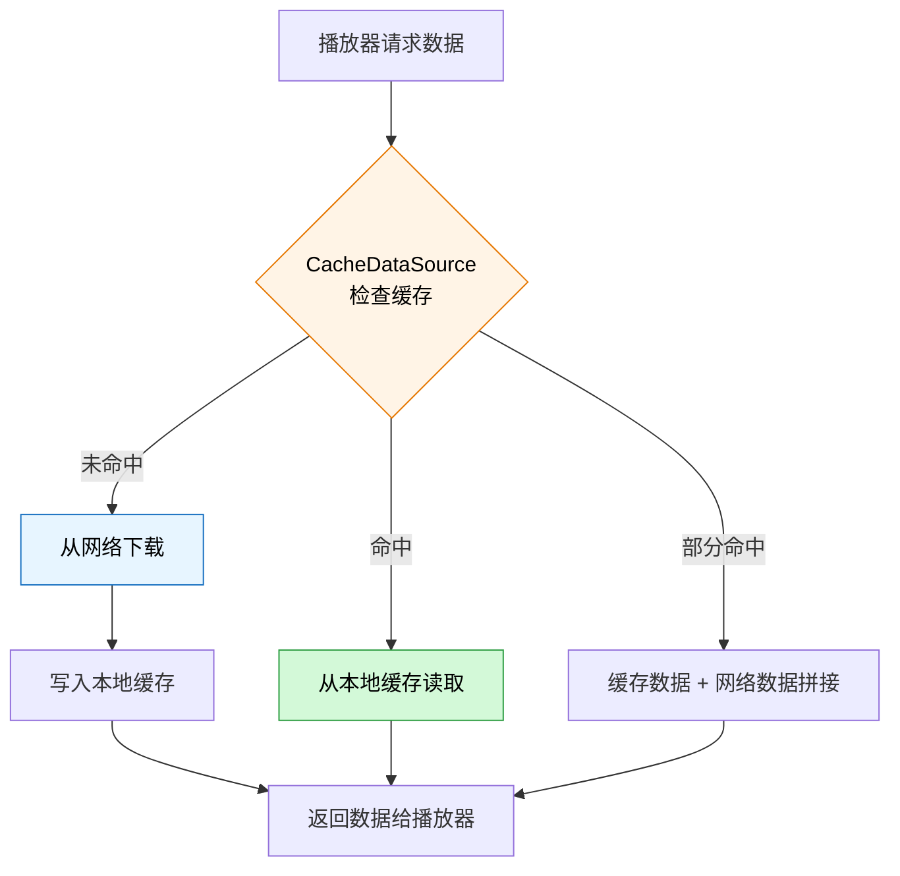
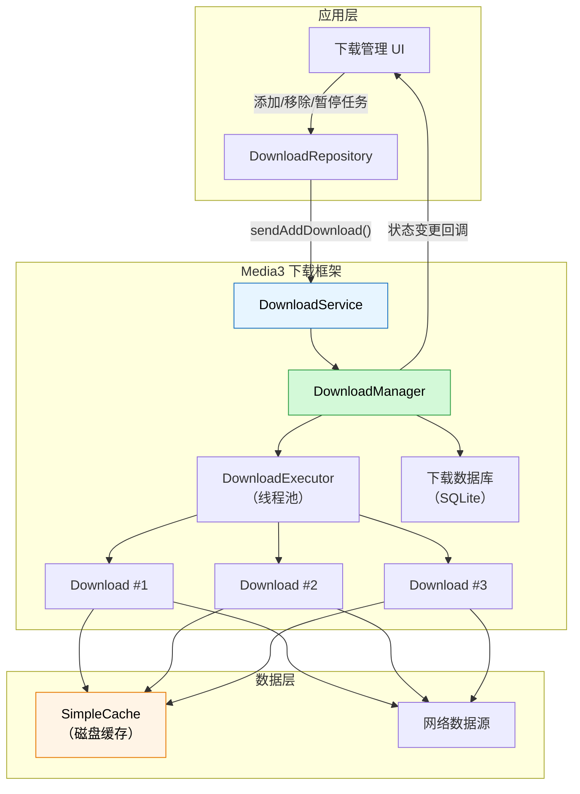
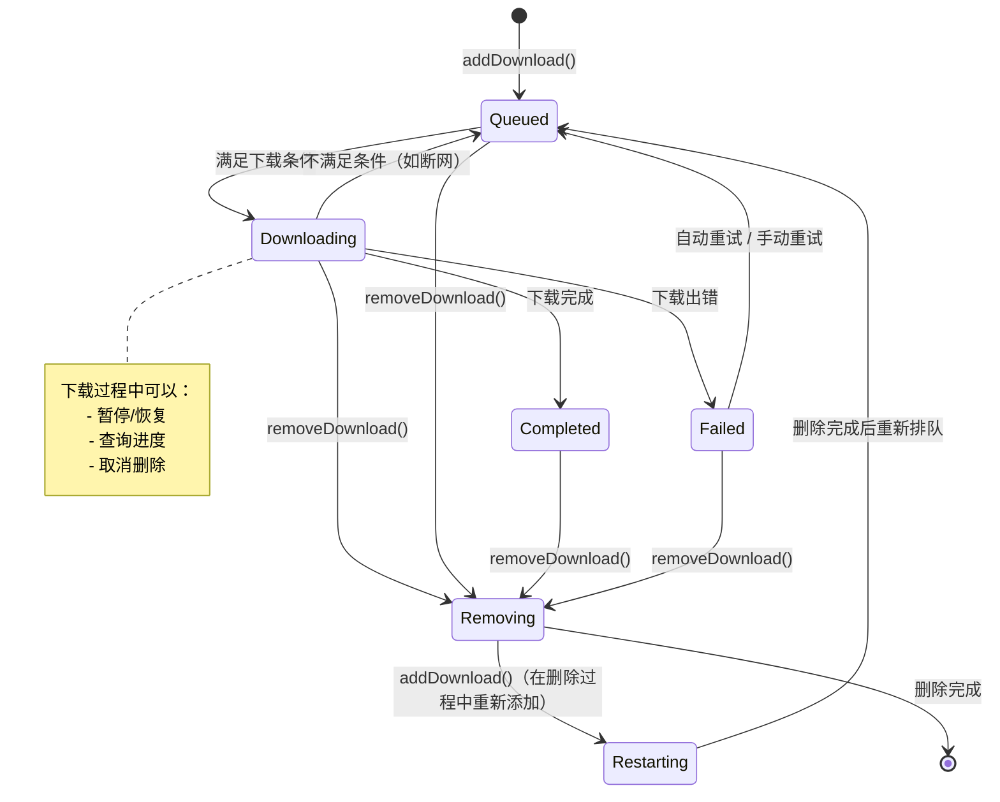
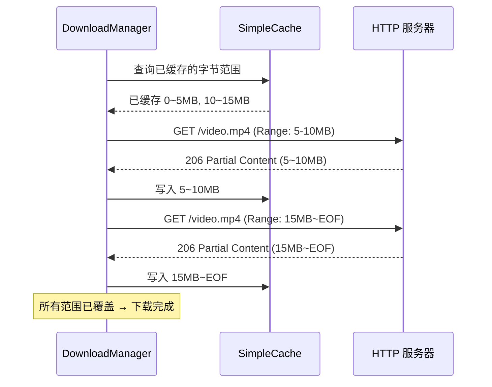
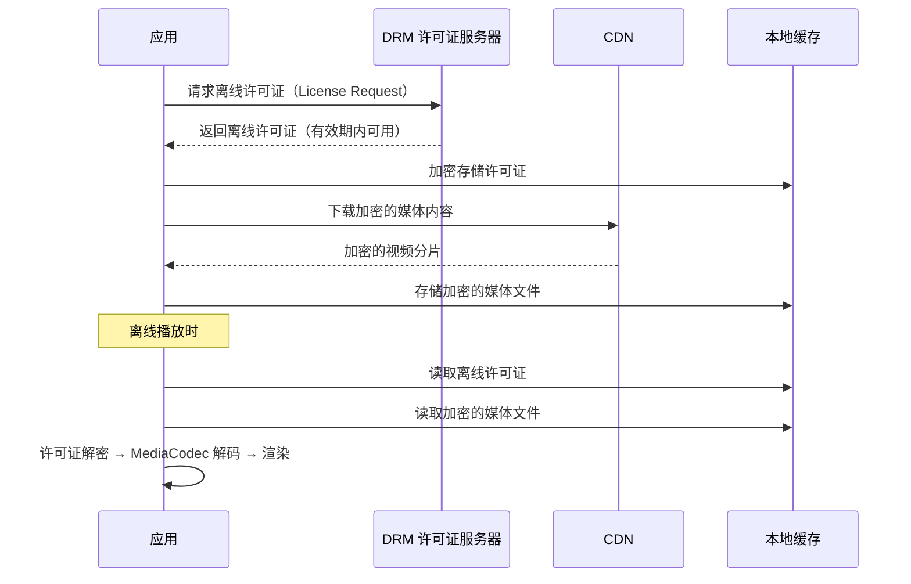

# 缓存与离线播放

## 边播边缓存

### Media3 CacheDataSource 配置

边播边缓存是视频播放中最常用的优化手段，用户观看过的内容会自动缓存到本地，再次观看时直接从磁盘读取，节省带宽和首帧时间。

**缓存命中流程：**



**完整配置代码：**

```kotlin
import androidx.media3.database.StandaloneDatabaseProvider
import androidx.media3.datasource.DefaultHttpDataSource
import androidx.media3.datasource.cache.CacheDataSource
import androidx.media3.datasource.cache.LeastRecentlyUsedCacheEvictor
import androidx.media3.datasource.cache.SimpleCache
import java.io.File

/**
 * 视频缓存管理器（全局单例）
 * 负责 SimpleCache 初始化和 CacheDataSource.Factory 的创建
 */
object VideoCacheManager {

    private var cache: SimpleCache? = null
    private const val MAX_CACHE_SIZE = 500L * 1024 * 1024 // 500MB

    /**
     * 初始化缓存（在 Application.onCreate 中调用）
     */
    @Synchronized
    fun init(context: Context) {
        if (cache != null) return

        val cacheDir = File(context.cacheDir, "video_cache")
        if (!cacheDir.exists()) cacheDir.mkdirs()

        val databaseProvider = StandaloneDatabaseProvider(context)
        val cacheEvictor = LeastRecentlyUsedCacheEvictor(MAX_CACHE_SIZE)

        cache = SimpleCache(cacheDir, cacheEvictor, databaseProvider)
    }

    /**
     * 创建带缓存的 DataSource 工厂
     */
    fun createCacheDataSourceFactory(context: Context): CacheDataSource.Factory {
        val simpleCache = cache ?: throw IllegalStateException("请先调用 init()")

        // 上游数据源：网络
        val httpDataSourceFactory = DefaultHttpDataSource.Factory()
            .setConnectTimeoutMs(8_000)
            .setReadTimeoutMs(8_000)
            .setAllowCrossProtocolRedirects(true)

        return CacheDataSource.Factory()
            .setCache(simpleCache)
            .setUpstreamDataSourceFactory(httpDataSourceFactory)
            .setCacheWriteDataSinkFactory(
                CacheDataSink.Factory()
                    .setCache(simpleCache)
                    .setFragmentSize(CacheDataSink.DEFAULT_FRAGMENT_SIZE)
            )
            .setFlags(CacheDataSource.FLAG_IGNORE_CACHE_ON_ERROR) // 缓存出错时回退到网络
    }

    /**
     * 获取缓存实例（供 DownloadManager 使用）
     */
    fun getCache(): SimpleCache = cache ?: throw IllegalStateException("请先调用 init()")

    /**
     * 获取当前缓存大小（字节）
     */
    fun getCacheSize(): Long = cache?.cacheSpace ?: 0L

    /**
     * 清空所有缓存
     */
    @Synchronized
    fun clearAll() {
        cache?.keys?.toList()?.forEach { key ->
            cache?.removeResource(key)
        }
    }

    /**
     * 释放缓存（在 Application.onTerminate 或不再需要时调用）
     */
    @Synchronized
    fun release() {
        cache?.release()
        cache = null
    }
}

// 在 ExoPlayer 中使用
val cacheDataSourceFactory = VideoCacheManager.createCacheDataSourceFactory(context)

val player = ExoPlayer.Builder(context)
    .setMediaSourceFactory(
        DefaultMediaSourceFactory(cacheDataSourceFactory)
    )
    .build()
```

### SimpleCache 使用与注意事项

`SimpleCache` 是 Media3 提供的磁盘缓存实现，使用时需特别注意以下几点：

| 注意事项 | 说明 | 解决方案 |
|----------|------|----------|
| **全局单例** | 同一个缓存目录只能创建一个 SimpleCache 实例 | 使用 `object` 或依赖注入确保单例 |
| **线程安全** | SimpleCache 内部已做同步，但初始化需防止并发 | `@Synchronized` 保护初始化逻辑 |
| **进程安全** | 多进程不能共享同一个 SimpleCache | 每个进程使用独立缓存目录 |
| **异常恢复** | 缓存文件损坏时需要能自动恢复 | 设置 `FLAG_IGNORE_CACHE_ON_ERROR` |
| **缓存键** | 默认以 URI 作为缓存键 | 动态 URL（带 token）需自定义 CacheKeyFactory |

**自定义缓存键（处理动态 URL）：**

```kotlin
/**
 * 自定义缓存键工厂
 * 对于带签名/token 的 URL，需要剥离动态参数以保证缓存命中
 */
class StableCacheKeyFactory : CacheKeyFactory {
    override fun buildCacheKey(dataSpec: DataSpec): String {
        val uri = dataSpec.uri
        // 去除 URL 中的签名参数，只保留路径作为缓存键
        val stableUri = uri.buildUpon()
            .clearQuery()
            .build()
        return stableUri.toString()
    }
}

// 使用自定义缓存键
val cacheDataSourceFactory = CacheDataSource.Factory()
    .setCache(cache)
    .setUpstreamDataSourceFactory(httpDataSourceFactory)
    .setCacheKeyFactory(StableCacheKeyFactory())
```

### 缓存目录与大小管理

```kotlin
/**
 * 缓存目录管理工具
 */
object CacheDirectoryManager {

    /**
     * 获取推荐的缓存目录
     * 优先使用外部存储（容量大），失败回退到内部存储
     */
    fun getPreferredCacheDir(context: Context): File {
        val externalCacheDir = context.externalCacheDir
        val cacheDir = if (externalCacheDir != null && isStorageWritable()) {
            File(externalCacheDir, "video_cache")
        } else {
            File(context.cacheDir, "video_cache")
        }

        if (!cacheDir.exists()) cacheDir.mkdirs()
        return cacheDir
    }

    /**
     * 计算缓存目录实际占用空间
     */
    fun calculateDirSize(dir: File): Long {
        if (!dir.exists()) return 0
        return dir.walkTopDown()
            .filter { it.isFile }
            .sumOf { it.length() }
    }

    /**
     * 检查可用存储空间是否充足
     */
    fun hasEnoughSpace(dir: File, requiredBytes: Long): Boolean {
        val stat = StatFs(dir.absolutePath)
        val availableBytes = stat.availableBlocksLong * stat.blockSizeLong
        return availableBytes > requiredBytes
    }

    private fun isStorageWritable(): Boolean {
        return Environment.getExternalStorageState() == Environment.MEDIA_MOUNTED
    }
}
```

---

## 离线下载管理

### DownloadManager / DownloadService 架构

Media3 提供了完整的离线下载框架，核心组件包括 `DownloadManager`、`DownloadService` 和 `DownloadHelper`。



**DownloadService 实现：**

```kotlin
import androidx.media3.exoplayer.offline.DownloadService
import androidx.media3.exoplayer.offline.DownloadNotificationHelper

/**
 * 视频离线下载服务
 */
class VideoDownloadService : DownloadService(
    FOREGROUND_NOTIFICATION_ID,
    DEFAULT_FOREGROUND_NOTIFICATION_UPDATE_INTERVAL,
    DOWNLOAD_NOTIFICATION_CHANNEL_ID,
    R.string.download_channel_name,
    R.string.download_channel_description
) {
    companion object {
        private const val FOREGROUND_NOTIFICATION_ID = 1001
        private const val DOWNLOAD_NOTIFICATION_CHANNEL_ID = "video_download"
    }

    override fun getDownloadManager(): DownloadManager {
        return VideoDownloadManagerHolder.getInstance(this)
    }

    override fun getScheduler(): Scheduler? {
        // 使用 WorkManager 在网络恢复时自动重试
        return PlatformScheduler(this, JOB_ID)
    }

    override fun getForegroundNotification(
        downloads: MutableList<Download>,
        notMetRequirements: Int
    ): Notification {
        return VideoDownloadManagerHolder
            .getNotificationHelper(this)
            .buildProgressNotification(
                this,
                R.drawable.ic_download,
                null, // contentIntent
                null, // message
                downloads,
                notMetRequirements
            )
    }
}

/**
 * DownloadManager 持有者（全局单例）
 */
object VideoDownloadManagerHolder {

    private var downloadManager: DownloadManager? = null
    private var notificationHelper: DownloadNotificationHelper? = null

    @Synchronized
    fun getInstance(context: Context): DownloadManager {
        if (downloadManager == null) {
            val cache = VideoCacheManager.getCache()
            val databaseProvider = StandaloneDatabaseProvider(context)
            val dataSourceFactory = DefaultHttpDataSource.Factory()

            downloadManager = DownloadManager(
                context,
                databaseProvider,
                cache,
                dataSourceFactory,
                Executors.newFixedThreadPool(3) // 最多 3 个并行下载
            ).apply {
                maxParallelDownloads = 3
                requirements = Requirements(Requirements.NETWORK) // 需要网络
            }
        }
        return downloadManager!!
    }

    @Synchronized
    fun getNotificationHelper(context: Context): DownloadNotificationHelper {
        if (notificationHelper == null) {
            notificationHelper = DownloadNotificationHelper(
                context,
                "video_download"
            )
        }
        return notificationHelper!!
    }
}
```

**AndroidManifest 注册：**

```xml
<service
    android:name=".download.VideoDownloadService"
    android:exported="false"
    android:foregroundServiceType="dataSync">
    <intent-filter>
        <action android:name="androidx.media3.exoplayer.downloadService.action.INIT" />
        <action android:name="androidx.media3.exoplayer.downloadService.action.ADD" />
        <action android:name="androidx.media3.exoplayer.downloadService.action.REMOVE" />
        <action android:name="androidx.media3.exoplayer.downloadService.action.RESUME" />
        <action android:name="androidx.media3.exoplayer.downloadService.action.PAUSE" />
        <action android:name="androidx.media3.exoplayer.downloadService.action.SET_REQUIREMENTS" />
    </intent-filter>
</service>
```

### 下载任务生命周期



**下载任务状态说明：**

| 状态常量 | 值 | 说明 |
|----------|------|------|
| `Download.STATE_QUEUED` | 0 | 已加入队列，等待下载 |
| `Download.STATE_STOPPED` | 1 | 已暂停 |
| `Download.STATE_DOWNLOADING` | 2 | 正在下载中 |
| `Download.STATE_COMPLETED` | 3 | 下载完成 |
| `Download.STATE_FAILED` | 4 | 下载失败 |
| `Download.STATE_REMOVING` | 5 | 正在删除 |
| `Download.STATE_RESTARTING` | 7 | 删除过程中被重新添加 |

### 下载进度监听与 UI 集成

```kotlin
import androidx.media3.exoplayer.offline.Download
import androidx.media3.exoplayer.offline.DownloadManager
import kotlinx.coroutines.flow.MutableStateFlow
import kotlinx.coroutines.flow.StateFlow

/**
 * 下载状态数据类
 */
data class DownloadState(
    val contentId: String,
    val state: Int = Download.STATE_QUEUED,
    val percentDownloaded: Float = 0f,
    val bytesDownloaded: Long = 0L,
    val totalBytes: Long = C.LENGTH_UNSET.toLong(),
    val failureReason: Int = Download.FAILURE_REASON_NONE
)

/**
 * 下载任务仓库
 * 封装 Media3 DownloadService 的调用，提供 Flow 驱动的 UI 状态
 */
class DownloadRepository(private val context: Context) {

    private val _downloads = MutableStateFlow<Map<String, DownloadState>>(emptyMap())
    val downloads: StateFlow<Map<String, DownloadState>> = _downloads

    private val downloadManager = VideoDownloadManagerHolder.getInstance(context)

    init {
        // 监听下载状态变化
        downloadManager.addListener(object : DownloadManager.Listener {
            override fun onDownloadChanged(
                downloadManager: DownloadManager,
                download: Download,
                finalException: Exception?
            ) {
                updateDownloadState(download)
            }

            override fun onDownloadRemoved(
                downloadManager: DownloadManager,
                download: Download
            ) {
                _downloads.value = _downloads.value - download.request.id
            }
        })

        // 加载已有下载任务
        loadExistingDownloads()
    }

    /**
     * 添加下载任务
     */
    fun addDownload(contentId: String, uri: String, title: String) {
        val downloadRequest = DownloadRequest.Builder(contentId, Uri.parse(uri))
            .setData(title.toByteArray()) // 额外数据（标题等）
            .build()

        DownloadService.sendAddDownload(
            context,
            VideoDownloadService::class.java,
            downloadRequest,
            false // 不在前台
        )
    }

    /** 暂停下载 */
    fun pauseDownload(contentId: String) {
        DownloadService.sendSetStopReason(
            context,
            VideoDownloadService::class.java,
            contentId,
            1, // 非 0 的 stopReason 表示暂停
            false
        )
    }

    /** 恢复下载 */
    fun resumeDownload(contentId: String) {
        DownloadService.sendSetStopReason(
            context,
            VideoDownloadService::class.java,
            contentId,
            Download.STOP_REASON_NONE,
            false
        )
    }

    /** 删除下载 */
    fun removeDownload(contentId: String) {
        DownloadService.sendRemoveDownload(
            context,
            VideoDownloadService::class.java,
            contentId,
            false
        )
    }

    private fun updateDownloadState(download: Download) {
        val state = DownloadState(
            contentId = download.request.id,
            state = download.state,
            percentDownloaded = download.percentDownloaded,
            bytesDownloaded = download.bytesDownloaded,
            totalBytes = download.contentLength,
            failureReason = download.failureReason
        )
        _downloads.value = _downloads.value + (download.request.id to state)
    }

    private fun loadExistingDownloads() {
        val cursor = downloadManager.downloadIndex.getDownloads()
        val map = mutableMapOf<String, DownloadState>()
        while (cursor.moveToNext()) {
            val download = cursor.download
            map[download.request.id] = DownloadState(
                contentId = download.request.id,
                state = download.state,
                percentDownloaded = download.percentDownloaded,
                bytesDownloaded = download.bytesDownloaded,
                totalBytes = download.contentLength
            )
        }
        cursor.close()
        _downloads.value = map
    }
}
```

**UI 层集成（Compose 示例）：**

```kotlin
@Composable
fun DownloadItemView(
    state: DownloadState,
    onPause: () -> Unit,
    onResume: () -> Unit,
    onRemove: () -> Unit
) {
    Row(
        modifier = Modifier.fillMaxWidth().padding(16.dp),
        verticalAlignment = Alignment.CenterVertically
    ) {
        Column(modifier = Modifier.weight(1f)) {
            Text(text = state.contentId, style = MaterialTheme.typography.bodyLarge)

            when (state.state) {
                Download.STATE_DOWNLOADING -> {
                    LinearProgressIndicator(
                        progress = { state.percentDownloaded / 100f },
                        modifier = Modifier.fillMaxWidth().padding(top = 4.dp)
                    )
                    Text(
                        text = "%.1f%% · %s".format(
                            state.percentDownloaded,
                            formatBytes(state.bytesDownloaded)
                        ),
                        style = MaterialTheme.typography.bodySmall
                    )
                }
                Download.STATE_COMPLETED -> Text("已完成", color = Color.Green)
                Download.STATE_FAILED -> Text("下载失败", color = Color.Red)
                Download.STATE_QUEUED -> Text("等待中...")
                Download.STATE_STOPPED -> Text("已暂停")
            }
        }

        // 操作按钮
        when (state.state) {
            Download.STATE_DOWNLOADING ->
                IconButton(onClick = onPause) { Icon(Icons.Default.Pause, "暂停") }
            Download.STATE_STOPPED, Download.STATE_FAILED ->
                IconButton(onClick = onResume) { Icon(Icons.Default.PlayArrow, "恢复") }
        }
        IconButton(onClick = onRemove) { Icon(Icons.Default.Delete, "删除") }
    }
}

private fun formatBytes(bytes: Long): String = when {
    bytes < 1024 -> "$bytes B"
    bytes < 1024 * 1024 -> "%.1f KB".format(bytes / 1024f)
    bytes < 1024 * 1024 * 1024 -> "%.1f MB".format(bytes / (1024f * 1024f))
    else -> "%.2f GB".format(bytes / (1024f * 1024f * 1024f))
}
```

### 断点续传实现

Media3 的 `DownloadManager` 内置了断点续传支持，其原理是：

1. **分片下载**：每次下载以 `CacheDataSink.DEFAULT_FRAGMENT_SIZE`（默认 5MB）为单位写入缓存文件。
2. **进度持久化**：下载进度保存在 SQLite 数据库中，包含已下载的字节范围。
3. **恢复机制**：重新启动下载时，`CacheDataSource` 检查已缓存的数据范围，通过 HTTP Range 请求只下载缺失部分。



**确保断点续传正常工作的关键配置：**

```kotlin
// 1. 服务端必须支持 Range 请求（返回 206 Partial Content）
// 2. URL 需要保持稳定（或使用自定义 CacheKeyFactory）
// 3. Content-Length 不能变化

val httpDataSourceFactory = DefaultHttpDataSource.Factory()
    .setDefaultRequestProperties(mapOf(
        "Accept-Encoding" to "identity" // 禁用压缩，确保 Range 请求正常
    ))
```

---

## 加密缓存

### 缓存文件加密方案

默认情况下，Media3 缓存文件以明文存储在磁盘上，对于版权敏感内容需要加密保护。

**方案一：AES 加密 DataSink/DataSource**

```kotlin
import javax.crypto.Cipher
import javax.crypto.CipherInputStream
import javax.crypto.CipherOutputStream
import javax.crypto.spec.IvParameterSpec
import javax.crypto.spec.SecretKeySpec

/**
 * 加密缓存 DataSink
 * 在写入磁盘前对数据进行 AES 加密
 */
class EncryptedCacheDataSink(
    private val cache: Cache,
    private val secretKey: ByteArray // 16/24/32 字节的 AES 密钥
) : DataSink {

    private var cipher: Cipher? = null
    private var outputStream: CipherOutputStream? = null
    private var dataSpec: DataSpec? = null
    private val iv = ByteArray(16) // 在实际项目中应为每个文件生成随机 IV

    override fun open(dataSpec: DataSpec) {
        this.dataSpec = dataSpec
        val keySpec = SecretKeySpec(secretKey, "AES")
        val ivSpec = IvParameterSpec(iv)
        cipher = Cipher.getInstance("AES/CBC/PKCS5Padding").apply {
            init(Cipher.ENCRYPT_MODE, keySpec, ivSpec)
        }
        // 获取缓存文件的输出流并包装加密层
        val cacheOutputStream = cache.startReadWriteNonBlocking(
            dataSpec.key ?: dataSpec.uri.toString(),
            dataSpec.position,
            dataSpec.length
        )
        // 实际实现需要更完整的 Cache 写入逻辑
    }

    override fun write(buffer: ByteArray, offset: Int, length: Int) {
        outputStream?.write(buffer, offset, length)
    }

    override fun close() {
        outputStream?.close()
    }
}
```

**方案二：使用 Android Keystore + 文件级加密（推荐）**

```kotlin
import androidx.security.crypto.EncryptedFile
import androidx.security.crypto.MasterKeys

/**
 * 基于 Jetpack Security 的缓存加密管理
 * 适用于小文件（DRM 许可证、密钥文件等）
 * 大文件建议使用流式 AES 加密
 */
object SecureCacheManager {

    private val masterKeyAlias = MasterKeys.getOrCreate(MasterKeys.AES256_GCM_SPEC)

    fun writeEncrypted(context: Context, fileName: String, data: ByteArray) {
        val file = File(context.filesDir, "secure_cache/$fileName")
        file.parentFile?.mkdirs()
        if (file.exists()) file.delete()

        val encryptedFile = EncryptedFile.Builder(
            file,
            context,
            masterKeyAlias,
            EncryptedFile.FileEncryptionScheme.AES256_GCM_HKDF_4KB
        ).build()

        encryptedFile.openFileOutput().use { it.write(data) }
    }

    fun readEncrypted(context: Context, fileName: String): ByteArray? {
        val file = File(context.filesDir, "secure_cache/$fileName")
        if (!file.exists()) return null

        val encryptedFile = EncryptedFile.Builder(
            file,
            context,
            masterKeyAlias,
            EncryptedFile.FileEncryptionScheme.AES256_GCM_HKDF_4KB
        ).build()

        return encryptedFile.openFileInput().use { it.readBytes() }
    }
}
```

### 与 DRM 离线许可证的配合

对于 Widevine DRM 保护的内容，离线播放需要同时下载媒体数据和 DRM 离线许可证：



```kotlin
import androidx.media3.exoplayer.drm.DefaultDrmSessionManager
import androidx.media3.exoplayer.drm.OfflineLicenseHelper

/**
 * DRM 离线许可证管理器
 */
class DrmOfflineManager(private val context: Context) {

    private val licenseUrl = "https://drm.example.com/license"

    /**
     * 下载离线许可证
     * @return 许可证密钥 ID（用于后续离线播放和许可证续期）
     */
    suspend fun downloadLicense(contentUri: String): ByteArray? {
        return withContext(Dispatchers.IO) {
            try {
                val httpDataSourceFactory = DefaultHttpDataSource.Factory()
                val drmCallback = HttpMediaDrmCallback(licenseUrl, httpDataSourceFactory)
                val offlineLicenseHelper = OfflineLicenseHelper.newWidevineInstance(
                    licenseUrl,
                    httpDataSourceFactory,
                    DrmSessionEventListener.EventDispatcher()
                )

                val keySetId = offlineLicenseHelper.downloadLicense(
                    DefaultDrmSessionManager.Builder()
                        .build(drmCallback)
                        .also { /* 配置 */ },
                    // DrmInitData 从媒体清单获取
                )

                // 加密存储许可证 ID
                SecureCacheManager.writeEncrypted(
                    context,
                    "drm_license_${contentUri.hashCode()}",
                    keySetId
                )

                offlineLicenseHelper.release()
                keySetId
            } catch (e: Exception) {
                null
            }
        }
    }

    /**
     * 使用离线许可证播放
     */
    fun buildOfflineDrmMediaSource(contentUri: String): MediaSource? {
        val keySetId = SecureCacheManager.readEncrypted(
            context,
            "drm_license_${contentUri.hashCode()}"
        ) ?: return null

        val mediaItem = MediaItem.Builder()
            .setUri(contentUri)
            .setDrmConfiguration(
                MediaItem.DrmConfiguration.Builder(C.WIDEVINE_UUID)
                    .setKeySetId(keySetId)
                    .build()
            )
            .build()

        return DefaultMediaSourceFactory(
            VideoCacheManager.createCacheDataSourceFactory(context)
        ).createMediaSource(mediaItem)
    }
}
```

---

## 存储空间管理

### 缓存淘汰策略（LRU / 基于时间 / 基于大小）

Media3 内置 `LeastRecentlyUsedCacheEvictor`，但在实际项目中可能需要更灵活的淘汰策略：

| 策略 | 说明 | 优点 | 缺点 | 适用场景 |
|------|------|------|------|----------|
| **LRU** | 淘汰最近最少访问的内容 | 保留热门内容 | 不考虑内容大小和时效性 | 通用场景 |
| **基于时间** | 淘汰超过指定天数的内容 | 内容时效性好 | 可能淘汰常访问的旧内容 | 新闻/短视频 |
| **基于大小** | 当超过阈值时淘汰最大的文件 | 快速释放空间 | 可能淘汰高频但大的内容 | 存储紧张 |
| **混合策略** | 综合时间 + 访问频率 + 大小 | 平衡各维度 | 实现复杂 | 大型应用 |

```kotlin
/**
 * 自定义混合淘汰策略
 * 结合 LRU + 时间过期 + 存储水位线
 */
class HybridCacheEvictor(
    private val maxCacheSize: Long,
    private val maxAge: Long = 7 * 24 * 3600 * 1000L, // 默认 7 天
    private val lowWatermark: Float = 0.8f // 淘汰到 80%
) : CacheEvictor {

    private val lruEvictor = LeastRecentlyUsedCacheEvictor(maxCacheSize)

    override fun requiresCacheSpanTouches(): Boolean = true

    override fun onCacheInitialized() {
        lruEvictor.onCacheInitialized()
    }

    override fun onStartFile(cache: Cache, key: String, position: Long, length: Long) {
        // 写入前检查是否需要淘汰
        evictIfNeeded(cache)
        lruEvictor.onStartFile(cache, key, position, length)
    }

    override fun onSpanAdded(cache: Cache, span: CacheSpan) {
        lruEvictor.onSpanAdded(cache, span)
    }

    override fun onSpanRemoved(cache: Cache, span: CacheSpan) {
        lruEvictor.onSpanRemoved(cache, span)
    }

    override fun onSpanTouched(cache: Cache, oldSpan: CacheSpan, newSpan: CacheSpan) {
        lruEvictor.onSpanTouched(cache, oldSpan, newSpan)
    }

    private fun evictIfNeeded(cache: Cache) {
        val currentSize = cache.cacheSpace
        if (currentSize < maxCacheSize) return

        val targetSize = (maxCacheSize * lowWatermark).toLong()
        val now = System.currentTimeMillis()

        // 优先淘汰过期内容
        cache.keys.toList().forEach { key ->
            if (cache.cacheSpace <= targetSize) return

            val spans = cache.getCachedSpans(key)
            val lastTouchTime = spans.maxOfOrNull { it.lastTouchTimestamp } ?: 0
            if (now - lastTouchTime > maxAge) {
                cache.removeResource(key)
            }
        }
    }
}
```

### 磁盘用量监控与预警

```kotlin
import android.os.StatFs
import kotlinx.coroutines.*
import kotlinx.coroutines.flow.MutableStateFlow
import kotlinx.coroutines.flow.StateFlow

/**
 * 磁盘用量监控器
 * 周期性检查磁盘和缓存状态，空间不足时触发预警
 */
class DiskUsageMonitor(
    private val context: Context,
    private val cacheDir: File,
    private val scope: CoroutineScope
) {
    data class DiskStatus(
        val totalSpace: Long,
        val availableSpace: Long,
        val cacheSize: Long,
        val usagePercent: Float,
        val warningLevel: WarningLevel
    )

    enum class WarningLevel { NORMAL, LOW, CRITICAL }

    private val _status = MutableStateFlow(DiskStatus(0, 0, 0, 0f, WarningLevel.NORMAL))
    val status: StateFlow<DiskStatus> = _status

    private var monitorJob: Job? = null

    /** 低空间阈值：500MB */
    private val lowSpaceThreshold = 500L * 1024 * 1024
    /** 危险阈值：100MB */
    private val criticalSpaceThreshold = 100L * 1024 * 1024

    var onWarning: ((WarningLevel) -> Unit)? = null

    fun startMonitoring(intervalMs: Long = 30_000) {
        monitorJob?.cancel()
        monitorJob = scope.launch {
            while (isActive) {
                checkDiskUsage()
                delay(intervalMs)
            }
        }
    }

    fun stopMonitoring() {
        monitorJob?.cancel()
    }

    private fun checkDiskUsage() {
        val stat = StatFs(cacheDir.absolutePath)
        val totalSpace = stat.totalBytes
        val availableSpace = stat.availableBytes
        val cacheSize = VideoCacheManager.getCacheSize()
        val usagePercent = 1f - (availableSpace.toFloat() / totalSpace.toFloat())

        val warningLevel = when {
            availableSpace < criticalSpaceThreshold -> WarningLevel.CRITICAL
            availableSpace < lowSpaceThreshold -> WarningLevel.LOW
            else -> WarningLevel.NORMAL
        }

        val newStatus = DiskStatus(
            totalSpace, availableSpace, cacheSize, usagePercent, warningLevel
        )
        _status.value = newStatus

        if (warningLevel != WarningLevel.NORMAL) {
            onWarning?.invoke(warningLevel)
            if (warningLevel == WarningLevel.CRITICAL) {
                emergencyCleanup()
            }
        }
    }

    /**
     * 紧急清理：磁盘空间严重不足时自动释放缓存
     */
    private fun emergencyCleanup() {
        val targetFreeBytes = lowSpaceThreshold
        val currentFree = StatFs(cacheDir.absolutePath).availableBytes
        val needToFree = targetFreeBytes - currentFree
        if (needToFree <= 0) return

        // 按 LRU 顺序清理缓存
        val cache = VideoCacheManager.getCache()
        var freedBytes = 0L
        cache.keys.toList().forEach { key ->
            if (freedBytes >= needToFree) return
            val spans = cache.getCachedSpans(key)
            val size = spans.sumOf { it.length }
            cache.removeResource(key)
            freedBytes += size
        }
    }
}
```

### 用户可配置的缓存上限

```kotlin
import android.content.SharedPreferences

/**
 * 用户缓存配置管理
 * 支持用户在设置页面选择缓存上限
 */
class CacheConfigManager(private val context: Context) {

    private val prefs: SharedPreferences =
        context.getSharedPreferences("cache_config", Context.MODE_PRIVATE)

    companion object {
        private const val KEY_MAX_CACHE_SIZE = "max_cache_size"
        private const val KEY_CACHE_ON_MOBILE = "cache_on_mobile"
        private const val KEY_AUTO_CLEANUP = "auto_cleanup"

        /** 预设的缓存上限选项 */
        val CACHE_SIZE_OPTIONS = listOf(
            200L * 1024 * 1024  to "200 MB",
            500L * 1024 * 1024  to "500 MB",
            1024L * 1024 * 1024 to "1 GB",
            2048L * 1024 * 1024 to "2 GB",
            0L                  to "无限制"
        )
    }

    /** 最大缓存大小（字节），0 表示无限制 */
    var maxCacheSize: Long
        get() = prefs.getLong(KEY_MAX_CACHE_SIZE, 500L * 1024 * 1024)
        set(value) {
            prefs.edit().putLong(KEY_MAX_CACHE_SIZE, value).apply()
            onConfigChanged()
        }

    /** 是否在移动网络下缓存 */
    var cacheOnMobile: Boolean
        get() = prefs.getBoolean(KEY_CACHE_ON_MOBILE, false)
        set(value) = prefs.edit().putBoolean(KEY_CACHE_ON_MOBILE, value).apply()

    /** 是否自动清理过期缓存 */
    var autoCleanup: Boolean
        get() = prefs.getBoolean(KEY_AUTO_CLEANUP, true)
        set(value) = prefs.edit().putBoolean(KEY_AUTO_CLEANUP, value).apply()

    /**
     * 配置变更后重建缓存（需要重新初始化 SimpleCache）
     */
    private fun onConfigChanged() {
        // 通知 VideoCacheManager 重新初始化 Evictor
        // 注意：SimpleCache 不支持动态修改 Evictor
        // 需要在下次 App 启动时生效，或重新初始化 cache
    }

    /**
     * 获取缓存统计信息（用于设置页展示）
     */
    fun getCacheSummary(): CacheSummary {
        val cacheSize = VideoCacheManager.getCacheSize()
        val maxSize = maxCacheSize
        return CacheSummary(
            currentSize = cacheSize,
            maxSize = maxSize,
            usagePercent = if (maxSize > 0) cacheSize.toFloat() / maxSize else 0f,
            formattedCurrent = formatBytes(cacheSize),
            formattedMax = if (maxSize > 0) formatBytes(maxSize) else "无限制"
        )
    }

    data class CacheSummary(
        val currentSize: Long,
        val maxSize: Long,
        val usagePercent: Float,
        val formattedCurrent: String,
        val formattedMax: String
    )

    private fun formatBytes(bytes: Long): String = when {
        bytes < 1024 -> "$bytes B"
        bytes < 1024 * 1024 -> "%.1f KB".format(bytes / 1024f)
        bytes < 1024 * 1024 * 1024 -> "%.1f MB".format(bytes / (1024f * 1024f))
        else -> "%.2f GB".format(bytes / (1024f * 1024f * 1024f))
    }
}
```

---

## 踩坑记录

> 此区域供团队成员补充项目中遇到的真实案例。

| 日期 | 记录人 | 问题描述 | 解决方案 |
|------|--------|----------|----------|
| | | | |

## 参考资料

- [Media3 下载与缓存官方文档](https://developer.android.com/media/media3/exoplayer/downloading-media)
- [Media3 CacheDataSource API](https://developer.android.com/reference/androidx/media3/datasource/cache/CacheDataSource)
- [Media3 DownloadService 指南](https://developer.android.com/media/media3/exoplayer/downloading-media#download-service)
- [Jetpack Security - EncryptedFile](https://developer.android.com/topic/security/data)
- [Widevine DRM 离线播放](https://developer.android.com/media/media3/exoplayer/drm#offline)
- [ExoPlayer GitHub - 缓存示例](https://github.com/androidx/media/tree/release/demos)
- [Android Storage Best Practices](https://developer.android.com/training/data-storage)
