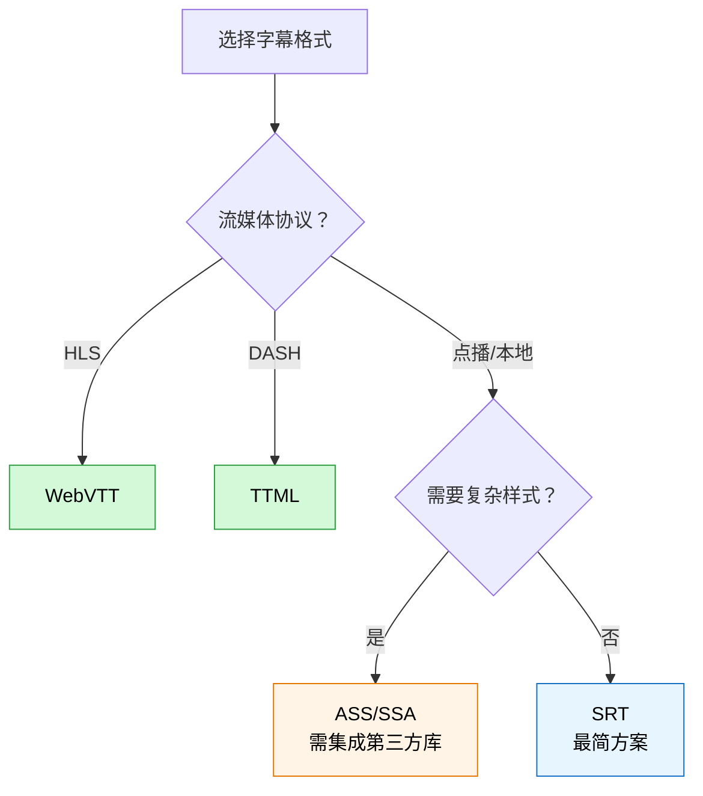
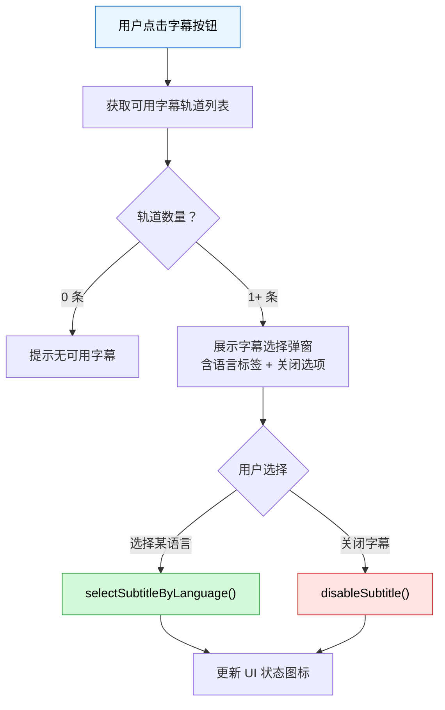
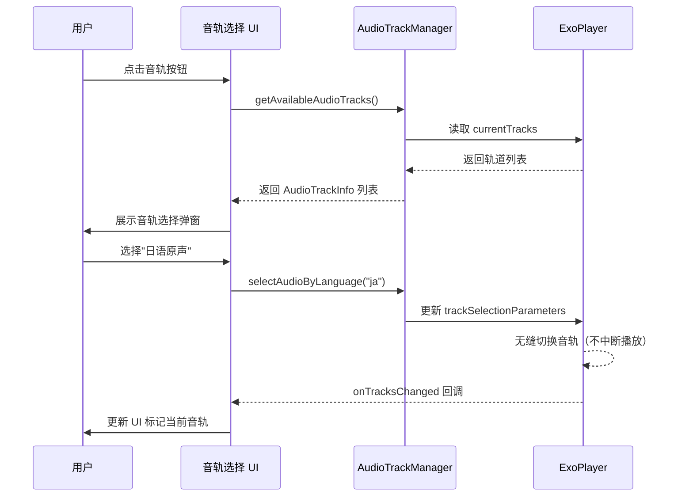
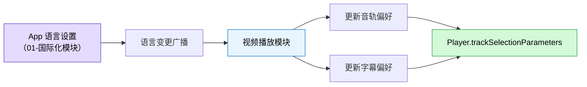
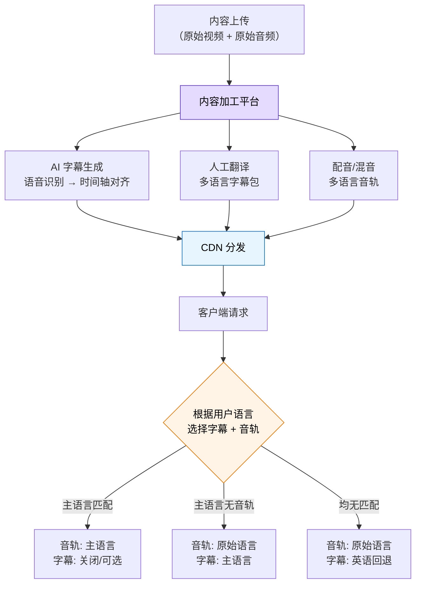

# 字幕与多音轨

字幕和多音轨是视频播放中不可或缺的能力，直接影响国际化覆盖率和无障碍体验。本文覆盖字幕格式选型、Media3 中的加载与渲染实践、多音轨管理，以及与国际化模块的联动策略。

## 字幕格式

### SRT

SRT（SubRip Text）是最简单、最广泛使用的字幕格式，纯文本结构，几乎所有播放器都支持。

**格式结构：**

```
1
00:00:01,000 --> 00:00:04,000
这是第一条字幕

2
00:00:05,000 --> 00:00:08,500
这是第二条字幕
支持多行文本
```

**特点：**

- 纯文本，体积极小，解析简单
- 不支持样式（字体、颜色、位置等）
- 时间戳精度到毫秒
- 编辑门槛低，文本编辑器即可修改

### WebVTT

WebVTT（Web Video Text Tracks）是 W3C 标准，HTML5 `<track>` 元素的原生格式，也是 Media3 推荐的字幕格式之一。

**格式结构：**

```
WEBVTT

00:00:01.000 --> 00:00:04.000
这是第一条字幕

00:00:05.000 --> 00:00:08.500 position:10% align:start
<b>加粗文本</b>
<i>斜体文本</i>
```

**特点：**

- 支持基本样式标签（`<b>`, `<i>`, `<u>`）
- 支持 CSS 样式和定位（position / align / line）
- HLS 流的标准字幕格式
- 与 Web 生态无缝衔接

### ASS / SSA

ASS（Advanced SubStation Alpha）是 SSA 的增强版，支持极丰富的特效，在动漫和字幕组领域广泛使用。

**格式结构：**

```
[Script Info]
ScriptType: v4.00+
PlayResX: 1920
PlayResY: 1080

[V4+ Styles]
Format: Name, Fontname, Fontsize, PrimaryColour, ...
Style: Default,Microsoft YaHei,48,&H00FFFFFF,...

[Events]
Format: Layer, Start, End, Style, Name, MarginL, MarginR, MarginV, Effect, Text
Dialogue: 0,0:00:01.00,0:00:04.00,Default,,0,0,0,,这是一条字幕
Dialogue: 0,0:00:05.00,0:00:08.00,Default,,0,0,0,,{\pos(960,800)}定位字幕
```

**特点：**

- 支持复杂样式（字体、颜色、描边、阴影、渐变）
- 支持动画特效（移动、旋转、淡入淡出）
- 可精确控制字幕位置
- 文件体积较大，解析复杂度高
- Media3 原生不支持，需要第三方库（如 `SubtitleCollapsingTextViewLibrary` 或自定义解析器）

### TTML

TTML（Timed Text Markup Language）是基于 XML 的 W3C 标准，主要用于广播和 DASH 流媒体。

**格式结构：**

```xml
<?xml version="1.0" encoding="UTF-8"?>
<tt xmlns="http://www.w3.org/ns/ttml"
    xmlns:tts="http://www.w3.org/ns/ttml#styling">
  <head>
    <styling>
      <style xml:id="s1" tts:color="white" tts:fontSize="24px"/>
    </styling>
  </head>
  <body>
    <div>
      <p begin="00:00:01.000" end="00:00:04.000" style="s1">
        这是第一条字幕
      </p>
    </div>
  </body>
</tt>
```

**特点：**

- 基于 XML，结构化强，适合自动化处理
- 支持丰富样式和区域定位
- DASH 流的标准字幕格式
- 文件体积较大
- Media3 原生支持

### 格式对比与选型建议

| 特性 | SRT | WebVTT | ASS/SSA | TTML |
|------|-----|--------|---------|------|
| 样式支持 | ❌ 无 | ✅ 基本 | ✅ 丰富 | ✅ 丰富 |
| 定位能力 | ❌ | ✅ | ✅ 精确 | ✅ |
| 特效动画 | ❌ | ❌ | ✅ | ❌ |
| 文件体积 | 极小 | 小 | 中等 | 较大 |
| Media3 原生支持 | ✅ | ✅ | ❌ | ✅ |
| 主要使用场景 | 通用字幕 | HLS 流 | 动漫/字幕组 | DASH 流/广播 |
| 解析复杂度 | 低 | 低 | 高 | 中 |
| 编辑友好度 | ⭐⭐⭐ | ⭐⭐⭐ | ⭐ | ⭐⭐ |

**选型建议：**



> **团队推荐**：优先使用 WebVTT，兼顾 HLS 兼容性和样式能力；DASH 场景使用 TTML；仅在无样式需求时使用 SRT。

## 字幕加载与集成

### 内嵌字幕（MKV / MP4 封装）

当字幕轨道直接封装在 MKV 或 MP4 容器中时，Media3 会自动检测并提供轨道信息，无需额外配置。

```kotlin
// 内嵌字幕无需特殊处理，Media3 自动解析容器中的字幕轨
val player = ExoPlayer.Builder(context).build()

val mediaItem = MediaItem.fromUri("https://example.com/video-with-subs.mkv")
player.setMediaItem(mediaItem)
player.prepare()

// 监听轨道信息，获取内嵌字幕列表
player.addListener(object : Player.Listener {
    override fun onTracksChanged(tracks: Tracks) {
        for (group in tracks.groups) {
            if (group.type == C.TRACK_TYPE_TEXT) {
                for (i in 0 until group.length) {
                    val format = group.getTrackFormat(i)
                    Log.d("Subtitle", "内嵌字幕: ${format.language} - ${format.label}")
                }
            }
        }
    }
})
```

### 外挂字幕文件加载（SideLoadedMediaSource）

外挂字幕是将字幕文件与视频分开存储，通过 `MediaItem.SubtitleConfiguration` 关联到播放源。

```kotlin
// 构建带外挂字幕的 MediaItem
val subtitle = MediaItem.SubtitleConfiguration.Builder(
    Uri.parse("file:///sdcard/Movies/subtitle_zh.srt")
)
    .setMimeType(MimeTypes.APPLICATION_SUBRIP)    // SRT 格式
    .setLanguage("zh")                             // 字幕语言
    .setLabel("中文字幕")                           // 显示标签
    .setSelectionFlags(C.SELECTION_FLAG_DEFAULT)    // 设为默认选中
    .build()

val mediaItem = MediaItem.Builder()
    .setUri("https://example.com/video.mp4")
    .setSubtitleConfigurations(listOf(subtitle))
    .build()

player.setMediaItem(mediaItem)
player.prepare()
```

**支持的 MIME 类型：**

| 格式 | MIME 类型常量 |
|------|--------------|
| SRT | `MimeTypes.APPLICATION_SUBRIP` |
| WebVTT | `MimeTypes.TEXT_VTT` |
| TTML | `MimeTypes.APPLICATION_TTML` |
| ASS/SSA | `MimeTypes.TEXT_SSA` |

### 网络字幕动态加载

从网络动态获取字幕文件，适用于字幕与视频分开管理的 CDN 架构。

```kotlin
/**
 * 根据用户选择的语言，动态构建带网络字幕的 MediaItem
 *
 * @param videoUrl 视频地址
 * @param subtitleConfigs 字幕配置列表 (语言代码 → 字幕URL)
 */
fun buildMediaItemWithRemoteSubtitles(
    videoUrl: String,
    subtitleConfigs: Map<String, String>  // "zh" -> "https://cdn.example.com/subs/zh.vtt"
): MediaItem {
    val subtitleList = subtitleConfigs.map { (lang, url) ->
        MediaItem.SubtitleConfiguration.Builder(Uri.parse(url))
            .setMimeType(MimeTypes.TEXT_VTT)
            .setLanguage(lang)
            .setLabel(Locale(lang).displayLanguage)
            .build()
    }

    return MediaItem.Builder()
        .setUri(videoUrl)
        .setSubtitleConfigurations(subtitleList)
        .build()
}

// 使用示例
val mediaItem = buildMediaItemWithRemoteSubtitles(
    videoUrl = "https://cdn.example.com/video.mp4",
    subtitleConfigs = mapOf(
        "zh" to "https://cdn.example.com/subs/zh.vtt",
        "en" to "https://cdn.example.com/subs/en.vtt",
        "ja" to "https://cdn.example.com/subs/ja.vtt"
    )
)
player.setMediaItem(mediaItem)
player.prepare()
```

### 字幕轨道选择与切换

```kotlin
/**
 * 字幕轨道管理工具类
 */
class SubtitleTrackManager(private val player: ExoPlayer) {

    /** 获取所有可用字幕轨道 */
    fun getAvailableSubtitleTracks(): List<Tracks.Group> {
        return player.currentTracks.groups.filter { it.type == C.TRACK_TYPE_TEXT }
    }

    /** 按语言选择字幕轨道 */
    fun selectSubtitleByLanguage(language: String) {
        player.trackSelectionParameters = player.trackSelectionParameters
            .buildUpon()
            .setPreferredTextLanguage(language)
            .setTrackTypeDisabled(C.TRACK_TYPE_TEXT, false)
            .build()
    }

    /** 选择指定索引的字幕轨道 */
    fun selectSubtitleByIndex(groupIndex: Int, trackIndex: Int) {
        val groups = getAvailableSubtitleTracks()
        if (groupIndex < groups.size) {
            val override = TrackSelectionOverride(
                groups[groupIndex].mediaTrackGroup,
                trackIndex
            )
            player.trackSelectionParameters = player.trackSelectionParameters
                .buildUpon()
                .setOverrideForType(override)
                .setTrackTypeDisabled(C.TRACK_TYPE_TEXT, false)
                .build()
        }
    }

    /** 关闭字幕 */
    fun disableSubtitle() {
        player.trackSelectionParameters = player.trackSelectionParameters
            .buildUpon()
            .setTrackTypeDisabled(C.TRACK_TYPE_TEXT, true)
            .build()
    }

    /** 恢复自动选择 */
    fun resetToAutoSelect() {
        player.trackSelectionParameters = player.trackSelectionParameters
            .buildUpon()
            .clearOverridesOfType(C.TRACK_TYPE_TEXT)
            .setTrackTypeDisabled(C.TRACK_TYPE_TEXT, false)
            .build()
    }
}
```

字幕轨道选择流程：



## 字幕渲染与样式自定义

### SubtitleView 配置

`SubtitleView` 是 Media3 提供的字幕渲染组件，通常嵌入 `PlayerView` 中自动工作，也可单独使用。

```xml
<!-- 在布局中单独使用 SubtitleView -->
<androidx.media3.ui.SubtitleView
    android:id="@+id/subtitle_view"
    android:layout_width="match_parent"
    android:layout_height="match_parent"
    android:layout_gravity="bottom" />
```

```kotlin
// 将 SubtitleView 与 Player 关联
val subtitleView = findViewById<SubtitleView>(R.id.subtitle_view)

// 监听字幕输出并渲染
player.addListener(object : Player.Listener {
    override fun onCues(cueGroup: CueGroup) {
        subtitleView.setCues(cueGroup.cues)
    }
})
```

### 字体、颜色、大小、背景定制

通过 `CaptionStyleCompat` 可以全面定制字幕的视觉样式。

```kotlin
import androidx.media3.ui.CaptionStyleCompat

/**
 * 应用自定义字幕样式
 *
 * @param subtitleView 字幕视图
 * @param textSizePx 文字大小（像素）
 */
fun applyCustomCaptionStyle(subtitleView: SubtitleView, textSizePx: Float) {
    val captionStyle = CaptionStyleCompat(
        Color.WHITE,                                          // 前景色（文字颜色）
        Color.parseColor("#80000000"),                        // 背景色（半透明黑）
        Color.TRANSPARENT,                                    // 窗口色
        CaptionStyleCompat.EDGE_TYPE_OUTLINE,                 // 边缘类型：描边
        Color.BLACK,                                          // 边缘颜色
        Typeface.create("sans-serif-medium", Typeface.BOLD)   // 字体
    )

    subtitleView.setStyle(captionStyle)
    subtitleView.setFixedTextSize(TypedValue.COMPLEX_UNIT_PX, textSizePx)
}

// 根据用户偏好设置应用不同的样式预设
fun applyStylePreset(subtitleView: SubtitleView, preset: SubtitlePreset) {
    when (preset) {
        SubtitlePreset.DEFAULT -> {
            subtitleView.setStyle(CaptionStyleCompat.DEFAULT)
            subtitleView.setFixedTextSize(TypedValue.COMPLEX_UNIT_SP, 16f)
        }
        SubtitlePreset.LARGE_TEXT -> {
            applyCustomCaptionStyle(subtitleView, 24f.spToPx())
        }
        SubtitlePreset.HIGH_CONTRAST -> {
            val style = CaptionStyleCompat(
                Color.YELLOW,
                Color.BLACK,
                Color.TRANSPARENT,
                CaptionStyleCompat.EDGE_TYPE_DROP_SHADOW,
                Color.BLACK,
                Typeface.DEFAULT_BOLD
            )
            subtitleView.setStyle(style)
            subtitleView.setFixedTextSize(TypedValue.COMPLEX_UNIT_SP, 20f)
        }
    }
}

enum class SubtitlePreset { DEFAULT, LARGE_TEXT, HIGH_CONTRAST }
```

**边缘类型对比：**

| 边缘类型 | 常量 | 效果 | 推荐场景 |
|----------|------|------|----------|
| 无边缘 | `EDGE_TYPE_NONE` | 纯文字无修饰 | 暗色背景视频 |
| 描边 | `EDGE_TYPE_OUTLINE` | 文字带轮廓线 | **通用推荐** |
| 投影 | `EDGE_TYPE_DROP_SHADOW` | 文字带阴影 | 高对比场景 |
| 凸起 | `EDGE_TYPE_RAISED` | 立体浮雕效果 | 特殊风格 |
| 凹陷 | `EDGE_TYPE_DEPRESSED` | 内凹效果 | 特殊风格 |

### 字幕位置调整

```kotlin
/**
 * 调整字幕显示位置
 * SubtitleView 支持通过 setBottomPaddingFraction 控制垂直位置
 */
fun adjustSubtitlePosition(subtitleView: SubtitleView, bottomFraction: Float) {
    // bottomFraction: 0.0 = 最底部，1.0 = 最顶部
    // 推荐范围 0.02 ~ 0.15
    subtitleView.setBottomPaddingFraction(bottomFraction)
}

// 不同播放场景的字幕位置策略
fun applyPositionForMode(subtitleView: SubtitleView, mode: PlaybackMode) {
    val fraction = when (mode) {
        PlaybackMode.FULLSCREEN -> 0.05f      // 全屏：略高于底部，避开控制栏
        PlaybackMode.INLINE -> 0.02f          // 内联：尽量靠底
        PlaybackMode.PIP -> 0.08f             // 画中画：更高，避免遮挡内容
    }
    subtitleView.setBottomPaddingFraction(fraction)
}
```

### 多语言字幕样式适配

不同语言的字幕可能需要不同的字体和排版策略：

```kotlin
/**
 * 根据字幕语言自动适配样式
 */
fun adaptStyleForLanguage(subtitleView: SubtitleView, language: String) {
    val typeface = when {
        language.startsWith("zh") -> Typeface.create("sans-serif", Typeface.NORMAL)
        language.startsWith("ja") -> Typeface.create("sans-serif", Typeface.NORMAL)
        language.startsWith("ko") -> Typeface.create("sans-serif", Typeface.NORMAL)
        language.startsWith("ar") || language.startsWith("he") -> {
            // RTL 语言可能需要特殊字体
            Typeface.create("sans-serif", Typeface.NORMAL)
        }
        else -> Typeface.create("sans-serif-medium", Typeface.NORMAL)
    }

    // CJK 文字通常需要稍大的字号以保证可读性
    val textSize = when {
        language.startsWith("zh") || language.startsWith("ja") || language.startsWith("ko") -> 18f
        else -> 16f
    }

    val style = CaptionStyleCompat(
        Color.WHITE,
        Color.parseColor("#80000000"),
        Color.TRANSPARENT,
        CaptionStyleCompat.EDGE_TYPE_OUTLINE,
        Color.BLACK,
        typeface
    )

    subtitleView.setStyle(style)
    subtitleView.setFixedTextSize(TypedValue.COMPLEX_UNIT_SP, textSize)
}
```

## 多音轨管理

### 音轨发现与枚举

```kotlin
/**
 * 音轨信息数据类
 */
data class AudioTrackInfo(
    val groupIndex: Int,
    val trackIndex: Int,
    val language: String?,
    val label: String?,
    val channelCount: Int,
    val sampleRate: Int,
    val mimeType: String?,
    val isSelected: Boolean,
    val roleFlags: Int
)

/**
 * 枚举所有可用音轨
 */
fun getAvailableAudioTracks(player: ExoPlayer): List<AudioTrackInfo> {
    val audioTracks = mutableListOf<AudioTrackInfo>()

    player.currentTracks.groups.forEachIndexed { groupIndex, group ->
        if (group.type == C.TRACK_TYPE_AUDIO) {
            for (trackIndex in 0 until group.length) {
                val format = group.getTrackFormat(trackIndex)
                val isSelected = group.isTrackSelected(trackIndex)
                audioTracks.add(
                    AudioTrackInfo(
                        groupIndex = groupIndex,
                        trackIndex = trackIndex,
                        language = format.language,
                        label = format.label,
                        channelCount = format.channelCount,
                        sampleRate = format.sampleRate,
                        mimeType = format.sampleMimeType,
                        isSelected = isSelected,
                        roleFlags = format.roleFlags
                    )
                )
            }
        }
    }

    return audioTracks
}
```

### 音轨切换实现

```kotlin
/**
 * 音轨切换管理器
 */
class AudioTrackManager(private val player: ExoPlayer) {

    /** 按语言切换音轨 */
    fun selectAudioByLanguage(language: String) {
        player.trackSelectionParameters = player.trackSelectionParameters
            .buildUpon()
            .setPreferredAudioLanguage(language)
            .build()
    }

    /** 按轨道索引精确切换 */
    fun selectAudioByIndex(groupIndex: Int, trackIndex: Int) {
        val audioGroups = player.currentTracks.groups
            .filter { it.type == C.TRACK_TYPE_AUDIO }

        if (groupIndex < audioGroups.size) {
            val override = TrackSelectionOverride(
                audioGroups[groupIndex].mediaTrackGroup,
                trackIndex
            )
            player.trackSelectionParameters = player.trackSelectionParameters
                .buildUpon()
                .setOverrideForType(override)
                .build()
        }
    }

    /** 获取当前选中音轨的语言 */
    fun getCurrentAudioLanguage(): String? {
        val tracks = player.currentTracks
        for (group in tracks.groups) {
            if (group.type == C.TRACK_TYPE_AUDIO) {
                for (i in 0 until group.length) {
                    if (group.isTrackSelected(i)) {
                        return group.getTrackFormat(i).language
                    }
                }
            }
        }
        return null
    }
}
```

音轨切换交互流程：



### 默认音轨选择策略（基于系统语言）

```kotlin
/**
 * 根据系统语言自动设置默认音轨和字幕
 * 建议在 Player 初始化后、prepare 之前调用
 */
fun applyDefaultTrackSelection(player: ExoPlayer, context: Context) {
    val systemLocale = context.resources.configuration.locales[0]
    val systemLanguage = systemLocale.language  // "zh", "en", "ja" 等

    // 音频偏好：系统语言 > 英语 > 任意
    // 字幕偏好：如果音频非系统语言则自动开启系统语言字幕
    player.trackSelectionParameters = player.trackSelectionParameters
        .buildUpon()
        .setPreferredAudioLanguage(systemLanguage)
        .setPreferredTextLanguage(systemLanguage)
        // 仅当音频语言与偏好不匹配时自动显示字幕
        .setPreferredTextRoleFlags(C.ROLE_FLAG_SUBTITLE)
        .build()
}

/**
 * 高级策略：监听音轨实际选择结果，决定是否自动开启字幕
 */
fun autoEnableSubtitleIfNeeded(player: ExoPlayer, preferredLanguage: String) {
    player.addListener(object : Player.Listener {
        override fun onTracksChanged(tracks: Tracks) {
            var audioMatchesPreferred = false

            for (group in tracks.groups) {
                if (group.type == C.TRACK_TYPE_AUDIO) {
                    for (i in 0 until group.length) {
                        if (group.isTrackSelected(i)) {
                            val lang = group.getTrackFormat(i).language
                            audioMatchesPreferred = (lang == preferredLanguage)
                        }
                    }
                }
            }

            // 音频语言不匹配偏好时，自动开启对应字幕
            if (!audioMatchesPreferred) {
                player.trackSelectionParameters = player.trackSelectionParameters
                    .buildUpon()
                    .setPreferredTextLanguage(preferredLanguage)
                    .setTrackTypeDisabled(C.TRACK_TYPE_TEXT, false)
                    .build()
            }
        }
    })
}
```

### 音频描述轨道（Accessibility）

音频描述（Audio Description）是为视障用户提供画面描述的特殊音轨，通过 `roleFlags` 标识。

```kotlin
/**
 * 检查并启用音频描述轨道
 */
fun enableAudioDescription(player: ExoPlayer) {
    player.trackSelectionParameters = player.trackSelectionParameters
        .buildUpon()
        .setPreferredAudioRoleFlags(C.ROLE_FLAG_DESCRIBES_VIDEO)
        .build()
}

/**
 * 判断当前内容是否包含音频描述轨道
 */
fun hasAudioDescriptionTrack(player: ExoPlayer): Boolean {
    return player.currentTracks.groups.any { group ->
        group.type == C.TRACK_TYPE_AUDIO &&
            (0 until group.length).any { i ->
                group.getTrackFormat(i).roleFlags and C.ROLE_FLAG_DESCRIBES_VIDEO != 0
            }
    }
}

// 结合无障碍设置自动开启
fun autoEnableAccessibilityAudio(player: ExoPlayer, context: Context) {
    val am = context.getSystemService(Context.ACCESSIBILITY_SERVICE) as AccessibilityManager
    if (am.isEnabled && am.isTouchExplorationEnabled) {
        if (hasAudioDescriptionTrack(player)) {
            enableAudioDescription(player)
        }
    }
}
```

## 与国际化模块联动

> 本节与 `01-国际化internationalization` 模块关联，实现字幕/音轨与 App 多语言体系的统一管理。

### 字幕语言与 App 语言同步



```kotlin
/**
 * 监听 App 语言变更并同步到播放器
 * 需配合 01-国际化 模块的语言切换机制
 */
class LanguageSyncManager(
    private val player: ExoPlayer,
    private val context: Context
) {

    /** 同步 App 当前语言到播放器偏好 */
    fun syncLanguagePreferences() {
        val appLocale = AppCompatDelegate.getApplicationLocales()[0]
            ?: context.resources.configuration.locales[0]
        val languageTag = appLocale.language

        player.trackSelectionParameters = player.trackSelectionParameters
            .buildUpon()
            .setPreferredAudioLanguage(languageTag)
            .setPreferredTextLanguage(languageTag)
            .build()
    }

    /**
     * 构建语言优先级列表
     * 例如：用户设置中文 → 优先中文 → 回退英文 → 回退任意
     */
    fun buildLanguageFallbackList(primaryLanguage: String): List<String> {
        return listOf(
            primaryLanguage,
            "en",
            "*"     // 通配符，匹配任意可用语言
        )
    }
}
```

### TTS 与字幕的配合使用场景

在无障碍场景中，TTS（Text-to-Speech）可与字幕文本配合，为不同用户群体提供内容访问能力。

| 场景 | 字幕 | 音频描述 | TTS | 说明 |
|------|------|----------|-----|------|
| 标准播放 | 可选 | — | — | 普通用户 |
| 外语内容 | ✅ 母语字幕 | — | — | 非母语音频配母语字幕 |
| 听障用户 | ✅ 必须 | — | — | 字幕是主要信息来源 |
| 视障用户 | — | ✅ 优先 | ✅ 回退 | 优先音频描述，无则 TTS 读字幕 |
| 学习场景 | ✅ 双语 | — | ✅ 可选 | 字幕 + TTS 辅助发音 |

```kotlin
/**
 * TTS 朗读当前字幕（无障碍回退方案）
 */
class SubtitleTtsReader(context: Context) {
    private val tts = TextToSpeech(context) { status ->
        if (status == TextToSpeech.SUCCESS) {
            tts.language = Locale.getDefault()
        }
    }

    fun speakCue(cueText: String) {
        tts.speak(cueText, TextToSpeech.QUEUE_FLUSH, null, "subtitle_cue")
    }

    fun stop() {
        tts.stop()
    }

    fun release() {
        tts.shutdown()
    }
}
```

### 多语言内容分发策略

在多语言内容平台中，字幕和音轨的分发需要系统性规划：



**分发策略配置示例：**

```kotlin
/**
 * 媒体内容的多语言配置
 */
data class MediaLanguageConfig(
    val videoUrl: String,
    val audioTracks: List<AudioTrackConfig>,
    val subtitleTracks: List<SubtitleTrackConfig>,
    val defaultAudioLanguage: String,
    val defaultSubtitleLanguage: String?
)

data class AudioTrackConfig(
    val language: String,
    val url: String?,     // null 表示内嵌在视频中
    val label: String,
    val isOriginal: Boolean
)

data class SubtitleTrackConfig(
    val language: String,
    val url: String,
    val format: String,   // "vtt", "srt", "ttml"
    val label: String,
    val isAutoGenerated: Boolean
)

/**
 * 根据服务端返回的语言配置构建 MediaItem
 */
fun buildMultiLanguageMediaItem(config: MediaLanguageConfig): MediaItem {
    val subtitles = config.subtitleTracks.map { track ->
        val mimeType = when (track.format) {
            "vtt" -> MimeTypes.TEXT_VTT
            "srt" -> MimeTypes.APPLICATION_SUBRIP
            "ttml" -> MimeTypes.APPLICATION_TTML
            else -> MimeTypes.TEXT_VTT
        }

        MediaItem.SubtitleConfiguration.Builder(Uri.parse(track.url))
            .setMimeType(mimeType)
            .setLanguage(track.language)
            .setLabel(track.label)
            .build()
    }

    return MediaItem.Builder()
        .setUri(config.videoUrl)
        .setSubtitleConfigurations(subtitles)
        .build()
}
```

## 踩坑记录

> 此区域供团队成员补充项目中遇到的真实案例。

| 日期 | 记录人 | 问题描述 | 解决方案 |
|------|--------|----------|----------|
| | | | |

## 参考资料

- [Media3 字幕文档](https://developer.android.com/media/media3/ui/subtitle)
- [ExoPlayer 轨道选择指南](https://developer.android.com/media/media3/exoplayer/track-selection)
- [WebVTT 规范](https://www.w3.org/TR/webvtt1/)
- [TTML 规范](https://www.w3.org/TR/ttml2/)
- [Android 无障碍开发指南](https://developer.android.com/guide/topics/ui/accessibility)
- [CaptionStyleCompat API 文档](https://developer.android.com/reference/androidx/media3/ui/CaptionStyleCompat)
