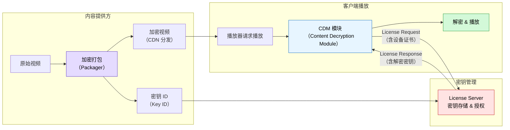
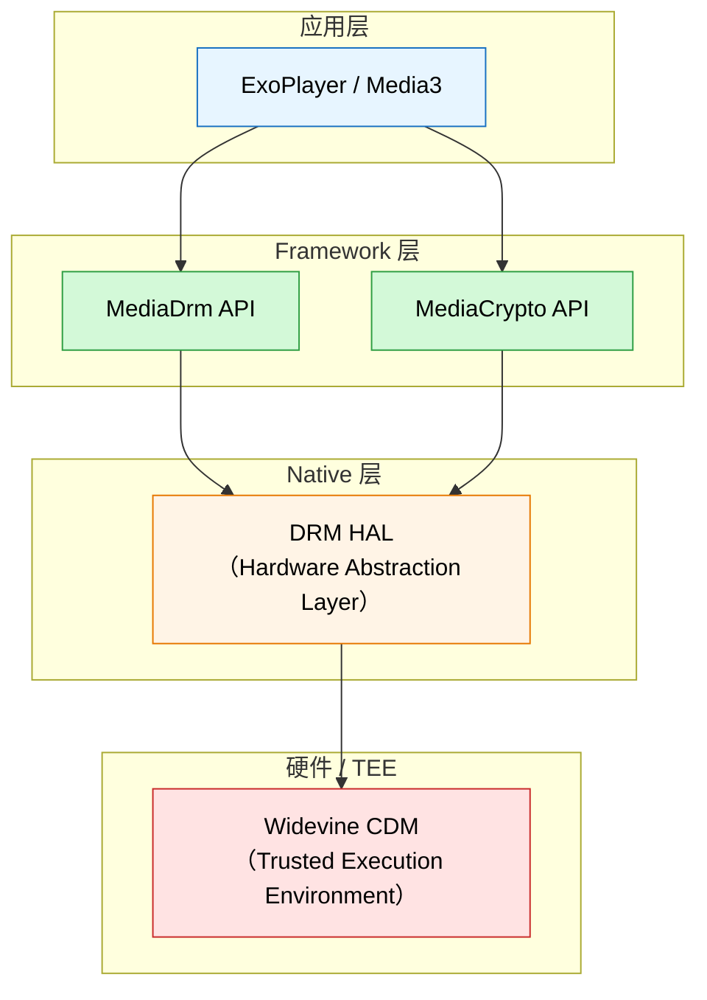
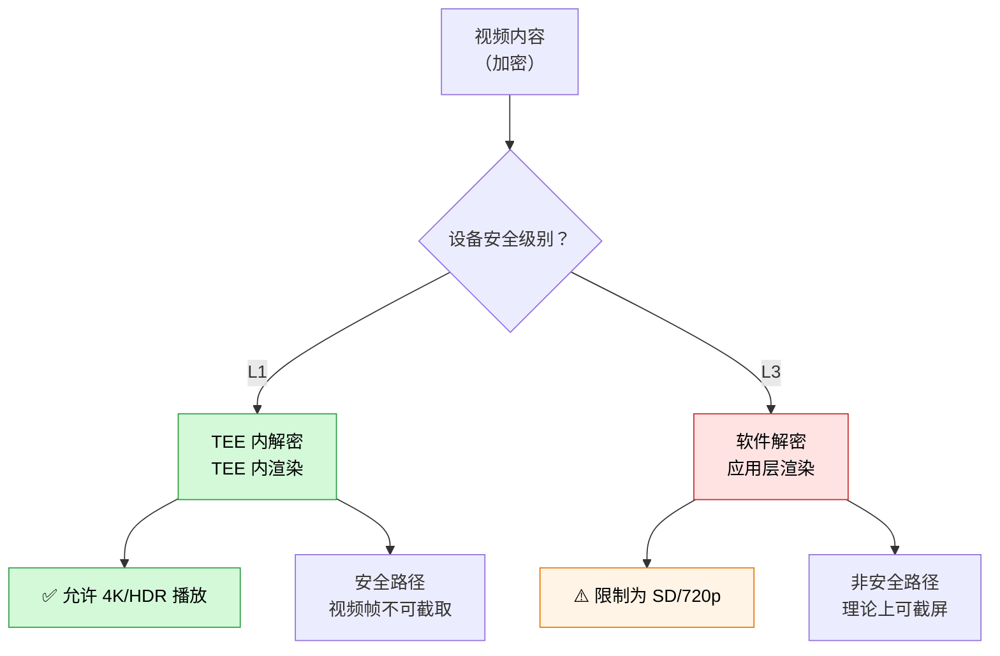
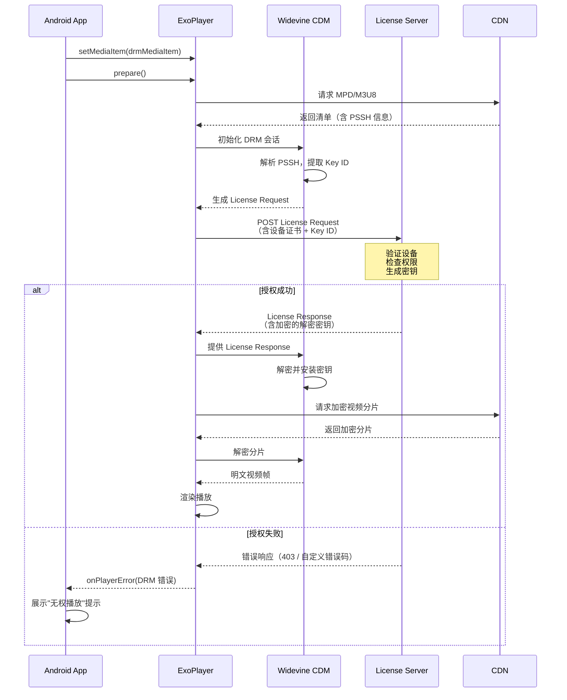
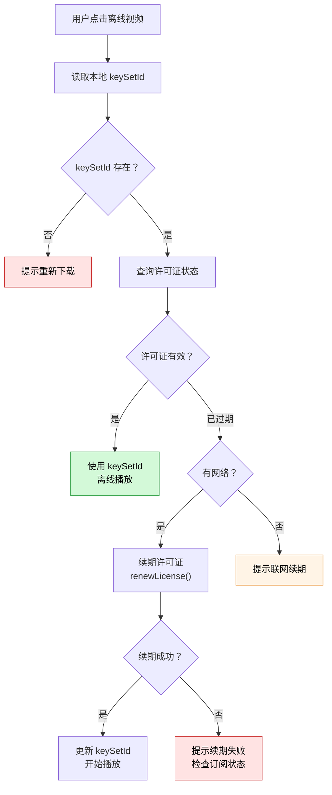
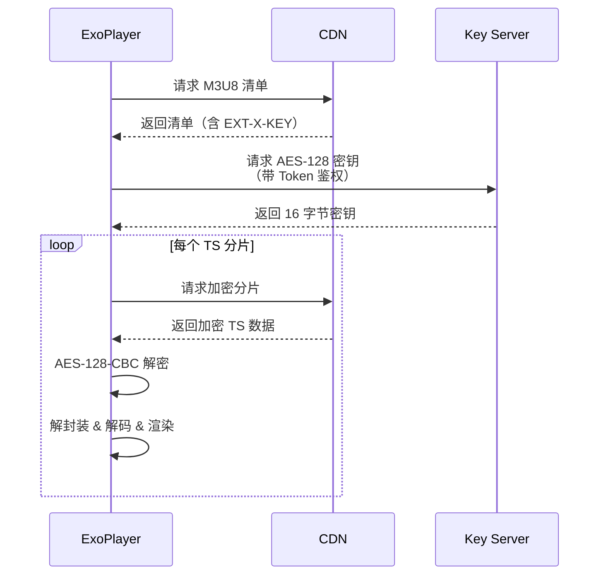

# DRM 与内容保护

数字版权管理（DRM）是付费视频、独播内容等场景的刚需。本文覆盖 DRM 基本原理、Widevine 集成实践、离线 DRM、以及自定义加密方案，帮助团队快速完成版权保护能力的落地。

## DRM 基本概念

### 什么是 DRM

DRM（Digital Rights Management，数字版权管理）是一套通过加密和许可证机制保护数字内容不被未授权访问的技术体系。其核心工作流程为：

1. **内容加密**：服务端使用密钥对视频内容进行加密
2. **密钥管理**：密钥由 License Server 集中管理，不随内容分发
3. **授权播放**：客户端在播放前向 License Server 请求许可证（License），获取解密密钥后才能播放



**关键术语：**

| 术语 | 全称 | 说明 |
|------|------|------|
| CDM | Content Decryption Module | 设备端的解密模块，由 DRM 方案提供商实现 |
| License | 许可证 | 包含解密密钥和播放规则（有效期、分辨率限制等） |
| Key ID | 密钥标识 | 标识加密内容对应的密钥，嵌入在媒体文件中 |
| PSSH | Protection System Specific Header | 媒体文件中的 DRM 元数据，包含 Key ID 和初始化数据 |
| CENC | Common Encryption | 标准加密方案，允许同一内容被多种 DRM 系统解密 |

### 常见 DRM 方案（Widevine / PlayReady / FairPlay）

| 特性 | Widevine | PlayReady | FairPlay |
|------|----------|-----------|----------|
| 所属公司 | Google | Microsoft | Apple |
| Android 支持 | ✅ 原生内置 | ⚠️ 部分设备 | ❌ |
| iOS 支持 | ❌ | ❌ | ✅ 原生内置 |
| Web 支持 | Chrome, Firefox, Edge | Edge, IE | Safari |
| 安全级别 | L1 / L3 | SL2000 / SL3000 | 固定 |
| 离线支持 | ✅ | ✅ | ✅ |
| 4K/HDR 要求 | L1 | SL3000 | 需硬件支持 |
| License 费用 | 免费集成 | 按设备付费 | Apple 生态内免费 |

> **Android 团队结论**：Android 平台优先且唯一推荐 **Widevine**，它是 Android 系统原生内置的 DRM 方案。跨平台项目需要在 iOS 端接入 FairPlay。

### Android 上的 DRM 框架（MediaDrm API）

Android 提供了 `MediaDrm` API 作为与 DRM 系统交互的标准接口：



`MediaDrm` API 的核心能力：

- **openSession()**：打开 DRM 会话
- **getKeyRequest()**：生成 License 请求数据
- **provideKeyResponse()**：将 License 响应提供给 CDM
- **getPropertyString()**：查询 DRM 属性（安全级别、设备 ID 等）

```kotlin
// 查询设备 Widevine 支持信息
val WIDEVINE_UUID = UUID(-0x121074568629b532L, -0x6e28f34d8c1adfebL)

fun queryWidevineInfo(): Map<String, String> {
    val drm = MediaDrm(WIDEVINE_UUID)
    val info = mapOf(
        "vendor" to drm.getPropertyString(MediaDrm.PROPERTY_VENDOR),
        "version" to drm.getPropertyString(MediaDrm.PROPERTY_VERSION),
        "description" to drm.getPropertyString(MediaDrm.PROPERTY_DESCRIPTION),
        "securityLevel" to drm.getPropertyString("securityLevel"),
        "systemId" to drm.getPropertyString("systemId")
    )
    drm.close()
    return info
}
```

## Widevine 集成

### 安全级别（L1 / L2 / L3）

Widevine 定义了三个安全级别，决定了内容保护的强度和允许的最大分辨率：

| 特性 | L1 | L2 | L3 |
|------|----|----|-----|
| 解密环境 | TEE（可信执行环境） | TEE 解密 + 软件处理 | 纯软件 |
| 视频处理 | TEE 内部 | 应用层 | 应用层 |
| 最大分辨率 | 4K / HDR | 通常 1080p | 通常 540p（由 License 限制） |
| 安全性 | 最高 | 中等 | 最低 |
| 设备要求 | 需 TEE 硬件 | 需部分 TEE | 无特殊要求 |
| 典型设备 | 旗舰手机、Android TV | 中端设备 | 低端设备、模拟器 |

### L1 vs L3 的差异与设备要求



**实际影响：**

- Netflix、Disney+ 等平台要求 L1 才能播放 1080p 以上内容
- 国内平台通常 L3 即可播放全部内容（取决于业务策略）
- 部分设备虽然硬件支持 L1，但 OEM 未正确配置 TEE，退化为 L3

### Media3 中的 Widevine 配置

Media3 / ExoPlayer 封装了 DRM 的大部分复杂度，只需通过 `MediaItem` 配置即可：

```kotlin
/**
 * 构建带 Widevine DRM 保护的 MediaItem
 *
 * @param videoUrl 加密视频地址（DASH/HLS）
 * @param licenseUrl License Server 地址
 */
fun buildDrmMediaItem(videoUrl: String, licenseUrl: String): MediaItem {
    val drmConfig = MediaItem.DrmConfiguration.Builder(C.WIDEVINE_UUID)
        .setLicenseUri(licenseUrl)
        .build()

    return MediaItem.Builder()
        .setUri(videoUrl)
        .setDrmConfiguration(drmConfig)
        .build()
}

// 使用示例
val mediaItem = buildDrmMediaItem(
    videoUrl = "https://cdn.example.com/content/encrypted.mpd",
    licenseUrl = "https://license.example.com/widevine/v1/getLicense"
)
player.setMediaItem(mediaItem)
player.prepare()
```

**带自定义 License 请求头的配置：**

```kotlin
/**
 * 配置带鉴权信息的 DRM
 * 很多 License Server 需要在请求头中携带 Token
 */
fun buildDrmMediaItemWithAuth(
    videoUrl: String,
    licenseUrl: String,
    authToken: String
): MediaItem {
    val drmConfig = MediaItem.DrmConfiguration.Builder(C.WIDEVINE_UUID)
        .setLicenseUri(licenseUrl)
        .setLicenseRequestHeaders(
            mapOf(
                "Authorization" to "Bearer $authToken",
                "X-Custom-Data" to "platform=android"
            )
        )
        .build()

    return MediaItem.Builder()
        .setUri(videoUrl)
        .setDrmConfiguration(drmConfig)
        .build()
}
```

**自定义 DrmSessionManagerProvider（高级场景）：**

```kotlin
/**
 * 自定义 DRM 会话管理
 * 当需要拦截 License 请求/响应、添加重试逻辑或日志时使用
 */
fun createCustomDrmSessionManager(licenseUrl: String): DrmSessionManager {
    val httpDataSourceFactory = DefaultHttpDataSource.Factory()
        .setDefaultRequestProperties(
            mapOf("User-Agent" to "MyApp/1.0")
        )

    val callback = HttpMediaDrmCallback(licenseUrl, httpDataSourceFactory)

    return DefaultDrmSessionManager.Builder()
        .setUuidAndExoMediaDrmProvider(
            C.WIDEVINE_UUID,
            FrameworkMediaDrm.DEFAULT_PROVIDER
        )
        .setMultiSession(false)
        .build(callback)
}
```

### License Server 交互流程



**DRM 错误处理：**

```kotlin
player.addListener(object : Player.Listener {
    override fun onPlayerError(error: PlaybackException) {
        when (error.errorCode) {
            PlaybackException.ERROR_CODE_DRM_SYSTEM_ERROR -> {
                // 设备 DRM 系统异常
                Log.e("DRM", "DRM 系统错误: ${error.message}")
            }
            PlaybackException.ERROR_CODE_DRM_SCHEME_UNSUPPORTED -> {
                // 设备不支持该 DRM 方案
                Log.e("DRM", "DRM 方案不支持")
            }
            PlaybackException.ERROR_CODE_DRM_PROVISIONING_FAILED -> {
                // 设备 Provisioning 失败
                Log.e("DRM", "设备注册失败，请检查网络")
            }
            PlaybackException.ERROR_CODE_DRM_LICENSE_ACQUISITION_FAILED -> {
                // License 获取失败
                Log.e("DRM", "许可证获取失败")
            }
            PlaybackException.ERROR_CODE_DRM_CONTENT_ERROR -> {
                // 内容解密失败
                Log.e("DRM", "内容解密失败，可能密钥不匹配")
            }
            PlaybackException.ERROR_CODE_DRM_LICENSE_EXPIRED -> {
                // 许可证过期
                Log.e("DRM", "许可证已过期，需要重新获取")
            }
        }
    }
})
```

## 离线 DRM

### 离线许可证获取

离线 DRM 允许用户在有网络时下载内容和许可证，之后在无网络环境下播放。Media3 提供了 `DownloadHelper` 和 `OfflineLicenseHelper` 来支持此场景。

```kotlin
/**
 * 离线 DRM 许可证管理器
 */
class OfflineDrmManager(
    private val context: Context,
    private val licenseUrl: String,
    private val authToken: String
) {
    private val httpDataSourceFactory = DefaultHttpDataSource.Factory()
        .setDefaultRequestProperties(
            mapOf("Authorization" to "Bearer $authToken")
        )

    private val drmCallback = HttpMediaDrmCallback(licenseUrl, httpDataSourceFactory)

    /**
     * 下载离线许可证
     * @return 许可证的 keySetId，用于后续离线播放和续期
     */
    suspend fun downloadOfflineLicense(drmInitData: DrmInitData): ByteArray {
        return withContext(Dispatchers.IO) {
            val offlineHelper = OfflineLicenseHelper.newWidevineInstance(
                licenseUrl,
                httpDataSourceFactory,
                DrmSessionEventListener.EventDispatcher()
            )

            try {
                offlineHelper.downloadLicense(drmInitData)
            } finally {
                offlineHelper.release()
            }
        }
    }

    /**
     * 将 keySetId 持久化存储
     */
    fun saveKeySetId(contentId: String, keySetId: ByteArray) {
        val prefs = context.getSharedPreferences("drm_keys", Context.MODE_PRIVATE)
        prefs.edit()
            .putString(contentId, Base64.encodeToString(keySetId, Base64.NO_WRAP))
            .apply()
    }

    /**
     * 读取已保存的 keySetId
     */
    fun loadKeySetId(contentId: String): ByteArray? {
        val prefs = context.getSharedPreferences("drm_keys", Context.MODE_PRIVATE)
        val encoded = prefs.getString(contentId, null) ?: return null
        return Base64.decode(encoded, Base64.NO_WRAP)
    }
}
```

### 许可证续期与过期处理

```kotlin
/**
 * 许可证续期和状态管理
 */
class LicenseRenewalManager(
    private val context: Context,
    private val licenseUrl: String,
    private val httpDataSourceFactory: DataSource.Factory
) {

    /**
     * 查询离线许可证剩余有效期
     * @return Pair<许可证剩余秒数, 播放剩余秒数>，null 表示许可证无效
     */
    fun queryLicenseExpiry(keySetId: ByteArray): Pair<Long, Long>? {
        val offlineHelper = OfflineLicenseHelper.newWidevineInstance(
            licenseUrl,
            httpDataSourceFactory,
            DrmSessionEventListener.EventDispatcher()
        )

        return try {
            val remainingPair = offlineHelper.getLicenseDurationRemainingSec(keySetId)
            Pair(remainingPair.first, remainingPair.second)
        } catch (e: Exception) {
            Log.e("DRM", "查询许可证状态失败: ${e.message}")
            null
        } finally {
            offlineHelper.release()
        }
    }

    /**
     * 续期离线许可证
     * @return 新的 keySetId
     */
    suspend fun renewLicense(keySetId: ByteArray): ByteArray {
        return withContext(Dispatchers.IO) {
            val offlineHelper = OfflineLicenseHelper.newWidevineInstance(
                licenseUrl,
                httpDataSourceFactory,
                DrmSessionEventListener.EventDispatcher()
            )

            try {
                offlineHelper.renewLicense(keySetId)
            } finally {
                offlineHelper.release()
            }
        }
    }

    /**
     * 释放离线许可证（用户删除下载内容时调用）
     */
    fun releaseLicense(keySetId: ByteArray) {
        val offlineHelper = OfflineLicenseHelper.newWidevineInstance(
            licenseUrl,
            httpDataSourceFactory,
            DrmSessionEventListener.EventDispatcher()
        )

        try {
            offlineHelper.releaseLicense(keySetId)
        } finally {
            offlineHelper.release()
        }
    }
}
```

**使用已保存的离线许可证播放：**

```kotlin
/**
 * 使用离线许可证播放已下载的加密内容
 */
fun playOfflineDrmContent(
    player: ExoPlayer,
    contentUri: Uri,
    keySetId: ByteArray
) {
    val drmConfig = MediaItem.DrmConfiguration.Builder(C.WIDEVINE_UUID)
        .setKeySetId(keySetId)
        .build()

    val mediaItem = MediaItem.Builder()
        .setUri(contentUri)
        .setDrmConfiguration(drmConfig)
        .build()

    player.setMediaItem(mediaItem)
    player.prepare()
}
```

### 离线播放权限校验流程



## 自定义加密方案

### 非标准 DRM 场景

在以下场景中，可能需要自定义加密方案而非标准 DRM：

| 场景 | 说明 | 方案 |
|------|------|------|
| 私有 CDN + 简单保护 | 不需要完整 DRM，仅防止链接直接访问 | AES-128 加密 HLS |
| 企业内网培训视频 | 防止下载但不需要专业级保护 | 自定义 DataSource 解密 |
| Token 鉴权 | 用播放 Token 控制访问权限 | URL Token + 有效期 |
| 碎片化加密 | 对视频关键帧加密，降低服务端成本 | 部分加密 + 自定义解密 |

### 自定义 DataSource 解密

当视频使用自有加密方案时，可以通过自定义 `DataSource` 实现透明解密：

```kotlin
/**
 * 自定义解密 DataSource
 * 在数据读取过程中进行透明解密
 */
class DecryptingDataSource(
    private val upstream: DataSource,
    private val secretKey: SecretKey
) : DataSource {

    private var cipher: Cipher? = null
    private var dataSpec: DataSpec? = null

    override fun open(dataSpec: DataSpec): Long {
        this.dataSpec = dataSpec
        val bytesOpened = upstream.open(dataSpec)

        // 初始化 AES 解密器
        cipher = Cipher.getInstance("AES/CTR/NoPadding").apply {
            val iv = IvParameterSpec(ByteArray(16)) // 实际项目中 IV 应从元数据获取
            init(Cipher.DECRYPT_MODE, secretKey, iv)
        }

        return bytesOpened
    }

    override fun read(buffer: ByteArray, offset: Int, length: Int): Int {
        val bytesRead = upstream.read(buffer, offset, length)
        if (bytesRead == C.RESULT_END_OF_INPUT) return bytesRead

        // 就地解密
        val decrypted = cipher!!.update(buffer, offset, bytesRead)
        if (decrypted != null) {
            System.arraycopy(decrypted, 0, buffer, offset, decrypted.size)
        }

        return bytesRead
    }

    override fun addTransferListener(transferListener: TransferListener) {
        upstream.addTransferListener(transferListener)
    }

    override fun getUri(): Uri? = upstream.uri

    override fun close() {
        upstream.close()
        cipher = null
    }
}

/**
 * 解密 DataSource 工厂
 */
class DecryptingDataSourceFactory(
    private val upstreamFactory: DataSource.Factory,
    private val secretKey: SecretKey
) : DataSource.Factory {

    override fun createDataSource(): DataSource {
        return DecryptingDataSource(upstreamFactory.createDataSource(), secretKey)
    }
}

// 使用自定义解密 DataSource
fun createPlayerWithDecryption(context: Context, secretKey: SecretKey): ExoPlayer {
    val httpFactory = DefaultHttpDataSource.Factory()
    val decryptFactory = DecryptingDataSourceFactory(httpFactory, secretKey)

    val mediaSourceFactory = DefaultMediaSourceFactory(context)
        .setDataSourceFactory(decryptFactory)

    return ExoPlayer.Builder(context)
        .setMediaSourceFactory(mediaSourceFactory)
        .build()
}
```

### AES 加密 HLS 流

HLS 协议原生支持 AES-128 加密，无需 DRM，但安全性低于 Widevine。

**加密 HLS 清单示例：**

```
#EXTM3U
#EXT-X-VERSION:3
#EXT-X-KEY:METHOD=AES-128,URI="https://key.example.com/key?token=abc123",IV=0x00000000000000000000000000000001
#EXTINF:10.0,
segment001.ts
#EXTINF:10.0,
segment002.ts
```

**工作原理：**



**Media3 处理 AES 加密 HLS：**

```kotlin
// Media3 自动处理标准 AES-128 加密 HLS，无需额外配置
val mediaItem = MediaItem.fromUri("https://cdn.example.com/encrypted/master.m3u8")
player.setMediaItem(mediaItem)
player.prepare()

// 如果 Key Server 需要自定义鉴权头
val httpFactory = DefaultHttpDataSource.Factory()
    .setDefaultRequestProperties(
        mapOf("Authorization" to "Bearer $token")
    )

val mediaSourceFactory = DefaultMediaSourceFactory(context)
    .setDataSourceFactory(httpFactory)

val player = ExoPlayer.Builder(context)
    .setMediaSourceFactory(mediaSourceFactory)
    .build()
```

**AES-128 HLS vs Widevine 对比：**

| 特性 | AES-128 HLS | Widevine |
|------|-------------|----------|
| 安全性 | 低（密钥明文传输可被抓包） | 高（TEE 保护） |
| 实现成本 | 低（仅需 Key Server） | 中（需对接 License Server） |
| 离线支持 | 需自行实现 | 原生支持 |
| 分辨率限制 | 无 | L3 可能被限 |
| 防截屏 | ❌ | ✅（L1） |
| 适用场景 | 内部培训、免费内容简单保护 | 付费内容、版权保护 |

## 踩坑记录

> 此区域供团队成员补充项目中遇到的真实案例。

| 日期 | 记录人 | 问题描述 | 解决方案 |
|------|--------|----------|----------|
| | | | |

## 参考资料

- [Media3 DRM 指南](https://developer.android.com/media/media3/exoplayer/drm)
- [Android MediaDrm API](https://developer.android.com/reference/android/media/MediaDrm)
- [Widevine 官方文档](https://www.widevine.com/solutions/widevine-drm)
- [DASH-IF CENC 规范](https://dashif.org/guidelines/)
- [ExoPlayer DRM 示例代码](https://github.com/androidx/media/tree/release/demos)
- [HLS AES-128 加密规范](https://datatracker.ietf.org/doc/html/rfc8216#section-4.3.2.4)
- [Widevine 安全级别说明](https://developers.google.com/widevine/drm/overview)
