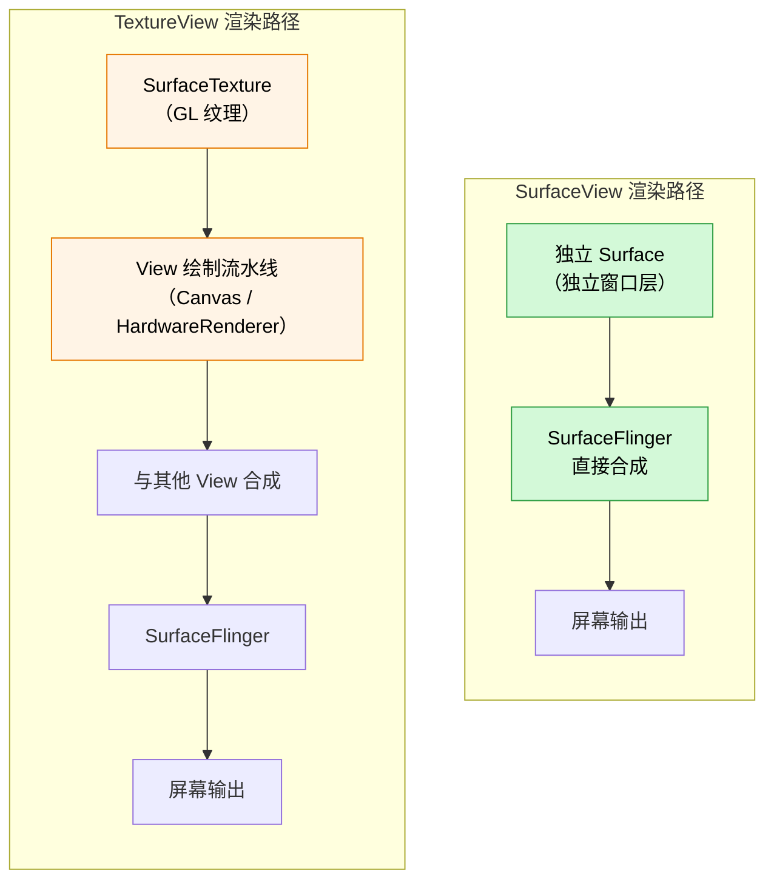
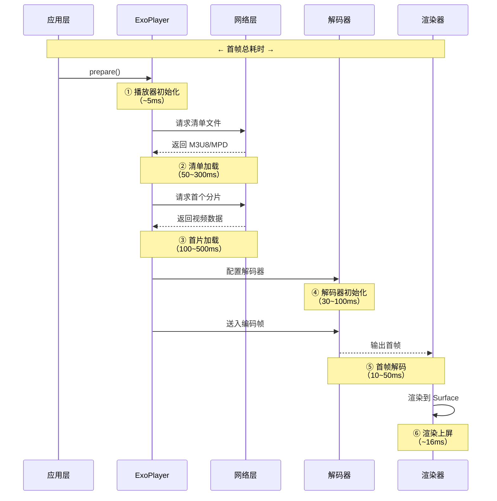
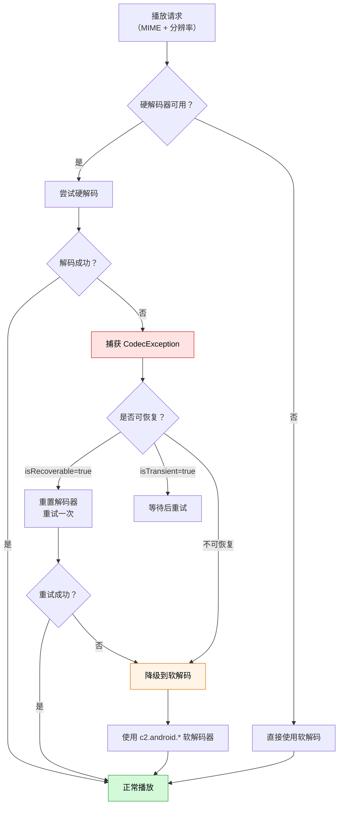
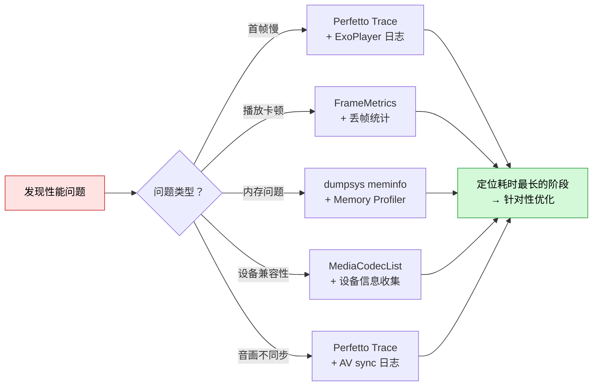

# 性能优化与问题排查

视频播放是 Android 应用中资源消耗最大的场景之一，涉及 CPU 解码、GPU 渲染、内存管理和网络 I/O 的协同工作。本文系统性地覆盖性能优化策略和常见问题排查方法，帮助团队建立完整的视频播放质量保障体系。

## SurfaceView vs TextureView

### 渲染机制差异



**关键区别：**

- **SurfaceView**：拥有独立的 Surface，解码器直接将帧输出到该 Surface，由 SurfaceFlinger 在系统层合成。不参与 View 的绘制流程。
- **TextureView**：视频帧先渲染到 SurfaceTexture（OpenGL 纹理），再通过 View 绘制流水线与其他 UI 元素一起合成。多了一次 GPU 纹理拷贝。

### 性能对比

| 维度 | SurfaceView | TextureView |
|------|-------------|-------------|
| 渲染性能 | ⭐⭐⭐ 更优，无额外拷贝 | ⭐⭐ 多一次 GPU 纹理拷贝 |
| 功耗 | 更低 | 较高（约 10~20%） |
| 动画支持 | ❌ 不支持 View 动画 | ✅ 完整支持 |
| Alpha 透明 | ❌ 不支持（Z-order 问题） | ✅ 支持 |
| 截图 | ❌ `getBitmap()` 不可用 | ✅ 可直接截图 |
| DRM L1 | ✅ 支持安全视频路径 | ⚠️ 部分设备不支持 |
| 嵌套滚动 | ⚠️ 滚动时可能闪烁 | ✅ 平滑 |
| RecyclerView | ⚠️ 需特殊处理 | ✅ 自然支持 |
| API 级别 | API 1+ | API 14+ |
| 内存占用 | 较低 | 较高（纹理缓存） |

### 选型建议

| 场景 | 推荐方案 | 理由 |
|------|----------|------|
| 全屏播放器 | SurfaceView | 性能最优，无动画需求 |
| 短视频信息流（ViewPager） | SurfaceView | 性能优先，页面切换无需 View 动画 |
| 列表内小窗播放 | TextureView | 需要随列表滚动，避免闪烁 |
| 浮窗 / 画中画 | TextureView | 需要窗口动画和透明度 |
| 视频编辑预览 | TextureView | 需要截图和特效叠加 |
| DRM L1 内容 | SurfaceView | 安全视频路径要求 |

```kotlin
// Media3 PlayerView 设置 Surface 类型
val playerView = findViewById<PlayerView>(R.id.player_view)

// 使用 SurfaceView（默认）
playerView.setUseController(true)
// player_view 的 XML 属性：app:surface_type="surface_view"

// 根据场景动态选择
fun chooseSurfaceType(scene: PlaybackScene): Int {
    return when (scene) {
        PlaybackScene.FULLSCREEN -> PlayerView.SURFACE_TYPE_SURFACE_VIEW
        PlaybackScene.LIST_INLINE -> PlayerView.SURFACE_TYPE_TEXTURE_VIEW
        PlaybackScene.FLOATING_WINDOW -> PlayerView.SURFACE_TYPE_TEXTURE_VIEW
        PlaybackScene.DRM_CONTENT -> PlayerView.SURFACE_TYPE_SURFACE_VIEW
    }
}
```

## 首帧优化

### 首帧耗时拆解

首帧时间（Time to First Frame, TTFF）是视频播放体验的核心指标。完整的首帧耗时包含以下阶段：



**各阶段耗时分布（典型值）：**

| 阶段 | 耗时范围 | 优化空间 | 优先级 |
|------|----------|----------|--------|
| 播放器初始化 | 5~20ms | 小 | 低 |
| 清单加载 | 50~300ms | 大（预加载/缓存） | ⭐ 高 |
| 首片加载 | 100~500ms | 大（预加载/CDN） | ⭐ 高 |
| 解码器初始化 | 30~100ms | 中（复用/预热） | 中 |
| 首帧解码 | 10~50ms | 小 | 低 |
| 渲染上屏 | ~16ms | 极小 | 低 |
| **总计** | **200~1000ms** | | |

### 预加载策略

```kotlin
/**
 * 视频预加载管理器
 * 在用户可能点击播放之前提前加载清单和首个分片
 */
class VideoPreloadManager(private val context: Context) {

    private val preloadPool = mutableMapOf<String, ExoPlayer>()
    private val maxPreloadCount = 3

    /**
     * 预加载指定视频（仅加载清单和首个分片，不解码不渲染）
     */
    fun preload(videoUrl: String) {
        if (preloadPool.containsKey(videoUrl)) return
        if (preloadPool.size >= maxPreloadCount) {
            // 淘汰最早的预加载
            val oldest = preloadPool.keys.first()
            releasePreload(oldest)
        }

        val preloadPlayer = ExoPlayer.Builder(context)
            .setLoadControl(
                DefaultLoadControl.Builder()
                    .setBufferDurationsMs(
                        1_000,   // 最小缓冲（降低预加载数据量）
                        2_000,   // 最大缓冲
                        500,     // 播放所需缓冲（首帧更快）
                        500      // 重缓冲后播放所需缓冲
                    )
                    .build()
            )
            .build()

        preloadPlayer.setMediaItem(MediaItem.fromUri(videoUrl))
        preloadPlayer.playWhenReady = false   // 不自动播放
        preloadPlayer.prepare()               // 开始加载

        preloadPool[videoUrl] = preloadPlayer
    }

    /**
     * 将预加载的 Player 交给实际播放使用
     * @return 已预加载的 Player，如果没有预加载则返回 null
     */
    fun takePreloadedPlayer(videoUrl: String): ExoPlayer? {
        return preloadPool.remove(videoUrl)
    }

    fun releasePreload(videoUrl: String) {
        preloadPool.remove(videoUrl)?.release()
    }

    fun releaseAll() {
        preloadPool.values.forEach { it.release() }
        preloadPool.clear()
    }
}
```

### 减少黑屏时间的方案

| 方案 | 原理 | 效果预估 | 适用场景 | 实现成本 |
|------|------|----------|----------|----------|
| 预加载清单 | 提前请求 M3U8/MPD | 减少 100~300ms | 推荐列表场景 | 低 |
| 预加载首片 | 提前缓冲数据 | 减少 200~500ms | 短视频信息流 | 中 |
| 封面图占位 | 用静态封面遮盖黑屏 | 视觉上消除黑屏 | **所有场景** | 低 |
| 解码器预热 | 提前初始化 MediaCodec | 减少 30~100ms | 频繁切换场景 | 中 |
| CDN 预热 | DNS 预解析 + TCP 预连接 | 减少 50~150ms | 冷启动场景 | 低 |
| 缩短 GOP | 减少首个 I 帧等待 | 减少 50~200ms | 需服务端配合 | 高 |
| 低分辨率快启 | 先播低码率流再切换 | 首帧显著加快 | ABR 流 | 中 |

```kotlin
/**
 * 封面图占位 + 首帧回调消除黑屏
 */
class BlackScreenEliminator(
    private val playerView: PlayerView,
    private val coverImageView: ImageView
) {

    fun showCover(coverUrl: String) {
        coverImageView.visibility = View.VISIBLE
        Glide.with(coverImageView)
            .load(coverUrl)
            .into(coverImageView)
    }

    /**
     * 监听首帧渲染完成后隐藏封面图
     */
    fun attachToPlayer(player: ExoPlayer) {
        player.addListener(object : Player.Listener {
            override fun onRenderedFirstFrame() {
                // 首帧已渲染到 Surface，可以安全隐藏封面图
                coverImageView.animate()
                    .alpha(0f)
                    .setDuration(150)
                    .withEndAction {
                        coverImageView.visibility = View.GONE
                        coverImageView.alpha = 1f
                    }
                    .start()
            }
        })
    }
}

/**
 * DNS 预解析 + TCP 预连接
 */
fun preconnectToCdn(videoHost: String) {
    val url = java.net.URL("https://$videoHost")
    Thread {
        try {
            val conn = url.openConnection() as java.net.HttpURLConnection
            conn.connectTimeout = 3000
            conn.connect()
            conn.disconnect()
        } catch (_: Exception) {
            // 预连接失败不影响后续播放
        }
    }.start()
}
```

## 硬解码兼容性

### 设备碎片化问题

Android 设备碎片化导致硬解码能力参差不齐：

- **解码器实现差异**：不同芯片厂商（高通、联发科、海思等）的 MediaCodec 实现行为不一致
- **支持的格式不同**：低端设备可能不支持 HEVC / VP9 / AV1 硬解
- **最大分辨率限制**：部分设备标称支持 4K 但实际解码不稳定
- **并发实例限制**：解码器实例数量因设备而异（通常 2~16 个）

### 解码器能力查询（MediaCodecList）

```kotlin
/**
 * 设备解码能力查询工具
 */
object DecoderCapabilityChecker {

    /**
     * 查询设备支持的所有视频解码器
     */
    fun listVideoDecoders(): List<DecoderInfo> {
        val codecList = MediaCodecList(MediaCodecList.ALL_CODECS)
        return codecList.codecInfos
            .filter { !it.isEncoder }
            .flatMap { info ->
                info.supportedTypes
                    .filter { it.startsWith("video/") }
                    .map { mimeType ->
                        val caps = info.getCapabilitiesForType(mimeType)
                        val videoCaps = caps.videoCapabilities
                        DecoderInfo(
                            name = info.name,
                            mimeType = mimeType,
                            isHardware = !info.isSoftwareOnly,
                            maxWidth = videoCaps.supportedWidths.upper,
                            maxHeight = videoCaps.supportedHeights.upper,
                            maxFrameRate = videoCaps.supportedFrameRates.upper.toInt(),
                            supportedProfiles = caps.profileLevels.map { it.profile }
                        )
                    }
            }
    }

    /**
     * 检查设备是否支持指定格式的硬解
     */
    fun isHardwareDecoderAvailable(mimeType: String, width: Int, height: Int): Boolean {
        val codecList = MediaCodecList(MediaCodecList.REGULAR_CODECS)
        return codecList.codecInfos.any { info ->
            !info.isEncoder &&
                !info.isSoftwareOnly &&
                info.supportedTypes.contains(mimeType) &&
                try {
                    val caps = info.getCapabilitiesForType(mimeType)
                    caps.videoCapabilities.isSizeSupported(width, height)
                } catch (_: Exception) {
                    false
                }
        }
    }

    /**
     * 获取推荐解码器名称
     */
    fun findBestDecoder(mimeType: String, width: Int, height: Int, preferHardware: Boolean = true): String? {
        val codecList = MediaCodecList(MediaCodecList.REGULAR_CODECS)
        val candidates = codecList.codecInfos
            .filter { !it.isEncoder && it.supportedTypes.contains(mimeType) }
            .filter {
                try {
                    val caps = it.getCapabilitiesForType(mimeType)
                    caps.videoCapabilities.isSizeSupported(width, height)
                } catch (_: Exception) {
                    false
                }
            }
            .sortedByDescending { if (preferHardware) !it.isSoftwareOnly else it.isSoftwareOnly }

        return candidates.firstOrNull()?.name
    }

    data class DecoderInfo(
        val name: String,
        val mimeType: String,
        val isHardware: Boolean,
        val maxWidth: Int,
        val maxHeight: Int,
        val maxFrameRate: Int,
        val supportedProfiles: List<Int>
    )
}
```

### 软硬解降级策略



```kotlin
/**
 * 配置 ExoPlayer 的解码器降级策略
 */
fun createPlayerWithFallback(context: Context): ExoPlayer {
    val renderersFactory = DefaultRenderersFactory(context)
        // 当硬解码失败时自动降级到软解码
        .setExtensionRendererMode(DefaultRenderersFactory.EXTENSION_RENDERER_MODE_PREFER)
        .setEnableDecoderFallback(true)

    return ExoPlayer.Builder(context, renderersFactory).build()
}

/**
 * 监听解码器初始化事件，记录实际使用的解码器
 */
fun logDecoderUsage(player: ExoPlayer) {
    player.addAnalyticsListener(object : AnalyticsListener {
        override fun onVideoDecoderInitialized(
            eventTime: AnalyticsListener.EventTime,
            decoderName: String,
            initializedTimestampMs: Long,
            initializationDurationMs: Long
        ) {
            Log.i("Decoder", "视频解码器: $decoderName, 初始化耗时: ${initializationDurationMs}ms")
            // 上报解码器使用情况（用于分析设备兼容性）
        }

        override fun onAudioDecoderInitialized(
            eventTime: AnalyticsListener.EventTime,
            decoderName: String,
            initializedTimestampMs: Long,
            initializationDurationMs: Long
        ) {
            Log.i("Decoder", "音频解码器: $decoderName, 初始化耗时: ${initializationDurationMs}ms")
        }

        override fun onVideoCodecError(
            eventTime: AnalyticsListener.EventTime,
            videoCodecError: Exception
        ) {
            Log.e("Decoder", "视频解码错误: ${videoCodecError.message}")
        }
    })
}
```

## 多实例资源管理

### 解码器实例数量限制

不同设备的 MediaCodec 并发实例数差异很大：

| 设备级别 | 典型并发数 | 说明 |
|----------|-----------|------|
| 旗舰 | 8~16 | 多路解码能力强 |
| 中端 | 4~8 | 满足常规需求 |
| 低端 | 2~4 | 容易触发限制 |
| Android TV | 2~4 | 通常仅支持少数实例 |

> 超出限制时，`MediaCodec.configure()` 会抛出 `CodecException`，或系统直接回收之前的解码器实例导致其他播放器异常。

### 播放器池化管理

```kotlin
/**
 * 播放器对象池
 * 复用播放器实例，避免频繁创建/销毁带来的开销和解码器泄漏
 */
class PlayerPool(
    private val context: Context,
    private val maxSize: Int = 3
) {
    private val availablePlayers = ArrayDeque<ExoPlayer>()
    private val activePlayers = mutableSetOf<ExoPlayer>()
    private val lock = Any()

    /** 从池中获取播放器 */
    fun acquire(): ExoPlayer {
        synchronized(lock) {
            // 优先复用已有实例
            val player = availablePlayers.removeLastOrNull()
            if (player != null) {
                activePlayers.add(player)
                return player
            }

            // 如果总数已达上限，回收最早的活跃播放器
            if (activePlayers.size >= maxSize) {
                val oldest = activePlayers.first()
                oldest.stop()
                oldest.clearMediaItems()
                activePlayers.remove(oldest)
                activePlayers.add(oldest)
                return oldest
            }

            // 创建新实例
            val newPlayer = createPlayer()
            activePlayers.add(newPlayer)
            return newPlayer
        }
    }

    /** 归还播放器到池中 */
    fun release(player: ExoPlayer) {
        synchronized(lock) {
            player.stop()
            player.clearMediaItems()
            activePlayers.remove(player)

            if (availablePlayers.size < maxSize) {
                availablePlayers.addLast(player)
            } else {
                player.release()
            }
        }
    }

    /** 销毁池中所有播放器 */
    fun destroy() {
        synchronized(lock) {
            availablePlayers.forEach { it.release() }
            activePlayers.forEach { it.release() }
            availablePlayers.clear()
            activePlayers.clear()
        }
    }

    private fun createPlayer(): ExoPlayer {
        return ExoPlayer.Builder(context)
            .setRenderersFactory(
                DefaultRenderersFactory(context)
                    .setEnableDecoderFallback(true)
            )
            .build()
    }
}
```

### 列表场景的资源回收

```kotlin
/**
 * RecyclerView 中视频播放器的生命周期管理
 */
class VideoListManager(
    private val recyclerView: RecyclerView,
    private val playerPool: PlayerPool
) {
    private val visiblePlayers = mutableMapOf<Int, ExoPlayer>()

    init {
        recyclerView.addOnScrollListener(object : RecyclerView.OnScrollListener() {
            override fun onScrolled(recyclerView: RecyclerView, dx: Int, dy: Int) {
                val layoutManager = recyclerView.layoutManager as LinearLayoutManager
                val firstVisible = layoutManager.findFirstVisibleItemPosition()
                val lastVisible = layoutManager.findLastVisibleItemPosition()

                // 回收不可见的播放器
                val toRemove = visiblePlayers.keys.filter { it < firstVisible - 1 || it > lastVisible + 1 }
                toRemove.forEach { position ->
                    visiblePlayers.remove(position)?.let { player ->
                        playerPool.release(player)
                    }
                }
            }

            override fun onScrollStateChanged(recyclerView: RecyclerView, newState: Int) {
                if (newState == RecyclerView.SCROLL_STATE_IDLE) {
                    // 滚动停止后，自动播放中间可见的视频
                    autoPlayVisibleVideo()
                }
            }
        })
    }

    private fun autoPlayVisibleVideo() {
        val layoutManager = recyclerView.layoutManager as LinearLayoutManager
        val firstVisible = layoutManager.findFirstCompletelyVisibleItemPosition()
        if (firstVisible != RecyclerView.NO_POSITION) {
            // 暂停其他播放器
            visiblePlayers.forEach { (pos, player) ->
                if (pos != firstVisible) player.pause()
            }
            // 播放当前完全可见的视频
            visiblePlayers[firstVisible]?.play()
        }
    }
}
```

## 帧率监控与丢帧分析

### FrameMetrics API

Android 提供了 `FrameMetrics` API（API 24+）来监控 UI 帧耗时：

```kotlin
/**
 * 帧率监控器
 * 用于检测视频播放期间的 UI 卡顿
 */
@RequiresApi(Build.VERSION_CODES.N)
class FrameRateMonitor(private val activity: Activity) {

    private var droppedFrames = 0
    private var totalFrames = 0
    private val slowFrameThresholdNs = 16_666_667L * 2  // 超过 2 帧（~33ms）视为慢帧

    private val frameMetricsListener = Window.OnFrameMetricsAvailableListener { _, frameMetrics, _ ->
        totalFrames++
        val totalDurationNs = frameMetrics.getMetric(FrameMetrics.TOTAL_DURATION)

        if (totalDurationNs > slowFrameThresholdNs) {
            droppedFrames++
            Log.w("FrameRate", "慢帧: ${totalDurationNs / 1_000_000}ms " +
                "(Layout=${frameMetrics.getMetric(FrameMetrics.LAYOUT_MEASURE_DURATION) / 1_000_000}ms, " +
                "Draw=${frameMetrics.getMetric(FrameMetrics.DRAW_DURATION) / 1_000_000}ms)")
        }
    }

    fun start() {
        droppedFrames = 0
        totalFrames = 0
        activity.window.addOnFrameMetricsAvailableListener(
            frameMetricsListener,
            Handler(Looper.getMainLooper())
        )
    }

    fun stop(): FrameRateReport {
        activity.window.removeOnFrameMetricsAvailableListener(frameMetricsListener)
        val dropRate = if (totalFrames > 0) droppedFrames.toFloat() / totalFrames else 0f
        return FrameRateReport(totalFrames, droppedFrames, dropRate)
    }

    data class FrameRateReport(
        val totalFrames: Int,
        val droppedFrames: Int,
        val dropRate: Float
    )
}
```

### Perfetto 视频解码 Trace

Perfetto 是系统级性能分析工具，可以抓取视频解码的完整 Trace：

```bash
# 抓取 10 秒的视频解码 Trace
adb shell perfetto \
    -c - --txt \
    -o /data/misc/perfetto-traces/video_trace.perfetto-trace \
    <<EOF
buffers: {
    size_kb: 63488
    fill_policy: DISCARD
}
data_sources: {
    config {
        name: "linux.ftrace"
        ftrace_config {
            ftrace_events: "sched/sched_switch"
            ftrace_events: "power/suspend_resume"
            ftrace_events: "power/cpu_frequency"
            atrace_categories: "video"
            atrace_categories: "view"
            atrace_categories: "gfx"
            atrace_categories: "am"
            atrace_apps: "com.your.app"
        }
    }
}
duration_ms: 10000
EOF

# 拉取到本地
adb pull /data/misc/perfetto-traces/video_trace.perfetto-trace .
# 在 https://ui.perfetto.dev 中打开分析
```

**关键观察点：**

| Trace 轨道 | 观察内容 | 异常特征 |
|-----------|----------|----------|
| `MediaCodec` | 解码耗时、队列深度 | 单帧解码 >33ms |
| `SurfaceFlinger` | 帧合成时间 | 连续丢帧 |
| `RenderThread` | GPU 渲染耗时 | 超过 16ms |
| `MainThread` | 主线程负载 | 解码期间主线程繁忙 |
| `CPU Frequency` | CPU 频率调节 | 频繁降频导致解码慢 |

### GPU 渲染分析

```bash
# 开启 GPU 渲染分析条
adb shell setprop debug.hwui.profile true
# 重启应用后观察屏幕上的彩色条状图

# 使用 dumpsys 获取帧时间数据
adb shell dumpsys gfxinfo com.your.app framestats

# 输出示例中关注：
# Janky frames: 卡顿帧数/总帧数
# 50th percentile: 中位帧耗时
# 90th percentile: 90 分位帧耗时
# 95th percentile: 95 分位帧耗时
# 99th percentile: 99 分位帧耗时
```

## 内存优化

### 播放器内存占用分析

典型的 ExoPlayer 实例内存占用分布：

| 组件 | 内存占用 | 说明 |
|------|----------|------|
| 视频解码器缓冲 | 10~50MB | 取决于分辨率和缓冲帧数 |
| 音频解码器缓冲 | 1~5MB | 相对较小 |
| 网络缓冲区 | 2~30MB | 由 LoadControl 控制 |
| SurfaceTexture | 5~15MB | TextureView 额外开销 |
| 其他对象 | 1~3MB | 播放器内部数据结构 |

```bash
# 分析应用内存占用
adb shell dumpsys meminfo com.your.app

# 关注以下区域：
# Native Heap  - MediaCodec 缓冲区占用
# Graphics     - Surface/纹理内存
# Code         - so 库加载（libexoplayer 等）
# .so mmap     - 解码器相关原生库
```

**关键分析项：**

- **Native Heap** 持续增长 → 可能存在解码器缓冲泄漏
- **Graphics** 异常偏高 → 检查 TextureView / SurfaceTexture 是否正确释放
- **Java Heap** 增长 → 检查 Listener / Callback 是否导致对象泄漏

### Bitmap / 纹理内存控制

```kotlin
/**
 * 视频缩略图内存管理
 */
object ThumbnailMemoryManager {

    /**
     * 计算合适的缩略图尺寸，避免内存浪费
     * 视频封面图不需要原始分辨率
     */
    fun calculateThumbnailSize(
        originalWidth: Int,
        originalHeight: Int,
        targetViewWidth: Int,
        targetViewHeight: Int
    ): Pair<Int, Int> {
        val widthRatio = originalWidth.toFloat() / targetViewWidth
        val heightRatio = originalHeight.toFloat() / targetViewHeight
        val ratio = maxOf(widthRatio, heightRatio)

        return Pair(
            (originalWidth / ratio).toInt(),
            (originalHeight / ratio).toInt()
        )
    }
}

/**
 * 控制网络缓冲区大小以限制内存
 */
fun createMemoryEfficientPlayer(context: Context): ExoPlayer {
    val loadControl = DefaultLoadControl.Builder()
        .setBufferDurationsMs(
            5_000,     // 最小缓冲 5s（默认 50s）
            15_000,    // 最大缓冲 15s（默认 50s）
            1_000,     // 播放所需缓冲 1s
            2_000      // 重缓冲后播放所需 2s
        )
        .setTargetBufferBytes(15 * 1024 * 1024)   // 缓冲上限 15MB
        .setPrioritizeTimeOverSizeThresholds(false) // 优先控制大小
        .build()

    return ExoPlayer.Builder(context)
        .setLoadControl(loadControl)
        .build()
}
```

### 大视频文件的内存管理

**内存优化 Checklist：**

- [ ] 播放器在不可见时调用 `player.stop()` 释放解码器缓冲
- [ ] Activity/Fragment 销毁时调用 `player.release()`
- [ ] 避免在列表中同时创建多个 ExoPlayer 实例（使用池化）
- [ ] TextureView 场景确保 SurfaceTexture 正确释放
- [ ] 合理设置 `DefaultLoadControl` 缓冲参数
- [ ] 视频缩略图使用 downsampled 尺寸加载
- [ ] 离线下载大文件时使用流式写入，不在内存中持有完整文件
- [ ] 监控 `onTrimMemory()` 回调，在系统内存不足时主动释放

```kotlin
/**
 * 响应系统内存压力
 */
class VideoMemoryHandler(private val playerPool: PlayerPool) : ComponentCallbacks2 {

    override fun onTrimMemory(level: Int) {
        when {
            level >= ComponentCallbacks2.TRIM_MEMORY_RUNNING_CRITICAL -> {
                // 系统内存极低：释放所有非活跃播放器
                playerPool.destroy()
            }
            level >= ComponentCallbacks2.TRIM_MEMORY_RUNNING_LOW -> {
                // 系统内存偏低：释放池中空闲播放器
                // 保留当前正在播放的实例
            }
        }
    }

    override fun onConfigurationChanged(newConfig: Configuration) {}
    override fun onLowMemory() {
        playerPool.destroy()
    }
}
```

## 常见问题排查

### 黑屏

| 项目 | 内容 |
|------|------|
| **现象** | 视频有声音但画面全黑，或播放开始后长时间黑屏 |
| **常见原因** | ① Surface 未正确关联<br/>② SurfaceView 被其他 View 遮挡（Z-order 问题）<br/>③ DRM L1 内容使用了 TextureView<br/>④ 解码器输出格式不被 Surface 支持 |
| **排查步骤** | 1. 检查 `PlayerView` 的 `surface_type` 设置<br/>2. 确认 `player.setVideoSurfaceView()` 已调用<br/>3. 使用 Layout Inspector 检查 View 层级<br/>4. 检查 logcat 中的 `MediaCodec` 错误日志<br/>5. 尝试切换 SurfaceView ↔ TextureView |
| **解决方案** | - 确保 Surface 在 `prepare()` 前已绑定<br/>- DRM L1 场景必须使用 SurfaceView<br/>- 检查是否有透明遮罩 View 覆盖在 PlayerView 上方 |

### 绿屏 / 花屏

| 项目 | 内容 |
|------|------|
| **现象** | 画面出现绿色色块、马赛克、画面撕裂或色彩异常 |
| **常见原因** | ① 解码器不支持视频的 Profile/Level<br/>② 硬解码器 Bug（特定芯片 + 特定编码组合）<br/>③ 视频流本身损坏<br/>④ 色彩空间不匹配（如 10-bit HDR 视频在不支持的设备上播放） |
| **排查步骤** | 1. 使用 `MediaCodecList` 查询设备支持的 Profile<br/>2. 在其他设备上播放同一视频，确认是否为设备特有问题<br/>3. 使用 `ffprobe` 检查视频编码参数<br/>4. 尝试强制软解码播放 |
| **解决方案** | - 对已知有问题的设备维护黑名单，强制软解码<br/>- 服务端提供兼容性更好的编码版本（Baseline Profile）<br/>- 使用 `setEnableDecoderFallback(true)` 启用自动降级 |

### 音画不同步

| 项目 | 内容 |
|------|------|
| **现象** | 声音和画面明显不同步，通常声音领先于画面 |
| **常见原因** | ① 视频解码耗时过长，音频正常播放导致音频领先<br/>② 时间戳（PTS）不连续或跳变<br/>③ 自定义 Renderer 时钟同步问题<br/>④ 蓝牙音频设备的延迟 |
| **排查步骤** | 1. 检查 `AnalyticsListener.onDroppedVideoFrames()` 是否有大量丢帧<br/>2. 使用 Perfetto 分析解码耗时是否超过帧间隔<br/>3. 检查 logcat 中 ExoPlayer 的 `AV sync` 相关日志<br/>4. 断开蓝牙设备测试 |
| **解决方案** | - 降低视频分辨率或码率<br/>- 检查 `DefaultLoadControl` 缓冲设置是否合理<br/>- 蓝牙场景考虑延迟补偿<br/>- 确保服务端输出的时间戳连续 |

### 播放卡顿

| 项目 | 内容 |
|------|------|
| **现象** | 播放过程中画面间歇性停顿、缓冲转圈频繁出现 |
| **常见原因** | ① 网络带宽不足，无法满足当前码率<br/>② CPU 性能不足导致解码跟不上<br/>③ 主线程繁忙（UI 操作阻塞渲染）<br/>④ 缓冲策略过于保守 |
| **排查步骤** | 1. 监听 `Player.Listener.onPlaybackStateChanged()`，统计 `STATE_BUFFERING` 频率<br/>2. 使用 `AnalyticsListener.onDroppedVideoFrames()` 统计丢帧<br/>3. 查看 Perfetto Trace 中的 CPU 使用率<br/>4. 使用 StrictMode 检查主线程是否有 I/O 操作 |
| **解决方案** | - 启用自适应码率（ABR），让播放器自动降码率<br/>- 增大 `DefaultLoadControl` 缓冲大小<br/>- 确保解码和渲染不在主线程<br/>- 对低端设备预设低分辨率 |

### OOM

| 项目 | 内容 |
|------|------|
| **现象** | 应用崩溃，logcat 出现 `java.lang.OutOfMemoryError` |
| **常见原因** | ① 同时创建过多 ExoPlayer 实例<br/>② 网络缓冲区设置过大<br/>③ 大量视频缩略图未回收<br/>④ Player/Listener 泄漏（Activity 被播放器引用无法 GC） |
| **排查步骤** | 1. 使用 `adb shell dumpsys meminfo` 分析内存分布<br/>2. 使用 Android Studio Memory Profiler 查找泄漏<br/>3. 检查 `Player.release()` 是否在 `onDestroy()` 中调用<br/>4. 统计当前存活的 ExoPlayer 实例数 |
| **解决方案** | - 使用播放器池化（见上文 `PlayerPool`）<br/>- 减小 `DefaultLoadControl` 缓冲配置<br/>- 确保 Activity/Fragment 生命周期正确管理播放器<br/>- 使用 `WeakReference` 或 `Lifecycle` 避免泄漏 |

### 特定设备无法播放

| 项目 | 内容 |
|------|------|
| **现象** | 特定品牌/型号设备播放失败，其他设备正常 |
| **常见原因** | ① OEM 定制 ROM 的 MediaCodec 实现有 Bug<br/>② 设备不支持视频所需的编码格式<br/>③ DRM 组件损坏或未正确安装<br/>④ 系统版本过低不支持特定 API |
| **排查步骤** | 1. 收集设备信息（`Build.MODEL`, `Build.MANUFACTURER`, API level）<br/>2. 使用 `DecoderCapabilityChecker` 查询设备能力<br/>3. 测试其他视频源排除内容问题<br/>4. 检查 logcat 中的详细错误信息 |
| **解决方案** | - 维护设备兼容性黑名单，针对特定设备使用软解码<br/>- 提供多编码格式视频源（H.264 作为兜底）<br/>- 使用 Firebase Test Lab 进行多设备测试<br/>- 上报设备信息到监控平台，发现新的兼容性问题 |

## 排查工具与方法论

### adb 常用命令

| 命令 | 用途 | 场景 |
|------|------|------|
| `adb shell dumpsys media.player` | 查看活跃的 MediaPlayer 信息 | 播放异常排查 |
| `adb shell dumpsys media.codec` | 查看 MediaCodec 实例和状态 | 解码器泄漏排查 |
| `adb shell dumpsys media.audio_flinger` | 查看音频输出信息 | 音频问题排查 |
| `adb shell dumpsys meminfo <pkg>` | 查看应用内存分布 | 内存问题排查 |
| `adb shell dumpsys gfxinfo <pkg>` | 查看帧渲染统计 | 卡顿分析 |
| `adb shell getprop | grep media` | 查看媒体相关系统属性 | 设备能力确认 |
| `adb logcat -s MediaCodec` | 过滤 MediaCodec 日志 | 编解码问题 |
| `adb logcat -s ExoPlayer` | 过滤 ExoPlayer 日志 | 播放流程分析 |
| `adb shell cat /proc/<pid>/fd/ \| wc -l` | 查看文件描述符数量 | 资源泄漏排查 |

### MediaCodec.getMetrics()

```kotlin
/**
 * 获取 MediaCodec 性能指标（API 26+）
 * 注意：通过 ExoPlayer 使用时，需要通过 AnalyticsListener 获取
 */
@RequiresApi(Build.VERSION_CODES.O)
fun logCodecMetrics(codec: MediaCodec) {
    val metrics = codec.metrics
    Log.i("CodecMetrics", buildString {
        appendLine("=== MediaCodec Metrics ===")
        appendLine("Codec: ${metrics.getString(MediaCodec.MetricsConstants.CODEC)}")
        appendLine("MIME: ${metrics.getString(MediaCodec.MetricsConstants.MIME_TYPE)}")
        appendLine("Mode: ${metrics.getString(MediaCodec.MetricsConstants.MODE)}")
        appendLine("Width: ${metrics.getInt(MediaCodec.MetricsConstants.WIDTH)}")
        appendLine("Height: ${metrics.getInt(MediaCodec.MetricsConstants.HEIGHT)}")
        appendLine("Secure: ${metrics.getInt(MediaCodec.MetricsConstants.SECURE)}")
    })
}

// 通过 ExoPlayer AnalyticsListener 收集解码性能数据
fun collectPlaybackMetrics(player: ExoPlayer) {
    player.addAnalyticsListener(object : AnalyticsListener {
        private var totalDroppedFrames = 0L
        private var totalRenderedFrames = 0L

        override fun onDroppedVideoFrames(
            eventTime: AnalyticsListener.EventTime,
            droppedFrames: Int,
            elapsedMs: Long
        ) {
            totalDroppedFrames += droppedFrames
            val dropRate = totalDroppedFrames.toFloat() /
                (totalDroppedFrames + totalRenderedFrames).coerceAtLeast(1)
            Log.w("PlaybackMetrics",
                "丢帧: +$droppedFrames (总计: $totalDroppedFrames, 丢帧率: ${dropRate * 100}%)")
        }

        override fun onRenderedFirstFrame(
            eventTime: AnalyticsListener.EventTime,
            output: Any,
            renderTimeMs: Long
        ) {
            Log.i("PlaybackMetrics", "首帧渲染耗时: ${renderTimeMs}ms")
        }

        override fun onVideoFrameProcessingOffset(
            eventTime: AnalyticsListener.EventTime,
            totalProcessingOffsetUs: Long,
            frameCount: Int
        ) {
            totalRenderedFrames += frameCount
            val avgOffsetMs = totalProcessingOffsetUs / frameCount / 1000f
            Log.d("PlaybackMetrics", "平均帧处理偏移: ${avgOffsetMs}ms ($frameCount 帧)")
        }
    })
}
```

### dumpsys media 信息解读

```bash
# 查看系统中所有 MediaCodec 实例
adb shell dumpsys media.codec

# 输出解读：
# Codec 1: (状态) (名字)
#   state: CONFIGURED/STARTED/RELEASED
#   port[0]: (输入端口信息)
#   port[1]: (输出端口信息)
#
# 关注点：
# - 处于 STARTED 状态的实例数 → 当前活跃解码器数量
# - 长时间处于 CONFIGURED 但未 STARTED → 可能的资源泄漏
# - 总实例数接近设备上限 → 需要优化实例管理
```

### Perfetto 系统级分析

| 分析场景 | Perfetto 配置 | 关注指标 |
|----------|--------------|----------|
| 首帧耗时 | `atrace_categories: "video"` | 从 prepare() 到 firstFrame 的时间线 |
| 解码卡顿 | `ftrace_events: "sched/sched_switch"` | MediaCodec 线程调度延迟 |
| 内存问题 | 追加 `data_source: "linux.process_stats"` | RSS / 匿名内存变化趋势 |
| CPU 问题 | `atrace_categories: "freq"` | 解码期间 CPU 频率和负载 |
| GPU 渲染 | `atrace_categories: "gfx"` | SurfaceFlinger 合成耗时 |



## 踩坑记录

> 此区域供团队成员补充项目中遇到的真实案例。

| 日期 | 记录人 | 问题描述 | 解决方案 |
|------|--------|----------|----------|
| | | | |

## 参考资料

- [Media3 性能最佳实践](https://developer.android.com/media/media3/exoplayer/playback-problems)
- [Android MediaCodec API](https://developer.android.com/reference/android/media/MediaCodec)
- [Perfetto 文档](https://perfetto.dev/docs/)
- [Android GPU 渲染分析](https://developer.android.com/topic/performance/rendering/inspect-gpu-rendering)
- [ExoPlayer 高级用法](https://developer.android.com/media/media3/exoplayer/advanced-topics)
- [Android 内存管理指南](https://developer.android.com/topic/performance/memory)
- [FrameMetrics API 文档](https://developer.android.com/reference/android/view/FrameMetrics)
- [SurfaceView vs TextureView](https://developer.android.com/media/media3/ui/playerview)
- [MediaCodecList API 文档](https://developer.android.com/reference/android/media/MediaCodecList)
