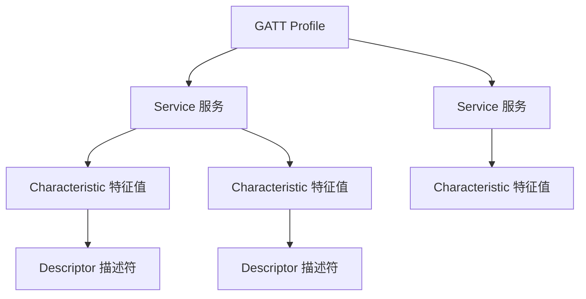
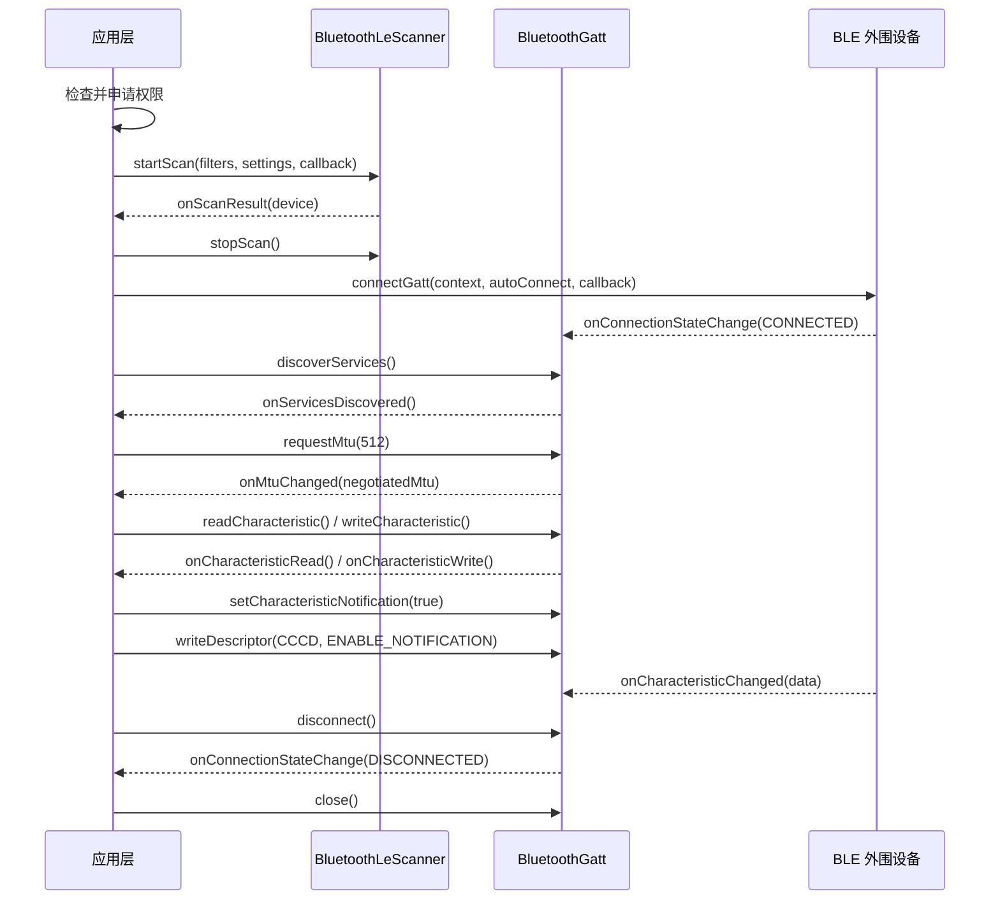

# BLE 低功耗蓝牙通信

## BLE 核心概念

### GAP（通用访问配置文件）

GAP 定义了 BLE 设备的角色与交互方式：

- **广播者（Broadcaster）**：周期性发送广播包，不可连接
- **观察者（Observer）**：扫描广播包，不发起连接
- **中心设备（Central）**：扫描并发起连接（通常是手机）
- **外围设备（Peripheral）**：发送广播并接受连接（通常是传感器/硬件）

### GATT（通用属性配置文件）

GATT 定义了 BLE 连接后的数据交换模型，采用三层结构：



- **Service**：一组相关功能的集合，由 UUID 标识（如心率服务 `0x180D`）
- **Characteristic**：最小的数据单元，支持 Read / Write / Notify / Indicate
- **Descriptor**：特征值的附加元数据（如 CCCD 用于开启通知）

## Android BLE 完整流程



## 关键 API 与代码片段

### 1. 权限申请（Android 12+ 适配）

```kotlin
// AndroidManifest.xml 声明
// <uses-permission android:name="android.permission.BLUETOOTH_SCAN" android:usesPermissionFlags="neverForLocation" />
// <uses-permission android:name="android.permission.BLUETOOTH_CONNECT" />
// <uses-permission android:name="android.permission.ACCESS_FINE_LOCATION" /> <!-- Android 11 及以下需要 -->

private fun checkAndRequestPermissions() {
    val permissions = if (Build.VERSION.SDK_INT >= Build.VERSION_CODES.S) {
        arrayOf(
            Manifest.permission.BLUETOOTH_SCAN,
            Manifest.permission.BLUETOOTH_CONNECT
        )
    } else {
        arrayOf(
            Manifest.permission.ACCESS_FINE_LOCATION
        )
    }

    val needRequest = permissions.filter {
        ContextCompat.checkSelfPermission(this, it) != PackageManager.PERMISSION_GRANTED
    }

    if (needRequest.isNotEmpty()) {
        ActivityCompat.requestPermissions(this, needRequest.toTypedArray(), REQUEST_CODE_BT)
    }
}
```

### 2. 扫描 BLE 设备

```kotlin
private val bluetoothAdapter: BluetoothAdapter? by lazy {
    val manager = getSystemService(Context.BLUETOOTH_SERVICE) as BluetoothManager
    manager.adapter
}

private val scanner: BluetoothLeScanner?
    get() = bluetoothAdapter?.bluetoothLeScanner

private val scanCallback = object : ScanCallback() {
    override fun onScanResult(callbackType: Int, result: ScanResult) {
        val device = result.device
        val rssi = result.rssi
        Log.d(TAG, "发现设备: ${device.name} [${device.address}] RSSI=$rssi")
    }

    override fun onScanFailed(errorCode: Int) {
        Log.e(TAG, "扫描失败，错误码: $errorCode")
    }
}

private fun startBleScan() {
    val filters = listOf(
        ScanFilter.Builder()
            // 可按服务 UUID、设备名称等过滤
            // .setServiceUuid(ParcelUuid(TARGET_SERVICE_UUID))
            .build()
    )
    val settings = ScanSettings.Builder()
        .setScanMode(ScanSettings.SCAN_MODE_LOW_LATENCY) // 前台高速扫描
        .build()

    scanner?.startScan(filters, settings, scanCallback)

    // 超时停止扫描，避免持续耗电
    handler.postDelayed({ scanner?.stopScan(scanCallback) }, SCAN_TIMEOUT_MS)
}
```

### 3. 连接 GATT 并发现服务

```kotlin
private var bluetoothGatt: BluetoothGatt? = null

private val gattCallback = object : BluetoothGattCallback() {

    override fun onConnectionStateChange(gatt: BluetoothGatt, status: Int, newState: Int) {
        when (newState) {
            BluetoothProfile.STATE_CONNECTED -> {
                Log.d(TAG, "已连接 GATT 服务器")
                // 连接成功后延迟发现服务，部分设备需要这个延迟才能稳定工作
                handler.postDelayed({ gatt.discoverServices() }, 300)
            }
            BluetoothProfile.STATE_DISCONNECTED -> {
                Log.d(TAG, "已断开 GATT 连接")
                gatt.close()
            }
        }
    }

    override fun onServicesDiscovered(gatt: BluetoothGatt, status: Int) {
        if (status == BluetoothGatt.GATT_SUCCESS) {
            val service = gatt.getService(TARGET_SERVICE_UUID)
            val characteristic = service?.getCharacteristic(TARGET_CHAR_UUID)
            Log.d(TAG, "服务发现成功，特征值: $characteristic")
        } else {
            Log.e(TAG, "服务发现失败，status=$status")
        }
    }

    override fun onCharacteristicRead(
        gatt: BluetoothGatt, characteristic: BluetoothGattCharacteristic,
        value: ByteArray, status: Int
    ) {
        if (status == BluetoothGatt.GATT_SUCCESS) {
            Log.d(TAG, "读取数据: ${value.toHexString()}")
        }
    }

    override fun onCharacteristicChanged(
        gatt: BluetoothGatt, characteristic: BluetoothGattCharacteristic,
        value: ByteArray
    ) {
        // 收到通知/指示推送的数据
        Log.d(TAG, "收到通知数据: ${value.toHexString()}")
    }

    override fun onMtuChanged(gatt: BluetoothGatt, mtu: Int, status: Int) {
        Log.d(TAG, "MTU 协商结果: $mtu (status=$status)")
    }
}

private fun connectDevice(device: BluetoothDevice) {
    // autoConnect=false 表示直接连接，true 表示设备可用时自动连接
    bluetoothGatt = device.connectGatt(this, false, gattCallback, BluetoothDevice.TRANSPORT_LE)
}
```

### 4. 读写 Characteristic 与开启通知

```kotlin
// 写入数据
private fun writeData(data: ByteArray) {
    val service = bluetoothGatt?.getService(TARGET_SERVICE_UUID) ?: return
    val characteristic = service.getCharacteristic(WRITE_CHAR_UUID) ?: return

    bluetoothGatt?.writeCharacteristic(
        characteristic,
        data,
        BluetoothGattCharacteristic.WRITE_TYPE_DEFAULT
    )
}

// 开启 Characteristic 通知
private fun enableNotification(serviceUuid: UUID, charUuid: UUID) {
    val service = bluetoothGatt?.getService(serviceUuid) ?: return
    val characteristic = service.getCharacteristic(charUuid) ?: return

    bluetoothGatt?.setCharacteristicNotification(characteristic, true)

    // 写入 CCCD 描述符以启用远端通知
    val cccdUuid = UUID.fromString("00002902-0000-1000-8000-00805f9b34fb")
    val descriptor = characteristic.getDescriptor(cccdUuid)
    bluetoothGatt?.writeDescriptor(
        descriptor,
        BluetoothGattDescriptor.ENABLE_NOTIFICATION_VALUE
    )
}
```

## MTU 协商机制

MTU（Maximum Transmission Unit）决定了单次传输的最大数据包大小。

- BLE 默认 MTU = **23 字节**（实际有效载荷 = 20 字节，3 字节为 ATT 协议头）
- Android 可申请的最大 MTU = **517 字节**
- 协商结果取**双方支持值的较小值**

```kotlin
// 连接成功后尽早协商 MTU
bluetoothGatt?.requestMtu(512)
```

**注意事项：**

- 必须在 `onServicesDiscovered` 之前或之后调用，不要与其他 GATT 操作并发
- `onMtuChanged` 返回的才是实际协商结果，不能假设请求值就是最终值
- 实际可用载荷 = MTU - 3（ATT 头部开销）
- 部分设备对 MTU 支持存在 Bug，建议做好回退逻辑

## 常见坑点

### 1. GATT 133 错误

`status=133` 是 Android BLE 中最常见的未知错误，可能原因包括：

- 连接过于频繁（未正确 `close()` 上一次连接）
- 系统 BLE 资源耗尽（同时连接数超过 6-7 个）
- 设备兼容性问题

**排查方案：** 确保每次断开后调用 `gatt.close()`；重试前加延迟（1-2 秒）；必要时通过反射刷新 GATT 缓存。

### 2. 连接超时

- `connectGatt` 不会自动超时，需要应用层自行实现超时机制
- 建议设置 10-30 秒超时，超时后主动 `disconnect()` + `close()`

### 3. Android 设备兼容性

- 部分厂商 ROM 对 BLE 行为有修改，三星、华为、小米表现各异
- `discoverServices()` 在某些设备上需要延迟调用（连接后等待 300-600ms）
- `autoConnect=true` 在不同设备上的重连策略差异很大

### 4. 连接数限制

- Android 系统通常限制同时维持 **6-7 个 BLE 连接**
- 超过限制后新连接会失败或挤掉旧连接
- 建议设计连接池管理机制，及时释放不用的连接

### 5. 线程问题

- `BluetoothGattCallback` 回调在 Binder 线程中执行，**不能直接操作 UI**
- GATT 操作（读、写、发现服务）是异步的且**不能并发**，必须串行化
- 推荐使用队列或 Mutex 确保操作按序执行

## 踩坑记录

> 此区域供团队成员补充项目中遇到的真实案例。

| 日期 | 记录人 | 问题描述 | 解决方案 |
|------|--------|----------|----------|
| | | | |

## 参考资料

- [Android 官方蓝牙概览](https://developer.android.com/develop/connectivity/bluetooth)
- [Android BLE 指南](https://developer.android.com/develop/connectivity/bluetooth/ble/ble-overview)
- [Nordic Android-BLE-Library](https://github.com/NordicSemiconductor/Android-BLE-Library)
- [RxAndroidBle](https://github.com/dariuszseweryn/RxAndroidBle)
- [BLE 核心规范（Bluetooth SIG）](https://www.bluetooth.com/specifications/specs/core-specification/)
