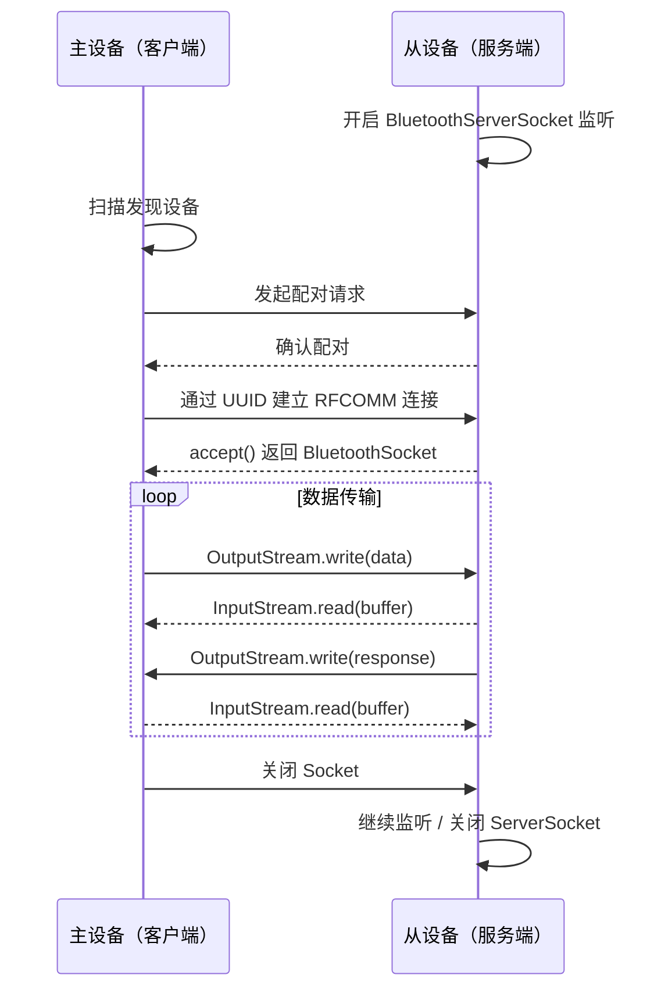
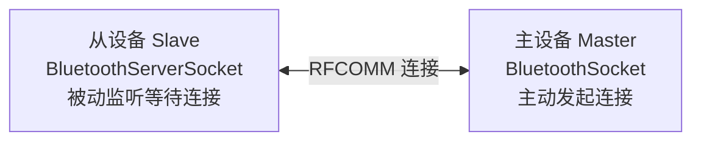

# 经典蓝牙主从模式通信

## 经典蓝牙核心概念

### RFCOMM

RFCOMM（Radio Frequency Communication）是蓝牙协议栈中模拟 RS-232 串口的传输协议，提供可靠的流式数据通道。它是经典蓝牙应用层通信的基础。

### SPP（Serial Port Profile）

SPP 基于 RFCOMM，定义了蓝牙设备之间模拟串口通信的标准流程。Android 中使用 `BluetoothSocket` / `BluetoothServerSocket` 来实现 SPP 通信。

### UUID

UUID 用于标识蓝牙服务。SPP 的标准 UUID 为：

```
00001101-0000-1000-8000-00805F9B34FB
```

通信双方必须使用**相同的 UUID** 才能建立 RFCOMM 连接。自定义应用可以使用自定义 UUID，但主从双方需保持一致。

## 主从模式工作原理



**角色说明：**



- **主设备（Master / 客户端）**：主动发起扫描和连接
- **从设备（Slave / 服务端）**：监听连接请求，被动接受

## Android 实现流程

### 1. 权限声明与申请

```kotlin
// AndroidManifest.xml
// <uses-permission android:name="android.permission.BLUETOOTH_CONNECT" />
// <uses-permission android:name="android.permission.BLUETOOTH_SCAN" />
// <uses-permission android:name="android.permission.ACCESS_FINE_LOCATION" /> <!-- Android 11 及以下 -->

private val bluetoothAdapter: BluetoothAdapter? by lazy {
    val manager = getSystemService(Context.BLUETOOTH_SERVICE) as BluetoothManager
    manager.adapter
}
```

### 2. 发现设备

```kotlin
private val foundDevices = mutableListOf<BluetoothDevice>()

private val discoveryReceiver = object : BroadcastReceiver() {
    override fun onReceive(context: Context, intent: Intent) {
        when (intent.action) {
            BluetoothDevice.ACTION_FOUND -> {
                val device = intent.getParcelableExtra<BluetoothDevice>(
                    BluetoothDevice.EXTRA_DEVICE
                ) ?: return
                Log.d(TAG, "发现设备: ${device.name} [${device.address}]")
                foundDevices.add(device)
            }
            BluetoothAdapter.ACTION_DISCOVERY_FINISHED -> {
                Log.d(TAG, "扫描完成，共发现 ${foundDevices.size} 个设备")
            }
        }
    }
}

private fun startDiscovery() {
    val filter = IntentFilter().apply {
        addAction(BluetoothDevice.ACTION_FOUND)
        addAction(BluetoothAdapter.ACTION_DISCOVERY_FINISHED)
    }
    registerReceiver(discoveryReceiver, filter)

    // 取消可能进行中的扫描，避免冲突
    bluetoothAdapter?.cancelDiscovery()
    bluetoothAdapter?.startDiscovery()
}
```

### 3. 作为服务端（从设备）— BluetoothServerSocket

```kotlin
class BluetoothServer(
    private val adapter: BluetoothAdapter,
    private val onConnected: (BluetoothSocket) -> Unit
) {
    companion object {
        private const val SERVICE_NAME = "MyBluetoothService"
        private val SPP_UUID: UUID = UUID.fromString("00001101-0000-1000-8000-00805F9B34FB")
    }

    @Volatile
    private var isRunning = true
    private var serverSocket: BluetoothServerSocket? = null

    fun start() {
        isRunning = true
        thread(name = "BT-Server") {
            try {
                serverSocket = adapter.listenUsingRfcommWithServiceRecord(SERVICE_NAME, SPP_UUID)
                Log.d(TAG, "服务端开始监听...")

                while (isRunning) {
                    try {
                        // accept() 会阻塞，直到有客户端连接或 serverSocket 被关闭
                        val socket = serverSocket?.accept() ?: break
                        Log.d(TAG, "客户端已连接: ${socket.remoteDevice.address}")
                        onConnected(socket)
                    } catch (e: IOException) {
                        if (isRunning) {
                            Log.e(TAG, "accept 失败", e)
                        }
                    }
                }
            } catch (e: IOException) {
                Log.e(TAG, "创建 ServerSocket 失败", e)
            }
        }
    }

    fun stop() {
        isRunning = false
        try {
            serverSocket?.close()
        } catch (e: IOException) {
            Log.e(TAG, "关闭 ServerSocket 失败", e)
        }
    }
}
```

### 4. 作为客户端（主设备）— BluetoothSocket

```kotlin
class BluetoothClient(
    private val adapter: BluetoothAdapter
) {
    companion object {
        private val SPP_UUID: UUID = UUID.fromString("00001101-0000-1000-8000-00805F9B34FB")
        private const val MAX_RETRY = 3
    }

    fun connect(
        device: BluetoothDevice,
        onConnected: (BluetoothSocket) -> Unit,
        onError: (Exception) -> Unit
    ) {
        thread(name = "BT-Client") {
            // 连接前必须停止扫描，否则会严重影响连接速度和成功率
            adapter.cancelDiscovery()

            var lastException: Exception? = null

            repeat(MAX_RETRY) { attempt ->
                try {
                    val socket = device.createRfcommSocketToServiceRecord(SPP_UUID)
                    Log.d(TAG, "第 ${attempt + 1} 次尝试连接 ${device.address}...")
                    socket.connect() // 阻塞调用
                    Log.d(TAG, "连接成功")
                    onConnected(socket)
                    return@thread
                } catch (e: IOException) {
                    Log.e(TAG, "第 ${attempt + 1} 次连接失败", e)
                    lastException = e
                    // 重试前等待，避免过于频繁
                    Thread.sleep(1000L * (attempt + 1))
                }
            }

            // 所有重试均失败，尝试反射方式兜底（部分设备需要）
            try {
                val fallbackSocket = device.javaClass
                    .getMethod("createRfcommSocket", Int::class.java)
                    .invoke(device, 1) as BluetoothSocket
                fallbackSocket.connect()
                Log.d(TAG, "反射方式连接成功")
                onConnected(fallbackSocket)
            } catch (e: Exception) {
                Log.e(TAG, "所有连接方式均失败", e)
                onError(lastException ?: e)
            }
        }
    }
}
```

### 5. 数据传输的线程安全与流管理

```kotlin
class BluetoothDataTransfer(private val socket: BluetoothSocket) {

    private val inputStream: InputStream = socket.inputStream
    private val outputStream: OutputStream = socket.outputStream

    @Volatile
    private var isRunning = true

    /**
     * 在独立线程中持续读取数据。
     * [onDataReceived] 回调在工作线程中执行，如需更新 UI 请切换到主线程。
     */
    fun startReading(onDataReceived: (ByteArray, Int) -> Unit) {
        thread(name = "BT-Read") {
            val buffer = ByteArray(1024)
            while (isRunning) {
                try {
                    val bytesRead = inputStream.read(buffer)
                    if (bytesRead > 0) {
                        onDataReceived(buffer.copyOf(bytesRead), bytesRead)
                    }
                } catch (e: IOException) {
                    if (isRunning) {
                        Log.e(TAG, "读取数据异常", e)
                    }
                    break
                }
            }
        }
    }

    /**
     * 线程安全的写入方法。
     * 使用 synchronized 防止多线程并发写入导致数据混乱。
     */
    @Synchronized
    fun write(data: ByteArray) {
        try {
            outputStream.write(data)
            outputStream.flush()
        } catch (e: IOException) {
            Log.e(TAG, "写入数据异常", e)
            throw e
        }
    }

    /**
     * 大数据分包发送。
     * [chunkSize] 建议不超过 1024 字节，避免底层缓冲区溢出。
     */
    @Synchronized
    fun writeLargeData(data: ByteArray, chunkSize: Int = 512) {
        try {
            var offset = 0
            while (offset < data.size) {
                val end = minOf(offset + chunkSize, data.size)
                outputStream.write(data, offset, end - offset)
                outputStream.flush()
                offset = end
                // 分包间隔，给接收端处理时间
                Thread.sleep(20)
            }
        } catch (e: IOException) {
            Log.e(TAG, "大数据写入异常", e)
            throw e
        }
    }

    fun close() {
        isRunning = false
        try {
            inputStream.close()
        } catch (_: IOException) {}
        try {
            outputStream.close()
        } catch (_: IOException) {}
        try {
            socket.close()
        } catch (_: IOException) {}
    }
}
```

## 常见坑点

### 1. 配对失败处理

- 首次连接未配对的设备时，系统会弹出配对对话框；用户拒绝后 `connect()` 抛出 `IOException`
- 部分设备配对后仍连接失败，需手动清除配对信息后重试
- 可通过 `BluetoothDevice.ACTION_BOND_STATE_CHANGED` 广播监听配对状态

### 2. UUID 不匹配

- 主从双方必须使用**完全相同的 UUID**，否则连接必定失败
- 如果从设备使用标准 SPP UUID（`00001101-...`），主设备也必须用同一个
- 自定义 UUID 时注意格式，必须是合法的 128-bit UUID 字符串

### 3. 连接不稳定

- **必须在连接前停止设备扫描**（`cancelDiscovery()`），扫描与连接共用天线资源
- 物理距离过远、障碍物、2.4GHz 频段干扰都会导致断连
- 建议实现心跳机制检测连接状态，配合自动重连策略

### 4. 大数据传输

- RFCOMM 单次 `write()` 过大可能导致数据截断或异常
- 建议分包发送，每包 512-1024 字节，包间加短延时
- 接收端需要自行拼包，设计好数据帧协议（包头 + 长度 + 数据 + 校验）

### 5. `createRfcommSocketToServiceRecord` 失败

- 部分 Android 设备使用标准 API 连接失败，需要通过反射调用 `createRfcommSocket(int channel)` 兜底
- 这是一个已知的 Android 兼容性问题，反射方式并非官方推荐，但在生产中广泛使用

## 踩坑记录

> 此区域供团队成员补充项目中遇到的真实案例。

| 日期 | 记录人 | 问题描述 | 解决方案 |
|------|--------|----------|----------|
| | | | |

## 参考资料

- [Android 官方经典蓝牙指南](https://developer.android.com/develop/connectivity/bluetooth)
- [Bluetooth RFCOMM 协议规范](https://www.bluetooth.com/specifications/specs/rfcomm/)
- [Android BluetoothSocket API](https://developer.android.com/reference/android/bluetooth/BluetoothSocket)
- [Android BluetoothServerSocket API](https://developer.android.com/reference/android/bluetooth/BluetoothServerSocket)
