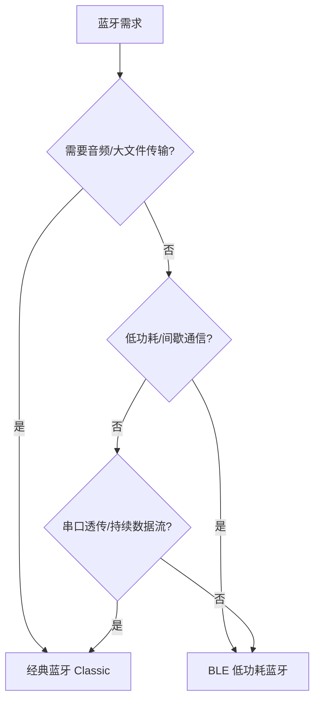

# 蓝牙通信概要

## 核心原理

Android 蓝牙协议栈采用分层架构，自上而下为：

```
Application（应用层）
    ↓
Framework（Android Bluetooth API）
    ↓
Bluetooth Stack（Fluoride / Gabeldorsche）
    ↓
HCI（Host Controller Interface）
    ↓
Controller（蓝牙硬件芯片）
```

**BLE（低功耗蓝牙）与经典蓝牙的本质区别：**

| 维度 | 经典蓝牙（Classic） | BLE（低功耗） |
|------|---------------------|---------------|
| 功耗 | 较高，适合持续传输 | 极低，适合间歇通信 |
| 传输速率 | 最高 3 Mbps（EDR） | 最高 2 Mbps（BLE 5.0） |
| 连接模式 | 面向连接（RFCOMM/SPP） | 基于 GATT 属性读写 |
| 典型场景 | 音频、文件传输、串口透传 | 传感器、穿戴设备、信标 |
| 配对要求 | 通常需要配对 | 可不配对直接连接 |

## 发展趋势与版本演进

| Android 版本 | 关键变化 |
|-------------|---------|
| 4.3 (API 18) | 首次引入 BLE 中心模式 API |
| 5.0 (API 21) | 新增 BLE 外围模式、扫描过滤器 |
| 6.0 (API 23) | **BLE 扫描需要位置权限 + 开启位置服务** |
| 8.0 (API 26) | `CompanionDeviceManager` 简化配对、后台扫描限制增强 |
| 10 (API 29) | **后台应用无法启动蓝牙扫描**，`ACCESS_FINE_LOCATION` 成为必须 |
| 12 (API 31) | **全新蓝牙权限模型**：`BLUETOOTH_SCAN`、`BLUETOOTH_CONNECT`、`BLUETOOTH_ADVERTISE` 取代旧权限；不再强制位置权限（需声明 `neverForLocation`） |
| 13+ (API 33+) | 持续强化隐私，推荐使用 `CompanionDeviceManager` |

## 主流方案与开源项目对比

| 方案 | 类型 | 优势 | 劣势 | 推荐场景 |
|------|------|------|------|---------|
| **原生 API** | 系统 API | 无依赖、灵活度最高 | 回调嵌套深、兼容性需自行处理 | 需要精细控制的场景 |
| **RxAndroidBle** | 开源库 | RxJava 链式调用、自动重连 | 依赖 RxJava 体系 | 已采用 RxJava 的项目 |
| **Nordic Android-BLE-Library** | 开源库 | 队列化操作、LiveData 集成 | 上手有一定学习成本 | 需要稳定 BLE 通信的项目 |
| **FastBle** | 开源库 | API 简洁、中文文档 | 维护频率较低 | 快速原型、简单 BLE 需求 |

## 适用场景与选型建议



- **选 BLE**：传感器数据采集、穿戴设备交互、iBeacon/信标、固件 OTA
- **选经典蓝牙**：蓝牙音箱/耳机、打印机通信、SPP 串口透传、大文件传输

## 快速上手路径

建议按以下顺序阅读本模块文档：

1. **本文**（`00-overview.md`）— 建立全局认知
2. [`01-BLE低功耗蓝牙ble-communication.md`](01-BLE低功耗蓝牙ble-communication.md) — BLE 低功耗蓝牙详解
3. [`02-经典蓝牙主从模式classic-bluetooth-master-slave.md`](02-经典蓝牙主从模式classic-bluetooth-master-slave.md) — 经典蓝牙主从模式详解
