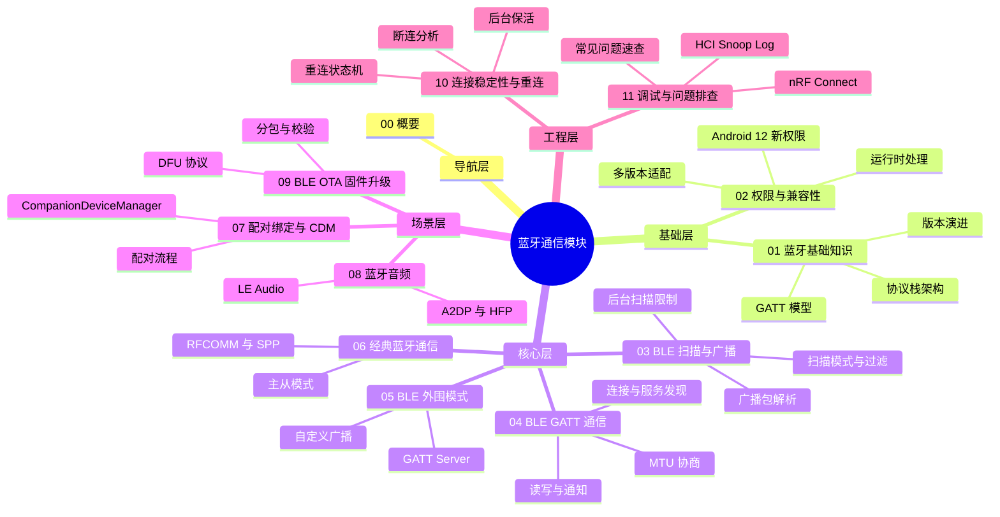
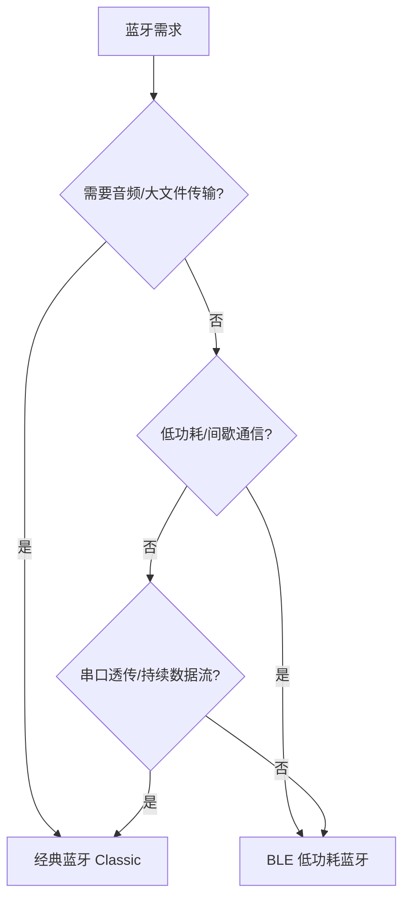
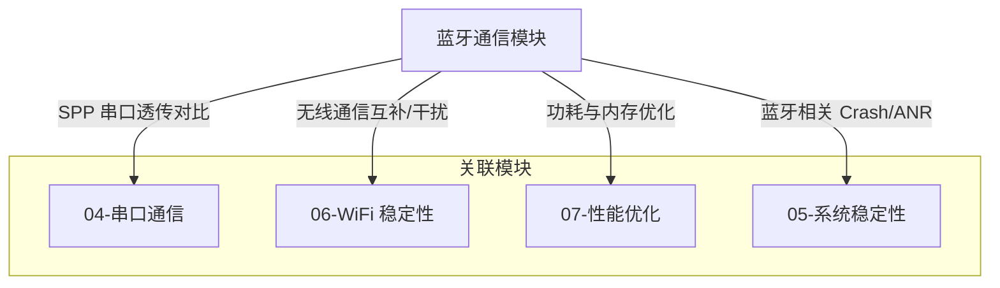

# 蓝牙通信 - 概要

## 模块定位

蓝牙通信是 Android 设备与外部硬件交互的核心能力之一。无论是 BLE 传感器数据采集、经典蓝牙音频传输、穿戴设备交互，还是固件 OTA 升级，都依赖一套成熟的蓝牙技术体系。

本模块覆盖以下核心领域：

| 领域 | 说明 | 对应文件 |
|------|------|----------|
| 蓝牙基础知识 | 协议栈架构、版本演进、GATT 模型 | `01-蓝牙基础知识` |
| 权限与兼容性 | Android 各版本权限模型、运行时处理、多版本适配 | `02-权限与兼容性` |
| BLE 扫描与广播 | 扫描模式、过滤器、广播包解析、后台限制 | `03-BLE扫描与广播` |
| BLE GATT 通信 | 连接、服务发现、读写通知、MTU、操作队列 | `04-BLE-GATT通信` |
| BLE 外围模式 | GATT Server、Advertiser、外围设备开发 | `05-BLE外围模式` |
| 经典蓝牙通信 | RFCOMM/SPP、设备发现、主从模式、数据流 | `06-经典蓝牙通信` |
| 配对绑定与 CompanionDevice | 配对方式、绑定管理、CDM 现代化 API | `07-配对绑定与CompanionDevice` |
| 蓝牙音频 | A2DP、HFP、LE Audio、音频路由 | `08-蓝牙音频` |
| BLE OTA 固件升级 | DFU 协议、Nordic 库、自定义 OTA | `09-BLE-OTA固件升级` |
| 连接稳定性与重连 | 断连分析、重连策略、状态机、后台保活 | `10-连接稳定性与重连` |
| 调试与问题排查 | HCI Snoop、nRF Connect、常见问题速查 | `11-调试与问题排查` |

## 知识全景图



## 核心原理

Android 蓝牙协议栈采用分层架构，自上而下为：

```
Application（应用层）
    ↓
Framework（Android Bluetooth API）
    ↓
Bluetooth Stack（Fluoride / Gabeldorsche）
    ↓
HCI（Host Controller Interface）
    ↓
Controller（蓝牙硬件芯片）
```

**BLE（低功耗蓝牙）与经典蓝牙的本质区别：**

| 维度 | 经典蓝牙（Classic） | BLE（低功耗） |
|------|---------------------|---------------|
| 功耗 | 较高，适合持续传输 | 极低，适合间歇通信 |
| 传输速率 | 最高 3 Mbps（EDR） | 最高 2 Mbps（BLE 5.0） |
| 连接模式 | 面向连接（RFCOMM/SPP） | 基于 GATT 属性读写 |
| 典型场景 | 音频、文件传输、串口透传 | 传感器、穿戴设备、信标 |
| 配对要求 | 通常需要配对 | 可不配对直接连接 |

## 发展趋势与版本演进

| Android 版本 | 关键变化 |
|-------------|---------|
| 4.3 (API 18) | 首次引入 BLE 中心模式 API |
| 5.0 (API 21) | 新增 BLE 外围模式、扫描过滤器 |
| 6.0 (API 23) | **BLE 扫描需要位置权限 + 开启位置服务** |
| 8.0 (API 26) | `CompanionDeviceManager` 简化配对、后台扫描限制增强 |
| 10 (API 29) | **后台应用无法启动蓝牙扫描**，`ACCESS_FINE_LOCATION` 成为必须 |
| 12 (API 31) | **全新蓝牙权限模型**：`BLUETOOTH_SCAN`、`BLUETOOTH_CONNECT`、`BLUETOOTH_ADVERTISE` 取代旧权限 |
| 13+ (API 33+) | 持续强化隐私，推荐使用 `CompanionDeviceManager`；LE Audio 支持 |

## 主流方案与开源项目对比

| 方案 | 类型 | 优势 | 劣势 | 推荐场景 |
|------|------|------|------|---------|
| **原生 API** | 系统 API | 无依赖、灵活度最高 | 回调嵌套深、兼容性需自行处理 | 需要精细控制的场景 |
| **RxAndroidBle** | 开源库 | RxJava 链式调用、自动重连 | 依赖 RxJava 体系 | 已采用 RxJava 的项目 |
| **Nordic Android-BLE-Library** | 开源库 | 队列化操作、LiveData 集成 | 上手有一定学习成本 | 需要稳定 BLE 通信的项目 |
| **FastBle** | 开源库 | API 简洁、中文文档 | 维护频率较低 | 快速原型、简单 BLE 需求 |

## 适用场景与选型建议



- **选 BLE**：传感器数据采集、穿戴设备交互、iBeacon/信标、固件 OTA
- **选经典蓝牙**：蓝牙音箱/耳机、打印机通信、SPP 串口透传、大文件传输

## 模块间关系



## 推荐阅读路径

### 新人入门路径

适合刚接触 Android 蓝牙开发的开发者，按顺序阅读：


1. **概要**（本文）— 建立全局认知
2. **蓝牙基础知识** — 理解协议栈、版本、GATT 模型
3. **权限与兼容性** — 掌握 Android 蓝牙权限适配
4. **BLE 扫描与广播** — 学会扫描设备
5. **BLE GATT 通信** — 掌握 BLE 数据交互核心

### 按需深入路径

已有基础的开发者，根据当前任务选择对应文件：

| 你的任务 | 推荐阅读 |
|----------|----------|
| 需要 Android 作为 BLE 外围设备 | `05-BLE外围模式` |
| 需要经典蓝牙 SPP 通信 | `06-经典蓝牙通信` |
| 需要处理配对流程或用 CDM | `07-配对绑定与CompanionDevice` |
| 需要对接蓝牙音箱/耳机/LE Audio | `08-蓝牙音频` |
| 需要实现 BLE 固件 OTA 升级 | `09-BLE-OTA固件升级` |
| 蓝牙连接不稳定需要优化 | `10-连接稳定性与重连` |
| 蓝牙功能出 Bug 需要排查 | `11-调试与问题排查` |

## 踩坑记录

> 此区域供团队成员补充项目中遇到的真实案例。

| 日期 | 记录人 | 问题描述 | 解决方案 |
|------|--------|----------|----------|
| | | | |

## 参考资料

- [Android Bluetooth Overview](https://developer.android.com/develop/connectivity/bluetooth)
- [Android BLE Guide](https://developer.android.com/develop/connectivity/bluetooth/ble/ble-overview)
- [Bluetooth SIG Specifications](https://www.bluetooth.com/specifications/)
- [Nordic Android-BLE-Library](https://github.com/NordicSemiconductor/Android-BLE-Library)
- [RxAndroidBle](https://github.com/dariuszseweryn/RxAndroidBle)
