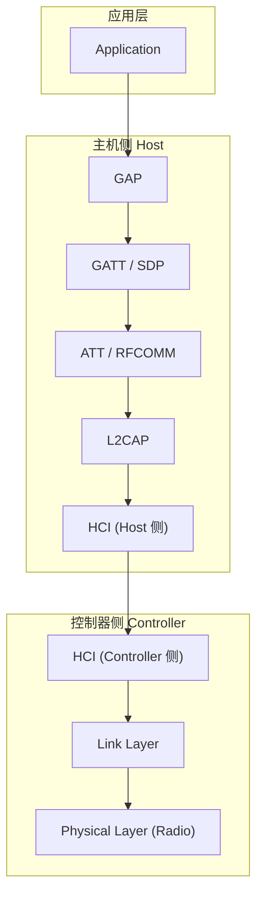
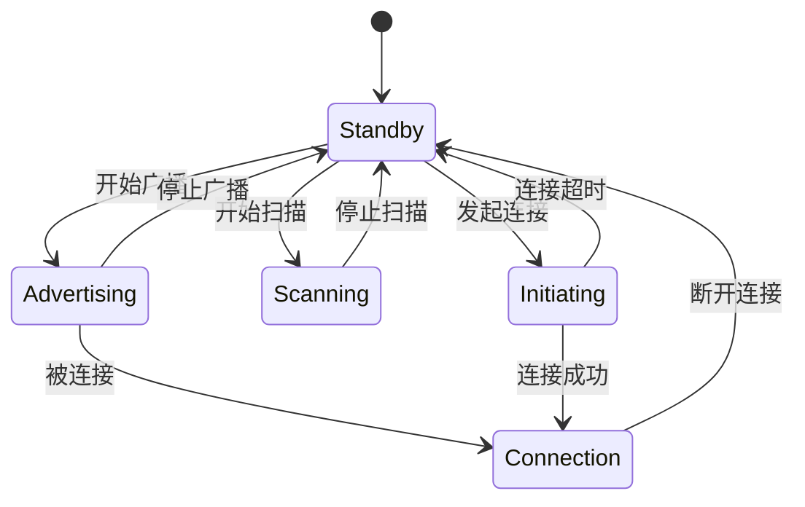
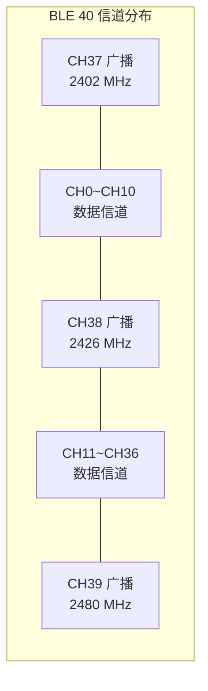
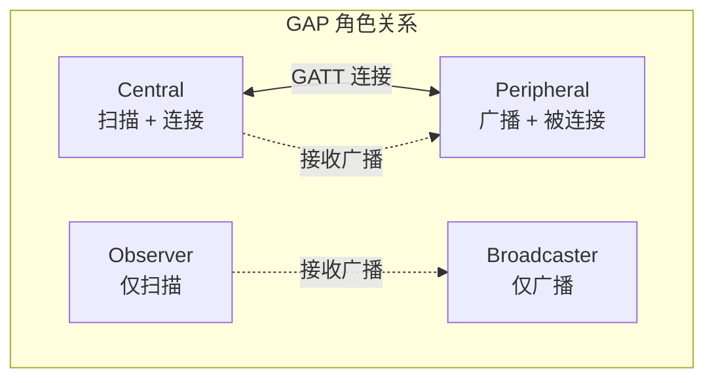
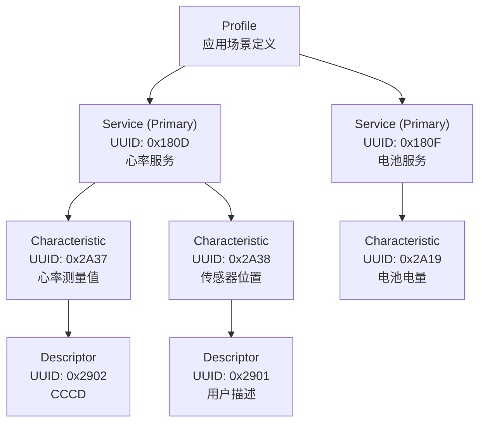

# 蓝牙基础知识

## 蓝牙协议栈分层架构

蓝牙协议栈是理解所有蓝牙通信的基础。Android 蓝牙开发虽然主要在 Framework 层操作 API，但理解底层分层有助于排查问题和理解性能瓶颈。



### Physical Layer（物理层）

物理层负责射频信号的发送与接收，是蓝牙通信的最底层。

**关键参数：**
- 工作频段：2.4 GHz ISM 频段（2402 ~ 2480 MHz）
- BLE 使用 40 个信道（每个 2 MHz 带宽），其中 3 个广播信道、37 个数据信道
- 经典蓝牙使用 79 个信道（每个 1 MHz 带宽）
- 蓝牙 5.0 引入 LE 2M PHY（2 Mbps）和 LE Coded PHY（Long Range，125 kbps / 500 kbps）

| PHY 模式 | 符号速率 | 有效吞吐 | 特点 |
|----------|----------|----------|------|
| LE 1M | 1 Msym/s | ~800 kbps | BLE 4.x 默认，兼容性最好 |
| LE 2M | 2 Msym/s | ~1400 kbps | BLE 5.0+，速度翻倍，功耗略降 |
| LE Coded S=2 | 1 Msym/s | ~500 kbps | BLE 5.0+，通信距离 2 倍 |
| LE Coded S=8 | 1 Msym/s | ~125 kbps | BLE 5.0+，通信距离 4 倍 |

### Link Layer（链路层）

链路层管理设备间的连接状态和数据包的组装与校验。

**核心职责：**
- 广播（Advertising）与扫描（Scanning）状态管理
- 连接建立与维护（Connection Events）
- 自适应跳频（AFH），避开干扰信道
- 数据包的 CRC 校验与重传

**BLE 链路层状态机：**



### L2CAP（逻辑链路控制与适配协议）

L2CAP（Logical Link Control and Adaptation Protocol）是蓝牙协议栈的"多路复用层"，负责将上层多种协议的数据通过同一条物理链路传输。

**核心功能：**
- **协议多路复用**：通过 CID（Channel Identifier）区分不同上层协议
- **分段与重组**：将大数据包分片为链路层可承载的小包传输
- **流量控制**：基于信用的流控机制（LE Credit Based Flow Control）
- BLE 固定使用 CID 0x0004（ATT）和 0x0006（信令）

### ATT 与 SDP

**ATT（Attribute Protocol）** 是 BLE 数据交换的基础协议，定义了属性的读写规则：
- 每个属性由 Handle（句柄）、Type（UUID）、Value（值）、Permissions（权限）构成
- 操作原语：Read / Write / Notify / Indicate / Write Without Response
- ATT 运行在 L2CAP 的固定通道（CID 0x0004）上

**SDP（Service Discovery Protocol）** 是经典蓝牙的服务发现机制：
- 用于查询远端设备支持的 Profile 和服务
- BLE 不使用 SDP，改用 GATT 进行服务发现

| 维度 | ATT（BLE） | SDP（Classic） |
|------|-----------|---------------|
| 用途 | 属性读写与通知 | 服务发现 |
| 适用于 | BLE 设备 | 经典蓝牙设备 |
| 数据模型 | Attribute（Handle + UUID + Value） | Service Record |
| 发现方式 | GATT Service Discovery | SDP Query |

### GATT 与 RFCOMM

**GATT（Generic Attribute Profile）** 建立在 ATT 之上，是 BLE 数据交互的核心框架（下文详述）。

**RFCOMM（Radio Frequency Communication）** 是经典蓝牙的串口模拟协议：
- 在 L2CAP 之上提供串口（RS-232）仿真
- SPP（Serial Port Profile）基于 RFCOMM 实现
- 每个 RFCOMM 连接对应一个虚拟串口通道
- 最多支持 30 个并发通道（实际受设备限制）

### Profile 与 Application

Profile 是蓝牙规范中定义的标准化应用场景，规定了设备间交互的行为和数据格式。

**BLE 常见 Profile：**

| Profile | 说明 | 典型设备 |
|---------|------|----------|
| Heart Rate Profile | 心率数据传输 | 心率带、手表 |
| Blood Pressure Profile | 血压数据 | 血压计 |
| HID over GATT (HOGP) | 人机接口设备 | BLE 键盘、鼠标 |
| Battery Service | 电池电量 | 几乎所有 BLE 设备 |
| Device Information Service | 设备信息 | 通用 |

**经典蓝牙常见 Profile：**

| Profile | 说明 | 典型设备 |
|---------|------|----------|
| A2DP | 高质量音频传输 | 蓝牙耳机、音箱 |
| HFP | 免提通话 | 车载系统、耳机 |
| SPP | 串口数据传输 | 工业设备、打印机 |
| HID | 人机接口 | 经典蓝牙键盘、游戏手柄 |
| PAN | 个人区域网络 | 网络共享 |

## 蓝牙版本演进

蓝牙规范由 Bluetooth SIG 维护，每个大版本都带来关键能力提升。对 Android 开发者而言，需重点关注 4.0 以后的 BLE 相关演进。

### Bluetooth 4.0 — BLE 的诞生

**发布时间：** 2010 年

Bluetooth 4.0 最大的变革是引入 BLE（Bluetooth Low Energy），也称 Bluetooth Smart。

**核心特性：**
- 全新的低功耗物理层和链路层，独立于经典蓝牙
- 引入 GATT / ATT 数据模型
- 广播（Advertising）机制，支持无连接数据传输
- 峰值功耗仅为经典蓝牙的 1/10 ~ 1/100
- Android 4.3（API 18）首次支持 BLE Central 模式

### Bluetooth 4.2 — LE Data Length Extension

**发布时间：** 2014 年

**核心特性：**
- **LE Data Length Extension (DLE)**：单个 L2CAP 数据包从 27 字节扩展到 251 字节，有效吞吐提升约 2.5 倍
- **LE Secure Connections**：引入 ECDH（椭圆曲线 Diffie-Hellman）密钥交换，提升配对安全性
- **LE Privacy 1.2**：改进隐私地址机制，防止设备追踪

**对 Android 开发的影响：** DLE 是提升 BLE 传输速率的关键特性，Android 会在连接建立后自动协商 DLE（如双端都支持）。

### Bluetooth 5.0 — 2M PHY 与 Long Range

**发布时间：** 2016 年

**核心特性：**
- **LE 2M PHY**：符号速率翻倍至 2 Msym/s，有效吞吐提升约 80%
- **LE Coded PHY（Long Range）**：通过前向纠错编码（FEC），通信距离可达经典 BLE 的 4 倍（理论 400m+）
- **Extended Advertising**：广播数据从 31 字节扩展到 255 字节，支持链式广播包
- **Advertising Sets**：支持多组广播同时运行

**Android 支持：**
- Android 8.0（API 26）引入 `BluetoothAdapter.isLe2MPhySupported()` 和 `isLeCodedPhySupported()`
- `connectGatt()` 新增 PHY 参数选择
- 需要硬件芯片支持，并非所有 Android 8.0+ 设备都支持 5.0 特性

### Bluetooth 5.1 — AoA / AoD 测向定位

**发布时间：** 2019 年

**核心特性：**
- **AoA（Angle of Arrival）/ AoD（Angle of Departure）**：基于相位差的高精度方向测量，定位精度可达厘米级
- 为室内定位、资产追踪等场景提供标准化方案

**Android 支持：** Android 尚未提供标准 AoA/AoD API，但部分芯片厂商（如 Nordic、TI）提供自定义 SDK。

### Bluetooth 5.2 — LE Audio 与 Isochronous Channels

**发布时间：** 2020 年

**核心特性：**
- **LE Audio**：基于 BLE 的全新音频架构，使用 LC3 编解码（比 SBC 在同等码率下音质显著更好）
- **Isochronous Channels**：支持时间同步的数据传输，是 LE Audio 的底层支撑
- **Auracast**：广播音频，允许一个设备向多个接收端同时发送音频（如公共场所翻译、助听）
- **Multi-Stream Audio**：真正的独立左右声道传输（真无线耳机不再需要中继）

**Android 支持：** Android 13（API 33）开始支持 LE Audio，但依赖硬件芯片和外围设备的同步支持。

### Bluetooth 5.3 — Connection Subrating

**发布时间：** 2021 年

**核心特性：**
- **Connection Subrating**：允许在保持连接的情况下动态切换 Connection Interval，无需断开重连。在空闲时使用长间隔（省电），有数据时切换短间隔（低延迟）
- **Channel Classification Enhancement**：改进的信道分类机制，更快适应干扰环境
- **Periodic Advertising Enhancement**：周期性广播改进

### Bluetooth 5.4+ — 最新演进

**Bluetooth 5.4（2023 年）** 引入 PAwR（Periodic Advertising with Responses），允许广播者与观察者之间双向通信，适用于大规模电子货架标签等场景。

**Bluetooth 6.0（2024 年）** 引入 Channel Sounding，提供高精度测距能力（厘米级距离估计），为数字钥匙、距离感知等场景提供标准化方案。

### 蓝牙版本特性总览

| 版本 | 年份 | 关键特性 | Android 最低版本 |
|------|------|----------|-----------------|
| 4.0 | 2010 | BLE 引入 | Android 4.3 (API 18) |
| 4.2 | 2014 | DLE、LE Secure Connections | Android 5.0+ |
| 5.0 | 2016 | 2M PHY、Long Range、Extended Advertising | Android 8.0 (API 26) |
| 5.1 | 2019 | AoA/AoD 测向定位 | 无标准 API |
| 5.2 | 2020 | LE Audio、LC3、Auracast | Android 13 (API 33) |
| 5.3 | 2021 | Connection Subrating | Android 14+ (部分) |
| 5.4 | 2023 | PAwR 双向广播 | 待支持 |
| 6.0 | 2024 | Channel Sounding 测距 | 待支持 |

## BLE 与 Classic 的底层区别

BLE 和经典蓝牙虽共用"蓝牙"之名，但在底层实现上是两套独立的技术体系。

### 物理层差异

| 维度 | 经典蓝牙 | BLE |
|------|---------|-----|
| 信道数 | 79 个（1 MHz/信道） | 40 个（2 MHz/信道） |
| 调制方式 | GFSK / π/4-DQPSK / 8DPSK | GFSK |
| 最大数据速率 | 3 Mbps（EDR） | 2 Mbps（LE 2M PHY） |
| 发射功率 | Class 1: 100 mW / Class 2: 2.5 mW | 通常 0 ~ 10 dBm |
| 峰值电流 | ~30 mA | ~15 mA |
| 空闲功耗 | 较高（持续维护连接） | 极低（可深度休眠） |

### 信道与跳频机制

**经典蓝牙** 使用 79 信道的自适应跳频（AFH），主设备在每个时隙（625 μs）切换信道，从设备同步跟随。

**BLE** 使用 40 信道：
- 3 个广播信道（37、38、39）：分布在频段两端和中间，避开 WiFi 信道 1/6/11 的干扰
- 37 个数据信道：连接建立后使用，同样采用 AFH 跳频



### 连接方式对比

| 维度 | 经典蓝牙 | BLE |
|------|---------|-----|
| 发现方式 | Inquiry（查询扫描） | Advertising（广播扫描） |
| 发现耗时 | 较慢（约 10s） | 较快（数百毫秒） |
| 连接建立 | Page / Page Scan | Connection Request |
| 数据交换模型 | 面向流（RFCOMM） | 面向属性（GATT） |
| 最大并发连接 | 7 个 Active Slave | Android 通常 7~15 个 |
| 无连接数据传输 | 不支持 | 支持（广播） |

## GAP 角色模型

GAP（Generic Access Profile）定义了蓝牙设备如何被发现、连接以及交互的基本行为。

### Central（中心设备）

Central 是 BLE 连接中的主动发起方，负责扫描广播并建立连接。在 Android 开发中，手机通常充当 Central 角色。

**典型行为：** 扫描 → 发现设备 → 发起连接 → 作为 GATT Client 读写数据

### Peripheral（外围设备）

Peripheral 是 BLE 连接中的被动方，通过广播自身存在等待被连接。传感器、穿戴设备、智能锁等通常是 Peripheral。

**典型行为：** 广播 → 接受连接 → 作为 GATT Server 响应读写请求

### Observer（观察者）

Observer 只扫描广播包但不建立连接。适用于仅需收集广播数据的场景（如 iBeacon 信号采集）。

### Broadcaster（广播者）

Broadcaster 只发送广播数据但不接受连接。适用于单向数据广播场景（如温度信标、Auracast 音频发送端）。



**Android 设备可同时扮演多个角色：** 例如手机作为 Central 连接手环，同时作为 Peripheral 被平板连接。但并非所有设备硬件都支持 Peripheral 模式。

## GATT 数据模型详解

GATT（Generic Attribute Profile）是 BLE 数据交互的核心框架，理解 GATT 模型是进行 BLE 开发的前提。

### Profile → Service → Characteristic → Descriptor

GATT 采用分层数据模型，自顶向下为：



**各层含义：**

| 层级 | 说明 | 示例 |
|------|------|------|
| **Profile** | 定义一组 Service 的组合，描述完整应用场景 | Heart Rate Profile |
| **Service** | 功能的逻辑分组，包含一组相关的 Characteristic | Heart Rate Service (0x180D) |
| **Characteristic** | 数据的基本单元，包含一个值和若干描述符 | Heart Rate Measurement (0x2A37) |
| **Descriptor** | 对 Characteristic 的补充描述或配置 | CCCD (0x2902) 用于开关通知 |

**关键 Descriptor — CCCD（Client Characteristic Configuration Descriptor，UUID 0x2902）：**

CCCD 是最重要的 Descriptor，Client 通过写入 CCCD 来开启/关闭 Notification 或 Indication：
- 写入 `0x0001`：开启 Notification
- 写入 `0x0002`：开启 Indication
- 写入 `0x0000`：关闭通知

### UUID 规范（16-bit / 128-bit）

蓝牙使用 UUID 标识 Service、Characteristic 和 Descriptor。

**16-bit UUID：** Bluetooth SIG 官方分配的标准 UUID，通过 Base UUID 扩展为完整 128-bit：

```
完整 UUID = 0000XXXX-0000-1000-8000-00805F9B34FB
其中 XXXX 为 16-bit 短 UUID
```

**128-bit UUID：** 自定义 UUID，开发者为自有设备生成，避免与标准 UUID 冲突。

```kotlin
// 标准 UUID 示例
val HEART_RATE_SERVICE: UUID = UUID.fromString("0000180d-0000-1000-8000-00805f9b34fb")
val HEART_RATE_MEASUREMENT: UUID = UUID.fromString("00002a37-0000-1000-8000-00805f9b34fb")
val CCCD: UUID = UUID.fromString("00002902-0000-1000-8000-00805f9b34fb")

// 自定义 UUID 示例（自有设备协议）
val CUSTOM_SERVICE: UUID = UUID.fromString("12345678-1234-5678-abcd-1234567890ab")
val CUSTOM_CHAR_TX: UUID = UUID.fromString("12345678-1234-5678-abcd-1234567890ac")
val CUSTOM_CHAR_RX: UUID = UUID.fromString("12345678-1234-5678-abcd-1234567890ad")
```

### 属性权限（Read / Write / Notify / Indicate）

Characteristic 的属性（Properties）决定了 Client 可对其执行哪些操作：

| 属性 | 含义 | 方向 | 是否需要确认 |
|------|------|------|-------------|
| Read | Client 读取 Server 的值 | Server → Client | 是（自动应答） |
| Write | Client 写入值到 Server | Client → Server | 是（Write Response） |
| Write Without Response | Client 写入但不要求应答 | Client → Server | 否（吞吐更高） |
| Notify | Server 主动推送数据到 Client | Server → Client | 否（不保证送达） |
| Indicate | Server 主动推送并要求 Client 确认 | Server → Client | 是（保证送达） |

**Notify vs Indicate 的选择：**
- Notify：吞吐高、延迟低，适合高频数据（传感器数据、实时波形）
- Indicate：可靠性高，适合关键事件（状态变更、报警）

## 关键连接参数

BLE 连接建立后，以下四个参数直接影响通信性能和功耗。理解这些参数是优化 BLE 应用的基础。

### ATT MTU

MTU（Maximum Transmission Unit）决定了单次 ATT 操作可传输的最大数据量。

- BLE 4.0/4.1 默认 MTU 为 23 字节，有效载荷仅 20 字节（3 字节 ATT Header）
- BLE 4.2+ 支持 MTU 协商，理论最大 517 字节
- Android 默认 MTU 为 23，需主动调用 `requestMtu()` 协商更大值
- 实际生效值取 Client 请求值和 Server 支持值的较小值

```kotlin
// MTU 协商
bluetoothGatt.requestMtu(512) // 请求 512 字节 MTU

// 在回调中获取实际协商结果
override fun onMtuChanged(gatt: BluetoothGatt, mtu: Int, status: Int) {
    if (status == BluetoothGatt.GATT_SUCCESS) {
        val effectivePayload = mtu - 3 // 减去 ATT Header
        // effectivePayload 就是单次读写可传输的最大有效数据
    }
}
```

### Connection Interval

Connection Interval 定义了两次 Connection Event 之间的时间间隔，直接决定通信的实时性和功耗。

| 参数 | 范围 | 说明 |
|------|------|------|
| Connection Interval | 7.5 ms ~ 4000 ms | 步长 1.25 ms |
| 低延迟模式 | 7.5 ~ 15 ms | 实时性好，功耗高 |
| 平衡模式 | 30 ~ 50 ms | 默认推荐 |
| 低功耗模式 | 100 ~ 4000 ms | 功耗极低，响应慢 |

Android 通过 `requestConnectionPriority()` 影响 Connection Interval（不是直接设置值）：

```kotlin
// 请求高优先级（低 Connection Interval，约 11.25~15 ms）
bluetoothGatt.requestConnectionPriority(BluetoothGatt.CONNECTION_PRIORITY_HIGH)

// 请求平衡模式（约 30~50 ms）
bluetoothGatt.requestConnectionPriority(BluetoothGatt.CONNECTION_PRIORITY_BALANCED)

// 请求低功耗模式（约 100~500 ms）
bluetoothGatt.requestConnectionPriority(BluetoothGatt.CONNECTION_PRIORITY_LOW_POWER)
```

### Slave Latency

Slave Latency 允许 Peripheral 在没有数据需要发送时跳过若干个 Connection Event，从而大幅降低功耗。

- 取值范围：0 ~ 499
- 值为 0 表示每个 Connection Event 都必须响应
- 值为 N 表示 Peripheral 可连续跳过 N 个 Connection Event
- 实际响应延迟 = Connection Interval × (1 + Slave Latency)

**示例：** Connection Interval = 50 ms，Slave Latency = 4，最坏响应延迟 = 50 × (1 + 4) = 250 ms

### Supervision Timeout

Supervision Timeout 是连接监督超时，定义了在没有收到对端数据包后多长时间判定连接断开。

- 取值范围：100 ms ~ 32000 ms（步长 10 ms）
- 必须满足：Supervision Timeout > (1 + Slave Latency) × Connection Interval × 2
- 设置过小会导致正常波动时误判断连；设置过大会导致断连检测延迟

**参数间的关系约束：**

```
Supervision Timeout > (1 + Slave Latency) × Connection Interval × 2
```

| 场景 | Connection Interval | Slave Latency | Supervision Timeout | 说明 |
|------|-------------------|---------------|--------------------|----|
| 高实时 | 15 ms | 0 | 2000 ms | 传感器实时数据 |
| 平衡 | 50 ms | 0 | 5000 ms | 通用场景 |
| 低功耗 | 200 ms | 4 | 6000 ms | 穿戴设备待机 |
| OTA 传输 | 7.5 ms | 0 | 2000 ms | 最大吞吐 |

## 踩坑记录

> 此区域供团队成员补充项目中遇到的真实案例。

| 日期 | 记录人 | 问题描述 | 解决方案 |
|------|--------|----------|----------|
| | | | |

## 参考资料

- [Bluetooth Core Specification](https://www.bluetooth.com/specifications/specs/core-specification/)
- [Bluetooth Assigned Numbers](https://www.bluetooth.com/specifications/assigned-numbers/)
- [Android Bluetooth Overview](https://developer.android.com/develop/connectivity/bluetooth)
- [GATT Specification](https://www.bluetooth.com/specifications/specs/generic-attribute-profile/)
- [Nordic DevZone — BLE Tutorials](https://devzone.nordicsemi.com/)
- [蓝牙技术联盟中文站](https://www.bluetooth.com/zh-cn/)
