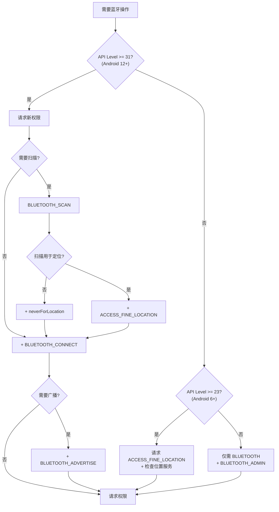

# 权限与兼容性

蓝牙权限是 Android 蓝牙开发中变动最频繁、最易踩坑的部分。从 Android 6.0 到 Android 12，蓝牙权限模型经历了三次大的变革。本文将每个阶段的权限需求、运行时处理、多版本适配方案做系统梳理。

## Android 12 之前的权限模型

### BLUETOOTH / BLUETOOTH_ADMIN

Android 12 之前，蓝牙操作依赖两个普通权限（安装时自动授予，无需运行时请求）：

| 权限 | 用途 |
|------|------|
| `BLUETOOTH` | 执行蓝牙通信（连接、传输数据） |
| `BLUETOOTH_ADMIN` | 执行蓝牙管理操作（扫描、配对、修改设置） |

```xml
<uses-permission android:name="android.permission.BLUETOOTH" />
<uses-permission android:name="android.permission.BLUETOOTH_ADMIN" />
```

### ACCESS_FINE_LOCATION 与位置服务

从 Android 6.0（API 23）开始，BLE 扫描被视为"可能暴露用户位置"的操作，因此需要位置权限：

| Android 版本 | 位置权限要求 | 位置服务要求 |
|-------------|-------------|-------------|
| 6.0 ~ 9.0 (API 23~28) | `ACCESS_COARSE_LOCATION` 或 `ACCESS_FINE_LOCATION` | 需开启 |
| 10+ (API 29) | **必须** `ACCESS_FINE_LOCATION` | 需开启 |
| 10+ 后台扫描 | 额外需要 `ACCESS_BACKGROUND_LOCATION` | 需开启 |

**为什么 BLE 扫描需要位置权限？** BLE 扫描结果（设备 MAC 地址、信号强度、iBeacon 数据）可用于定位用户位置，因此 Google 将其归类为位置敏感操作。

### ACCESS_COARSE_LOCATION 的适用范围

- Android 6.0 ~ 9.0：`ACCESS_COARSE_LOCATION` 足以执行 BLE 扫描
- Android 10+：`ACCESS_COARSE_LOCATION` **不再足够**，必须使用 `ACCESS_FINE_LOCATION`
- 建议：统一使用 `ACCESS_FINE_LOCATION` 避免版本差异

## Android 12+ 新权限模型

Android 12（API 31）对蓝牙权限做了彻底改革，引入三个全新的运行时权限，取代之前的 `BLUETOOTH` / `BLUETOOTH_ADMIN` 和位置权限绑定。

### BLUETOOTH_SCAN

控制蓝牙扫描（发现周围设备）的权限。

```xml
<!-- 如果不需要通过扫描推导用户位置 -->
<uses-permission android:name="android.permission.BLUETOOTH_SCAN"
    android:usesPermissionFlags="neverForLocation" />

<!-- 如果需要用扫描结果推导位置（如 iBeacon） -->
<uses-permission android:name="android.permission.BLUETOOTH_SCAN" />
```

### BLUETOOTH_CONNECT

控制蓝牙连接（与已配对/已知设备通信）的权限。

```xml
<uses-permission android:name="android.permission.BLUETOOTH_CONNECT" />
```

涵盖的操作：`connectGatt()`、`BluetoothDevice.getName()`、`getBondedDevices()`、获取已连接设备信息等。

### BLUETOOTH_ADVERTISE

控制蓝牙广播（让设备可被发现）的权限。

```xml
<uses-permission android:name="android.permission.BLUETOOTH_ADVERTISE" />
```

仅在 Android 设备作为 BLE Peripheral 发送广播时需要。

### neverForLocation 属性详解

`neverForLocation` 是 Android 12 引入的关键标志，声明应用的蓝牙扫描**不会用于推导用户位置**。

**声明 `neverForLocation` 后的效果：**
- 不再需要 `ACCESS_FINE_LOCATION` 权限
- 不再需要开启位置服务
- 但 `ScanResult` 中的部分字段（如物理层设备地址）可能被系统屏蔽

**什么时候可以声明 `neverForLocation`：**
- 纯设备通信场景（连接传感器、控制智能设备）
- 不使用 BLE 做室内定位、信标扫描

**什么时候不能声明：**
- 基于 iBeacon / Eddystone 的定位应用
- 需要使用 BLE 扫描结果推断用户位置的场景

## 运行时权限请求最佳实践

### ActivityResultContracts 方式

推荐使用 `ActivityResultContracts` 取代已废弃的 `onRequestPermissionsResult`：

```kotlin
class BluetoothActivity : AppCompatActivity() {

    private val bluetoothPermissionLauncher = registerForActivityResult(
        ActivityResultContracts.RequestMultiplePermissions()
    ) { permissions ->
        val allGranted = permissions.values.all { it }
        if (allGranted) {
            onBluetoothPermissionsGranted()
        } else {
            handlePermissionsDenied(permissions)
        }
    }

    private fun requestBluetoothPermissions() {
        val permissions = if (Build.VERSION.SDK_INT >= Build.VERSION_CODES.S) {
            arrayOf(
                Manifest.permission.BLUETOOTH_SCAN,
                Manifest.permission.BLUETOOTH_CONNECT
            )
        } else {
            arrayOf(Manifest.permission.ACCESS_FINE_LOCATION)
        }
        bluetoothPermissionLauncher.launch(permissions)
    }
}
```

### 权限请求决策流程图



### 权限被拒绝 / 永久拒绝的处理

```kotlin
private fun handlePermissionsDenied(permissions: Map<String, Boolean>) {
    val deniedPermissions = permissions.filter { !it.value }.keys

    val shouldShowRationale = deniedPermissions.any { permission ->
        shouldShowRequestPermissionRationale(permission)
    }

    if (shouldShowRationale) {
        // 用户拒绝但未勾选"不再询问"，显示解释对话框后重新请求
        showPermissionRationaleDialog()
    } else {
        // 用户永久拒绝，引导用户前往系统设置
        showGoToSettingsDialog()
    }
}

private fun showGoToSettingsDialog() {
    MaterialAlertDialogBuilder(this)
        .setTitle("需要蓝牙权限")
        .setMessage("蓝牙功能需要相关权限才能正常工作，请在系统设置中手动开启。")
        .setPositiveButton("前往设置") { _, _ ->
            startActivity(Intent(Settings.ACTION_APPLICATION_DETAILS_SETTINGS).apply {
                data = Uri.fromParts("package", packageName, null)
            })
        }
        .setNegativeButton("取消", null)
        .show()
}
```

## 位置服务检测与引导

### 检测位置服务是否开启

Android 12 之前，BLE 扫描不仅需要位置权限，还需要位置服务处于开启状态：

```kotlin
fun isLocationServiceEnabled(context: Context): Boolean {
    val locationManager = context.getSystemService(Context.LOCATION_SERVICE) as LocationManager
    return if (Build.VERSION.SDK_INT >= Build.VERSION_CODES.P) {
        locationManager.isLocationEnabled
    } else {
        val gps = locationManager.isProviderEnabled(LocationManager.GPS_PROVIDER)
        val network = locationManager.isProviderEnabled(LocationManager.NETWORK_PROVIDER)
        gps || network
    }
}
```

### 引导用户开启位置服务

```kotlin
fun promptEnableLocation(activity: Activity) {
    MaterialAlertDialogBuilder(activity)
        .setTitle("需要开启位置服务")
        .setMessage("BLE 扫描需要位置服务支持，请开启位置服务后重试。")
        .setPositiveButton("去开启") { _, _ ->
            activity.startActivity(Intent(Settings.ACTION_LOCATION_SOURCE_SETTINGS))
        }
        .setNegativeButton("取消", null)
        .show()
}
```

## AndroidManifest 声明

### uses-permission 配置

完整的蓝牙权限声明，兼容 Android 6.0 ~ 14+：

```xml
<!-- Android 12+ 新权限 -->
<uses-permission android:name="android.permission.BLUETOOTH_SCAN"
    android:usesPermissionFlags="neverForLocation" />
<uses-permission android:name="android.permission.BLUETOOTH_CONNECT" />
<uses-permission android:name="android.permission.BLUETOOTH_ADVERTISE" />

<!-- Android 11 及以下 -->
<uses-permission android:name="android.permission.BLUETOOTH"
    android:maxSdkVersion="30" />
<uses-permission android:name="android.permission.BLUETOOTH_ADMIN"
    android:maxSdkVersion="30" />

<!-- Android 6.0 ~ 11 需要位置权限 -->
<uses-permission android:name="android.permission.ACCESS_FINE_LOCATION"
    android:maxSdkVersion="30" />

<!-- 如需后台扫描（Android 10+） -->
<uses-permission android:name="android.permission.ACCESS_BACKGROUND_LOCATION"
    android:maxSdkVersion="30" />
```

`maxSdkVersion="30"` 确保旧权限不会在 Android 12+ 上出现在用户授权列表中。

### uses-feature 声明（android.hardware.bluetooth_le）

```xml
<!-- 声明应用需要 BLE 硬件 -->
<!-- required="true"：没有 BLE 的设备无法安装此应用 -->
<uses-feature android:name="android.hardware.bluetooth_le" android:required="true" />

<!-- required="false"：BLE 是可选功能，运行时检测 -->
<uses-feature android:name="android.hardware.bluetooth_le" android:required="false" />
```

运行时检测 BLE 支持：

```kotlin
val bleSupported = packageManager.hasSystemFeature(PackageManager.FEATURE_BLUETOOTH_LE)
if (!bleSupported) {
    // 设备不支持 BLE，禁用相关功能或提示用户
}
```

## 多版本适配方案

### 封装统一权限工具类

```kotlin
object BluetoothPermissionHelper {

    fun getRequiredPermissions(needAdvertise: Boolean = false): Array<String> {
        return if (Build.VERSION.SDK_INT >= Build.VERSION_CODES.S) {
            buildList {
                add(Manifest.permission.BLUETOOTH_SCAN)
                add(Manifest.permission.BLUETOOTH_CONNECT)
                if (needAdvertise) {
                    add(Manifest.permission.BLUETOOTH_ADVERTISE)
                }
            }.toTypedArray()
        } else {
            arrayOf(Manifest.permission.ACCESS_FINE_LOCATION)
        }
    }

    fun hasAllPermissions(context: Context, needAdvertise: Boolean = false): Boolean {
        return getRequiredPermissions(needAdvertise).all { permission ->
            ContextCompat.checkSelfPermission(context, permission) == PackageManager.PERMISSION_GRANTED
        }
    }

    fun needsLocationService(context: Context): Boolean {
        if (Build.VERSION.SDK_INT >= Build.VERSION_CODES.S) {
            return false // Android 12+ 声明 neverForLocation 后不需要
        }
        if (Build.VERSION.SDK_INT >= Build.VERSION_CODES.M) {
            return !isLocationServiceEnabled(context)
        }
        return false
    }

    private fun isLocationServiceEnabled(context: Context): Boolean {
        val locationManager = context.getSystemService(Context.LOCATION_SERVICE) as LocationManager
        return if (Build.VERSION.SDK_INT >= Build.VERSION_CODES.P) {
            locationManager.isLocationEnabled
        } else {
            locationManager.isProviderEnabled(LocationManager.GPS_PROVIDER) ||
                locationManager.isProviderEnabled(LocationManager.NETWORK_PROVIDER)
        }
    }
}
```

### API 23 ~ 34+ 全版本兼容策略

| Android 版本 | 权限声明 | 运行时请求 | 位置服务 |
|-------------|---------|-----------|---------|
| 5.0 以下 (API <21) | BLUETOOTH, BLUETOOTH_ADMIN | 无需 | 无需 |
| 5.0~5.1 (API 21~22) | BLUETOOTH, BLUETOOTH_ADMIN | 无需 | 无需 |
| 6.0~9.0 (API 23~28) | BLUETOOTH, BLUETOOTH_ADMIN, ACCESS_FINE_LOCATION | ACCESS_FINE_LOCATION | 需开启 |
| 10~11 (API 29~30) | BLUETOOTH, BLUETOOTH_ADMIN, ACCESS_FINE_LOCATION | ACCESS_FINE_LOCATION | 需开启 |
| 12+ (API 31+) | BLUETOOTH_SCAN, BLUETOOTH_CONNECT, BLUETOOTH_ADVERTISE | BLUETOOTH_SCAN, BLUETOOTH_CONNECT | 不需要（声明 neverForLocation） |

### 常见适配陷阱

**陷阱 1：Android 12 上仍声明旧权限导致崩溃**

如果在 Android 12+ 上没有请求 `BLUETOOTH_SCAN` / `BLUETOOTH_CONNECT` 而直接调用蓝牙 API，会抛出 `SecurityException`。旧的 `BLUETOOTH` 权限在 Android 12+ 上**不再授予蓝牙操作能力**。

**陷阱 2：忘记检查位置服务开启状态**

在 Android 6.0 ~ 11 上，即使位置权限已授予，如果位置服务未开启，BLE 扫描会静默返回空结果（不会报错）。

**陷阱 3：`neverForLocation` 声明后仍请求位置权限**

如果 `BLUETOOTH_SCAN` 声明了 `neverForLocation`，则无需也不应请求位置权限。同时请求两者可能导致用户困惑。

**陷阱 4：targetSdkVersion 升级导致权限行为变更**

将 `targetSdkVersion` 从 30 升级到 31+ 后，必须同步迁移权限模型，否则所有蓝牙功能将无法正常工作。

```kotlin
// 完整的蓝牙预检查流程
fun performBluetoothPreCheck(activity: Activity): Boolean {
    // 1. 检查 BLE 硬件支持
    if (!activity.packageManager.hasSystemFeature(PackageManager.FEATURE_BLUETOOTH_LE)) {
        showToast("设备不支持 BLE")
        return false
    }

    // 2. 检查蓝牙是否开启
    val bluetoothManager = activity.getSystemService(Context.BLUETOOTH_SERVICE) as BluetoothManager
    if (bluetoothManager.adapter?.isEnabled != true) {
        // 引导用户开启蓝牙
        val enableBtIntent = Intent(BluetoothAdapter.ACTION_REQUEST_ENABLE)
        activity.startActivity(enableBtIntent)
        return false
    }

    // 3. 检查权限
    if (!BluetoothPermissionHelper.hasAllPermissions(activity)) {
        return false // 调用方需触发权限请求
    }

    // 4. 检查位置服务（Android 12 以下）
    if (BluetoothPermissionHelper.needsLocationService(activity)) {
        promptEnableLocation(activity)
        return false
    }

    return true
}
```

## 踩坑记录

> 此区域供团队成员补充项目中遇到的真实案例。

| 日期 | 记录人 | 问题描述 | 解决方案 |
|------|--------|----------|----------|
| | | | |

## 参考资料

- [Android Bluetooth Permissions](https://developer.android.com/develop/connectivity/bluetooth/bt-permissions)
- [Android 12 Behavior Changes — Bluetooth](https://developer.android.com/about/versions/12/behavior-changes-12#bluetooth)
- [Request App Permissions](https://developer.android.com/training/permissions/requesting)
- [Android Developers Blog — New Bluetooth Permissions](https://android-developers.googleblog.com/)
