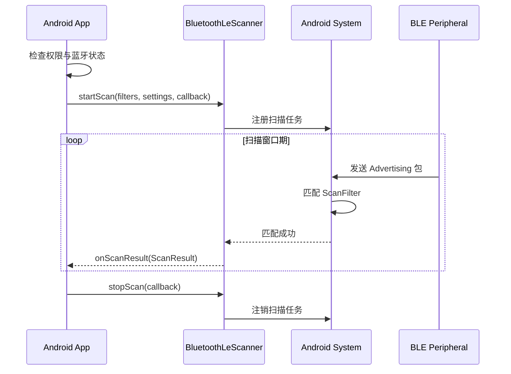

# BLE 扫描与广播

BLE 通信的第一步是发现设备——Central 端通过扫描（Scan）接收 Peripheral 端的广播（Advertise）。扫描看似简单，但在 Android 平台上涉及权限、后台限制、过滤策略、电量优化等诸多细节。

## BLE 扫描（Central 端）

### BluetoothLeScanner API

`BluetoothLeScanner` 是 Android 5.0+ 引入的 BLE 扫描 API（取代了早期的 `BluetoothAdapter.startLeScan()`）。

```kotlin
val bluetoothManager = context.getSystemService(Context.BLUETOOTH_SERVICE) as BluetoothManager
val bluetoothAdapter = bluetoothManager.adapter
val scanner: BluetoothLeScanner? = bluetoothAdapter?.bluetoothLeScanner

// scanner 为 null 的可能原因：蓝牙未开启，或权限不足
```

基本扫描流程：

```kotlin
private val scanCallback = object : ScanCallback() {
    override fun onScanResult(callbackType: Int, result: ScanResult) {
        val device = result.device
        val rssi = result.rssi
        val scanRecord = result.scanRecord
        // 处理扫描结果
    }

    override fun onBatchScanResults(results: MutableList<ScanResult>) {
        // 批量扫描结果（使用 SCAN_MODE_LOW_POWER 等模式时可能触发）
        results.forEach { result ->
            // 处理每个结果
        }
    }

    override fun onScanFailed(errorCode: Int) {
        when (errorCode) {
            SCAN_FAILED_ALREADY_STARTED -> { /* 扫描已在进行中 */ }
            SCAN_FAILED_APPLICATION_REGISTRATION_FAILED -> { /* 注册失败，通常需重启蓝牙 */ }
            SCAN_FAILED_INTERNAL_ERROR -> { /* 内部错误 */ }
            SCAN_FAILED_FEATURE_UNSUPPORTED -> { /* 功能不支持 */ }
            SCAN_FAILED_OUT_OF_HARDWARE_RESOURCES -> { /* 硬件资源不足 */ }
            SCAN_FAILED_SCANNING_TOO_FREQUENTLY -> { /* 扫描过于频繁（Android 7+） */ }
        }
    }
}

// 启动扫描
scanner?.startScan(filters, settings, scanCallback)

// 停止扫描
scanner?.stopScan(scanCallback)
```

### ScanFilter 构建

`ScanFilter` 让系统在硬件层面过滤广播包，减少无关回调，显著降低功耗。

#### 按设备名称过滤

```kotlin
val nameFilter = ScanFilter.Builder()
    .setDeviceName("MyDevice")
    .build()
```

注意：设备名称匹配基于广播包中的 Local Name 字段，部分设备不广播名称或名称被截断。

#### 按 Service UUID 过滤

```kotlin
val serviceFilter = ScanFilter.Builder()
    .setServiceUuid(ParcelUuid(UUID.fromString("0000180d-0000-1000-8000-00805f9b34fb")))
    .build()
```

这是最常用的过滤方式——根据设备广播的 Service UUID 精确匹配目标设备类型。

#### 按 MAC 地址过滤

```kotlin
val addressFilter = ScanFilter.Builder()
    .setDeviceAddress("AA:BB:CC:DD:EE:FF")
    .build()
```

适用于重连已知设备。注意：BLE 设备可能使用随机地址（Random Address），每次广播的地址可能不同。

#### 按 Manufacturer Data 过滤

```kotlin
// 过滤指定厂商 ID 的设备（如 Apple iBeacon 的厂商 ID 为 0x004C）
val manufacturerFilter = ScanFilter.Builder()
    .setManufacturerData(
        0x004C,                    // 厂商 ID
        byteArrayOf(0x02, 0x15),   // 数据匹配
        byteArrayOf(0xFF.toByte(), 0xFF.toByte()) // 掩码
    )
    .build()
```

**组合多个 Filter：** 传入 Filter List 时，各 Filter 之间是 OR 关系（匹配任意一个即回调）。单个 Filter 内部的条件是 AND 关系。

```kotlin
val filters = listOf(serviceFilter, nameFilter) // 匹配 serviceFilter OR nameFilter
scanner?.startScan(filters, settings, scanCallback)
```

### ScanSettings 扫描模式

`ScanSettings` 控制扫描的行为模式，在功耗和发现速度之间取舍。

#### SCAN_MODE_LOW_POWER

```kotlin
val settings = ScanSettings.Builder()
    .setScanMode(ScanSettings.SCAN_MODE_LOW_POWER)
    .build()
```

- 扫描占空比最低（约 0.5 秒扫描 / 4.5 秒休眠）
- 功耗最低，发现设备最慢
- 适合长时间后台扫描

#### SCAN_MODE_BALANCED

```kotlin
val settings = ScanSettings.Builder()
    .setScanMode(ScanSettings.SCAN_MODE_BALANCED)
    .build()
```

- 中等占空比（约 2 秒扫描 / 3 秒休眠）
- 功耗与发现速度的平衡点
- 适合大多数场景

#### SCAN_MODE_LOW_LATENCY

```kotlin
val settings = ScanSettings.Builder()
    .setScanMode(ScanSettings.SCAN_MODE_LOW_LATENCY)
    .build()
```

- 持续扫描，不休眠
- 最快发现设备，但功耗最高
- 仅适合短时间前台扫描

#### 各模式适用场景对比

| 模式 | 扫描窗口 | 发现速度 | 功耗 | 适用场景 |
|------|---------|---------|------|---------|
| LOW_POWER | ~10% | 慢（可能 5-10 秒） | 极低 | 后台持续扫描、信标监控 |
| BALANCED | ~40% | 中等（1-3 秒） | 中等 | 通用场景、默认推荐 |
| LOW_LATENCY | 100% | 快（<1 秒） | 高 | 用户主动触发的短时扫描 |

**其他 ScanSettings 配置：**

```kotlin
val settings = ScanSettings.Builder()
    .setScanMode(ScanSettings.SCAN_MODE_LOW_LATENCY)
    .setReportDelay(0)         // 0 = 即时回调；>0 = 批量回调间隔（ms）
    .setCallbackType(ScanSettings.CALLBACK_TYPE_ALL_MATCHES) // 每次匹配都回调
    .setMatchMode(ScanSettings.MATCH_MODE_AGGRESSIVE)         // 激进匹配（信号弱也回调）
    .setNumOfMatches(ScanSettings.MATCH_NUM_MAX_ADVERTISEMENT) // 不限匹配数
    .build()
```

### 扫描结果解析

#### ScanResult 数据结构

```kotlin
override fun onScanResult(callbackType: Int, result: ScanResult) {
    val device: BluetoothDevice = result.device       // 蓝牙设备对象
    val rssi: Int = result.rssi                        // 信号强度（dBm，负值，越接近 0 越强）
    val timestampNanos: Long = result.timestampNanos   // 扫描时间戳
    val scanRecord: ScanRecord? = result.scanRecord    // 广播包数据

    // BLE 5.0+ 额外信息
    val txPower: Int = result.txPower                  // 发射功率
    val primaryPhy: Int = result.primaryPhy             // 主 PHY
    val secondaryPhy: Int = result.secondaryPhy         // 辅 PHY
    val advertisingSid: Int = result.advertisingSid     // 广播集 ID
}
```

**RSSI 参考值：**

| RSSI 范围 | 信号强度 | 大致距离 |
|----------|---------|---------|
| -30 ~ -50 dBm | 非常强 | < 1 米 |
| -50 ~ -70 dBm | 强 | 1-5 米 |
| -70 ~ -85 dBm | 中等 | 5-15 米 |
| -85 ~ -100 dBm | 弱 | > 15 米 |

#### ScanRecord 与广播包解析

```kotlin
val scanRecord: ScanRecord = result.scanRecord ?: return

// 设备名称
val deviceName: String? = scanRecord.deviceName

// 广播的 Service UUID 列表
val serviceUuids: List<ParcelUuid>? = scanRecord.serviceUuids

// Manufacturer Specific Data
val manufacturerData: SparseArray<ByteArray>? = scanRecord.manufacturerSpecificData

// Service Data
val serviceData: Map<ParcelUuid, ByteArray>? = scanRecord.serviceData

// 发射功率（广播包中声明的 TX Power Level）
val txPowerLevel: Int = scanRecord.txPowerLevel

// 原始广播字节
val rawBytes: ByteArray? = scanRecord.bytes
```

#### AD Type 字段说明

广播包由多个 AD Structure 组成，每个结构包含 Length + AD Type + Data：

| AD Type | 含义 | 常见值 |
|---------|------|--------|
| 0x01 | Flags | 设备能力标志 |
| 0x02 / 0x03 | 16-bit Service UUID (部分/完整) | 标准服务 |
| 0x06 / 0x07 | 128-bit Service UUID (部分/完整) | 自定义服务 |
| 0x08 / 0x09 | Shortened / Complete Local Name | 设备名称 |
| 0x0A | TX Power Level | 发射功率 |
| 0xFF | Manufacturer Specific Data | 厂商自定义数据 |
| 0x16 | Service Data | 服务关联数据 |

### 扫描生命周期管理

#### 启动与停止扫描

```kotlin
class BleScanner(private val context: Context) {
    private var scanner: BluetoothLeScanner? = null
    private var isScanning = false
    private val handler = Handler(Looper.getMainLooper())

    fun startScan(
        filters: List<ScanFilter> = emptyList(),
        scanMode: Int = ScanSettings.SCAN_MODE_BALANCED,
        timeoutMs: Long = 30_000L
    ) {
        if (isScanning) return

        val bluetoothManager = context.getSystemService(Context.BLUETOOTH_SERVICE) as BluetoothManager
        scanner = bluetoothManager.adapter?.bluetoothLeScanner ?: return

        val settings = ScanSettings.Builder()
            .setScanMode(scanMode)
            .build()

        scanner?.startScan(filters, settings, scanCallback)
        isScanning = true

        // 超时自动停止
        handler.postDelayed({ stopScan() }, timeoutMs)
    }

    fun stopScan() {
        if (!isScanning) return
        scanner?.stopScan(scanCallback)
        isScanning = false
        handler.removeCallbacksAndMessages(null)
    }
}
```

#### 扫描超时处理

永远不要无限期扫描。推荐策略：
- 用户主动触发的扫描：30 秒超时
- 后台定期扫描：5-10 秒扫描窗口
- 找到目标设备后立即停止扫描

#### 避免重复扫描

Android 7.0+ 引入了扫描频率限制：在 30 秒内启停扫描超过 5 次会触发 `SCAN_FAILED_SCANNING_TOO_FREQUENTLY` 错误。

```kotlin
// 错误示例：频繁启停
fun onDeviceNotFound() {
    stopScan()
    startScan() // 短时间内反复调用会被系统拒绝
}

// 正确做法：使用延迟或节流
fun restartScanWithDelay(delayMs: Long = 6000L) {
    stopScan()
    handler.postDelayed({ startScan() }, delayMs)
}
```

## 后台扫描限制

Android 对后台 BLE 扫描的限制逐版本收紧，是实际开发中最容易遇到的问题。

### Android 8.0+ 后台扫描节流

应用进入后台后，扫描被系统节流：
- 扫描间隔被强制拉长
- 回调频率大幅降低
- 不带 ScanFilter 的扫描可能被完全禁止

**应对策略：** 务必使用 ScanFilter，没有 Filter 的后台扫描在 Android 8.0+ 上几乎无法正常工作。

### Android 10+ 后台扫描禁止

后台应用无法启动新的 BLE 扫描：
- `startScan()` 在后台调用会静默失败或抛出异常
- 已在前台启动的扫描进入后台后可能继续，但行为不可靠

### PendingIntent 扫描模式（后台唯一合法途径）

Android 8.0+ 提供了 `PendingIntent` 扫描，是后台 BLE 扫描的唯一可靠方式：

```kotlin
// 创建 PendingIntent
val intent = Intent(context, BleScanReceiver::class.java)
val pendingIntent = PendingIntent.getBroadcast(
    context, 0, intent,
    PendingIntent.FLAG_UPDATE_CURRENT or PendingIntent.FLAG_MUTABLE
)

// 启动基于 PendingIntent 的扫描
val filters = listOf(
    ScanFilter.Builder()
        .setServiceUuid(ParcelUuid(targetServiceUuid))
        .build()
)
val settings = ScanSettings.Builder()
    .setScanMode(ScanSettings.SCAN_MODE_LOW_POWER)
    .build()

val scanner = bluetoothAdapter.bluetoothLeScanner
scanner.startScan(filters, settings, pendingIntent)
```

```kotlin
// BroadcastReceiver 处理扫描结果
class BleScanReceiver : BroadcastReceiver() {
    override fun onReceive(context: Context, intent: Intent) {
        val results = intent.getParcelableArrayListExtra<ScanResult>(
            BluetoothLeScanner.EXTRA_LIST_SCAN_RESULT
        ) ?: return

        results.forEach { result ->
            // 在后台处理扫描到的设备
            // 可启动 ForegroundService 进行连接
        }
    }
}
```

**PendingIntent 扫描的特点：**
- 系统代替应用执行扫描，不受后台限制
- 必须搭配 ScanFilter 使用
- 发现匹配设备时通过 PendingIntent 唤醒应用
- 功耗由系统优化，应用无需维护前台 Service 仅用于扫描

## BLE 广播（Peripheral 端简介）

此部分简要介绍广播包结构，完整的 Peripheral 开发详见 `05-BLE外围模式ble-peripheral-mode.md`。

### 广播包（Advertising Data）结构

BLE 4.x 广播包最大 31 字节，由多个 AD Structure 拼接：

```
| Length (1B) | AD Type (1B) | Data (Length-1 B) |
```

31 字节需分配给 Flags、Service UUID、名称等字段，空间非常紧张。

**BLE 5.0 Extended Advertising：** 广播数据扩展到 255 字节，并支持链式广播包（总计可达 1650 字节），极大缓解了空间限制。

### Scan Response 数据

Peripheral 可配置 Scan Response 数据（额外 31 字节），在 Central 发起 Active Scan 时返回。通常用于携带完整设备名称或额外的 Service Data。

### 自定义广播内容

```kotlin
val advertiseData = AdvertiseData.Builder()
    .setIncludeDeviceName(true)
    .addServiceUuid(ParcelUuid(customServiceUuid))
    .addManufacturerData(0x1234, byteArrayOf(0x01, 0x02, 0x03))
    .build()

val scanResponse = AdvertiseData.Builder()
    .setIncludeDeviceName(false)
    .addServiceData(ParcelUuid(customServiceUuid), byteArrayOf(0x10, 0x20))
    .build()
```

## 扫描流程图



## 踩坑记录

> 此区域供团队成员补充项目中遇到的真实案例。

| 日期 | 记录人 | 问题描述 | 解决方案 |
|------|--------|----------|----------|
| | | | |

## 参考资料

- [Android BLE Scan Guide](https://developer.android.com/develop/connectivity/bluetooth/ble/find-ble-devices)
- [ScanFilter API Reference](https://developer.android.com/reference/android/bluetooth/le/ScanFilter)
- [ScanSettings API Reference](https://developer.android.com/reference/android/bluetooth/le/ScanSettings)
- [Background BLE Scanning Best Practices](https://developer.android.com/develop/connectivity/bluetooth/ble/ble-overview)
- [Bluetooth Core Spec — Advertising](https://www.bluetooth.com/specifications/specs/core-specification/)
