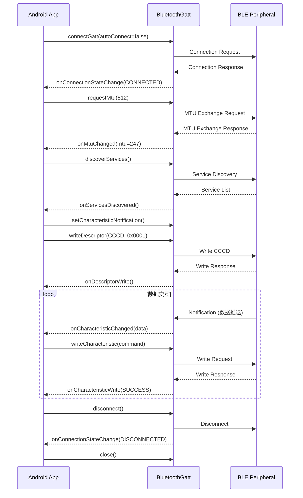

# BLE GATT 通信

GATT（Generic Attribute Profile）是 BLE 数据交互的核心。本文聚焦 GATT Client 端开发——即 Android 作为 Central 连接 Peripheral 并进行数据读写的完整流程。

## 连接流程

### connectGatt 参数详解

```kotlin
val gatt: BluetoothGatt? = device.connectGatt(
    context,       // Context
    autoConnect,   // Boolean: 是否自动连接
    gattCallback,  // BluetoothGattCallback
    transport,     // 传输类型
    phy            // 首选 PHY（API 26+）
)
```

#### autoConnect 参数的影响

| autoConnect | 行为 | 超时 | 适用场景 |
|------------|------|------|---------|
| `false` | 立即发起直接连接请求 | 约 30 秒超时 | 用户主动选择设备后连接 |
| `true` | 加入后台自动连接白名单，设备出现时自动连接 | 无超时（持续等待） | 重连已知设备 |

**实践建议：**
- 首次连接用 `autoConnect = false`，快速建立连接
- 重连时可用 `autoConnect = true`，但要注意该模式连接速度较慢（系统低占空比扫描）
- `autoConnect = true` 不需要先调用 `startScan()`

#### transport 参数（TRANSPORT_LE / TRANSPORT_AUTO）

```kotlin
// 明确指定使用 BLE 传输（推荐）
device.connectGatt(context, false, callback, BluetoothDevice.TRANSPORT_LE)

// 让系统自动选择（可能选到经典蓝牙，导致连接失败）
device.connectGatt(context, false, callback, BluetoothDevice.TRANSPORT_AUTO)
```

**强烈建议始终使用 `TRANSPORT_LE`**，避免系统误选经典蓝牙传输导致的连接问题。

#### PHY 选择（LE 1M / LE 2M / LE Coded）

Android 8.0+（API 26）支持在连接时指定首选 PHY：

```kotlin
if (Build.VERSION.SDK_INT >= Build.VERSION_CODES.O) {
    device.connectGatt(
        context, false, callback,
        BluetoothDevice.TRANSPORT_LE,
        BluetoothDevice.PHY_LE_1M_MASK // 或 PHY_LE_2M_MASK、PHY_LE_CODED_MASK
    )
}
```

连接后也可动态切换 PHY：

```kotlin
gatt.setPreferredPhy(
    BluetoothDevice.PHY_LE_2M_MASK,  // TX PHY
    BluetoothDevice.PHY_LE_2M_MASK,  // RX PHY
    BluetoothDevice.PHY_OPTION_NO_PREFERRED
)
```

### BluetoothGattCallback 回调一览

`BluetoothGattCallback` 是 GATT 通信的核心回调，所有异步操作的结果都通过它返回：

```kotlin
private val gattCallback = object : BluetoothGattCallback() {

    override fun onConnectionStateChange(gatt: BluetoothGatt, status: Int, newState: Int) {
        // 连接状态变更：连接成功 / 断开
    }

    override fun onServicesDiscovered(gatt: BluetoothGatt, status: Int) {
        // 服务发现完成
    }

    override fun onCharacteristicRead(
        gatt: BluetoothGatt, characteristic: BluetoothGattCharacteristic, value: ByteArray, status: Int
    ) {
        // 读取 Characteristic 结果
    }

    override fun onCharacteristicWrite(
        gatt: BluetoothGatt, characteristic: BluetoothGattCharacteristic, status: Int
    ) {
        // 写入 Characteristic 结果
    }

    override fun onCharacteristicChanged(
        gatt: BluetoothGatt, characteristic: BluetoothGattCharacteristic, value: ByteArray
    ) {
        // 收到 Notification / Indication 数据
    }

    override fun onDescriptorWrite(
        gatt: BluetoothGatt, descriptor: BluetoothGattDescriptor, status: Int
    ) {
        // Descriptor 写入结果（如开启通知写 CCCD）
    }

    override fun onMtuChanged(gatt: BluetoothGatt, mtu: Int, status: Int) {
        // MTU 协商结果
    }

    override fun onPhyUpdate(gatt: BluetoothGatt, txPhy: Int, rxPhy: Int, status: Int) {
        // PHY 切换结果
    }
}
```

**关键注意：** 所有回调默认在 Binder 线程执行（非主线程），不可直接操作 UI。

## 服务发现

### discoverServices 触发时机

连接成功后必须调用 `discoverServices()` 才能获取设备的 Service / Characteristic 信息：

```kotlin
override fun onConnectionStateChange(gatt: BluetoothGatt, status: Int, newState: Int) {
    if (status == BluetoothGatt.GATT_SUCCESS && newState == BluetoothProfile.STATE_CONNECTED) {
        // 连接成功，延迟一小段时间后发现服务（部分设备需要）
        Handler(Looper.getMainLooper()).postDelayed({
            gatt.discoverServices()
        }, 300) // 300ms 延迟，给协议栈初始化时间
    }
}
```

### Service / Characteristic / Descriptor 遍历

```kotlin
override fun onServicesDiscovered(gatt: BluetoothGatt, status: Int) {
    if (status != BluetoothGatt.GATT_SUCCESS) return

    gatt.services.forEach { service ->
        Log.d(TAG, "Service: ${service.uuid}")
        service.characteristics.forEach { characteristic ->
            Log.d(TAG, "  Characteristic: ${characteristic.uuid}")
            Log.d(TAG, "  Properties: ${characteristicPropertiesToString(characteristic.properties)}")
            characteristic.descriptors.forEach { descriptor ->
                Log.d(TAG, "    Descriptor: ${descriptor.uuid}")
            }
        }
    }
}

private fun characteristicPropertiesToString(properties: Int): String {
    val props = mutableListOf<String>()
    if (properties and BluetoothGattCharacteristic.PROPERTY_READ != 0) props.add("Read")
    if (properties and BluetoothGattCharacteristic.PROPERTY_WRITE != 0) props.add("Write")
    if (properties and BluetoothGattCharacteristic.PROPERTY_WRITE_NO_RESPONSE != 0) props.add("WriteNoResp")
    if (properties and BluetoothGattCharacteristic.PROPERTY_NOTIFY != 0) props.add("Notify")
    if (properties and BluetoothGattCharacteristic.PROPERTY_INDICATE != 0) props.add("Indicate")
    return props.joinToString(", ")
}
```

### 根据 UUID 定位目标 Characteristic

```kotlin
private fun findTargetCharacteristic(gatt: BluetoothGatt): BluetoothGattCharacteristic? {
    val service = gatt.getService(TARGET_SERVICE_UUID) ?: run {
        Log.e(TAG, "Target service not found")
        return null
    }
    return service.getCharacteristic(TARGET_CHAR_UUID) ?: run {
        Log.e(TAG, "Target characteristic not found")
        null
    }
}
```

## 读操作

### readCharacteristic 使用方式

```kotlin
fun readCharacteristic(gatt: BluetoothGatt, characteristic: BluetoothGattCharacteristic) {
    if (characteristic.properties and BluetoothGattCharacteristic.PROPERTY_READ == 0) {
        Log.e(TAG, "Characteristic does not support read")
        return
    }
    gatt.readCharacteristic(characteristic)
}
```

### 读取回调与数据解析

```kotlin
override fun onCharacteristicRead(
    gatt: BluetoothGatt,
    characteristic: BluetoothGattCharacteristic,
    value: ByteArray,
    status: Int
) {
    if (status != BluetoothGatt.GATT_SUCCESS) {
        Log.e(TAG, "Read failed with status: $status")
        return
    }

    // 根据协议解析数据
    when (characteristic.uuid) {
        BATTERY_LEVEL_UUID -> {
            val batteryLevel = value[0].toInt() and 0xFF
            Log.d(TAG, "Battery level: $batteryLevel%")
        }
        CUSTOM_DATA_UUID -> {
            val hexString = value.joinToString(" ") { "%02X".format(it) }
            Log.d(TAG, "Custom data: $hexString")
        }
    }
}
```

## 写操作

### WRITE_TYPE_DEFAULT vs WRITE_TYPE_NO_RESPONSE

| 写入类型 | 行为 | 可靠性 | 吞吐量 |
|---------|------|--------|--------|
| WRITE_TYPE_DEFAULT | 写入后等待 Server 确认（Write Request） | 高，有应答 | 低 |
| WRITE_TYPE_NO_RESPONSE | 写入后不等待确认（Write Command） | 低，无应答 | 高 |

```kotlin
fun writeCharacteristic(
    gatt: BluetoothGatt,
    characteristic: BluetoothGattCharacteristic,
    data: ByteArray,
    writeType: Int = BluetoothGattCharacteristic.WRITE_TYPE_DEFAULT
) {
    if (Build.VERSION.SDK_INT >= Build.VERSION_CODES.TIRAMISU) {
        // Android 13+ 使用新 API
        gatt.writeCharacteristic(characteristic, data, writeType)
    } else {
        // 旧 API
        @Suppress("DEPRECATION")
        characteristic.value = data
        @Suppress("DEPRECATION")
        characteristic.writeType = writeType
        @Suppress("DEPRECATION")
        gatt.writeCharacteristic(characteristic)
    }
}
```

### 写入确认与错误处理

```kotlin
override fun onCharacteristicWrite(
    gatt: BluetoothGatt,
    characteristic: BluetoothGattCharacteristic,
    status: Int
) {
    when (status) {
        BluetoothGatt.GATT_SUCCESS -> {
            // 写入成功，可以执行下一个操作
            operationQueue.next()
        }
        BluetoothGatt.GATT_INVALID_ATTRIBUTE_LENGTH -> {
            Log.e(TAG, "Write failed: data exceeds MTU")
        }
        BluetoothGatt.GATT_WRITE_NOT_PERMITTED -> {
            Log.e(TAG, "Write failed: write not permitted")
        }
        else -> {
            Log.e(TAG, "Write failed with status: $status")
        }
    }
}
```

### 大数据写入分包策略

单次写入数据量受 MTU 限制，大数据需要分包传输：

```kotlin
fun writeWithChunking(
    gatt: BluetoothGatt,
    characteristic: BluetoothGattCharacteristic,
    data: ByteArray,
    mtu: Int
) {
    val chunkSize = mtu - 3 // 减去 ATT Header
    val chunks = data.toList().chunked(chunkSize).map { it.toByteArray() }

    chunks.forEachIndexed { index, chunk ->
        // 必须等上一个 chunk 写入回调后再写下一个
        enqueueWrite(gatt, characteristic, chunk)
    }
}
```

## 通知与指示（Notification / Indication）

通知是 BLE 中最重要的数据推送机制——Server 主动将数据发送给 Client，无需 Client 轮询。

### setCharacteristicNotification 开启通知

开启通知需要两步操作，**缺一不可**：

```kotlin
fun enableNotification(gatt: BluetoothGatt, characteristic: BluetoothGattCharacteristic) {
    // 第一步：在 Android 本地注册通知监听
    gatt.setCharacteristicNotification(characteristic, true)

    // 第二步：向远端设备的 CCCD 写入开启通知的值
    val cccd = characteristic.getDescriptor(CCCD_UUID) ?: run {
        Log.e(TAG, "CCCD descriptor not found")
        return
    }

    val enableValue = if (characteristic.properties and
        BluetoothGattCharacteristic.PROPERTY_NOTIFY != 0) {
        BluetoothGattDescriptor.ENABLE_NOTIFICATION_VALUE     // 0x0001
    } else {
        BluetoothGattDescriptor.ENABLE_INDICATION_VALUE       // 0x0002
    }

    if (Build.VERSION.SDK_INT >= Build.VERSION_CODES.TIRAMISU) {
        gatt.writeDescriptor(cccd, enableValue)
    } else {
        @Suppress("DEPRECATION")
        cccd.value = enableValue
        @Suppress("DEPRECATION")
        gatt.writeDescriptor(cccd)
    }
}

companion object {
    val CCCD_UUID: UUID = UUID.fromString("00002902-0000-1000-8000-00805f9b34fb")
}
```

### 写入 CCCD Descriptor（0x2902）

CCCD 写入值含义：

| 值 | 含义 |
|-----|------|
| `0x0000` | 关闭通知和指示 |
| `0x0001` | 开启 Notification |
| `0x0002` | 开启 Indication |

**常见错误：** 只调用 `setCharacteristicNotification()`（本地操作）而未写入 CCCD（远端操作），导致收不到通知数据。

### Notification vs Indication 区别

| 维度 | Notification | Indication |
|------|-------------|------------|
| 确认机制 | 无确认 | Client 需回复确认 |
| 可靠性 | 不保证到达 | 保证到达 |
| 吞吐量 | 高（不等确认即可发下一个） | 低（等确认后才发下一个） |
| 适用场景 | 高频传感器数据 | 关键状态变更、报警 |

### 通知数据接收与解析

```kotlin
override fun onCharacteristicChanged(
    gatt: BluetoothGatt,
    characteristic: BluetoothGattCharacteristic,
    value: ByteArray
) {
    when (characteristic.uuid) {
        HEART_RATE_MEASUREMENT_UUID -> {
            val flags = value[0].toInt()
            val heartRate = if (flags and 0x01 == 0) {
                value[1].toInt() and 0xFF  // 8-bit 心率值
            } else {
                (value[1].toInt() and 0xFF) or ((value[2].toInt() and 0xFF) shl 8) // 16-bit
            }
            Log.d(TAG, "Heart rate: $heartRate bpm")
        }
        CUSTOM_NOTIFY_UUID -> {
            processCustomData(value)
        }
    }
}
```

## MTU 协商

### requestMtu 使用方式

```kotlin
override fun onConnectionStateChange(gatt: BluetoothGatt, status: Int, newState: Int) {
    if (newState == BluetoothProfile.STATE_CONNECTED) {
        // 连接成功后立即请求 MTU（在 discoverServices 之前）
        gatt.requestMtu(512)
    }
}

override fun onMtuChanged(gatt: BluetoothGatt, mtu: Int, status: Int) {
    if (status == BluetoothGatt.GATT_SUCCESS) {
        currentMtu = mtu
        // MTU 协商完成后再发现服务
        gatt.discoverServices()
    }
}
```

### MTU 与有效载荷的关系

```
有效载荷 = MTU - 3 (ATT Header)

MTU = 23  → 有效载荷 = 20 字节
MTU = 247 → 有效载荷 = 244 字节
MTU = 512 → 有效载荷 = 509 字节
```

### 不同 Android 版本的默认 MTU

| Android 版本 | 默认 MTU | 最大可请求 MTU |
|-------------|---------|--------------|
| 4.3 ~ 4.4 | 23 | 不支持 requestMtu |
| 5.0+ | 23 | 512 |
| 14+ | 23（可配置更高默认值） | 517 |

## 操作队列化

### 蓝牙操作必须串行的原因

Android `BluetoothGatt` 有一个关键限制：**同一时刻只能有一个未完成的 GATT 操作**。在上一个操作的回调返回之前发起新操作会导致静默失败或 status 5（GATT_INSUFFICIENT_AUTHENTICATION）。

### 操作队列实现方案

```kotlin
class BleOperationQueue {
    private val queue: Queue<BleOperation> = ConcurrentLinkedQueue()
    private var isProcessing = AtomicBoolean(false)

    fun enqueue(operation: BleOperation) {
        queue.add(operation)
        processNext()
    }

    fun onOperationCompleted() {
        isProcessing.set(false)
        processNext()
    }

    private fun processNext() {
        if (isProcessing.compareAndSet(false, true)) {
            val operation = queue.poll()
            if (operation != null) {
                operation.execute()
            } else {
                isProcessing.set(false)
            }
        }
    }
}

sealed class BleOperation {
    abstract fun execute()

    class Read(
        private val gatt: BluetoothGatt,
        private val characteristic: BluetoothGattCharacteristic
    ) : BleOperation() {
        override fun execute() { gatt.readCharacteristic(characteristic) }
    }

    class Write(
        private val gatt: BluetoothGatt,
        private val characteristic: BluetoothGattCharacteristic,
        private val data: ByteArray,
        private val writeType: Int
    ) : BleOperation() {
        override fun execute() {
            gatt.writeCharacteristic(characteristic, data, writeType)
        }
    }

    class EnableNotification(
        private val gatt: BluetoothGatt,
        private val characteristic: BluetoothGattCharacteristic
    ) : BleOperation() {
        override fun execute() { /* enableNotification 逻辑 */ }
    }
}
```

### 开源库的队列化方案对比

| 库 | 队列化方式 | 特点 |
|----|----------|------|
| **Nordic BLE Library** | 内建 Request Queue | 自动队列化，API 最简洁 |
| **RxAndroidBle** | RxJava 串行调度 | 链式操作，自动排队 |
| **原生 API** | 需自行实现 | 灵活但工作量大 |

## Connection Priority

### CONNECTION_PRIORITY_HIGH

请求最小 Connection Interval（约 11.25 ~ 15 ms），适合需要高吞吐或低延迟的场景（如 OTA 传输）。

### CONNECTION_PRIORITY_BALANCED

请求中等 Connection Interval（约 30 ~ 50 ms），功耗与性能的平衡点，适合通用场景。

### CONNECTION_PRIORITY_LOW_POWER

请求大 Connection Interval（约 100 ~ 500 ms），最低功耗，适合不频繁通信的场景。

### 对传输速度与功耗的影响

| Priority | 大致 Interval | 理论吞吐 (MTU=247) | 功耗 |
|----------|-------------|-------------------|------|
| HIGH | 11.25 ms | ~170 kB/s | 高 |
| BALANCED | 30 ms | ~65 kB/s | 中 |
| LOW_POWER | 100 ms | ~20 kB/s | 低 |

**实践建议：** 平时使用 BALANCED，大量数据传输时临时切到 HIGH，传输完成后切回 BALANCED 或 LOW_POWER。

## 完整通信序列图



## 踩坑记录

> 此区域供团队成员补充项目中遇到的真实案例。

| 日期 | 记录人 | 问题描述 | 解决方案 |
|------|--------|----------|----------|
| | | | |

## 参考资料

- [Android BLE GATT Guide](https://developer.android.com/develop/connectivity/bluetooth/ble/connect-gatt-server)
- [BluetoothGatt API Reference](https://developer.android.com/reference/android/bluetooth/BluetoothGatt)
- [BluetoothGattCallback API Reference](https://developer.android.com/reference/android/bluetooth/BluetoothGattCallback)
- [Nordic Android BLE Library](https://github.com/NordicSemiconductor/Android-BLE-Library)
- [BLE GATT Operations — Best Practices](https://punchthrough.com/android-ble-guide/)
