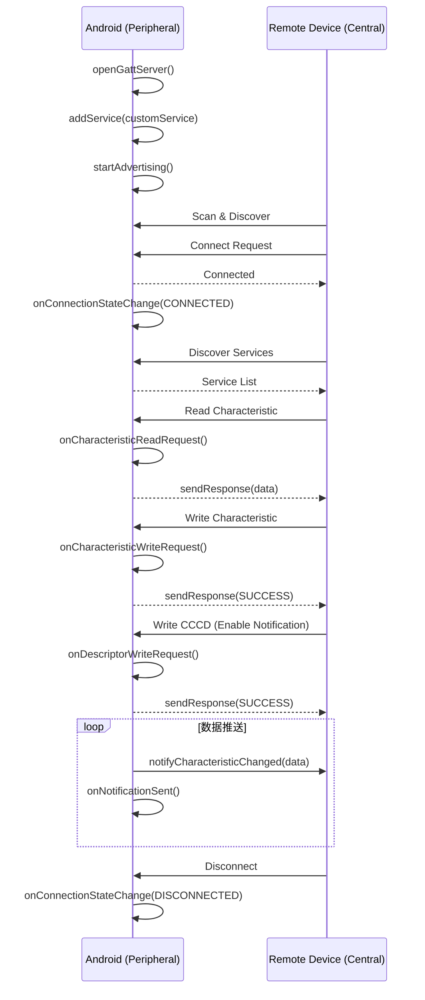

# BLE 外围模式

Android 设备不仅可以作为 Central（中心设备）连接外部 BLE 设备，还可以作为 Peripheral（外围设备）被其他设备连接。本文介绍如何将 Android 设备打造为一个 BLE GATT Server。

## 概述与应用场景

### Android 作为 Peripheral 的典型用途

| 场景 | 说明 |
|------|------|
| 设备间直连 | Android 手机/平板之间通过 BLE 传输数据，无需 WiFi |
| 信标模拟 | Android 设备模拟 iBeacon/Eddystone 信标 |
| 外围设备仿真 | 开发阶段模拟 BLE 外设，方便调试 Client 端代码 |
| IoT 网关 | Android 设备同时作为某些设备的 Central 和其他设备的 Peripheral |
| 数据分享 | 通过 BLE 广播小数据（如名片、配置信息） |

### 设备兼容性要求（API 21+ & 硬件支持检测）

BLE Peripheral 模式从 Android 5.0（API 21）开始支持，但**并非所有设备硬件都支持**。

```kotlin
fun isPeripheralModeSupported(context: Context): Boolean {
    val bluetoothManager = context.getSystemService(Context.BLUETOOTH_SERVICE) as BluetoothManager
    val adapter = bluetoothManager.adapter ?: return false

    // 检查是否支持多广播（Peripheral 模式的前提）
    return adapter.isMultipleAdvertisementSupported
}

fun isBluetoothLeAdvertiserAvailable(context: Context): Boolean {
    val bluetoothManager = context.getSystemService(Context.BLUETOOTH_SERVICE) as BluetoothManager
    return bluetoothManager.adapter?.bluetoothLeAdvertiser != null
}
```

**不支持 Peripheral 的常见情况：**
- 部分低端机型或旧芯片不支持
- 蓝牙未开启时 `bluetoothLeAdvertiser` 返回 null
- 模拟器通常不支持

## 广播配置

### BluetoothLeAdvertiser 获取与判空

```kotlin
val bluetoothManager = context.getSystemService(Context.BLUETOOTH_SERVICE) as BluetoothManager
val advertiser: BluetoothLeAdvertiser? = bluetoothManager.adapter?.bluetoothLeAdvertiser

if (advertiser == null) {
    Log.e(TAG, "Device does not support BLE advertising")
    return
}
```

### AdvertiseSettings 参数配置

#### 广播模式（LOW_POWER / BALANCED / LOW_LATENCY）

```kotlin
val settings = AdvertiseSettings.Builder()
    .setAdvertiseMode(AdvertiseSettings.ADVERTISE_MODE_BALANCED)
    .setTxPowerLevel(AdvertiseSettings.ADVERTISE_TX_POWER_MEDIUM)
    .setConnectable(true)  // 是否允许连接
    .setTimeout(0)         // 0 = 持续广播，非零 = 超时后停止（ms，最大 180000）
    .build()
```

| 广播模式 | 广播间隔 | 功耗 | 被发现速度 |
|---------|---------|------|----------|
| ADVERTISE_MODE_LOW_POWER | ~1000 ms | 低 | 慢 |
| ADVERTISE_MODE_BALANCED | ~250 ms | 中 | 中 |
| ADVERTISE_MODE_LOW_LATENCY | ~100 ms | 高 | 快 |

| 发射功率 | 大致范围 |
|---------|---------|
| ADVERTISE_TX_POWER_ULTRA_LOW | ~-21 dBm |
| ADVERTISE_TX_POWER_LOW | ~-15 dBm |
| ADVERTISE_TX_POWER_MEDIUM | ~-7 dBm |
| ADVERTISE_TX_POWER_HIGH | ~1 dBm |

#### 超时设置与持续广播

- `setTimeout(0)`：持续广播直到手动停止
- `setTimeout(30000)`：30 秒后自动停止
- 最大值 180000 ms（3 分钟），超过此值会抛出 `IllegalArgumentException`

### AdvertiseData 构建

#### Service UUID

```kotlin
val advertiseData = AdvertiseData.Builder()
    .setIncludeDeviceName(true)                              // 包含设备名称
    .setIncludeTxPowerLevel(false)                           // 是否包含发射功率
    .addServiceUuid(ParcelUuid(CUSTOM_SERVICE_UUID))         // 添加 Service UUID
    .build()
```

#### Manufacturer Specific Data

```kotlin
val advertiseData = AdvertiseData.Builder()
    .addManufacturerData(0x1234, byteArrayOf(0x01, 0x02, 0x03))
    .build()
```

**注意 31 字节限制：** BLE 4.x 广播包总共只有 31 字节，设备名称、Service UUID、Manufacturer Data 需合理分配。设备名称较长时建议放入 Scan Response。

```kotlin
// 广播数据（必须精简）
val advertiseData = AdvertiseData.Builder()
    .setIncludeDeviceName(false) // 名称放到 Scan Response
    .addServiceUuid(ParcelUuid(CUSTOM_SERVICE_UUID))
    .build()

// Scan Response（额外 31 字节）
val scanResponse = AdvertiseData.Builder()
    .setIncludeDeviceName(true)
    .addServiceData(ParcelUuid(CUSTOM_SERVICE_UUID), byteArrayOf(0x01))
    .build()
```

### 启动与停止广播

```kotlin
private val advertiseCallback = object : AdvertiseCallback() {
    override fun onStartSuccess(settingsInEffect: AdvertiseSettings) {
        Log.d(TAG, "Advertising started successfully")
    }

    override fun onStartFailure(errorCode: Int) {
        when (errorCode) {
            ADVERTISE_FAILED_DATA_TOO_LARGE -> Log.e(TAG, "Advertise data too large")
            ADVERTISE_FAILED_TOO_MANY_ADVERTISERS -> Log.e(TAG, "Too many advertisers")
            ADVERTISE_FAILED_ALREADY_STARTED -> Log.e(TAG, "Already started")
            ADVERTISE_FAILED_INTERNAL_ERROR -> Log.e(TAG, "Internal error")
            ADVERTISE_FAILED_FEATURE_UNSUPPORTED -> Log.e(TAG, "Feature unsupported")
        }
    }
}

// 启动广播
advertiser.startAdvertising(settings, advertiseData, scanResponse, advertiseCallback)

// 停止广播
advertiser.stopAdvertising(advertiseCallback)
```

### AdvertiseCallback 回调处理

`ADVERTISE_FAILED_DATA_TOO_LARGE` 是最常见的错误——当广播数据超过 31 字节时触发。解决方法：减少广播内容，将非必要数据移入 Scan Response 或连接后通过 GATT 读取。

## GATT Server 搭建

### BluetoothGattServer 创建

```kotlin
private var gattServer: BluetoothGattServer? = null

fun startGattServer(context: Context) {
    val bluetoothManager = context.getSystemService(Context.BLUETOOTH_SERVICE) as BluetoothManager
    gattServer = bluetoothManager.openGattServer(context, gattServerCallback)

    if (gattServer == null) {
        Log.e(TAG, "Failed to open GATT server")
        return
    }

    // 添加自定义 Service
    val service = createCustomService()
    gattServer?.addService(service)
}
```

### 自定义 Service 与 Characteristic

#### 设置属性（PROPERTY_READ / WRITE / NOTIFY）

```kotlin
fun createCustomService(): BluetoothGattService {
    val service = BluetoothGattService(
        CUSTOM_SERVICE_UUID,
        BluetoothGattService.SERVICE_TYPE_PRIMARY
    )

    // 可读 Characteristic（如设备信息）
    val readCharacteristic = BluetoothGattCharacteristic(
        CHAR_READ_UUID,
        BluetoothGattCharacteristic.PROPERTY_READ,
        BluetoothGattCharacteristic.PERMISSION_READ
    )

    // 可写 Characteristic（如接收命令）
    val writeCharacteristic = BluetoothGattCharacteristic(
        CHAR_WRITE_UUID,
        BluetoothGattCharacteristic.PROPERTY_WRITE or
            BluetoothGattCharacteristic.PROPERTY_WRITE_NO_RESPONSE,
        BluetoothGattCharacteristic.PERMISSION_WRITE
    )

    // 可通知 Characteristic（如数据推送）
    val notifyCharacteristic = BluetoothGattCharacteristic(
        CHAR_NOTIFY_UUID,
        BluetoothGattCharacteristic.PROPERTY_NOTIFY or
            BluetoothGattCharacteristic.PROPERTY_READ,
        BluetoothGattCharacteristic.PERMISSION_READ
    )

    // 为通知 Characteristic 添加 CCCD
    val cccd = BluetoothGattDescriptor(
        CCCD_UUID,
        BluetoothGattDescriptor.PERMISSION_READ or BluetoothGattDescriptor.PERMISSION_WRITE
    )
    notifyCharacteristic.addDescriptor(cccd)

    service.addCharacteristic(readCharacteristic)
    service.addCharacteristic(writeCharacteristic)
    service.addCharacteristic(notifyCharacteristic)

    return service
}
```

### 添加 Descriptor（CCCD 等）

CCCD 是通知功能必须的 Descriptor，Client 通过写入 CCCD 来订阅/取消订阅 Notification。如果遗漏 CCCD，Client 将无法开启通知。

### 向 Server 注册 Service

```kotlin
gattServer?.addService(service)
// 注册结果通过 onServiceAdded 回调返回
```

注意：`addService()` 是异步操作，如果需要注册多个 Service，必须等 `onServiceAdded` 回调后再注册下一个。

## 处理 Client 请求

### BluetoothGattServerCallback 回调

```kotlin
private val gattServerCallback = object : BluetoothGattServerCallback() {

    override fun onConnectionStateChange(device: BluetoothDevice, status: Int, newState: Int) {
        when (newState) {
            BluetoothProfile.STATE_CONNECTED -> {
                Log.d(TAG, "Device connected: ${device.address}")
                connectedDevices.add(device)
            }
            BluetoothProfile.STATE_DISCONNECTED -> {
                Log.d(TAG, "Device disconnected: ${device.address}")
                connectedDevices.remove(device)
            }
        }
    }

    override fun onServiceAdded(status: Int, service: BluetoothGattService) {
        if (status == BluetoothGatt.GATT_SUCCESS) {
            Log.d(TAG, "Service added: ${service.uuid}")
        }
    }

    override fun onCharacteristicReadRequest(
        device: BluetoothDevice, requestId: Int, offset: Int,
        characteristic: BluetoothGattCharacteristic
    ) { /* 见下文 */ }

    override fun onCharacteristicWriteRequest(
        device: BluetoothDevice, requestId: Int,
        characteristic: BluetoothGattCharacteristic,
        preparedWrite: Boolean, responseNeeded: Boolean,
        offset: Int, value: ByteArray
    ) { /* 见下文 */ }

    override fun onDescriptorWriteRequest(
        device: BluetoothDevice, requestId: Int,
        descriptor: BluetoothGattDescriptor,
        preparedWrite: Boolean, responseNeeded: Boolean,
        offset: Int, value: ByteArray
    ) { /* 处理 CCCD 写入 */ }

    override fun onNotificationSent(device: BluetoothDevice, status: Int) {
        // Notification 发送完成
    }

    override fun onMtuChanged(device: BluetoothDevice, mtu: Int) {
        Log.d(TAG, "MTU changed to $mtu for ${device.address}")
    }
}
```

### onCharacteristicReadRequest 处理

```kotlin
override fun onCharacteristicReadRequest(
    device: BluetoothDevice, requestId: Int, offset: Int,
    characteristic: BluetoothGattCharacteristic
) {
    val responseData = when (characteristic.uuid) {
        CHAR_READ_UUID -> "Hello BLE".toByteArray()
        else -> byteArrayOf()
    }

    // 必须发送响应，否则 Client 会超时
    gattServer?.sendResponse(
        device, requestId, BluetoothGatt.GATT_SUCCESS, offset,
        responseData.copyOfRange(offset, responseData.size)
    )
}
```

### onCharacteristicWriteRequest 处理

```kotlin
override fun onCharacteristicWriteRequest(
    device: BluetoothDevice, requestId: Int,
    characteristic: BluetoothGattCharacteristic,
    preparedWrite: Boolean, responseNeeded: Boolean,
    offset: Int, value: ByteArray
) {
    // 处理接收到的数据
    when (characteristic.uuid) {
        CHAR_WRITE_UUID -> {
            processReceivedData(device, value)
        }
    }

    // 如果需要响应（Write Request，非 Write Without Response）
    if (responseNeeded) {
        gattServer?.sendResponse(
            device, requestId, BluetoothGatt.GATT_SUCCESS, offset, value
        )
    }
}
```

**关键：** 当 `responseNeeded = true` 时必须调用 `sendResponse()`，否则 Client 端会一直等待超时。

### 发送 Notification 给 Client

```kotlin
fun sendNotification(device: BluetoothDevice, data: ByteArray) {
    val characteristic = gattServer
        ?.getService(CUSTOM_SERVICE_UUID)
        ?.getCharacteristic(CHAR_NOTIFY_UUID) ?: return

    if (Build.VERSION.SDK_INT >= Build.VERSION_CODES.TIRAMISU) {
        gattServer?.notifyCharacteristicChanged(device, characteristic, false, data)
    } else {
        @Suppress("DEPRECATION")
        characteristic.value = data
        @Suppress("DEPRECATION")
        gattServer?.notifyCharacteristicChanged(device, characteristic, false)
    }
}

// 向所有已连接且订阅了通知的设备发送
fun broadcastNotification(data: ByteArray) {
    connectedDevices.forEach { device ->
        sendNotification(device, data)
    }
}
```

### onConnectionStateChange 连接管理

维护已连接设备列表，用于广播通知和资源清理：

```kotlin
private val connectedDevices = mutableSetOf<BluetoothDevice>()

override fun onConnectionStateChange(device: BluetoothDevice, status: Int, newState: Int) {
    when (newState) {
        BluetoothProfile.STATE_CONNECTED -> {
            connectedDevices.add(device)
            // 可选：连接后停止广播以节省功耗
            // advertiser.stopAdvertising(advertiseCallback)
        }
        BluetoothProfile.STATE_DISCONNECTED -> {
            connectedDevices.remove(device)
            // 可选：断开后恢复广播
            // advertiser.startAdvertising(settings, data, scanResponse, advertiseCallback)
        }
    }
}
```

## 完整流程图



## 踩坑记录

> 此区域供团队成员补充项目中遇到的真实案例。

| 日期 | 记录人 | 问题描述 | 解决方案 |
|------|--------|----------|----------|
| | | | |

## 参考资料

- [Android BLE Peripheral Guide](https://developer.android.com/develop/connectivity/bluetooth/ble/ble-overview)
- [BluetoothGattServer API Reference](https://developer.android.com/reference/android/bluetooth/BluetoothGattServer)
- [BluetoothLeAdvertiser API Reference](https://developer.android.com/reference/android/bluetooth/le/BluetoothLeAdvertiser)
- [AdvertiseSettings API Reference](https://developer.android.com/reference/android/bluetooth/le/AdvertiseSettings)
