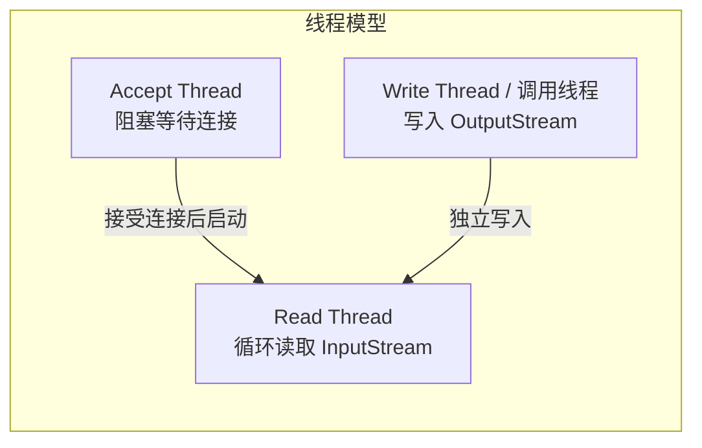
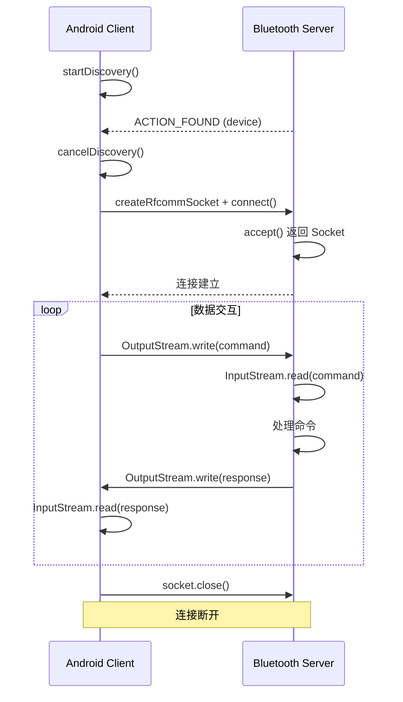

# 经典蓝牙通信

经典蓝牙（Classic Bluetooth）基于 RFCOMM/SPP 协议，提供面向流的数据传输，适合需要持续、较大数据量传输的场景。本文聚焦经典蓝牙的设备发现、连接建立与数据传输。

## 经典蓝牙 vs BLE 选型回顾

| 维度 | 经典蓝牙 | BLE |
|------|---------|-----|
| 数据模型 | 面向流（类似 TCP Socket） | 面向属性（GATT 读写） |
| 传输速率 | 最高 3 Mbps（EDR） | 最高 2 Mbps（理论，实际低很多） |
| 持续传输 | 天然支持 | 需要分包 + 队列化 |
| 连接前提 | 通常需要配对 | 可不配对直接连接 |
| 典型场景 | 音频、打印、SPP 串口、大文件 | 传感器、穿戴、信标、OTA |
| 功耗 | 较高 | 极低 |

**选择经典蓝牙的场景：** SPP 串口透传（工业设备、嵌入式模块）、蓝牙打印机通信、对端设备仅支持经典蓝牙。

## 设备发现

### BluetoothAdapter.startDiscovery()

经典蓝牙的设备发现使用 Inquiry 扫描机制，通过广播方式监听附近可被发现的设备：

```kotlin
val bluetoothAdapter: BluetoothAdapter? = BluetoothAdapter.getDefaultAdapter()

fun startDiscovery() {
    // 如果正在发现，先取消
    if (bluetoothAdapter?.isDiscovering == true) {
        bluetoothAdapter.cancelDiscovery()
    }
    bluetoothAdapter?.startDiscovery()
}
```

### BroadcastReceiver 监听发现结果

经典蓝牙设备发现通过广播机制传递结果：

```kotlin
private val discoveryReceiver = object : BroadcastReceiver() {
    override fun onReceive(context: Context, intent: Intent) {
        when (intent.action) {
            BluetoothDevice.ACTION_FOUND -> {
                val device: BluetoothDevice? = if (Build.VERSION.SDK_INT >= Build.VERSION_CODES.TIRAMISU) {
                    intent.getParcelableExtra(BluetoothDevice.EXTRA_DEVICE, BluetoothDevice::class.java)
                } else {
                    @Suppress("DEPRECATION")
                    intent.getParcelableExtra(BluetoothDevice.EXTRA_DEVICE)
                }
                val rssi = intent.getShortExtra(BluetoothDevice.EXTRA_RSSI, Short.MIN_VALUE)
                val name = device?.name
                Log.d(TAG, "Found device: $name [${device?.address}] RSSI=$rssi")
            }

            BluetoothAdapter.ACTION_DISCOVERY_STARTED -> {
                Log.d(TAG, "Discovery started")
            }

            BluetoothAdapter.ACTION_DISCOVERY_FINISHED -> {
                Log.d(TAG, "Discovery finished")
            }
        }
    }
}

// 注册 Receiver
fun registerDiscoveryReceiver(context: Context) {
    val filter = IntentFilter().apply {
        addAction(BluetoothDevice.ACTION_FOUND)
        addAction(BluetoothAdapter.ACTION_DISCOVERY_STARTED)
        addAction(BluetoothAdapter.ACTION_DISCOVERY_FINISHED)
    }
    context.registerReceiver(discoveryReceiver, filter)
}
```

### 发现超时与主动停止

经典蓝牙发现过程默认持续约 12 秒，之后自动停止并发送 `ACTION_DISCOVERY_FINISHED` 广播。

```kotlin
// 主动取消发现（如用户选择了设备，或需要连接）
fun cancelDiscovery() {
    bluetoothAdapter?.cancelDiscovery()
}
```

**重要：** 在发起 RFCOMM 连接之前，**必须**停止 Discovery。Discovery 过程会严重影响连接性能，甚至导致连接失败。

### 已配对设备列表（getBondedDevices）

跳过发现流程，直接获取已配对（绑定）的设备列表：

```kotlin
fun getBondedDevices(): Set<BluetoothDevice> {
    return bluetoothAdapter?.bondedDevices ?: emptySet()
}

// 遍历已配对设备
bluetoothAdapter?.bondedDevices?.forEach { device ->
    Log.d(TAG, "Bonded: ${device.name} [${device.address}]")
}
```

## RFCOMM 连接

### BluetoothSocket 概述

`BluetoothSocket` 是经典蓝牙数据传输的核心，提供类似 TCP Socket 的流式接口。连接建立后，通过 `InputStream` / `OutputStream` 进行双向数据读写。

### SPP UUID（00001101-0000-1000-8000-00805F9B34FB）

SPP（Serial Port Profile）是经典蓝牙中最常用的串口透传 Profile，使用固定的标准 UUID：

```kotlin
companion object {
    val SPP_UUID: UUID = UUID.fromString("00001101-0000-1000-8000-00805F9B34FB")
}
```

如果对端设备使用自定义 UUID（如某些嵌入式模块），需要替换为对应的 UUID。

### 客户端连接流程

#### createRfcommSocketToServiceRecord

```kotlin
class BluetoothClient(private val device: BluetoothDevice) {
    private var socket: BluetoothSocket? = null
    private var inputStream: InputStream? = null
    private var outputStream: OutputStream? = null

    fun connect() {
        // 确保已停止 Discovery
        BluetoothAdapter.getDefaultAdapter()?.cancelDiscovery()

        socket = device.createRfcommSocketToServiceRecord(SPP_UUID)
        // 如果上面的方法失败，可尝试反射方式（见下文踩坑记录）
    }
}
```

#### connect() 与异常处理

```kotlin
fun connect() {
    BluetoothAdapter.getDefaultAdapter()?.cancelDiscovery()

    try {
        socket = device.createRfcommSocketToServiceRecord(SPP_UUID)
        socket?.connect() // 阻塞调用，必须在非主线程执行

        inputStream = socket?.inputStream
        outputStream = socket?.outputStream
        Log.d(TAG, "Connected to ${device.name}")
    } catch (e: IOException) {
        Log.e(TAG, "Connection failed: ${e.message}")
        close()
        // 可尝试使用反射方式创建 Socket 重试
        connectFallback()
    }
}

// 部分设备 createRfcommSocketToServiceRecord 失败时的备选方案
private fun connectFallback() {
    try {
        val method = device.javaClass.getMethod(
            "createRfcommSocket", Int::class.javaPrimitiveType
        )
        socket = method.invoke(device, 1) as BluetoothSocket
        socket?.connect()
        inputStream = socket?.inputStream
        outputStream = socket?.outputStream
        Log.d(TAG, "Fallback connection succeeded")
    } catch (e: Exception) {
        Log.e(TAG, "Fallback connection also failed: ${e.message}")
        close()
    }
}

fun close() {
    try { inputStream?.close() } catch (_: IOException) {}
    try { outputStream?.close() } catch (_: IOException) {}
    try { socket?.close() } catch (_: IOException) {}
}
```

### 服务端监听流程

#### BluetoothServerSocket

Android 设备可以作为经典蓝牙服务端，等待其他设备连接。

#### listenUsingRfcommWithServiceRecord

```kotlin
class BluetoothServer {
    private var serverSocket: BluetoothServerSocket? = null
    private var isRunning = false

    fun startServer() {
        val adapter = BluetoothAdapter.getDefaultAdapter() ?: return

        serverSocket = adapter.listenUsingRfcommWithServiceRecord(
            "MyBluetoothServer", // SDP 服务名称
            SPP_UUID             // 服务 UUID
        )

        isRunning = true
        acceptThread.start()
    }
}
```

#### accept() 阻塞等待

```kotlin
private val acceptThread = Thread {
    while (isRunning) {
        try {
            val clientSocket: BluetoothSocket? = serverSocket?.accept() // 阻塞等待
            clientSocket?.let { socket ->
                Log.d(TAG, "Client connected: ${socket.remoteDevice.address}")
                handleClientConnection(socket)
            }
        } catch (e: IOException) {
            if (isRunning) {
                Log.e(TAG, "Accept failed: ${e.message}")
            }
            break
        }
    }
}

fun stopServer() {
    isRunning = false
    try { serverSocket?.close() } catch (_: IOException) {}
}
```

## 主从模式详解

### Server 端实现

Server 端（从设备）监听连接请求，接受后进入数据交互：

```kotlin
class ClassicBluetoothServer(private val onDataReceived: (ByteArray) -> Unit) {
    private var serverSocket: BluetoothServerSocket? = null
    private var clientSocket: BluetoothSocket? = null
    private var isRunning = false

    fun start() {
        val adapter = BluetoothAdapter.getDefaultAdapter() ?: return
        serverSocket = adapter.listenUsingRfcommWithServiceRecord("SPP_Server", SPP_UUID)
        isRunning = true

        Thread {
            while (isRunning) {
                try {
                    clientSocket = serverSocket?.accept()
                    clientSocket?.let { startDataExchange(it) }
                } catch (e: IOException) {
                    if (isRunning) Log.e(TAG, "Accept error: ${e.message}")
                    break
                }
            }
        }.start()
    }

    fun stop() {
        isRunning = false
        clientSocket?.close()
        serverSocket?.close()
    }
}
```

### Client 端实现

Client 端（主设备）主动发起连接请求：

```kotlin
class ClassicBluetoothClient(
    private val device: BluetoothDevice,
    private val onDataReceived: (ByteArray) -> Unit
) {
    private var socket: BluetoothSocket? = null

    fun connect() {
        BluetoothAdapter.getDefaultAdapter()?.cancelDiscovery()

        Thread {
            try {
                socket = device.createRfcommSocketToServiceRecord(SPP_UUID)
                socket?.connect()
                socket?.let { startDataExchange(it) }
            } catch (e: IOException) {
                Log.e(TAG, "Connection failed: ${e.message}")
                socket?.close()
            }
        }.start()
    }

    fun disconnect() {
        socket?.close()
    }
}
```

### 角色切换与多连接

经典蓝牙理论上支持同时连接最多 7 个 Active Slave，但 Android 实际限制取决于芯片和 ROM 实现。Server 端可在 `accept()` 循环中接受多个 Client 连接。

## 数据流传输

### InputStream / OutputStream 读写

```kotlin
private fun startDataExchange(socket: BluetoothSocket) {
    val inputStream = socket.inputStream
    val outputStream = socket.outputStream

    // 读线程
    Thread {
        val buffer = ByteArray(1024)
        while (socket.isConnected) {
            try {
                val bytesRead = inputStream.read(buffer)
                if (bytesRead > 0) {
                    val data = buffer.copyOf(bytesRead)
                    onDataReceived(data)
                }
            } catch (e: IOException) {
                Log.d(TAG, "Connection closed: ${e.message}")
                break
            }
        }
    }.start()
}

// 发送数据
fun sendData(data: ByteArray) {
    try {
        outputStream?.write(data)
        outputStream?.flush()
    } catch (e: IOException) {
        Log.e(TAG, "Send failed: ${e.message}")
    }
}
```

### 线程模型设计

经典蓝牙数据传输涉及三个线程：



- **Accept 线程**：Server 端阻塞等待连接（`serverSocket.accept()`）
- **Read 线程**：独立线程循环读取 InputStream，处理接收数据
- **Write 操作**：可在任意线程写入 OutputStream（注意线程安全）

```kotlin
// 线程安全的写入
private val writeLock = Object()

fun sendDataThreadSafe(data: ByteArray) {
    synchronized(writeLock) {
        try {
            outputStream?.write(data)
            outputStream?.flush()
        } catch (e: IOException) {
            Log.e(TAG, "Send failed: ${e.message}")
        }
    }
}
```

### 数据协议与帧格式设计

经典蓝牙是流式传输，没有消息边界。需要自行设计应用层协议来区分消息：

**常用帧格式：**

```
| Header (2B) | Length (2B) | Command (1B) | Payload (N B) | Checksum (1B) |
| 0xAA 0x55   | 高位 低位    | 指令码        | 数据           | 异或校验       |
```

```kotlin
object FrameProtocol {
    private const val HEADER_1: Byte = 0xAA.toByte()
    private const val HEADER_2: Byte = 0x55

    fun buildFrame(command: Byte, payload: ByteArray): ByteArray {
        val length = payload.size + 1 // command + payload
        val frame = ByteArray(5 + payload.size) // header(2) + length(2) + cmd(1) + payload + checksum(1)

        frame[0] = HEADER_1
        frame[1] = HEADER_2
        frame[2] = (length shr 8).toByte()
        frame[3] = (length and 0xFF).toByte()
        frame[4] = command
        payload.copyInto(frame, 5)
        frame[frame.size - 1] = calculateChecksum(frame, 2, frame.size - 1)

        return frame
    }

    fun parseFrame(buffer: ByteArray): ParseResult? {
        if (buffer.size < 6) return null
        if (buffer[0] != HEADER_1 || buffer[1] != HEADER_2) return null

        val length = ((buffer[2].toInt() and 0xFF) shl 8) or (buffer[3].toInt() and 0xFF)
        val totalSize = 4 + length + 1 // header(2) + length(2) + data(length) + checksum(1)

        if (buffer.size < totalSize) return null

        val command = buffer[4]
        val payload = buffer.copyOfRange(5, 4 + length)
        return ParseResult(command, payload)
    }

    private fun calculateChecksum(data: ByteArray, start: Int, end: Int): Byte {
        var xor: Byte = 0
        for (i in start until end) {
            xor = (xor.toInt() xor data[i].toInt()).toByte()
        }
        return xor
    }

    data class ParseResult(val command: Byte, val payload: ByteArray)
}
```

### 大数据传输与分包

经典蓝牙流式传输无需像 BLE 那样受 MTU 限制分包，但实际使用中仍需注意：
- InputStream.read() 可能返回部分数据（TCP 粘包/拆包类似问题）
- 使用帧协议 + 缓冲区累积，确保完整消息解析
- 大文件传输建议添加进度回调和分块校验

## 经典蓝牙 Profiles 概览

### SPP（Serial Port Profile）

最常用的经典蓝牙 Profile，模拟 RS-232 串口：
- 提供点对点的流式数据通道
- 工业设备、蓝牙透传模块（如 HC-05/HC-06）的标准通信方式
- 使用标准 UUID `00001101-0000-1000-8000-00805F9B34FB`

### HID（Human Interface Device）

用于人机接口设备（键盘、鼠标、游戏手柄）：
- 系统级 Profile，Android 自动处理
- 应用层一般不直接操作 HID
- 配对后设备自动识别为输入设备

### PAN（Personal Area Network）

用于蓝牙网络共享：
- 实现蓝牙 Tethering（手机热点通过蓝牙分享）
- 系统级功能，应用层较少直接使用

## 连接流程序列图



## 踩坑记录

> 此区域供团队成员补充项目中遇到的真实案例。

| 日期 | 记录人 | 问题描述 | 解决方案 |
|------|--------|----------|----------|
| | | | |

## 参考资料

- [Android Classic Bluetooth Guide](https://developer.android.com/develop/connectivity/bluetooth/bt-overview)
- [BluetoothSocket API Reference](https://developer.android.com/reference/android/bluetooth/BluetoothSocket)
- [BluetoothServerSocket API Reference](https://developer.android.com/reference/android/bluetooth/BluetoothServerSocket)
- [Bluetooth SPP Profile Specification](https://www.bluetooth.com/specifications/specs/serial-port-profile/)
