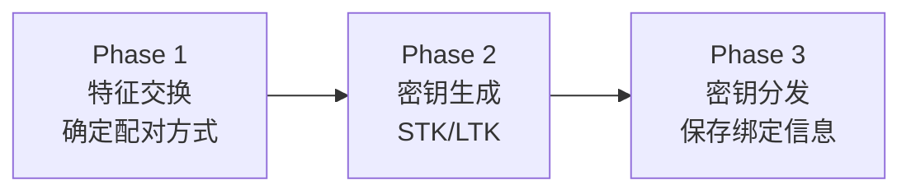
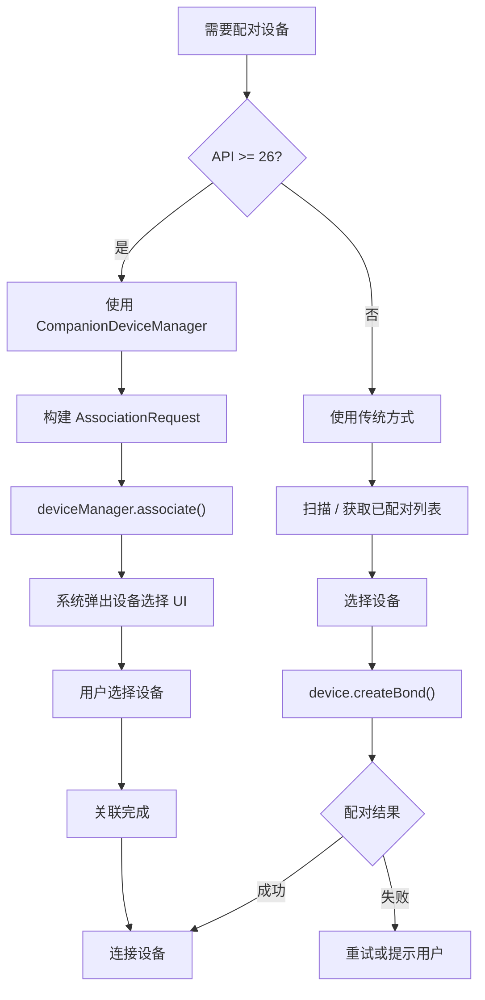

# 配对绑定与 CompanionDevice

蓝牙配对（Pairing）和绑定（Bonding）是建立安全通信的基础。Android 8.0 引入的 `CompanionDeviceManager` 则提供了现代化的设备关联方式，简化权限和配对流程。

## 配对（Pairing）vs 绑定（Bonding）

### 概念区分

| 概念 | 说明 | 持久性 |
|------|------|--------|
| **配对（Pairing）** | 两台设备协商加密密钥的过程 | 临时的，仅在当前连接期间有效 |
| **绑定（Bonding）** | 将配对产生的密钥存储到设备中 | 持久的，设备重启后仍可使用 |

在 Android API 中，`BluetoothDevice.getBondState()` 返回的状态实际描述的是绑定状态：

| 状态 | 常量 | 说明 |
|------|------|------|
| 未绑定 | `BOND_NONE` (10) | 未配对或配对信息已清除 |
| 绑定中 | `BOND_BONDING` (11) | 配对正在进行 |
| 已绑定 | `BOND_BONDED` (12) | 配对完成且密钥已保存 |

### 配对流程中的密钥交换

BLE 配对过程分为三个阶段：



1. **Phase 1 — 特征交换**：双方交换 IO 能力、认证需求，协商配对方式
2. **Phase 2 — 密钥生成**：生成短期密钥（STK）或长期密钥（LTK），加密链路
3. **Phase 3 — 密钥分发**：交换并保存 LTK、IRK（Identity Resolving Key）等，完成绑定

### 绑定信息的存储与持久化

Android 系统将绑定信息存储在 `/data/misc/bluedroid/` 或 `/data/misc/bluetooth/` 目录下（需 root 访问）。绑定信息包括：
- LTK（Long Term Key）：加密密钥
- IRK（Identity Resolving Key）：用于解析随机地址
- CSRK（Connection Signature Resolving Key）：数据签名

恢复出厂设置或清除蓝牙存储会丢失所有绑定信息。

## 配对方式

蓝牙规范定义了四种配对方式，由双方设备的 IO 能力决定：

### Just Works

- 无需用户交互，自动完成配对
- 安全性最低（易受中间人攻击）
- 适用场景：没有显示屏和输入设备的简单外设（如 BLE 温度传感器）

### Numeric Comparison（数值比较）

- 双方设备显示一个 6 位数字，用户确认两端数字相同
- BLE 4.2+ 的 LE Secure Connections 默认方式
- 安全性高，可防御中间人攻击
- 需要双方都有显示能力

### Passkey Entry（密码输入）

- 一方显示 6 位数字，另一方输入
- 适用于一端有显示、另一端有输入的场景
- 安全性中等

### Out of Band（OOB 带外配对）

- 通过非蓝牙通道（NFC、二维码等）交换配对信息
- 安全性最高
- 适用于有 NFC 能力的设备快速配对

### 各方式安全级别对比

| 配对方式 | 用户交互 | 中间人防护 | IO 要求 | 典型设备 |
|---------|---------|-----------|---------|---------|
| Just Works | 无 | 无 | 无 | 简单传感器 |
| Numeric Comparison | 确认数字 | 有 | 双方有显示 | 手机对手机 |
| Passkey Entry | 输入数字 | 有 | 一方显示 + 一方输入 | 手机对键盘 |
| OOB | 扫码/NFC | 有 | NFC / 摄像头 | 智能设备快速配对 |

## Android 传统配对流程

### createBond() 主动发起配对

```kotlin
fun startBonding(device: BluetoothDevice) {
    if (device.bondState == BluetoothDevice.BOND_BONDED) {
        Log.d(TAG, "Already bonded")
        return
    }
    device.createBond() // 异步操作，结果通过广播返回
}
```

### ACTION_PAIRING_REQUEST 广播处理

```kotlin
private val pairingReceiver = object : BroadcastReceiver() {
    override fun onReceive(context: Context, intent: Intent) {
        when (intent.action) {
            BluetoothDevice.ACTION_PAIRING_REQUEST -> {
                val device: BluetoothDevice? = intent.getParcelableExtra(BluetoothDevice.EXTRA_DEVICE)
                val pairingVariant = intent.getIntExtra(
                    BluetoothDevice.EXTRA_PAIRING_VARIANT,
                    BluetoothDevice.ERROR
                )
                val pairingKey = intent.getIntExtra(BluetoothDevice.EXTRA_PAIRING_KEY, BluetoothDevice.ERROR)

                Log.d(TAG, "Pairing request: variant=$pairingVariant, key=$pairingKey")

                when (pairingVariant) {
                    BluetoothDevice.PAIRING_VARIANT_PIN -> {
                        // 需要输入 PIN 码
                    }
                    BluetoothDevice.PAIRING_VARIANT_PASSKEY_CONFIRMATION -> {
                        // 数值比较，显示 pairingKey 让用户确认
                    }
                }
            }

            BluetoothDevice.ACTION_BOND_STATE_CHANGED -> {
                val device: BluetoothDevice? = intent.getParcelableExtra(BluetoothDevice.EXTRA_DEVICE)
                val bondState = intent.getIntExtra(BluetoothDevice.EXTRA_BOND_STATE, BluetoothDevice.ERROR)
                val prevState = intent.getIntExtra(BluetoothDevice.EXTRA_PREVIOUS_BOND_STATE, BluetoothDevice.ERROR)

                Log.d(TAG, "Bond state: $prevState -> $bondState")

                when (bondState) {
                    BluetoothDevice.BOND_BONDED -> {
                        // 配对成功，可以连接
                    }
                    BluetoothDevice.BOND_NONE -> {
                        if (prevState == BluetoothDevice.BOND_BONDING) {
                            // 配对失败
                        }
                    }
                }
            }
        }
    }
}
```

### 自动输入 PIN / 确认配对

某些场景需要自动完成配对（如工厂生产线上的自动化测试）：

```kotlin
// 自动设置 PIN 码（需要 BLUETOOTH_PRIVILEGED 或系统权限）
fun autoSetPin(device: BluetoothDevice, pin: String) {
    try {
        device.setPin(pin.toByteArray())
    } catch (e: Exception) {
        Log.e(TAG, "Auto set PIN failed: ${e.message}")
    }
}

// 自动确认配对
fun autoConfirmPairing(device: BluetoothDevice) {
    try {
        device.setPairingConfirmation(true)
    } catch (e: Exception) {
        Log.e(TAG, "Auto confirm failed: ${e.message}")
    }
}
```

### 配对状态监听（BOND_BONDING / BOND_BONDED / BOND_NONE）

```kotlin
fun registerBondStateReceiver(context: Context) {
    val filter = IntentFilter(BluetoothDevice.ACTION_BOND_STATE_CHANGED)
    context.registerReceiver(pairingReceiver, filter)
}
```

## 已绑定设备管理

### getBondedDevices() 查询

```kotlin
fun getBleBondedDevices(): List<BluetoothDevice> {
    val adapter = BluetoothAdapter.getDefaultAdapter() ?: return emptyList()
    return adapter.bondedDevices
        .filter { it.type == BluetoothDevice.DEVICE_TYPE_LE || it.type == BluetoothDevice.DEVICE_TYPE_DUAL }
        .toList()
}

fun getClassicBondedDevices(): List<BluetoothDevice> {
    val adapter = BluetoothAdapter.getDefaultAdapter() ?: return emptyList()
    return adapter.bondedDevices
        .filter { it.type == BluetoothDevice.DEVICE_TYPE_CLASSIC || it.type == BluetoothDevice.DEVICE_TYPE_DUAL }
        .toList()
}
```

### removeBond() 解除绑定（反射方式）

Android 没有公开的解绑 API，需要通过反射调用：

```kotlin
fun removeBond(device: BluetoothDevice): Boolean {
    return try {
        val method = device.javaClass.getMethod("removeBond")
        method.invoke(device) as Boolean
    } catch (e: Exception) {
        Log.e(TAG, "Remove bond failed: ${e.message}")
        false
    }
}
```

### 绑定信息与蓝牙缓存的关系

Android 系统会缓存已绑定设备的 GATT Service 信息。如果设备固件更新后 Service 结构变化，缓存会导致 `discoverServices()` 返回旧的 Service 列表。清除方法见 `10-连接稳定性与重连connection-stability.md` 中的蓝牙缓存章节。

## CompanionDeviceManager（Android 8.0+）

### CDM 的设计目标与优势

`CompanionDeviceManager`（CDM）是 Android 8.0 引入的现代化设备关联 API，解决传统蓝牙配对的几个痛点：

| 传统方式的痛点 | CDM 的解决方案 |
|-------------|-------------|
| 需要位置权限才能扫描 | CDM 内部处理扫描，应用无需位置权限 |
| 需要自行管理扫描流程 | CDM 提供系统级设备选择 UI |
| 后台扫描受限 | 关联设备可获得后台访问豁免 |
| 用户体验不统一 | 统一的系统级设备选择弹窗 |

### AssociationRequest 构建

#### BLE 设备过滤

```kotlin
val request = AssociationRequest.Builder()
    .addDeviceFilter(
        BluetoothLeDeviceFilter.Builder()
            .setScanFilter(
                ScanFilter.Builder()
                    .setServiceUuid(ParcelUuid(TARGET_SERVICE_UUID))
                    .build()
            )
            .setNamePattern(Pattern.compile("MyDevice.*"))
            .build()
    )
    .setSingleDevice(false) // false = 显示所有匹配设备供用户选择
    .build()
```

#### Classic 设备过滤

```kotlin
val request = AssociationRequest.Builder()
    .addDeviceFilter(
        BluetoothDeviceFilter.Builder()
            .setNamePattern(Pattern.compile("HC-05"))
            .build()
    )
    .build()
```

#### WiFi 设备过滤

CDM 也支持 WiFi 设备关联（Android 11+），但此处聚焦蓝牙场景。

### 发起关联请求流程

```kotlin
class CompanionDeviceActivity : AppCompatActivity() {

    private val deviceManager: CompanionDeviceManager by lazy {
        getSystemService(Context.COMPANION_DEVICE_SERVICE) as CompanionDeviceManager
    }

    private val associationLauncher = registerForActivityResult(
        ActivityResultContracts.StartIntentSenderForResult()
    ) { result ->
        if (result.resultCode == RESULT_OK) {
            val association = result.data?.let { data ->
                if (Build.VERSION.SDK_INT >= Build.VERSION_CODES.TIRAMISU) {
                    data.getParcelableExtra(
                        CompanionDeviceManager.EXTRA_ASSOCIATION,
                        AssociationInfo::class.java
                    )
                } else {
                    @Suppress("DEPRECATION")
                    data.getParcelableExtra<ScanResult>(CompanionDeviceManager.EXTRA_DEVICE)
                        ?: data.getParcelableExtra<BluetoothDevice>(CompanionDeviceManager.EXTRA_DEVICE)
                }
            }
            handleAssociationResult(association)
        }
    }

    fun startAssociation() {
        val request = AssociationRequest.Builder()
            .addDeviceFilter(
                BluetoothLeDeviceFilter.Builder()
                    .setScanFilter(
                        ScanFilter.Builder()
                            .setServiceUuid(ParcelUuid(TARGET_SERVICE_UUID))
                            .build()
                    )
                    .build()
            )
            .build()

        deviceManager.associate(
            request,
            object : CompanionDeviceManager.Callback() {
                @Deprecated("Deprecated in API 33")
                override fun onDeviceFound(chooserLauncher: IntentSender) {
                    // API < 33
                    associationLauncher.launch(
                        IntentSenderRequest.Builder(chooserLauncher).build()
                    )
                }

                override fun onAssociationPending(intentSender: IntentSender) {
                    // API 33+
                    associationLauncher.launch(
                        IntentSenderRequest.Builder(intentSender).build()
                    )
                }

                override fun onAssociationCreated(associationInfo: AssociationInfo) {
                    // API 33+，直接关联成功（singleDevice = true 时）
                }

                override fun onFailure(error: CharSequence?) {
                    Log.e(TAG, "Association failed: $error")
                }
            },
            null // Handler, null = main thread
        )
    }
}
```

### 关联结果处理

```kotlin
private fun handleAssociationResult(association: Any?) {
    when (association) {
        is AssociationInfo -> {
            // API 33+
            val macAddress = association.deviceMacAddress?.toString()
            Log.d(TAG, "Associated with: $macAddress")
        }
        is ScanResult -> {
            // BLE 设备
            val device = association.device
            connectToDevice(device)
        }
        is BluetoothDevice -> {
            // Classic 蓝牙设备
            connectToDevice(association)
        }
    }
}
```

### 已关联设备管理

```kotlin
// 查询已关联设备
fun getAssociatedDevices(): List<String> {
    return if (Build.VERSION.SDK_INT >= Build.VERSION_CODES.TIRAMISU) {
        deviceManager.myAssociations.map { it.deviceMacAddress?.toString() ?: "" }
    } else {
        @Suppress("DEPRECATION")
        deviceManager.associations
    }
}

// 解除关联
fun disassociate(macAddress: String) {
    if (Build.VERSION.SDK_INT >= Build.VERSION_CODES.TIRAMISU) {
        val association = deviceManager.myAssociations.find {
            it.deviceMacAddress?.toString() == macAddress
        }
        association?.let { deviceManager.disassociate(it.id) }
    } else {
        @Suppress("DEPRECATION")
        deviceManager.disassociate(macAddress)
    }
}
```

### CDM 与传统配对方式对比

| 维度 | 传统方式 | CompanionDeviceManager |
|------|---------|----------------------|
| 最低版本 | API 18 (BLE) / API 5 (Classic) | API 26 |
| 位置权限 | 需要（API 23+） | 不需要 |
| 扫描 UI | 需自行实现 | 系统提供标准弹窗 |
| 后台权限 | 需 Foreground Service | 关联后可获豁免 |
| 用户体验 | 自定义，参差不齐 | 统一、符合系统设计 |
| 灵活度 | 完全自由 | 受限于 CDM API 能力 |
| Google 推荐 | 逐渐不推荐 | 推荐 |

## 迁移建议

### 从传统配对迁移到 CDM 的策略

1. **新项目优先使用 CDM**（目标 API 26+）
2. **已有项目渐进迁移**：检测 API 版本，API 26+ 使用 CDM，低版本保留传统方式
3. **CDM 不适合的场景**：需要无弹窗的静默配对（工厂自动化）、需要极度自定义的扫描 UI

### 兼容旧设备的过渡方案

```kotlin
fun associateDevice(activity: Activity, device: BluetoothDevice?) {
    if (Build.VERSION.SDK_INT >= Build.VERSION_CODES.O && device == null) {
        // API 26+ 使用 CDM（发现 + 关联一体化）
        startCdmAssociation(activity)
    } else if (device != null) {
        // 已知设备，传统方式直接连接/配对
        device.createBond()
    }
}
```

## 配对流程图



## 踩坑记录

> 此区域供团队成员补充项目中遇到的真实案例。

| 日期 | 记录人 | 问题描述 | 解决方案 |
|------|--------|----------|----------|
| | | | |

## 参考资料

- [CompanionDeviceManager API Reference](https://developer.android.com/reference/android/companion/CompanionDeviceManager)
- [Companion Device Pairing Guide](https://developer.android.com/develop/connectivity/companion-device-pairing)
- [Bluetooth Pairing — Core Spec](https://www.bluetooth.com/specifications/specs/core-specification/)
- [Android 12 Companion Device Improvements](https://developer.android.com/about/versions/12/features#companion-device-manager)
