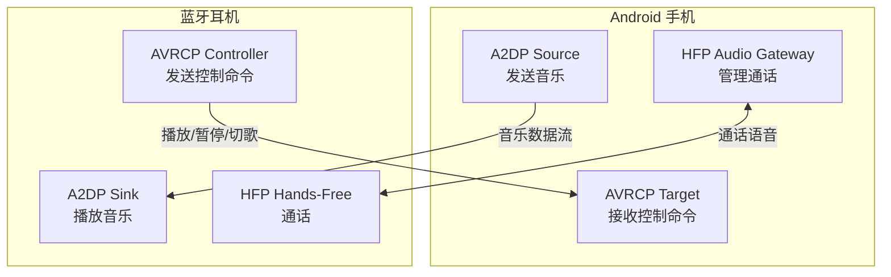
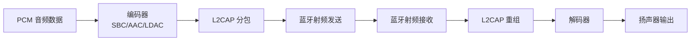

# 蓝牙音频

蓝牙音频是经典蓝牙最重要的应用场景之一。本文梳理 A2DP、HFP 等核心音频 Profile，以及 Android 13 引入的 LE Audio 新架构。

## 蓝牙音频 Profiles 总览

### A2DP（Advanced Audio Distribution Profile）

A2DP 用于传输高质量立体声音频，是蓝牙耳机、音箱播放音乐的核心 Profile。

**特点：**
- 单向传输：Source（音源端）→ Sink（播放端）
- 支持多种编解码：SBC（必选）、AAC、aptX、LDAC 等
- Android 手机通常作为 A2DP Source

### HFP（Hands-Free Profile）

HFP 用于通话场景，支持双向语音传输。

**特点：**
- 双向传输：通话语音的上行（麦克风）和下行（听筒/扬声器）
- 使用 SCO（Synchronous Connection-Oriented）链路
- 音质较 A2DP 差（语音编码，采样率 8/16 kHz）
- 支持来电接听、挂断、音量控制等控制指令

### AVRCP（Audio/Video Remote Control Profile）

AVRCP 用于远程控制音频/视频播放。

**特点：**
- 配合 A2DP 使用，传输播放控制命令（播放、暂停、上/下一曲）
- 支持曲目信息传输（歌名、艺术家、专辑封面）
- 蓝牙耳机上的物理按键通常通过 AVRCP 实现

### 各 Profile 关系与协作



## A2DP 高质量音频

### A2DP 工作原理

A2DP 音频传输流程：



### SBC / AAC / aptX / LDAC 编解码对比

| 编解码 | 码率 | 采样率 | 音质 | 延迟 | 授权 | Android 支持 |
|--------|------|--------|------|------|------|-------------|
| SBC | 最高 345 kbps | 48 kHz | 基础 | ~150 ms | 免费（必选） | 全版本 |
| AAC | 最高 320 kbps | 48 kHz | 较好 | ~120 ms | 免费 | 8.0+ |
| aptX | 384 kbps | 48 kHz | 好 | ~70 ms | 高通专利 | 设备依赖 |
| aptX HD | 576 kbps | 48 kHz/24bit | 很好 | ~130 ms | 高通专利 | 设备依赖 |
| LDAC | 最高 990 kbps | 96 kHz/24bit | 极好（接近有线） | ~160 ms | Sony 开源 | 8.0+ |

**选择原则：**
- SBC 是所有蓝牙音频设备的保底编解码
- Android 8.0+ 系统内置 LDAC 支持，与支持 LDAC 的耳机搭配音质最佳
- AAC 在 iOS 生态中主流，Android 上部分设备编码质量参差不齐
- aptX 系列依赖高通芯片组

### BluetoothA2dp API 使用

```kotlin
class A2dpManager(private val context: Context) {
    private var bluetoothA2dp: BluetoothA2dp? = null
    private val adapter = BluetoothAdapter.getDefaultAdapter()

    private val profileListener = object : BluetoothProfile.ServiceListener {
        override fun onServiceConnected(profile: Int, proxy: BluetoothProfile) {
            if (profile == BluetoothProfile.A2DP) {
                bluetoothA2dp = proxy as BluetoothA2dp
                // 获取已连接的 A2DP 设备
                val connectedDevices = bluetoothA2dp?.connectedDevices ?: emptyList()
                Log.d(TAG, "A2DP connected devices: ${connectedDevices.size}")
            }
        }

        override fun onServiceDisconnected(profile: Int) {
            if (profile == BluetoothProfile.A2DP) {
                bluetoothA2dp = null
            }
        }
    }

    fun init() {
        adapter?.getProfileProxy(context, profileListener, BluetoothProfile.A2DP)
    }

    fun release() {
        bluetoothA2dp?.let { adapter?.closeProfileProxy(BluetoothProfile.A2DP, it) }
    }

    fun getConnectedA2dpDevices(): List<BluetoothDevice> {
        return bluetoothA2dp?.connectedDevices ?: emptyList()
    }

    fun isA2dpPlaying(device: BluetoothDevice): Boolean {
        return bluetoothA2dp?.isA2dpPlaying(device) ?: false
    }
}
```

### 音频路由切换

```kotlin
// 监听 A2DP 连接状态变化
private val a2dpReceiver = object : BroadcastReceiver() {
    override fun onReceive(context: Context, intent: Intent) {
        when (intent.action) {
            BluetoothA2dp.ACTION_CONNECTION_STATE_CHANGED -> {
                val state = intent.getIntExtra(BluetoothProfile.EXTRA_STATE, -1)
                val device: BluetoothDevice? = intent.getParcelableExtra(BluetoothDevice.EXTRA_DEVICE)

                when (state) {
                    BluetoothProfile.STATE_CONNECTED -> {
                        Log.d(TAG, "A2DP connected: ${device?.name}")
                        // 音频自动路由到蓝牙设备
                    }
                    BluetoothProfile.STATE_DISCONNECTED -> {
                        Log.d(TAG, "A2DP disconnected: ${device?.name}")
                        // 音频回到设备扬声器
                    }
                }
            }

            BluetoothA2dp.ACTION_PLAYING_STATE_CHANGED -> {
                val playing = intent.getIntExtra(BluetoothA2dp.EXTRA_STATE, -1)
                // A2DP 播放状态变更
            }
        }
    }
}
```

## HFP 通话与语音

### HFP 工作原理

HFP 使用 SCO（Synchronous Connection-Oriented）链路传输语音：
- SCO 提供固定带宽的同步传输，保证语音实时性
- 支持 CVSD（64 kbps）和 mSBC（WBS，Wide Band Speech，16 kHz）编码
- Android 手机作为 Audio Gateway（AG），耳机作为 Hands-Free（HF）

### BluetoothHeadset API 使用

```kotlin
class HfpManager(private val context: Context) {
    private var bluetoothHeadset: BluetoothHeadset? = null
    private val adapter = BluetoothAdapter.getDefaultAdapter()

    private val profileListener = object : BluetoothProfile.ServiceListener {
        override fun onServiceConnected(profile: Int, proxy: BluetoothProfile) {
            if (profile == BluetoothProfile.HEADSET) {
                bluetoothHeadset = proxy as BluetoothHeadset
            }
        }

        override fun onServiceDisconnected(profile: Int) {
            if (profile == BluetoothProfile.HEADSET) {
                bluetoothHeadset = null
            }
        }
    }

    fun init() {
        adapter?.getProfileProxy(context, profileListener, BluetoothProfile.HEADSET)
    }

    fun getConnectedHeadsets(): List<BluetoothDevice> {
        return bluetoothHeadset?.connectedDevices ?: emptyList()
    }

    fun isAudioConnected(device: BluetoothDevice): Boolean {
        return bluetoothHeadset?.isAudioConnected(device) ?: false
    }
}
```

### SCO 音频链路

SCO 链路的建立与管理通常由系统自动处理（来电时自动切换到蓝牙耳机）。如果需要在应用内主动使用 SCO（如语音识别通过蓝牙麦克风）：

```kotlin
val audioManager = context.getSystemService(Context.AUDIO_SERVICE) as AudioManager

// 开启 SCO 链路
audioManager.startBluetoothSco()
audioManager.isBluetoothScoOn = true

// 监听 SCO 状态
val scoReceiver = object : BroadcastReceiver() {
    override fun onReceive(context: Context, intent: Intent) {
        val state = intent.getIntExtra(AudioManager.EXTRA_SCO_AUDIO_STATE, -1)
        when (state) {
            AudioManager.SCO_AUDIO_STATE_CONNECTED -> {
                // SCO 已连接，可以通过蓝牙麦克风录音
            }
            AudioManager.SCO_AUDIO_STATE_DISCONNECTED -> {
                // SCO 已断开
            }
        }
    }
}

// 关闭 SCO
audioManager.stopBluetoothSco()
audioManager.isBluetoothScoOn = false
```

### 通话音频与媒体音频的切换

| 音频类型 | Profile | 链路 | 编解码 | 音质 |
|---------|---------|------|--------|------|
| 媒体音频（音乐） | A2DP | ACL | SBC/AAC/LDAC | 高 |
| 通话音频 | HFP | SCO | CVSD/mSBC | 低 |

系统会自动在 A2DP 和 HFP 之间切换：来电时从 A2DP 切到 HFP，通话结束切回 A2DP。

## 音频路由管理

### AudioManager 与蓝牙音频

```kotlin
val audioManager = context.getSystemService(Context.AUDIO_SERVICE) as AudioManager

// 检查蓝牙 A2DP 是否已连接
val isBluetoothA2dpOn = audioManager.isBluetoothA2dpOn

// 检查 SCO 是否连接
val isBluetoothScoOn = audioManager.isBluetoothScoOn
```

### BluetoothProfile.ServiceListener

所有蓝牙音频 Profile 的操作都需要先通过 `getProfileProxy()` 获取代理对象，操作完成后通过 `closeProfileProxy()` 释放。

### 监听蓝牙音频设备连接状态

```kotlin
fun registerAudioReceiver(context: Context) {
    val filter = IntentFilter().apply {
        addAction(BluetoothA2dp.ACTION_CONNECTION_STATE_CHANGED)
        addAction(BluetoothA2dp.ACTION_PLAYING_STATE_CHANGED)
        addAction(BluetoothHeadset.ACTION_CONNECTION_STATE_CHANGED)
        addAction(BluetoothHeadset.ACTION_AUDIO_STATE_CHANGED)
        addAction(AudioManager.ACTION_SCO_AUDIO_STATE_UPDATED)
    }
    context.registerReceiver(audioStateReceiver, filter)
}
```

### 多音频设备场景处理

Android 支持同时连接多个蓝牙音频设备（Android 11+ 改进了多设备支持）：
- 一个设备可同时连接 A2DP 音箱和 HFP 耳机
- 通过 `AudioDeviceInfo` 获取可用的音频输出设备
- 使用 `AudioManager.setCommunicationDevice()` (Android 12+) 指定通信设备

```kotlin
// Android 12+ 获取蓝牙音频设备
if (Build.VERSION.SDK_INT >= Build.VERSION_CODES.S) {
    val audioManager = context.getSystemService(Context.AUDIO_SERVICE) as AudioManager
    val devices = audioManager.availableCommunicationDevices
    val btDevice = devices.firstOrNull {
        it.type == AudioDeviceInfo.TYPE_BLUETOOTH_SCO ||
        it.type == AudioDeviceInfo.TYPE_BLUETOOTH_A2DP
    }
    btDevice?.let { audioManager.setCommunicationDevice(it) }
}
```

## LE Audio（Android 13+）

### LE Audio 与经典蓝牙音频的区别

LE Audio 是蓝牙 5.2 引入的全新音频架构，基于 BLE 而非经典蓝牙。

| 维度 | 经典蓝牙音频 | LE Audio |
|------|-----------|---------|
| 传输层 | 经典蓝牙 (ACL/SCO) | BLE (ISO Channels) |
| 必选编解码 | SBC | LC3 |
| 音质（同码率） | 基础 | 显著更好 |
| 功耗 | 较高 | 低 |
| 多设备支持 | 一对一为主 | 原生多流 |
| 广播音频 | 不支持 | 支持（Auracast） |
| 助听器支持 | 有限 | 原生支持 |

### LC3 编解码标准

LC3（Low Complexity Communication Codec）是 LE Audio 的强制编解码：
- 在相同码率下，音质显著优于 SBC
- 在相同音质下，码率仅为 SBC 的 50%
- 支持采样率：8/16/24/32/44.1/48 kHz
- 支持比特深度：16/24/32 bit
- 编码延迟：7.5 ms 或 10 ms

### Auracast 广播音频

Auracast 是 LE Audio 的广播模式，允许一个设备向无限数量的接收端同时发送音频：

**应用场景：**
- 机场/火车站公共广播，旅客用自己的耳机收听
- 会议室多人同时收听演讲
- 健身房电视音频，每人自选频道
- 助听器辅助

### Android 对 LE Audio 的支持现状

- Android 13（API 33）引入 LE Audio 框架
- 需要硬件支持：手机端芯片 + 耳机端芯片都需要支持 LE Audio
- 截至 2026 年，支持 LE Audio 的设备逐渐增多，但仍非主流
- `BluetoothLeAudio` API 可用于检测和管理 LE Audio 设备

```kotlin
// 检查是否支持 LE Audio
if (Build.VERSION.SDK_INT >= Build.VERSION_CODES.TIRAMISU) {
    val adapter = BluetoothAdapter.getDefaultAdapter()
    // LE Audio 需要通过 BluetoothProfile 获取
    adapter?.getProfileProxy(context, object : BluetoothProfile.ServiceListener {
        override fun onServiceConnected(profile: Int, proxy: BluetoothProfile) {
            if (profile == BluetoothProfile.LE_AUDIO) {
                val leAudio = proxy as BluetoothLeAudio
                val connectedDevices = leAudio.connectedDevices
                Log.d(TAG, "LE Audio devices: ${connectedDevices.size}")
            }
        }
        override fun onServiceDisconnected(profile: Int) {}
    }, BluetoothProfile.LE_AUDIO)
}
```

## 音频延迟与同步

### 音频延迟的来源

蓝牙音频总延迟由多个环节累加：

| 环节 | 典型延迟 |
|------|---------|
| 编码 | 5-30 ms |
| 传输缓冲 | 20-50 ms |
| 射频传输 | 5-10 ms |
| 接收缓冲 | 20-50 ms |
| 解码 | 5-30 ms |
| **总延迟** | **50-200 ms** |

### 低延迟模式配置

部分编解码支持低延迟模式：
- aptX Low Latency：~40 ms
- aptX Adaptive：32-80 ms 自适应
- LE Audio LC3：最低 ~20 ms（取决于配置）
- 游戏模式：部分厂商耳机支持专用低延迟模式

### 音视频同步问题

蓝牙音频延迟在视频播放时尤其明显。解决方案：
- 播放器端补偿：检测蓝牙音频延迟，延后视频渲染
- Media3/ExoPlayer 内置蓝牙延迟补偿
- `AudioTrack.getPlaybackHeadPosition()` 可用于估算实际播放位置

## 踩坑记录

> 此区域供团队成员补充项目中遇到的真实案例。

| 日期 | 记录人 | 问题描述 | 解决方案 |
|------|--------|----------|----------|
| | | | |

## 参考资料

- [Android Bluetooth Audio](https://developer.android.com/develop/connectivity/bluetooth/bt-audio)
- [BluetoothA2dp API Reference](https://developer.android.com/reference/android/bluetooth/BluetoothA2dp)
- [BluetoothHeadset API Reference](https://developer.android.com/reference/android/bluetooth/BluetoothHeadset)
- [LE Audio Specification](https://www.bluetooth.com/learn-about-bluetooth/recent-enhancements/le-audio/)
- [LC3 Codec Overview](https://www.bluetooth.com/learn-about-bluetooth/recent-enhancements/le-audio/lc3/)
- [Auracast Overview](https://www.bluetooth.com/auracast/)
