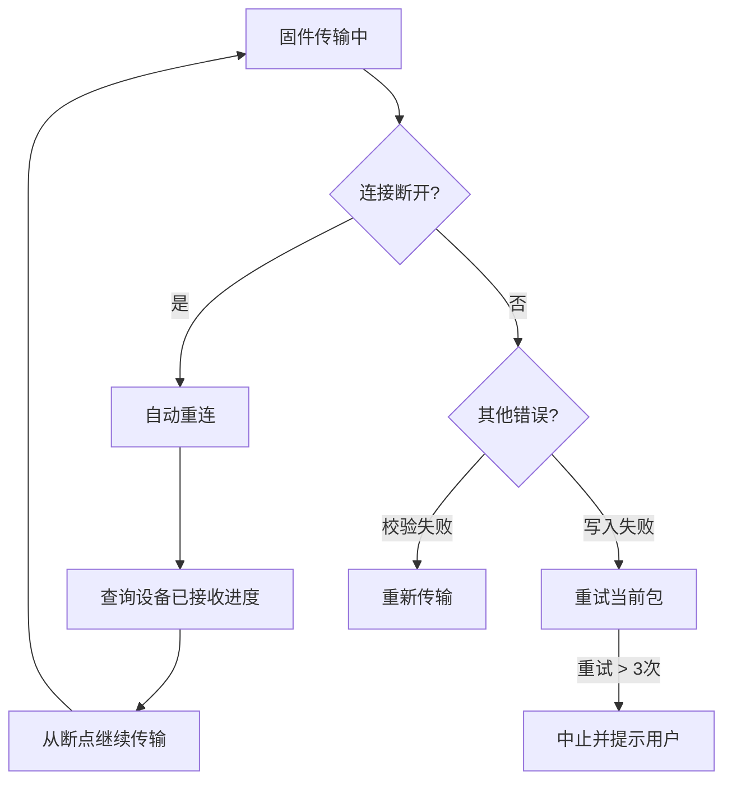
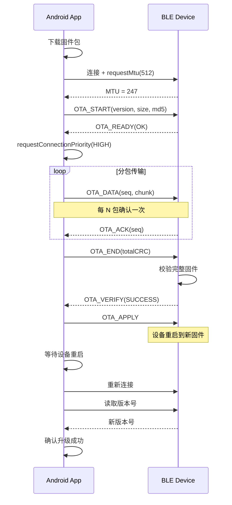

# BLE OTA 固件升级

通过 BLE 对外围设备进行固件升级（OTA/DFU）是 IoT 产品的高频需求。本文覆盖 OTA 原理、Nordic DFU Library 使用、自定义 OTA 协议设计以及异常处理。

## OTA / DFU 基本原理

### OTA 与 DFU 概念

| 术语 | 全称 | 含义 |
|------|------|------|
| OTA | Over-The-Air | 泛指通过无线方式更新软件/固件 |
| DFU | Device Firmware Update | 特指设备固件升级 |
| FOTA | Firmware Over-The-Air | 特指通过无线方式进行固件升级 |

三者在 BLE 场景下常互换使用，本文统一称为 OTA。

### 固件升级的一般流程


1. **版本检查**：App 从云端获取最新固件版本，与设备当前版本比较
2. **固件下载**：App 从服务器下载固件包到本地
3. **固件传输**：App 通过 BLE 将固件数据逐包发送到设备
4. **校验**：设备对接收到的完整固件做校验（CRC/Hash）
5. **应用固件**：设备切换到新固件并重启
6. **升级确认**：App 重连设备，确认版本号已更新

### BLE OTA 与传统 OTA 的区别

| 维度 | WiFi/网络 OTA | BLE OTA |
|------|-------------|---------|
| 带宽 | 高（Mbps 级） | 低（数十 kBps） |
| 固件大小 | 可达数百 MB | 通常 100KB ~ 1MB |
| 传输时间 | 秒级 | 数十秒 ~ 数分钟 |
| 稳定性挑战 | 较小 | 大（BLE 连接不稳定） |
| 需要分包 | 不需要 | 必须 |
| 断点续传 | 可选 | 强烈建议 |

## Nordic DFU Library

Nordic Semiconductor 的 Android-DFU-Library 是目前最成熟的 BLE OTA 开源方案，即使不使用 Nordic 芯片，其设计思路也值得参考。

### 库引入与配置

```kotlin
// build.gradle.kts
dependencies {
    implementation("no.nordicsemi.android:dfu:2.5.0")
}
```

```xml
<!-- AndroidManifest.xml -->
<service
    android:name="no.nordicsemi.android.dfu.DfuBaseService"
    android:exported="false" />
```

需要自定义 DfuService：

```kotlin
class MyDfuService : DfuBaseService() {
    override fun getNotificationTarget(): Class<out Activity> {
        return MainActivity::class.java
    }

    override fun isDebug(): Boolean = BuildConfig.DEBUG
}
```

### DfuServiceInitiator 使用

```kotlin
fun startDfu(context: Context, deviceAddress: String, firmwareUri: Uri) {
    val starter = DfuServiceInitiator(deviceAddress)
        .setDeviceName("MyDevice")
        .setKeepBond(true)                    // 升级后保持绑定
        .setForceDfu(false)                    // 是否强制 DFU 模式
        .setPacketsReceiptNotificationsEnabled(true) // 开启传输确认
        .setPacketsReceiptNotificationsValue(12)     // 每 12 包确认一次
        .setUnsafeExperimentalButtonlessServiceInSecureDfuEnabled(true)
        .setZip(firmwareUri)                   // 固件包

    starter.start(context, MyDfuService::class.java)
}
```

### 升级进度监听（DfuProgressListener）

```kotlin
private val dfuProgressListener = object : DfuProgressListenerAdapter() {
    override fun onDeviceConnecting(deviceAddress: String) {
        updateUI("正在连接设备...")
    }

    override fun onDfuProcessStarting(deviceAddress: String) {
        updateUI("正在启动 DFU...")
    }

    override fun onEnablingDfuMode(deviceAddress: String) {
        updateUI("正在进入 DFU 模式...")
    }

    override fun onFirmwareValidating(deviceAddress: String) {
        updateUI("正在验证固件...")
    }

    override fun onDeviceDisconnecting(deviceAddress: String) {
        updateUI("正在断开连接...")
    }

    override fun onDfuCompleted(deviceAddress: String) {
        updateUI("升级完成！")
    }

    override fun onDfuAborted(deviceAddress: String) {
        updateUI("升级已取消")
    }

    override fun onProgressChanged(
        deviceAddress: String, percent: Int,
        speed: Float, avgSpeed: Float,
        currentPart: Int, partsTotal: Int
    ) {
        updateProgress(percent)
        updateUI("上传中: $percent% (${avgSpeed.toInt()} kB/s)")
    }

    override fun onError(deviceAddress: String, error: Int, errorType: Int, message: String?) {
        updateUI("升级失败: $message (error=$error)")
    }
}

// 注册/注销监听
DfuServiceListenerHelper.registerProgressListener(context, dfuProgressListener)
DfuServiceListenerHelper.unregisterProgressListener(context, dfuProgressListener)
```

### 固件包格式（ZIP / HEX / BIN）

| 格式 | 说明 | 推荐 |
|------|------|------|
| ZIP | 包含固件 + 初始化包（init packet），支持签名验证 | 推荐 |
| HEX | Intel HEX 格式，包含地址信息 | 可选 |
| BIN | 纯二进制固件数据 | 需配合 init packet |

**ZIP 包结构（推荐）：**
```
firmware.zip
├── manifest.json        # 包描述文件
├── application.bin      # 应用固件
└── application.dat      # 初始化包（签名、CRC 等）
```

### Nordic DFU 协议版本差异

| 版本 | 特点 | 兼容设备 |
|------|------|---------|
| Legacy DFU | 旧版协议，不支持签名 | nRF51 系列 |
| Secure DFU | 支持固件签名验证，防止恶意刷写 | nRF52/nRF53 系列 |
| Buttonless DFU | 无需物理按键进入 DFU 模式 | nRF52+ |

## 自定义 OTA 协议设计

当使用非 Nordic 芯片（如 ESP32、STM32 + BLE 模块）时，通常需要自定义 OTA 协议。

### 协议帧格式设计

```
| Command (1B) | Sequence (2B) | Length (2B) | Payload (N B) | CRC16 (2B) |
```

**常用命令定义：**

| Command | 值 | 说明 |
|---------|------|------|
| OTA_START | 0x01 | 开始升级（携带总大小、版本号） |
| OTA_DATA | 0x02 | 固件数据包 |
| OTA_END | 0x03 | 传输结束，请求校验 |
| OTA_VERIFY | 0x04 | 校验结果应答 |
| OTA_APPLY | 0x05 | 确认应用新固件 |
| OTA_ABORT | 0xFF | 中止升级 |

### 分包策略

#### 固定长度分包

```kotlin
fun splitFirmware(firmware: ByteArray, chunkSize: Int): List<ByteArray> {
    return firmware.toList().chunked(chunkSize).map { it.toByteArray() }
}
```

#### 基于 MTU 的动态分包

```kotlin
fun calculateChunkSize(mtu: Int): Int {
    val attHeader = 3          // ATT 协议头
    val protocolHeader = 7     // 自定义协议头 (cmd + seq + len + crc)
    return mtu - attHeader - protocolHeader
}

// 示例：MTU = 247 → 有效载荷 = 247 - 3 - 7 = 237 字节/包
```

### 校验机制（CRC16 / CRC32 / MD5）

```kotlin
object ChecksumUtil {
    fun crc16(data: ByteArray): Int {
        var crc = 0xFFFF
        for (byte in data) {
            crc = crc xor (byte.toInt() and 0xFF)
            repeat(8) {
                crc = if (crc and 1 != 0) {
                    (crc ushr 1) xor 0xA001
                } else {
                    crc ushr 1
                }
            }
        }
        return crc and 0xFFFF
    }

    fun md5(data: ByteArray): String {
        val digest = MessageDigest.getInstance("MD5")
        return digest.digest(data).joinToString("") { "%02x".format(it) }
    }
}
```

### 断点续传方案

```kotlin
class OtaTransferManager(
    private val gatt: BluetoothGatt,
    private val characteristic: BluetoothGattCharacteristic
) {
    private var firmware: ByteArray = byteArrayOf()
    private var chunks: List<ByteArray> = emptyList()
    private var currentIndex = 0
    private var mtu = 23

    fun startTransfer(firmwareData: ByteArray, negotiatedMtu: Int, resumeFrom: Int = 0) {
        firmware = firmwareData
        mtu = negotiatedMtu
        val chunkSize = calculateChunkSize(mtu)
        chunks = splitFirmware(firmware, chunkSize)
        currentIndex = resumeFrom // 支持断点续传
        sendNextChunk()
    }

    private fun sendNextChunk() {
        if (currentIndex >= chunks.size) {
            sendEndCommand()
            return
        }
        val chunk = chunks[currentIndex]
        val frame = buildDataFrame(currentIndex, chunk)
        writeCharacteristic(gatt, characteristic, frame)
    }

    fun onWriteSuccess() {
        currentIndex++
        sendNextChunk()
    }

    fun getProgress(): Int {
        return if (chunks.isEmpty()) 0 else (currentIndex * 100 / chunks.size)
    }

    fun getCurrentIndex(): Int = currentIndex // 保存用于断点续传
}
```

### 版本协商与兼容

升级开始前，App 与设备进行版本协商：

```kotlin
data class OtaStartPayload(
    val firmwareVersion: String,  // 新固件版本
    val firmwareSize: Int,         // 固件总大小
    val chunkSize: Int,            // 分包大小
    val checksum: String,          // 整包 MD5
    val protocolVersion: Int       // OTA 协议版本
)
```

设备端收到 OTA_START 后，检查存储空间、协议兼容性等，返回确认或拒绝。

## 大文件传输优化

### MTU 最大化

连接后立即请求最大 MTU，以增大每包有效载荷：

```kotlin
gatt.requestMtu(512) // 请求 512，实际值取决于设备端
```

### Connection Interval 调整

OTA 期间临时切换到高优先级以获得最大吞吐：

```kotlin
gatt.requestConnectionPriority(BluetoothGatt.CONNECTION_PRIORITY_HIGH)
// OTA 完成后切回
gatt.requestConnectionPriority(BluetoothGatt.CONNECTION_PRIORITY_BALANCED)
```

### Write Without Response 批量写入

使用 Write Without Response 可大幅提升吞吐（无需等待每包应答），但需要配合流控：

```kotlin
// 使用 Write Without Response
fun sendChunkFast(data: ByteArray) {
    writeCharacteristic(gatt, characteristic, data,
        BluetoothGattCharacteristic.WRITE_TYPE_NO_RESPONSE)
}

// Android 提供的回调（API 33+）告知缓冲区可写
override fun onCharacteristicWrite(gatt: BluetoothGatt, char: BluetoothGattCharacteristic, status: Int) {
    // 对于 WRITE_TYPE_NO_RESPONSE，此回调表示数据已放入发送缓冲区
    sendNextChunk()
}
```

### 传输速率估算

| 配置 | 理论吞吐 | 100KB 固件耗时 |
|------|---------|--------------|
| MTU=23, Interval=50ms, Write Request | ~3 kB/s | ~33 秒 |
| MTU=247, Interval=15ms, Write Request | ~50 kB/s | ~2 秒 |
| MTU=247, Interval=15ms, Write No Response | ~100 kB/s | ~1 秒 |
| MTU=512, Interval=7.5ms, Write No Response + 2M PHY | ~200+ kB/s | <1 秒 |

## 升级进度管理与 UI

### 进度计算与展示

```kotlin
fun calculateProgress(sentBytes: Int, totalBytes: Int): ProgressInfo {
    val percent = (sentBytes * 100L / totalBytes).toInt()
    val elapsedMs = System.currentTimeMillis() - startTime
    val speedBps = if (elapsedMs > 0) sentBytes * 1000L / elapsedMs else 0
    val remainingBytes = totalBytes - sentBytes
    val estimatedRemainingMs = if (speedBps > 0) remainingBytes * 1000L / speedBps else 0

    return ProgressInfo(percent, speedBps, estimatedRemainingMs)
}

data class ProgressInfo(
    val percent: Int,
    val speedBytesPerSecond: Long,
    val estimatedRemainingMs: Long
)
```

### 用户交互设计（不可中断提示等）

- 升级开始前：明确告知用户升级耗时和注意事项
- 升级过程中：显示进度条、速度、预计剩余时间
- 禁止用户返回或切换页面（或显示强烈警告）
- 升级完成后：自动重连并确认版本

## 异常处理

### 升级中断恢复



### 校验失败回滚

设备端应支持"双区"（Dual Bank）机制：
- A 区运行当前固件
- B 区接收新固件
- 校验通过后切换到 B 区启动
- 校验失败时保持在 A 区，设备功能不受影响

### 设备端 Bootloader 异常

最危险的场景：设备在应用新固件过程中异常（如断电），可能导致设备"变砖"。防护措施：
- Bootloader 独立于应用固件，不可被 OTA 覆盖
- 设备端在写入完成、校验通过后才标记新固件为有效
- 启动时 Bootloader 检测固件有效性，无效则回退或进入 DFU 恢复模式

### 超时处理

```kotlin
private val otaTimeoutHandler = Handler(Looper.getMainLooper())

fun startOtaWithTimeout(timeoutMs: Long = 300_000L) {
    otaTimeoutHandler.postDelayed({
        if (isOtaInProgress) {
            abortOta("OTA timeout after ${timeoutMs / 1000}s")
        }
    }, timeoutMs)
}

fun onOtaComplete() {
    otaTimeoutHandler.removeCallbacksAndMessages(null)
}
```

## OTA 升级流程图



## 踩坑记录

> 此区域供团队成员补充项目中遇到的真实案例。

| 日期 | 记录人 | 问题描述 | 解决方案 |
|------|--------|----------|----------|
| | | | |

## 参考资料

- [Nordic Android-DFU-Library](https://github.com/NordicSemiconductor/Android-DFU-Library)
- [Nordic DFU Protocol Specification](https://infocenter.nordicsemi.com/topic/sdk_nrf5_v17.1.0/lib_bootloader_dfu_process.html)
- [ESP32 BLE OTA](https://docs.espressif.com/projects/esp-idf/en/latest/esp32/api-reference/system/ota.html)
- [BLE Data Throughput Guide](https://punchthrough.com/maximizing-ble-throughput-on-android/)
