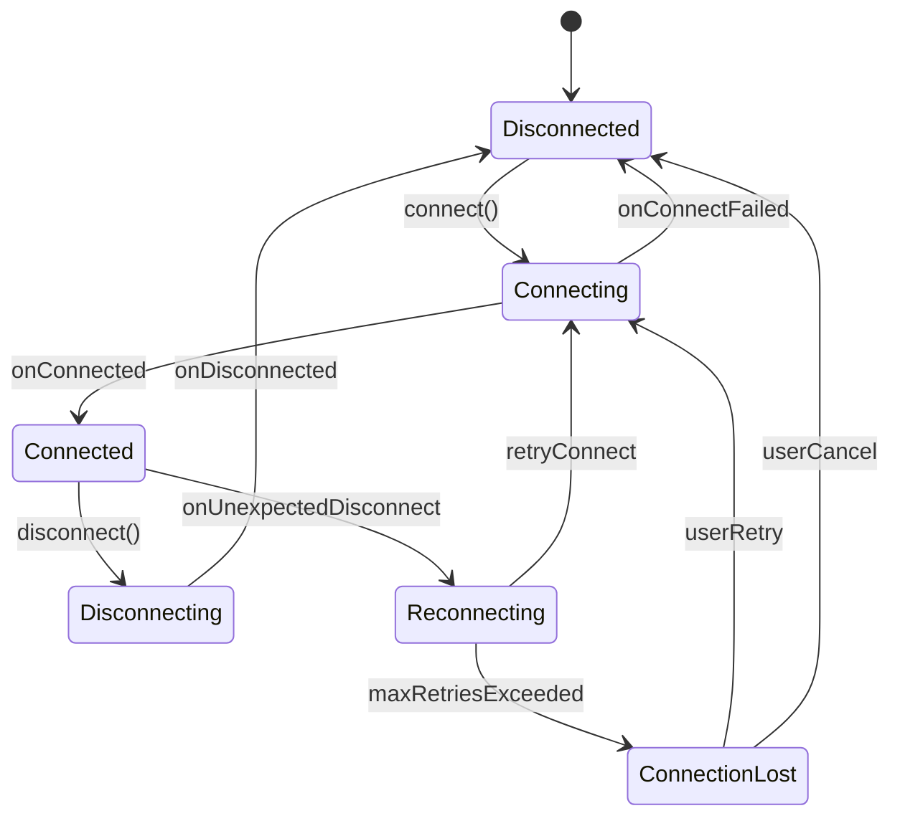

# 连接稳定性与重连

蓝牙连接在实际使用中远不如 WiFi/网络稳定，断连是常态而非异常。本文系统梳理断连原因、重连策略、状态机设计和后台保活方案。

## 常见断连原因分析

### 距离与信号衰减

BLE 有效通信距离取决于发射功率、接收灵敏度和环境遮挡：
- 理想环境：BLE 4.x 约 30-50 米，BLE 5.0 Long Range 可达 200 米+
- 室内实际：通常 5-15 米（穿墙后急剧衰减）
- 人体遮挡、金属反射等都会影响信号

### 环境干扰（2.4GHz 频段拥堵）

BLE 与 WiFi（2.4GHz）、ZigBee、微波炉等共用 ISM 频段：
- WiFi 信道 1/6/11 与 BLE 广播信道有重叠
- 干扰严重时，BLE 跳频机制会自动避开受干扰信道，但连接质量仍可能下降
- 高密度蓝牙设备环境（如展会）会加剧干扰

### Android 系统资源回收

Android 系统的省电机制会主动回收蓝牙相关资源：
- **Doze 模式**：深度休眠时限制蓝牙扫描和连接维护
- **App Standby**：不活跃应用的蓝牙操作受限
- **后台进程回收**：应用被系统杀死后蓝牙连接丢失
- 国产 ROM（华为、小米、OPPO 等）的省电策略更为激进

### Connection Supervision Timeout

如果在 Supervision Timeout 内没有收到对端的任何数据包，协议栈判定连接断开。常见原因：
- Peripheral 端异常（固件崩溃、进入深度休眠未维护连接）
- 环境干扰导致连续多个 Connection Event 失败
- Supervision Timeout 设置过小

### 设备端主动断开

- 设备电量耗尽
- 设备固件主动断开（如 OTA 后重启）
- 设备端检测到错误，主动 terminate 连接

## 断连回调处理

### onConnectionStateChange 状态码含义

```kotlin
override fun onConnectionStateChange(gatt: BluetoothGatt, status: Int, newState: Int) {
    when (newState) {
        BluetoothProfile.STATE_CONNECTED -> {
            // 连接成功
        }
        BluetoothProfile.STATE_DISCONNECTED -> {
            // 断开连接，status 包含断连原因
            handleDisconnection(gatt, status)
        }
    }
}
```

### 常见 status code 速查表

| Status | 常量 | 含义 | 常见原因 |
|--------|------|------|---------|
| 0 | GATT_SUCCESS | 正常断开 | 主动调用 disconnect() |
| 8 | GATT_CONN_TIMEOUT | 连接超时 | Supervision Timeout |
| 19 | GATT_CONN_TERMINATE_PEER_USER | 对端主动断开 | 设备端 terminate |
| 22 | GATT_CONN_TERMINATE_LOCAL_HOST | 本地主动断开 | 系统或应用 disconnect |
| 34 | GATT_CONN_LMP_TIMEOUT | LMP 超时 | 设备无响应 |
| 62 | GATT_CONN_FAIL_ESTABLISH | 连接建立失败 | 设备不在范围或拒绝连接 |
| 133 | GATT_ERROR | 通用错误 | 最常见，原因多样（见下文） |
| 257 | — | 内部错误 | Android 蓝牙栈异常 |

### status 133（GATT_ERROR）详解

status 133 是 Android BLE 开发中最臭名昭著的错误码，它是一个"通用错误"，实际原因可能是：

1. **连接数超限**：Android 蓝牙栈的并发连接数达到上限
2. **蓝牙缓存过期**：设备端 Service 结构变化但缓存未更新
3. **连接建立失败**：设备不在范围、广播已停止
4. **系统蓝牙栈异常**：需要重启蓝牙或重启手机
5. **`close()` 未调用**：上一次连接的 `BluetoothGatt` 未正确关闭

**应对策略：**

```kotlin
fun handleStatus133(gatt: BluetoothGatt) {
    // 1. 确保彻底关闭当前 GATT
    gatt.close()

    // 2. 延迟后重试（给协议栈恢复时间）
    handler.postDelayed({
        retryConnection()
    }, 2000)

    // 3. 如果多次 133，尝试清除蓝牙缓存
    if (consecutiveStatus133Count > 3) {
        refreshDeviceCache(gatt)
    }

    // 4. 如果仍然 133，可能需要重启蓝牙
    if (consecutiveStatus133Count > 5) {
        promptRestartBluetooth()
    }
}
```

### status 8（Connection Timeout）详解

status 8 表示 Supervision Timeout 超时，通常意味着设备已不在通信范围或设备端异常。

## 重连策略设计

### 立即重连 vs 延迟重连

| 策略 | 场景 | 实现 |
|------|------|------|
| 立即重连 | 短暂干扰导致断连 | disconnect 后立即 connectGatt |
| 延迟重连 | 设备可能暂时不可用 | 延迟 N 秒后重连 |
| 指数退避 | 连续重连失败 | 每次失败后翻倍延迟 |
| 用户触发 | 多次重连失败 | 提示用户手动重连 |

### 指数退避算法

```kotlin
class ExponentialBackoffRetry(
    private val initialDelayMs: Long = 1000,
    private val maxDelayMs: Long = 60_000,
    private val maxRetries: Int = 10,
    private val multiplier: Double = 2.0
) {
    private var retryCount = 0
    private val handler = Handler(Looper.getMainLooper())

    fun scheduleRetry(action: () -> Unit): Boolean {
        if (retryCount >= maxRetries) return false

        val delay = (initialDelayMs * multiplier.pow(retryCount.toDouble()))
            .toLong()
            .coerceAtMost(maxDelayMs)

        handler.postDelayed({
            retryCount++
            action()
        }, delay)

        return true
    }

    fun reset() {
        retryCount = 0
        handler.removeCallbacksAndMessages(null)
    }

    fun getRetryCount(): Int = retryCount
}
```

### 最大重试次数与放弃策略

```kotlin
class ReconnectionManager(
    private val device: BluetoothDevice,
    private val context: Context
) {
    private val backoff = ExponentialBackoffRetry(
        initialDelayMs = 1000,
        maxDelayMs = 30_000,
        maxRetries = 8
    )

    fun onDisconnected(status: Int) {
        when {
            status == BluetoothGatt.GATT_SUCCESS -> {
                // 主动断开，不自动重连
            }
            status == 19 -> {
                // 对端主动断开，可能是正常行为（如 OTA 重启）
                backoff.scheduleRetry { connect() }
            }
            else -> {
                val scheduled = backoff.scheduleRetry { connect() }
                if (!scheduled) {
                    notifyUser("设备连接失败，请检查设备是否在范围内")
                }
            }
        }
    }

    fun onConnected() {
        backoff.reset()
    }
}
```

### 用户可感知的状态管理

将连接状态映射为用户可理解的状态：

```kotlin
enum class DeviceConnectionState {
    DISCONNECTED,    // 未连接
    CONNECTING,      // 连接中
    CONNECTED,       // 已连接
    RECONNECTING,    // 重连中（自动）
    CONNECTION_LOST  // 连接丢失（需用户操作）
}
```

## 连接状态机

### 状态定义（Disconnected / Connecting / Connected / Disconnecting）



### 状态转换规则

| 当前状态 | 事件 | 下一状态 | 动作 |
|---------|------|---------|------|
| Disconnected | 用户触发连接 | Connecting | connectGatt() |
| Connecting | 连接成功 | Connected | discoverServices() |
| Connecting | 连接超时/失败 | Disconnected | close(), 通知 UI |
| Connected | 意外断连 | Reconnecting | 启动退避重连 |
| Connected | 主动断开 | Disconnecting | disconnect() |
| Reconnecting | 重连成功 | Connected | discoverServices() |
| Reconnecting | 达到最大重试 | ConnectionLost | 通知用户 |
| ConnectionLost | 用户点击重连 | Connecting | connectGatt() |

### 状态机实现方案

```kotlin
class BleConnectionStateMachine(
    private val device: BluetoothDevice,
    private val context: Context,
    private val listener: StateListener
) {
    private var state: DeviceConnectionState = DeviceConnectionState.DISCONNECTED
    private var gatt: BluetoothGatt? = null
    private val backoff = ExponentialBackoffRetry()

    @Synchronized
    fun connect() {
        if (state == DeviceConnectionState.CONNECTING || state == DeviceConnectionState.CONNECTED) return

        transition(DeviceConnectionState.CONNECTING)
        gatt = device.connectGatt(context, false, gattCallback, BluetoothDevice.TRANSPORT_LE)
    }

    @Synchronized
    fun disconnect() {
        if (state == DeviceConnectionState.DISCONNECTED) return
        backoff.reset()
        transition(DeviceConnectionState.DISCONNECTING)
        gatt?.disconnect()
    }

    private fun transition(newState: DeviceConnectionState) {
        val oldState = state
        state = newState
        listener.onStateChanged(oldState, newState)
    }

    private val gattCallback = object : BluetoothGattCallback() {
        override fun onConnectionStateChange(gatt: BluetoothGatt, status: Int, newState: Int) {
            when (newState) {
                BluetoothProfile.STATE_CONNECTED -> {
                    backoff.reset()
                    transition(DeviceConnectionState.CONNECTED)
                    gatt.requestMtu(512)
                }
                BluetoothProfile.STATE_DISCONNECTED -> {
                    gatt.close()
                    when (state) {
                        DeviceConnectionState.DISCONNECTING -> {
                            transition(DeviceConnectionState.DISCONNECTED)
                        }
                        DeviceConnectionState.CONNECTED, DeviceConnectionState.RECONNECTING -> {
                            transition(DeviceConnectionState.RECONNECTING)
                            val scheduled = backoff.scheduleRetry { connect() }
                            if (!scheduled) {
                                transition(DeviceConnectionState.CONNECTION_LOST)
                            }
                        }
                        else -> {
                            transition(DeviceConnectionState.DISCONNECTED)
                        }
                    }
                }
            }
        }
    }

    interface StateListener {
        fun onStateChanged(oldState: DeviceConnectionState, newState: DeviceConnectionState)
    }
}
```

## 多设备同时连接

### Android BLE 并发连接数限制

Android 对 BLE 并发连接数有限制，但具体数值取决于芯片和 ROM：

| 芯片平台 | 通常上限 | 说明 |
|---------|---------|------|
| 高通骁龙 | 7-15 个 | 高端芯片支持更多 |
| 联发科 | 7-10 个 | |
| 三星 Exynos | 7-10 个 | |
| 华为麒麟 | 7 个 | |

**实际建议：** 保守设计按 5-7 个并发连接考虑，超过此数应实现连接池。

### 多设备连接管理方案

```kotlin
class BleDeviceManager {
    private val connections = ConcurrentHashMap<String, BleConnectionStateMachine>()
    private val maxConnections = 5

    fun connectDevice(device: BluetoothDevice, context: Context): Boolean {
        if (connections.size >= maxConnections) {
            // 断开最久未通信的设备
            disconnectLeastRecentlyUsed()
        }

        val stateMachine = BleConnectionStateMachine(device, context, stateListener)
        connections[device.address] = stateMachine
        stateMachine.connect()
        return true
    }

    fun disconnectDevice(address: String) {
        connections[address]?.disconnect()
        connections.remove(address)
    }

    fun getConnectedDevices(): List<String> {
        return connections.filter { it.value.isConnected() }.keys.toList()
    }

    private fun disconnectLeastRecentlyUsed() {
        val lru = connections.entries
            .minByOrNull { it.value.lastActivityTime }
        lru?.let { disconnectDevice(it.key) }
    }
}
```

### 连接池设计

对于需要频繁切换连接设备的场景（如设备巡检），使用连接池：
- 维护活跃连接和待连接队列
- 空闲连接可降低 Connection Priority 省电
- 需要通信时自动提升 Priority

## 后台保活策略

### Foreground Service 保持连接

```kotlin
class BleConnectionService : Service() {

    override fun onStartCommand(intent: Intent?, flags: Int, startId: Int): Int {
        startForeground(NOTIFICATION_ID, createNotification())
        // 维护蓝牙连接
        return START_STICKY
    }

    private fun createNotification(): Notification {
        val channel = NotificationChannel(
            CHANNEL_ID, "BLE Connection",
            NotificationManager.IMPORTANCE_LOW
        )
        val notificationManager = getSystemService(NotificationManager::class.java)
        notificationManager.createNotificationChannel(channel)

        return NotificationCompat.Builder(this, CHANNEL_ID)
            .setContentTitle("设备已连接")
            .setContentText("正在与 BLE 设备保持连接")
            .setSmallIcon(R.drawable.ic_bluetooth)
            .build()
    }
}
```

### WorkManager 定时重连

```kotlin
class BleReconnectWorker(
    context: Context,
    params: WorkerParameters
) : CoroutineWorker(context, params) {

    override suspend fun doWork(): Result {
        val deviceAddress = inputData.getString("device_address") ?: return Result.failure()
        return try {
            reconnectDevice(deviceAddress)
            Result.success()
        } catch (e: Exception) {
            if (runAttemptCount < 5) Result.retry() else Result.failure()
        }
    }

    companion object {
        fun scheduleReconnect(context: Context, deviceAddress: String) {
            val request = OneTimeWorkRequestBuilder<BleReconnectWorker>()
                .setInputData(workDataOf("device_address" to deviceAddress))
                .setBackoffCriteria(BackoffPolicy.EXPONENTIAL, 30, TimeUnit.SECONDS)
                .setConstraints(
                    Constraints.Builder()
                        .setRequiredNetworkType(NetworkType.NOT_REQUIRED)
                        .build()
                )
                .build()

            WorkManager.getInstance(context).enqueueUniqueWork(
                "ble_reconnect_$deviceAddress",
                ExistingWorkPolicy.REPLACE,
                request
            )
        }
    }
}
```

### 后台限制对蓝牙连接的影响

| Android 版本 | 后台限制 | 对蓝牙的影响 |
|-------------|---------|-------------|
| 8.0+ | 后台服务限制 | 需 Foreground Service |
| 10+ | 后台启动活动限制 | 重连时不能启动 Activity |
| 12+ | Foreground Service 限制 | 需要精确的前台服务类型声明 |
| 12+ | 精确闹钟限制 | WorkManager 定时可能不精确 |

```xml
<!-- Android 12+ 必须声明前台服务类型 -->
<service
    android:name=".BleConnectionService"
    android:foregroundServiceType="connectedDevice"
    android:exported="false" />
```

### Android 各版本后台策略差异

国产 ROM 的后台限制远比 AOSP 严格：
- **华为**：需要将应用加入"电池优化白名单"和"自启动管理"
- **小米**：需要开启"自启动"和"后台弹出界面"权限
- **OPPO/vivo**：需要在"电池管理"中设置为"不限制"

建议引导用户手动设置，可参考 [Don't Kill My App](https://dontkillmyapp.com/) 获取各厂商的适配指南。

## 蓝牙缓存问题

### 蓝牙缓存导致的服务发现异常

Android 系统会缓存已连接设备的 GATT Service 信息。当设备固件更新后 Service 结构发生变化（如添加/删除 Characteristic），`discoverServices()` 仍返回旧的缓存数据。

**症状：**
- 连接后发现的 Service/Characteristic 与预期不符
- 新增的 Characteristic 找不到
- UUID 对应的 Handle 不正确，导致操作失败

### refreshDeviceCache 反射方案

Android 没有公开清除 GATT 缓存的 API，需要通过反射调用：

```kotlin
fun refreshDeviceCache(gatt: BluetoothGatt): Boolean {
    return try {
        val method = gatt.javaClass.getMethod("refresh")
        method.invoke(gatt) as Boolean
    } catch (e: Exception) {
        Log.e(TAG, "refreshDeviceCache failed: ${e.message}")
        false
    }
}

// 在连接成功后、discoverServices 之前调用
override fun onConnectionStateChange(gatt: BluetoothGatt, status: Int, newState: Int) {
    if (newState == BluetoothProfile.STATE_CONNECTED) {
        if (needRefreshCache) {
            refreshDeviceCache(gatt)
            handler.postDelayed({ gatt.discoverServices() }, 500)
        } else {
            gatt.discoverServices()
        }
    }
}
```

### 何时需要清除缓存

- 设备 OTA 升级后首次重连
- `discoverServices()` 返回的 Service 列表与预期不符
- 更换了设备固件（开发/测试阶段频繁发生）

**不建议无差别清除缓存**——缓存可以加速服务发现过程，仅在确认缓存过期时才清除。

## 踩坑记录

> 此区域供团队成员补充项目中遇到的真实案例。

| 日期 | 记录人 | 问题描述 | 解决方案 |
|------|--------|----------|----------|
| | | | |

## 参考资料

- [Android BLE Best Practices](https://punchthrough.com/android-ble-guide/)
- [Don't Kill My App — 各厂商后台限制](https://dontkillmyapp.com/)
- [BluetoothGatt Status Codes](https://cs.android.com/android/platform/superproject/+/master:packages/modules/Bluetooth/system/stack/include/gatt_api.h)
- [Android Background Execution Limits](https://developer.android.com/about/versions/oreo/background)
- [Foreground Service Types — Android 12](https://developer.android.com/about/versions/12/foreground-service-types)
