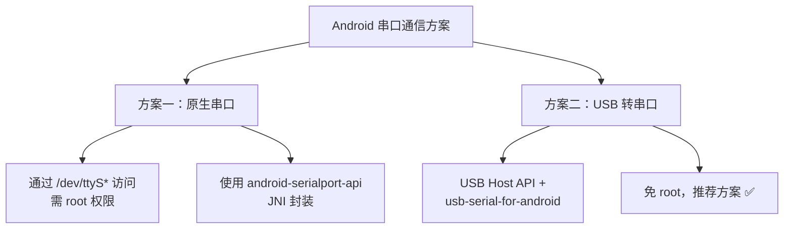
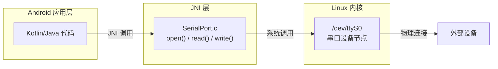
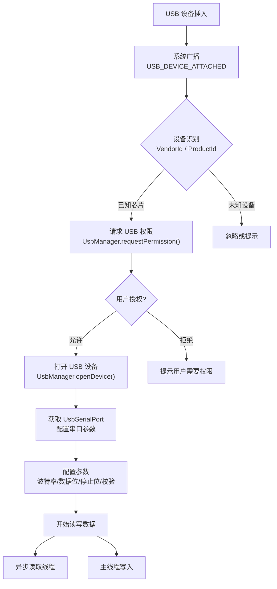
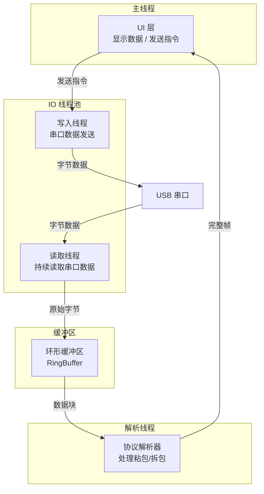

# Android 串口实现方案

## 方案总览



---

## 方案一：原生串口（/dev/ttyS*）

### 适用场景

- 定制化 Android 主板（工控板、车机等），已获取 root 权限
- 板载 UART 接口直连外设
- 对延迟有极致要求的场景

### android-serialport-api 原理

该方案通过 JNI 调用 Linux 原生串口 API（`open`、`read`、`write`、`tcsetattr`）来操作 `/dev/ttyS*` 设备节点。



### JNI 层原理简述

JNI 层的核心是调用 POSIX 标准的串口 API：

1. **`open("/dev/ttyS0", O_RDWR)`**：以读写模式打开串口设备文件
2. **`tcgetattr()` / `tcsetattr()`**：获取/设置串口参数（波特率、数据位、停止位等）
3. **`read()` / `write()`**：阻塞或非阻塞地读写数据
4. **`close()`**：关闭串口

### Kotlin 封装

```kotlin
import android.util.Log
import java.io.File
import java.io.FileDescriptor
import java.io.FileInputStream
import java.io.FileOutputStream
import java.io.IOException

/**
 * 原生串口封装类
 * 依赖 android-serialport-api 的 JNI .so 库
 */
class NativeSerialPort(
    private val devicePath: String,
    private val baudRate: Int,
    private val flags: Int = 0
) : AutoCloseable {

    private var fileDescriptor: FileDescriptor? = null
    var inputStream: FileInputStream? = null
        private set
    var outputStream: FileOutputStream? = null
        private set

    init {
        val device = File(devicePath)
        if (!device.canRead() || !device.canWrite()) {
            // 尝试通过 su 命令修改设备文件权限
            val process = Runtime.getRuntime().exec(arrayOf("su", "-c", "chmod 666 $devicePath"))
            val exitValue = process.waitFor()
            if (exitValue != 0) {
                throw SecurityException("无法获取串口 $devicePath 的读写权限，请确认设备已 root")
            }
        }
        fileDescriptor = open(devicePath, baudRate, flags)
            ?: throw IOException("无法打开串口: $devicePath")
        inputStream = FileInputStream(fileDescriptor)
        outputStream = FileOutputStream(fileDescriptor)
        Log.d(TAG, "串口已打开: $devicePath, 波特率: $baudRate")
    }

    /** 发送数据 */
    fun send(data: ByteArray) {
        outputStream?.write(data)
        outputStream?.flush()
    }

    /** 关闭串口 */
    override fun close() {
        inputStream?.close()
        outputStream?.close()
        fileDescriptor?.let { close(it) }
        Log.d(TAG, "串口已关闭: $devicePath")
    }

    private external fun open(path: String, baudRate: Int, flags: Int): FileDescriptor?
    private external fun close(fd: FileDescriptor)

    companion object {
        private const val TAG = "NativeSerialPort"

        init {
            System.loadLibrary("serial_port")
        }
    }
}
```

**使用示例**：

```kotlin
// 打开串口
val serialPort = NativeSerialPort("/dev/ttyS1", 115200)

// 启动读取协程
lifecycleScope.launch(Dispatchers.IO) {
    val buffer = ByteArray(1024)
    while (isActive) {
        val size = serialPort.inputStream?.read(buffer) ?: break
        if (size > 0) {
            val received = buffer.copyOf(size)
            // 处理接收到的数据
            handleReceivedData(received)
        }
    }
}

// 发送数据
serialPort.send(byteArrayOf(0x01, 0x03, 0x00, 0x00, 0x00, 0x0A))

// 用完关闭
serialPort.close()
```

---

## 方案二：USB 转串口（推荐方案）

### 适用场景

- 普通 Android 手机/平板，无 root 权限
- 通过 USB OTG 连接 USB 转串口模块
- 大多数项目的首选方案

### 整体流程



### 添加依赖

```kotlin
// build.gradle.kts (app)
dependencies {
    implementation("com.github.mik3y:usb-serial-for-android:3.8.1")
}
```

```kotlin
// settings.gradle.kts
dependencyResolutionManagement {
    repositories {
        maven { url = uri("https://jitpack.io") }
    }
}
```

### USB 设备过滤器配置

在 `res/xml/` 下创建 `device_filter.xml`：

```xml
<?xml version="1.0" encoding="utf-8"?>
<resources>
    <!-- CH340/CH341 -->
    <usb-device vendor-id="6790" product-id="29987" />
    <!-- CP210x -->
    <usb-device vendor-id="4292" product-id="60000" />
    <!-- FTDI -->
    <usb-device vendor-id="1027" product-id="24577" />
    <!-- PL2303 -->
    <usb-device vendor-id="1659" product-id="8963" />
</resources>
```

在 `AndroidManifest.xml` 中注册：

```xml
<activity android:name=".MainActivity">
    <intent-filter>
        <action android:name="android.hardware.usb.action.USB_DEVICE_ATTACHED" />
    </intent-filter>
    <meta-data
        android:name="android.hardware.usb.action.USB_DEVICE_ATTACHED"
        android:resource="@xml/device_filter" />
</activity>
```

### 关键代码实现

#### 1. 设备发现

```kotlin
import android.hardware.usb.UsbManager
import com.hoho.android.usbserial.driver.UsbSerialProber

/**
 * 扫描当前连接的所有 USB 串口设备
 */
fun discoverDevices(usbManager: UsbManager): List<UsbSerialDriverInfo> {
    val availableDrivers = UsbSerialProber.getDefaultProber().findAllDrivers(usbManager)

    return availableDrivers.map { driver ->
        val device = driver.device
        UsbSerialDriverInfo(
            deviceName = device.deviceName,
            vendorId = device.vendorId,
            productId = device.productId,
            driverName = driver.javaClass.simpleName,
            portCount = driver.ports.size
        )
    }
}

data class UsbSerialDriverInfo(
    val deviceName: String,
    val vendorId: Int,
    val productId: Int,
    val driverName: String,
    val portCount: Int
)
```

#### 2. 打开连接与参数配置

```kotlin
import android.hardware.usb.UsbDeviceConnection
import android.hardware.usb.UsbManager
import com.hoho.android.usbserial.driver.UsbSerialPort
import com.hoho.android.usbserial.driver.UsbSerialProber

/**
 * USB 串口连接管理器
 */
class UsbSerialManager(private val usbManager: UsbManager) {

    private var connection: UsbDeviceConnection? = null
    private var serialPort: UsbSerialPort? = null

    /**
     * 打开指定索引的 USB 串口设备
     * @param driverIndex 设备索引（0 开始）
     * @param portIndex 端口索引（多端口设备用，一般为 0）
     * @param config 串口配置参数
     */
    fun open(driverIndex: Int = 0, portIndex: Int = 0, config: SerialConfig = SerialConfig()) {
        val drivers = UsbSerialProber.getDefaultProber().findAllDrivers(usbManager)
        if (drivers.isEmpty()) throw IllegalStateException("未发现 USB 串口设备")

        val driver = drivers[driverIndex]
        val device = driver.device

        // 打开 USB 设备连接
        connection = usbManager.openDevice(device)
            ?: throw SecurityException("无法打开 USB 设备，请检查权限是否已授予")

        // 获取串口端口并打开
        serialPort = driver.ports[portIndex].apply {
            open(connection)
            setParameters(
                config.baudRate,
                config.dataBits,
                config.stopBits,
                config.parity
            )
            // 设置 DTR/RTS（部分芯片需要）
            dtr = config.dtr
            rts = config.rts
        }
    }

    /** 发送数据 */
    fun write(data: ByteArray, timeout: Int = 1000) {
        serialPort?.write(data, timeout)
    }

    /** 同步读取数据 */
    fun read(buffer: ByteArray, timeout: Int = 1000): Int {
        return serialPort?.read(buffer, timeout) ?: 0
    }

    /** 关闭连接 */
    fun close() {
        serialPort?.close()
        connection?.close()
        serialPort = null
        connection = null
    }

    /** 是否已连接 */
    val isConnected: Boolean get() = serialPort?.isOpen == true
}

/**
 * 串口配置参数
 */
data class SerialConfig(
    val baudRate: Int = 115200,
    val dataBits: Int = UsbSerialPort.DATABITS_8,
    val stopBits: Int = UsbSerialPort.STOPBITS_1,
    val parity: Int = UsbSerialPort.PARITY_NONE,
    val dtr: Boolean = false,
    val rts: Boolean = false
)
```

#### 3. 异步读写（协程方式）

```kotlin
import kotlinx.coroutines.*
import kotlinx.coroutines.flow.MutableSharedFlow
import kotlinx.coroutines.flow.SharedFlow

/**
 * 基于协程的串口异步读写封装
 */
class SerialPortIO(
    private val manager: UsbSerialManager,
    private val scope: CoroutineScope
) {
    private val _dataFlow = MutableSharedFlow<ByteArray>(extraBufferCapacity = 64)

    /** 接收数据流，外部通过 collect 订阅 */
    val dataFlow: SharedFlow<ByteArray> = _dataFlow

    private var readJob: Job? = null

    /** 启动异步读取 */
    fun startReading(bufferSize: Int = 4096) {
        readJob = scope.launch(Dispatchers.IO) {
            val buffer = ByteArray(bufferSize)
            while (isActive && manager.isConnected) {
                try {
                    val bytesRead = manager.read(buffer, timeout = 200)
                    if (bytesRead > 0) {
                        _dataFlow.emit(buffer.copyOf(bytesRead))
                    }
                } catch (e: Exception) {
                    if (isActive) {
                        _dataFlow.emit(byteArrayOf()) // 空数据表示异常
                    }
                    break
                }
            }
        }
    }

    /** 停止读取 */
    fun stopReading() {
        readJob?.cancel()
        readJob = null
    }

    /** 异步发送数据 */
    fun sendAsync(data: ByteArray) {
        scope.launch(Dispatchers.IO) {
            manager.write(data)
        }
    }
}
```

### 常见 USB 芯片兼容性

| 芯片 | 厂商 | VendorId | ProductId | usb-serial-for-android 支持 | 备注 |
|------|------|----------|-----------|-------------|------|
| CH340/CH341 | 南京沁恒 | 0x1A86 | 0x7523 | ✅ `Ch34xSerialDriver` | 国产芯片，价格低，兼容性好 |
| CP2102/CP2104 | Silicon Labs | 0x10C4 | 0xEA60 | ✅ `Cp21xxSerialDriver` | 稳定性好，驱动成熟 |
| FT232R/FT2232 | FTDI | 0x0403 | 0x6001 | ✅ `FtdiSerialDriver` | 老牌芯片，性能稳定，价格较高 |
| PL2303 | Prolific | 0x067B | 0x2303 | ✅ `ProlificSerialDriver` | 假芯片泛滥，注意采购渠道 |
| CDC/ACM | 通用 | — | — | ✅ `CdcAcmSerialDriver` | USB 标准协议，免驱 |

> **采购建议**：优先选择 CH340（性价比高）或 CP2102（稳定性好），避免低价 PL2303（市面假芯片多，兼容性问题频发）。

---

## 数据收发架构设计

### 推荐线程模型



### 环形缓冲区实现

```kotlin
/**
 * 线程安全的环形缓冲区
 * 用于串口接收线程与解析线程之间的数据传递
 */
class RingBuffer(private val capacity: Int = 8192) {

    private val buffer = ByteArray(capacity)
    private var writePos = 0
    private var readPos = 0
    private var count = 0
    private val lock = Any()

    /** 写入数据，缓冲区满时丢弃最旧数据 */
    fun write(data: ByteArray, offset: Int = 0, length: Int = data.size) {
        synchronized(lock) {
            for (i in offset until offset + length) {
                if (count == capacity) {
                    // 缓冲区满，覆盖最旧的数据
                    readPos = (readPos + 1) % capacity
                    count--
                }
                buffer[writePos] = data[i]
                writePos = (writePos + 1) % capacity
                count++
            }
        }
    }

    /** 读取所有可用数据 */
    fun readAll(): ByteArray {
        synchronized(lock) {
            if (count == 0) return ByteArray(0)
            val result = ByteArray(count)
            for (i in 0 until count) {
                result[i] = buffer[(readPos + i) % capacity]
            }
            readPos = (readPos + count) % capacity
            count = 0
            return result
        }
    }

    /** 可读数据量 */
    val available: Int get() = synchronized(lock) { count }
}
```

### 协议解析器模式

将协议解析抽象为接口，便于支持不同协议：

```kotlin
/**
 * 串口协议解析器接口
 */
interface SerialProtocolParser {
    /** 喂入原始字节数据 */
    fun feed(data: ByteArray)
    /** 重置解析器状态 */
    fun reset()
}

/**
 * 串口通信管理器 — 整合设备管理、读写和协议解析
 */
class SerialCommunicationManager(
    private val usbManager: UsbManager,
    private val scope: CoroutineScope
) {
    private val serialManager = UsbSerialManager(usbManager)
    private val ringBuffer = RingBuffer(capacity = 16384)
    private var parser: SerialProtocolParser? = null
    private var readJob: Job? = null

    /** 注册协议解析器 */
    fun setParser(parser: SerialProtocolParser) {
        this.parser = parser
    }

    /** 连接并启动数据收发 */
    fun connect(config: SerialConfig = SerialConfig()) {
        serialManager.open(config = config)
        startReading()
    }

    private fun startReading() {
        readJob = scope.launch(Dispatchers.IO) {
            val buffer = ByteArray(4096)
            while (isActive && serialManager.isConnected) {
                val bytesRead = serialManager.read(buffer, timeout = 100)
                if (bytesRead > 0) {
                    val data = buffer.copyOf(bytesRead)
                    ringBuffer.write(data)
                    parser?.feed(data)
                }
            }
        }
    }

    /** 发送数据 */
    fun send(data: ByteArray) {
        scope.launch(Dispatchers.IO) {
            serialManager.write(data)
        }
    }

    /** 断开连接 */
    fun disconnect() {
        readJob?.cancel()
        serialManager.close()
        parser?.reset()
    }
}
```

---

## 常见坑点

### 1. USB 权限弹窗处理

每次 USB 设备连接时系统会弹出权限确认对话框。为提升体验，可以注册广播接收器处理权限回调：

```kotlin
import android.app.PendingIntent
import android.content.BroadcastReceiver
import android.content.Context
import android.content.Intent
import android.content.IntentFilter
import android.hardware.usb.UsbDevice
import android.hardware.usb.UsbManager

class UsbPermissionHelper(private val context: Context) {

    companion object {
        private const val ACTION_USB_PERMISSION = "com.example.USB_PERMISSION"
    }

    private var onPermissionResult: ((Boolean, UsbDevice?) -> Unit)? = null

    private val usbReceiver = object : BroadcastReceiver() {
        override fun onReceive(ctx: Context, intent: Intent) {
            if (intent.action == ACTION_USB_PERMISSION) {
                val device = intent.getParcelableExtra<UsbDevice>(UsbManager.EXTRA_DEVICE)
                val granted = intent.getBooleanExtra(UsbManager.EXTRA_PERMISSION_GRANTED, false)
                onPermissionResult?.invoke(granted, device)
            }
        }
    }

    /** 注册广播接收器（在 Activity.onCreate 中调用） */
    fun register() {
        val filter = IntentFilter(ACTION_USB_PERMISSION)
        context.registerReceiver(usbReceiver, filter, Context.RECEIVER_NOT_EXPORTED)
    }

    /** 注销广播接收器（在 Activity.onDestroy 中调用） */
    fun unregister() {
        context.unregisterReceiver(usbReceiver)
    }

    /** 请求 USB 设备权限 */
    fun requestPermission(
        usbManager: UsbManager,
        device: UsbDevice,
        callback: (Boolean, UsbDevice?) -> Unit
    ) {
        onPermissionResult = callback
        val pendingIntent = PendingIntent.getBroadcast(
            context, 0,
            Intent(ACTION_USB_PERMISSION),
            PendingIntent.FLAG_UPDATE_CURRENT or PendingIntent.FLAG_MUTABLE
        )
        usbManager.requestPermission(device, pendingIntent)
    }
}
```

### 2. 设备热插拔

USB 设备可能随时被拔出，需要监听断连事件并做好资源清理：

```kotlin
/** 注册 USB 设备拔出监听 */
fun registerDetachListener(context: Context, onDetached: (UsbDevice) -> Unit) {
    val filter = IntentFilter(UsbManager.ACTION_USB_DEVICE_DETACHED)
    context.registerReceiver(object : BroadcastReceiver() {
        override fun onReceive(ctx: Context, intent: Intent) {
            val device = intent.getParcelableExtra<UsbDevice>(UsbManager.EXTRA_DEVICE)
            device?.let { onDetached(it) }
        }
    }, filter, Context.RECEIVER_NOT_EXPORTED)
}
```

处理热插拔的最佳实践：

- 在 `onDetach` 回调中立即关闭串口连接，释放资源
- 使用状态机管理连接生命周期：`断开 → 发现设备 → 请求权限 → 已连接 → 断开`
- 实现自动重连机制，设备重新插入后自动恢复通信

### 3. 数据丢失

| 常见原因 | 解决方案 |
|---------|----------|
| 读取缓冲区溢出 | 增大读取缓冲区，使用环形缓冲区，提高读取频率 |
| 读取超时设置不当 | 根据波特率和数据量合理设置 `read()` 的 timeout 参数 |
| 数据处理耗时阻塞读取 | 读取线程只负责收数据入缓冲区，解析放到独立线程 |
| USB 带宽不足 | 避免同时使用多个 USB 设备争抢带宽 |

### 4. 波特率不匹配

**症状**：收到的数据全是乱码。

**排查步骤**：
1. 确认双方配置参数完全一致（波特率 + 数据位 + 停止位 + 校验位）
2. 用 USB 逻辑分析仪抓取实际波形
3. 尝试常见波特率逐一排查（9600 → 115200 → 38400 → 57600）
4. 检查是否有 MCU 端晶振偏差导致实际波特率偏移

---

## 踩坑记录

> 此区域供团队成员补充项目中遇到的真实案例。

| 日期 | 记录人 | 问题描述 | 解决方案 |
|------|--------|----------|----------|
| | | | |

## 参考资料

- [usb-serial-for-android - GitHub](https://github.com/mik3y/usb-serial-for-android)
- [android-serialport-api - GitHub](https://github.com/cereal-killers/android-serialport-api)
- [Android USB Host API 官方文档](https://developer.android.com/develop/connectivity/usb/host)
- [USB CDC/ACM 规范](https://www.usb.org/document-library/class-definitions-communication-devices-12)
- [串口基础与协议详情](01-serial-port-basics.md) — 本模块上一篇
