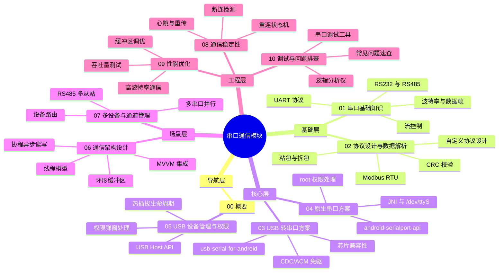
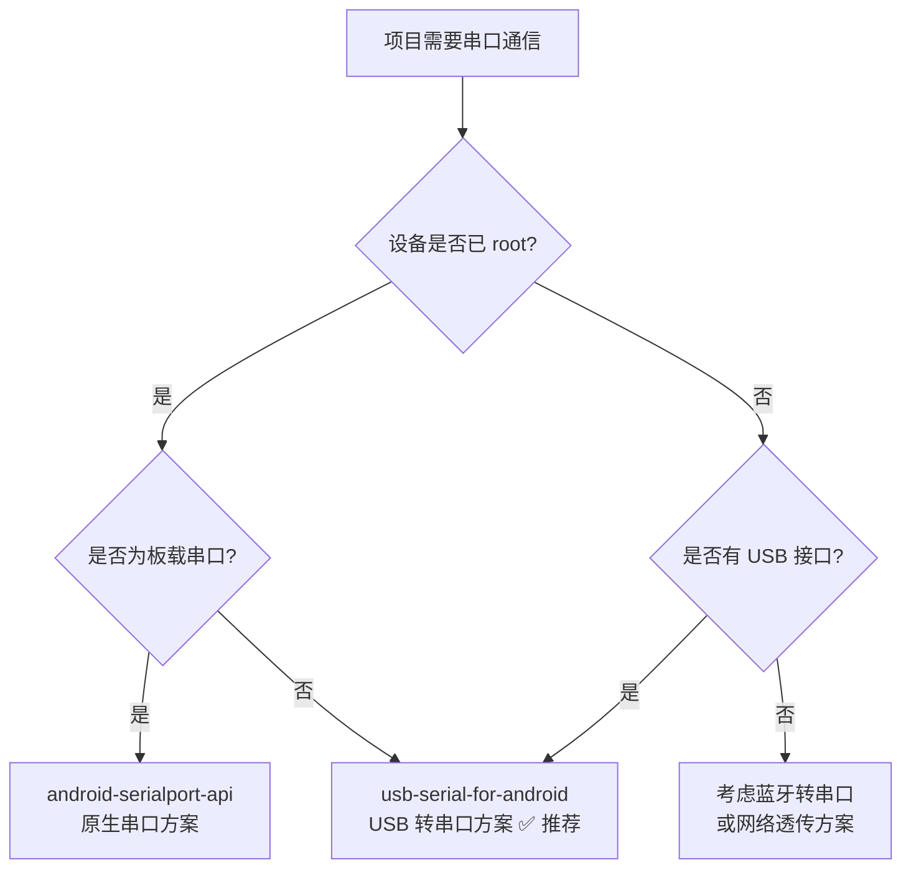
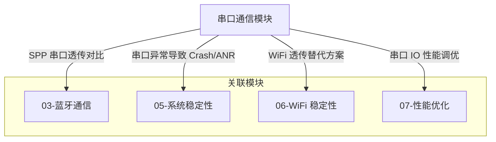

# 串口通信 - 概要

## 模块定位

串口通信（Serial Communication）是 Android 设备与外部硬件（MCU、传感器、工控设备等）交互的最基础、最广泛的手段之一。在工控主板、车载系统、IoT 网关、POS 终端、自助设备等场景中，串口通信承担着指令下发与数据回传的核心职责。

本模块覆盖以下核心领域：

| 领域 | 说明 | 对应文件 |
|------|------|----------|
| 串口基础知识 | UART 协议、RS232/RS485 电平、波特率、流控制 | `01-串口基础知识` |
| 协议设计与数据解析 | 自定义协议、Modbus、CRC 校验、粘包拆包 | `02-协议设计与数据解析` |
| USB 转串口方案 | usb-serial-for-android、免 root 方案 | `03-USB转串口方案` |
| 原生串口方案 | JNI 访问 /dev/ttyS*、需 root | `04-原生串口方案` |
| USB 设备管理与权限 | USB Host API、权限弹窗、热插拔 | `05-USB设备管理与权限` |
| 通信架构设计 | 线程模型、环形缓冲区、协程模式、MVVM 集成 | `06-通信架构设计` |
| 多设备与通道管理 | 多串口并行、RS485 多从站、设备路由 | `07-多设备与通道管理` |
| 通信稳定性与错误处理 | 断连检测、重连状态机、心跳、重传 | `08-通信稳定性与错误处理` |
| 性能优化 | 高波特率、缓冲区调优、吞吐量测试 | `09-性能优化` |
| 调试与问题排查 | 调试工具、逻辑分析仪、常见问题速查 | `10-调试与问题排查` |

## 知识全景图



## 核心原理

串口通信（Serial Communication）是设备间通过**逐位顺序传输**数据的通信方式。理解串口通信需要区分三个常混淆的概念：

### UART / RS232 / RS485 区别速览

| 特性 | UART | RS232 | RS485 |
|------|------|-------|-------|
| 本质 | 通信协议（逻辑层） | 电气标准（物理层） | 电气标准（物理层） |
| 电平 | TTL（0V / 3.3V 或 5V） | ±3V ~ ±15V | 差分信号（±1.5V ~ ±6V） |
| 通信方式 | 全双工 | 全双工 | 半双工（两线）/ 全双工（四线） |
| 传输距离 | < 1m | < 15m | < 1200m |
| 连接设备数 | 1 对 1 | 1 对 1 | 1 对 N（最多 32/128/256 节点） |
| 典型场景 | MCU 间通信 | PC 与设备调试 | 工业总线、多设备组网 |

> **一句话理解**：UART 定义了"怎么说话"（协议），RS232/RS485 定义了"用多大声音说"（电气标准）。实际使用中三者常组合出现。

### 数据帧结构

```
┌───────┬──────────┬────────┬────────┐
│起始位 │ 数据位    │ 校验位 │ 停止位 │
│(1bit) │(5~8bit)  │(0~1bit)│(1~2bit)│
└───────┴──────────┴────────┴────────┘
```

- **起始位**：1 个低电平位，标志数据帧开始
- **数据位**：通常 8 位，低位先发（LSB First）
- **校验位**：可选，奇校验/偶校验/无校验
- **停止位**：1 或 2 个高电平位，标志数据帧结束

## Android 串口通信的特殊性

相较于传统嵌入式平台直接操作硬件寄存器，Android 上的串口通信面临更多挑战：

| 挑战 | 说明 |
|------|------|
| **权限壁垒** | 直接访问 `/dev/ttyS*` 需要 root 权限，普通应用无法直接操作 |
| **驱动兼容** | USB 转串口芯片（CH340、CP210x 等）需要内核驱动支持 |
| **碎片化** | 不同厂商定制 ROM 的串口设备节点路径不统一 |
| **生命周期** | USB 设备热插拔需配合 Android USB Host API 处理权限和生命周期 |
| **性能瓶颈** | 用户态通过 JNI/USB API 访问，相比裸机直接操作存在延迟 |

## 发展趋势

1. **USB CDC/ACM 方案普及**：越来越多设备支持 USB CDC（Communication Device Class）标准，免驱通信成为主流
2. **Android Things 已废弃**：Google 于 2022 年停止 Android Things 支持，其 UART API 不再可用，需迁移到其他方案
3. **现代方案演进**：从 root + 原生串口 → USB Host API + 第三方库 → 标准化 USB CDC，门槛逐步降低
4. **IoT 网关化**：Android 设备更多作为物联网网关角色，串口通信需求从"直连外设"转向"协议桥接"

## 主流方案与开源项目对比

| 项目 | 方案类型 | Stars | 维护状态 | 优势 | 劣势 |
|------|----------|-------|----------|------|------|
| [android-serialport-api](https://github.com/cereal-killers/android-serialport-api) | 原生串口（JNI） | 4k+ | 维护较少 | Google 官方示例，简单直接 | 需 root 权限，场景受限 |
| [usb-serial-for-android](https://github.com/mik3y/usb-serial-for-android) | USB 转串口 | 5k+ | 活跃 | 免 root，芯片支持广泛，社区活跃 | 依赖 USB Host API |
| [Android-SerialPort](https://github.com/kongqw/Android-SerialPort) | 原生串口（JNI） | 1k+ | 一般 | 封装友好，API 简洁 | 需 root 权限 |
| [UsbSerial](https://github.com/felHR85/UsbSerial) | USB 转串口 | 1.5k+ | 一般 | 事件驱动模型 | 近年更新放缓 |

### 选型建议



> **多数场景推荐**：`usb-serial-for-android`——免 root、芯片兼容性好、社区活跃、维护稳定。

## 模块间关系



## 推荐阅读路径

### 新人入门路径

适合刚接触 Android 串口开发的开发者，按顺序阅读：


1. **概要**（本文）— 建立全局认知
2. **串口基础知识** — 理解 UART、电平标准、波特率
3. **协议设计与数据解析** — 掌握协议帧格式与粘包处理
4. **USB 转串口方案** — 进入实战开发（推荐方案）
5. **USB 设备管理与权限** — 处理 Android 设备生命周期

### 按需深入路径

已有基础的开发者，根据当前任务选择对应文件：

| 你的任务 | 推荐阅读 |
|----------|----------|
| 需要在 root 设备/工控板上用板载串口 | `04-原生串口方案` |
| 需要设计与 MCU 的通信协议 | `02-协议设计与数据解析` |
| 需要处理 USB 权限和热插拔 | `05-USB设备管理与权限` |
| 需要搭建完整的串口通信架构 | `06-通信架构设计` |
| 需要同时连接多个串口设备 | `07-多设备与通道管理` |
| 串口连接不稳定需要优化 | `08-通信稳定性与错误处理` |
| 高波特率通信有性能问题 | `09-性能优化` |
| 串口功能出 Bug 需要排查 | `10-调试与问题排查` |

## 踩坑记录

> 此区域供团队成员补充项目中遇到的真实案例。

| 日期 | 记录人 | 问题描述 | 解决方案 |
|------|--------|----------|----------|
| | | | |

## 参考资料

- [Android USB Host Overview](https://developer.android.com/develop/connectivity/usb/host)
- [usb-serial-for-android - GitHub](https://github.com/mik3y/usb-serial-for-android)
- [android-serialport-api - GitHub](https://github.com/cereal-killers/android-serialport-api)
- [UART 协议详解 - Wikipedia](https://en.wikipedia.org/wiki/Universal_asynchronous_receiver-transmitter)
- [USB CDC/ACM 规范](https://www.usb.org/document-library/class-definitions-communication-devices-12)
