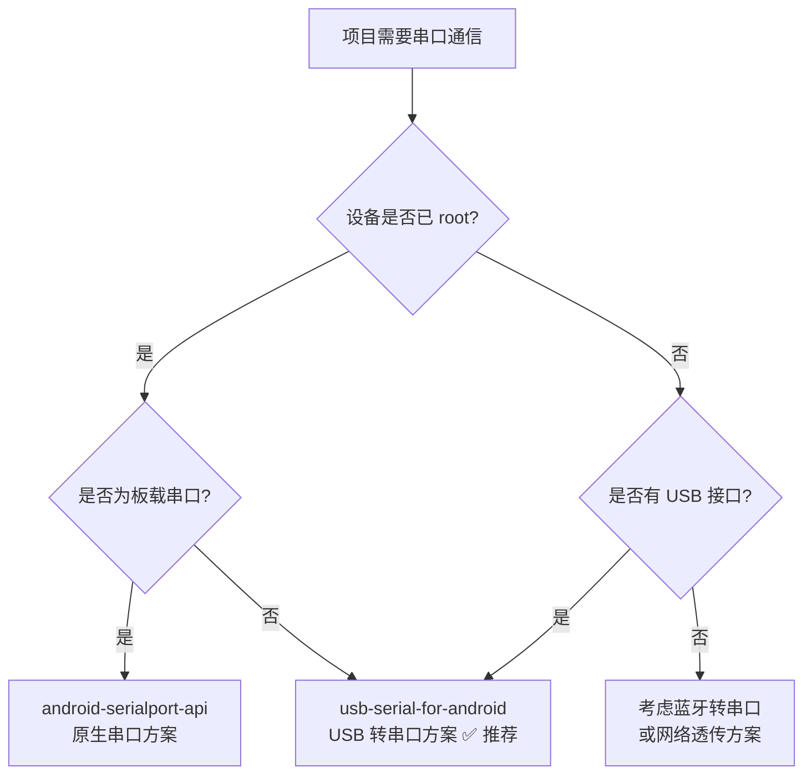
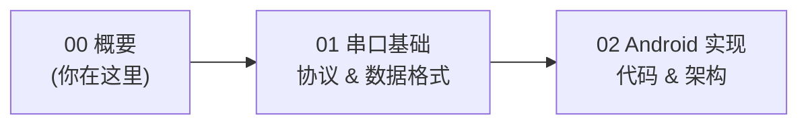

# 串口通信概要

## 核心原理

串口通信（Serial Communication）是设备间通过**逐位顺序传输**数据的通信方式，是嵌入式系统与外设交互最基础、最广泛的手段之一。

### UART / RS232 / RS485 区别速览

| 特性 | UART | RS232 | RS485 |
|------|------|-------|-------|
| 本质 | 通信协议（逻辑层） | 电气标准（物理层） | 电气标准（物理层） |
| 电平 | TTL（0V / 3.3V 或 5V） | ±3V ~ ±15V | 差分信号（±1.5V ~ ±6V） |
| 通信方式 | 全双工 | 全双工 | 半双工（两线）/ 全双工（四线） |
| 传输距离 | < 1m | < 15m | < 1200m |
| 连接设备数 | 1 对 1 | 1 对 1 | 1 对 N（最多 32/128/256 节点） |
| 典型场景 | MCU 间通信 | PC 与设备调试 | 工业总线、多设备组网 |

> **一句话理解**：UART 定义了"怎么说话"（协议），RS232/RS485 定义了"用多大声音说"（电气标准）。实际使用中三者常组合出现。

### 数据帧结构

```
┌───────┬──────────┬────────┬────────┐
│起始位 │ 数据位    │ 校验位 │ 停止位 │
│(1bit) │(5~8bit)  │(0~1bit)│(1~2bit)│
└───────┴──────────┴────────┴────────┘
```

- **起始位**：1 个低电平位，标志数据帧开始
- **数据位**：通常 8 位，低位先发（LSB First）
- **校验位**：可选，奇校验/偶校验/无校验
- **停止位**：1 或 2 个高电平位，标志数据帧结束

## Android 串口通信的特殊性

相较于传统嵌入式平台直接操作硬件寄存器，Android 上的串口通信面临更多挑战：

| 挑战 | 说明 |
|------|------|
| **权限壁垒** | 直接访问 `/dev/ttyS*` 需要 root 权限，普通应用无法直接操作 |
| **驱动兼容** | USB 转串口芯片（CH340、CP210x 等）需要内核驱动支持 |
| **碎片化** | 不同厂商定制 ROM 的串口设备节点路径不统一 |
| **生命周期** | USB 设备热插拔需配合 Android USB Host API 处理权限和生命周期 |
| **性能瓶颈** | 用户态通过 JNI/USB API 访问，相比裸机直接操作存在延迟 |

## 发展趋势

1. **USB CDC/ACM 方案普及**：越来越多设备支持 USB CDC（Communication Device Class）标准，免驱通信成为主流
2. **Android Things 已废弃**：Google 于 2022 年停止 Android Things 支持，其 UART API 不再可用，需迁移到其他方案
3. **现代方案演进**：从 root + 原生串口 → USB Host API + 第三方库 → 标准化 USB CDC，门槛逐步降低
4. **IoT 网关化**：Android 设备更多作为物联网网关角色，串口通信需求从"直连外设"转向"协议桥接"

## 主流方案与开源项目对比

| 项目 | 方案类型 | Stars | 维护状态 | 优势 | 劣势 |
|------|----------|-------|----------|------|------|
| [android-serialport-api](https://github.com/cereal-killers/android-serialport-api) | 原生串口（JNI） | 4k+ | 维护较少 | Google 官方示例，简单直接 | 需 root 权限，场景受限 |
| [usb-serial-for-android](https://github.com/mik3y/usb-serial-for-android) | USB 转串口 | 5k+ | 活跃 | 免 root，芯片支持广泛，社区活跃 | 依赖 USB Host API |
| [Android-SerialPort](https://github.com/kongqw/Android-SerialPort) | 原生串口（JNI） | 1k+ | 一般 | 封装友好，API 简洁 | 需 root 权限 |
| [UsbSerial](https://github.com/felHR85/UsbSerial) | USB 转串口 | 1.5k+ | 一般 | 事件驱动模型 | 近年更新放缓 |

### 选型建议



> **多数场景推荐**：`usb-serial-for-android`——免 root、芯片兼容性好、社区活跃、维护稳定。

## 快速上手路径

建议按以下顺序阅读本模块文档：

1. **本文（概要）** → 建立全局认知
2. [串口基础与协议详情](01-串口基础serial-port-basics.md) → 理解底层协议与数据格式
3. [Android 串口实现方案](02-Android串口实现android-serial-impl.md) → 进入实战开发


