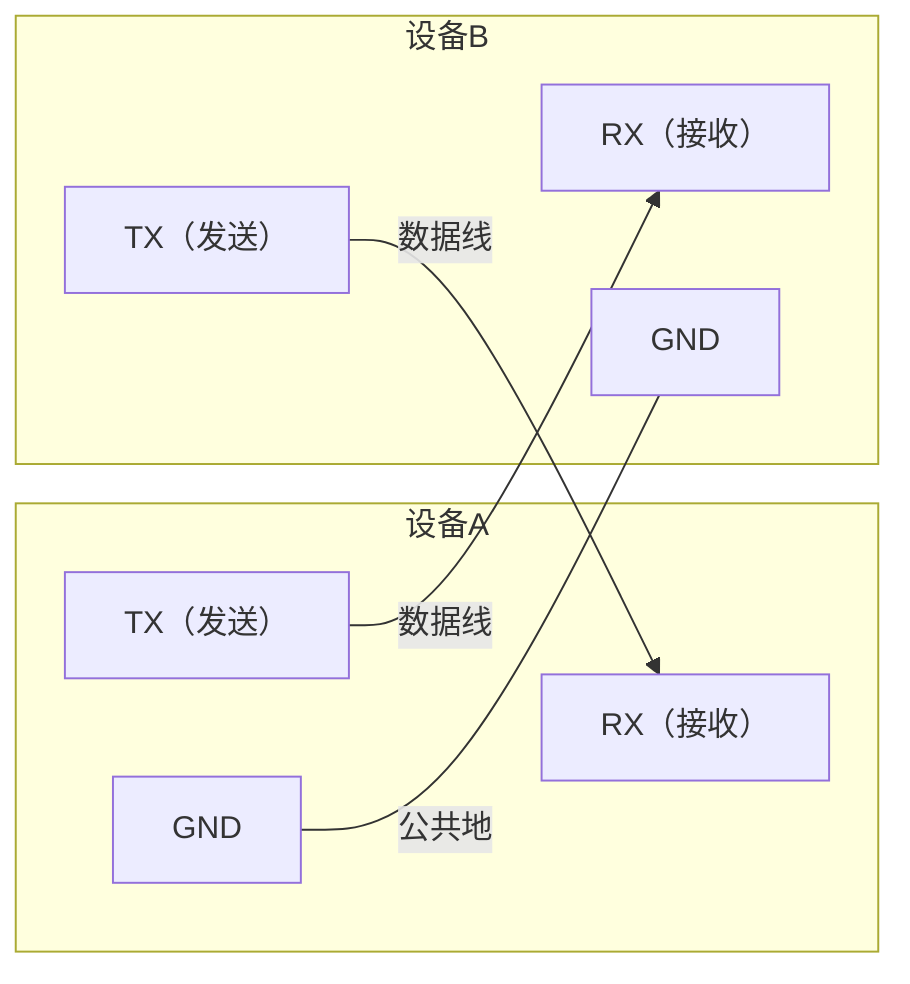
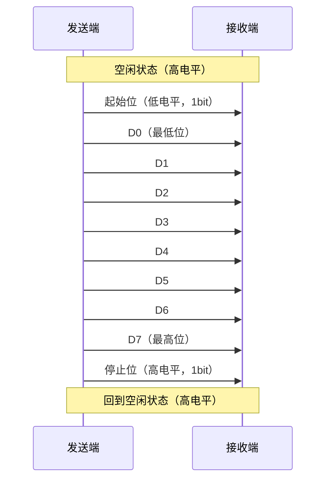
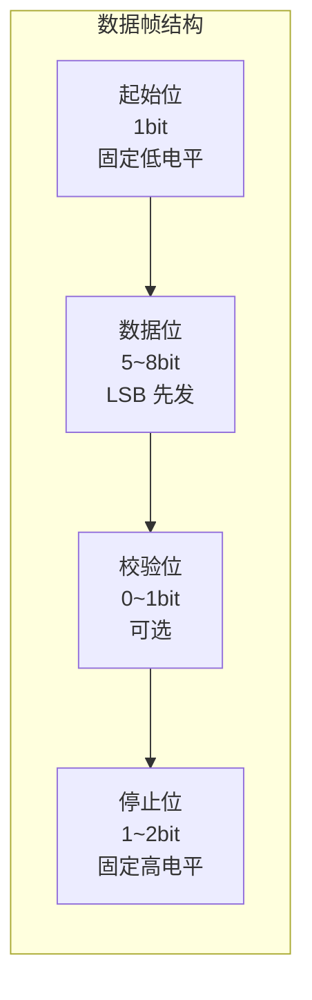
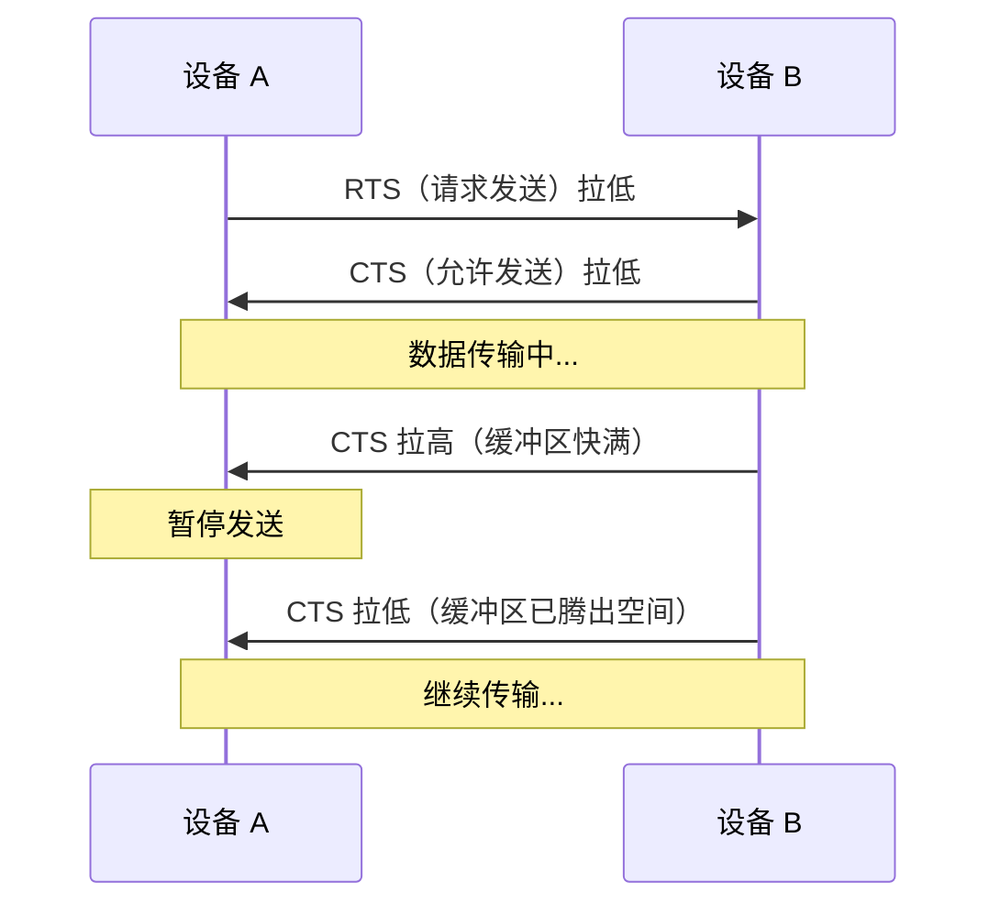
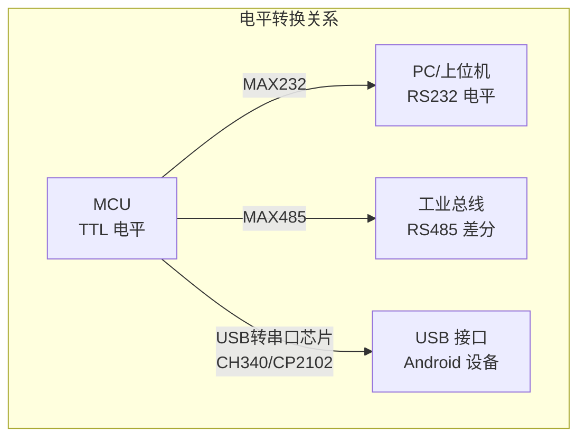
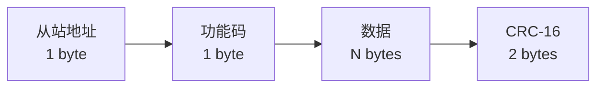

# 串口基础与协议详情

## 串口通信物理层原理

串口通信的物理层定义了电信号如何在两个设备之间传输。下图展示了 UART 全双工通信的基本连接方式：



> **关键原则**：TX 对接 RX，双方共地。这是所有串口连接的基础，接反是最常见的硬件排查问题之一。

### 信号传输时序

一个完整的字节传输过程（以 8N1 格式为例：8 数据位、无校验、1 停止位）：



## UART 通信协议详解

### 波特率（Baud Rate）

波特率表示每秒传输的码元数。对于 UART，1 码元 = 1 bit，因此波特率等于比特率。

| 常用波特率 | 每字节耗时（8N1, 10bit/字节） | 适用场景 |
|-----------|------|----------|
| 9600 | ~1.04 ms | 低速设备、调试输出 |
| 19200 | ~0.52 ms | 一般传感器通信 |
| 38400 | ~0.26 ms | 较高速数据传输 |
| 57600 | ~0.17 ms | GPS 模块等 |
| 115200 | ~0.087 ms | 最常用的高速通信 |
| 921600 | ~0.011 ms | 高速数据传输 |

> **注意**：通信双方必须使用相同波特率。波特率不匹配是串口通信中最常见的问题，表现为接收到乱码。

### 数据帧格式

数据帧格式通常用简写表示，例如 **8N1** 表示：

- **8**：8 个数据位
- **N**：无校验（None），也可为 O（奇校验）/ E（偶校验）
- **1**：1 个停止位



### 流控制

流控制用于防止接收方缓冲区溢出，分为硬件流控和软件流控两种。

#### 硬件流控（RTS/CTS）



- **RTS（Request To Send）**：发送方请求发送
- **CTS（Clear To Send）**：接收方允许发送
- 优点：可靠性高，硬件级别控制
- 缺点：需要额外信号线

#### 软件流控（XON/XOFF）

- **XON**（0x11，DC1）：恢复发送
- **XOFF**（0x13，DC3）：暂停发送
- 优点：不需要额外硬件线路
- 缺点：占用数据通道中的两个字符编码，不适用于二进制传输

## RS232 / RS485 / TTL 电平对比

| 特性 | TTL 电平 | RS232 电平 | RS485 电平 |
|------|----------|-----------|-----------|
| 逻辑 1 | 2.4V ~ 5V（高电平） | -3V ~ -15V（负电压） | A-B > +200mV（差分） |
| 逻辑 0 | 0V ~ 0.4V（低电平） | +3V ~ +15V（正电压） | A-B < -200mV（差分） |
| 传输距离 | < 1m | < 15m | < 1200m |
| 抗干扰能力 | 弱 | 中 | 强（差分信号） |
| 典型接口 | MCU 引脚直连 | DB9 接口 | 接线端子 |
| 转换芯片 | — | MAX232 | MAX485 / SP485 |



## 常用上层协议

### Modbus RTU

Modbus 是工业领域最广泛使用的串口通信协议。RTU（Remote Terminal Unit）模式以二进制格式传输。

**帧结构**：

| 字段 | 长度 | 说明 |
|------|------|------|
| 从站地址 | 1 字节 | 0x01 ~ 0xF7 |
| 功能码 | 1 字节 | 0x03（读保持寄存器）等 |
| 数据 | N 字节 | 由功能码决定 |
| CRC 校验 | 2 字节 | CRC-16/Modbus，低字节在前 |



### Modbus ASCII

与 RTU 类似但以 ASCII 字符传输，帧以 `:` 开头、`\r\n` 结尾，校验使用 LRC。传输效率低于 RTU，但可读性好，便于调试。

### 自定义协议设计要点

在项目中设计自定义串口协议时，建议包含以下要素：

| 要素 | 建议 | 示例 |
|------|------|------|
| 帧头 | 固定魔术字节，便于帧同步 | `0xAA 0x55` |
| 长度字段 | 指明数据区长度，应对变长数据 | 1~2 字节 |
| 命令字段 | 区分不同消息类型 | `0x01` = 心跳, `0x02` = 数据 |
| 序列号 | 用于请求-响应配对和重发机制 | 1 字节递增 |
| 数据区 | 实际载荷 | 变长 |
| 校验 | CRC16 或简单异或校验 | 2 字节 |
| 帧尾（可选） | 辅助帧边界识别 | `0x0D 0x0A` |

**推荐的自定义帧结构**：

```
┌──────────┬──────┬──────┬──────┬─────────┬──────────┬──────────┐
│ 帧头      │ 长度 │ 命令 │ 序列号│ 数据区   │ CRC 校验  │ 帧尾(可选)│
│ 2 bytes  │1~2 B │ 1 B  │ 1 B  │ N bytes │ 2 bytes  │ 2 bytes  │
└──────────┴──────┴──────┴──────┴─────────┴──────────┴──────────┘
```

## 数据校验方法

### 奇偶校验

在每个数据帧中加入 1 个校验位：

- **奇校验**：数据位中"1"的个数（含校验位）为奇数
- **偶校验**：数据位中"1"的个数（含校验位）为偶数

优点：实现简单，硬件直接支持。缺点：只能检测奇数个位的错误，无法纠错。

### CRC 校验

CRC（循环冗余校验）是串口通信中最常用的校验方式，能检测多位错误。

以下是 Modbus RTU 常用的 CRC-16 计算实现：

```kotlin
/**
 * CRC-16/Modbus 校验计算工具
 * 多项式: 0xA001（0x8005 的位反转）
 */
object CrcUtils {

    /**
     * 计算 CRC-16/Modbus 校验值
     * @param data 待校验的字节数组
     * @return CRC 校验值（低字节在前）
     */
    fun crc16Modbus(data: ByteArray): Int {
        var crc = 0xFFFF

        for (byte in data) {
            crc = crc xor (byte.toInt() and 0xFF)
            repeat(8) {
                crc = if (crc and 0x0001 != 0) {
                    (crc shr 1) xor 0xA001
                } else {
                    crc shr 1
                }
            }
        }
        return crc
    }

    /**
     * 将 CRC 值转为 2 字节数组（低字节在前，符合 Modbus 规范）
     */
    fun crc16ToBytes(crc: Int): ByteArray {
        return byteArrayOf(
            (crc and 0xFF).toByte(),        // 低字节
            ((crc shr 8) and 0xFF).toByte() // 高字节
        )
    }

    /**
     * 校验数据帧的 CRC 是否正确
     * @param frame 包含 CRC 的完整帧（最后 2 字节为 CRC）
     * @return 校验是否通过
     */
    fun verifyCrc16(frame: ByteArray): Boolean {
        if (frame.size < 3) return false
        val data = frame.copyOfRange(0, frame.size - 2)
        val receivedCrc = (frame[frame.size - 2].toInt() and 0xFF) or
                ((frame[frame.size - 1].toInt() and 0xFF) shl 8)
        return crc16Modbus(data) == receivedCrc
    }
}
```

**使用示例**：

```kotlin
// 计算 CRC 并追加到数据末尾
val payload = byteArrayOf(0x01, 0x03, 0x00, 0x00, 0x00, 0x0A)
val crc = CrcUtils.crc16Modbus(payload)
val frame = payload + CrcUtils.crc16ToBytes(crc)

// 校验接收到的帧
val isValid = CrcUtils.verifyCrc16(frame) // true
```

## 粘包 / 拆包问题及解决策略

串口通信是字节流传输，不存在"消息边界"概念，因此会出现粘包和拆包问题：

- **粘包**：多个协议帧的数据粘在一起被一次性读取
- **拆包**：一个协议帧被拆成多次读取


### 解决策略

| 策略 | 实现方式 | 适用场景 |
|------|----------|----------|
| **固定长度** | 每帧固定 N 字节，不足补位 | 数据量固定的简单协议 |
| **分隔符** | 用特定字节序列标识帧边界 | 文本协议（如 `\r\n` 结尾） |
| **长度字段** | 帧头中包含数据长度字段 | 通用二进制协议（**推荐**） |
| **超时分帧** | 两帧间超过指定时间则认为分帧 | Modbus RTU（3.5 字符时间） |

**推荐方案：帧头 + 长度字段的状态机解析**

```kotlin
/**
 * 串口协议解析器 — 基于状态机处理粘包/拆包
 * 协议格式: [帧头 0xAA 0x55] [长度 1byte] [数据 N bytes] [CRC 2bytes]
 */
class ProtocolParser(
    private val onFrameParsed: (ByteArray) -> Unit
) {
    private enum class State {
        WAIT_HEADER_1,  // 等待帧头第一个字节
        WAIT_HEADER_2,  // 等待帧头第二个字节
        WAIT_LENGTH,    // 等待长度字段
        WAIT_DATA,      // 等待数据和 CRC
    }

    private var state = State.WAIT_HEADER_1
    private var dataLength = 0
    private val buffer = mutableListOf<Byte>()

    /**
     * 逐字节喂入数据，内部状态机自动处理粘包/拆包
     */
    fun feed(bytes: ByteArray) {
        for (b in bytes) {
            when (state) {
                State.WAIT_HEADER_1 -> {
                    if (b == 0xAA.toByte()) {
                        buffer.clear()
                        buffer.add(b)
                        state = State.WAIT_HEADER_2
                    }
                }
                State.WAIT_HEADER_2 -> {
                    if (b == 0x55.toByte()) {
                        buffer.add(b)
                        state = State.WAIT_LENGTH
                    } else {
                        state = State.WAIT_HEADER_1
                    }
                }
                State.WAIT_LENGTH -> {
                    dataLength = b.toInt() and 0xFF
                    buffer.add(b)
                    state = State.WAIT_DATA
                }
                State.WAIT_DATA -> {
                    buffer.add(b)
                    // 帧头(2) + 长度(1) + 数据(N) + CRC(2)
                    val expectedTotal = 2 + 1 + dataLength + 2
                    if (buffer.size >= expectedTotal) {
                        val frame = buffer.toByteArray()
                        if (CrcUtils.verifyCrc16(frame.drop(3).toByteArray())) {
                            onFrameParsed(frame)
                        }
                        state = State.WAIT_HEADER_1
                        buffer.clear()
                    }
                }
            }
        }
    }

    /** 重置解析器状态 */
    fun reset() {
        state = State.WAIT_HEADER_1
        buffer.clear()
    }
}
```

## 踩坑记录

> 此区域供团队成员补充项目中遇到的真实案例。

| 日期 | 记录人 | 问题描述 | 解决方案 |
|------|--------|----------|----------|
| | | | |

## 参考资料

- [UART 协议详解 - Wikipedia](https://en.wikipedia.org/wiki/Universal_asynchronous_receiver-transmitter)
- [RS-232 标准 - Wikipedia](https://en.wikipedia.org/wiki/RS-232)
- [RS-485 标准 - Wikipedia](https://en.wikipedia.org/wiki/RS-485)
- [Modbus 协议规范](https://modbus.org/specs.php)
- [串口通信基础 - SparkFun](https://learn.sparkfun.com/tutorials/serial-communication)
- [Android 串口通信实战指南](02-Android串口实现android-serial-impl.md) — 本模块下一篇
