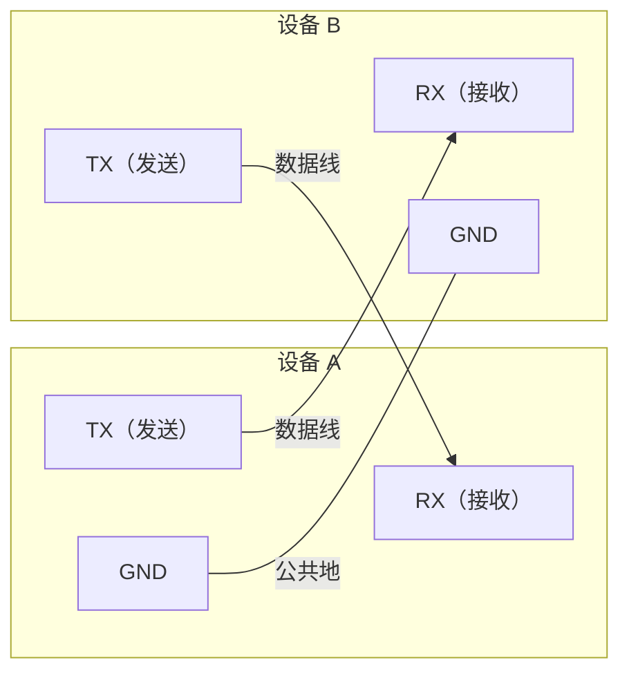
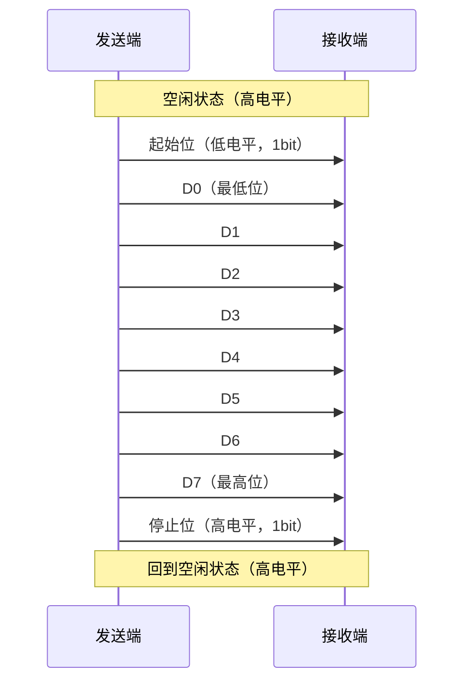
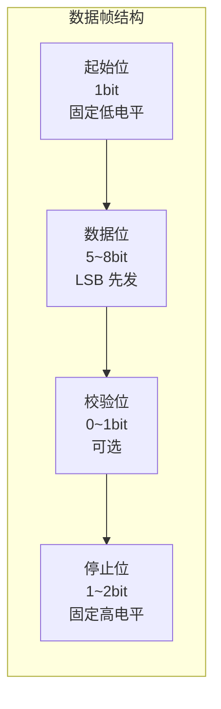
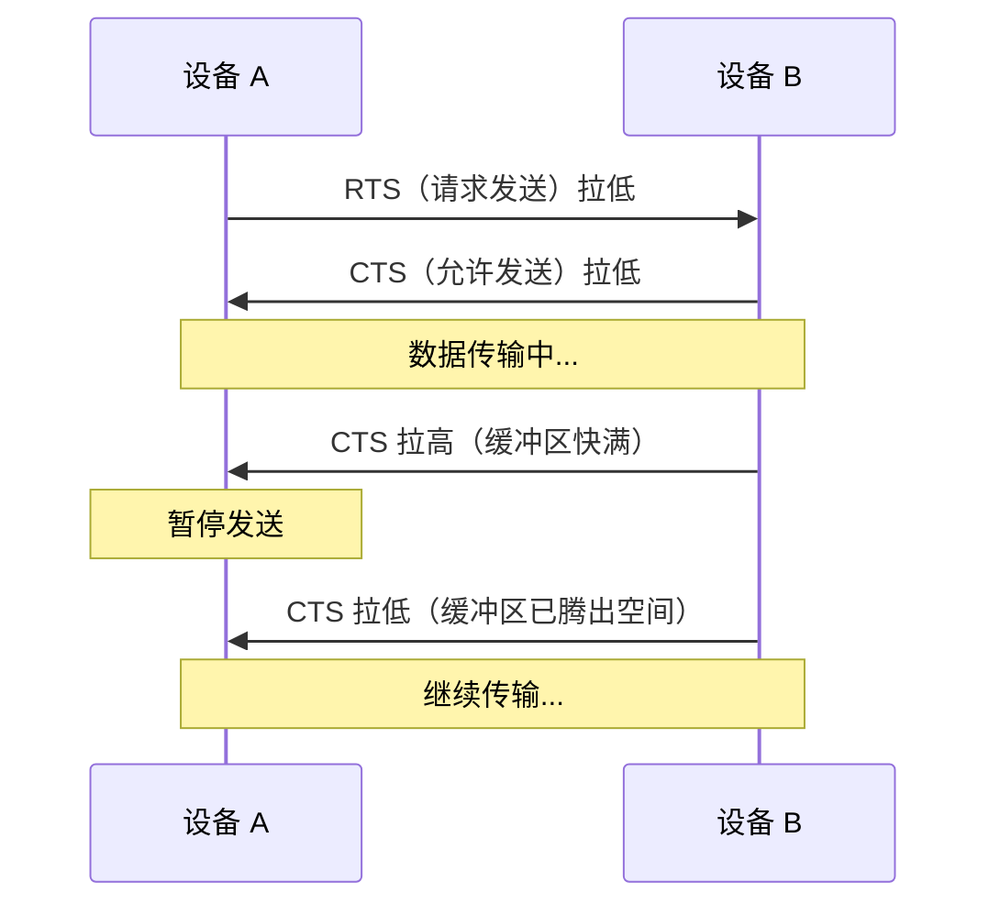
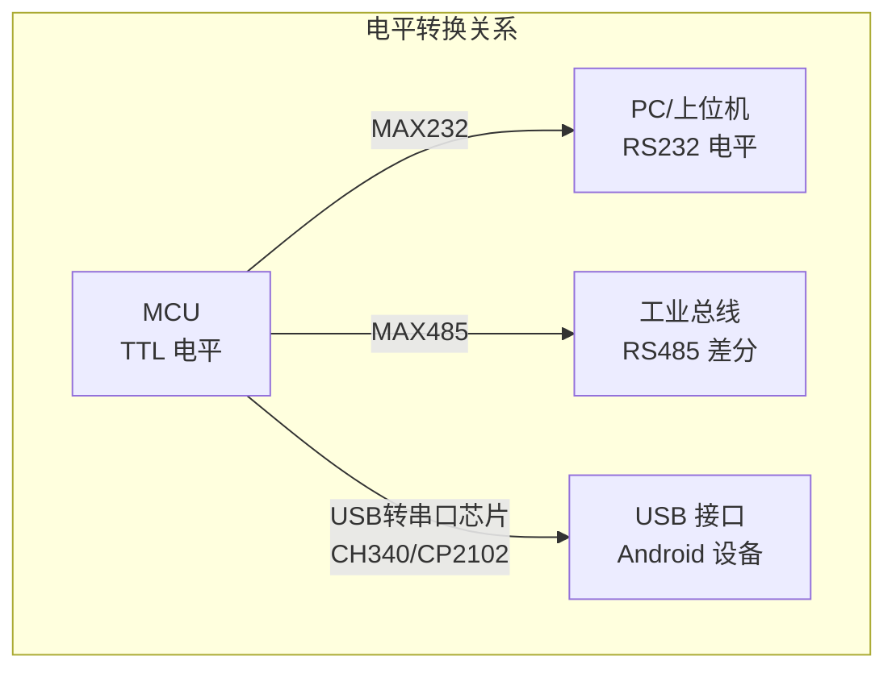
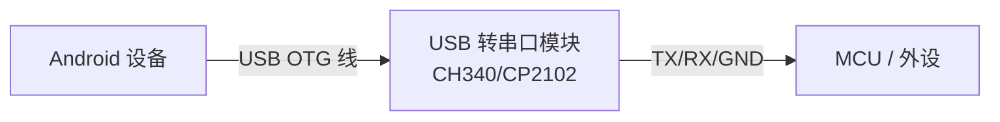

# 串口基础知识

## 串口通信物理层原理

串口通信的物理层定义了电信号如何在两个设备之间传输。下图展示了 UART 全双工通信的基本连接方式：



> **关键原则**：TX 对接 RX，双方共地。这是所有串口连接的基础，接反是最常见的硬件排查问题之一。

### 信号传输时序

一个完整的字节传输过程（以 8N1 格式为例：8 数据位、无校验、1 停止位）：



### 传输过程要点

1. **空闲状态**为高电平，起始位拉低标志一帧开始
2. 数据位按 **LSB First**（最低位优先）顺序发送
3. 接收端在每个位的中间时刻采样，依赖双方波特率一致来确定采样时机
4. 停止位恢复高电平，为下一帧做准备

## UART 通信协议详解

### 波特率（Baud Rate）

波特率表示每秒传输的码元数。对于 UART，1 码元 = 1 bit，因此波特率等于比特率。

| 常用波特率 | 每字节耗时（8N1, 10bit/字节） | 适用场景 |
|-----------|------|----------|
| 9600 | ~1.04 ms | 低速设备、调试输出 |
| 19200 | ~0.52 ms | 一般传感器通信 |
| 38400 | ~0.26 ms | 较高速数据传输 |
| 57600 | ~0.17 ms | GPS 模块等 |
| 115200 | ~0.087 ms | 最常用的高速通信 |
| 921600 | ~0.011 ms | 高速数据传输 |

> **注意**：通信双方必须使用相同波特率。波特率不匹配是串口通信中最常见的问题，表现为接收到乱码。

**波特率与实际吞吐量的关系**（以 8N1 为例）：

```
实际数据吞吐量 = 波特率 / 10 × 1 字节
例：115200 bps → 11520 字节/秒 ≈ 11.25 KB/s
```

每个字节需要 10 个 bit 传输（1 起始位 + 8 数据位 + 1 停止位），因此有效数据率只有波特率的 80%。

### 数据帧格式

数据帧格式通常用简写表示，例如 **8N1** 表示：

- **8**：8 个数据位
- **N**：无校验（None），也可为 O（奇校验）/ E（偶校验）
- **1**：1 个停止位



常见的帧格式组合：

| 简写 | 数据位 | 校验 | 停止位 | 总位数 | 说明 |
|------|--------|------|--------|--------|------|
| 8N1 | 8 | 无 | 1 | 10 | **最常用**，绝大多数设备默认 |
| 8E1 | 8 | 偶校验 | 1 | 11 | 工业设备常用 |
| 8O1 | 8 | 奇校验 | 1 | 11 | 少量旧设备使用 |
| 8N2 | 8 | 无 | 2 | 11 | 长距离传输提高可靠性 |

### 流控制

流控制用于防止接收方缓冲区溢出，分为硬件流控和软件流控两种。

#### 硬件流控（RTS/CTS）



- **RTS（Request To Send）**：发送方请求发送
- **CTS（Clear To Send）**：接收方允许发送
- 优点：可靠性高，硬件级别控制
- 缺点：需要额外信号线

#### 软件流控（XON/XOFF）

- **XON**（0x11，DC1）：恢复发送
- **XOFF**（0x13，DC3）：暂停发送
- 优点：不需要额外硬件线路
- 缺点：占用数据通道中的两个字符编码，不适用于二进制传输

#### 流控选型建议

| 场景 | 推荐 | 原因 |
|------|------|------|
| 二进制协议传输 | 硬件流控 或 无流控 | XON/XOFF 会与数据冲突 |
| ASCII 文本传输 | 软件流控可选 | 简单且不需额外硬件 |
| USB 转串口 | 一般无需流控 | USB 协议自身有流控机制 |
| 高速大数据量 | 硬件流控 | 防止缓冲区溢出导致丢数据 |

## RS232 / RS485 / TTL 电平对比

| 特性 | TTL 电平 | RS232 电平 | RS485 电平 |
|------|----------|-----------|-----------|
| 逻辑 1 | 2.4V ~ 5V（高电平） | -3V ~ -15V（负电压） | A-B > +200mV（差分） |
| 逻辑 0 | 0V ~ 0.4V（低电平） | +3V ~ +15V（正电压） | A-B < -200mV（差分） |
| 传输距离 | < 1m | < 15m | < 1200m |
| 抗干扰能力 | 弱 | 中 | 强（差分信号） |
| 典型接口 | MCU 引脚直连 | DB9 接口 | 接线端子 |
| 转换芯片 | — | MAX232 | MAX485 / SP485 |

### 电平转换关系



> **Android 开发者最常接触的路径**：Android 设备 → USB OTG → USB 转串口模块（内含 CH340/CP2102 芯片）→ MCU（TTL 电平）。

## USB 转串口芯片选型

Android 串口开发中，USB 转串口芯片的选择直接影响驱动兼容性和稳定性：

| 芯片 | 厂商 | VendorId | ProductId | 特点 | 参考价格 |
|------|------|----------|-----------|------|----------|
| CH340/CH341 | 南京沁恒 | 0x1A86 | 0x7523 | 国产，价格低，兼容性好 | ¥2~5 |
| CP2102/CP2104 | Silicon Labs | 0x10C4 | 0xEA60 | 稳定性好，驱动成熟 | ¥8~15 |
| FT232R/FT2232 | FTDI | 0x0403 | 0x6001 | 老牌芯片，性能稳定 | ¥15~30 |
| PL2303 | Prolific | 0x067B | 0x2303 | 历史悠久，假芯片泛滥 | ¥3~8 |

> **采购建议**：优先选择 **CH340**（性价比高）或 **CP2102**（稳定性好），避免低价 PL2303（市面假芯片多，兼容性问题频发）。

## Android 开发者需要了解的硬件知识

### 典型硬件连接方式

在 Android 串口开发中，最常见的硬件组合：



**连线基本原则**：

1. **TX ↔ RX**：发送端的 TX 接接收端的 RX，反之亦然
2. **共地**：两个设备的 GND 必须相连
3. **电平匹配**：不同电平标准的设备之间必须经过电平转换芯片
4. **供电独立**：外设尽量使用独立电源，避免从 USB 口取电导致供电不足

### USB OTG 支持检测

并非所有 Android 设备都支持 USB OTG（On-The-Go），开发前需确认：

```kotlin
fun isOtgSupported(context: Context): Boolean {
    return context.packageManager.hasSystemFeature(PackageManager.FEATURE_USB_HOST)
}
```

### 常见硬件问题快速排查

| 现象 | 可能原因 | 排查方法 |
|------|----------|----------|
| 完全无数据 | TX/RX 接反 | 交换 TX/RX 接线 |
| 收到全是乱码 | 波特率不匹配 | 确认双方波特率一致 |
| 偶尔丢数据 | 供电不足或接触不良 | 检查电源和接线 |
| 设备无法识别 | OTG 不支持或线材问题 | 换线/换设备测试 |

## 踩坑记录

> 此区域供团队成员补充项目中遇到的真实案例。

| 日期 | 记录人 | 问题描述 | 解决方案 |
|------|--------|----------|----------|
| | | | |

## 参考资料

- [UART 协议详解 - Wikipedia](https://en.wikipedia.org/wiki/Universal_asynchronous_receiver-transmitter)
- [RS-232 标准 - Wikipedia](https://en.wikipedia.org/wiki/RS-232)
- [RS-485 标准 - Wikipedia](https://en.wikipedia.org/wiki/RS-485)
- [串口通信基础 - SparkFun](https://learn.sparkfun.com/tutorials/serial-communication)
- [协议设计与数据解析](02-协议设计与数据解析protocol-design-and-parsing.md) — 本模块下一篇
