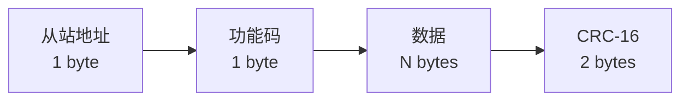
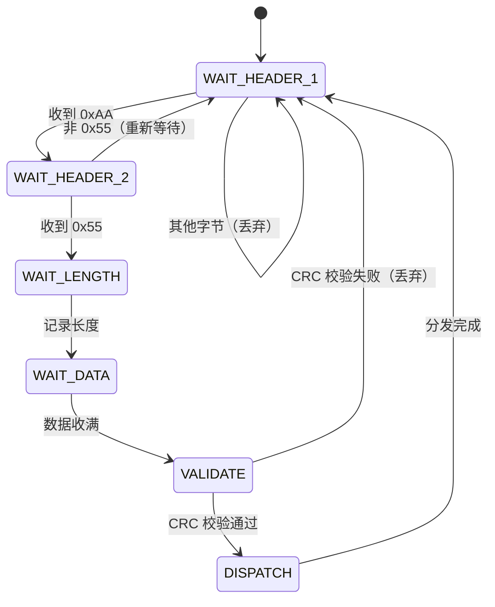

# 协议设计与数据解析

## Modbus 协议

Modbus 是工业领域最广泛使用的串口通信协议，分为 RTU 和 ASCII 两种传输模式。

### Modbus RTU

RTU（Remote Terminal Unit）模式以二进制格式传输，效率高，是实际项目中最常用的 Modbus 形式。

**帧结构**：



| 字段 | 长度 | 说明 |
|------|------|------|
| 从站地址 | 1 字节 | 0x01 ~ 0xF7，0x00 为广播地址 |
| 功能码 | 1 字节 | 定义操作类型 |
| 数据 | N 字节 | 由功能码决定内容和长度 |
| CRC 校验 | 2 字节 | CRC-16/Modbus，低字节在前 |

**常用功能码**：

| 功能码 | 名称 | 说明 |
|--------|------|------|
| 0x01 | 读线圈状态 | 读取开关量输出 |
| 0x02 | 读离散输入 | 读取开关量输入 |
| 0x03 | 读保持寄存器 | **最常用**，读取数据寄存器 |
| 0x04 | 读输入寄存器 | 读取只读寄存器 |
| 0x06 | 写单个寄存器 | 写入单个保持寄存器 |
| 0x10 | 写多个寄存器 | 写入连续多个保持寄存器 |

**请求示例**（读从站 0x01 的保持寄存器，起始地址 0x0000，读取 10 个）：

```
发送: 01 03 00 00 00 0A C5 CD
      │  │  ├────┘ ├────┘ ├────┘
      │  │  起始地址  数量    CRC-16
      │  功能码(读保持寄存器)
      从站地址
```

### Modbus ASCII

与 RTU 类似但以 ASCII 字符传输，帧以 `:` 开头、`\r\n` 结尾，校验使用 LRC。

| 对比项 | RTU | ASCII |
|--------|-----|-------|
| 编码方式 | 二进制 | ASCII 十六进制字符 |
| 帧定界 | 静默间隔（3.5 字符时间） | `:` 开头 + `\r\n` 结尾 |
| 校验方式 | CRC-16 | LRC |
| 传输效率 | 高（数据紧凑） | 低（每字节需 2 个 ASCII 字符） |
| 可读性 | 差（需工具解码） | 好（可直接阅读） |
| 推荐场景 | **生产环境** | 调试和低速场景 |

### Android 端 Modbus Master 实现

```kotlin
/**
 * Modbus RTU 主站请求构建器
 */
object ModbusMaster {

    /**
     * 构建"读保持寄存器"请求帧
     * @param slaveAddress 从站地址
     * @param startRegister 起始寄存器地址
     * @param registerCount 读取寄存器数量
     */
    fun buildReadHoldingRegisters(
        slaveAddress: Int,
        startRegister: Int,
        registerCount: Int
    ): ByteArray {
        val payload = byteArrayOf(
            slaveAddress.toByte(),
            0x03,  // 功能码：读保持寄存器
            (startRegister shr 8).toByte(),
            (startRegister and 0xFF).toByte(),
            (registerCount shr 8).toByte(),
            (registerCount and 0xFF).toByte()
        )
        val crc = CrcUtils.crc16Modbus(payload)
        return payload + CrcUtils.crc16ToBytes(crc)
    }

    /**
     * 构建"写单个寄存器"请求帧
     */
    fun buildWriteSingleRegister(
        slaveAddress: Int,
        registerAddress: Int,
        value: Int
    ): ByteArray {
        val payload = byteArrayOf(
            slaveAddress.toByte(),
            0x06,  // 功能码：写单个寄存器
            (registerAddress shr 8).toByte(),
            (registerAddress and 0xFF).toByte(),
            (value shr 8).toByte(),
            (value and 0xFF).toByte()
        )
        val crc = CrcUtils.crc16Modbus(payload)
        return payload + CrcUtils.crc16ToBytes(crc)
    }

    /**
     * 解析"读保持寄存器"响应
     * @return 寄存器值列表，校验失败返回 null
     */
    fun parseReadHoldingRegistersResponse(frame: ByteArray): List<Int>? {
        if (frame.size < 5) return null
        if (!CrcUtils.verifyCrc16(frame)) return null

        val byteCount = frame[2].toInt() and 0xFF
        val registers = mutableListOf<Int>()
        for (i in 0 until byteCount step 2) {
            val high = frame[3 + i].toInt() and 0xFF
            val low = frame[4 + i].toInt() and 0xFF
            registers.add((high shl 8) or low)
        }
        return registers
    }
}
```

## 自定义协议设计

在与 MCU 通信时，大多数项目会根据业务需求设计自定义协议。

### 协议设计要素

| 要素 | 建议 | 示例 |
|------|------|------|
| 帧头 | 固定魔术字节，便于帧同步 | `0xAA 0x55` |
| 长度字段 | 指明数据区长度，应对变长数据 | 1~2 字节 |
| 命令字段 | 区分不同消息类型 | `0x01` = 心跳, `0x02` = 数据 |
| 序列号 | 用于请求-响应配对和重发机制 | 1 字节递增 |
| 数据区 | 实际载荷 | 变长 |
| 校验 | CRC16 或简单异或校验 | 2 字节 |
| 帧尾（可选） | 辅助帧边界识别 | `0x0D 0x0A` |

### 推荐帧结构

```
┌──────────┬──────┬──────┬──────┬─────────┬──────────┬──────────┐
│ 帧头      │ 长度 │ 命令 │ 序列号│ 数据区   │ CRC 校验  │ 帧尾(可选)│
│ 2 bytes  │1~2 B │ 1 B  │ 1 B  │ N bytes │ 2 bytes  │ 2 bytes  │
└──────────┴──────┴──────┴──────┴─────────┴──────────┴──────────┘
```

### 实战：设计一个完整的设备通信协议

**场景**：Android 平板作为主控，通过串口控制一个 MCU 驱动板（控制电机、读取传感器）。

#### 第一步：定义帧格式

```kotlin
/**
 * 协议帧格式定义
 * [0xAA][0x55][LEN][CMD][SEQ][DATA...][CRC_L][CRC_H]
 */
object Protocol {
    const val HEADER_1: Byte = 0xAA.toByte()
    const val HEADER_2: Byte = 0x55
    const val HEADER_SIZE = 2
    const val META_SIZE = 3  // LEN(1) + CMD(1) + SEQ(1)
    const val CRC_SIZE = 2
    const val MIN_FRAME_SIZE = HEADER_SIZE + META_SIZE + CRC_SIZE  // 7 bytes
}
```

#### 第二步：定义命令码

```kotlin
enum class Command(val code: Byte) {
    HEARTBEAT(0x01),
    MOTOR_CONTROL(0x02),
    SENSOR_READ(0x03),
    SENSOR_REPORT(0x04),
    FIRMWARE_VERSION(0x05),
    ACK(0x7F.toByte()),
    NAK(0x80.toByte());

    companion object {
        private val map = entries.associateBy { it.code }
        fun fromCode(code: Byte): Command? = map[code]
    }
}
```

#### 第三步：构建帧

```kotlin
/**
 * 协议帧构建器
 */
class FrameBuilder {
    private var sequenceNumber: Byte = 0

    fun buildFrame(command: Command, data: ByteArray = byteArrayOf()): ByteArray {
        val seq = sequenceNumber++
        val len = (data.size + Protocol.META_SIZE).toByte()

        val payload = byteArrayOf(len, command.code, seq) + data
        val crc = CrcUtils.crc16Modbus(payload)

        return byteArrayOf(Protocol.HEADER_1, Protocol.HEADER_2) +
                payload +
                CrcUtils.crc16ToBytes(crc)
    }

    fun buildAck(seq: Byte): ByteArray {
        return buildFrame(Command.ACK, byteArrayOf(seq))
    }
}
```

#### 第四步：协议文档模板

| 命令 | 码值 | 方向 | 数据区格式 | 说明 |
|------|------|------|-----------|------|
| 心跳 | 0x01 | 主→从 | 无 | 每 3 秒发送一次 |
| 心跳应答 | 0x01 | 从→主 | `[状态 1B]` | 0x00=正常 |
| 电机控制 | 0x02 | 主→从 | `[电机号 1B][方向 1B][速度 2B]` | 速度 0~1000 |
| 传感器查询 | 0x03 | 主→从 | `[传感器号 1B]` | — |
| 传感器上报 | 0x04 | 从→主 | `[传感器号 1B][数据 4B]` | float, 小端 |
| ACK | 0x7F | 双向 | `[被确认的 SEQ 1B]` | 正确接收确认 |
| NAK | 0x80 | 双向 | `[被拒绝的 SEQ 1B]` | 校验失败请重发 |

## 数据校验方法

### 奇偶校验

在每个数据帧中加入 1 个校验位：

- **奇校验**：数据位中"1"的个数（含校验位）为奇数
- **偶校验**：数据位中"1"的个数（含校验位）为偶数

优点：实现简单，硬件直接支持。缺点：只能检测奇数个位的错误，无法纠错。

### CRC-16 校验

CRC（循环冗余校验）是串口通信中最常用的校验方式，能检测多位错误。

```kotlin
/**
 * CRC-16/Modbus 校验计算工具
 * 多项式: 0xA001（0x8005 的位反转）
 */
object CrcUtils {

    fun crc16Modbus(data: ByteArray): Int {
        var crc = 0xFFFF
        for (byte in data) {
            crc = crc xor (byte.toInt() and 0xFF)
            repeat(8) {
                crc = if (crc and 0x0001 != 0) {
                    (crc shr 1) xor 0xA001
                } else {
                    crc shr 1
                }
            }
        }
        return crc
    }

    fun crc16ToBytes(crc: Int): ByteArray {
        return byteArrayOf(
            (crc and 0xFF).toByte(),
            ((crc shr 8) and 0xFF).toByte()
        )
    }

    fun verifyCrc16(frame: ByteArray): Boolean {
        if (frame.size < 3) return false
        val data = frame.copyOfRange(0, frame.size - 2)
        val receivedCrc = (frame[frame.size - 2].toInt() and 0xFF) or
                ((frame[frame.size - 1].toInt() and 0xFF) shl 8)
        return crc16Modbus(data) == receivedCrc
    }
}
```

**使用示例**：

```kotlin
val payload = byteArrayOf(0x01, 0x03, 0x00, 0x00, 0x00, 0x0A)
val crc = CrcUtils.crc16Modbus(payload)
val frame = payload + CrcUtils.crc16ToBytes(crc)

val isValid = CrcUtils.verifyCrc16(frame) // true
```

### 其他校验方式对比

| 校验方式 | 检错能力 | 计算复杂度 | 适用场景 |
|---------|----------|-----------|---------|
| 奇偶校验 | 弱（仅检测奇数位错误） | 极低 | UART 硬件内置 |
| 异或校验（BCC） | 中 | 低 | 简单自定义协议 |
| 校验和（Checksum） | 中 | 低 | 简单协议、IP 头部 |
| CRC-16 | 强 | 中 | **Modbus、串口协议（推荐）** |
| CRC-32 | 很强 | 较高 | 文件校验、网络协议 |

## 粘包 / 拆包问题

串口通信是字节流传输，不存在"消息边界"概念，因此会出现粘包和拆包问题：

- **粘包**：多个协议帧的数据粘在一起被一次性读取
- **拆包**：一个协议帧被拆成多次读取


### 解决策略对比

| 策略 | 实现方式 | 适用场景 |
|------|----------|----------|
| **固定长度** | 每帧固定 N 字节，不足补位 | 数据量固定的简单协议 |
| **分隔符** | 用特定字节序列标识帧边界 | 文本协议（如 `\r\n` 结尾） |
| **长度字段** | 帧头中包含数据长度字段 | 通用二进制协议（**推荐**） |
| **超时分帧** | 两帧间超过指定时间则认为分帧 | Modbus RTU（3.5 字符时间） |

### 状态机协议解析器

**推荐方案：帧头 + 长度字段的状态机解析**



```kotlin
/**
 * 串口协议解析器 -- 基于状态机处理粘包/拆包
 * 协议格式: [帧头 0xAA 0x55] [长度 1byte] [命令 1byte] [序列号 1byte] [数据 N bytes] [CRC 2bytes]
 */
class ProtocolParser(
    private val onFrameParsed: (command: Byte, seq: Byte, data: ByteArray) -> Unit
) {
    private enum class State {
        WAIT_HEADER_1,
        WAIT_HEADER_2,
        WAIT_LENGTH,
        WAIT_DATA,
    }

    private var state = State.WAIT_HEADER_1
    private var expectedLength = 0
    private val buffer = mutableListOf<Byte>()

    fun feed(bytes: ByteArray) {
        for (b in bytes) {
            when (state) {
                State.WAIT_HEADER_1 -> {
                    if (b == Protocol.HEADER_1) {
                        buffer.clear()
                        buffer.add(b)
                        state = State.WAIT_HEADER_2
                    }
                }
                State.WAIT_HEADER_2 -> {
                    if (b == Protocol.HEADER_2) {
                        buffer.add(b)
                        state = State.WAIT_LENGTH
                    } else {
                        state = State.WAIT_HEADER_1
                    }
                }
                State.WAIT_LENGTH -> {
                    expectedLength = b.toInt() and 0xFF
                    buffer.add(b)
                    state = State.WAIT_DATA
                }
                State.WAIT_DATA -> {
                    buffer.add(b)
                    // 帧头(2) + 长度(1) + 数据区(expectedLength) + CRC(2)
                    val expectedTotal = Protocol.HEADER_SIZE + 1 + expectedLength + Protocol.CRC_SIZE
                    if (buffer.size >= expectedTotal) {
                        val frame = buffer.toByteArray()
                        val crcData = frame.copyOfRange(Protocol.HEADER_SIZE, frame.size)
                        if (CrcUtils.verifyCrc16(crcData)) {
                            val cmd = frame[3]
                            val seq = frame[4]
                            val dataStart = 5
                            val dataEnd = frame.size - Protocol.CRC_SIZE
                            val data = if (dataEnd > dataStart) {
                                frame.copyOfRange(dataStart, dataEnd)
                            } else {
                                byteArrayOf()
                            }
                            onFrameParsed(cmd, seq, data)
                        }
                        state = State.WAIT_HEADER_1
                        buffer.clear()
                    }
                }
            }
        }
    }

    fun reset() {
        state = State.WAIT_HEADER_1
        buffer.clear()
    }
}
```

**单元测试示例**：

```kotlin
@Test
fun `test normal frame parsing`() {
    val results = mutableListOf<Triple<Byte, Byte, ByteArray>>()
    val parser = ProtocolParser { cmd, seq, data ->
        results.add(Triple(cmd, seq, data))
    }

    val builder = FrameBuilder()
    val frame = builder.buildFrame(Command.HEARTBEAT)
    parser.feed(frame)

    assertEquals(1, results.size)
    assertEquals(Command.HEARTBEAT.code, results[0].first)
}

@Test
fun `test sticky packet handling`() {
    val results = mutableListOf<Triple<Byte, Byte, ByteArray>>()
    val parser = ProtocolParser { cmd, seq, data ->
        results.add(Triple(cmd, seq, data))
    }

    val builder = FrameBuilder()
    val frame1 = builder.buildFrame(Command.HEARTBEAT)
    val frame2 = builder.buildFrame(Command.SENSOR_READ, byteArrayOf(0x01))

    // 两帧粘在一起
    parser.feed(frame1 + frame2)

    assertEquals(2, results.size)
}

@Test
fun `test split packet handling`() {
    val results = mutableListOf<Triple<Byte, Byte, ByteArray>>()
    val parser = ProtocolParser { cmd, seq, data ->
        results.add(Triple(cmd, seq, data))
    }

    val builder = FrameBuilder()
    val frame = builder.buildFrame(Command.MOTOR_CONTROL, byteArrayOf(0x01, 0x01, 0x03, 0xE8.toByte()))

    // 拆成两次喂入
    parser.feed(frame.copyOfRange(0, 4))
    assertEquals(0, results.size)

    parser.feed(frame.copyOfRange(4, frame.size))
    assertEquals(1, results.size)
}
```

## 字节序与数据类型转换

串口传输的是原始字节，上层需要将字节序列转换为有意义的数据类型。

### 大端 vs 小端

| 字节序 | 高字节位置 | 常见用途 |
|--------|-----------|---------|
| 大端（Big-Endian） | 低地址 | 网络协议、Modbus |
| 小端（Little-Endian） | 高地址 | x86/ARM 处理器、自定义协议 |

**示例**：整数 `0x12345678` 在内存中的排列

```
大端: [0x12] [0x34] [0x56] [0x78]  （高位在前）
小端: [0x78] [0x56] [0x34] [0x12]  （低位在前）
```

### Kotlin ByteArray 扩展函数

```kotlin
import java.nio.ByteBuffer
import java.nio.ByteOrder

fun ByteArray.toInt16BE(offset: Int = 0): Int {
    return ((this[offset].toInt() and 0xFF) shl 8) or
            (this[offset + 1].toInt() and 0xFF)
}

fun ByteArray.toInt16LE(offset: Int = 0): Int {
    return (this[offset].toInt() and 0xFF) or
            ((this[offset + 1].toInt() and 0xFF) shl 8)
}

fun ByteArray.toInt32LE(offset: Int = 0): Int {
    return ByteBuffer.wrap(this, offset, 4)
        .order(ByteOrder.LITTLE_ENDIAN)
        .int
}

fun ByteArray.toInt32BE(offset: Int = 0): Int {
    return ByteBuffer.wrap(this, offset, 4)
        .order(ByteOrder.BIG_ENDIAN)
        .int
}

fun ByteArray.toFloatLE(offset: Int = 0): Float {
    return ByteBuffer.wrap(this, offset, 4)
        .order(ByteOrder.LITTLE_ENDIAN)
        .float
}

fun Int.toBytesBE(): ByteArray {
    return byteArrayOf(
        ((this shr 24) and 0xFF).toByte(),
        ((this shr 16) and 0xFF).toByte(),
        ((this shr 8) and 0xFF).toByte(),
        (this and 0xFF).toByte()
    )
}

fun Int.toBytesLE(): ByteArray {
    return byteArrayOf(
        (this and 0xFF).toByte(),
        ((this shr 8) and 0xFF).toByte(),
        ((this shr 16) and 0xFF).toByte(),
        ((this shr 24) and 0xFF).toByte()
    )
}

fun ByteArray.toHexString(): String {
    return joinToString(" ") { "%02X".format(it) }
}
```

## 踩坑记录

> 此区域供团队成员补充项目中遇到的真实案例。

| 日期 | 记录人 | 问题描述 | 解决方案 |
|------|--------|----------|----------|
| | | | |

## 参考资料

- [Modbus 协议规范](https://modbus.org/specs.php)
- [CRC 算法详解 - Wikipedia](https://en.wikipedia.org/wiki/Cyclic_redundancy_check)
- [串口通信基础 - SparkFun](https://learn.sparkfun.com/tutorials/serial-communication)
- [USB 转串口方案](03-USB转串口方案usb-serial-implementation.md) — 本模块下一篇
