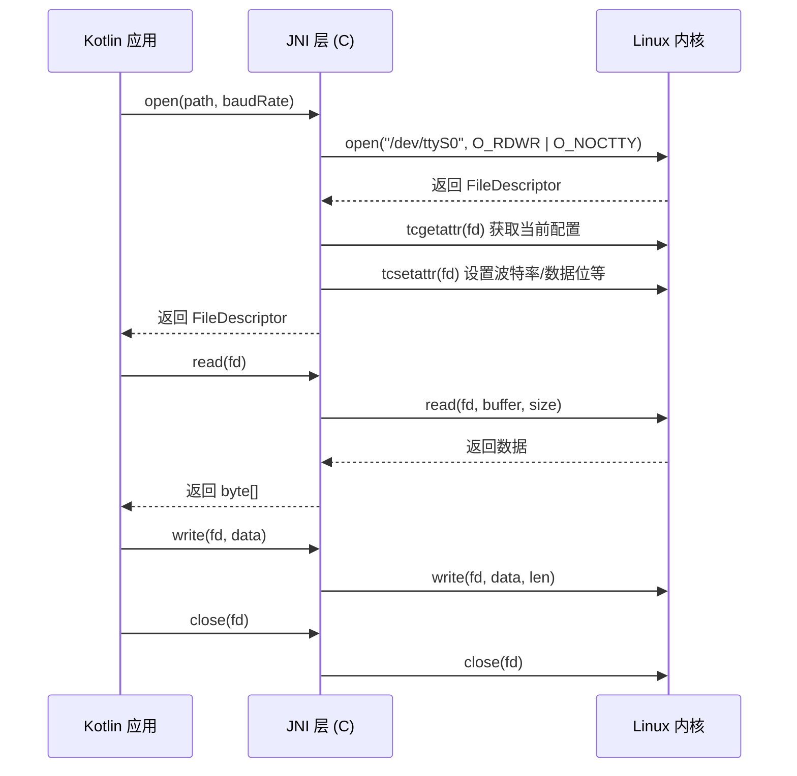

# 原生串口方案（JNI）

## 方案概述

原生串口方案通过 JNI 调用 Linux POSIX API 直接操作 `/dev/ttyS*` 设备文件。此方案需要 root 权限，适用于定制化 Android 主板（工控板、车机、自助终端等）场景。


## 适用场景分析

| 场景 | 说明 | 示例 |
|------|------|------|
| 工控主板 | 板载 UART 接口直连外设 | RK3288/RK3399 开发板 |
| 车载系统 | 车机与 CAN 总线转串口模块 | 车载导航/HUD |
| 自助终端 | 固定硬件平台，长期运行 | 自助售货机、收银台 |
| 定制 ROM | 系统级应用有特殊权限 | 定制 Android 系统 |

**何时选择此方案**：

- 设备已 root 或为定制系统级应用
- 硬件有板载 UART 接口
- 对延迟有极致要求（省去 USB 协议栈开销）
- 不需要支持多种设备型号

## android-serialport-api 原理

### JNI 层核心调用

JNI 层的核心是调用 POSIX 标准的串口 API，处理流程如下：



### termios 结构体配置

`termios` 是 POSIX 标准中用于配置串口参数的结构体：

| 配置项 | 字段 | 说明 |
|--------|------|------|
| 波特率 | `c_cflag` + `cfsetispeed/cfsetospeed` | B9600, B115200 等 |
| 数据位 | `c_cflag` & `CS5~CS8` | 5~8 位 |
| 停止位 | `c_cflag` & `CSTOPB` | 1 或 2 停止位 |
| 校验位 | `c_cflag` & `PARENB/PARODD` | 无/奇/偶校验 |
| 流控制 | `c_cflag` & `CRTSCTS` | 硬件流控 |
| 原始模式 | `c_lflag` & `ICANON` | 关闭行缓冲 |

## Kotlin 封装实现

```kotlin
import android.util.Log
import java.io.File
import java.io.FileDescriptor
import java.io.FileInputStream
import java.io.FileOutputStream
import java.io.IOException

/**
 * 原生串口封装类
 * 依赖 android-serialport-api 的 JNI .so 库
 */
class NativeSerialPort(
    private val devicePath: String,
    private val baudRate: Int,
    private val dataBits: Int = 8,
    private val stopBits: Int = 1,
    private val parity: Char = 'N',
    private val flags: Int = 0
) : AutoCloseable {

    private var fileDescriptor: FileDescriptor? = null
    var inputStream: FileInputStream? = null
        private set
    var outputStream: FileOutputStream? = null
        private set

    init {
        val device = File(devicePath)
        if (!device.exists()) {
            throw IOException("串口设备不存在: $devicePath")
        }

        if (!device.canRead() || !device.canWrite()) {
            try {
                val process = Runtime.getRuntime().exec(
                    arrayOf("su", "-c", "chmod 666 $devicePath")
                )
                val exitValue = process.waitFor()
                if (exitValue != 0) {
                    throw SecurityException("无法获取串口 $devicePath 的读写权限，请确认设备已 root")
                }
            } catch (e: IOException) {
                throw SecurityException("执行 su 命令失败，设备可能未 root: ${e.message}")
            }
        }

        fileDescriptor = nativeOpen(devicePath, baudRate, dataBits, stopBits, parity.code, flags)
            ?: throw IOException("无法打开串口: $devicePath (baudRate=$baudRate)")

        inputStream = FileInputStream(fileDescriptor)
        outputStream = FileOutputStream(fileDescriptor)
        Log.d(TAG, "串口已打开: $devicePath, 波特率: $baudRate, 格式: $dataBits${parity}$stopBits")
    }

    fun send(data: ByteArray) {
        outputStream?.write(data)
        outputStream?.flush()
    }

    override fun close() {
        try {
            inputStream?.close()
        } catch (_: IOException) {}
        try {
            outputStream?.close()
        } catch (_: IOException) {}
        fileDescriptor?.let { nativeClose(it) }
        Log.d(TAG, "串口已关闭: $devicePath")
    }

    private external fun nativeOpen(
        path: String,
        baudRate: Int,
        dataBits: Int,
        stopBits: Int,
        parity: Int,
        flags: Int
    ): FileDescriptor?

    private external fun nativeClose(fd: FileDescriptor)

    companion object {
        private const val TAG = "NativeSerialPort"

        init {
            System.loadLibrary("serial_port")
        }
    }
}
```

## 设备节点权限处理

### su chmod 方式

适用于已 root 的设备，在应用运行时动态修改设备文件权限：

```kotlin
fun grantSerialPermission(devicePath: String): Boolean {
    return try {
        val process = Runtime.getRuntime().exec(
            arrayOf("su", "-c", "chmod 666 $devicePath")
        )
        process.waitFor() == 0
    } catch (e: Exception) {
        Log.e("SerialPort", "权限获取失败: ${e.message}")
        false
    }
}
```

### SELinux 策略配置

在定制 ROM 或系统级应用中，SELinux 可能阻止串口访问即使有文件权限：

```
# 查看 SELinux 拒绝日志
adb shell dmesg | grep avc | grep ttyS

# 临时设置为宽容模式（仅调试用）
adb shell setenforce 0

# 永久解决：在设备的 sepolicy 中添加规则
# file: device/manufacturer/product/sepolicy/app.te
allow untrusted_app serial_device:chr_file { open read write ioctl };
```

> **注意**：`setenforce 0` 仅用于调试阶段。生产环境必须通过正式的 SELinux 策略配置来授权。

### init.rc 配置（系统开发场景）

在定制系统中，可通过 init.rc 在启动时预设串口权限：

```
# 在 init.rc 或设备相关的 .rc 文件中添加
on boot
    chmod 0666 /dev/ttyS0
    chmod 0666 /dev/ttyS1
    chown system system /dev/ttyS0
    chown system system /dev/ttyS1
```

## 常见设备节点路径

| 设备节点 | 说明 | 常见平台 |
|---------|------|---------|
| `/dev/ttyS0` ~ `/dev/ttyS3` | 板载 UART | RK3288, RK3399, 全志 |
| `/dev/ttyUSB0` ~ `/dev/ttyUSBN` | USB 转串口设备 | 通用 |
| `/dev/ttyACM0` | USB CDC/ACM 设备 | STM32 等 MCU |
| `/dev/ttyMT0` ~ `/dev/ttyMT3` | MTK 平台串口 | 联发科平台 |
| `/dev/ttyHSL0` | 高通平台高速串口 | 高通骁龙平台 |
| `/dev/ttyGS0` | USB Gadget 串口 | USB 从设备模式 |

**列出设备可用的串口节点**：

```bash
# 查看所有串口设备
ls -l /dev/ttyS*
ls -l /dev/ttyUSB*

# 查看已注册的串口驱动
cat /proc/tty/drivers

# 查看串口设备信息
cat /proc/tty/driver/serial
```

## NDK 编译与 .so 集成

### CMakeLists.txt 配置

```cmake
cmake_minimum_required(VERSION 3.10)
project(serial_port)

add_library(serial_port SHARED
    src/main/cpp/SerialPort.c
)

target_link_libraries(serial_port
    log
)
```

### JNI C 层核心代码

```c
#include <jni.h>
#include <fcntl.h>
#include <termios.h>
#include <unistd.h>
#include <android/log.h>

#define TAG "SerialPortJNI"
#define LOGE(...) __android_log_print(ANDROID_LOG_ERROR, TAG, __VA_ARGS__)

static speed_t getBaudRate(int baudRate) {
    switch (baudRate) {
        case 9600:   return B9600;
        case 19200:  return B19200;
        case 38400:  return B38400;
        case 57600:  return B57600;
        case 115200: return B115200;
        case 230400: return B230400;
        case 460800: return B460800;
        case 921600: return B921600;
        default:     return B115200;
    }
}

JNIEXPORT jobject JNICALL
Java_com_example_serial_NativeSerialPort_nativeOpen(
    JNIEnv *env, jobject thiz,
    jstring path, jint baudRate,
    jint dataBits, jint stopBits,
    jint parity, jint flags
) {
    const char *path_str = (*env)->GetStringUTFChars(env, path, NULL);
    int fd = open(path_str, O_RDWR | O_NOCTTY | O_NONBLOCK);
    (*env)->ReleaseStringUTFChars(env, path, path_str);

    if (fd < 0) {
        LOGE("Cannot open port: %s", path_str);
        return NULL;
    }

    struct termios cfg;
    if (tcgetattr(fd, &cfg)) {
        close(fd);
        return NULL;
    }

    cfmakeraw(&cfg);
    cfsetispeed(&cfg, getBaudRate(baudRate));
    cfsetospeed(&cfg, getBaudRate(baudRate));

    // 数据位
    cfg.c_cflag &= ~CSIZE;
    switch (dataBits) {
        case 5: cfg.c_cflag |= CS5; break;
        case 6: cfg.c_cflag |= CS6; break;
        case 7: cfg.c_cflag |= CS7; break;
        default: cfg.c_cflag |= CS8; break;
    }

    // 停止位
    if (stopBits == 2) cfg.c_cflag |= CSTOPB;
    else cfg.c_cflag &= ~CSTOPB;

    // 校验位
    switch (parity) {
        case 'O': case 'o':
            cfg.c_cflag |= (PARENB | PARODD);
            break;
        case 'E': case 'e':
            cfg.c_cflag |= PARENB;
            cfg.c_cflag &= ~PARODD;
            break;
        default:
            cfg.c_cflag &= ~PARENB;
            break;
    }

    cfg.c_cflag |= (CLOCAL | CREAD);

    if (tcsetattr(fd, TCSANOW, &cfg)) {
        close(fd);
        return NULL;
    }

    jclass fdClass = (*env)->FindClass(env, "java/io/FileDescriptor");
    jmethodID fdInit = (*env)->GetMethodID(env, fdClass, "<init>", "()V");
    jfieldID fdField = (*env)->GetFieldID(env, fdClass, "descriptor", "I");
    jobject fdObj = (*env)->NewObject(env, fdClass, fdInit);
    (*env)->SetIntField(env, fdObj, fdField, fd);

    return fdObj;
}

JNIEXPORT void JNICALL
Java_com_example_serial_NativeSerialPort_nativeClose(
    JNIEnv *env, jobject thiz, jobject fileDescriptor
) {
    jclass fdClass = (*env)->FindClass(env, "java/io/FileDescriptor");
    jfieldID fdField = (*env)->GetFieldID(env, fdClass, "descriptor", "I");
    int fd = (*env)->GetIntField(env, fileDescriptor, fdField);
    close(fd);
}
```

### ABI 兼容性

在 `build.gradle.kts` 中配置目标 ABI：

```kotlin
android {
    defaultConfig {
        ndk {
            abiFilters += listOf("armeabi-v7a", "arm64-v8a", "x86_64")
        }
    }
}
```

| ABI | 适用平台 | 说明 |
|-----|---------|------|
| armeabi-v7a | 32 位 ARM | 兼容性最广 |
| arm64-v8a | 64 位 ARM | 现代 Android 设备主流 |
| x86_64 | x86 模拟器 | 开发调试用 |

## 使用示例

```kotlin
// 打开串口
val serialPort = NativeSerialPort("/dev/ttyS1", 115200)

// 启动读取协程
val readJob = lifecycleScope.launch(Dispatchers.IO) {
    val buffer = ByteArray(1024)
    while (isActive) {
        val size = serialPort.inputStream?.read(buffer) ?: break
        if (size > 0) {
            val received = buffer.copyOf(size)
            handleReceivedData(received)
        }
    }
}

// 发送数据
serialPort.send(byteArrayOf(0x01, 0x03, 0x00, 0x00, 0x00, 0x0A))

// 退出时关闭
readJob.cancel()
serialPort.close()
```

## 踩坑记录

> 此区域供团队成员补充项目中遇到的真实案例。

| 日期 | 记录人 | 问题描述 | 解决方案 |
|------|--------|----------|----------|
| | | | |

## 参考资料

- [android-serialport-api - GitHub](https://github.com/cereal-killers/android-serialport-api)
- [Android NDK 官方文档](https://developer.android.com/ndk)
- [Linux termios 手册](https://man7.org/linux/man-pages/man3/termios.3.html)
- [USB 设备管理与权限](05-USB设备管理与权限usb-device-and-permissions.md) — 本模块下一篇
