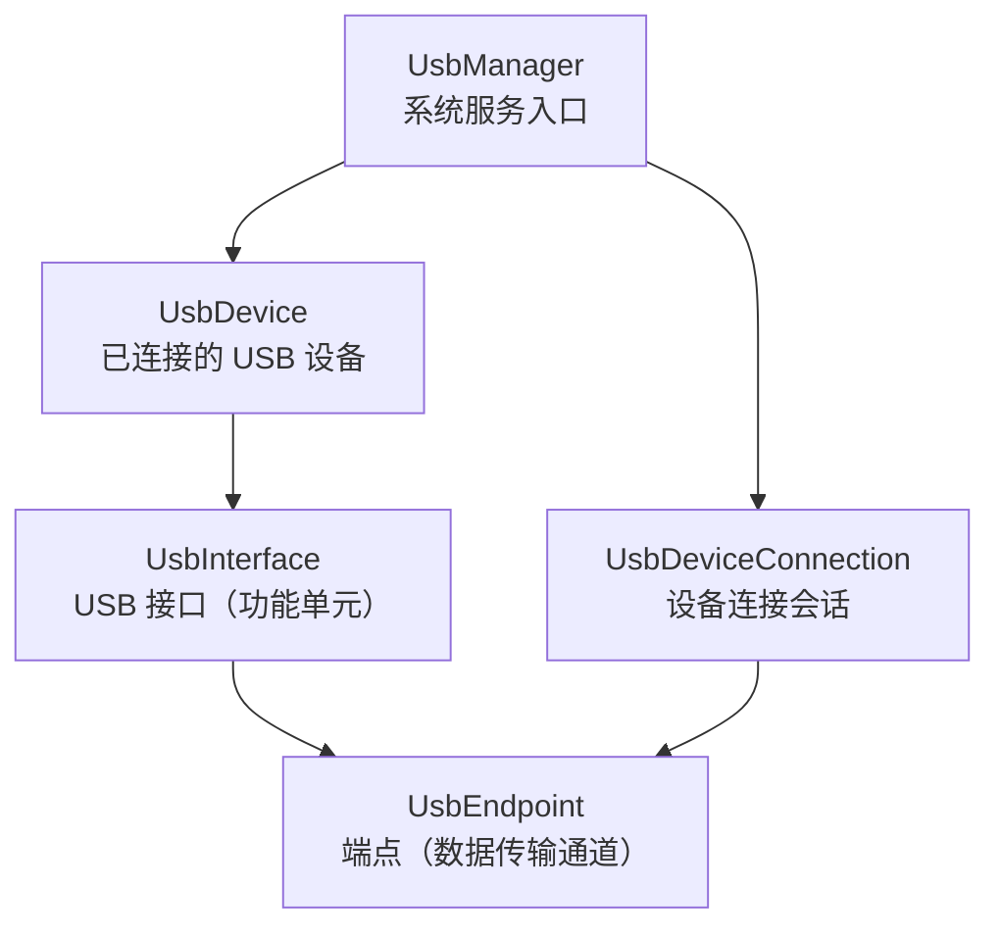
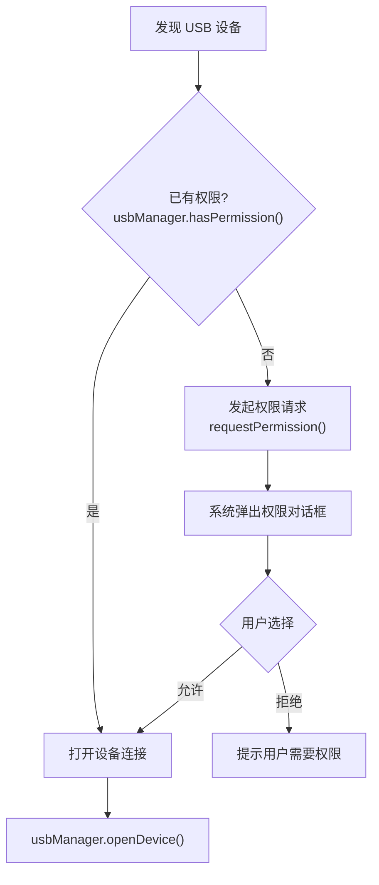
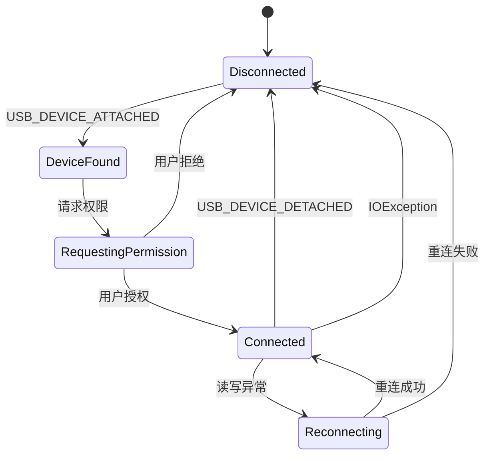

# USB 设备管理与权限

## Android USB Host API 全景

Android USB Host API 允许应用作为 USB 主机（Host）与 USB 外设通信。理解其核心类的层级关系是正确管理 USB 设备的基础：



| 类 | 职责 |
|----|------|
| `UsbManager` | 系统服务，枚举设备、请求权限、打开连接 |
| `UsbDevice` | 表示一个已连接的 USB 设备，包含 VID/PID 等信息 |
| `UsbInterface` | 设备的功能接口，一个设备可有多个接口 |
| `UsbEndpoint` | 数据传输的端点，分为 IN（设备→主机）和 OUT（主机→设备） |
| `UsbDeviceConnection` | 与设备的活跃连接，用于数据传输 |

## 设备过滤器配置

### device_filter.xml

在 `res/xml/` 下创建设备过滤器，系统据此在 USB 设备插入时自动匹配并通知你的应用：

```xml
<?xml version="1.0" encoding="utf-8"?>
<resources>
    <!-- CH340/CH341 -->
    <usb-device vendor-id="6790" product-id="29987" />
    <!-- CP210x -->
    <usb-device vendor-id="4292" product-id="60000" />
    <!-- FTDI FT232R -->
    <usb-device vendor-id="1027" product-id="24577" />
    <!-- PL2303 -->
    <usb-device vendor-id="1659" product-id="8963" />
    <!-- 通配：匹配所有 USB 设备（开发调试用，生产环境不推荐） -->
    <!-- <usb-device /> -->
</resources>
```

> **注意**：`vendor-id` 和 `product-id` 使用 **十进制** 值。0x1A86 = 6790，0x7523 = 29987。

### AndroidManifest.xml 注册

```xml
<activity android:name=".MainActivity"
    android:exported="true">
    <intent-filter>
        <action android:name="android.intent.action.MAIN" />
        <category android:name="android.intent.category.LAUNCHER" />
    </intent-filter>

    <!-- USB 设备插入时自动打开此 Activity -->
    <intent-filter>
        <action android:name="android.hardware.usb.action.USB_DEVICE_ATTACHED" />
    </intent-filter>
    <meta-data
        android:name="android.hardware.usb.action.USB_DEVICE_ATTACHED"
        android:resource="@xml/device_filter" />
</activity>
```

配置后的行为：当匹配的 USB 设备插入时，系统会弹出对话框询问是否使用你的应用打开该设备。

## USB 权限模型

### 权限请求流程



### 权限广播接收器

```kotlin
import android.app.PendingIntent
import android.content.BroadcastReceiver
import android.content.Context
import android.content.Intent
import android.content.IntentFilter
import android.hardware.usb.UsbDevice
import android.hardware.usb.UsbManager
import android.os.Build

class UsbPermissionManager(private val context: Context) {

    companion object {
        private const val ACTION_USB_PERMISSION = "com.example.USB_PERMISSION"
    }

    private var callback: ((granted: Boolean, device: UsbDevice?) -> Unit)? = null

    private val receiver = object : BroadcastReceiver() {
        override fun onReceive(ctx: Context, intent: Intent) {
            if (intent.action == ACTION_USB_PERMISSION) {
                val device = intent.getParcelableExtra<UsbDevice>(UsbManager.EXTRA_DEVICE)
                val granted = intent.getBooleanExtra(UsbManager.EXTRA_PERMISSION_GRANTED, false)
                callback?.invoke(granted, device)
                callback = null
            }
        }
    }

    fun register() {
        val filter = IntentFilter(ACTION_USB_PERMISSION)
        if (Build.VERSION.SDK_INT >= Build.VERSION_CODES.TIRAMISU) {
            context.registerReceiver(receiver, filter, Context.RECEIVER_NOT_EXPORTED)
        } else {
            context.registerReceiver(receiver, filter)
        }
    }

    fun unregister() {
        try {
            context.unregisterReceiver(receiver)
        } catch (_: IllegalArgumentException) {}
    }

    fun requestPermission(
        usbManager: UsbManager,
        device: UsbDevice,
        onResult: (granted: Boolean, device: UsbDevice?) -> Unit
    ) {
        if (usbManager.hasPermission(device)) {
            onResult(true, device)
            return
        }

        callback = onResult

        val flags = if (Build.VERSION.SDK_INT >= Build.VERSION_CODES.S) {
            PendingIntent.FLAG_UPDATE_CURRENT or PendingIntent.FLAG_MUTABLE
        } else {
            PendingIntent.FLAG_UPDATE_CURRENT
        }

        val pendingIntent = PendingIntent.getBroadcast(
            context, 0, Intent(ACTION_USB_PERMISSION), flags
        )
        usbManager.requestPermission(device, pendingIntent)
    }
}
```

### "记住选择"与持久化权限

当用户勾选"始终允许此 USB 设备"时，系统会记住该权限绑定关系。但需注意：

| 行为 | 说明 |
|------|------|
| 记住后自动授权 | 下次插入同一设备时不再弹窗 |
| 应用卸载后清除 | 重新安装需重新授权 |
| 不同 USB 口可能失效 | 部分设备更换 USB 口后被识别为新设备 |
| 恢复出厂设置清除 | 所有持久化权限被清除 |

## 热插拔生命周期管理

### USB_DEVICE_ATTACHED

```kotlin
private val attachReceiver = object : BroadcastReceiver() {
    override fun onReceive(context: Context, intent: Intent) {
        if (intent.action == UsbManager.ACTION_USB_DEVICE_ATTACHED) {
            val device = intent.getParcelableExtra<UsbDevice>(UsbManager.EXTRA_DEVICE)
            device?.let { onDeviceAttached(it) }
        }
    }
}

private fun onDeviceAttached(device: UsbDevice) {
    Log.i(TAG, "USB 设备插入: ${device.deviceName} VID=${device.vendorId} PID=${device.productId}")
    // 请求权限 → 打开连接
}
```

### USB_DEVICE_DETACHED

```kotlin
private val detachReceiver = object : BroadcastReceiver() {
    override fun onReceive(context: Context, intent: Intent) {
        if (intent.action == UsbManager.ACTION_USB_DEVICE_DETACHED) {
            val device = intent.getParcelableExtra<UsbDevice>(UsbManager.EXTRA_DEVICE)
            device?.let { onDeviceDetached(it) }
        }
    }
}

private fun onDeviceDetached(device: UsbDevice) {
    Log.w(TAG, "USB 设备拔出: ${device.deviceName}")
    // 立即关闭串口连接、释放资源、更新 UI 状态
    closeSerialConnection()
}
```

### 连接状态机

完整的 USB 设备连接生命周期应由状态机管理：



```kotlin
enum class UsbConnectionState {
    DISCONNECTED,
    DEVICE_FOUND,
    REQUESTING_PERMISSION,
    CONNECTED,
    RECONNECTING
}

class UsbConnectionStateMachine {
    private val _state = MutableStateFlow(UsbConnectionState.DISCONNECTED)
    val state: StateFlow<UsbConnectionState> = _state.asStateFlow()

    fun onDeviceAttached() {
        _state.value = UsbConnectionState.DEVICE_FOUND
    }

    fun onPermissionRequested() {
        _state.value = UsbConnectionState.REQUESTING_PERMISSION
    }

    fun onPermissionGranted() {
        _state.value = UsbConnectionState.CONNECTED
    }

    fun onPermissionDenied() {
        _state.value = UsbConnectionState.DISCONNECTED
    }

    fun onDeviceDetached() {
        _state.value = UsbConnectionState.DISCONNECTED
    }

    fun onError() {
        _state.value = UsbConnectionState.RECONNECTING
    }

    fun onReconnected() {
        _state.value = UsbConnectionState.CONNECTED
    }

    fun onReconnectFailed() {
        _state.value = UsbConnectionState.DISCONNECTED
    }
}
```

## Android 版本差异

| Android 版本 | API | 变化 | 适配方式 |
|-------------|-----|------|---------|
| 3.1+ | 12 | 首次引入 USB Host API | 最低支持版本 |
| 10 | 29 | 新增 `UsbDevice.getSerialNumber()` 需权限 | 先请求权限再获取 |
| 12 | 31 | `PendingIntent` 必须声明 `FLAG_MUTABLE` 或 `FLAG_IMMUTABLE` | 按版本分支处理 |
| 13 | 33 | `registerReceiver()` 必须指定 `RECEIVER_EXPORTED` 或 `RECEIVER_NOT_EXPORTED` | 使用新 API |
| 14 | 34 | 前台服务类型声明更严格 | 使用 `connectedDevice` 类型 |

```kotlin
// PendingIntent 版本适配
val flags = if (Build.VERSION.SDK_INT >= Build.VERSION_CODES.S) {
    PendingIntent.FLAG_UPDATE_CURRENT or PendingIntent.FLAG_MUTABLE
} else {
    PendingIntent.FLAG_UPDATE_CURRENT
}

// 广播接收器版本适配
if (Build.VERSION.SDK_INT >= Build.VERSION_CODES.TIRAMISU) {
    context.registerReceiver(receiver, filter, Context.RECEIVER_NOT_EXPORTED)
} else {
    context.registerReceiver(receiver, filter)
}
```

## 设备唯一标识与持久化

### 获取设备序列号

```kotlin
fun getDeviceIdentifier(device: UsbDevice, connection: UsbDeviceConnection?): String {
    val serialNumber = try {
        if (Build.VERSION.SDK_INT >= Build.VERSION_CODES.LOLLIPOP) {
            device.serialNumber
        } else {
            connection?.serial
        }
    } catch (_: SecurityException) {
        null
    }

    return if (serialNumber != null) {
        "${device.vendorId}:${device.productId}:$serialNumber"
    } else {
        "${device.vendorId}:${device.productId}:${device.deviceName}"
    }
}
```

### 配置持久化

将设备的串口配置（波特率、数据位等）与设备标识绑定，下次连接自动恢复：

```kotlin
class DeviceConfigStore(context: Context) {
    private val prefs = context.getSharedPreferences("serial_device_config", Context.MODE_PRIVATE)

    fun saveConfig(deviceId: String, config: SerialConfig) {
        prefs.edit()
            .putInt("${deviceId}_baudRate", config.baudRate)
            .putInt("${deviceId}_dataBits", config.dataBits)
            .putInt("${deviceId}_stopBits", config.stopBits)
            .putInt("${deviceId}_parity", config.parity)
            .apply()
    }

    fun loadConfig(deviceId: String): SerialConfig? {
        val baudRate = prefs.getInt("${deviceId}_baudRate", -1)
        if (baudRate == -1) return null
        return SerialConfig(
            baudRate = baudRate,
            dataBits = prefs.getInt("${deviceId}_dataBits", 8),
            stopBits = prefs.getInt("${deviceId}_stopBits", 1),
            parity = prefs.getInt("${deviceId}_parity", 0)
        )
    }
}
```

## 后台 Service 中的 USB 设备管理

在需要后台持续串口通信的场景（如数据采集、设备监控），需使用 Foreground Service：

```kotlin
class SerialService : Service() {

    private var serialManager: UsbSerialManager? = null

    override fun onCreate() {
        super.onCreate()
        startForeground(NOTIFICATION_ID, createNotification())
    }

    override fun onStartCommand(intent: Intent?, flags: Int, startId: Int): Int {
        when (intent?.action) {
            ACTION_CONNECT -> connectDevice()
            ACTION_DISCONNECT -> disconnectDevice()
        }
        return START_STICKY
    }

    private fun connectDevice() {
        val usbManager = getSystemService(USB_SERVICE) as UsbManager
        serialManager = UsbSerialManager(usbManager).apply {
            open()
        }
    }

    private fun disconnectDevice() {
        serialManager?.close()
        serialManager = null
    }

    override fun onBind(intent: Intent?) = binder

    companion object {
        const val ACTION_CONNECT = "connect"
        const val ACTION_DISCONNECT = "disconnect"
        private const val NOTIFICATION_ID = 1
    }
}
```

AndroidManifest.xml 配置（Android 14+）：

```xml
<service
    android:name=".SerialService"
    android:foregroundServiceType="connectedDevice"
    android:exported="false" />
```

需要的权限：

```xml
<uses-permission android:name="android.permission.FOREGROUND_SERVICE" />
<uses-permission android:name="android.permission.FOREGROUND_SERVICE_CONNECTED_DEVICE" />
<uses-feature android:name="android.hardware.usb.host" android:required="true" />
```

## 踩坑记录

> 此区域供团队成员补充项目中遇到的真实案例。

| 日期 | 记录人 | 问题描述 | 解决方案 |
|------|--------|----------|----------|
| | | | |

## 参考资料

- [Android USB Host API 官方文档](https://developer.android.com/develop/connectivity/usb/host)
- [Android 前台服务文档](https://developer.android.com/develop/background-work/services/foreground-services)
- [通信架构设计](06-通信架构设计communication-architecture.md) — 本模块下一篇
