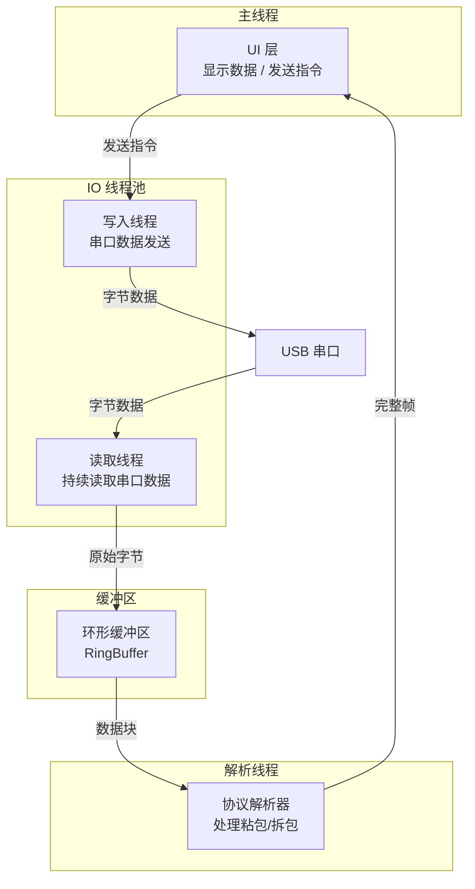
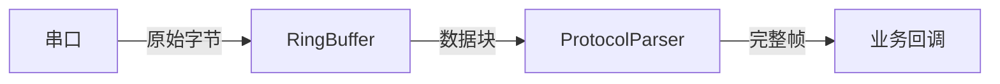
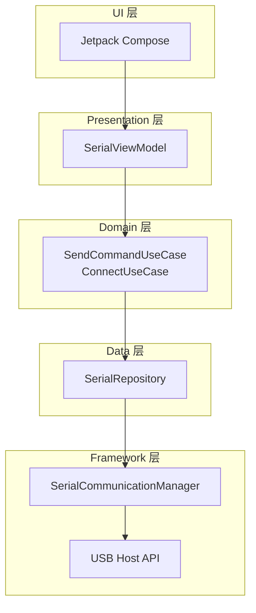

# 通信架构设计

## 推荐线程模型

串口通信涉及持续 IO 操作，必须合理分配线程职责以保证 UI 流畅和数据不丢失：



**设计原则**：

1. **读取线程**只负责从串口收数据写入缓冲区，不做任何解析
2. **解析线程**从缓冲区取数据，运行状态机解析，输出完整帧
3. **写入线程**负责数据发送，避免阻塞主线程
4. **主线程**只处理 UI 更新和用户交互

## 环形缓冲区设计

### 为什么需要环形缓冲区

- **读取线程与解析线程解耦**：读取速度和解析速度不一致时，缓冲区作为调节器
- **应对突发数据**：短时大量数据到来时不会丢失
- **固定内存占用**：不会因数据堆积导致内存无限增长

### 线程安全 RingBuffer 实现

```kotlin
/**
 * 线程安全的环形缓冲区
 * 用于串口接收线程与解析线程之间的数据传递
 */
class RingBuffer(private val capacity: Int = 8192) {

    private val buffer = ByteArray(capacity)
    private var writePos = 0
    private var readPos = 0
    private var count = 0
    private val lock = Any()

    fun write(data: ByteArray, offset: Int = 0, length: Int = data.size) {
        synchronized(lock) {
            for (i in offset until offset + length) {
                if (count == capacity) {
                    readPos = (readPos + 1) % capacity
                    count--
                }
                buffer[writePos] = data[i]
                writePos = (writePos + 1) % capacity
                count++
            }
        }
    }

    fun readAll(): ByteArray {
        synchronized(lock) {
            if (count == 0) return ByteArray(0)
            val result = ByteArray(count)
            for (i in 0 until count) {
                result[i] = buffer[(readPos + i) % capacity]
            }
            readPos = (readPos + count) % capacity
            count = 0
            return result
        }
    }

    fun read(dest: ByteArray, maxLength: Int = dest.size): Int {
        synchronized(lock) {
            val toRead = minOf(count, maxLength)
            for (i in 0 until toRead) {
                dest[i] = buffer[(readPos + i) % capacity]
            }
            readPos = (readPos + toRead) % capacity
            count -= toRead
            return toRead
        }
    }

    val available: Int get() = synchronized(lock) { count }

    fun clear() {
        synchronized(lock) {
            writePos = 0
            readPos = 0
            count = 0
        }
    }
}
```

## Kotlin 协程异步读写模式

### Flow 方式（推荐）

使用 `SharedFlow` 将串口数据转换为响应式数据流：

```kotlin
import kotlinx.coroutines.*
import kotlinx.coroutines.flow.MutableSharedFlow
import kotlinx.coroutines.flow.SharedFlow

class SerialPortIO(
    private val port: UsbSerialPort,
    private val scope: CoroutineScope
) {
    private val _dataFlow = MutableSharedFlow<ByteArray>(extraBufferCapacity = 64)
    val dataFlow: SharedFlow<ByteArray> = _dataFlow

    private var readJob: Job? = null

    fun startReading(bufferSize: Int = 4096) {
        readJob = scope.launch(Dispatchers.IO) {
            val buffer = ByteArray(bufferSize)
            while (isActive && port.isOpen) {
                try {
                    val bytesRead = port.read(buffer, 200)
                    if (bytesRead > 0) {
                        _dataFlow.emit(buffer.copyOf(bytesRead))
                    }
                } catch (e: IOException) {
                    if (isActive) break
                }
            }
        }
    }

    fun stopReading() {
        readJob?.cancel()
        readJob = null
    }

    fun send(data: ByteArray) {
        scope.launch(Dispatchers.IO) {
            port.write(data, 1000)
        }
    }
}
```

### Channel 方式

使用 `Channel` 作为生产者-消费者管道，适合需要背压控制的场景：

```kotlin
import kotlinx.coroutines.channels.Channel

class SerialPortChannel(
    private val port: UsbSerialPort,
    private val scope: CoroutineScope
) {
    val dataChannel = Channel<ByteArray>(capacity = Channel.BUFFERED)

    fun startReading() {
        scope.launch(Dispatchers.IO) {
            val buffer = ByteArray(4096)
            while (isActive && port.isOpen) {
                val bytesRead = port.read(buffer, 200)
                if (bytesRead > 0) {
                    dataChannel.send(buffer.copyOf(bytesRead))
                }
            }
        }
    }

    fun close() {
        dataChannel.close()
    }
}

// 消费端
scope.launch {
    for (data in serialChannel.dataChannel) {
        parser.feed(data)
    }
}
```

**Flow vs Channel 选型**：

| 维度 | SharedFlow | Channel |
|------|-----------|---------|
| 多订阅者 | 支持（多个 collector） | 单消费者 |
| 背压 | extraBufferCapacity 控制 | 内置背压 |
| 数据丢失 | 可能（buffer 满时丢弃） | 不丢失（阻塞生产者） |
| 推荐场景 | UI 数据展示、日志 | 协议解析管道 |

## 协议解析器抽象

### 策略模式

将协议解析抽象为接口，支持运行时切换不同协议：

```kotlin
interface SerialProtocolParser {
    fun feed(data: ByteArray)
    fun reset()
}

/**
 * 原始数据透传解析器（不做任何解析）
 */
class RawParser(
    private val onData: (ByteArray) -> Unit
) : SerialProtocolParser {
    override fun feed(data: ByteArray) = onData(data)
    override fun reset() {}
}

/**
 * 换行符分隔的文本协议解析器
 */
class LineParser(
    private val onLine: (String) -> Unit
) : SerialProtocolParser {
    private val builder = StringBuilder()

    override fun feed(data: ByteArray) {
        val text = String(data, Charsets.UTF_8)
        for (char in text) {
            if (char == '\n') {
                val line = builder.toString().trimEnd('\r')
                if (line.isNotEmpty()) onLine(line)
                builder.clear()
            } else {
                builder.append(char)
            }
        }
    }

    override fun reset() = builder.clear()
}
```

### 解析器与缓冲区的集成



## 串口通信 Manager 整合设计

将设备管理、连接管理、读写和协议解析整合到一个管理器中：

```kotlin
class SerialCommunicationManager(
    private val usbManager: UsbManager,
    private val scope: CoroutineScope
) {
    private var connection: UsbDeviceConnection? = null
    private var port: UsbSerialPort? = null
    private var readJob: Job? = null
    private var parser: SerialProtocolParser? = null
    private val ringBuffer = RingBuffer(capacity = 16384)

    private val _connectionState = MutableStateFlow(ConnectionState.DISCONNECTED)
    val connectionState: StateFlow<ConnectionState> = _connectionState.asStateFlow()

    private val _receivedFrames = MutableSharedFlow<FrameData>(extraBufferCapacity = 64)
    val receivedFrames: SharedFlow<FrameData> = _receivedFrames

    fun setParser(parser: SerialProtocolParser) {
        this.parser = parser
    }

    fun connect(config: SerialConfig = SerialConfig()) {
        val drivers = UsbSerialProber.getDefaultProber().findAllDrivers(usbManager)
        if (drivers.isEmpty()) {
            _connectionState.value = ConnectionState.ERROR
            return
        }

        val driver = drivers[0]
        connection = usbManager.openDevice(driver.device)
            ?: throw SecurityException("USB 权限未授予")

        port = driver.ports[0].apply {
            open(connection)
            setParameters(config.baudRate, config.dataBits, config.stopBits, config.parity)
            dtr = config.dtr
            rts = config.rts
        }

        _connectionState.value = ConnectionState.CONNECTED
        startReading()
    }

    private fun startReading() {
        readJob = scope.launch(Dispatchers.IO) {
            val buffer = ByteArray(4096)
            while (isActive && port?.isOpen == true) {
                try {
                    val bytesRead = port?.read(buffer, 100) ?: 0
                    if (bytesRead > 0) {
                        val data = buffer.copyOf(bytesRead)
                        ringBuffer.write(data)
                        parser?.feed(data)
                    }
                } catch (e: IOException) {
                    _connectionState.value = ConnectionState.ERROR
                    break
                }
            }
        }
    }

    fun send(data: ByteArray) {
        scope.launch(Dispatchers.IO) {
            try {
                port?.write(data, 1000)
            } catch (e: IOException) {
                _connectionState.value = ConnectionState.ERROR
            }
        }
    }

    fun disconnect() {
        readJob?.cancel()
        port?.close()
        connection?.close()
        parser?.reset()
        ringBuffer.clear()
        _connectionState.value = ConnectionState.DISCONNECTED
    }
}

enum class ConnectionState {
    DISCONNECTED, CONNECTED, ERROR
}

data class SerialConfig(
    val baudRate: Int = 115200,
    val dataBits: Int = UsbSerialPort.DATABITS_8,
    val stopBits: Int = UsbSerialPort.STOPBITS_1,
    val parity: Int = UsbSerialPort.PARITY_NONE,
    val dtr: Boolean = false,
    val rts: Boolean = false
)

data class FrameData(
    val command: Byte,
    val sequence: Byte,
    val payload: ByteArray,
    val timestamp: Long = System.currentTimeMillis()
)
```

## 与 MVVM / Clean Architecture 集成

### 分层架构图



### Repository 层

```kotlin
class SerialRepository(
    private val manager: SerialCommunicationManager
) {
    val connectionState: StateFlow<ConnectionState> = manager.connectionState
    val receivedFrames: SharedFlow<FrameData> = manager.receivedFrames

    fun connect(config: SerialConfig) = manager.connect(config)
    fun disconnect() = manager.disconnect()
    fun send(data: ByteArray) = manager.send(data)
}
```

### ViewModel 层

```kotlin
class SerialViewModel(
    private val repository: SerialRepository
) : ViewModel() {

    val connectionState = repository.connectionState
        .stateIn(viewModelScope, SharingStarted.WhileSubscribed(5000), ConnectionState.DISCONNECTED)

    private val _receivedData = MutableStateFlow<List<String>>(emptyList())
    val receivedData: StateFlow<List<String>> = _receivedData.asStateFlow()

    init {
        viewModelScope.launch {
            repository.receivedFrames.collect { frame ->
                val hex = frame.payload.toHexString()
                _receivedData.update { current ->
                    (current + "[RX] CMD=${"%02X".format(frame.command)} DATA=$hex")
                        .takeLast(100)
                }
            }
        }
    }

    fun connect() {
        repository.connect(SerialConfig(baudRate = 115200))
    }

    fun disconnect() {
        repository.disconnect()
    }

    fun sendCommand(command: Command, data: ByteArray = byteArrayOf()) {
        val builder = FrameBuilder()
        val frame = builder.buildFrame(command, data)
        repository.send(frame)
    }
}
```

## Compose UI 集成示例

```kotlin
@Composable
fun SerialScreen(viewModel: SerialViewModel = viewModel()) {
    val connectionState by viewModel.connectionState.collectAsStateWithLifecycle()
    val receivedData by viewModel.receivedData.collectAsStateWithLifecycle()

    Column(modifier = Modifier.fillMaxSize().padding(16.dp)) {
        // 连接状态栏
        Row(verticalAlignment = Alignment.CenterVertically) {
            val (statusText, statusColor) = when (connectionState) {
                ConnectionState.CONNECTED -> "已连接" to Color.Green
                ConnectionState.ERROR -> "连接异常" to Color.Red
                else -> "未连接" to Color.Gray
            }
            Box(
                modifier = Modifier.size(12.dp).background(statusColor, CircleShape)
            )
            Spacer(modifier = Modifier.width(8.dp))
            Text(statusText)
        }

        Spacer(modifier = Modifier.height(8.dp))

        // 连接/断开按钮
        Row {
            Button(
                onClick = { viewModel.connect() },
                enabled = connectionState == ConnectionState.DISCONNECTED
            ) {
                Text("连接")
            }
            Spacer(modifier = Modifier.width(8.dp))
            Button(
                onClick = { viewModel.disconnect() },
                enabled = connectionState == ConnectionState.CONNECTED
            ) {
                Text("断开")
            }
        }

        Spacer(modifier = Modifier.height(16.dp))

        // 数据显示区
        LazyColumn(modifier = Modifier.weight(1f)) {
            items(receivedData) { line ->
                Text(
                    text = line,
                    fontFamily = FontFamily.Monospace,
                    fontSize = 12.sp
                )
            }
        }
    }
}
```

## 踩坑记录

> 此区域供团队成员补充项目中遇到的真实案例。

| 日期 | 记录人 | 问题描述 | 解决方案 |
|------|--------|----------|----------|
| | | | |

## 参考资料

- [Kotlin 协程官方文档](https://kotlinlang.org/docs/coroutines-overview.html)
- [Android 架构指南](https://developer.android.com/topic/architecture)
- [Jetpack Compose 状态管理](https://developer.android.com/develop/ui/compose/state)
- [多设备与通道管理](07-多设备与通道管理multi-device-management.md) — 本模块下一篇
